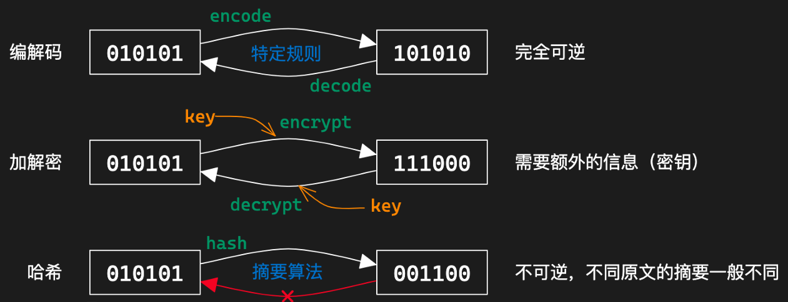
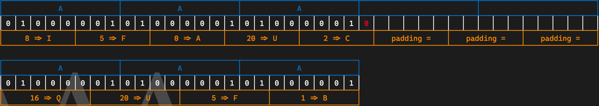

# Lec3-Misc

> 授课：郑俊达(Gooduck)

## 什么是Misc

+ Miscellaneous，即杂项，包含了一些不属于其他类别的题目
+ MISC = ALL - PWN - WEB - CRYPTO- REVERSE

### Misc题型

+ 
 隐写、取证、OSINT（信息搜集）、PPC（编程类） ——传统misc题

+ 游戏类题目、工具运用类题目
+ 
 编解码、古典密码  ——不那么crypto的crypto

+ 
 网络解谜、网站代码审计 ——不那么web的web

+ 
 代码审计、沙箱逃逸 ——不那么binary的binary

+ 
 Blockchain、IoT、AI ——新兴类别题目

### 如何学习misc？

+ 用于尝试学习新东西，许多题目需要快速入门/快速上手新工具
+ 思维活跃，大胆尝试
+ 一定的编程能力
    - **熟练掌握**Python或其他一门语言
+ 多做题

## 基础编解码知识

三种常见的01串转换方式

常用编解码工具：[CyberChef](https://gchq.github.io/CyberChef/) /[（TonyCrane ver.）](https://lab.tonycrane.cc/CyberChef/)

### 字符编码

+ 字符编码：人类理解的字符 $ \iff $ 计算机理解的01串 之间的映射
+ 出现乱码：用一种字符编码规则解读另一种字符编码的01串

常见的字符编码：

+ ASCII：一共 128 个项，即每个字符可以用一个7位的01串表示（或一字节）
    - 00-1F：制字符；20-7E：可见字符；7F：控制字符（DEL）
+ Latin-1（ISO-8859-1）：扩展了 ASCII，一共 256 个项
    - 80-9F：控制字符；A0-FF：可见字符
    - 特点：任何字节流都可以用其解码
+ 利用Unicode 字符集的一系列编码
    - UTF-8 / UTF-16 / UTF-32 / UCS
+ 中国国标字符集系列编码8
    - GB 2312 / GBK / GB 18030-202

### Unicode字符集与UTF编码

参考：[TonyCrane的笔记](https://note.tonycrane.cc/cs/unicode/)

以平面划分，有17个平面，每个平面65536个码位（2字节）

+ 通过码位可以表示为U+0000 ~ U+10FFFF
+ 可容纳111w+个字符，现有14w+字符（超过一半为CJK字符）

UCS（Universal Character Set）：Unicode字符集的标准名称

+ UCS-2：2字节表示码位；UCS-4：4字节表示码位

UTF（Unicode Transformation Format）：Unicode字符集的编码方式

+ UTF-8：变长编码，1~4字节表示一个字符，兼容ASCII
    - 1字节：0xxxxxxx；
    - 2字节：110xxxxx 10xxxxxx；
    - 3字节：1110xxxx 10xxxxxx 10xxxxxx；
    - 4字节：11110xxx 10xxxxxx 10xxxxxx 10xxxxxx
    - ASCII字符：1字节；常用字符：2字节；其他字符：3字节或4字节
+ UTF-16：2字节或4字节表示一个字符，不兼容ASCII
    - BMP（基本多文种平面）：2字节表示；SMP（补充多文种平面）：4字节表示

### 出现乱码原因

几个字符集不兼容的部分互相编解码

+ 用 GBK 解码 UTF-8 编码的文本
+ 用 UTF-8 解码 GBK 编码的文本
+ 用 latin-1 解码 UTF-8 编码的文本
+ 用 latin-1 解码 GBK 编码的文本
+ 先用 GBK 解码 UTF-8 编码的文本，再用 UTF-8 解码前面的结果
+ 先用 UTF-8 解码 GBK 编码的文本，再用 GBK 解码前面的结果

### 摩尔斯电码(Morse Code)

字符 $ \iff $ 字符

+ 摩尔斯电码：一种用点（·）和划（-）（时间长短）表示字符
    + 点·：1单位；划-：3单位
    + 点划之间间隔：1单位；字符之间间隔：3单位；单词之间间隔：7单位
+ 字符集：A-Z、0-9、标点符号等（. : , ; ? = ' / ! - _ " ( ) $ & @ +）
+ 表示中文：电码表（一个汉字对应四个数字），数字使用短码发送

### Base系列编码

01串 $ \iff $ 字符，Base家族的结果都可以转为可见字符

+ Base16：16进制编码表示字节流
+ Base32：5bit一组（0-31），按照字符表（A-Z、2-7）映射
    - 最终长度必须是5的倍数，不足的用=补齐（明显特征）
+ Base64：6bit一组（0-63），按照字符表映射
    - 标准字符表：A-Z a-z 0-9 + /
    - 另有多种常用字符表，如URL安全字符表：A-Z a-z 0-9 - _
    - 最终长度必须是4的倍数，不足的用=补齐（1~2个，明显特征）

Base-n系列编码的本质：字节流 $\rightarrow$ 整数 $\rightarrow$ n进制 $\rightarrow$ 系数查表

除了16/32/64进制外，还有一些其他的Base编码：

+ Base85：4字节整数 $\rightarrow$ 85进制 $\rightarrow$ 5个系数
    - 常用字符表：0-9 A-Z a-z ! # $ % & ( ) * + - ; < = > ? @ ^ _ ` { | } ~
    - 标准字符表： !-u（ASCII 0x21-0x75）
+ 作为大整数转换进制：
    - Base62：0-9 A-Z a-z（比Base64少了+ /）
    - Base58：0-9 A-Z a-z（比Base62少了不易区分的0 O I l）
    - Base56：比Base58少了1和o
    - Base36：0-9 A-Z（比Base62少了a-z）

### 一些其他编码

其他常用编码

+ UUencode、XXencode：二进制文件编码为可见字符
+ QR Code 二维码
+ 条形码
+ 盲文编码

常用工具

+ CyberChef：[https://gchq.github.io/CyberChef/](https://gchq.github.io/CyberChef/)
+ Base系列爆破：[https://github.com/mufeedvh/basecrack/](https://github.com/mufeedvh/basecrack/)
+ DenCode：[https://dencode.com/](https://dencode.com/)
+ Ciphey：[https://github.com/Ciphey/Ciphey](https://github.com/Ciphey/Ciphey)

## OSINT基础

### 什么是OSINT

Open Source INTelligence：开源网络情报

+ 通过完全公开的信息进行合理的推理，获取情报

一般在misc题目中出现即反之信息搜集，有几种情况：

+ 构造了一个全新的虚拟身份，搜集得到出题人准备好的信息
+ 根据图片、文档等附件泄漏的信息进行推理（主要）
    - 包括根据图片内容推理找到拍摄位置、当时环境等信息

### 信息搜集/查询基础

数字信息搜集工具：[https://github.com/ffffffff0x/Digital-Privacy](https://github.com/ffffffff0x/Digital-Privacy)

用户名批量查询：

+ sherlock：[https://github.com/sherlock-project/sherlock](https://github.com/sherlock-project/sherlock)
+ namechk：[https://namechk.com/](https://namechk.com/)

Wayback Machine ：[web.archive.org](https://web.archive.org/)

+ 查找网页的历史快照（以及可以创建快照）
+ 有时可以找到出题人特意保存快照后删除的内容

### 文件信息泄露

各种文档的元信息（metadata）可能包含作者、修改时间等信息

+ 图片的EXIF信息，可通过exiftool查看
+ 一般以xml形式存储，可以直接通过二进制抹除，或者通过操作系统

工程文件夹泄漏信息

+ Visual Studio的各种配置文件.vs文件夹中信息
+ .vscode 文件夹中的配置文件
+ .git 文件夹，泄漏全部修改历史、提交信息、提交者等

文件夹路径信息泄漏

+ .DS_Store 文件，macOS 下的文件夹布局信息
+ 以上提到的各种工程配置文件等也会泄漏（比如vs的pdb调试信息）
+ markdown 文件图片路径（本地路径/图床用户/自建图床网站）

### 照片信息分析

#### 图片搜索

常用搜索引擎：

+ 百度识图搜索：中文互联网图片搜索结果
+ Google 图片搜索：用来搜索外国范围的图片
+ Bing 图片搜索：和Google差不多，都可以参考
+ Yandex 图片搜索：
    - 搜索相似图片
    - 搜索风景时更常用
+ TinEye：搜索完全相同的图片（找来源）

#### 地点线索搜集

注意图片中的文字、牌匾、标志性建筑等，可用来作为关键词搜索

+ 利用搜索引擎等找到大概位置后，可以用百度全景地图/谷歌全景地图进行确认/查找附近线索

如果图片中关键信息较少，可以优先考虑使用搜索引擎识图（Google识图等）

+ 搜索确认得到相关的地名/地点信息后，可以进一步搜索相关信息

#### 环境信息分析

+ 几何学透视简单分析照片拍摄者高度
+ 太阳角度、阴影长度等太阳相关信息
    - 时间 $\iff$ 位置相互估计
    - [suncalc.org](https://www.suncalc.org)
    - [sunearthtools.com](https://www.sunearthtools.com)
+ 天气信息、云层信息等
+ 飞机航班信息
    - 估计方向、位置、时间等
    - [flightradar24.com](https://www.flightradar24.com)
    - [flightaware.com](https://www.flightaware.com/)
    - [adsbexchange.com](https://www.adsbexchange.com/)
+ 风景信息 $\rightarrow$ Yandex 图片搜索
