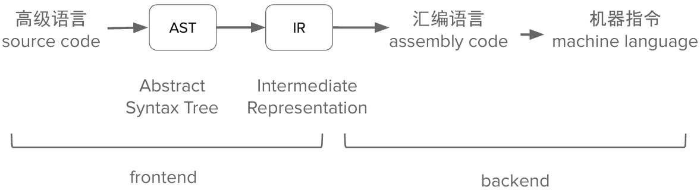
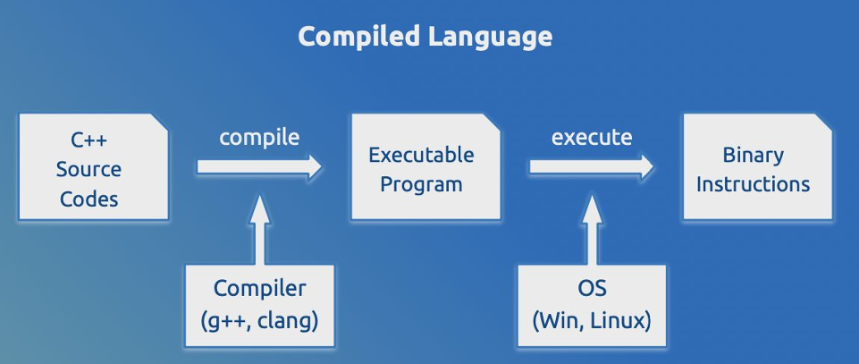
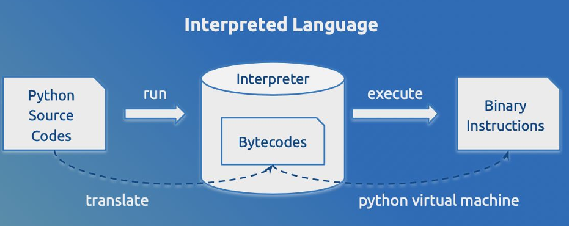
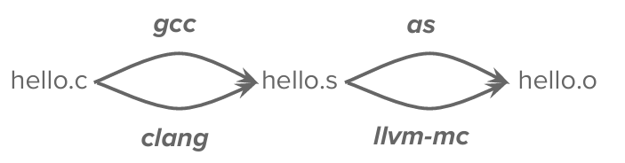
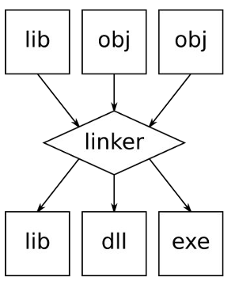
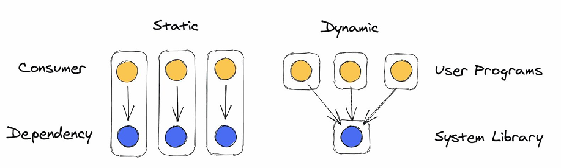
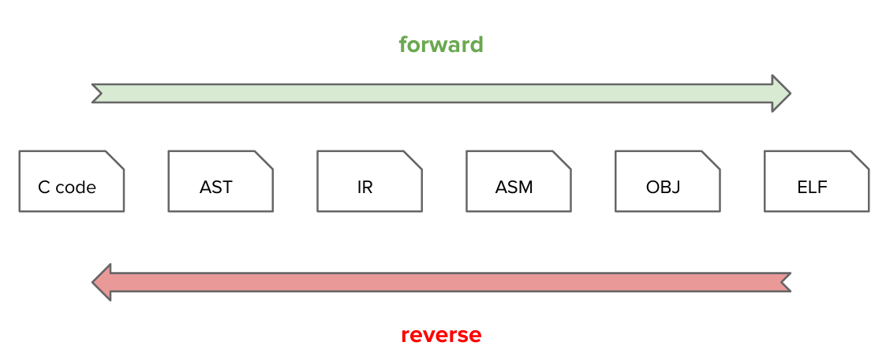

# Lec4-Reverse

> 授课：马麟


## 程序？可执行文件

为什么计算机可以执行给定的程序呢

> 因为任何程序都将最终转化为「指令」的形式由计算机执行


### 前端与后端（Compile frontend & backend）



### Compiled V.S. Interpreted

+ 编译执行

    上述通过编译器 (compiler) 将代码转化为机器指令格式的程序，进而执行

+ 解释执行

    通过解释器 (interpreter) 将代码转化为 VM 格式的程序（如字节码），进而在 VM 上执行





### 用户态可执行文件

+ Windows：PE/PE32+（Port Executable）
+ macOS：Mach-O（Mach Object）
+ Linux：ELF（Executable and Linkable Format）

可通过命令行工具静态检视 ELF 文件

> ELF (Executable and Linkable Format) is a common standard file format for "executables" in Linux (or Unix-like) systems

+ `file`：查看文件类型
+ `readelf`：查看 ELF 文件的结构
+ `objdump`：反汇编

## ELF 的编译、链接

+ 编译（汇编）：从源代码到**目标文件**
+ 链接：从目标文件到**可执行文件**

### ELF的编译、链接

以简单的`hello.c`为例

```c
#include <stdio.h>

int main(int argc, char *argv[])
{
        printf("Hello World!\n");
        return 0;
}
```

```shell
gcc/clang hello.c
```

### ELF的编译 (预处理)

```shell
gcc/clang -E hello.c -o hello.c.i
```

+ 头文件包含
+ 宏展开与替换

### ELF的编译 (编译)

```shell
gcc/clang -S hello.c -o hello.s
```

+ -S: Compile only; do not assemble or link
+ -Ox: 优化等级
+ -g: 启用调试
+ ......

### ELF的编译 (编译前端)

+ 生成 clang AST

```shell
clang -Xclang -ast-dump -S hello.c
```

+ 生成 LLVM IR

```shell
clang -Xclang -emit-llvm -S hello.c -o hello.ll
```

+ 生成 gcc IR（以及其他细节）

```shell
gcc -fdump-tree-all-graph -S hello.c
```

### ELF的编译 (编译后端)

+ 从 LLVM IR 到汇编代码

```shell
llc hello.ll -o hello.s
```

+ 从汇编代码到目标文件 (object file)

```shell
llvm-mc -filetype=obj hello.s -o hello.o
```

+ 一步到位

```shell
llc -filetype=obj hello.ll -o hello.o
```

+ 从汇编代码到目标文件 (object file) GCC 版本

```shell
gcc hello.s -o hello.o
```



### ELF的链接

+ 目标文件 `hello.o` 中有多个段
+ 目标文件 `hello.o` 还不足以包含程序运行的信息，需要进行链接
+ 符号解析与重定位
    - "essentially merging"



#### 静态链接与动态链接



+ 静态链接

    将所有的目标文件都链接到一个可执行（ELF）文件中

    - 优点：可执行文件独立，不依赖于其他文件，在各种环境中都可执行
    - 缺点：通常会使可执行文件大小增加

+ 动态链接

    所有的目标文件都链接到一个储存在系统中的动态链接库（Dylib/So）中，无需单独储存

    - 优点：节省磁盘空间，减少内存占用
    - 缺点：依赖于系统中的动态链接库，动态链接库的版本等不同可能会导致兼容性问题；

        动态链接的过程中会有额外开销，可能会影响程序的性能，但有一些优化策略


#### 动态链接的PLT与GOT

+ PLT:  Procedure Linkage Table

    动态链接的“跳板”

+ GOT:  Global Offset Table
+ lazy binding optimization（延迟绑定优化）以及 full-relro 保护

## ELF 程序的装载和运行

### 程序到进程

+ 可执行程序 (Program) 是静态，文件的概念
+ 进程 (Process) 是动态、系统运行时的概念
    - 进程和线程 (Thread)

### ELF程序的生命周期

+ C/C++程序对应进程的起点并不是main
+ 同样地，C/C++程序对应进程的终点也不是main

??? example
    ```c
    #include <stdio.h>
    #include <stdlib.h>

    __attribute__((constructor)) void before_main()
    {
        printf("Before main\n");
    }

    __attribute__((destructor)) void after_main()
    {
        printf("After main\n");
    }

    int main()
    {
        printf("During main\n");
    }
    ```

    运行结果如下：
    

+ 静态链接程序：

    内核以可执行文件 e_entry 位置 (即_start) 作为起点

+ 动态链接程序：

    内核以 interpreter 文件的 e_entry 位置作为起点

+ 等了解交互/调试之后进行 revisit

#### _start

+ glibc 代码 (汇编构筑)
+ 携带 `main` 符号跳转 `__libc_start_main` 函数

#### __libc_start_main

+ 完成各类和目标 ELF 有关的初始化
+ 内联 `__libc_start_call_main`
+ 最终跳往 `main` 符号
+ `main` 结束后调用 `exit`

### 基地址与 ASLR

+ PIE 动态链接可执行程序基地址随机保护
+ 无论静态/动态 (是否 PIE)，栈地址随即化保护
+ 通过 /proc/sys/kernel/randomize_va_space 控制随机化

## ELF 程序的交互、调试

### 通过命令行人工与程序交互

+ 绝对路径 / 相对路径
    - -h / --help
    - manual
    - PATH 路径
+ 通过虚拟机或者沙箱进行交互
    - [https://firejail.wordpress.com/](https://firejail.wordpress.com/) 
    - [https://github.com/google/nsjail](https://github.com/google/nsjail)

### 通过编程与程序交互

+ 重定向构建特殊字符作为输入
+ C 管道编程
+ python subprocess 库
+ python pwntools 库

### GDB: GNU DeBugger

+ 调试模式
    - 调试器执行模式
    - attach 模式
    - remote 模式
+ 常用调试功能
    - 执行断点
    - 硬件断点
    - 查看寄存器 / 内存
    - set 修改寄存器 / 内存
+ gdb 插件

## ELF程序的逆向



### ELF的静态逆向

+ 反汇编：机器指令 $\rightarrow$ 汇编指令（查表、准确）
    - objdump
+  反编译：汇编指令 => 编程语言（分析/特征匹配/启发式 … 、往往不准确）
    - IDA Pro (https://hex-rays.com/ida-pro/)
    - Binary Ninja (https://binary.ninja)
        - with free version
    - Ghidra (https://github.com/NationalSecurityAgency/ghidra)
    - Cutter / radare (https://github.com/rizinorg/cutter )
    - 大语言模型 ;D (https://mlm.lingyiwanwu.com/)

#### 静态逆向技巧

对于静态链接目标

+ 特征 + 猜测尽可能恢复库函数符号

对于符号恢复的静态 or 动态链接目标

+ 关注特定**常量**和**字符串**
+ 关注**输入**和**输出函数**
+ 关注分支、比较指令
+ 关注可能涉及加密解密的特殊运算（位运算、异或、取余）

### ELF的动态逆向

「**可运行**」和「**可调试**」是高效解决逆向问题的必备

+ 许多逆向赛题都需要「纯静态」的方式解决，程序可能依赖特定的架构/设备
+ “if it can run, it can be cracked”
+ 通过运行时的结果解决静态逆向时的疑惑


