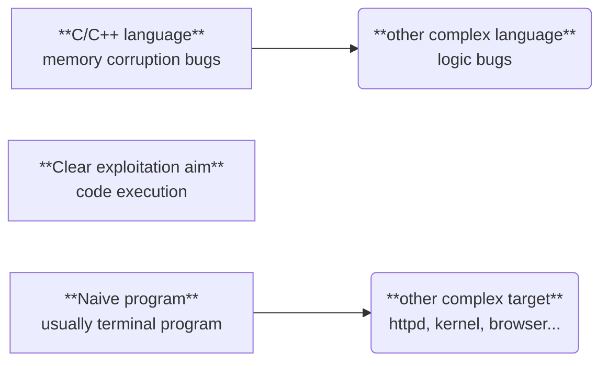
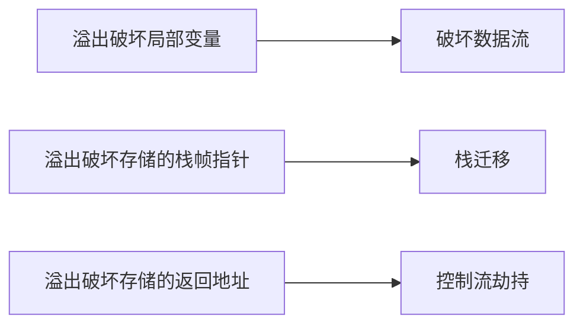

# Lec5-Pwn

> 授课：马麟

> 写在前面的话：由于这堂课上大部分内容都是基于具体题目来讲解的，实际上的知识点并没有多少，所以这里的内容会比较简略。

## PWN 引言

- **PWN = Find the Bugs + Exploit them**

Bug Definition

- A Software Bug is **a failure or flaw** in a program that produces **undesired or incorrect results**. It’s an error that prevents the application from **functioning as it should**.

---

## CTF PWN Bugs

pwn 赛题结构

- 赛题文件

- 往往需要逆向
- 漏洞描述 (diff)

- 赛题环境

    - libc and ld
    - Dockerfile
    - "good challenge should issue everything you needed to run and test it"

- 赛题远程

---

## 代码注入 (Code Injection)

"An attacker introduces (or "injects") code into the program and changes the 
course of its execution. "

- 原始 + 直接的漏洞与攻击
- “相对容易”检测 - 特征函数
- “相对容易”防御 - 白名单/黑名单

命令注入

- 直接

shellcode 注入

- 间接
- 搭配控制流劫持的利用方式

---

## stack overflow 能力

