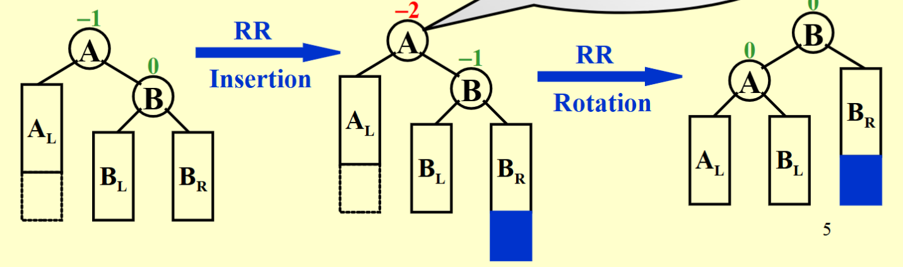
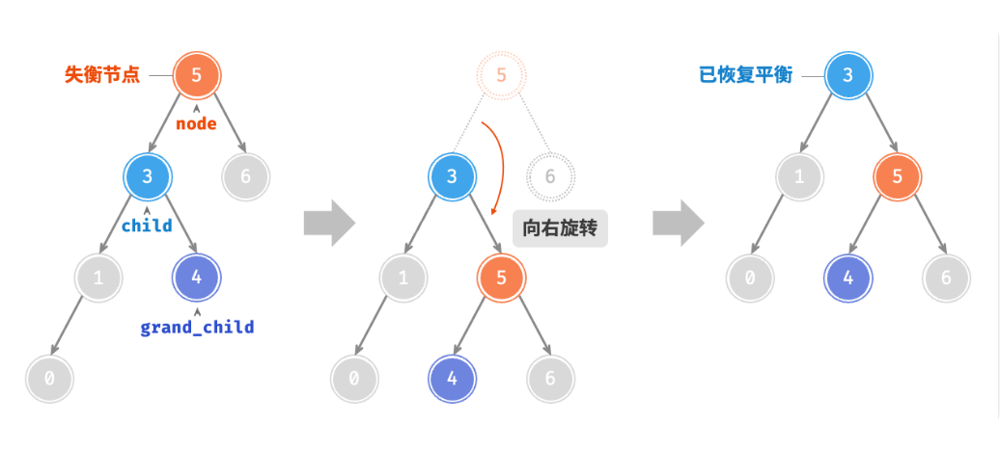
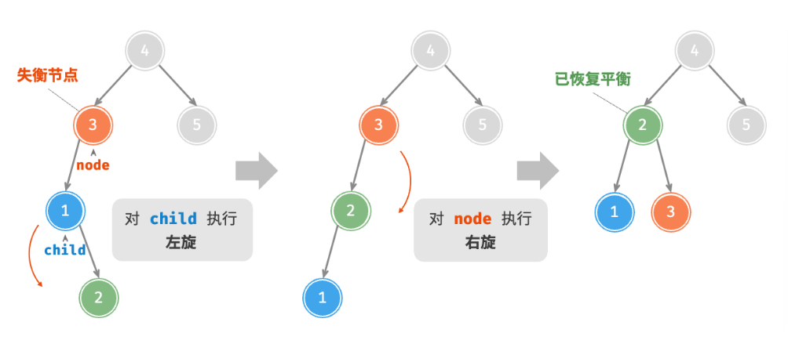
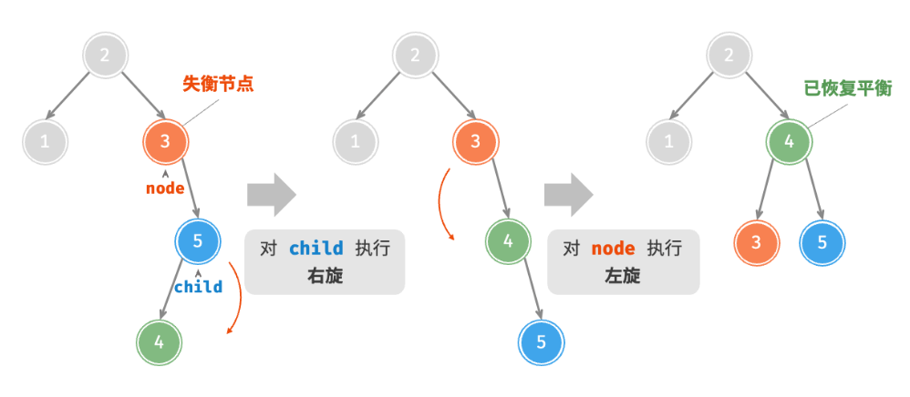

# AVL Trees, Splay Trees,and Amortized Analysis

## AVL Tree

### AVL Tree的定义

AVL Tree的主要思路是每次进行插入和删除之后，都要检查树的平衡性，如果不平衡，则通过“旋转”操作来使树恢复平衡。

!!! note "AVL Tree的递归定义"
    - 空树是 AVL 树
    - 如果 T 不是空的，那么 T 是 AVL 树当且仅当
        - 它的左子树和右子树的高度差不超过 1
        - T 的左子树和右子树也是 AVL 树

!!! note "平衡因子 ($bf$) 的定义"
    - 对于一个结点 $x$，它的平衡因子定义为 $bf(x) = h(x.left) - h(x.right)$，即左子树高度减去右子树高度
    - 对于一个AVL树，它的所有结点的平衡因子都是 $-1, 0, 1$

AVL树是一种平衡二叉搜索树（balanced binary search tree），它在进行搜索、插入和删除时的时间复杂度能够保持在 $O(\log n)$。

!!! info "AVL Tree的C++实现"
    由于AVL Tree关于平衡性的要求，因此在实现时需要维护每个结点的`height`.

    ```cpp
    using AVLTree = struct TreeNode*;
    struct TreeNode {
        int data {};
        TreeNode* left {};
        TreeNode* right {};
        int height = 0;
    };
    ```

    - 对于高度通常有不同的定义方式，具体要根据来判断，在这里我们认为空结点的高度是-1，而叶结点的高度是0。

    ```cpp
    int height(AVLTree root) {
        return root ==nullptr ? -1 : root->height;
    }

    void updateHeight(AVLTree root) {
        root->height = 1 + max(height(root->left), height(root->right));
    }
    ```
---

### AVL Tree的旋转

AVL树的特点在于“旋转”操作，它能够在不影响二叉树的中序遍历序列的前提下，使失衡结点重新恢复平衡。换句话说，旋转操作既能保持“二叉搜索树”的性质，也能使树重新变为“平衡二叉树”。

#### RR型旋转-左旋

在某个结点的右子树(R)的右子树(R)上插入结点，导致该结点失衡，其平衡因子变为-2，需要进行左旋操作。

- A向左旋转成为B的左子树
- B原先的的左子树成为A的右子树



??? example "RR型旋转"
    === "代码实现"
        ```cpp
        AVLTree RR_Rotate(AVLTree root) {
            AVLTree newRoot = root->right;
            root->right = newRoot->left;
            newRoot->left = root;
            updateHeight(root);
            updateHeight(newRoot);
            return newRoot;
        }
        ```

    === "图示"
        

---

#### LL型旋转-右旋

在某个结点的左子树(L)的左子树(L)上插入结点，导致该结点失衡，其平衡因子变为2，需要进行右旋操作。

- A向右旋转成为B的右子树
- B原先的的右子树成为A的左子树


??? example "LL型旋转"
    === "代码实现"
        ```cpp
        AVLTree LL_Rotate(AVLTree root) {
            AVLTree newRoot = root->left;
            root->left = newRoot->right;
            newRoot->right = root;
            updateHeight(root);
            updateHeight(newRoot);
            return newRoot;
        }
        ```

    === "图示"
        

---

#### LR型旋转-先左旋后右旋

在某个结点的左子树(L)的右子树(R)上插入结点，导致该结点失衡，其平衡因子变为2，需要进行先左旋后右旋操作。

!!! tip
    对于此类失衡结点，仅进行左旋或右旋均无法使其恢复平衡

需要进行两次旋转操作：

- 先对失衡结点的左子树进行左旋操作
- 再对失衡结点进行右旋操作

??? example "LR型旋转"
    === "代码实现"
        ```cpp
        AVLTree LR_Rotate(AVLTree root) {
            root->left = RR_Rotate(root->left);
            return LL_Rotate(root);
        }
        ```

    === "图示"
        

---

#### RL型旋转-先右旋后左旋

在某个结点的右子树(R)的左子树(L)上插入结点，导致该结点失衡，其平衡因子变为-2，需要进行先右旋后左旋操作。

- 先对失衡结点的右子树进行右旋操作
- 再对失衡结点进行左旋操作

??? example "RL型旋转"
    === "代码实现"
        ```cpp
        AVLTree RL_Rotate(AVLTree root) {
            root->right = LL_Rotate(root->right);
            return RR_Rotate(root);
        }
        ```

    === "图示"
        

---

具体分析后可以发现，AVL树的失衡情况仅有以上四种。当对AVL树进行插入或删除操作时，如果导致某个结点失衡，则需要根据其失衡情况进行相应的旋转操作，可以通过判断失衡结点的平衡因子来确定失衡类型，并采取相应的旋转操作。


|失衡结点的平衡因子|子结点的平衡因子|应采用的旋转方法|
|:---|:---|:---|
|$>1$（左偏树）|$\geq 0$| LL旋转（右旋）|
|$>1$（左偏树）|$<0$| LR旋转（先左旋后右旋）|
|$<-1$（右偏树）|$\leq 0$| RR旋转（左旋）|
|$<-1$（右偏树）|$>0$| RL旋转（先右旋后左旋）|

!!! tip
    虽然LR旋转和RL旋转实际上要进行两次旋转，但我们一般还是认为它们都是**一次旋转**。

---

### AVL Tree的常用操作

#### 插入

!!! tip
    AVL树在进行插入操作后，从该结点到根结点的路径上可能会出现一连串的失衡结点，但实际上只需要对最近的一个失衡结点进行旋转操作即可，因为旋转操作会使失衡结点的父结点高度减小，从而使更远的结点恢复平衡。

- 找到要插入的位置所需时间复杂度为 $O(\log n)$，且只需进行一次 $O(1)$ 的旋转操作，因此插入操作的时间复杂度为 $O(\log n)$。

```cpp
AVLTree insert(AVLTree root, int data) {
    if (root == nullptr) {
        root = new TreeNode;
        root->data = data;
        root->left = root->right = nullptr;
        root->height = 0; 
    } else if (data < root->data) {
        root->left = insert(root->left, data);
        if (height(root->left) - height(root->right) == 2) {
            if (data < root->left->data) {
                root = LL_Rotate(root);
            } else {
                root = LR_Rotate(root);
            }
        }
    } else if (data > root->data) {
        root->right = insert(root->right, data);
        if (height(root->left) - height(root->right) == -2) {
            if (data > root->right->data) {
                root = RR_Rotate(root);
            } else {
                root = RL_Rotate(root);
            }
        }
    }
    updateHeight(root);
    return root;
}
```

---

#### 删除

- 课件中并未要求实现AVL树的删除操作，但值得注意的是，AVL树的删除后旋转最多进行 $O(\log n)$ 次，而找到要删除的结点所需时间复杂度也是 $O(\log n)$，因此删除操作的时间复杂度仍然是 $O(\log n)$。
- 由于删除操作可能涉及到不止一次的旋转操作，因此需要**从被删除的结点开始，自底向上执行旋转操作，使所有失衡结点恢复平衡**

因为我懒得写，而且似乎考试也没有要求，所以这里就不写了。🤪

---

#### 查找

- AVL树的查找操作与普通二叉搜索树相同，其时间复杂度为$O(\log n)$，在此不再赘述。

**综上所述，AVL树的插入、删除和查找操作的时间复杂度均为$O(\log n)$。**

---

## Splay Tree

Splay树的目的是希望在不像AVL Tree那样保持严格的平衡约束的同时，满足一定程度上对树的操作的对数时间复杂度（即对于一个空的树的连续$M$个树操作，总共的所需的时间不超过 $O(M \log n)$）。

- Splay树在进行访问时（包括插入、删除、搜索等操作），会将访问的结点调整到树的根结点，这样可以使刚刚被访问的结点在接下来的操作中更容易被访问到，从而提高访问效率。

!!! quote "来自吴一航学长的ADS讲义"
    另一方面Splay树在访问（特别注意访问包括搜索、插入和删除）时都需要将元素移动到根结点，这非常符合程序局部性的要求，即刚刚访问的数据很有可能再次被访问，因此在实现缓存和垃圾收集算法中有一定的应用。

Splay树就是在原先的二叉搜索树的基础上，通过一系列的旋转操作，将访问的结点调整到根结点：

- 搜索：先通过普通二叉搜索树的方法找到结点，再通过一系列的旋转操作将结点调整到根结点
- 插入：先通过普通二叉搜索树的方法找到插入位置，再通过一系列的旋转操作将刚刚插入的结点调整到根结点
- 删除：先通过普通二叉搜索树的方法找到删除位置，再通过一系列的旋转操作将删除的结点调整到根结点，然后删除根结点（即删除原先的结点），再使用普通二叉搜索树的合并操作将左右子树合并

那么我们需要关注的是如何实现splay操作，即如何通过一系列的旋转操作将结点调整到根结点。

有一种相当自然的想法是：不断地把要访问的结点和他的父结点交换父子次序（即不断地进行单旋操作），直到该结点成为根结点。

这样的操作虽然把要访问的结点放到了根结点，但也把其上移路径上的结点移到了很深的位置，使得树的结构依然很不平衡，显然不满足我们对总时间复杂度的要求。


那么我们就要寻找一种合理的旋转方法，使得我们的时间复杂度要求得到满足。

!!! note "Splay Tree的旋转操作"
    对于任何不是根结点的结点X，我们关心它的parent结点P和grandparent结点G

    - case 1: 若P是根结点，直接旋转交换X和P
    - case 2: 若P不是根结点，可再分为两种情况
        - Zig-zag: 双旋(double rotation)，操作方法与AVL树的RL或LR旋转一致
        - Zig-zig: 单旋(single rotation)，实际上也是旋转了两次。**Zig-zig操作与AVL树的LL或RR旋转不同，是先将P和G旋转交换，再把X和P旋转交换**

    

上面我们现在已经得到了Splay Tree的核心操作splay，那么搜索和插入的操作就十分自然了，值得我们再次强调的是删除操作：

1. Find X（此时X为根结点）
2. Remove X
3. FindMax($T_L$)（左子树的最大结点没有右子树）
4. Make $T_R$ the right child of the root of $T_L$ (后两步实际上就是一般的merge操作)

## amortized anyl