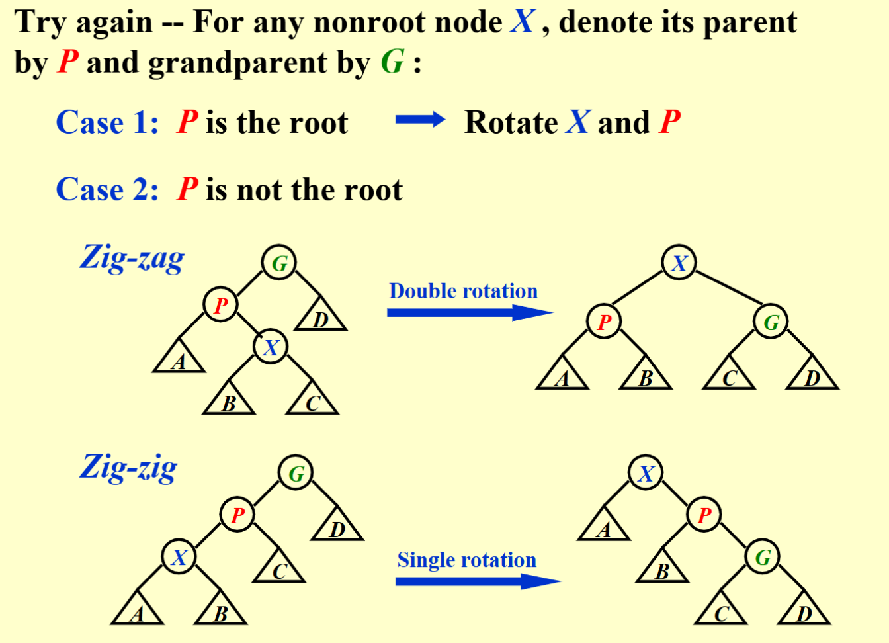

# AVL Trees, Splay Trees,and Amortized Analysis

## AVL Tree

### AVL Tree的定义

AVL Tree的主要思路是每次进行插入和删除之后，都要检查树的平衡性，如果不平衡，则通过“旋转”操作来使树恢复平衡。

!!! note "AVL Tree的递归定义"
    - 空树是 AVL 树
    - 如果 T 不是空的，那么 T 是 AVL 树当且仅当
        - 它的左子树和右子树的高度差不超过 1
        - T 的左子树和右子树也是 AVL 树

!!! note "平衡因子 ($bf$) 的定义"
    - 对于一个结点 $x$，它的平衡因子定义为 $bf(x) = h(x.left) - h(x.right)$，即左子树高度减去右子树高度
    - 对于一个AVL树，它的所有结点的平衡因子都是 $-1, 0, 1$

AVL树是一种平衡二叉搜索树（balanced binary search tree），它在进行搜索、插入和删除时的时间复杂度能够保持在 $O(\log n)$。

!!! info "AVL Tree的C++实现"
    由于AVL Tree关于平衡性的要求，因此在实现时需要维护每个结点的`height`.

    ```cpp
    using AVLTree = struct TreeNode*;
    struct TreeNode {
        int data {};
        TreeNode* left {};
        TreeNode* right {};
        int height = 0;
    };
    ```

    - 高度通常有不同的定义，要根据题目来具体判断，这里我们认为空结点的高度是-1，叶结点的高度是0。

    ```cpp
    int height(AVLTree root) {
        return root == nullptr ? -1 : root->height;
    }

    void updateHeight(AVLTree root) {
        root->height = 1 + max(height(root->left), height(root->right));
    }
    ```
---

### AVL Tree的旋转

AVL树的特点在于“旋转”操作，它能够在不影响二叉树的中序遍历序列的前提下，使失衡结点重新恢复平衡。换句话说，旋转操作既能保持“二叉搜索树”的性质，也能使树重新变为“平衡二叉树”。

#### RR型旋转-左旋

在某个结点的右子树(R)的右子树(R)上插入结点，导致该结点失衡，其平衡因子变为-2，需要进行左旋操作。

- A向左旋转成为B的左子树
- B原先的的左子树成为A的右子树


??? example "RR型旋转"
    === "代码实现"
        ```cpp
        AVLTree RR_Rotate(AVLTree root) {
            AVLTree newRoot = root->right;
            root->right = newRoot->left;
            newRoot->left = root;
            updateHeight(root);
            updateHeight(newRoot);
            return newRoot;
        }
        ```

    === "图示"
        

---

#### LL型旋转-右旋

在某个结点的左子树(L)的左子树(L)上插入结点，导致该结点失衡，其平衡因子变为2，需要进行右旋操作。

- A向右旋转成为B的右子树
- B原先的的右子树成为A的左子树


??? example "LL型旋转"
    === "代码实现"
        ```cpp
        AVLTree LL_Rotate(AVLTree root) {
            AVLTree newRoot = root->left;
            root->left = newRoot->right;
            newRoot->right = root;
            updateHeight(root);
            updateHeight(newRoot);
            return newRoot;
        }
        ```

    === "图示"
        

---

#### LR型旋转-先左旋后右旋

在某个结点的左子树(L)的右子树(R)上插入结点，导致该结点失衡，其平衡因子变为2，需要进行先左旋后右旋操作。

!!! tip
    对于此类失衡结点，仅进行左旋或右旋均无法使其恢复平衡

需要进行两次旋转操作：

- 先对失衡结点的左子树进行左旋操作
- 再对失衡结点进行右旋操作

??? example "LR型旋转"
    === "代码实现"
        ```cpp
        AVLTree LR_Rotate(AVLTree root) {
            root->left = RR_Rotate(root->left);
            return LL_Rotate(root);
        }
        ```

    === "图示"
        

---

#### RL型旋转-先右旋后左旋

在某个结点的右子树(R)的左子树(L)上插入结点，导致该结点失衡，其平衡因子变为-2，需要进行先右旋后左旋操作。

- 先对失衡结点的右子树进行右旋操作
- 再对失衡结点进行左旋操作

??? example "RL型旋转"
    === "代码实现"
        ```cpp
        AVLTree RL_Rotate(AVLTree root) {
            root->right = LL_Rotate(root->right);
            return RR_Rotate(root);
        }
        ```

    === "图示"
        

---

具体分析后可以发现，AVL树的失衡情况仅有以上四种。当对AVL树进行插入或删除操作时，如果导致某个结点失衡，则需要根据其失衡情况进行相应的旋转操作，可以通过判断失衡结点的平衡因子来确定失衡类型，并采取相应的旋转操作。


|失衡结点的平衡因子|子结点的平衡因子|应采用的旋转方法|
|:---|:---|:---|
|$>1$（左偏树）|$\geqslant 0$| LL旋转（右旋）|
|$>1$（左偏树）|$<0$| LR旋转（先左旋后右旋）|
|$<-1$（右偏树）|$\leqslant 0$| RR旋转（左旋）|
|$<-1$（右偏树）|$>0$| RL旋转（先右旋后左旋）|

!!! tip
    虽然LR旋转和RL旋转实际上要进行两次旋转，但我们一般还是认为它们都是**一次旋转（single rotation）**。

---

### AVL Tree的常用操作

#### 插入

!!! tip
    AVL树在进行插入操作后，从该结点到根结点的路径上可能会出现一连串的失衡结点，但实际上只需要对最近的一个失衡结点进行旋转操作即可。
    
    因为仔细观察可以发现，旋转操作会使以这个失衡结点的为根的这颗子树的高度保持不变，从而它的父结点和更远的祖先结点的平衡因子恢复到原先的状态，因此后续就不需要旋转了。

- 找到要插入的位置所需时间复杂度为 $O(\log n)$，且只需进行一次 $O(1)$ 的旋转操作，因此插入操作的时间复杂度为 $O(\log n)$。

```cpp
AVLTree insert(AVLTree root, int data) {
    if (root == nullptr) {
        root = new TreeNode;
        root->data = data;
        root->left = root->right = nullptr;
        root->height = 0; 
    } else if (data < root->data) {
        root->left = insert(root->left, data);
        if (height(root->left) - height(root->right) == 2) {
            if (data < root->left->data) {
                root = LL_Rotate(root);
            } else {
                root = LR_Rotate(root);
            }
        }
    } else if (data > root->data) {
        root->right = insert(root->right, data);
        if (height(root->left) - height(root->right) == -2) {
            if (data > root->right->data) {
                root = RR_Rotate(root);
            } else {
                root = RL_Rotate(root);
            }
        }
    }
    updateHeight(root);
    return root;
}
```

---

#### 删除

- 课件中并未要求实现AVL树的删除操作，但值得注意的是，AVL树的删除后旋转最多进行 $O(\log n)$ 次，而找到要删除的结点所需时间复杂度也是 $O(\log n)$，因此删除操作的时间复杂度仍然是 $O(\log n)$。
- 由于删除操作可能涉及到不止一次的旋转操作，因此需要**从被删除的结点开始，自底向上执行旋转操作，使所有失衡结点恢复平衡**

因为我懒得写，而且似乎考试也没有要求，所以这里就不写了。🤪

---

#### 查找

- AVL树的查找操作与普通二叉搜索树相同，其时间复杂度为$O(\log n)$，在此不再赘述。

**综上所述，AVL树的插入、删除和查找操作的时间复杂度均为$O(\log n)$。**

---

## Splay Tree

Splay树的目的是希望在不像AVL Tree那样保持严格的平衡约束的同时，满足一定程度上对树的操作的对数时间复杂度（即对于一个空的树的连续$M$个树操作，总共的所需的时间不超过 $O(M \log n)$）。

- Splay树在进行访问时（包括插入、删除、搜索等操作），会将被访问的结点调整到树的根结点，这样可以使刚刚被访问的结点在接下来的操作中更容易被访问到，从而提高访问效率。

!!! quote "来自吴一航学长的ADS讲义"
    另一方面Splay树在访问（特别注意访问包括搜索、插入和删除）时都需要将元素移动到根结点，这非常符合程序局部性的要求，即刚刚访问的数据很有可能再次被访问，因此在实现缓存和垃圾收集算法中有一定的应用。

Splay树就是在原先的二叉搜索树的基础上，通过一系列的旋转操作，将访问的结点调整到根结点：

- 搜索：先通过普通二叉搜索树的方法找到结点，再通过一系列的旋转操作将结点调整到根结点
- 插入：先通过普通二叉搜索树的方法找到插入位置，再通过一系列的旋转操作将刚刚插入的结点调整到根结点
- 删除：先通过普通二叉搜索树的方法找到需要删除的位置，再通过一系列的旋转操作将删除的结点调整到根结点，然后删除根结点（即删除刚刚被选定的结点），再使用普通二叉搜索树的合并操作将左右子树合并

那么我们需要关注的是如何实现splay操作，即如何通过一系列的旋转操作将结点调整到根结点。

有一种相当自然的想法是：不断地把要访问的结点和他的父结点交换父子次序（即不断地进行单旋操作），直到该结点成为根结点。

这样的操作虽然把要访问的结点放到了根结点，但也把其上移路径上的结点移到了很深的位置，使得树的结构依然很不平衡，显然不满足我们对总时间复杂度的要求。


那么我们就要寻找一种合理的旋转方法，使得我们的时间复杂度要求得到满足。

!!! note "Splay Tree的旋转操作"
    对于任何不是根结点的结点 $X$，我们关心它的 parent 结点 $P$ 和 grandparent 结点 $G$

    - case 1: 若 $P$ 是根结点，直接旋转交换X和P
    - case 2: 若 $P$ 不是根结点，可再分为两种情况
        - Zig-zag: 双旋(double rotation)，操作方法与AVL树的RL或LR旋转一致
        - Zig-zig: 单旋(single rotation)，实际上也是旋转了两次。**Zig-zig 操作与 AVL 树的 LL 或 RR 旋转不同，是先将 $P$ 和 $G$ 旋转交换，再把 $X$ 和 $P$ 旋转交换**

    

现在我们已经得到了Splay Tree的核心操作splay，那么搜索和插入的操作就十分自然了，值得我们再次强调的是删除操作：

1. Find X（此操作后X为根结点）
2. Remove X
3. FindMax($T_L$)（寻找左子树的最大结点，它一定没有右子树，使其成为新的根结点）
4. Make $T_R$ the right child of the root of $T_L$ (因为现在 $T_L$ 的根一定没有右子树，直接merge上去即可)

---

## Amortized Analysis(摊还分析)

摊还分析的主要想法来自于我们希望能够通过适当的方法估计一系列操作的平均时间复杂度，但平均时间复杂度往往不太好估计，因此我们希望能够找到一种更好的方法。

假如直接把直接用所有情况中最差的时间复杂度作为平均情况的上界，这也是不恰当的，因为不可能每一步操作都是最坏的情况，因此我们要通过摊还分析对平均时间复杂度的上界进行估计和约束，即找到某种方式把时间复杂度“平摊”到每一步操作上，同时“平摊”后的结果也不小于直接平均得到的结果，那么我们就成功地约束和估计了平均时间的上界。

> worst-case bound $\geqslant$  amortized bound $\geqslant$ average-case bound

我们可以采取以下三种方法：聚合分析、核算法以及势能法。通过栈来举例分析，Push和Pop的复杂度是$O(1)$，Multipop（将所有元素弹出）的复杂度是$O(n)$，其中$n$是当前栈中元素的个数。

---

### 聚合分析(Aggregate analysis)

显然，平均时间复杂度的最差情况是所有操作都是Multipop，但是由于我们最开始拥有的一定是空栈，因此显然不可能每一次操作都达到这样的时间复杂度。

我们要只考虑**可能出现**的情况中最差的时间复杂度，即从一个空栈开始的连续 $n$ 次操作中，前 $n-1$ 次都是Push，最后一次是Multipop。

因此，从空栈开始的连续 $n$ 次操作中，最差的操作代价是 $2n−2$，把它平均分为 $n$ 份就是摊还复杂度，因此摊还分析复杂度为 $O(1)$

---

### 核算法(Accounting method)

核算法的目标是求出平均时间成本，但将所有时间完美的平均十分困难，那我们只需要尽可能地**截长补短**，把成本大的截取出来分给成本小的，并且保证所有操作的总成本不会减小，这样才能保证摊还时间复杂度是平均时间的上界。

我们设第$i$种操作的真实成本是$c_i$，截长补短后的摊还成本是
$$ \hat{c_i} = c_i + \Delta_i $$

其中$\Delta_i$就是从长的截取出来部分（负值），或者给短的补充上去的部分（正值），并且我们要保证摊还成本不小于平均成本，那么就要有
$$ \sum_{i=1}^n \hat{c_i} \geqslant \sum_{i=1}^n c_i $$

也即 $\sum_{i=1}^n \Delta_i \geqslant 0$。

因为我们希望每一次操作的摊还成本是$O(1)$，所以我们希望这三种操作的成本都是常数级的，而Multipop的成本比较大，我们就要使它对应的 $\Delta_i < 0$，那么就要让成本小的操作 $\Delta_i > 0$

就像PPT中的例子那样，把Push的操作代价调整为2，Pop和Multipop的操作代价调整为0，那么连续$n$次操作的时间复杂度至多为$O(2n) = O(n)$，分摊给$n$次操作后就是$O(1)$。

上述处理的合理性的证明是显然的，因为size$(S) \geqslant 0$，即进行Pop和Multipop之前必须Push，每一次Push的代价加1就足以抵消掉Pop和Multipop的所有代价，那么这就证明了$\sum_{i=1}^n \Delta_i \geqslant 0$

!!! tip
    核算法(Accounting method)的名称可以理解为在银行中存取款，显然在取款之前必须存款，足够的存款才能抵消掉你的开销。

---

### 势能法(Potential method)

我们可以为整个结构设计一个势函数$\Phi$，使得第$i$次操作的摊还代价为
$$ \hat{c_i} = c_i + \left( \Phi(D_i) - \Phi(D_{i-1}) \right) $$

这里的$i$表示连续$n$个操作中的第$i$个，而非上面核算法的第$i$种。

所以每一步操作的摊还代价等于操作的真实代价加上势函数的变化，求和得到

$$\begin{aligned}
\sum_{i=1}^n \hat{c_i} &= \sum_{i=1}^n (\hat{c_i} + \Phi(D_i) - \Phi(D_{i-1}) ) \\
&= \left( \sum_{i=1}^n c_i \right) + \Phi(D_n) - \Phi(D_0)
\end{aligned}$$

我们希望这个摊还代价不小于真实代价，即 $\sum_{i=1}^n \hat{c_i} \geqslant \sum_{i=1}^n c_i$，那么就要有 $\Phi(D_n) \geqslant \Phi(D_0)$，即最终时刻势函数的变化不小于0。

我们在设计势函数时可以使得 $\Phi(D_0) = 0$，即初始状态的势能为0，并且其他任何时候的势能不小于0，那么就可以保证摊还代价不小于真实代价。

---

### Splay Tree的摊还分析

我们知道最后得到的摊还分析结果是 $O(\log n)$，那么 $\Phi(D_n)$ 就应当是 $O(n\log n)$ 量级的，所以势函数中就要带有一个对数函数。最终得到了如下的定义：
$$ \Phi(D_i) = \sum_{i \in T} \log S(i) $$
其中 $S(i)$ 表示子树 $i$ 的大小（包括 $i$ 自己在内的所有结点的个数）


那么对于结点 $X$ 在进行第 $i$ 次操作时，我们可以得到如下的分析：

- zig操作的摊还代价

$$\begin{aligned}
\hat{c_i} &= 1 + R_i(X) - R_{i-1}(X) + R_i(P) - R_{i-1}(P) \\
&\leqslant 1 + (R_i(X) - R_{i-1}(X)) \\
&\leqslant 1 + 3(R_i(X) - R_{i-1}(X))
\end{aligned}$$

这里 $R_i(P) - R_{i-1}(P)$ 显然为正值，因此去掉这两项之后可以得到第一个不等号

- zig-zag操作的摊还代价

$$\begin{aligned}
\hat{c_i} &= 2 + R_i(X) - R_{i-1}(X) + R_i(P) - R_{i-1}(P) + R_i(G) - R_{i-1}(G) \\
&\leqslant 2(R_i(X) - R_{i-1}(X)) \\
&\leqslant 3(R_i(X) - R_{i-1}(X))
\end{aligned}$$

这里我们注意到 $R_i(X) = R_{i-1}(G)$, 因此这两项可以抵消掉，同时 $R_i(P) + 1 \leqslant R_i(X)$，$R_i(G) + 1 \leqslant R_i(X)$，并且还有 $R_{i-1}(P) \geqslant R_{i-1}(X)$。于是我们就可以得到第一个不等号

- zig-zig操作的摊还代价

$$\begin{aligned}
\hat{c_i} &= 2 + R_i(X) - R_{i-1}(X) + R_i(P) - R_{i-1}(P) + R_i(G) - R_{i-1}(G) \\
&\leqslant 3(R_i(X) - R_{i-1}(X))
\end{aligned}$$

这里我们就直接进行简单粗暴的放缩，注意到 $R_i(P) + 1 \leqslant R_i(X)$，$R_i(G) + 1 \leqslant R_i(X)$ 和 $R_{i-1}(P) \geqslant R_{i-1}(X)$，$R_{i-1}(G) \geqslant R_{i-1}(X)$ 就可以直接得到这个不等式

上面我们得到了每一次操作的摊还代价，那么就需要计算结点 $X$ 从它所在的位置连续移动到根结点总共需要的摊还代价。设 $X$ 的高度为 $H(X)$，则可能的旋转次数为

$$ k = \begin{cases}
H(X)/2 & H(X)\text{为偶数}  \\
(H(X)-1)/2 + 1 & H(X)\text{为奇数} 
\end{cases} $$

其中偶数的情况里所有的旋转都是zig-zig或zia-zag，奇数则是除了最后一次操作是zig之外，其他都是zig-zig或zig-zag。

考虑最坏的情况，即一定要旋转 $k$ 次，那么总的摊还代价为

$$\begin{aligned}
\sum_{i=1}^{k+1} \hat{c_i} &\leqslant 1 + 3(R_{k+1}(X) - R_k(X)) + \sum_{i=1}^{k} 3(R_{i}(X) - R_{i-1}(X)) \\
&= 1 + 3(R_{k+1}(X) - R_0(X)) = O(\log n)
\end{aligned}$$

这里最后的等于 $O(\log n)$ 来自于势函数的定义（对数的累和）

**综上所述，Splay树的搜索、插入和删除的摊还复杂度均为$O(\log n)$**·