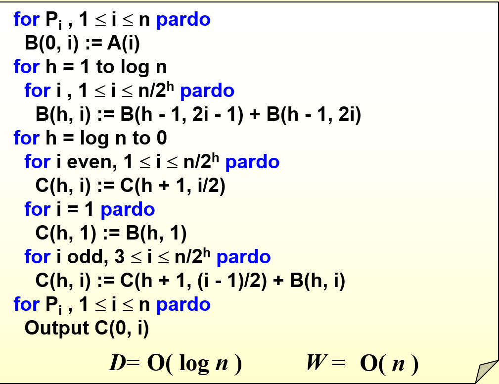

# 并行算法

并行算法的主要设计思路是将一个大的任务分解为多个互不干扰的小任务，然后将这些小任务分配给多个处理器并行执行，从而更好利用现代计算机多核的优势，提高计算的效率和性能。虽然在对问题进行分解和合并时有可能会增加任务的整体工作量，但由于我们可以使用多个处理器来运行这个任务，实际上的计算时间会大大减少。

## 概念与定理

!!! note "加速比"
    **加速比**（Speedup）是指在并行计算中，使用 $p$ 个处理器时相对于使用一个处理器时的性能提升比例，即
    $$ S(p) = \frac{T_1}{T_p} $$
    其中 $T_1$ 是使用一个处理器时的运行时间，$T_p$ 是使用 $p$ 个处理器时的运行时间。

在最理想的情况下，加速比是 $p$，即使用 $p$ 个处理器时的运行时间是使用一个处理器时的 $1/p$。但实际上，由于并行计算中存在一些额外的开销，如通信开销、同步开销等，同时代码还有可能存在一些不能并行处理的部分、每一个处理器未必能被分配到完全相同的工作量，因此加速比一般来说会小于 $p$。

!!! note "内存共享模型"
    一般来说，我们在讨论并行计算时会假设所有处理器共享一个连续的内存空间，此外模型还允许同一位置上同时进行多个访问。这种算法模型被称之为 **PRAM 模型**（Parallel Random Access Machine）。

    我们忽略掉一些内存和处理器上的细节，规定这一模型有如下三种内存共享方式：

    1.  **EREW**（Exclusive Read Exclusive Write）：每个内存位置在任意时刻只能被一个处理器读取或写入；
    2. **CREW**（Concurrent Read Exclusive Write）：每个内存位置在任意时刻可以被多个处理器读取，但只能被一个处理器写入；
    3. **CRCW**（Concurrent Read Concurrent Write）：每个内存位置在任意时刻可以被多个处理器读取或写入，因为写入涉及到同时写入不同值可能造成的冲突，因此写入策略又可以分为如下三种：
    
        - **CRCW-C（Common）**：所有处理器写入的值相同时才会写入；
        - **CRCW-A（Arbitrary）**：所有处理器写入的值可以不同，任意选取其中一个写入即可；
        - **CRCW-P（Priority）**：所有处理器写入的值可以不同，但是有一个优先级，只有优先级最高的写入才会生效。

由于程序中不一定所有的内容都可以被并行执行，那些必须串行执行的部分会影响程序的最大加速比。

!!! info "阿姆达尔定律 Amdahl's Law"
    设 $0 \leqslant f \leqslant 1 $ 是一个程序中必须串行执行的部分的比例，那么使用 $p$ 个处理器的最大加速比 $S(p)$ 满足
    $$ S(p) = \frac{1}{f + (1-f) / p} $$

    **证明：** 设整个程序串行需要的时间为 $t$，那么串行部分的时间为 $ft$，并行部分的时间为 $(1−f)t$。使用 $p$ 个处理器时，串行部分的时间不变，而并行部分的时间最少为 $(1−f)t/p$，因此总时间最小为 $ft +(1−f)t/p$，因此加速比最大为
    $$ S(p) = \frac{t}{ft + (1−f)t/p} = \frac{1}{f + (1−f)/p} $$

    这个定理有一个隐含的假设：当问题规模扩大时，串行计算的部分也会增大。

!!! info "古斯塔夫森定律 Gustafson's Law"
    设某个程序使用 $p$ 个处理器并行执行时，串行部分使用的时间为 $f_1$（不是比例），并行部分使用的时间为 $f_2$，那么使用 $p$ 个处理器的最大加速比 $S(p)$ 满足
    $$ S(p) = \dfrac{f_1 + f_2 \cdot p}{f_1 + f_2} $$

    **证明：**由假设可知，使用 $p$ 个处理器并行执行的时间为 $T_p = f_1 + f_2$，使用一个处理器串行执行的时间应当为 $T_1 = f_1 + f_2 \cdot p$ ，因此加速比为
    $$ S(p) = \frac{T_1}{T_p} = \frac{f_1 + f_2 \cdot p}{f_1 + f_2} $$

    古斯塔夫森定律认为，当问题规模扩大时，串行计算的部分不会增大，而是会保持一个固定的值。

!!! info "孙-倪定律 Sun-Ni's Law"
    设某个程序串行部分占比为 $f$，并行部分占比为 $1−f$，内存受限函数为 $G(p)$，那么使用 $p$ 个处理器的最大加速比 $S(p)$ 满足
    $$ S(p) = \cfrac{f + (1-f) \cdot G(p)}{f + \cfrac{(1-f) \cdot G(p)}{p}} $$

    - 假设 $G(p) = 1$，则问题大小是固定的或与资源增加无关，内存限制加速模型简化为 Amdahl 定律
    - 假设 $G(p) = p$，则内存限制加速模型简化为 Gustafson 定律，这意味着当内存容量增加 $p$ 倍，工作负载也增加 $p$ 倍

    孙-倪定律是对阿姆达尔定律和古斯塔夫森定律的统一和扩展，它认为在实际应用中，串行部分的比例 $f$ 会随着问题规模的增大而减小，因此加速比会随着问题规模的增大而增大。

事实上上面的三个定律都是粗糙的估计，我们想要更精细地分析加速比，还需要下面两个定义：

!!! note "W 与 D"
    - 我们称工作量（work，workload）$W$ 是并行中所有任务的总时间，实际上就是使用一个处理器来执行整个任务的执行时间。$$ W = T_1 $$

    - 我们称深度（depth）$D$ 是并行中最长的路径的时间，最长的路径也被称为关键路径，关键路径上的任务有相互依赖的关系，需要一个接一个地执行。
    
        关键路径的长度就是并行执行时间的一个下限，实际上就是使用无限多个处理器来执行整个任务的执行时间。$$ D = T_{\infty} $$

有了上面两个定义，我们就可以把算法的平均并行度定义为
$$ \frac{W}{D} = \frac{T_1}{T_{\infty}} $$

!!! info "布伦特定理 Brent's Theorem"
    设一个并行计算问题的工作量为 $W$，关键路径长度为 $D$，那么使用 $p$ 个处理器的并行时间具有如下上下界：
    $$ \frac{W}{p} \leqslant T_p \leqslant \frac{W-D}{p} + D $$

    **证明：**这个下界是很显然的，因为一定有 $ T_p \geqslant T_{\infty} = W/p $.

    对于上界，因为关键路径长度为 $D$，因此整个算法的执行可以分为 $D$ 个内部并行、互相之间串行的阶段，设每个阶段的工作量为 $W_i$，则有
    $$ W = \sum_{i=1}^{D} W_i $$
    使用 $p$ 个处理器时，每一个阶段所需的时间为 $ \lceil W_i/p \rceil$，因此我们需要的总时间就是
    $$ T_p = \sum_{i=1}^{D} \lceil W_i/p \rceil = \sum_{i=1}^{D}(\lfloor \dfrac{W_i - 1}{p} \rfloor + 1)   \leqslant \sum_{i=1}^{D} (\frac{W_i - 1}{p} + 1) = \frac{W-D}{p} + D $$

    其中我们使用了等式
    $$ \lceil \frac{x}{y} \rceil = \lfloor \frac{x-1}{y} \rfloor + 1 $$

> 在 PPT 中给出的上界是 $\dfrac{W}{p} + D$，在做题时或许需要另行具体分析

## 并行求和问题

我们首先来看一个简单的并行算法问题，即求出一个长度为 $n$ 的数组的所有元素的和。

我们可以很自然地想到可以把这些数组的元素两两相加，再把结果继续两两相加，直到最后得到一个结果。这样就构成了下图的一个平衡二叉树。

<figure>
    
</figure>

在这里每一层结点都需要单独计算一次，因此深度 $D$ 就是树的高度，工作量 $W$ 就是所有结点的数量。于是
$$ W = O(n), \quad D = O(\log n) $$

我们可以定义 $B(h,i)$ 为这棵树中从下往上数第 $h$ 层（从 0 开始）的第 $i$ 个结点（从 1 开始）对应的值，那么有如下递推关系：
$$ B(h,i) = B(h-1,2i-1) + B(h-1,2i) $$

## 前缀和问题

给定一个长度为 $n$ 的数组 $A，我们需要设计并行算法，求出 $A$ 的前 $k$ 个元素的和，其中 $k=1 \cdots n$。

<figure>
    
</figure>

我们可以定义一个式子
$$ C(h,i) = \sum_{k=1}^{\alpha} A(k) $$
其中 $h$ 表示当前所处的层数，$i$ 表示该层的第 $i$ 个节点，$\alpha$ 是点 $(h,i)$ 为根的子树最右下角的叶子 $i$ 的值，$A(k)$ 表示数组的第 $k$ 个元素（从1开始）。

我们可以先自底向上用并行求和的方法求出 $B$，然后利用 $B$ 从上往下计算这个 $C$，每一层的计算都可以并行，直到计算完成。

1. 如果 $i=1$，那么 $C(h,i)=B(h,i)$，这是因为 $i=1$ 的时候，根据定义，$C(h,1)$ 是从第 1 个元素加到以这一点为根的子树右下角的叶子，而 $B(1,h)$ 事实上也就是从第一个元素加到以这一点为根的子树右下角的叶子（从图中可以很清晰地看出这一点）；
2. 如果 $i$ 是偶数，这表明这一点是某个点的右儿子，因此它和它的父亲最右下角的叶子是同一个，因此有 $C(h,i)=C(h+1,i/2)$；
3. 如果 $i$ 是奇数且不是 1，这表明这一点是某个点的左儿子，首先它自己的值 $B(h,i)$ 就不是从最底层的第 1 个数开始相加得到的，所以我们要选一个左边的点，缺少的这部分补上，即 $C(h,i)= C(h+1,(i-1)/2)+B(h,i)$。

    需要注意的是，如果不是并行算法，$C(h+1,(i-1)/2)$ 可以替换为 $C(h,i-1)$，但因为并行算法要求每一行是同时在计算的，只能使用上一行的数据

这一种并行算法的深度是 $O(\log n)$，总工作量是 $O(n)$，因为我们实际上就是先从下到上计算 $B$，再从上到下计算 $C$，执行了两次分层的并行计算。

??? note "伪代码"
    

## 归并问题

归并排序的关键在于如何把两个已经排好序的子数组 $A(1) \cdots A(n)$ 和 $B(1) \cdots B(m) $ 合并成一个大数组 $C(1) \cdots C(n+m)$。

### 简单的想法

如果我们能同时将所有 $A$ 和 $B$ 中的元素在最后的数组 $C$ 中的位置找到，然后同时将它们放到正确的位置上，那么我们就可以用并行算法快速解决这一问题。

!!! tip
    对于元素 $A(i)$，它是 $A$ 中的第 $i-1$ 个元素（下表从 1 开始），那么它在前面有 $i-1$ 个元素。假如我们能找到它在 $B$ 中的位置是
    $$ B(j) < A(i) \leqslant B(j+1) $$
    那么就意味着还有 $j$ 个 $B$ 中的元素要在 $A(i)$ 之前，因此 $A(i)$ 在 $C$ 中的位置就是第 $i+j$ 个，即 $C(i+j)$。

    同理，对于 $B$ 中的元素可以通过相同的办法来找到它在 $C$ 中的位置。

<figure>
    
</figure>

```C
for Pi , 1 <= i <= n  pardo
    C(i + RANK(i, B)) := A(i)
for Pi , 1 <= i <= n  pardo
    C(i + RANK(i, A)) := B(i)
```

这样我们就把归并问题转化为了找到某个数组中的一个元素在另一个数组中的位置的问题。对这个问题我们有两种策略：

1.  逐个元素二分查找：使用二分查找找到一个元素在另一个数组中的位置只需要 $O(\log n)$ 的时间，即深度 $D=O(\log n)$，总工作量为 $O(n \log n)$；然后我们需要将所有元素放到正确的位置上，这一深度为 $O(1)$，总工作量为 $O(n)$（如果数组长度不同则是 $O(n+m)$），两步合起来深度为 $O(\log n)$，总工作量为 $O(n\log n)$；
2. 直接无脑从头向后依次比较，完全没有并行，深度和工作量都是 $O(n)$（或 $O(n+m)$）。伪代码如下：

    ```C
    i = j = 0; 
    while ( i <= n || j <= m ) {
        if ( A(i+1) < B(j+1) )
            RANK(++i, B) = j;
        else RANK(++j, A) = i;
    }
    ```

这两种方法显然都不太好，第一种方法的总工作量太大，而第二种方法的深度太大。

### 划分范式

划分范式的想法非常简单，且实际运用起来非常有效，分为如下两个步骤：

1. 划分（partitioning）：把原问题划分为很多（设为 $p$ 个）很小的子问题，每个子问题大小大致为 $n/p$
2. 真实工作（actual work）：同时对所有子问题进行处理，得到最终结果。

> 我们可以注意到，上面的二分查找相当于将原问题划分为了 $n$ 个子问题，即 $p=n$，而线性的方法则完全没有划分，即 $p=1$。因此这两种方法分别对应于划分范式的两个极端。

下面我们来套用上面的方法来解决这个问题。

- **划分**：我们首先分别将两个数组划分为 $p$ 份，$p$ 是一个很大的值，使得每个子问题很小，然后我们求出每一个子问题的第一个元素在另一个数组中的位置。

    这一步使用二分查找，这样这个子问题的深度为 $O(\log n)$，总工作量为 $O(p \log n)$。

<figure>
    
    <figcaption>划分A</figcaption>
</figure>

<figure>
    
    <figcaption>划分B</figcaption>
</figure>

<figure>
    
    <figcaption>得到互不相干的子问题</figcaption>
</figure>

- **真实工作**：如上图所示，现在我们要做的就是把两个相邻箭头之间的部分在这个很小的区域内确认相对位置，这些位置确定后可以根据上一步划分中得到的结果确定在整个最终的数组中的位置。

    很显然的是，这些箭头不会交叉，那么这些箭头就会分割出至多 $2p$ 个大小为 $O(n/p)$ 的子问题。
    
    - 我们可以并行地对每个子问题进行线性查找，这是因为每个子问题大小都很小，深度为 $O(n/p)$ 也很小，总工作量为 $2p \cdot O(n/p) = O(n)$ 也不算大，符合我们的要求。
    - 而如果这时候我们使用二分查找，总工作量就是
        $$ 2p \cdot \frac{n}{p} O(\log \frac{n}{p}) = O(n \log \frac{n}{p}) $$
        这是因为有 $2p$ 个子问题，每个子问题都至多有 $n/p$ 个元素要用至多 $\log(n/p)$ 的时间确定位置，这并无法保证是 $O(n)$ 的，因此我们不使用二分查找。

经过上面的分析，我们知道第一步划分的总工作量为 $O(p \log n)$，第二步真实工作的深度为 $O(n/p)$。而我们希望找到一个合适的 $p$，使得第一步总工作量是O(n)的，第二步深度是 $O(\log n)$ 的。这样我们就可以得到一个深度为 $O(\log n)$，总工作量为 $O(n)$ 的并行算法，成功做到取长补短。

很容易看出，$p = n \log n$ 就是满足条件的，因此我们就得到了一个深度为 $O(\log n)$，总工作量为 $O(n)$ 的并行算法。

## 寻找最大元素问题

对于从一个数组中找到最大元素的问题，我们也希望能有一种并行算法。

这里我们将会讨论并第三种行算法的设计范式，即双对数范式，这是二叉树的一种扩展；然后讨论加速级联范式，它可以综合不同的并行算法得到更好的并行算法。

### 不使用划分范式

我们先考虑一种不使用划分范式的方法，用类似于前面求和问题的做法，构造一棵二叉树，初始元素两两分组比较，然后逐层上递，最终得到最大值。这样的算法深度为 $O(\log n)$，总工作量为 $O(n)$。

我们也可以采取更加激进的策略：一次性并行比较所有元素。我们并行比较每一对元素 $A[i]$ 和 $A[j]$，只要 $A[i]$ 在比较中是较小的一方，就往新的数组 $B[i]$ 处写 1（$B$ 的所有位置初始化为 0），最后那个最大的元素肯定从来没被写过 1，因此还保持着 0。然后我们再并行判断 $B$ 中那一个元素是 0，那么它对应的数就是最大值。
```C
for P_i , 1 <= i <= n  pardo
    B(i) := 0
for i and j, 1 <= i, j <= n  pardo
    if ( (A(i) < A(j)) || ((A(i) = A(j)) && (i < j)) )
            B(i) = 1
    else B(j) = 1
for P_i , 1 <= i <= n  pardo
    if B(i) == 0
       A(i) is a maximum in A
```

在并行比较每一对元素时，我们可能会有多个线程同时往数组 $B$ 中进行写入，实际上我们只需要使用前面提到的 CRCW 策略允许同时写入，然后按 common rule 写入即可，因为这里所有线程往任意一个 $B[i]$ 只会写入1这个数字，所以写入的内容都是一样的，故用 common 就能实现写入。

很显然，这个算法的深度很理想，是 $O(1)$ 的，但由于需要比较每一对元素的值，因此总工作量是 $O(n^2)$ 的。如果能在深度和总工作量上取长补短，那么最终的结果就很完美了。

### 双对数范式（Doubly-logarithmic Paradigm）

双对数范式是一种二叉树的扩展。在完全二叉树中，设叶子的数量为 $n$，那么树高是 $\log n$ 级别的，这里双对数则是希望构造一棵树，使得树高是 $\log \log n$ 级别的。为了构造这样一棵树，我们首先设树中每个节点的 level 为从根到该节点的距离（需要经过的边数），根的 level 为 0。接下来我们构造这棵树如下：

- 设某个节点的 level 为 $s$，当 $s \leqslant \log \log n-1$ 时，则它有 $2^{2^{h-s-1}}$ 个孩子
- 当 $s = \log \log n$ 时，它有 2 个孩子作为树的叶子

不难验证这样一棵树的叶子数量的确是n，高度也是 $\log \log n$ 级别的。下图是一个 16 个叶子的双对数树。

<figure>
    
</figure>

事实上我们还可以观察到，不在倒数两行的结点的 level 为 $s$ 时，根据定义它有 $2^{2^{h-s-1}}$ 个孩子，并且以它为根的子树的叶子数量可以算出来是 $2^{2^{h-s}}$ ，而我们知道
$$ 2^{2^{h-s-1}} = \sqrt{2^{2^{h-s}}} $$
也就是说在每个结点处，我们把问题分成了 $\sqrt{m}$ 个子问题，其中 $m$ 为该节点对应的子树的叶子数量。而且以双对数树某一层单个节点为根的子树的叶子数，其实是上一层某个节点为根的子树的叶子数开根号（因为层数为 $s$ 的某个节点，以它为根的子树的叶子数量是 $2^{2^{h-s}}$，$s$每增加 1 实际上就是开一次根号），因此层数越往下，就相当于子问题大小逐步开根号。

假设原问题输入大小为 $n$，那么我们可以通过加一些 dummy 节点使得我们可以构造出以这 $n$ 个节点为叶子的双对数树，这样我们就可以使用双对数范式来设计一个并行算法，即在每一层将问题分为 $\sqrt{m}$ 个子问题，$m$ 为这一层的单个节点为根的子树的叶子数量，这样每个子问题（其实就是树上某个节点）对应的叶子数也就是 $\sqrt{m}$ 了，这就和双对数树结合起来了。我们熟知的二叉树则是每层分成两个子问题，是更简单的策略。

现在我们可以把这一思路套用在我们的问题上：我们首先将数组划分为 $\sqrt{n}$ 份，每一份的大小为 $\sqrt{n}$，然后我们并行递归找到每一份中的最大值，最后归并阶段再并行找到这 $\sqrt{n}$ 个最大值中的最大值即可。

设整个算法深度为 $D(n)$，工作量为 $W(n)$，它们都是关于数组长度的函数。

- 寻找每一份中的最大值我们采用递归的策略，因此长度为 $\sqrt{n}$的数组的最大值的寻找需要 $D(\sqrt{n})$ 的深度和 $W(\sqrt{n})$ 的总工作量。
- 在归并阶段，返回的 $\sqrt{n}$ 个最大值中的最大值我们采用前面的两两比较的方法即可，深度为 $O(1)$，总工作量为 $O((\sqrt{n})^2)=O(n)$。于是我们按照分治法的方式可以写出递推式

$$ D(n) = D(\sqrt{n}) + O(1) $$

$$ W(n) = \sqrt{n} W(\sqrt{n}) + O(n) $$

具体推导过程不赘述，最终的结果是我们得到了一个 $D(n) = O(\log \log n)$，$W(n) = O(n \log \log n)$ 的并行算法。


### 加速级联范式（Accelerating Cascades Paradigm）

1. 将数组分为 $\dfrac{n}{\log \log n}$ 份，即每一份的大小为 $\log \log n$。实际上每一份的大小都很小了，所以我们可以直接利用线性查找的方式找到每一份的最大值，则每一份的深度和工作量都是 $O(\log \log n)$ 的；
2. 然后我们对上面求出的 $\dfrac{n}{\log \log n}$ 个最大值使用双对数范式的算法。

总的深度等于每一个部分的深度加上双对数范式的深度
$$ D(n) = O(\log \log n) + O(\log \log (n/ \log \log n)) = O(\log \log n) $$

总工作量等于每一份的工作量之和加上双对数范式的工作量
$$  W(n) = \dfrac{n}{\log \log n} \cdot O(\log \log n) + O(\dfrac{n}{\log \log n} \cdot \log \log (n/ \log \log n)) = O(n) $$

<figure>
    
</figure>

### 随机算法

接下来我们将介绍一种随机算法，它可以保证以非常高的概率在 $O(1)$ 的深度和 $O(n)$ 的工作量内找到最大值。

1. **第一步**：从长度为 $n$ 的数组 $A$ 中，依照均匀分布取出 $n^{7/8}$ 个元素，得到新的数组记为 $B$。这一步需要 $n^{1/8}$ 个处理器各自负责抽一个然后放到内存中某个位置，深度为 $O(1)$，总工作量为 $O(n^{7/8})$；
2. **第二步**：求出 $B$ 中的最大值，使用确定性的算法实现，通过如下三个子步骤实现：

    1. 把 $B$ 分成 $n^{3/4}$ 个长度为 $n^{7/8}$ 的子数组，然后使用两两比较的暴力算法并行找到每个子数组的最大值，这一步深度为O(1)，总工作量为 $ n^{3/4} \cdot O((n^{1/8})^2)=O(n)$
    
        因为有 $n^{3/4}$ 个子数组，每个子数组用两两比较的办法的复杂度是数组长度平方级别的；然后将这 $n^{3/4}$ 个最大值放在新数组 $C$ 中

    2. 把 $C$ 分成 $n^{1/2}$ 个长度为 $n^{1/4}$ 的子数组，然后继续使用两两比较的暴力算法并行找到每个子数组的最大值
    
        这一步深度为 $O(1)$，总工作量为 $n^{1/2} \cdot O((n^{1/4})^2)=O(n)$，然后将这 $n^{1/2}$ 个最大值放在新数组 $D$ 中

    3. 数组 $D$ 直接使用两两比较的方法找到最大值，这一步深度为 $O(1)$，总工作量为 $O((n^{1/2})^2) = O(n)$

    综合上述方法，整个第二步相当于一个三轮的淘汰赛，整体而言第二步的深度为 $O(1)$，总工作量为 $O(n)$，并且我们能求出 $B$ 中的最大值，也就是抽取的 $n^{7/8}$ 个元素中的最大值；

<figure>
    
</figure>

3. **第三步**：目前我们只得到了 $n^{7/8}$ 个元素中的最大值（记为 $M$），如何进一步提高找到所有元素中最大值的概率呢？答案是再来一轮。

    但是这再来一轮是有讲究的。这一步我们首先均匀分布取出 $n^{7/8}$ 个元素，得到数组 $B$。然后用 $n$ 个处理器，每个处理器放 $A$ 的一个元素，与前一步得到的 $M$ 进行比较，如果小于 $M$ 则什么也不用做，大于 $M$ 则往数组 $B$ 的一个随机位置写入这一更大的值（为什么要随机写入呢？因为一共 $n$ 个处理器，但只有 $n^{7/8}$ 个位置可供选择，不能一一对应位置供每个处理器使用，但我们又要在 $O(1)$ 时间内完成位置分配，只能是随机了）。
    
    写完后，我们再次求出更新后的 $B$ 中的最大值，这一步的深度和工作量和第二步一样，因此是 $O(1)$ 的深度和 $O(n)$ 的工作量。

!!! info 
    以上算法以非常高的概率在 $O(1)$ 的深度和 $O(n)$ 的工作量内找到数组 $A$ 中的最大值：存在常数 $c$，使得算法只有 $\dfrac{1}{n^c}$ 的概率无法在这一时间复杂度内找到最大值。
