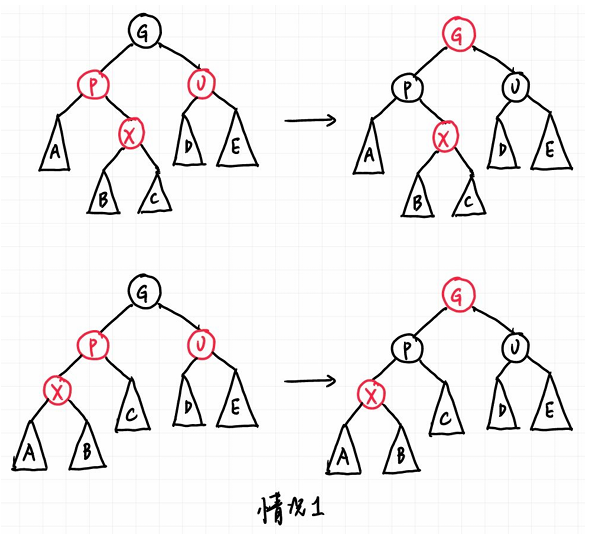
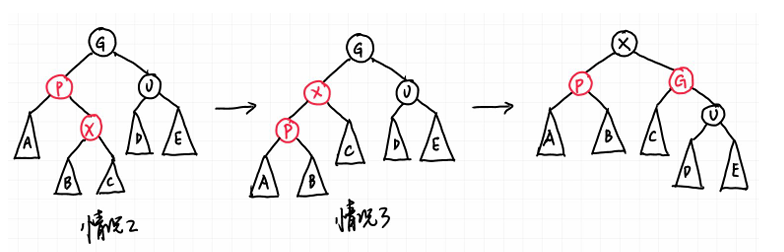
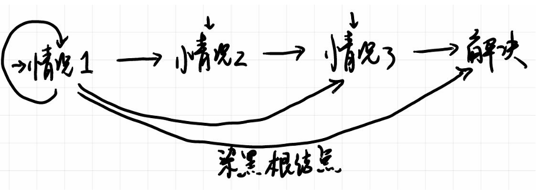
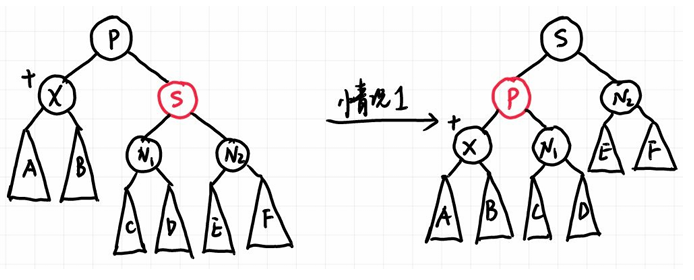
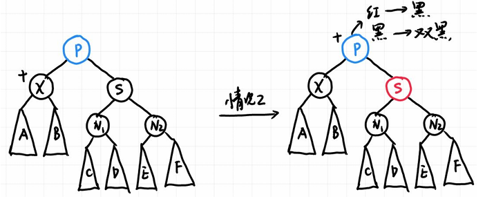
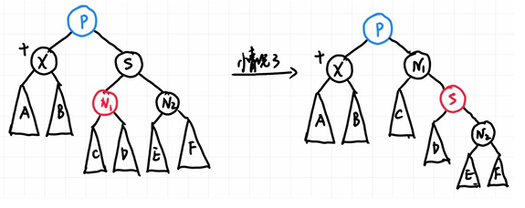
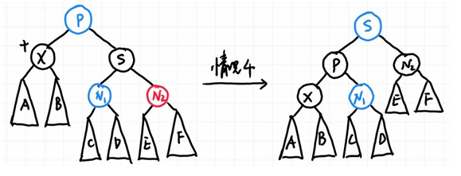
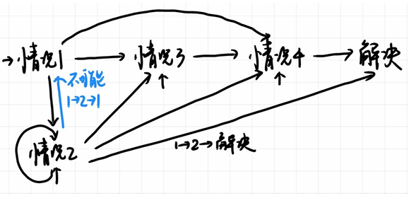
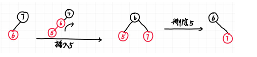

# 红黑树与B+树

## 红黑树

AVL树为了实现平衡搜索树的目标，采用了暴力的保持严格平衡的方法（左右子树高度之差不可大于1），并且不断通过旋转保持平衡。而红黑树则是希望通过另一种并不那么严格的定义方式同样满足“平衡”的需求，即给每一个结点染色。

### 红黑树的定义

!!! note "红黑树的定义"
    红黑树是满足以下性质的二叉搜索树

    1. 每个结点要么是红色的，要么是黑色的
    2. 根结点一定是黑色的
    3. 每一个叶结点（$NIL$）都是黑色的
    4. 如果一个结点是红色的，那么它的两个子结点都是黑色的
    5. 对于每个结点，从该结点到其所有后代叶结点（$NIL$）的简单路径上，都包含相同数目的黑色结点

- 对于上面的第二条性质，在对红黑树进行插入、删除时常会有将根节点变为红色的情况，但这时候可以直接将根结点染回黑色，这对于其他的性质也完全不会有任何影响

我们还可以对红黑树进行以下的补充定义

!!! note "红黑树额外定义"
    1. 我们将$NIL$称为外部结点，其余有键值的结点为内部结点
    2. 从某个结点 $X$ 出发到达一个叶子结点（NIL）的任意一条简单路径上的黑色结点个数（不含 $X$ 本身）称为 $X$ 的黑高，记为$bh(X)$。除此之外，我们定义整棵红黑树的黑高为其根结点的黑高，$bh(Tree) = bh(root)$。

然后可以证明如下定理

!!! info "红黑树的高度"
    1. 一棵有 $n$ 个内部结点的红黑树的高度至多为 $2\log(n+1)$

而红黑树也同样是二叉树，那么可以知道有 $n$ 个内部结点的红黑树的高度至少为 $\log(n+1)$

简单来说，控制红黑树平衡的关键在于控制红色结点，控制了红色结点，就可以让红黑树保持一定程度上的平衡。

!!! quote "吴一航学长的ADS讲义"
    对于红黑树，**黑高是绝对严格的平衡要求，而红色结点则是少量不平衡的因素，并且定义控制了红色结点的个数，也就控制了不平衡因素的影响**，因此红黑树还是可以保持一定程度的平衡的。

### 红黑树的插入

红黑树在插入后，平衡的性质可能会被破坏，需要进行调整。新插入的结点应当涂为红色，否则每一次插入都会破坏性质5，而插入红节点则有可能不对上面要求的性质进行破坏。

下面来逐一讨论各种情况，假设新插入的结点为$X$，父结点为$P$，祖父结点$G$，叔结点（即父节点的兄弟）为$U$。

#### 插入在黑结点下或插入空树

显然的，直接插入黑结点并不会对任何性质造成破坏，因此这种情况下不需要进行任何调整。

而插入空树后只需要把这个结点染成黑色即可，因为此时只需要保证根结点为黑色就足够了。

#### 父结点为红色

下面的讨论中默认$X$插入在$P$的左子树中，右子树的情况只需要对称处理即可。

- **情况1：叔结点为红色（红叔叔）**

无论$X$是$P$的左孩子还是右孩子，都属于这种情况。

!!! quote "吴一航学长的ADS讲义"
    需要注意的是，这里所有结点都带子树，一方面至少有NIL结点，另一方面这可以不仅仅表示刚刚插入的情况，也可以表示经过几次调整后还在被这种情况困扰，因此更具一般性。

{ width=60% }

我们的想法是把红色甩掉，但$X$的父亲和叔叔都是红色的，没办法解决它的问题，只能求助于祖父结点。

我们的方案是把$X$的父亲和叔叔染成黑色，祖父染成红色，这样一来从祖父开始的子树的黑高保持不变，不影响关于黑高的性质。但是这样并不代表问题已经解决了，因为祖父结点的父结点也同样可能是红色的，只不过这时候我们可以把祖父结点当成新插入的结点，然后递归地把问题向上传递，直到根结点。

当然向上传递的过程中可能不止遇见情况1，还可能遇见情况2和情况3，这时候我们需要继续调整，直到所有问题都得到解决

- **情况2：$X$的叔叔是黑色的，且$X$是右孩子（离叔叔较近）**
- **情况3：$X$的叔叔是黑色的，且$X$是左孩子（离叔叔较远）**

{ width=70% }

如图所示，情况2经过$X$和$P$的一次rotation之后就变成了情况3，情况三再进行一次rotation之后问题就成功解决了。

这里旋转的方法与AVL树的旋转方法是一样的，我们把红色视为trouble，进而决定要要LR还是LL旋转。

!!! tip
    前面已经提到过，对于$X$插入在右子树的情况，只需要对称处理即可，即把LR换成RL，LL换成RR即可。

!!! quote "吴一航学长的ADS讲义"
    { width=50% }

    即如果插入后直接落入情况三，只需要一次旋转染色即可解决，直接落入情况二，一次旋转进入情况三，再一次旋转染色即可解决。但如果落入情况一，一次调整后可能还在情况一，可能直到最后都是通过情况一加上染黑根结点解决，也可能几次调整后进入情况二或三后解决。
    
    根据这一流程我们知道，红黑树插入最多可能的旋转次数为2（因为只有情况2和3会要旋转，进入情况2后1次旋转必定进入情况3，进入情况3后1次旋转必定解决），然后更改颜色最多是$O(\log n)$次，因为进入情况2或3只需要一次染色，在情况1最差也是每两层染一次色。
    
    而我们已经证明红黑树的最大高度是$O(\log n)$的。因此插入操作包括$O(\log n)$的搜索时间，加常数的旋转，加$O(\log n)$的染色，因此还是$O(\log n)$的时间复杂度

综上我们可以得到结论：**一棵有$n$个内部结点的红黑树插入一个结点的时间复杂度为$O(\log n)$**

??? question
    考虑从空树开始连续插入 $n(n>1)$ 个结点得到一棵红黑树（每一步插入都要保证红黑树性质），试问这棵树一定会有红色结点吗？若是，请给出清晰的证明；若不是，请举出反例。

    答案是一定会有红色节点。采用数学归纳法证明：

    - 当平凡情况$n=2$时，根结点下插入的结点一定是红色，且不需要调整颜色
    - 对于之后的情况，假如新插入红色结点后不需要调整颜色，那么显然会有红色结点；假如需要调整，回顾三种情况的讨论，发现无论哪种情况，红黑树在调整后一定会保留下红色结点。

---

### 红黑树的删除

首先回忆普通二叉树的删除操作，主要有以下三种情况

- 如果$X$是叶子结点，直接删除即可
- 如果$X$只有一个孩子，直接用孩子替代$X$
- 如果$X$有两个孩子，找到$X$的中序后继$Y$，把$Y$的值赋给$X$，然后删除$Y$，这里的$Y$是左子树中最大的结点或者右子树中最小的结点

观察可以发现第三种情况可以通过一步交换转化为第一种或第二种情况，因此我们只需要讨论第一种和第二种情况即可。需要注意的是，在红黑树中交换时**只交换键值不交换颜色**，否则可能会破坏红黑树的性质5。

#### 红黑树删除的平凡情况

在第一种情况中，接替被删除结点所在位置的结点是NIL，第二种情况则是被删除结点的子结点。

假如被删除结点是红色的，那么直接删除即可，不会对红黑树的性质造成破坏；假如被删除的是黑色结点，如果接替上来的结点是红色的，直接把它染黑也不会破坏任何性质。

但是如果接替上来的是NIL或是黑色结点，那么就需要进行细致的讨论和调整。

#### 红黑树删除的复杂情况

这里我们采用一个巧妙的办法，我们直接给接替上来的黑色结点或者NIL(实际上也是黑色结点)再加一重黑色，使它的颜色变成“**双黑**”，这时候它一个结点就可以提供两个黑高，所以性质5并没有被破坏。

但是这里出现了非红非黑的结点，性质1被破坏了，我们就需要把这个多余的黑色传递给一个红色结点，或者直接向上传递到根结点（如果根结点是双黑的，直接把它变回黑色即可，因为根结点是什么颜色实际上并不影响红黑树的性质）于是这样就成功解决了问题。

我们可以把传递双黑的过程分为四类，用子树表示更一般的情况，$X$是需要处理的结点，黑结点旁的加号表示双黑，蓝色结点表示此时这个结点的颜色并不重要。同样的，这里只讨论了$X$是父结点的左孩子的情况，右孩子的情况只需要对称处理即可。

- **情况1：$X$的兄弟是红色的**

{ width=60% }

由于兄弟结点是红色的，那么父结点就一定是黑色的。我们的想法很简单，兄弟是红色的，就让兄弟来替我们解决这个难题，于是就把兄弟转上去染成黑色；这时候为了红黑树的性质，只能把父亲染红，双黑仍然在$X$上。

这么做虽然没有解决问题，但成功地把情况1转换成了情况2、3、4之中的一个。注意到现在$X$的兄弟一定是黑色的，因为这个兄弟是原先兄弟$S$的孩子。

- **情况2：$X$的兄弟是黑色的，且兄弟的两个孩子都是黑色的**

!!! tip
    这里根据与$X$的距离划分远、近侄子，这样一来在对称的情况中就不容易混淆。

{ width=60% }

这时候发现兄弟帮不了自己了，两个侄子都是黑色的也帮不上忙，那就只能把问题推给父结点。

我们把$X$的双黑变回黑色，兄弟从黑色变成红色，并且给父结点多加一层黑色：如果父亲是红色，就直接染黑；如果父亲是黑色，就把它变成双黑，把问题向上传递。

简单来说，$X$和兄弟减少一层黑色，父结点多加一层黑色，这样一来这以父结点为根的树的黑高也并没有发生变化，就维护了整棵红黑树的性质5。

!!! tip
    如果情况2是由情况1转换而来，那么这时候父结点一定是红色的，直接把它染黑就成功解决了问题

- **情况3：$X$的兄弟是黑色的，且近侄子是红色的，远侄子是黑色的**

{ width=60% }

这里我们借用AVL树的思想，红侄子在父亲$P$的RL位置，把红侄子与兄弟$S$进行 single rotation，就变成了情况4，也即红色在父亲$P$的RR位置。

- **情况4：$X$的兄弟是黑色的，且远侄子是红色的，近侄子的颜色任意**

{ width=60% }

这一种情况对应AVL树的RR，我们只需要对父亲$P$进行一次左旋（即$P$与$S$旋转），然后让$S$和$P$交换颜色，并且把$X$多余的黑色丢给远侄子，这样一来就成功解决了问题。

可能有些不直观，但是仔细思考可以发现，在旋转前黑色的$S$对应$X$多出来的一个黑高，所以$N_1$和$N_2$为根结点的子树的黑高与$X$为根结点的子树的黑高是一样的（假如把$X$变回单层的黑色的话），这样一来就可以很明确的看出旋转后的红黑树的成功保持了性质5，说明问题成功解决。

!!! quote "吴一航学长的ADS讲义"
    { width=50% }

    首先我们最多用 $O(\log n)$ 的时间找到删除结点，
    最多1次交换和1个删除的操作。接下来如果删除后没有问题则到此结束。
    
    否则根据分析，情况1、3和4在问题解决前最多进行一次，因为情况4可以直接解决，情况3直接进入4然后解决，情况1如果进入情况3和4也可以马上解决，进入情况2后也因为父结点是红色可以马上解决。因此关键在于情况2可能出现很多次，但最多也只是树高 $O(\log n)$ 次，因为每次都会上推1层。
    
    总而言之，因为情况1、3和4在问题解决前最多出现一次，所以最多3次旋转加上 $O(\log n)$ 次颜色调整可以解决问题

于是我们就可以得到结论：**一棵有$n$个内部结点的红黑树删除一个结点的时间复杂度为$O(\log n)$**

??? question
    考虑将一个结点$X$插入红黑树$T_0$，得到红黑树$T_1$，然后紧接着下一步操作又立刻将$X$从$T_1$删除得到$T_2$，请问$T_0$和$T_2$是否一定一样？若是，请给出清晰的证明；若不是，请举出反例。

    显然不是，只需要考虑以下情况即可

    { width=60% }

---

## B+树

### B+树的定义

B+树满足以下性质：

1. 每一棵子树的根要么是叶结点，要么拥有2到$M$个孩子。
2. 除根结点外，每个非叶结点有$\lceil M/2 \rceil$到$M$个孩子。
3. 所有叶结点都在同一层。

B+树的主要构造思路是减小树的深度，因此它放弃了我们常用的二叉树而选择了多叉树，这样一来在检索时就可以有效减少与中间结点比较键值的操作数量，在某些情况下可以大大加快搜索的效率。

B+树将数据存储在叶结点上，非叶结点只存储这些数据的索引（即键值），这样在搜索时就可以通过比较键值来确定要去左孩子还是右孩子中寻找所需的数据。而B+树的叶结点之间通过指针相连，这样可以方便地进行范围查询。

常见的B+树有$M=3$与$M=4$，也称2-3树和2-3-4树，这里的数字表示每一个结点可能拥有的子树数量，或者叶节点中可以储存的数据数量


### B+树的操作

#### 搜索

根据B+树的定义，我们需要在非叶结点层逐层和非叶结点储存的简直进行比较，从而确定要去向哪一个子树寻找。
这里的时间复杂度与树的高度和每一层搜索需要的时间有关。

显然最大高度是 $O(\log_{\lceil M/2 \rceil} N)$

又因为每一层的键值都可以用二分法来查找，复杂度为 $O(\log_2 M)$

由 $$ \log_2 M \cdot \log_{\lceil M/2 \rceil} N = (\log_2 M/2 + 1) \cdot \dfrac{\log_2 N}{\log_2 M/2} $$

因此综合得到的时间复杂度为 $$ O(\log_2 M \cdot \log_{\lceil M/2 \rceil} N) = O(\log N) $$

#### 插入

插入的思路比较明确，首先寻找到要插入的位置，插入后如果发现此时叶结点储存的数据太多了，就从$M+1$个数据分裂成
$\lceil (M+1)/2 \rceil$ 和 $ \lfloor (M+1)/2 \rfloor $ 两个叶结点。

需要注意的是，如果某一个叶结点插入后爆满了，并且发现相邻的叶结点还有空位，这时候可以把一个数据分给相邻叶结点。并且要强调的是，这时候叶结点并没有分裂，但是上层的结点所储存的数据也需要更新。

树有 $O(\log_{\lceil M/2 \rceil} N)$ 层，每一层操作至多是 $O(M)$，因此整体时间复杂度是
$$ O(M \cdot \log_{\lceil M/2 \rceil} N) = O(\dfrac{M}{\log M} \log N) $$

伪代码如下
```cpp
Btree  Insert ( ElementType X,  Btree T ) 
{ 
    Search from root to leaf for X and find the proper leaf node;
    Insert X;
    while ( this node has M+1 keys ) {
            split it into 2 nodes with (M+1)/2 and (M+1)/2  keys, respectively;
            if (this node is the root)
                create a new root with two children;
            check its parent;
    }
} 
```

#### 删除

删除的思路实际上只需要把插入的分裂结点改为合并结点，当然假如相邻叶结点的键值足够的话，可以直接从相邻叶结点那里取一个键值过来，从而减少合并的次数，但也要注意上层结点的更新。

时间复杂度同样为
$$ O(M \cdot \log_{\lceil M/2 \rceil} N) = O(\dfrac{M}{\log M} \log N) $$