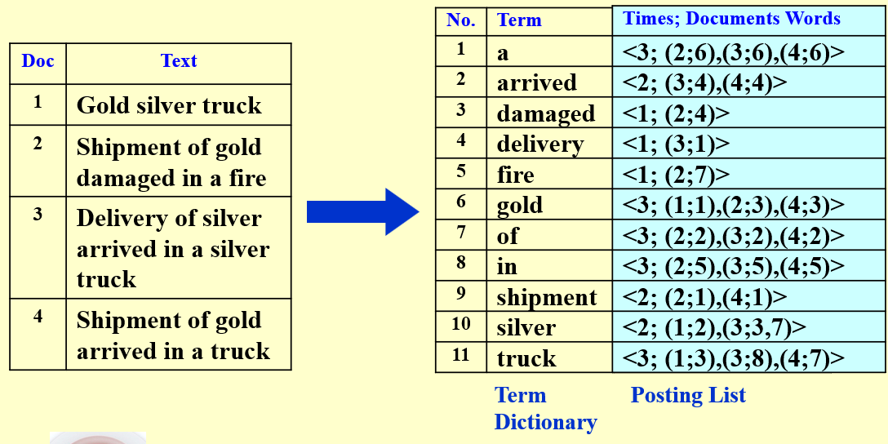
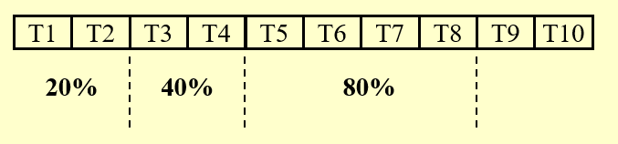

# 倒排文件索引

倒排文件是一种数据结构，用于存储某一个特定词汇在文本中出现的所有位置的索引（如页码数、行号或是用某种方式记录的文本具体位置等），是信息检索系统中最常用的数据结构之一。

- 基本思想：对于文本中的每一个词汇，记录该词汇在文本中出现的所有位置。
- 主要优点：可以快速定位到文本中的某一个词汇，从而快速检索到包含该词汇的文本。

{ width=80% }

在上图中，除了储存文件的索引之外，还储存了这些单词出现的频率。这是因为一般而言，一个单词在整一个数据库中出现的频率越低，它的检索价值就越高，对这些词汇进行检索就更容易找到相关的资料；而有一些词汇在所有文本中出现的频率都很高，如“the”、“a”等包括介词、代词在内的常用词汇，这些词汇对于检索来说并没有太大的价值，因为几乎所有文本都会带有这些词汇，检索它们并不能帮助我们找到我们想要的资料，我们将这些词称为 **Stop Words（停用词）**。

---

## 构建一个倒排文件索引

```c
while ( read a document D ) {
    while ( read a term T in D ) {
        if ( Find( Dictionary, T ) == false )
            Insert( Dictionary, T );
        Get T’s posting list;
        Insert a node to T’s posting list;
    }
}
Write the inverted index to disk;
```

在构建时，需要考虑一些问题：

- **Word Stemming**：词汇变形问题，如单词的时态、单复数、大小写等问题，需要将这些变形的词汇都映射到同一个词汇上。如 “run”、“Run”、“running”、“ran” 等都应映射到 “run” 上，不应单独储存。
- **Stop Words**：停用词问题，如 “the”、“a”、“it” 等常用词汇，不应储存。
- **检索方式**：

    - 搜索树：检索速度较慢，但是支持模糊查询（范围查询）。
    - 哈希表：检索速度较快，但是不支持模糊查询，并且需要考虑哈希冲突的问题。

- **内存管理**：当需要储存的数据量非常大，一个硬盘都装不下时，就需要把数据分别装在不同的硬盘上
    ```c title="多个硬盘的倒排文件索引构建"
    BlockCnt = 0; 
    while ( read a document D ) {
      while ( read a term T in D ) {
        if ( out of memory ) {
          Write BlockIndex[BlockCnt] to disk;
          BlockCnt ++;
          FreeMemory;
        }
        if ( Find( Dictionary, T ) == false )
          Insert( Dictionary, T );
        Get T’s posting list;
        Insert a node to T’s posting list;
      }
    }
    for ( i=0; i<BlockCnt; i++ )
      Merge( InvertedIndex, BlockIndex[i] );
    ```
- **Distributed indexing**：将倒排索引分布到多个服务器上，每个服务器按照文件内容或文件编号等形式分类，分别负责一部分索引

<figure>
    
</figure>

- **Dynamic indexing**：假如在每一次文件增删之后立刻就更新索引库，这样的开销是相当大的，因此可以建立一个辅助索引库，对于索引的更改先暂存在辅助索引库中，搜索时同时使用主索引库和辅助索引库，当满足一定条件时（每隔一定时间、辅助索引库大小达到一定程度等），再将辅助索引库中的内容合并到主索引库中去。（类似于 cache 的思想）

<figure>
    
</figure>

- **Compression**：在储存时将 stop words 去掉，并且储存每个单词的长度而非该单词首字母出现的位置。这样就可以减少索引的大小，提高检索速度。

<figure>
    
</figure>

- **Thresholding（阈值）**：

    1. 文档阈值：

        - 将所有文档按照权重排列，仅返回排名最高的前 x 个文档。
        - 不适用于布尔查询，因为布尔查询通常需要返回所有文档。
        - 缺点在于可能因为截断忽略一些相关的文档，如重要文档的数量不止 x 个。

    2. 查询阈值：

        - 将查询词按照出现的频率升序排列
        - 仅根据原始查询词中的某个百分比进行搜索，如在下图中按 20%、40%、80% 的比例搜索查询词

        { width=75% }

---

## 如何衡量一个搜索引擎

对于用户而言，一个搜索引擎的性能衡量指标主要有两个：**准确率** 与 **召回率**。

- 准确率：检索到的与目标相关的文档 与 检索到的所有文档的比值
    Perscision = $ \dfrac{R_R}{R_R + I_R} $
- 召回率：检索到的相关文档 与 数据库中所有相关文档的比值。
    Recall = $ \dfrac{R_R}{R_R + R_N} $

<figure>
    
</figure>

通常而言准确率越高，召回率就越低；反之，召回率越高，准确率就越低，在设计系统时通常要对两者进行 trade off。