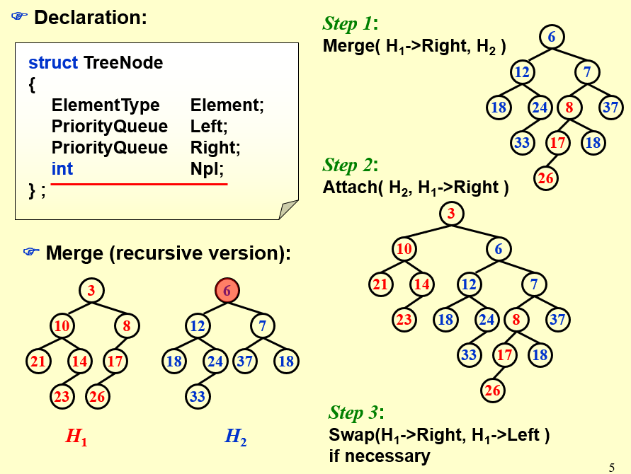
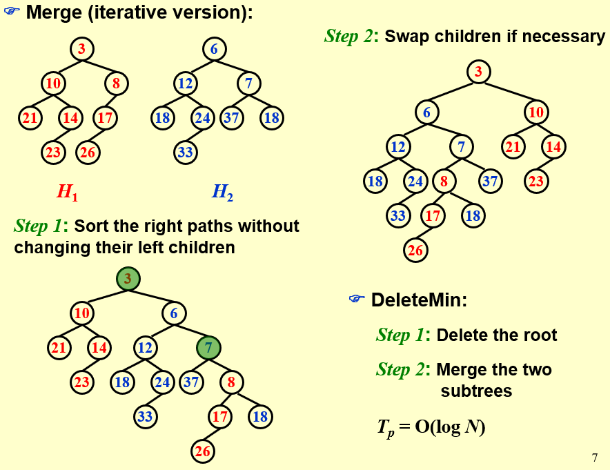
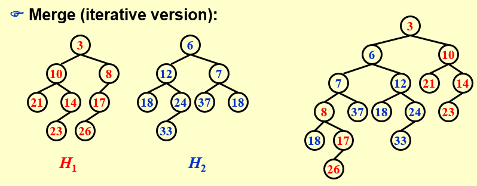

# 左倾堆与斜堆

对于一般的堆的各种基本操作的分析，在这里不再强调，但我们希望合并能有更好的表现，把$O(n)$的时间复杂度改进到$O(\log n)$，这就是我们定义左倾堆以及斜堆的思想来源。

## 左倾堆

### 左倾堆的定义与性质

!!! note "NPL"
    我们把任一结点 $X$ 的零路径长（Null Path Length, NPL），$NPL(X)$ 定义为从 $X$ 到一个没有两个儿子的结点的最短路径的长。因此，具有 0 个或 1 个儿子的结点的 NPL 为 0，且规定 $NPL(\text{NULL}) = -1$。

根据这一定义，我们知道对于任意结点 $X$，
$$ NPL(X) = 1 + min{NPL(left), NPL(right)} $$

!!! note "左倾堆 Leftist Heap"
    - 左倾堆的序性质与一般的二叉堆相同
    - 左倾堆的结构性质：

        - 对于任意结点 $X$，其左儿子的 NPL 不小于右儿子的 NPL，即 $NPL(left) \geqslant NPL(right)$
        - 这一定义也适用于没有两个孩子的结点，因为根据定义有 $NPL(\text{NULL}) = -1$

根据左倾堆的定义，我们可以得到左倾堆的一个性质

!!! note "左倾堆的性质"
    === "性质"
        在右路径上有 $r$ 个结点的左倾堆必然至少有 $2^r−1$ 个结点（右路径指从根结点出发一路找右孩子直到找到叶子的路径）。

        进而我们也可以推导出：有 $n$ 个结点的左倾堆的右路径上至多有 $\lfloor \log(n+1) \rfloor$ 个结点。

    === "证明"
        可以使用数学归纳法证明。

        - 若 $r=1$，则显然至少存在 1 个结点。
        - 设此结论对右路径上有小于等于 $r$ 个结点的情况都成立，现在考虑在右路径上有 $r+1$ 个结点的左倾堆。

            此时根的右子树恰好在右路径上有 $r$ 个结点，因此由归纳假设，右子树的大小至少为 $2^r−1$。而根据左倾堆的定义，左子树的 NPL 必须大于等于 $r-1$，即左子树的右路径上至少有 $r$ 个结点，因此左子树的大小也至少为 $2^r−1$。因此整个左倾堆的大小至少为 $1 + 2^r−1 + 2^r−1 = 2^{r+1} − 1$。

### 左倾堆的操作与实现

我们主要解决三个核心操作：Insert、DeleteMin、Merge，其他的操作与二叉堆差别不大或者没有必要。

- Merge：最核心的操作，事实上是接下来两种操作的基础。
- Insert：可以视为一个堆和一个单结点堆的 Merge，因此问题转化为 Merge。
- DeleteMin：两个步骤实现：首先删除根结点，然后只需要将根结点的两个子树 Merge 即可，此关键问题还是 Merge。

于是我们发现这三种操作最终都归结于 Merge，时间复杂度也完全取决于 Merge，因此接下来只对 Merge 进行讨论。

对于 Merge 我们有递归和迭代两种版本的实现

#### 递归实现

{ width=80% }

```C
PriorityQueue Merge ( PriorityQueue H1, PriorityQueue H2 )
{ 
    if ( H1 == NULL )
        return H2;	
    if ( H2 == NULL )
        return H1;	
    if ( H1->Element < H2->Element )
        return Merge1( H1, H2 );
    else 
        return Merge1( H2, H1 );
}

static PriorityQueue
Merge1( PriorityQueue H1, PriorityQueue H2 )
{ 
    if ( H1->Left == NULL )
        H1->Left = H2;	/* H1->Right is already NULL 
                            and H1->Npl is already 0 */
    else {
        H1->Right = Merge( H1->Right, H2 );
        if ( H1->Left->Npl < H1->Right->Npl )
            SwapChildren( H1 );
        H1->Npl = H1->Right->Npl + 1;
    }
    return H1;
}
```

这里将 Merge 分为两个函数主要是为了模块化处理，避免将`H1`于`H2`因大小不同而交换的操作写在一个函数中，使函数更简洁。

??? note "合并为一个函数的写法"
    ```C
    PriorityQueue Merge ( PriorityQueue H1, PriorityQueue H2 )
    { 
        if ( H1 == NULL )
            return H2;	
        if ( H2 == NULL )
            return H1;	
        if ( H1->Element < H2->Element )
            swap( H1, H2 );
        if ( H1->Left == NULL )
            H1->Left = H2;
        else {
            H1->Right = Merge( H1->Right, H2 );
            if ( H1->Left->Npl < H1->Right->Npl )
                SwapChildren( H1 );
            H1->Npl = H1->Right->Npl + 1;
        }
        return H1;
    }
    ```

其主要步骤位为：

1. 如果两个堆中至少有一个是空的，那么直接返回另一个即可；
2. 如果两个堆都非空，我们比较两个堆的根结点`key`的大小，`key`小的是`H1`，`key`大的是`H2`；
3. 如果`H1`只有一个顶点（根据左倾堆的定义，只要它没有左孩子就一定是单点），直接把`H2`放在`H1`的左子树就完成任务了（很容易验证这样得到的结构符合左倾堆性质，此时Npl也没有变化）；
4. 如果`H1`不只有一个顶点，则将`H1`的右子树和`H2`合并（这是递归的体现，在basecase 设计良好，其它步骤也都合理的情况下你完全可以相信这一步递归帮你做对了），成为`H1`的新右子树；
5. 如果`H1`的 Npl 性质被违反，则交换它的两个子树；
6. 更新`H1`的 Npl，结束任务。

!!! tip
    这里有两个问题需要注意：

    1. 一定要及时更新 Npl，否则所有结点的 Npl 都是初始值 0
    2. 这一算法的复杂度如何？

        我们可以发现这一递归程序的递归深度不会超过两个左倾堆的右路径的长度之和，不妨设`H1`的大小为 $N_1$，`H2`的大小为 $N_2$，两者路径长度之和为
        $$ O(\log N_1 + \log N_2) = O(\log N_1 N_2) = O(\log \sqrt{N_1 N_2}) = O(\log (N_1 + N_2)) $$

        这里的推导使用到了基本不等式 $ a + b \geqslant 2\sqrt{ab} $。总而言之，两个堆右路径长度之和是两个堆大小的对数级别，因此递归层数是 $O(\log n)$ 的。
        
        事实上每一层的操作都是常数的，因为只需要接上新的指针，判断、交换子树以及更新 Npl，因此总的时间复杂度也是 $O(\log n)$ 的

#### 迭代实现

{ width=80% }

事实上，上面递归过程的展开实际上就等价于迭代算法的流程：每一次递归向下对应迭代中保留根结点更小的堆的左子树（就像是左子树不动，右子树等着接下来合并的结果），直到最后一次与 NULL 合并直接接上。

递归返回过程实际上就是逐个检查新的右路径上的结点是否有违反 Npl 性质的，并且更新 Npl；其它结点无需关心，因为在 merge 过程中它们根本就不受影响。

因为我们已经说明了迭代和递归的每一步都是有对应关系的，只不过递归是最后返回时才接
上每个结点的右子树，迭代过程中就已经接好了，因此二者时间复杂度是一样的，$O(\log n)$。

!!! note
    我们在完成上面的流程后会观察到，在递归向下之后，或者说交换孩子调整左倾堆性质之前，合并得到的堆的右路径是原来两个堆的右路径合并排序的结果。因为我们每次都在比较两个堆的右路径上两个点的大小，然后把小的作为根插入。

    发现这一规律之后，我们做题会更快捷一些，因为只需要把两条右路径从小到大排序，然后从小到大依次带着左子树连接，构成得到新的右路径即可（但要注意在此之后还可能需要交换左右子树调整使得满足左倾堆结构性质）。

总的来说，我们用代码实现迭代版本也并没有想象中复杂，只需要对两个堆右路径从小到大遍历操作，然后再从右路径最后一个点返回根结点，在返回的过程中不断更新 Npl 并检查结构性质即可。

```cpp
LeftistHeap MergeIterator(LeftistHeap H1, LeftistHeap H2) {
    if (H1 == NULL) return H2;
    if (H2 == NULL) return H1;
    stack<LeftistHeap> s;
    LeftistHeap root = NULL;
    // 将两个左倾堆的右路径上的结点从小到大加入栈中
    while (H1 != NULL && H2 != NULL) {
        if (H1->element < H2->element) {
            s.push(H1);
            H1 = H1->right;
        } else {
            s.push(H2);
            H2 = H2->right;
        }
    }
    // 将剩余的右路径上的结点加入栈中
    while (H1 != NULL) {
        s.push(H1);
        H1 = H1->right;
    }
    while (H2 != NULL) {
        s.push(H2);
        H2 = H2->right;
    }
    // 从右路径最后一个结点开始返回
    while (!s.empty()) {
        LeftistHeap tmp = s.top();
        s.pop();
        if (root == NULL) {
            root = tmp;
        } else {
            tmp->right = root;
            root = tmp;
            npl_update(root);
            // 检查左倾堆性质，如果违反则交换左右子树
            if (root->left == NULL || root->left->npl < root->right->npl) {
                swap(root->left, root->right);
            }
        }
    }
```

---

## 斜堆

### 斜堆的定义和性质

斜堆与左倾堆的关系类似于 splay 树与 AVL 树的关系，就像 splay 树不再需要维护 AVL 树的 bf 属性，斜堆也不再需要维护左倾堆的 Npl 属性，而是直接通过交换左右子树来维护堆的性质，具体操作如下：

- base case：处理 H 与 NULL 连接的情况，左倾堆直接返回 H 即可，但斜堆必须要观察 H 的右路径，我们要求 H 的右路径上除了最大结点之外都必须交换其左右孩子
- 非 base case：若 H1 的根结点小于 H2，如果是左式堆，我们需要合并 H1 的右子树和 H2 的结果作为 H1 的新右子树，然后再判断这样是否违反性质决定是否交换左右孩子。

    而斜堆每一次合并之后不管什么情况都要进行一次交换，也就是说每次这种情况都**先把 H1 的左孩子换到右孩子的位置，然后把新合并的插入在 H1 的左子树上**。

{ width=80% }

!!! warning "注意！"
    在做题时一定要以上面（PPT）中给出的方法为准，在维基百科等资料中斜堆在 base case 无需任何操作，但事实上如果按照 PPT 所说的，这之后还有可能有操作，作业和考试都应该按照这里和 PPT 上说的为准。

类似于左式堆，我们发现最后合并出的堆的左路径上，将包含两个原始堆的右路径结点排序后得到的结果，左路径的最末尾可能还连着原始堆右路径最大值的一些左孩子（因为这些左孩子是不被交换的）。

### 斜堆的摊还分析

斜堆具有像splay 树一样的 $O(\log n)$ 的摊还操作代价，“Any M consecutive operations take at most $O(M\log N)$ time”

因为对于斜堆来说，insert 和 deletemin 还是以 merge 为核心，因此我们只需要分析 merge 即可。

下面我们使用势函数发进行摊还分析，为了定义势函数我们还需要辅助的定义

!!! note "重结点与轻结点"
    我们称一个结点 $P$ 是重的（heavy），如果它的右子树结点个数至少是 $P$ 的所有后代的一半（后代包括 $P$ 自身）。反之称为轻结点（light node）。

此外我们还需要一个引理

!!! lemma 
    === "引理"
        对于右路径上有 $l$ 个轻结点的斜堆，整个斜堆至少有 $2^l-1$ 个结点，这意味着一个 $n$ 个结点的斜堆右路径上的轻结点个数为$O(\log n)$。

    === "证明"
        我们可以用数学归纳法来证明。对于 $l=1$ 的情况显然成立，现在设小于等于 $l$ 时，斜堆至少有 $2^l-1$ 个结点的结论都成立。

        现在考虑右路径有 $l+1$ 个轻结点的情况，设右路径第一个轻结点为 $P$，根据轻结点的定义，它的左子树要大于等于右子树。而 $P$ 的右子树的右路径上有 $l$ 个轻结点，因此 $P$ 的右子树大小至少为 $2^l-1$，又因为 $P$ 的左子树结点数要大于等于右子树结点数，因此 $P$ 为根的树至少有 $1 + 2^l-1 + 2^l-1 = 2^{l+1}-1$ 个结点，从而整个堆至少有 $2^{l+1}-1$ 个结点。

最终我们要通过摊还分析得到的定理如下：

!!! info "定理"
    若我们有两个斜堆 $H_1$ 和 $H_2$，它们分别有 $n_1$ 和 $n_2$ 个结点，则合并 $H_1$ 和 $H_2$ 的摊还时间复杂度为 $O(\log n)$，其中 $n=n_1+n_2$。

??? proof 
    我们定义势函数 $\Phi(H_i)$ 等于堆 $H_i$ 的重结点（heavy node）的个数，并令 $H_3$ 为合并后的新堆.我们设 $H_i(i=1,2)$ 的**右路径上的**轻结点数量为 $l_i$，重结点数量为 $h_i$，因此真实的合并操作最坏的时间复杂度为 
    $$ c_i=l_1+l_2+h_1+h_2 $$
    这里所有操作都在右路径上完成。因此根据摊还分析我们知道摊还时间复杂度为
    $$ \hat{c_i} = c_i + \Phi(H_3) - (\Phi(H_1) + \Phi(H_2)) $$

    事实上，在 merge 前我们可以记
    $$ \Phi(H_1) + \Phi(H_2) = h_1 + h_2 + h $$
    其中 $h$ 表示不在右路径上的重结点个数。

    现在我们要考察合并后的情况，事实上我们可以观察到非常重要的两点:

    1. 只有在 $H_1$ 和 $H_2$ 右路径上的结点才可能改变轻重状态，这是很显然的，因为其它结点合并前后子树是完全被复制的，所以不可能改变轻重状态；
    2. $H_1$ 和 $H_2$ 右路径上的重结点在合并后一定会变成轻结点，这是因为右路径上结点一定会交换左右子树，并且后续所有结点也都会继续插入在左子树上（这也表明轻结点不一定变为重结点）。

    结合以上两点，我们知道合并后原本不在右路径上的h个重结点仍然是重结点，在右路径上的 $h_1 + h_2$ 个重结点全部变成轻结点，$l_1 + l_2$ 个轻结点不一定都变重，因此合并后我们有
    $$ \Phi(H_3) \leqslant l_1 + l_2 + h $$
    带入数据计算可得
    $$ \hat{c_i} \leqslant (l_1+l_2+h_1+h_2) + (l_1+l_2+h) - (h_1+h_2+h) = 2(l_1+l_2) $$

    根据前面的引理，$l_1+l_2 = O(\log n_1+\log n_2) = O(\log (n_1+n_2)) = O(\log n)$。并且注意到初始（空堆）势函数一定为 0，且之后总是非负的，所以这一势函数定义满足要求，因此我们的证明也就完成了。
