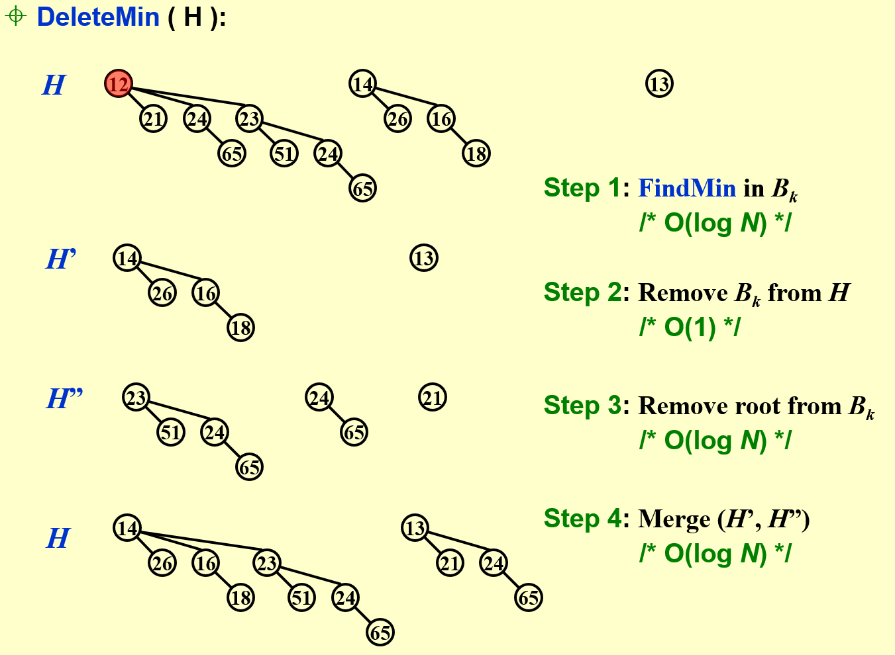
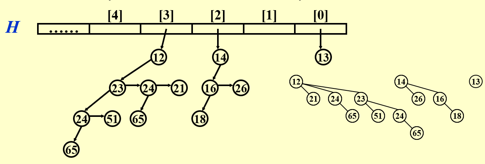
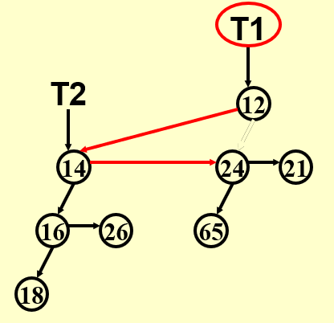

# 二项堆

## 二项堆的定义与性质

对于一般的二叉堆，我们知道其插入和删除操作的时间复杂度为 $O(\log n)$，而从空堆开始，构造一个含有 $n$ 个元素的二叉堆的时间复杂度可以做到 $O(n)$（要注意此时并不是直接从零开始插入 $n$ 个元素，可以回顾FDS的内容）。

很遗憾的是先前讨论的左倾堆与斜堆虽然保证了 merge 的时间复杂度是 $O(\log n)$，却不能在 $O(n)$ 时间内实现 $n$ 个结点的插入建堆操作，二项堆的思想就源自于此。

!!! note "二项堆的定义"
    1. 结构性质：

        - 二项堆不再是一棵树，而是多棵树构成的森林（一些树构成的集合），其中每一棵树都称为二项树
        - 一个二项堆中的每棵二项树都具有不同的高度，即每一个高度最多对应一棵二项树
        - 高度为 $0$ 的二项树 $B_0$ 是一个单节点树；高度为 $k$ 的二项树 $B_k$ 由一棵高度为 $k-1$ 的二项树 $B_{k-1}$ 附加到另一棵二项树 $B_{k-1}$ 的根上而构成

    2. 堆序性质：
    
        - 二项堆中的每棵二项树都满足堆序性质（最小堆或最大堆）

观察可以发现

- 一棵二项树  $B_k$ 实际上就是一个树根结点连接着 $k$ 棵二项树 $B_0, B_1, \cdots, B_{k-1}$ 构成的
- 高度为 $k$ 的二项树恰好有 $2^k$ 个结点
- 深度为 $d$ 的节点数为二项系数 $\binom{k}{d}$

!!! proof "数学归纳法证明"
    1. 对于 $k=0$ 的情况，上述结论显然成立
    2. 假设直到 $k$ 的情况结论都是成立的，则对于 $B_{k+1}$，第一层和最后一层显然只有一个结点，对于其他层，由于 $B_{k+1}$ 是由两个 $B_k$ 拼接得到的， $B_{k+1}$ 在第 $i$ 层的结点数以下两部分组成：
    
        - 一棵 $B_k$ 的第 $i$ 层，有$\binom{k}{i}$ 个结点
        - 另一棵 $B_k$ 的第 $i-1$ 层，有$\binom{k}{i-1}$ 个结点

    因此由归纳假设 $B_{k+1}$ 的第 $i$ 层有 $\binom{k}{i} + \binom{k}{i-1} = \binom{k+1}{i}$ 个结点，命题得证

从上面的证明我们可以很自然地看出二项堆与二项树这个名字的由来。

我们也可以把二项堆与二进制表示结合起来。例如含有 $13 = 1101_2$ 个结点的二项堆由三棵二项树 $B_3, B_2, B_0$ 组成，二进制表示中`1`的个数就是这个二项堆中二项树的棵数。

---

## 二项堆的操作

### FindMin

直接遍历所有二项树的根结点即可，注意到对于有 $n$ 个结点的二项堆，至多有 $\log n$ 棵二项树，因此时间复杂度为 $O(\log n)$.

我们也可以专门记录最小的根结点来实现 $O(1)$ 的时间复杂度，只不过在 DeleteMin 的时候需要重新找到最小的根结点并更新。

### Insert & Merge 

插入是合并的一种特殊情况，只需将新插入的结点视作一个单节点的二项堆，因此我们只需要分析合并即可。

二项堆的合并可以与二进制数表示相结合，例如一个有 $B_3, B_2, B_0$ 的二项堆与有 $B_3, B_1, B_0$ 的二项堆合并，我们只需要类比二进制加法 $1101_2 + 1011_2 = 11000_2$，就可以很自然的发现最终得到的二项堆是 $B_4, B_3$。

时间复杂度的分析也很简单，**在保证堆的存储顺序是按高度从小到大排列的前提下**，时间复杂度为 $O(\log n)$

!!! note
    进行插入操作时，如果不存在的二项树中最小的是 $B_i$，那么我们至多需要进行 $i+1$ 次将两棵树合并的操作（类比于二进制加法的进位就可以很容易看出）。

### DeleteMin

{ width=80% }

1. 先用 $O(\log n)$ 的时间找到根的最小值 Min（也可能是 $O(1)$ 的时间，但这意味着所有操作结束后还需要更新最小值）
2. 接着我们可以得到两个二项堆

    - 其一是原二项堆移除 Min 所在的树后剩下的堆
    - 其二是 Min 所在的树移除根结点（移除 Min）后得到的堆

3. 将这两个二项堆合并即可

最终所需的时间复杂度显然是 $O(\log n)$ 的。

### 从空堆开始建堆的摊还分析

对于从空开始插入建堆的时间复杂度我们需要做特殊的分析。因为我们是要求出平均时间的最坏情况，事实上也就是摊还代价，这里提供聚合法以及势能法两种摊还分析方法。

!!! note 
    === "聚合法"
        聚合法需要每一步的操作复杂度，实际上我们随便模拟几步再结合之前讨论的合并和二进制加法之间的关系就可以发现，插入的整个操作与二进制数加1有完全的对应关系：

        - 若遇到某一位是 1+1，则用常数操作完成简单的合并即可
        - 若遇到某一位是 0+1，那么最终当前位的二项树就是 “1” 对应的那个二项树
        
        基于这一观察我们可以发现 0+1 对应将 0 置 1，1+1 对应 1 置 0，这两种情况都对应于堆的常数时间操作，因此从空树连续插入 $n$ 个顶点的时间复杂度与 0+1+1···（n个1）的过程中数据二进制表示中 0 和 1 比特翻转的次数总和相对应。

        为我们知道 $n$ 对应于 $\lfloor \log n \rfloor + 1$ 个二进制位，事实上最低位每次加 1 都会反转比特，次低位每两次运算反转比特，倒数第三位每 4 次运算反转比特...... 以此类推， $n$ 次操作的整体时间复杂度与
        $$ n + \dfrac{n}{2} + \dfrac{n}{4} + \cdots + \dfrac{n}{2^{\lfloor \log n \rfloor + 1}} $$
        成正比，根据等比数列求和可知上述求和是小于 $2n$ 的（取 $n \to \infty$ 才能到 $2n$）.

        因此插入 $n$ 个结点的摊还时间复杂度是 $O(n)$ 的，那么平均每步操作的时间复杂度是 $O(1)$。

    === "势能法"
        同样考虑二进制加法问题，我们发现复杂度很大的操作都对应于很多的复位（1 变 0）和一个置位（0 变 1），因此我们直接设势能函数 $\Phi$ 为二进制表示中 1 的个数（即二项堆中树的个数）。

        假设第 $i$ 次操作除了新加入一个结点之外，还有 $k(k \geqslant 0)$ 次复位，那么 $c_i = k + 1$，则

        $$\begin{aligned}
        \hat{c_i} &= c_i + (\Phi_i - \Phi_{i-1})  \\
        &= k + 1 + (1 - k) \\
        &= 2 
        \end{aligned}$$ 

        因此对于每一步操作的摊还复杂度都是 $O(1)$ 的。

---

## 二项堆的代码实现

由于二项堆为了满足从空堆开始构造一个含有 $n$ 个元素的堆的时间复杂度可为 $O(n)$ 的目标，舍弃了二叉堆这个性质，因此不能使用简单的 LeftChild 和 RightChild，我们使用 LeftChild 和 NextSibling 的组合实现，即每个结点的左指针指向自己最大的子树，右指针指向自己的兄弟。

需要注意的是这里根的子树从左到右高度依次减小，并且为了方便索引每棵二项树，我们用一个数组存储每棵二项树的根，其中数组的索引就对应二项树的高度。

{ width=80% }

### 结构定义

```C
typedef struct BinNode *Position;   // 树结点指针
typedef struct Collection *BinQueue;// 二项队列，即二项堆
typedef struct BinNode *BinTree;    // 二项树

struct BinNode 
{ 
    ElementType	    Element;
    Position	    LeftChild;
    Position 	    NextSibling;
} ;

struct Collection 
{ 
    int	    	CurrentSize;        // total number of nodes 
    BinTree	TheTrees[ MaxTrees ];   // 列表中每一个元素都是指向一棵二项树的指针
} ;
```

### Combine

{ align=right width=30% }

我们知道 Insert 和 DeleteMin 的关键操作都是 Merge，而在 merge 中我们常常需要合并两颗大小相同的二项树，因此我们首先讨论 combine 的实现。

在 combine 两棵大小相同的两棵二项树时，结合堆的序性质以及 LeftChild 和 NextSibling 的实现，我们发现只需要将根结点更小的二项树 $T_1$ 的根作为新二项树的根，根结点大的树 $T_2$ 作为新根的 LeftChild，再将 $T_2$ 的 NextSibling 指针接上原先 $T_1$ 除去根结点的剩余部分即可。

这里的时间复杂度显然是常数的。

```C
BinTree CombineTrees( BinTree T1, BinTree T2 )
{  /* merge equal-sized T1 and T2 */
    if ( T1->Element > T2->Element )
        return CombineTrees( T2, T1 );
    /* insert T2 to the front of the children list of T1 */
    T2->NextSibling = T1->LeftChild;
    T1->LeftChild = T2;
    return T1;
}
```

### Merge

在下面 Merge 操作的实现中，从小到大依次对二项堆中的树进行合并，`Carry`表示是否有进位，`T1`表示来自二项堆`H1`的树，`T2`表示来自二项堆`H2`的树。

```C
BinQueue  Merge( BinQueue H1, BinQueue H2 )
{	BinTree T1, T2, Carry = NULL; 	
    int i, j;
    if ( H1->CurrentSize + H2->CurrentSize > Capacity )  
        ErrorMessage();
    H1->CurrentSize += H2->CurrentSize;
    for ( i=0, j=1; j<= H1->CurrentSize; i++, j*=2 ) {
        T1 = H1->TheTrees[i]; T2 = H2->TheTrees[i]; /*current trees */
        switch( 4*!!Carry + 2*!!T2 + !!T1 ) { 
        case 0: /* 000 */
        case 1: /* 001 */   break;	
        case 2: /* 010 */   H1->TheTrees[i] = T2; 
                            H2->TheTrees[i] = NULL; 
                            break;
        case 4: /* 100 */   H1->TheTrees[i] = Carry; Carry = NULL; 
                            break;
        case 3: /* 011 */   Carry = CombineTrees( T1, T2 );
                            H1->TheTrees[i] = H2->TheTrees[i] = NULL; 
                            break;
        case 5: /* 101 */   Carry = CombineTrees( T1, Carry );
                            H1->TheTrees[i] = NULL;
                            break;
        case 6: /* 110 */   Carry = CombineTrees( T2, Carry );
                            H2->TheTrees[i] = NULL;
                            break;
        case 7: /* 111 */   H1->TheTrees[i] = Carry; 
                            Carry = CombineTrees( T1, T2 ); 
                            H2->TheTrees[i] = NULL;
                            break;
        }
    }
    return H1;
}
```

- `4*!!Carry + 2*!!T2 + !!T1`中`!!`的作用是将树转换为二进制表示，即将非空的树转换为`1`，空树转换为`0`
- `000`：此时什么都不需要做，因为三个位置都是空的
- `001`：同样什么都不需要做，此时`H1`非空，`H2`是空树，不需要进行合并
- `010`：此时需要将`H2`的树转移到`H1`上
- `011`：此时需要进位，即两棵相同大小的二项树合并为一棵更大的二项树，`Carry`要变为两数之和，`H1`与`H2`要被清空
- `100`：类似于`010`的情况，但此时是把`Carry`接到`H1`上
- `101`：需要进位，当前位置`0`，新的`Carry`等于原先的`Carry`与`H1`合并的结果
- `110`：遇上一种情况类似，新的`Carry`等于原先的`Carry`与`H2`合并的结果
- `111`：此处做法不唯一，我们只需要保留三棵树中的任意一棵，再将另外两棵合并然后进位上去即可

乍一看情况很多很复杂，但只要把它与二进制的竖式加法对应起来，就很容易理解了。

### DeleteMin

```C
ElementType  DeleteMin( BinQueue H )
{	BinQueue DeletedQueue; 
    Position DeletedTree, OldRoot;
    ElementType MinItem = Infinity;
    int i, j, MinTree; /* MinTree is the index of the tree with the minimum item */

    if ( IsEmpty(H) ) {
        PrintErrorMessage();
        return –Infinity;
    }
    
    /* Step 1: find the minimum item */
    for ( i = 0; i < MaxTrees; i++) {  
        if( H->TheTrees[i] && H->TheTrees[i]->Element < MinItem ) { 
            MinItem = H->TheTrees[i]->Element;
            MinTree = i;
        }
    }
    DeletedTree = H->TheTrees[MinTree];

    /* Step 2: remove the MinTree from H => H' */ 
    H->TheTrees[MinTree] = NULL; 

    /* Step 3.1: remove the root */ 
    OldRoot = DeletedTree;   
    DeletedTree = DeletedTree->LeftChild;
    free(OldRoot);

    /* Step 3.2: create H" */ 
    DeletedQueue = Initialize();
    DeletedQueue->CurrentSize = ( 1<<MinTree ) - 1;  /* 2^MinTree - 1 */
    for ( j = MinTree - 1; j >= 0; j-- ) {
        DeletedQueue->TheTrees[j] = DeletedTree;
        DeletedTree = DeletedTree->NextSibling;
        DeletedQueue->TheTrees[j]->NextSibling = NULL;
    }
    H->CurrentSize -= DeletedQueue->CurrentSize + 1;

    /* Step 4: merge H' and H" */ 
    H = Merge( H, DeletedQueue ); 
    return MinItem;
}
```

上面这段代码也不难理解

- 首先是一些错误处理和初始化
- 接着找到最小元素以及它所在的树，将最小树存储在`DeletedTree`中，然后将其从二项堆中移除
- 保存根节点到`OldRoot`，然后将`DeletedTree`改为指向其左子树，释放OldRoot所占的内存
- 接着初始化一个新的二项队列`DeletedQueue`，用于存放从最小树中拆分出的二项树
- 最后更新原二项堆`H`的大小，再将`H`与`DeletedQueue`与原二项堆合并
- 返回刚刚找到的最小元素