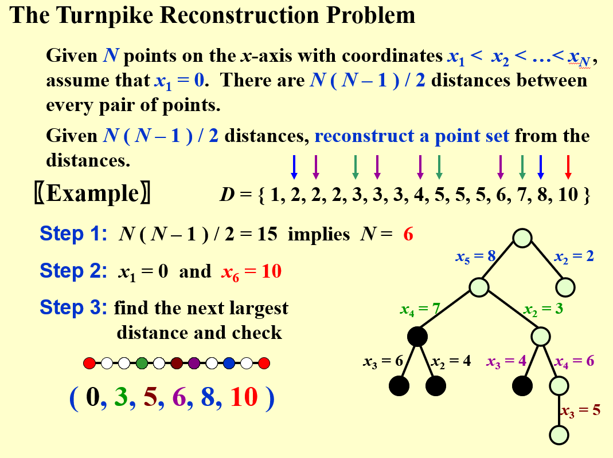
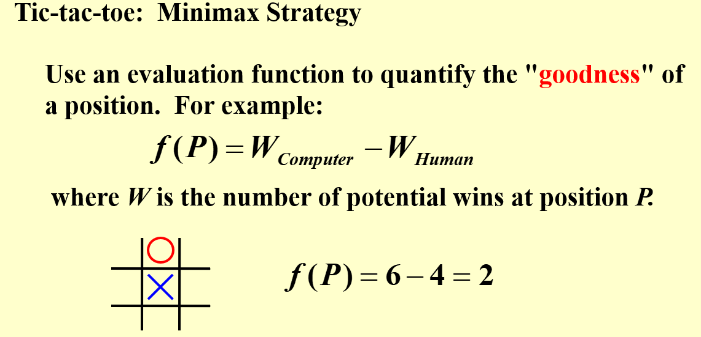
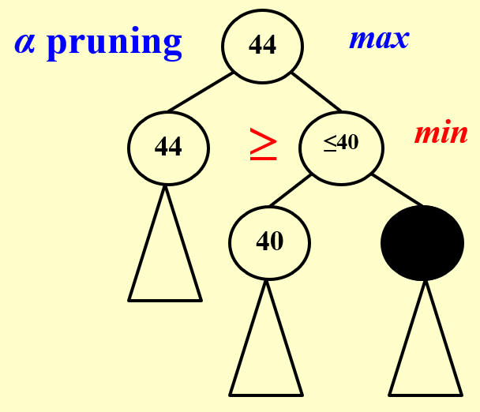
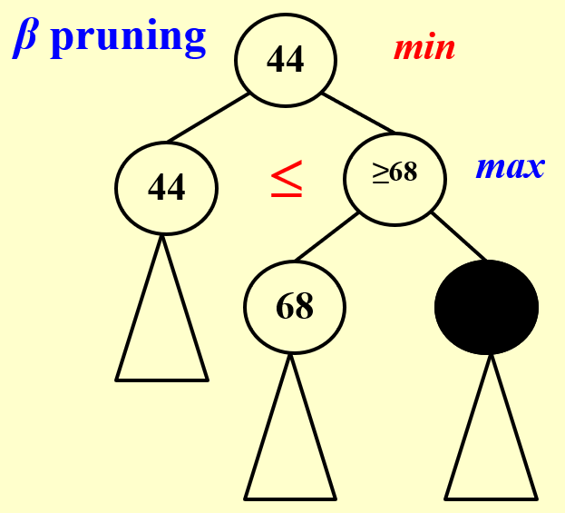

# 回溯法

## 基本思想

对于某些问题，我们需要找到符合条件的所有解，即使所有的可能性是有限的，但我们使用暴力搜索（exhausting search），或称蛮力法（Brute Force）来对所有的可能性进行逐一检查显然是效率低下的方法。但在很多情况下，我们可以通过某些判断将许多可能的结果排除掉，从而减少搜索的空间，例如从某一步操作开始需要满足的条件就已经不被满足了，那么从这一步开始的后续操作就不需要再进行了。这种排除的过程我们称之为“剪枝”（Pruning）。

回溯法的核心思想就是在尝试解决问题的过程中，当发现在进行了一系列操作 $(a_1, a_2, \cdots, a_n)$ 后，尝试进行下一步操作 $a_{n+1}$ 时，

- 假如发现操作序列 $(a_1, a_2, \cdots, a_n, a_{n+1})$ 仍然满足所有的约束条件那么就继续尝试下一步操作 $a_{n+2}$
- 否则，如果发现无论 $a_{n+1}$ 怎么选择，题目的某种约束条件都无法被满足，或是发现之后的操作已经无法再进行下去了，就撤销操作 $a_n$，回到 $(a_1, a_2, \cdots, a_{n-1})$ 的状态，尝试其他的操作 $a_n'$ 

这样一来，我们就可以通过不断的尝试和回溯来找到所有的解，同时排除掉了许多不可能的情况（当一种不可能成功的操作序列在进行到一半时，就已经发现后续不可能满足约束条件了，后续的操作就不需要再进行下去了），从而提高了搜索的效率。

简单来说回溯法就是不断地尝试，假如发现不行就撤销操作，尝试其他的方法。

---

## 回溯法的应用

### 八皇后问题

八皇后问题是一个经典的组合优化问题，问题的描述是：在一个 $8 \times 8$ 的棋盘上放置八个皇后，使得每个皇后都不在同一行、同一列和同一对角线上（皇后之间都无法彼此攻击）。

我们可以通过回溯法来十分便捷地解决这个问题，简单来说就是先尝试着不断放下皇后，假如发现在某个位置放置皇后之后，就已经没有可以放置新皇后的地方了，那么就撤回这个皇后，尝试其他的位置；假如这个不管放在哪里都会导致有一些皇后无法放置下去，那么就递归地回到上一步，撤销上一个皇后的位置，尝试其他的位置。

$k$ 皇后问题是八皇后问题的一般化，即在一个 $k \times k$ 的棋盘上放置 $k$ 个皇后，使得每个皇后都不在同一行、同一列和同一对角线上。

??? advice "一个简单的 $k$ 皇后问题 Python 实现"
    ```python
    from math import fabs

    def is_valid(solution, row, col):
        # Check if placing a queen at solution[row][col] is valid
        for r in range(row):
            if solution[r] == col or fabs(solution[r] - r) == fabs(col - row ):
                return False
        return True

    def run(row=0):
        if row == n and solution[::-1] not in solves:
            solves.append(solution.copy())
            return
        for col in range(n):
            if is_valid(solution, row, col):
                solution[row] = col
                run(row + 1)
                solution[row] = -1

    n = int(input("Enter the number of queens: "))
    solves = []
    solution = [-1] * n
    run()
    print("There are {} results.".format(len(solves)))

    for i in range(len(solves)):
        print("Solution {}: ".format(i+1), end="")
        print(solves[i])
        for j in range(n):
            for k in range(n):
                if solves[i][j] == k:
                    print("Q", end=" ")
                else:
                    print(".", end=" ")
            print()
    ```

### 收费公路问题 (turnpike problem) 

这个问题的名称得自于对美国西海岸公路上那些收税公路出口的模拟，它在物理学和分子生物学中都有应用，实际上就是给定一条直线上的 $n$ 个点，以及每两两个点之间的距离，求这些点的集合是否能够唯一地确定这条直线上的所有点。

{ width=80% }

- 我们的想法非常简单，就是首先确定点的个数以及两个端点的位置，例如在上图的例子中左右两个端点的位置分别是 0 和 10，接下来的每一步都考虑目前剩余的最大的距离，显然这个距离一定是新放置的端点与两个端点其中之一的距离。
- 于是对于每一个新的点我们都有两种放置的方法（与左端点的距离或与右端点的距离），我们可以依次尝试这两种放置方法，假如发现放置后接下来的点就无法满足给定的距离，那么就撤销这个点的放置，尝试另一种放置方法（假如两种方法都是不行的，那么就说明需要回溯到上一个点，尝试其他的放置方法）。
- 就这么进行下去，直到所有的点都被放置完毕，或是发现此时这一个问题没有任何解法。

从上图中我们也可以看到，不断进行回溯的过程就是一个建立决策树的过程，另外根据对称性我们知道当我们找到一种解法之后，我们只需要把这一条直线左右对称一下就可以得到剩余的唯一一种解法。

??? note "PPT 中的伪代码"
    ```C
    bool Reconstruct ( DistType X[ ], DistSet D, int N, int left, int right )
    { /* X[1]...X[left-1] and X[right+1]...X[N] are solved */
        bool Found = false;
        if ( Is_Empty( D ) )
            return true;                        /* solved */
        D_max = Find_Max( D );
        /* option 1: X[right] = D_max */
        OK = Check( D_max, N, left, right );    /* pruning */
        if ( OK ) {                             /* add X[right] and update D */
            X[right] = D_max;
            for ( i = 1; i < left; i++ )  
                Delete( |X[right]-X[i]|, D );
            for ( i = right+1; i <= N; i++ )  
                Delete( |X[right]-X[i]|, D );
            Found = Reconstruct( X, D, N, left, right-1 );
            if ( !Found ) {                     /* if does not work, undo */
                for ( i = 1; i < left; i++ )  
                    Insert( |X[right]-X[i]|, D );
                for ( i = right+1; i <= N; i++ )  
                    Insert( |X[right]-X[i]|, D );
            }
        }

        if ( !Found ) {
            /* option 2: X[left] = X[N] - D_max */
            OK = Check( X[N]-D_max, N, left, right );
            if ( OK ) {
                X[left] = X[N] - D_max;
                for ( i = 1; i < left; i++ )  
                    Delete( |X[left]-X[i]|, D );
                for ( i = right+1; i <= N; i++ )  
                    Delete( |X[left]-X[i]|, D );
                Found = Reconstruct (X, D, N, left+1, right );
                if ( !Found ) {
                    for ( i = 1; i < left; i++ ) 
                        Insert( |X[left]-X[i]|, D );
                    for ( i = right+1; i <= N; i++ ) 
                        Insert( |X[left]-X[i]|, D );
                }
            }
        }
        return Found;
    }
    ```

因此我们也可以得到一个对于一般回溯问题的框架
```C
bool Backtracking ( int i )
{   Found = false;
    if ( i > N )
        return true;        /* solved with (x1, …, xN) */
    for ( each xi in Si ) { 
        /* check if satisfies the restriction R */
        OK = Check((x1, …, xi) , R ); /* pruning */
        if ( OK ) {
            Count xi in;
            Found = Backtracking( i+1 );
            if ( !Found )
                Undo( i );  /* recover to (x1, …, xi-1) */
        }
        if ( Found ) break; 
    }
    return Found;
}
```

--- 

## 博弈

### 井字棋博弈（Tic-tac-toe）

在上面的问题中我们已经看到了一些决策树建立的例子，如果是双人乃至多人决策，那么我们面对的问题就是一个（扩展式）博弈问题。下面以井字棋（Tic-tac-toe）为例，介绍博弈相关的内容。

无论在何种博弈中，以下条件都是必不可少的

1. 参与人：在 Tic-tac-toe 中就是两个玩家，计算机与人类
2. 策略：在 Tic-tac-toe 博弈中就是每个玩家在看到当前的棋局情况做出的行动决策
3. 效用函数：在一般博弈中，理性人追求的是自己的效用最大化，在PPT中，我们将效用函数用自己与对手的 “number of potential wins at position P” 之差来表达，也就是说在当前的局势下还有多少种可能的赢法。

{ width=80% }

在 PPT 的例子中，我们为参与者指定的策略是所谓的“最大最小策略”（或“最小最大策略”），显然计算机玩家想要让效用函数最大，而人类玩家想要让效用函数最小。

即人类玩家知道计算机玩家会在自己落子之后选择效用最大的下法，那么人类玩家就要在各种可选的位置中挑选一个合适的位置，使得后续计算机玩家落子获取的最大效用最小（也就是说想办法削减效益函数的上限）；反之，假如人类想要最大化效用，并且知道计算机玩家会尽可能最小化效用，那么人类就应当选择使得效用的下限最高的一种落子方法。

### $\alpha-\beta$ 剪枝

实际上 $\alpha-\beta$ 剪枝的主要思想已经在上一段话中介绍了，下面举的例子中的 max 与 min 表示在这一层中，操作者的目标是最大化效用还是最小化效用

{ align=right width=27% }

- 所谓 $\alpha$ 剪枝就是我要使得效用函数最大化，那么我就要从可选的操作中选择效用的下限最大的一种（因为对手一定会在下一步操作中把效用变得最小），那么在寻找效用下限最大的操作的过程中，就会发现有一些操作的下限比已知的其他操作要低，那么这些操作的后续步骤实际上就不需要遍历了，这就是所谓的“剪枝”。

    如右图所示，我已经知道如果选左侧路径至少能得到 44 的效用，但如果我选择右侧路径，我们发现有一个叶结点我只能得到 40 的效用，由于对手一定会最小化效用，那么无论右侧路径剩余的叶结点是多少，右侧路径的效用下限也不会高于 40，这个下限已经低于左侧路径了，因此无论右侧路径的右下方叶结点是多少，我都不需要再进行搜索了，因为我一定会选择左侧路径，这个结点就被 $\alpha$ 剪枝（pruning）剪掉了，在图中用染黑表示。

{ align=right width=27% }

- $\beta$ 剪枝也是类似的情况，只不过我此时的目标是最小化效用函数，因此要寻找效用上限最低的操作。右图中我已知左侧的路径效用至多为 44，右侧路径的左下角叶结点效用为 68，那么右侧路径的效用上限不会低于 68，此时已经高于了 44，那么就不需要搜索右侧路径其他的叶结点了，我一定会选择左侧路径，未探索的结点直接 $\beta$ 剪枝剪掉即可。