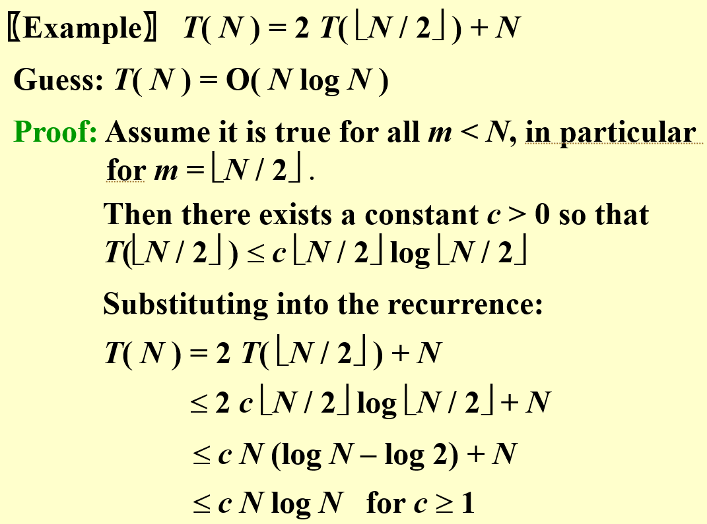
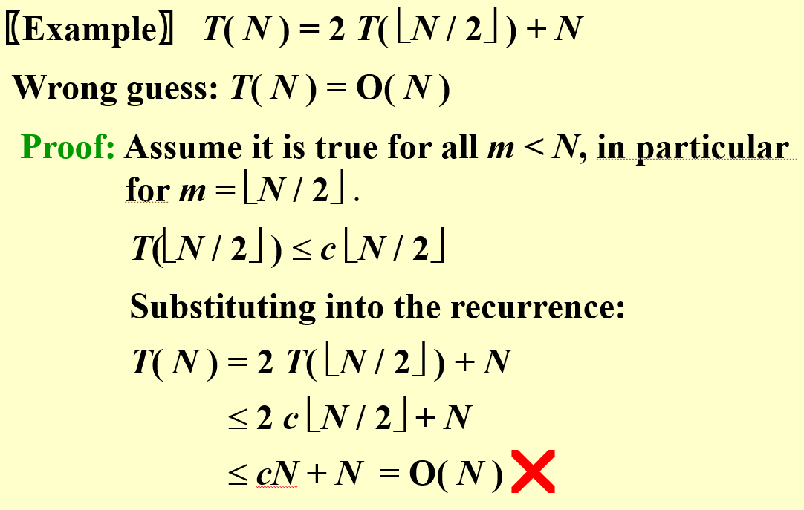
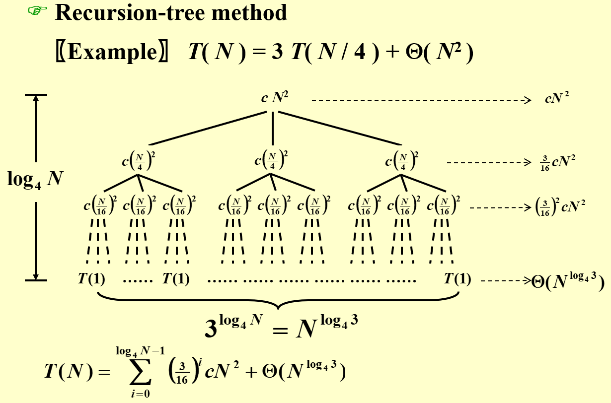
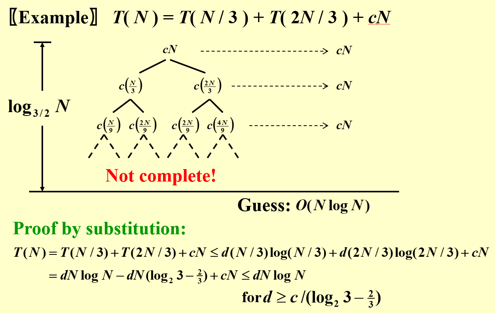
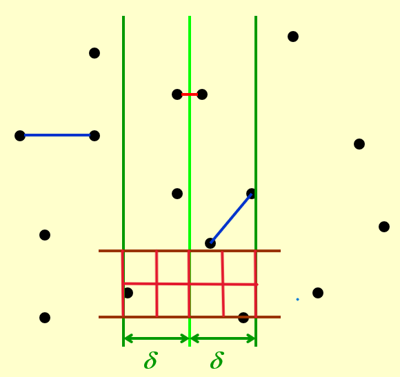

# 分治法

分治的思想不再赘述，简单来说就是将一个大问题分解成若干个子问题，然后递归地解决这些子问题，然后将这些子问题的解合并起来得到原问题的解。通常而言，分治法递归的时间复杂度递推公式具有如下形式：
$$ T(n) = aT(n/b) + f(n) $$
其中 $a$ 为子问题的个数，$b$ 与子问题划分方式有关，是子问题长度的收缩因子，$f(n)$ 则是合并各个子问题的解需要的时间。当然，有时候我们并不能得到这么寻常的结构。

## 分治法的时间复杂度分析

### 代入法

代入法实际上就是先猜测答案，然后通过数学归纳法来证明我们的猜测是正确的。虽然会有些莫名其妙，毕竟如果我能直接猜出来答案，还证明什么呢。但是在考试和作业中都是选择判断题的情况下，代入法是一个非常便捷有效的方法。代入法一般分为两步：

1. 猜测解的形式；
2. 用数学归纳法求出解中的常数，并证明解是正确的。

{width=44%}
{width=52%}

在运用代入法的时候有几点值得注意：

1. 对于 $N$ 足够小的时候，我们几乎可以认为操作的复杂度是一个常数，因此我们无需担心归纳的 base case，直接分析即可；
2. 进行归纳时的常数 $c$ 应当是一个保持不变的定值，也就是说对于不同大小的 $N$ 我们应当使用相同的 $c$。
3. 有时会出现猜测的上界偏大的情况，这时候即使能够证明，但也不是一个最紧的上界。这时我们可以利用一些熟悉的结论，例如归并排序等；也可以猜测出一些比较松的上下界，然后不断向中间逼近一个最紧的上下界。

!!! example "代入法"
    求解递归式 $T(n) = 2T(\lfloor \sqrt{n} \rfloor) + \log n$ 的时间复杂度。

    为了方便起见，我们不考虑值的舍入误差问题，只考虑 $\sqrt{n}$ 是整数的情况。令 $ m = \log n $，得到
    $$ T(2^m) = 2T(2^{m/2}) + m $$

    接着，我们令 $S(m) = T(2^m)$，则有 $S(m) = 2S(m/2) + m$，这就得到了我们熟悉的归并排序的结果，因为 $S(m) = O(m \log m)$，因此 $T(n) = O(\log n \log \log n)$。

### 递归树法

{width=80%}

从图中就可以简单直接地看出来递归树的画法，并且注意到树每一层的时间复杂度就代表下一层合并到这一层所需的时间复杂度，而每一个叶结点的复杂度就是 base case 的复杂度，这显然是常数的。

我们注意到时间复杂度主要分为两个部分，第一部分是各层合并时所需的时间，第二部分就是处理 base case 的总时间，这两个部分谁更大，谁就决定（master）了整体的时间复杂度，这也是后面的主定理（master theorem）的思想。

{width=80%}

当画出来的递归树不是一棵完全树的时候，对其进行复杂度分析是相当困难的，这时候我们可以观察之后使用代入法猜测并验证。

!!! example
    给定一个整数 $M$
    $$ T(n) = \begin{cases} 8T(n/2) + 1 & n^2 > M \\\\
            M & otherwise \end{cases} $$

    我们可以画出递归树，发现有 $ \log_2 (n/\sqrt{M}) $ 层，每层合并需要 1 个单位时间，并且有 $ 8^{\log_2 (n/\sqrt{M})}$ 个叶结点，每个叶结点需要 $M$ 的时间，因此总时间复杂度为
    $$ O(M \cdot 8^{\log_2 (n/\sqrt{M})          } + \log_2 (n/\sqrt{M})) = O(n^3/\sqrt{M}) $$

### 主定理

主定理的证明什么的就不写了，具体详见《算法导论》，这里直接给出结论和一些例题

!!! info "主定理形式1"
    考虑如下形式：
    $$ T(n) = aT(n/b) + f(n) $$，其中 $a \geqslant 1, b \geqslant 1$

    1. 若对于某个常数 $\epsilon > 0$，有 $f(n) = O(n^{\log_b a - \epsilon})$，则 $T(n) = \Theta(n^{\log_b a})$
    2. 若 $f(n) = \Theta(n^{\log_b a})$，则 $T(n) = \Theta(n^{\log_b a} \log n)$
    3. 若对于某个常数 $\epsilon > 0$，有 $f(n) = \Omega(n^{\log_b a + \epsilon})$，且对于某个常数 $c < 1$ 和充分大的 $n$，有 $a f(n/b) \leqslant c f(n)$，则 $T(n) = \Theta(f(n))$

需要注意，以上这三种情况并未覆盖 $f(n)$ 的所有可能性，情况 1 和情况 2 之间有一定间隙，情况 2 和情况 3 之间也有一定间隙。如果函数 $f(n)$ 落在这两个间隙中，或者情况 3 中要求的正则条件不成立，就不能使用主方法来求解递归式。我们来看一个不符合正则条件的例子：

!!! example
    令 $ T(n) = T(n/2) + n(2-\cos n \pi)$，此时 $a = 1,b = 2$，且我们知道 $\cos$ 函数的取值是 -1 到 1，满足第三种情况的第一个条件，但是不满足第三种情况的正则条件。因为如果满足正则条件，我们代入有
    $$ \dfrac{n}{2}(2-\cos \dfrac{n\pi}{2}) \leqslant cn(2-\cos n\pi) $$
    对某个常数 $c<1$ 和充分大的 $n$ 都成立。然而，当 $n$ 很大时，我们总可以取 $n=4k+2$ 这种形式破坏上面这一不等式。

事实上无论什么形式的主定理，其关键都在于比较 $ n^{\log_b a} $ 和 $f(n)$ 之间的关联，如果前者大，那么就说明此时 $a$ 比较大，递归树的分叉多，更大的复杂度会落在叶子上，所以时间复杂度就是 $ T(n) = aT(n/b) $ 对应的复杂度；反之则表示中间每一层的复杂度较大，故整体时间就是 $f(n)$ 级别的。

这里的思想在递归树已经阐述过了，实际上就是看前后两部分谁 master 了整体时间复杂度，这就是“主定理”名字的由来。

!!! info "主定理形式2"
    1. 若对于某个常数 $c>1$ 有 $a f(n/b) = c f(n)$，则 $T(n) = \Theta(n^{\log_b a})$
    2. 若 $a f(n/b) = f(n)$，则 $T(n) = \Theta(n^{\log_b a} \log n)$
    3. 若对于某个常数 $c<1$ 有 $a f(n/b) = c f(n)$，则 $T(n) = \Theta(f(n))$

不难看出这里是上一形式主定理的推论，例如第一种情况 $a f(n/b) = c f(n)$ 表明 $f(n) = \dfrac{a}{c} f(n/b) $，故可以递推得到
$$ f(n) = \dfrac{a^{\log_b n}}{c^{\log_b n}} = \dfrac{n^{\log_b a}}{n^{\log_b c}} = O(n^{\log_b a - \epsilon}) $$
正好对应于原始形式的第一种情况，第二、三种情况也是同样的推导

!!! info "主定理形式3"
    对于递推式 $ T(n) = aT(n/b) + \Theta(n^k \log^p n) $，其中 $a \geqslant 1, b > 1, k \geqslant 0, p \geqslant 0 $

    1. 若 $a > b^k$，则 $T(n) = \Theta(n^{\log_b a})$
    2. 若 $a = b^k$，则 $T(n) = \Theta(n^k \log^{p+1} n)$
    3. 若 $a < b^k$，则 $T(n) = \Theta(n^k \log^p n)$

上一主定理的形式还有更强的表达

!!! info "主定理形式4"
    对于递推式 $ T(n) = aT(n/b) + \Theta(n^k \log^p n) $，其中 $a \geqslant 1, b > 1, k \geqslant 0$， 而 $p$ 为任意实数

    1. 若 $a > b^k$，则 $T(n) = \Theta(n^{\log_b a})$
    2. 若 $a = b^k$，则

        - 若 $p > -1$，$T(n) = \Theta(n^k \log^{p+1} n)$
        - 若 $p = -1$，$T(n) = \Theta(n^k \log \log n)$
        - 若 $p < -1$，$T(n) = \Theta(n^k)$

    3. 若 $a < b^k$，则

        - 若 $p \geqslant 0$，$T(n) = \Theta(n^k \log^p n)$
        - 若 $p < 0$，$T(n) = \Theta(n^k)$

## 分治法的应用

### 曾学过的问题

下面简单回顾一下曾经学过的利用分治思想的问题，并用主定理给出一些基本的分析

#### 最大子序列和问题

假定我们要寻找子数组 $A[low,high]$ 的最大子序列和，我们首先找到数组中央位置 mid，分治法很自然地将这个问题的解 $A[i,j]$ 变为以下三种情况之一：

1. 最大子序列和完全在 $A[low,mid]$ 中，即 $low \leqslant i \leqslant j \leqslant mid$；
2. 最大子序列和完全在 $A[mid+1,high]$ 中，即 $mid+1 \leqslant i \leqslant j \leqslant high$；
3. 最大子序列和跨越 $mid$ 两边，即 $low \leqslant i \leqslant mid < j \leqslant high$。

所以我们的想法就是：

1. 分治：将原数组平分为两半 $A[low,mid]$ 和 $A[mid+1,high]$，然后分别对这两半求解最大子序列和；一定不能忘记递归有 base case，这里的 base case 就是数组只剩下一个元素，那就什么都不用操作，直接返回进入下一步合并阶段；
2. 合并：首先我们要计算跨越 mid 两边的最大子序列和，然后和左右两半的结果比较，选择最大的作为最终结果。关键在于计算跨越 mid 两边的最大子序列和，这其实是线性的，为什么？因为这里的子序列都必须跨越 mid，所以最大子序列和就是最大的 $A[i,mid]$ 加上最大的 $A[mid+1,j]$，这个只需要对 $i,j$ 做遍历就行，所以是线性的.

那么我们得到的递推公式就是很简单的 $T(n)=2T(n/2)+O(n)$，所以就是 $O(n\log n)$ 的复杂度。

#### 归并排序与快速排序

~~有点懒得说了~~

归并排序就是将数组分为两部分并排好序，其中 base case 就是数组长度为1的情况，此时直接返回即可；然后将已经排好序的两个数组拼成一个大数组，这显然是线性的复杂度，利用主定理很快就能得到 $O(n\log n)$ 的复杂度。

至于快速排序，我们先选择一个 pivot，然后首先将小于 pivot 的都放左边，大于的都放右边，这一步只需线性时间，，然后对 pivot 左右的数组递归继续排序。在 FDS 的课程中我们知道快速排序的最差情况可能到 $O(n^2)$ 的复杂度，但在后续的随机算法一节中我们会引入随机性证明平均时间复杂度为 $O(n\log n)$。

### 最近点对问题

{width=65%}

这是 PPT 上的例子，也是相当经典的应用。我们取 $x$ 坐标的中点，将整个图分为左右两半，于是同样分为三个部分，左最近点对、右最近点对和分离最近点对（跨过中轴线的点对），根据递归的思想，我们假设已知左最近点对和右最近点对，那么关键就在于找到分离最近点对。

我们记 $x$ 坐标的中点为 $\bar{x}$，记作左右两半中最近点对距离为 $\delta$。因为我们要找分离最近点对，于是只要考虑 $[\bar{x}-\delta, \bar{x}+\delta]$ 之间的所有点 $ q_1, q_2, \cdots, q_n $，它们按 $y$ 坐标从小到大排序。设 $q_i$ 的  $y$ 坐标为 $y_i$，那么我们只需要从下往上检查坐标在 $[\bar{x}-\delta, \bar{x}+\delta]$ 和 $[y_i, y_i+\delta]$ 之间的长方形区域中的所有点，考察这些点是否和 $q_i$ 有更近的点对即可。（因为我们从最下方的点开始逐一向上寻找点对，对于 $q_i$ 下方的点我们已经在先前考虑过这些点和 $q_i$ 是否会构成更近的点对了（同样是递归的思想），因此就不需要再向 $q_i$ 的下方寻找了）

我们可以将这个长方形区域分为平均分割成 8 块，则每块内最多出现一个点（否则每块内两点之间的距离就不超过 $\dfrac{\sqrt{2}}{2} \delta$ 了，这就与左右两半中最近点对距离为 $\delta$ 相矛盾），于是对于每个 $q_i$，我们至多只需要向上找 7 个点即可。

实际上我们还可以把这 7 个点进一步减少：

- 例如上图中我们正在考虑的 $q_i$ 处于右半部分，那么右半部分的点就不需要考虑了，因为右半部分的点与这一个 $q_i$ 的距离也不会小于 $\delta$，于是我们只需要考虑左半部分的 4 个点即可。
- 再更进一步，我们还可以将 4 这个数字降为 3。因为我们每在左半部分放一个点($q_i$ 在右半部分)，那么在左半部分，以这个点为圆心半径为 $\delta$ 的圆内不可能再有另一个点，事实上最差的情况就是有四个这样的圆心，此时这四个圆心在左半区域的四个角上（$(0,0)$, $(0, \delta)$, $(\delta, 0)$, $(\delta, \delta)$），这时候毫无疑问的就是 $(0, 0)$ 处的点最好。

    而其它情况下不可能有四个圆心，只能有三个，那么在最多三个圆心中寻找最近点对，也就只需要遍历 3 个点就足够了