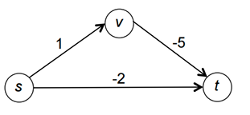
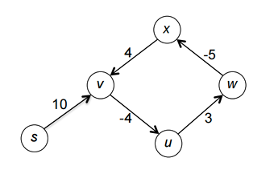

# 动态规划

!!! quote "动态规划的来由"
    动态规划（Dynamic Programming，DP）是一种用于解决最优化问题的算法设计方法。它通过将复杂问题分解为更简单的子问题，并存储这些子问题的结果，以避免重复计算，并利用这些子问题的结果来快速求解原问题。

    动态规划的基本思想是利用子问题的最优解构造出原问题的最优解。它的由来可以追溯到以下几个关键点：

    - 重叠子问题：许多最优化问题可以分解成重叠的子问题，动态规划通过记录子问题的解来避免重复计算。

    - 最优子结构：如果一个问题的最优解包含其子问题的最优解，则可以通过解决子问题来构造原问题的解。

    - 贝尔曼方程：贝尔曼提出了一个递归关系（即贝尔曼方程），描述了如何通过子问题的解来得到原问题的解。

## 动态规划的引入——爬楼梯问题

!!! question "爬楼梯问题"
    假设你正在爬楼梯。需要爬 $n$ 阶你才能到达楼顶。每次你可以爬 1 或 2 级台阶，求有多少种不同的方法爬到楼顶？我们要求算法在线性时间内解决这一问题。

我们可以利用中学的排列组合知识来求出这个问题，例如我们可以假设爬 2 级台阶的次数为 0，1，2 $\cdots$，然后计算出每种情况下的爬楼梯方法的排列数，最后再求和。但是这种方法的时间复杂度显然不是线性的，不能满足我们的要求。

我们也可以用回溯的方法来解决这个问题，但是回溯实际上就是枚举每一种可能的方法，但我们实际上并不关心具体要怎么爬，而是关心爬楼梯的方法数，同时回溯的时间复杂度显然也时远大于线性的。

这时候我们可以转换思路，假设我们已经解决了这个问题的所有子问题，即对于任意的 $i < n$，我们都知道爬到第 $i$ 级台阶的方法数，我们就只需要考虑最后一步怎么爬就可以了。最后一步有爬 1 级台阶或 2 级台阶两种选择，显然，最后一步爬 1 级对应的方法数就是爬 $n-1$ 级台阶对应的方法数，最后一步爬 2 级对应的方法数就是爬 $n-2$ 级台阶对应的方法数，两者之和就是我们爬到 $n$ 级台阶的方法数，于是我们可以得到一个递推关系：
$$ f(n) = f(n-1) + f(n-2) $$
这就是我们常见到的斐波那契数列的递推公式，我们只需要带入初始条件 $f(0) = f(1) = 1$ 就可以很轻松地得到爬楼梯的方法数。

```c
int f(int n) {
    if (n <= 1) return 1;
    else return f(n-1) + f(n-2);
}
```

但是我们知道假如直接用上面这段递归代码来解决这个问题，会出现极大量的冗余计算，同一个斐波那契数列的值会被计算多次，冗余计算次数的增长是爆炸性的，这显然是不合理的。

一个很自然的想法就是我们可以用一个数组来存储已经计算过的每一步的值，这样我们就可以避免重复计算，这是一种很常见的”空间换时间“的算法，我们称其为“记忆化”，实际上这就是动态规划的基本思想。

```c
int f(int n) {
    if (n <= 1) return 1;

    int dp[n+1];
    dp[0] = dp[1] = 1;

    for (int i = 2; i <= n; i++) 
        dp[i] = dp[i-1] + dp[i-2];

    return dp[n];
}
```

换句话说，原先递归的方法实际上是一种“自顶向下” 的方法，它符合我们的直接思路：最后长度为 n 的问题需要长度为 n−1 和 n−2 的求和，所以我们的代码直接利用递归计算递归式显得非常自然。但是重复的计算迫使我们放弃这种自然的想法，转而采用自底向上从小问题逐步迭代，最终构建原问题的解法。

!!! abstract "动态规划的基本思想"
    在爬楼梯这一简单而经典的问题中，我们通过对最后一步两种情况的分类，将整个问题的解转化为了两个子问题解的求和，即有一个从子问题的解到原问题的解的递推公式，然后我们通过记忆化的方式求解递推式。
    
    我们将上述特点抽象出来：一个问题，它的最优解可以表达为一些合适的子问题的最优解的递推关系，则我们称这一问题具有**最优子结构性质**（因为大问题的最优解可以直接依赖于小问题的最优解）。然后我们求解这一递推式，通过设置好 base case（这里我们也用 base case 指代最简单的情况，但注意此时讨论的不是递归情况），然后通过记忆化的方法，使用迭代算法而非费时的递归算法避免冗余计算，得到一个时间复杂度令人满意的算法，这就是动态规划的基本想法。

!!! info "动态规划"
    动态规划方法通常用来求解最优化问题（optimization problem）。这类问题可以有很多可行解，每个解都有一个值，我们希望寻找具有最优值（最小值或最大值）的解。我们称这样的解为问题的一个最优解（an optimal solution），而不是最优解（the optimal solution），因为可能有多个解都可以达到最优值。

    我们通常按如下4个步骤来设计一个动态规划算法：
    
    1. 刻画一个最优解的结构特征；
    2. 递归地定义最优解的值；
    3. 计算最优解的值，通常采用自底向上的方法；
    4. 利用计算出的信息构造一个最优解。

    步骤 1-3 是动态规划算法求解问题的基础。如果我们仅仅需要一个最优解的值，而非解本身，可以忽略步骤 4。

    更精炼地来说，事实上动态规划就是为一个具有最优子结构性质（即原问题最优解可以由子问题最优解递推得到）的最优化问题寻找一个由子问题到原问题的递推式，然后用记忆化的方法来求解。有时在最后我们需要构造出这一最优解，即执行步骤 4，这就需要我们在执行步骤 3 的过程中维护一些额外信息，以便用来构造一个最优解。

## 加权独立集合问题

### 问题描述

!!! question "打家劫舍"
    你是一个专业的小偷，计划偷窃沿街的房屋。每间房内都藏有一定的现金，影响你偷窃的唯一制约因素就是相邻的房屋装有相互连通的防盗系统，如果两间相邻的房屋在同一晚上被小偷闯入，系统会自动报警（也就是说，不能连续偷两个相邻的房屋）。
    
    给定一个非负整数数组，代表每个房屋存放金额的数量，计算你在不触动警报装置的情况下，一夜之内能够偷窃到的最高金额数。

我们可以将这个问题抽象出来：

考虑一个无向图 G，其上所有点都在一条线上（这种图我们称其为路径图），每个点都有一个非负权重。我们称 G 的独立集合是指顶点互不相邻的子集（换句话说独立集合中不会同时包含同一条边上的两个点），然后要求解一个具有最大顶点权重和的独立集合。

???+ example 
    <figure>
        
    </figure>
    在上图的这个这个例子中有 8 个独立子集：
    
    - 空集
    - 四个单点集
    - 第 1 和第 3 个点
    - 第 1 和第 4 个点
    - 第 2 和第 4 个点

    其中最大的独立集合显然是第 2 和第 4 个点构成的集合，其权重和为 8，即小偷的最优选择是偷 2 和 4 两家，最大收益是 8。需要注意的是，题目的假设中每个顶点都有非负权重，所以最优解的顶点应当是越多越好。

### 最优子结构

为了构建出这一问题的最优子结构，我们可以参考爬楼梯问题的思路，先考虑由 $n$ 个点，$n-1$ 条边构成的图 $G(V,E)$ 的最后一个顶点 $v_n$，考虑这个问题的最优解，那么

- 假如 $v_n$ 不在最优解 $S$ 中，那么 $G_n$ 的最优解就是子问题 $G_{n-1}$ 的最优解。

    - 因为如果 $S$ 不是 $G_{n-1}$ 的最优解，那么对于 $G_{n-1}$ 就一定会存在一个比 $S$ 更好的解 $S^*$。而 $S^*$ 显然一定是 $G_n$ 的一个可行解，那么把这个解直接应用到 $G_n$ 中就会得到一个比 $S$ 更好的结果，这和 $S$ 是最优解是矛盾的。因此 $S$ 就是 $G_{n-1}$ 的最优解。

- 假如 $v_n$ 在最优解 $S$ 中，那么 $G_n$ 的最优解就是子问题 $G_{n-2}$ 的最优解。

    - 因为 $v_n$ 在最优解中，那么 $v_{n-1}$ 就一定不在最优解中了，具体的分析与第一种情况类似，

通过上面的分析，我们就可以知道得到一个递推关系，假设前 $i$ 个顶点的最优加权独立
集合的权重之和为 $W_i$，那么
$$ W_i = \max \\{ W_{i−1}, W_{i−2} + w_i \\} $$
其中 $i = 2, 3, \cdots, n, \, W_0 = 0, W_1 = w_1$

接下来我们可以通过之前介绍的记忆化方法，从 base case 出发，自底向上构建出整个问题的解

<figure>
    
</figure>

很显然，这一算法的时间复杂度是 $O(n)$，是一个非常高效的算法

### 解的重构

有时候我们可能不仅需要最优解的值，还需要最优解本身包含了哪些点，这就需要解的重构。

事实上对于这一问题而言想要重构出解非常简单，我们只需要观察上面伪代码的数组 $A$ 给我们留下的线索，自顶向下一步步推断当前图中的最后一个点是否在最优解中。

<figure>
    
</figure>

- 如果 $A[i-1] \geqslant A[i-2] + w_i$，那么说明 $G_n$ 的最优解不含有第 $i$ 个点，$G_n$ 的最优解就是 $G_{n-1}$ 的最优解
- 如果 $A[i-1] < A[i-2] + w_i$，那么说明 $G_n$ 的最优解含有第 $i$ 个点，$G_n$ 的最优解就是 $G_{n-2}$ 的最优解加上第 $i$ 个点的价值

## 背包问题

背包问题是一个最最经典的动态规划问题，我们这里首先介绍最基础的背包问题，即 0-1 背包问题。

!!! question "背包问题"
    我们有 $n$ 个物品，每个物品的重量为 $s_i$，价值为 $v_i$，我们有一个容量为 $C$ 的背包，我们希望找到一个最优的装载方案，使得背包中的物品总价值最大。
    
    这一问题的特点是每个物品要么不放进包里，要么完整的 1 个放进去，因此称为 0-1 背包问题。

### 最优子结构

背包问题的最优子结构与前面两个问题有所不同。首先考虑最后一个物品是否在最优解中，根据这个情况来划分子问题：

- 如果第 $n$ 个物品不在最优解 $S$ 中，即最优方案排除了最后一件物品，因此它可以看成仅由前 $n−1$ 个物品组成的子问题的一种可行解决方案，并且 $S$ 必定是这个子问题的最优解，具体的分析与加权独立问题类似。
-  如果第 $n$ 个物品在最优解 $S$ 中，这种情况只有在 $s_n \leqslant C$ 时才有意义。类似于加权独立集合问题，我们希望最优解去掉第 $n$ 个物品构成的集合 $S−\{n\}$ 是前 $n−1$ 个物品组成的子问题的最优解，但这显然是错误的！因为如果 $S−\{n\}$ 就已经把容量 $C$ 几乎占满，那最后 $n$ 根本就放不进来了。

    因此我们需要对子问题的设置略做调整：$S−\{n\}$ 应当是前 $n$ 个物品在背包容量为 $C−s_n$ 的情况下的最优解。因为我们知道 $n$ 在解中，那么除去 $n$ 之外的其它物品的重量之和最多就是 $C−s_n$ ，因此 $S−\{n\}$ 应当是前 $n$ 个物品在背包容量为 $C−s_n$ 的情况下的可行解，并且应当是最优解，

此时的子问题不再仅仅是只由单个参数（即是第几个输入）控制，还由背包容量控制，因此我们需要一个二维的数组来存储子问题的解。我们设 $V_{i,c}$ 表示总重量不超过 $c$ 的前 $i$ 件物品组成的子集的最大总价值，那么我们可以得到如下递推关系：

$$ 
V_{i,c} = \begin{cases}
    V_{i-1,c} &  s_i > c \\
    \max\{V_{i-1,c}, V_{i-1,c-s_i} + v_i\} & s_i \leqslant c
\end{cases}
$$

根据递推式，只要 $i−1$ 的所有情况都确定了，递推就可以往 $i$ 推进，所以 base case 需要对 $i$ 的最小情况（即 $i = 0$）设置好就可以了，而 $i=0$ 时 $V_{i,c}$ 显然是 0，因为根本没有物品可以放。伪代码如下所示。

一个显然的事情是，这一算法的时间复杂度是 $O(nC)$。

<figure>
    
</figure>

### 解的重构

<figure>
    
</figure>

从最后一个物体开始判断：

- 如果第 $i$ 个物体的重量 $s_i$ 小于当前背包的容量 $c$，并且前 $i-1$ 个物体在容量为 $c−s_n$ 的条件下得到的最优解加上第 $i$ 个物体的价值 $v_i$ 大于前 $i-1$ 个物体在容量为 $c$ 的条件下得到的最优解，即 $V_{i-1,c-s_n} > V_{i-1,c}$，那么第 $i$ 个物体就在最优解中
- 否则，就说明第 $i$ 个物品不在最优解中，我们就直接考虑前 $i-1$ 个物品在容量为 $c$ 的条件下的最优解

!!! tip "降维"
    事实上，对于这种多维的背包问题，我们经常可以考虑这样一种优化策略：即有没有可能数组的维数可以下降，例如这里是不是一维数组就能帮我们做好所有的事情。

    事实上如果不考虑解的重建是完全可以的（考虑解的重建可以参考后面矩阵乘法的方法，那样可能又要维护新的二维数组），因为事实上第 $i$ 个物品对应的所有容量的解只依赖于第 $i−1$ 个物品的所有容量的解，因此事实上我们的数组完全可以不用 $i$ 这一维，每次循环对某个 $i−1$，算出所有容量的解，保存在只有容量这一个 index 的数组中，然后再算下一个 $i$ 的所有容量的解覆盖掉前面的解。

    但有一点需要注意，就是第 $i$ 轮数组的 $A[c]$ 会依赖于更小的 $c$ 在 $i−1$ 轮的解，所以如果 $c$ 的遍历还是从小到大的，那么就可能提前把需要的 $i−1$ 轮的解覆盖，所以我们对 $c$ 应当从大到小遍历，这样就不会出现错误的覆盖。

## 矩阵乘法的计算顺序

!!! question "矩阵乘法的计算顺序"
    给定 $n$ 个矩阵 $M_1, M_2, \cdots, M_n$，我们要将它们相乘，并且希望找到一个最优的计算顺序，使得计算这 $n$ 个矩阵的乘积所需的标量乘法次数最少。

### 最优子结构

我们考虑矩阵链相乘 $M_1 M_2 \cdots M_n$，每个矩阵的大小为 $r_{i−1} \times r_i$。记
$$ M_{ij} = M_i M_{i+1} \cdots M_j $$

对于这个问题，我们不能简单地依照前面的思路从最后一个矩阵可能的相乘方式的角度来划分最优解，因为这里的子问题的划分不再是线性的，而是一个树形结构。

我们可以自顶向下地考虑这个问题：对于一个完全没有任何划分的矩阵链乘法时，我们可以考虑寻找一个划分的中心 $M_i$，因为我们是自顶向下的思考，那么在之前的步骤中我们应当已经得到了所有的 $M_{1i}$ 和 $M_{i+1,n}$ 的最优乘法顺序。因此对于每一种可能的分解，总的最小时间应当等于 $M_{1i}$ 和 $M_{i+1,n}$ 的最小时间求和加上 $M_{1i}$ 和 $M_{i+1,n}$ 相乘所需的时间（即 $r_0 r_i r_n$），然后我们只需要从这 $n−1$ 种可能的分解中选出开销最小的一个就可以了。
$$ m_{1n} = min\\{m_{1i} + m_{i+1,n} + r_0 r_i r_n\\} $$  
其中 $m_{ij}$ 表示 $M_{ij}$ 的最优乘法时间。前两项代表左右子问题的最优解，最后一项代表从子问题最优解推出大问题最优解的花销。更具体的，我们有

$$
m_{ij} = 
\begin{cases} 
    0, & i = j; \\ 
    \min\limits_{i \leq k < j} \{ m_{ik} + m_{k+1,j} + r_{i-1}r_kr_j \}, & i < j. 
\end{cases} 
$$

其中第一条是 base case，第二条是一般情况下的递推式

```c
void OptMatrix( const long r[], int N, TwoDimArray M ) 
{   int  i, j, k, L; 
    long ThisM; 

    for( i = 1; i <= N; i++ )   //base case
        M[i][i] = 0; 

    for( k = 1; k < N; k++ ) {  // k = j - i 
        for( i = 1; i <= N-k; i++ ) { 
            j = i + k;
            M[i][j] = Infinity;

            for( L = i; L < j; L++ ) { 
                ThisM = M[i][L] + M[L+1][j] + r[i-1] * r[L] * r[j]; 
                if ( ThisM < M[i][j] )
                    M[i][j] = ThisM; 
            }
        }
    }
}
```

上面的算法的时间复杂度是 $O(n^3)$，其中 $n$ 是矩阵的个数。

### 解的重构

这一问题重构解的方法如果用和前面的问题一样简单直接的挖掘方法显然会比较耗时间，因为我们每次要比较很多种可能的情况才能重构出解，所以我们需要做一些优化，优化的方法也非常自然，实际上关键就是用一个二维数组记住每个子问题

$$ m_{ij} = \min\limits_{i \leq k < j} \{ m_{ik} + m_{k+1,j} + r_{i-1}r_k r_j \} $$ 

对应的最优的分点 $k$，然后当我们算出总问题 $m_{1n}$ 的最优解及其对应的最优分点后，我们再找左右两半子问题的最优分点，以此类推，用中序遍历的思想将分点输出即可，只需线性时间。

```c
void printOptimalParens( const TwoDimArray M, int i, int j ) 
{ 
    if( i == j ) 
        printf( "A%d", i ); 
    else { 
        printf( "(" ); 
        printOptimalParens( M, i, M[i][j] ); 
        printOptimalParens( M, M[i][j] + 1, j ); 
        printf( ")" ); 
    }
}

```

## 最优二叉搜索树

!!! question "最优二叉搜索树"
    这一问题给定如下输入：给定一列单词 $ w_1, w_2, \cdots, w_n $（它们的顺序已经按字典序排列）和它们出现的固定的概率 $ p_1, p_2, \cdots, p_n $。问题是要以一种方法在一棵二叉查找树中安放这些单词使得总的期望查找时间最小。

    在一棵二叉查找树中，每一次访问深度为 $d$（根的深度为 0）的元素所需要的比较次数是 $d+1$，因此如果每一个 $w_i$ 被放在深度 $d_i$ 上，那么我们希望将总的期望搜索开销 $ \sum_{i=1}^{N} p_i (1 + d_i) $ 极小化。

从 PPT 中可以看出，直接使用贪心算法或者构建一个 AVL 树不一定可以得到一个最优的解。类似于矩阵链乘法中，我们需要知道第一个分点在哪里才能构建后续的解，在这一问题中，我们需要知道最优的根结点在哪里才能划分问题，然后我们可以得到两个子问题，然后我们可以合并子问题的最优解得到最优解。

如果我们知道最优根节点 $w_k$，那么在整个问题的最优解中，由于事先已经按照字母序排好，左子树必然是 $w_1 \cdots w_{k-1}$ 对应的最优二叉搜索树，右子树也必然是 $w_{k+1} \cdots w_n$ 对应的最优二叉搜索树，因此我们可以得到递推关系
$$ c_{ij} = \sum_{k=i}^{j} p_k + \min\limits_{i \leqslant k \leqslant j} \\{ c_{i,k-1} + c_{k+1,j} \\}, \quad i \leqslant j $$
其中 $p_k$ 代表 $w_k$ 的概率，$c_{ij}$ 代表 $w_i \cdots w_j$ 对应的最优解。

- 前面第一项的意义在于，因为我们把 $w_k$ 当作新的根节点，除了加上根节点对应的概率 $p_k$ 之外，左右子树的深度都增加了1，因此在搜索时就需要多搜索一次，我们还需要再把它们的概率都加上一次
- 不难知道，base case 是 $c_{ii} = p_i$ 或者 $c_{i,i-1} = 0$。当我们采用不同的 base case 时就会有不同的递推式，做题时自己分析一遍就可以了

<figure>
    
</figure>

上面这一个算法的时间复杂度是 $O(n^3)$ 的，但是通过一定的方法可以优化到 $O(n^2)$ ~~（我不会，就不写了）~~

??? example "最优二叉搜索树例子"
    <figure>
        
    </figure>

## 最短路问题再讨论

我们对经典的单源（即我们只考虑一个顶点出发到任意其它顶点的距离）无负边最短路问题算法——Dijkstra 算法非常熟悉，但这一问题对于带负边的问题可能给不出正确的解。负边带来的更大的问题是可能出现负环，这样即使我们有一个能求出带负边的最短路的算法，但因为事实上的最短路应当在负环中无限循环直至负无穷，所以算法也会失效。

{ align=left width=35% }
{ width=35% }

### Bellman-Ford 算法

对于一般的图而言，因为具有线性结构，所以定义子结构并不是很容易的事情（所以加权独立集合考虑的是路径图，这样点就有线性的先后顺序，子结构很好定义）。于是我们需要考虑一些特别的子问题、子结构定义方式。

在 Bellman-Ford 算法中，子问题被巧妙地定义为：对于每个顶点 $v$，我们考虑从源点 $s$ 到 $v$ 的所有路径中，最多经过 $k$ 条边的路径的最短路径长度。

这一子问题的定义是否是合理的，取决于我们能否用至多经过 $k−1$ 条边的最短路径长度推到至多经过 $k$ 条边的路径的最短路径（我们记为 $P$）的长度。显然地，我们的递推依赖于如下两种情况取最小值：

- $P$ 还是只有 $k−1$ 条甚至更少的边，那么直接继承子问题的解即可
- $P$ 有 $k$ 条边。

    设 $P'$ 为 $P$ 中前 $k−1$ 条边，并且 $(w,v)$ 是其最后一次的跳跃，那么因为 $P$ 是 $s$ 到 $v$ 的 $k$ 条边的最短路径，所以 $P'$ 也是 $s$ 到 $w$ 的 $k−1$ 条边的最短路径，否则我们一定能找到一个更短的从 $s$ 到 $w$ 的路径 $P''$，那么 $P''$ 接上 $(w,v)$ 就是比 $P$ 更短的路径，与 $P$ 是最优解矛盾。

    因此我们递推时只需要考虑所有能一步到达 $v$ 的顶点 $w_1,\cdots ,w_m$，然后找到出发点 $s$ 到这些 $w_i(i=1,\cdots ,m)$ 的最短路长度，再把它加上 $(w_i,v)$ 的长度就可以得到 $m$ 条 $s$ 到 $v$ 的路径长度，然后取出这些长度的最小值即可。

我们记 $D^k[s][v]$ 为从 $s$ 到 $v$ 的最多经过 $k$ 条边的最短路径长度，整个图为 $G=(V,E)$，如果 $a$ 到 $b$ 有一条边，那么这条边的长度记为 $l_{ab}$，那么根据上面的讨论我们有递推式：

$$ D^k[s][v] = \min 
\begin{cases}
    D^{k-1}[s][v], & \text{case 1} \\\\
    \min \limits_{(w,v) \in E} \{ D^{k-1}[s][w] + l_{wv} \} & \text{case 2}
\end{cases}
$$

事实上我们有下一重要引理

!!! lemma 
    设起点为 $s$，如果对于某个 $k \geqslant 0$，对于所有目标顶点 $v$ 都有 $D^k[s][v] = D^{k+1}[s][v]$，那么

    1. 对于每个 $i \geqslant k$ 和任意的目标顶点 $v$，$D^i[s][v] = D^k[s][v]$ 都成立
    2. 对于每个目标顶点 $v$，$D^k[s][v]$ 就是 $s$ 到 $v$ 的最短路径长度

基于这一引理，我们可以得到如下的判断是否包含负环的定理

!!! property "Theorem"
    输入图 $G$ 不包含负环当且仅当 $D^n[s][v] = D^{n+1}[s][v]$ 对所有的目标顶点 $v$ 都成立。其中 $n$ 是图 $G$ 的顶点数。

如果需要重构最短路径，我们可以存下每次取 min 的时候距离最小的那个点，最后做个 traceback 即可，并且最短路径的子路径也是最短路径。以这一重建过程只需要一次遍历就可以得到所有顶点的最短路径了。

我们设输入图的顶点数为 $n$，边数为 $m$，那么 Bellman-Ford 算法的时间复杂度是 $O(nm)$。

### Floyd-Warshall 算法

!!! question "所有点对之间的最短路"
    上面我们通过 Bellman-Ford 算法解决了单源最短路问题，并且能够找出图中是否存在负环。但是如果我们需要解决所有点对之间的最短路问题，最简单的想法就是调用 $n$ 次 Bellman-Ford 算法，这样的时间复杂度是 $O(n^2m)$。
    
    而由于在稠密图上，边的数量 $m$ 的数量级是 $n^2$ 的，那么我们的时间消耗就会是四次方级别的，这显然是不可接受的。

Floyd-Warshall 算法定义的子问题更加巧妙：

我们需要给图上的每个顶点一个编号：$1, 2,\cdots ,n$，我们保持记号 $D^k[i][j]$，但现在它的含义变成了：从点 $i$ 出发到 $j$ 的，只使用 $1,2,\cdots ,k$ 作为内部顶点的（内部顶点就是除起点和终点外的其它点，即从 $i$ 到 $j$ 中间只能经过这些点），不包含环的最短路径长度。

1. 若 $k$ 不是 $P$ 的内部顶点，那么最好的解就是继承 $D^{k-1}[i][j]$；
2. 若 $k$ 是 $P$ 的内部顶点，那么我们可以把 $P$ 分成两段：$i \to k$ 和 $k \to j$，如图所示。即 $P$ 的总长度就等于这两段的长度之和，即 $D^k[i][j] = D^{k−1}[i][k] + D^{k−1}[k][j]$

<figure>
    
</figure>

有一个值得考虑的问题是，有没有可能这两段路径纠缠起来形成一个环？如果形成负环，我们无需关心这一情况，因为我们最终会检测出来；如果是正环，那么我们能画出一个不经过 $k$ 的更短的路径，所以这种情况也不会在最终的最短路径中出现。因此下述递推式是合理的：

$$
D^k[i][j] = \min 
\begin{cases}
D^{k-1}[i][j], & \text{case 1} \\\\
D^{k-1}[i][k] + D^{k-1}[k][j], & \text{case 2}
\end{cases}
$$

接下来的问题和 Bellman-Ford 算法一样，我们需要考虑如何判断是否存在负环

!!! Theorem
    图 $G$ 包含负环当且仅当存在一个顶点 $v$，使得 $D^n[v][v] < 0$。

基于以上讨论我们可以写出 Floyd-Warshall 算法的伪代码。最 naive 的方式就是用三维数组 $D[k][i][j]$ 表达 $D^k[i][j]$ 的含义，那么我们首先要讨论 base case，因为我们的递推是 $k$ 逐渐增大的过程，所以 base case 就是 $k = 0$ 的情况，接下来我们用三层循环构建全部的解即可。

因此时间复杂度是 $O(n^3)$，在稠密图中，它的表现要比调用 $n$ 次 Bellman-Ford 算法更好。

!!! tip "降维"
    PPT 中给出了一种降维的方法：其实 $k$ 没有必要出现在下标，我们只需要在增大 $k$ 的过程中更新 $i$ 和 $j$ 之间的最短路长度即可，因为随着 $k$ 增大最短路一定是递减的，对所有的 $k$ 维护一个值足矣。

    至于重建最短路径，我们在循环的时候不断更新每对顶点 $i$ 和 $j$ 形成最短路径时得到的最优的 $k$，因为这样最后一次 $k$ 的更新就对应于 $i$ 和 $j$ 之间最短路的必经之路。然后我们可以倒过来寻找 $i$ 到 $k$ 和 $k$ 到 $j$ 的最短路径（也是中序遍历的思想，或许也是某种程度的分治？），这样就可以重建最短路径了。

    ```C title="Floyd-Warshall 算法的降维版本"
    void AllPairs( TwoDimArray A, TwoDimArray D, int N ) 
    {   int i, j, k; 
        for ( i = 0; i < N; i++ )  /* Initialize D */ 
            for( j = 0; j < N; j++ )
                D[i][j] = A[i][j]; 
        for( k = 0; k < N; k++ )  /* add one vertex k into the path */
            for( i = 0; i < N; i++ ) 
                for( j = 0; j < N; j++ ) 
                    if( D[i][k] + D[k][j] < D[i][j] ) 
                        /* Update shortest path */ 
                        D[i][j] = D[i][k] + D[k][j]; 
    }
    ```
    在上面的伪代码中，数组`A`存储的是图的邻接矩阵，我们用数组`D`来求出所有点对的最短路径
