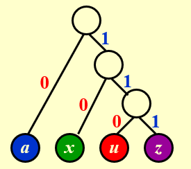

# 贪心算法

贪心算法保证做出的每一步选择在当前情况下都是局部最优的（当然对于最优的定义可能有多种多样）。如果我们能证明这些局部最优能够构造出全局最优，那么贪心算法就是正确的。

## 活动选择问题

!!! question "问题描述"
    - 给定一个活动集合 $S = \{a_1, a_2, \ldots, a_n\}$，其中每个活动 $a_i$ 都有一个开始时间 $s_i$ 和结束时间 $f_i$，且 $0 \leqslant s_i < f_i < \infty$。如果活动 $a_i$ 和 $a_j$ 满足 $f_i \leqslant s_j$ 或 $f_j \leqslant s_i$，则称活动 $a_i$ 和 $a_j$ 是兼容的（即一个活动会在另一个活动开始之前结束，二者时间不会重合）。

    活动选择问题就是要找到一个最大的兼容活动子集，即这个子集中所有活动相互兼容，并且活动的数量最大。

!!! idea "动态规划的解决方法"
    我们可以设计出两种动态规划的递推式来解决这一问题：

    1. 设 $S_{ij}$ 表示活动 $a_i$ 和 $a_j$ 之间的最大兼容活动集合（开始时间在 $a_i$ 结束之后，结束时间在 $a_j$ 开始之前），其大小记为 $c_{ij}$，那么我们有 
        $$ c_{ij} = \max \\{ c_{ik} + c_{kj} + 1 \mid f_i \leqslant s_k < f_k \leqslant s_j \\} $$

        这一解法的思想更接近矩阵乘法顺序问题，我们会选择中间的最优解然后分为左右子问题递归

    2. 设 $S_i$ 表示活动 $a_1, a_2, \ldots, a_i$ 的最大兼容活动集合，其大小记为 $c_i$，那么我们有
        $$ c_i = \max \\{ c_{i-1}, c_{k(i)} + 1 \\} $$

        其中 $k(i)$ 表示在 $1 \leqslant k \leqslant i$ 中，使得 $f_k \leqslant s_i$ 且 $c_k$ 最大的 $k$，即不与 $a_i$ 冲突的最晚结束的活动。这一思想更接近背包问题的思路，即我们考虑最后一个是否在解中，然后分成在或不在两种情况考虑。

    - 上面第一种解法的时间复杂度为 $O(n^3)$，但是可以利用一些方法优化到 $O(n^2)$；第二种解法更为便捷，时间复杂度为 $O(n^2)$。

我们希望有一个更高效的算法，因此我们还需要新的思路，即使用贪心的思路，因为很多时候贪心只需要一个遍历即可确定出答案，所以时间上有很大的优势。

PPT 上给出了几种错误的贪心想法，这也表明了贪心并不是那么容易就能找到正确的贪心策略。我们需要不断地举反例尝试否定自己的猜想，如果觉得自己的猜想的逻辑足够严密就可以开始尝试证明。

我们可以**将各个活动按照结束时间进行排序，然后在保证不与已经选择的活动冲突的条件下，从前到后去看，选择结束时间最早的活动**。这一个想法是很自然的，因为活动结束得越早，那么就越能给后面的活动安排留出余地，因此也顺理成章能让更多活动都安排进来。

下面我们需要从两个方面来证明这个贪心策略是正确的：**贪心选择性质**与**最优子结构性质**。

!!! property "活动选择问题的贪心选择性质"
    - **考虑任意非空子问题 $S_k$，令 $a_m$ 是 $S_k$ 中结束时间最早的活动，则 $a_m$ 在 $S_k$ 的某个最大兼容活动子集中。**

    **证明：**

    令 $A_k$ 是 $S_k$ 的一个最大兼容活动子集，且 $a_j$ 是 $A_k$ 中结束时间最早的活动。
    
    - 若 $a_j = a_m$，则已经证明 $a_m$ 在 $S_k$ 的某个最大兼容活动子集中。
    - 若 $a_j \neq a_m$，令集合 $A'_k = A_k−\{ a_j \}\cup \{a_m \}$，即把 $A_k$ 中的 $a_j$ 替换为 $a_m$。很显然的，$A'_k$ 中的活动是不相交的：因为 $A_k$ 中的活动是不相交的，而 $a_m$ 是 $S_k$ 中结束时间最早的活动，即 $f_m \leqslant f_j$，所以 $a_m$ 不可能和 $A_k$ 后面的活动冲突。由于 $|A_k|=|A'_k|$，因此得出结论 $A''_k$ 也是 $S_k$ 的一个最大兼容活动子集，且它包含 $a_m$。

    于是我们就证明了 $a_m$ 一定在 $S_k$ 的某个最大兼容活动子集中。
    
    这一证明思想我们称为“**交换参数法**”，即我们可以假设存在一个最优选择，其中某个元素可能不在我们的贪心选择中，然后通过交换贪心选择和最优选择的元素来构造一个可行解，而这个可行解由于其中一个元素被替换为了贪心选择的元素，它不可能变得更差，因此这个构造出来的可行解一定也是一个最优解。

!!! property "活动选择问题的最优子结构"
    - **在活动选择问题中，用贪心策略选择 $a_1$ 之后得到子问题 $S_1$，那么将 $a_1$ 和子问题 $S_1$ 的最优解合并，一定可以得到原问题的一个最优解。**

    **证明：**

    使用反证法：假设 $a_1$ 和子问题 $S_1$ 的最优解 $C_1$ 合并得到的解 $C$，不是原问题的一个最优解，同时 $C'$ 是原问题的一个最优解，那么我们一定有 $|C'| > |C|$。

    根据贪心选择性质我们知道如果我们用 $a_1$ 替换掉 $C'$ 中的第一个活动，那么我们得到的解一定不会比 $C'$ 差。因此我们可以得到一个新的解 $C''$，并且 $|C''| \geqslant |C'| > |C|$。

    这时候如果我们把 $C''$ 除去 $a_1$，剩余部分 $C''_1$ 也是子问题 $S_1$ 的一个可行解。由于 $|C''| > |C|$，所以 $|C''_1| > |C_1|$，这与 $C_1$ 是子问题 $S_1$ 的最优解矛盾。因此将 $a_1$ 和子问题 $S_1$ 的最优解合并得到的解，一定是原问题的一个最优解。

这样我们就证明了我们刚刚做出得贪心选择一定可以得到一个最优解，我们的贪心策略是正确的。对称地，我们也可以将所有活动按照开始时间进行排列，并且每一次都从后往前看，选择不与先前活动冲突的开始最晚的活动，这样也是一个正确的贪心策略。

对于这样一个问题，很显然我们利用贪心策略选择活动的时间复杂度为 $O(n)$，因为我们只需要对所有活动进行一次遍历，因此解决整个问题的时间复杂度主要取决于把这些任务排序的时间复杂度，通常为 $O(n\log n)$。

!!! note "活动选择问题的变体"
    - **加权活动选择问题**：现在每一个活动 $a_i$ 都有一个权重 $w_i$，我们希望找到一个总权重最大的兼容活动子集。

        事实上，我们很容易举出反例说明一般的贪心算法失效，所以我们现在可以转向最开头给出的动态规划算法，只是所有的加 1 应当改为加权重。

    - **区间调度问题**：我们现在的问题不再是最大化兼容集合的大小或者权重，而是所有活动都必须举办，考虑将所有活动分配到最少的教室中，使得每个教室内的活动不冲突。

        我们同样可以使用贪心算法来解决这个问题：将所有活动按照开始时间排序，设置初始教室数量为1，然后从前往后遍历。每次选择一个活动时，我们都看当前所有的教室中的活动有没有不与它冲突的（即当一个活动需要开始时，查看当前是否有空着的教室），如果有就直接放进对应的教室，如果所有教室都和这个活动冲突，就新开一个教室。

        <figure>
            
        </figure>

        从图（a）中我们可以看到同一时间至多有三个活动同时举办，因此我们需要至少三个教室；而假如我们须要四个教室，就说明某时刻有四个活动同时进行，这是不可能的。因此最终的结果是需要三个教室。

        从图（b）中我们利用贪心算法来解决这个问题，首先我们发现 a、b、c 三个活动同时开始，所以开始三个教室，然后把 d、e 分别放入不会发生冲突的 c、a 教室中，以此类推，最终就使用了三个教室来解决了这个问题

## 调度问题

!!! question "问题描述"
    - **假设我们现在有 $n$ 个任务，每个任务 $i$ 都有一个正的完成需要的时间 $l_i$ 和一个权重 $w_i$。假定我们只能按一定顺序依次执行这些任务，不能并行。**

    很显然的，我们有 $n!$ 种调度方法，我们记 $\sigma$ 为某一种调度，那么在调度 $\sigma$ 中，任务 $i$ 的对应的完成时间 $C_i(\sigma)$ 就是 $\sigma$ 中在 $i$ 之前的所有任务长度之和加上 $i$ 本身的长度。
    
    换句话说，在一种调度中，一个任务的完成时间就是这个任务从整个流程开始到它自己被执行完毕的总时间。我们的目标是最小化加权完成时间之和：
    $$ T=\min\sum_{i=1}^{n} w_i \cdot C_i(\sigma) $$

我们要设计一个贪心算法来解决这个问题，很显然地，我们希望优先选择做权重大、时间短的任务，因此就很自然地得到了两种可能的贪心策略：

1. 计算每个任务 $i$ 的 $w_i − l_i$，按从大到小降序调度任务
2. 计算每个任务 $i$ 的 $w_i / l_i$，按从大到小降序调度任务

我们考虑一个例子：有两个任务，$l_1=5, l_2=2, w_1=3, w_2=1$，两种方法会返回不同的结果，而第二种才能返回最优解。但这只能说明第一种策略是错误的，第二种策略的正确性还需要证明。

!!! property "调度问题的贪心选择性质"
    - **令 $i$ 是当前 $w_i / l_i$ 最大的任务，则在当前问题下，必一定存在一个将 $i$ 排在首位的最优调度方式。**

    **证明：**

    我们仍然使用“交换参数法”：假设有一个最优解 $C$，如果它的第一个任务是 $i$，证明结束。如果不是，我们考虑将 $i$ 不断与前一个任务交换，直到换到第一个位置的过程。
    
    假设现在排在 $i$ 前面一位的任务是 $j$ ，我们知道一定有
    $$ \frac{w_i}{l_i} \geqslant \frac{w_j}{l_j} $$
    又因为所有数都是正数，将它们移项就得到 $w_i l_j - w_j l_i \geqslant 0$。
    
    不难看出，在 $i$ 和 $j$ 交换前后，其它的任务的加权时间完全没有变化，变化仅在于 $i$ 和 $j$ 上。设在 $i$ 前面的总时间为 $t$，则交换前 $i$ 和 $j$ 的加权时间和为
    $$ t_1 = w_j (t + l_j) + w_i (t + l_j + l_i) $$
    交换后为
    $$ t_2 = w_i (t + l_i) + w_j (t + l_i + l_j) $$
    二者作差化简有  
    $$ t_1 - t_2 = w_i l_j - w_j l_i \geqslant 0 $$

    因此我们发现，把 $i$ 向前交换时，加权时间和一定不会变大，故仍然保证新的解是最优解。那么我们就可以不断把 $i$ 往前换，直到它在第一个位置，这样就证明了贪心选择性质。

!!! property "调度问题的最优子结构"
    - **在调度问题 $S$ 中，我们用贪心策略选出 $w_i / l_i$ 最大的 $i$ 对应的任务后，剩下的子问题 $S_1$（即在除去 $i$ 的任务集合中寻找一个最小化加权完成时间之和的解）的最优解 $C_1$ 和 $i$ 结合后一定构成了原问题的一个最优解 $C$。**

    **证明：**

    证明思路和活动选择问题几乎完全一致，我们使用反证法来快速证明：

    如果 $C$ 不是最优解，那么一定存在一个最优解 $C'$，它对应的加权完成时间小于 $C$ 的加权完成时间，$T'< T$。
    
    根据贪心选择性质，如果我们把 $C'$ 中的 $i$ 不断通过相邻交换换到第一个位置，得到的解 $C''$ 一定不会变差，$T'' \leqslant T'$。于是 $C''$ 在选择了 $i$ 之后，剩下的选择实际上也构成了 $S_1$ 的一个可行解。
    
    由于 $T' < T$，这表明 $C''$ 中对应的 $S_1$ 的解 $C''_1$ 必定比 $C_1$ 更好，但我们知道 $C_1$ 是最优解，因此得到矛盾。所以 $C_1$ 和 $i$ 一起一定构成了原问题的一个最优解 $C$。
    
    综上，以反证法，我们最终得以验证了问题的最优解可以通过贪心 + 最优子结构的方式得到。同时我们也很容易发现，这一问题的时间复杂度最耗时的部分也在排序上，不再重复。

!!! extra "最小化最大延时"
    设有 $n$ 个任务，每个任务 $j$ 具有一个完成需要的时间 $t_j$，以及截止日期 $d_j$。我们只能逐个完成这些任务，不能并行。如果有任务不能在 DDL 之前完成，我们定义延迟时间 $l_j$ 为其完成的时间减去截止日期 $d_j$，如果没有超时则延迟定义为 0。我们的目标是最小化所有任务的最大延迟。

    <figure>
        
    </figure>

    在上面的例子中，三个任务长度分别为 1、2、3，截止日期分别为 2、4、6，按如图方式排序，所有任务都能在截止前完成。

    而对于一般性的最小化最大延时问题，我们很容易想到下面两种贪心策略

    1. 按照每个任务需要花费的时间排序，先完成用时短的任务。
    
        这种策略显然是错误的，因为用时短的任务很可能截止日期很远。例如我们考虑两个任务，一个需要 1 天，截止日期 100 天后；另一个需要 10 天，截止日期10天后，那么按照这里的调度方式显然不对。

    2. 按照 $d_j-t_j$ 从小到大排序，先完成 $d_j-t_j$ 比较小的任务，即先完成冗余时间量最短的任务。

        这似乎看起来正确，但是实际上也是错误的。例如我们考虑两个任务，一个需要 1 天，截止日期 2 天后；另一个需要 10 天，截止日期 10 天后，那么按照这里的调度方式也不对。

    事实上上面两种思路出现了一个矛盾：第一个表明完成时间 $t_j$ 越短越应该先完成，看起来很合理；第二个 $t_j$ 越短反而冗余时间变大，应该晚完成。这让我们进入了一个尴尬的局面：我们到底该如何考虑 $t_j$ 呢？

    实际上正确的答案是不考虑 $t_j$，我们只需要将各个任务按照截止日期 $d_j$ 从小到大排序，然后依次完成即可。这样的策略是正确的，因为我们只需要保证每个任务在截止日期前完成即可，而不需要考虑完成时间。这样的策略也是符合贪心选择性质和最优子结构的，证明也可以利用“交换参数法”，这里就不再说明了

## 哈夫曼编码

哈夫曼编码希望找到一个字母表的期望长度最小（依据字母出现频率）的前缀编码，在之前最优二叉搜索树的讨论中我们似乎有一个类似的目标，但那里我们是希望最小化搜索的期望时间，并没有前缀编码的需求。事实上，哈夫曼编码具有非常强的信息论背景。

!!! info "信息熵"
    对于一个离散型随机变量$X$，其信息熵定义为
    $$ H(X) = -\sum_{i=1}^{n} p(x_i) \log_2 p(x_i) $$
    其中 $p(x_i)$ 表示 $X$ 取值为 $x_i$ 的概率。
    
    在平均意义下，信息熵的物理意义是对于一个随机变量$X$，我们需要多少比特的信息来描述它。

???+ example
    - 考虑一个服从均匀分布且有 32 种可能取值的随机变量 $X$。为了确定一个结果，需要一个能容纳 32 个不同值的标识，因此用 5 个比特足矣。而其信息熵为
        $$ H(X) = -\sum_{i=1}^{32} \frac{1}{32} \log_2 \frac{1}{32} = 5 $$
        这恰好就是需要的比特数量。

    - 有 8 匹马参加的一场赛马比赛，它们的获胜概率分别为

        $$ \left\{ \frac{1}{2}, \frac{1}{4}, \frac{1}{8}, \frac{1}{16}, \frac{1}{64}, \frac{1}{64}, \frac{1}{64}, \frac{1}{64} \right\} $$

        假定我们要把哪匹马会赢的信息告诉给别人，其中一个策略是给每一匹马都设定一个等长度的编号，这样对于任何一匹马都需要 3 个比特。
        
        但由于概率不是均等的，明智的方法是对概率大的马用更短的编码，对概率小的马用更长的编码。例如使用以下编码：`0`, `10`, `110`, `1110`, `111100`, `111101`, `111110,` `111111`，这样在期望意义下，平均每匹马需要 2 个比特，比使用等长编码的比特数更短。

### 算法描述

我们通过二叉树来构建编码树，所有需要表示的信息都处于叶结点上，非叶子结点不储存任何信息。从根节点到叶结点的所有路径上，左分支表示 0，右分支表示 1。

这样的编码树不仅在期望情况下能得到最短的平均编码，而且是满足前缀编码的的要求的，即任何一个字符的编码都不是另一个字符编码的前缀（这在离散数学中证明过了），因此当给定一串有多个字符组成的编码时，我们不会因不知道该如何把这个编码分段而产生歧义。

<figure>
    
</figure>

例如在上图的这颗编码树中，a、u、x、z的编码分别为`00`、`01`、`10`、`11`。

{align=right width=25%}

把根结点的深度记为0，那么我们就发现，对于一个字符 $c$，它的编码长度就是它在编码树中的深度，于是我们的目标就转换成了找到一个编码树，在考虑每个字符出现的概率的情况下，最小化所有字符的深度。

记某个字符 $x_i$ 的深度为 $d_i$，出现的概率为 $f_i$，那么我们的目标就是找到一种构造编码树的方式，实现下面最小化的目标
$$ \min \sum_{i=1}^{n} f_i \cdot d_i $$ 

对于字符串`aaaxuaxz`来说，最佳的编码方式如右图所示，此时的编码长度为 $1 \times 4 + 2 \times 2 + 3 \times 1 + 3 \times 1 = 14$，小于刚刚的等长编码的长度 $2 \times 4 + 2 \times 1 + 2 \times 2 + 2 \times 1 = 16$。

!!! note "构造哈夫曼编码树"
    1. 给定一组待编码的字符，每个字符都有一个出现频率（或者权重）。
    2. 根据字符的频率，将所有字符放入一个优先队列（最小堆）中，堆中每一个结点都是一个字符，结点的值是字符的频率。
    3. 从优先队列中取出两个频率最小的字符，构造一个新的父结点，其频率为两个字符的频率之和。这个父结点的左右孩子分别是这两个字符，然后将这个新结点重新插入最小堆中。

        通常来说，频率更小的孩子作为左孩子，频率更大的孩子作为右孩子，当然这种方法不是一定的。

    4. 重复步骤 3，直到最小堆中只剩下一个结点，这个结点就是哈夫曼编码树的根结点。
    5. 生成编码，从根结点出发到每一个叶结点，给左分支分配`0`，给右分支分配`1`，每个字符的哈夫曼编码就是从根结点到它对应的叶结点的路径上的所有`0`和`1`的依次组合。

### Huffman 编码的正确性

!!! property "哈夫曼编码的贪心选择性质"
    - $C$ 为一个字母表，其中每个字符 $c \in C$ 都有一个频率 $c.freq$.令 $x$ 和 $y$ 是 $C$ 中频率最低的两个字符。那么存在 $C$ 的一个最优前缀码，$x$ 和 $y$ 的编码长度相同，且只有最后一个二进制位不同（即在编码二叉树中，它们是兄弟节点）。

    <figure>
        
    </figure>

    我们仍然可以使用交换参数法来证明新的树不会比原来的树更差，因此如果原来的树是最优的，那么新的树也一定是最优的。

!!! property "哈夫曼编码的最优子结构性质"
    - $C$ 为一个字母表，其中每个字符 $c \in C$ 都有一个频率 $c.freq$。令 $x$ 和 $y$是 $C$ 中频率最低的两个字符。令 $C'$ 为 $C$ 去掉字符 $x$ 和 $y$，并加入一个新字符 $z$ 后的字母表。

        我们给 $C'$ 也定义频率集合，不同之处只是 $z.freq = x.freq + y.freq$。令 $T'$ 为 $C'$ 的任意一个最优前缀码树，那么我们可以将 $T'$ 中叶结点 $z$ 替换为一个以 $x$ 和 $y$ 为孩子的内部结点得到一个 $C$ 的一个最优前缀码树 $T$。

    <figure>
        
    </figure>

    ------

    依然是使用反证法证明。记 $B(T)$ 为树 $T$ 的代价，即所有字母的期望编码长度（PPT 上的 cost）。我们很容易得到
    $$ B(T) = B(T') + x.freq + y.freq $$
    因为 $T'$ 就相当于把 $T$ 中的 $x,y$ 上移一层。
    
    假设 $T$ 不是 $C$ 的最优前缀编码树，那么存在一个更优解 $T''$，使得 $B(T'') < B(T)$。根据前面的引理，我们可以将 $T''$ 中 $x$ 和 $y$ 和它们的父结点替换为 $z$，得到一个新的树 $T'''$，其中 $z.freq = x.freq + y.freq$。那么我们有
    $$ B(T''') = B(T'') - x.freq - y.freq < B(T) - x.freq - y.freq = B(T') $$
    这与 $T'$ 是最优解矛盾，因此我们的假设是错误的，$T$ 必定是 $C$ 的最优前缀编码树，证毕。

## 贪心算法的讨论

### 贪心算法的范式

贪心算法通过做出一系列选择来求出问题的最优解。在每个决策点，它做出在当时看来最佳的选择。这种启发式策略并不保证总能找到最优解，但对有些问题确实有效，如活动选择问题。

一般地，我们可以按如下步骤设计贪心算法：

1. 将最优化问题转化为这样的形式：对其做出一次选择后，只剩下一个子问题需要求解
2. 证明做出贪心选择后，原问题总是存在最优解，即贪心选择总是安全的
3. 证明做出贪心选择后，剩余的子问题满足性质：其最优解与贪心选择组合即可得到原问题的最优解，这样就得到了最优子结构

### 贪心算法的证明

之前涉及的“交换参数法”并不是唯一的证明贪心选择正确性的方法，虽然“交换参数法”是对于很大一部分问题比较直观的一种证明手段，但贪心这一思想实在是应用太广泛，所以我们无法保证这种证明方法对所有问题都适用。

但对于大部分问题贪心算法的证明而言，贪心选择性质和最优子结构是两个关键要素

- **贪心选择性质**：我们可以通过做出局部最优（贪心）选择来构造全局最优解。换句话说，当进行选择时，我们直接做出在当前问题中看来最优的选择，而不必考虑子问题的解。

    这也是贪心算法与动态规划的不同之处。在动态规划方法中，每个步骤都要进行一次选择，并且当前的选择通常依赖于子问题的解。但在贪心算法中，我们总是做出当时看来最佳的选择，然后求解剩下的**唯一**的子问题。贪心算法进行选择时可能依赖之前做出的选择，但不依赖任何将来的选择或是子问题的解。

    如果进行贪心选择时我们不得不考虑众多选择，通常意味着可以改进贪心选择，使其更为高效。例如，在活动选择问题中，假定我们已经将活动按结束时间单调递增顺序排好序，则对每个活动能够只需处理一次。通过对输入进行预处理或者使用适合的数据结构（通常是优先队列），我们通常可以使贪心选择更快速，从而得到更高效的算法。

- **最优子结构**：一个问题的最优解包含其子问题的最优解。

    如前活动选择问题所述，通过对原问题应用一次贪心选择即可得到子问题，那么最优子结构的工作就是论证：将子问题的最优解与贪心选择组合在一起的确能生成原问题的最优解。这种方法隐含地对子问题使用了数学归纳法，证明了在每个步骤对子问题进行贪心选择，一步一步推进就会生成原问题的最优解。

对于一个很困难的问题去寻找一个合理的贪心思路是比较困难的，有时候我们需要去考虑把一些极端的情况，从中我们或许会发现具有哪些性质的解是我们最想要的（例如调度问题用这一思想就很容易想到可能的解法）。在多参数（例如调度问题有权重、完成时间、截止时间等参数）的情况下，我们也可以固定某些参数看另一些参数的变化等，这些小技巧都能帮助我们对问题的基本结构有一个观察。