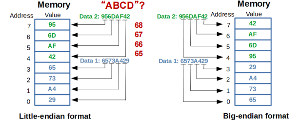

# Introduction to the Microprocessor and Computer

!!! info "考纲重点"
    - 进制转换：十进制、二进制、十六进制
    - 编码格式：BCD 码
    - IEEE 754 标准（浮点数表示法）

!!! tip 
    这一章里基本没什么值得记录的内容，所以就只记录考纲中列出来的知识点

!!! info "MASM Assembler Directive for Data Allocation"
    <figure markdown="span">
        {width=75%}
    </figure>

## 数据格式

### BCD 码

BCD（Binary-Coded Decimal）码是一种用二进制表示十进制数字的编码方式。每个十进制数字（0-9）都单独用若干个二进制位表示，其中 packed BCD 和 unpacked BCD 是两种常见的表示方式：

- **Packed BCD（压缩 BCD）**：
    - 每个字节存储两个十进制数字，每个数字占用 4 位二进制位。例如，十进制数 12 在 packed BCD 中表示为 0001 0010。
    - 通常用于微处理器中的 BCD 运算，因为它节省了存储空间。
- **Unpacked BCD（非压缩 BCD）**：
    - 每个字节存储一个十进制数字，通常高 4 位为 0000，低 4 位表示实际的十进制数字。例如，十进制数 12 在 unpacked BCD 中表示为 0000 0001 0000 0010。
    - 通常用于显示设备、键盘或打印机等设备，因为它更容易与人类可读的格式对应。

| decimal | packed BCD | unpacked BCD |
|---|---|---|
|12|0001 0010|0000 0001 0000 0010|
|96|1001 0110|0000 1001 0000 0110|

但由于 BCD 在存储和计算上的效率都比较低，因此在现代计算机系统中并不常用，更多的是使用二进制编码来表示数值。

### IEEE 754 浮点数表示法

> 详情可见[计组笔记](../COD/chap-3.md#floating-point-number)

以 32 位单精度浮点数为例：

- sign bit（S）： 1 bit，表示符号，0 表示正数，1 表示负数
- biased exponent（E）： 8 bits，表示指数部分，采用偏移量为 127 的表示法
- fraction/mantissa（F）： 23 bits，表示尾数部分，实际存储的是小数点后的部分，隐含了一个前导的 1

浮点数的值可以表示为：
$$ V = (-1)^{S} \times (1.F) \times 2^{(E-127)} $$

<figure markdown="span">
    {width=75%}
</figure>

IEEE 754 标准还定义了特殊值，如正负零、无穷大和 NaN（Not a Number）。

|数值|exponent (E)|fraction (F)|说明|
|---|---|---|---|
|0|全为0|全为0|正零和负零由符号位决定|
|infinity（无穷）|全为1|全为0|正/负无穷由符号位决定|
|NaN|全为1|非全0|表示未定义或不可表示的数值|

<figure markdown="span">
    {width=75%}
</figure>

浮点数有规格化（normal）和非规格化（denormalized/subnormal）两种表示方式：

- **Normalized Numbers（规格化数）**：指数部分不全为0或全为1，尾数部分隐含一个前导的 1，即默认情况下尾数为 1.F。
- **Denormalized Numbers（非规格化数）**：指数部分全为0，尾数部分没有隐含的前导 1，即尾数为 0.F。这种表示方式用于表示非常接近于零的数值。
    - subnormal = $(-1)^{S} \times (0.F) \times 2^{-126}$

!!! note "Underflow"
    下溢（underflow）是指当一个数值小于计算机所能表示的最小非零规格化数时，计算机会将其表示为非规格化数或直接表示为零。通常有两种处理方式：

    - **突然下溢（Abrupt Underflow）**：当数值小于最小非零规格化数时，直接将其表示为零。
    - **渐进下溢（Gradual Underflow）**：允许数值逐渐接近零，通过使用非规格化数来表示非常小的数值，从而减少精度损失。

    非规格化数可以在数值分析、复数除法等数值计算场景中减小下溢带来的影响。

## 进制转换

- 十进制转二进制：除 2 取余法
    - 将十进制数不断除以 2，记录每次的余数，直到商为 0。然后将余数逆序排列，得到二进制表示。
- 二进制转十进制：权展开法
    - 将二进制数的每一位乘以对应的权值（2 的幂次方），然后将这些乘积相加，得到十进制表示。
- 十进制转十六进制/十六进制转十进制：
    - 通常来说会先将十进制转为二进制，再将二进制转为十六进制，反之亦然。
- 二进制转十六进制/十六进制转二进制：
    - 每 4 位二进制数对应 1 位十六进制数，直接进行分组转换即可。

## 其他

### 小端字节序

在存储数据时，字节序（Endianness）指的是多字节数据在内存中的存储顺序。主要有两种字节序（Intel x86 系列处理器全部采用小端字节序）：

- **小端字节序（Little-endian）**：低位字节存储在低地址，高位字节存储在高地址。例如，十六进制数 0x12345678 在小端字节序中存储为 78 56 34 12。
- **大端字节序（Big-endian）**：高位字节存储在低地址，低位字节存储在高地址。例如，十六进制数 0x12345678 在大端字节序中存储为 12 34 56 78。

<figure markdown="span">
    {width=75%}
</figure>

!!! tip
    如果存储的是 ASCII 码字符串，因为每个字符都是单字节存储的，因此不受字节序影响，先读到哪一个字节就把它放在低地址里。

    例如存放 `ABCD` 的字符串时，因为先读到的是字符 `A`，所以它会被放在低地址处，依次类推。

    | Address |  Value  |
    |---------|---------|
    | 0x1000  | `A`(65) |
    | 0x1001  | `B`(66) |
    | 0x1002  | `C`(67) |
    | 0x1003  | `D`(68) |
