# The Microprocessor and its Architecture

!!! info "考纲重点"
    微处理器及其结构

    - 通用寄存器/状态寄存器标志位
    - 系统运行模式切换
    - 实模式/保护模式/64 位内存寻址
    - 四种内存地址类型及其转换关系
    - 分页管理：多级分页管理计算
    - 内存分页模型：Two-level Paging

## Internal Microprocessor Architecture

### Programming Model

在 8086 至 Core2 起见，寄存器分为程序可见（program visible）和程序不可见（program invisible）两大类。

- **程序可见寄存器**：
    - 在编程时会被直接使用到的寄存器，如通用寄存器、段寄存器、指令指针寄存器、状态寄存器等
- **程序不可见寄存器**：
    - 在程序中无法被直接访问的寄存器，也无法通过指令直接对它们进行操作。

### General Purpose Registers

| Register | Name          | 常见用途说明                                            |
|----------|---------------|-------------------------------------------------------|
| A        | Accumulator   | 返回值寄存器，特别用于算术操作结果的累加                     |
| B        | Base index    | 数组或链表等结构的起始地址                                |
| C        | Counter       | 计数器，常用于循环实现，如 `for(int i=0; i<9; i++)` 里的 i |
| D        | Data          | 累加器的扩展空间（如IMUL 32位模式下配合EDX+EAX处理64位运算） |
| BP       | Base Pointer  | 指向当前栈帧的基地址（函数参数结束与局部变量起始之间的位置）    |
| SP       | Stack Pointer | 指向上一次PUSH到内存的末端字节                            |
| SI       | Source Index  | 数据流的起始地址，常用于字符串等不定长数据处理                |
| DI       | Destination Index | 数据流的结束地址，常用于切片或拷贝等操作的目标末端        |

!!! tip
    虽然最常用的四个通用寄存器的名称是 AX、BX、CX、DX 等，但它们并不是简单地按照字母序进行命名的，它们的命名都与自身的功能相关。

- **RAX**（accumulator）：一个 64 bit 的寄存器（RAX），它还包含了一个 32 bit 的寄存器（EAX），一个 16 bit 的寄存器（AX），以及两个 8 bit 的寄存器（AH 和 AL）。

    <figure markdown="span">
        {width=75%}
    </figure>
    
    - 累加器寄存器，主要用于执行乘除法等运算指令以及一些其他的调整指令
    - 并且 Intel 在指令的设计上为使用累加器寄存器提供了一些特殊的优化，例如更短的指令编码长度和更高的执行速度

    <figure markdown="span">
        {width=75%}
    </figure>

!!! info "部分寄存器"
    在汇编语言中，部分寄存器（partial register）是指寄存器的一部分，就是一个可以单独访问和操作的寄存器。
    
    例如，在 x86 架构中，32 位寄存器 EAX 的低 16 位可以通过 AX 寄存器来访问，而 AX 的高 8 位和低 8 位则可以分别通过 AH 和 AL 寄存器来访问。

- **RBX**（base index）：同样包含多个部分，可作为 RBX、EBX、BX、BH 和 BL 来访问
    - 基址寄存器，通常用于存储数据结构等的在内存中的基地址，例如数组或链表的起始地址
    - 它也可以用于某些算术运算和数据传输操作

- **RCX**（counter）：可作为 RCX、ECX、CX 和 CL 来访问
    - 计数器寄存器主要用于循环操作和字符串处理等场景的计数操作

- **RDX**（data）：可作为 RDX、EDX、DX、DH 和 DL 来访问
    - 数据寄存器，通常用于存储算术运算的中间结果或扩展数据
    - 例如，在执行乘法指令时，乘积的高位和低位部分分别存储在 EDX 和 EAX 寄存器中；而在除法指令中，被除数通常存储在 EDX:EAX 组合寄存器中，商存储在 EAX 中，余数存储在 EDX 中

- **RBP**（base pointer）：可作为 RBP、 EBP 和 BP 来访问
    - 基址指针寄存器，指向当前栈帧的基地址
    - 它在函数调用过程中用于访问函数的参数和局部变量

- **RSP**（stack pointer）：可作为 RSP、ESP 和 SP 来访问
    - 栈指针寄存器，指向当前栈顶的位置
    - 它在函数调用和返回过程中用于管理栈空间（通过 PUSH 和 POP 指令）

- **RSI**（source index）：可作为 RSI、ESI 和 SI来访问
    - 源变址寄存器，在字符串和数组操作中指向源数据的地址

- **RDI**（destination index）：可作为 RDI、EDI 和 DI 来访问
    - 目的变址寄存器，在字符串和数组操作中指向目标数据的地址

!!! tip
    BPL、SPL、SIL 和 DIL 是在 64 位模式下引入的，因此这四个 8 bit 寄存器只能在 64 位模式下可直接寻址。

- **R8 ~ R15**：这些寄存器是从 x86-64 架构开始引入的
    - 仅在 64 位拓展被启用时可用
    - 大部分指令要访问这些寄存器时需要加上前缀字节 `REX`

!!! summary
    在 64 位模式下，通用寄存器包括：

    - 16 个 8 bit 低字节寄存器：`AL`、`BL`、`CL`、`DL`、`BPL`、`SPL`、`SIL`、`DIL`、`R8B`~`R15B`
    - 4 个 8 bit 高字节寄存器：`AH`、`BH`、`CH`、`DH`（仅当未使用 REX 前缀时可用）
    - 16 个 16 bit 寄存器：`AX`、`BX`、`CX`、`DX`、`BP`、`SP`、`SI`、`DI`、`R8W`~`R15W`
    - 16 个 32 bit 寄存器：`EAX`、`EBX`、`ECX`、`EDX`、`EBP`、`ESP`、`ESI`、`EDI`、`R8D`~`R15D`
    - 16 个 64 bit 寄存器：`RAX`、`RBX`、`RCX`、`RDX`、`RBP`、`RSP`、`RSI`、`RDI`、`R8`~`R15`

!!! note
    当我们修改 32 bit 的部分寄存器时，会把该寄存器的剩余部分（bit 32-63）自动清零；但当我们修改 16 bit 或 8 bit 的部分寄存器时，寄存器的其余部分不会受到影响（partial write）。例如：

    <figure markdown="span">
        {width=75%}
    </figure>

!!! info "Partial Register Stall"
    在 Intel、AMD 等 x86 架构的处理器中，CPU 无法对部分寄存器进行重命名（partial register renaming），这会导致在某些情况下出现性能下降的问题，称为部分寄存器冲突（partial register stall）。

    例如考虑下面这个例子：

    <figure markdown="span">
        {width=75%}
    </figure>

    在左侧的代码中，CPU 可以发现这段代码可以分为两条独立的指令流，虽然它们都使用了同一个寄存器名称 EAX，但实际上他们没有数据依赖关系，因此 CPU 在重命名之后可以将它们分配到不同的物理寄存器中，从而实现指令的并行执行/乱序执行。

    但是右边的代码中，第二条指令只修改了 EAX 的低 16 bit 部分（AX），而没有修改高 16 bit 部分（bit 16-31）。因此 CPU 无法确定第二条指令是否会影响到第一条指令的结果，或者它们实际上到底有没有数据依赖关系（万一程序员就是希望 EAX 的高 16 bit 部分保持不变呢？）。因此 CPU 只能将这两条指令视为有数据依赖关系的指令流，必须顺序执行，无法实现并行执行/乱序执行，从而导致性能下降。

    <figure markdown="span">
        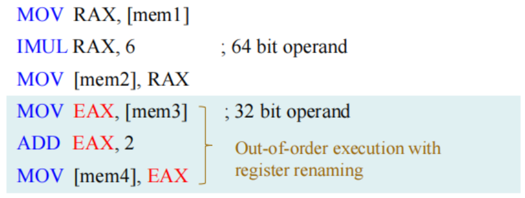{width=75%}
    </figure>

    而在 64 位的架构中，因为对 EAX 的任何写操作都会将 RAX 的高 32 bit 清零，所以一定不会存在数据依赖的情况，因此这时候 CPU 可以放心地对 EAX 进行重命名，从而避免部分寄存器冲突的问题，可以实现乱序的指令执行。

### Special Purpose Registers

通用目的寄存器包括 指令指针寄存器（RIP）和状态寄存器（RFLAGS）。

- 段寄存器包括 CS、DS、ES、SS、FS 和 GS。
- RIP：指针指令寄存器（Instruction Pointer）
    - 存储下一条将要执行的指令的地址
    - 在程序执行过程中，RIP 会自动更新以指向下一条指令
    - 在跳转、调用和返回等控制流指令中，RIP 的值会被修改以实现程序的跳转
- RSP：栈指针寄存器（Stack Pointer）
    - 指向当前栈顶的位置
    - 在函数调用和返回过程中用于管理栈空间
- RFLAGS：标志寄存器（Flags Register）
    - 包含多个标志位，用于反映 CPU 的状态和控制某些操作的行为
    - 最右侧的 5 个标志位会因算术指令和逻辑指令的执行结果而被自动更新

#### Flags of the RFLAGS

<figure markdown="span">
    {width=75%}
</figure>

| 标志位 | 名称                | 作用说明              |
|-------|--------------------|---------------------------------------------------|
| CF(0) | Carry              | 无符号运算进位/借位                                  |
| PF(2) | Parity             | 计算结果的低 8 位 1 的个数为偶数时置 1（相当于奇校验）   |
| AF(4) | Auxiliary          | Bit 3 向 Bit 4 的辅助进位/借位（BCD 运算时会使用）     |
| ZF(6) | Zero               | 运算结果为零时置 1                                  |
| SF(7) | Sign               | 运算结果为负（最高位为 1）时置 1                      |
| TF(8) | Trap               | 单步调试标志（调试时用）                             |
| IF(9) | Interrupt          | 控制 INTR（Interrupt Request）中断响应的使能标志      |
| DF(10)| Direction          | 指示 DI 和 SI 应该自增（0）还是自减（1）               |
| OF(11)| Overflow           | 有符号溢出（如 +127 加 1 变 -128）时置 1              |
| IOPL  | I/O Privilege      | 表示特权级(0-3)，当前特权级（CPL）低于或等于 IOPL 时允许执行 I/O 指令 |
| NT(14)| Nested Task        | 嵌套任务标志（中断返回 `IRET` 用）                     |
| RF(16)| Resume             | 恢复标志（调试时用，防止调试器陷入无限循环）              |
| VM(17)| Virtual 8086       | 置 1 进入虚拟 8086 模式                              |
| AC(18)| Alignment Check    | 对齐检查（当启用时，进行内存访问对齐检查）               |
| VIF(19)| Virtual Interrupt  | 虚拟中断标志（虚拟机监控程序使用）                     |
| VIP(20)| Virtual Interrupt Pending | 虚拟中断挂起标志（虚拟机监控程序使用）           |
| ID(21)| ID Flag            | 标识符标志（用于检测处理器是否支持 CPUID 指令）        |

- Status Flags（状态标志）：CF、PF、AF、ZF、SF、OF
- Direction Flag（方向标志）：DF
- System Flags（系统标志）：TF、IF、IOPL、NT、RF、VM、AC、VIF、VIP

### Segment Registers

- CS：代码段寄存器（Code Segment）
    - 存储当前正在执行的代码段的基地址
- DS：数据段寄存器（Data Segment）
    - 存储当前正在使用的数据段的基地址
    - 一般通过偏移地址或其他存有地址的寄存器来访问数据段中的数据
- SS：堆栈段寄存器（Stack Segment）
    - 存储当前栈段的基地址，使用 BP 和 SP 寄存器来访问栈中的数据
    - 栈操作（如 PUSH 和 POP 指令）通常使用 SS 寄存器来访问栈段
- ES：附加段寄存器（Extra Segment）
    - 用于存储额外的数据段的基地址
    - 在某些字符串操作指令中，ES 寄存器用于指定目标数据段的地址
- FS 和 GS：额外段寄存器（Additional Segment）
    - 这两个寄存器通常用于存储线程局部存储（Thread Local Storage，TLS）或操作系统特定的数据结构的基地址
    - 这两个段将用于访问特定于线程或操作系统的数据

!!! info "64 位模式下的段寄存器"
    在 64 位模式下，仅有 CS、FS 和 GS 段寄存器仍然保留其段基址的功能，其他段寄存器（DS、ES、SS）在 64 位模式下被忽略，段的基址被视为 0。

    <figure markdown="span">
        {width=45%}
    </figure> 

## Modes of Operation

<figure markdown="span">
    {width=75%}
</figure>

### Long Mode and 64-bit Mode

**Long mode**（英特尔称为 IA-32e mode，e 表示 extensions）是在传统的保护模式下的拓展。

> 那很传统了

- long mode 包括两种子模式：64 位模式 和 兼容模式（compatibility mode）
    - **64 位模式**：支持所有 64 位架构的新特性和寄存器扩展。
    - **兼容模式**：向下兼容现有的 32 位和 16 位的应用程序，使其可以在 64 位操作系统下运行，但无法使用 64 位的特性。
- long mode 不再支持传统的实模式（real mode）和虚拟 8086 模式（virtual-8086 mode）

### Compatibility Mode

- 兼容模式是长模式的第二种子模式，允许 64 位操作系统运行原有的 16 位、32 位 x86 应用程序，这些传统程序可以在兼容模式下无需重新编译即可运行。
- 在兼容模式下运行的应用，会采用 32 位或 16 位寻址，只能访问前 4GB 虚拟地址空间。
- 兼容模式下，经典 x86 指令前缀能够在 16 位和 32 位地址、操作数大小之间切换。

### Legacy Mode

传统模式包括三个子模式：

- **保护模式（protected mode）**：支持 16 位和 32 位程序的虚拟内存、分页管理和多任务处理等高级特性，运行于保护模式的程序可以访问最多 4GB 的内存空间。
- **虚拟 8086 模式（virtual-8086 mode）**：允许在保护模式下运行多个 16 位实模式程序的子模式，每个虚拟 8086 模式的程序都运行在一个独立的虚拟地址空间中，至多可访问 1MB 的内存。
- **实模式（real mode）**：最初的 x86 处理器工作模式，不支持分页或保护检查。运行于实模式的程序最多可访问 1MB 的内存空间。

### System Management Mode

- 系统管理模式（SMM）是一种专为系统控制任务而设计的操作模式，这些任务通常对常规系统软件是透明的。
- SMM 主要由平台固件和特定的底层设备驱动程序使用。

!!! info "模式转换图"
    <figure markdown="span">
        {width=85%}
    </figure>

## Memory Management

### Memory Management Requirements

1. **重定位（Relocation）**：
    - 程序员在编写程序时，不知道也不应知道程序执行时会被放置在内存的哪个位置。
    - 程序在运行过程中，在内存中的位置可能会变化，内存管理需要支持程序的重定位，以便把逻辑地址动态地转换为实际的物理地址。
2. **保护（Protection）**：
    - 各进程不应在未获许可的情况下访问其他进程的内存空间。
    - 由于在编译期无法检测所有的绝对地址，内存保护只能在运行时进行检查。
    - 内存保护必须由处理器（硬件）来实现，而不是仅靠操作系统（软件）来实现。
3. **共享（Sharing）**：
    - 系统应该允许多个进程访问同一块物理内存区域，以实现代码共享和数据共享。
    - 共享内存区域必须受到保护，防止未授权的访问。

### Segmentation and Paging

分段和分页是两种主要的内存管理技术。

- 分段（Segmentation）：
    - 将内存划分为若干个逻辑段，每个段有自己的基址（base）和界限（limit）。
    - 通过段寄存器和偏移地址来访问内存。
    - 支持内存保护和重定位，但可能导致内存碎片化。
- 分页（Paging）：
    - 将内存划分为固定大小的页（page），通常为 4KB 或 2MB。
    - 使用页表（page table）将虚拟地址映射到物理地址。
    - 支持虚拟内存和内存保护，减少内存碎片化。

!!! info "分段机制"
    - 段寄存器中存储的实际上是一个段选择子（segment selector），它指向全局描述符表（Global Descriptor Table，GDT）或局部描述符表（Local Descriptor Table，LDT）中的一个段描述符（segment descriptor）。
    - 段选择子包含段号（index）、表指示符（TI）和请求特权级（RPL）等信息。
        - 标指示符用于区分段描述符是位于 GDT 还是 LDT 中。
        - 段号用于在对应的描述符表中查找匹配的段描述符。
    - 段描述符包含段的基址（base address）、界限（limit）和访问权限等信息。
        - 只有当访问权限允许时，CPU 才能访问该段，否则会引发段错误（segment fault）。

??? example "分段地址示意图"
    <figure markdown="span">
        {width=75%}
    </figure>

    <figure markdown="span">
        {width=75%}
    </figure>

??? example "分页地址示意图"
    <figure markdown="span">
        {width=75%}
    </figure>

    <figure markdown="span">
        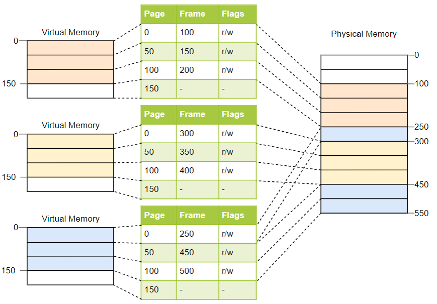{width=75%}
    </figure>

!!! note "分段和分页的不同"
    - **Size**
        - 分段：段的大小不固定，由用户或编译器决定（逻辑上更贴合程序结构）。
        - 分页：页面和页框都是固定大小（如 4KB），由硬件设定。
    - **Fragmentation**
        - 分段：可能导致外部碎片化（external fragmentation），因为段的大小不固定。
        - 分页：不存在外部碎片化，但可能导致内部碎片化（internal fragmentation），因为页内可能未被完全使用。
    - **Tables**
        - 分段：使用段表（segment table）来存储段号和段属性（基址和界限），查找速度较快。
        - 分页：使用页表（page table）来存储虚拟页到物理页帧的映射关系，由于页表较大，查找速度较慢，通常需要使用 TLB（Translation Lookaside Buffer）来加速。

!!! info "经典模式和长模式下的内存管理"
    <figure markdown="span">
        {width=75%}
    </figure>

    **经典模式**：

    - **实模式**：直接根据段寄存器存储的基地址和偏移地址计算线性地址，由于没有任何内存保护，线性地址就是基地址
    - **虚拟 8086 模式**：仍然使用段寄存器和偏移地址计算线性地址，但引入了保护机制，需要利用分页机制把线性地址映射到物理地址
    - **保护模式**：使用段寄存器和偏移地址计算线性地址（此时的偏移量是 32 位的，可以访问更大的内存空间）然后通过分页机制将线性地址映射到物理地址

    <figure markdown="span">
        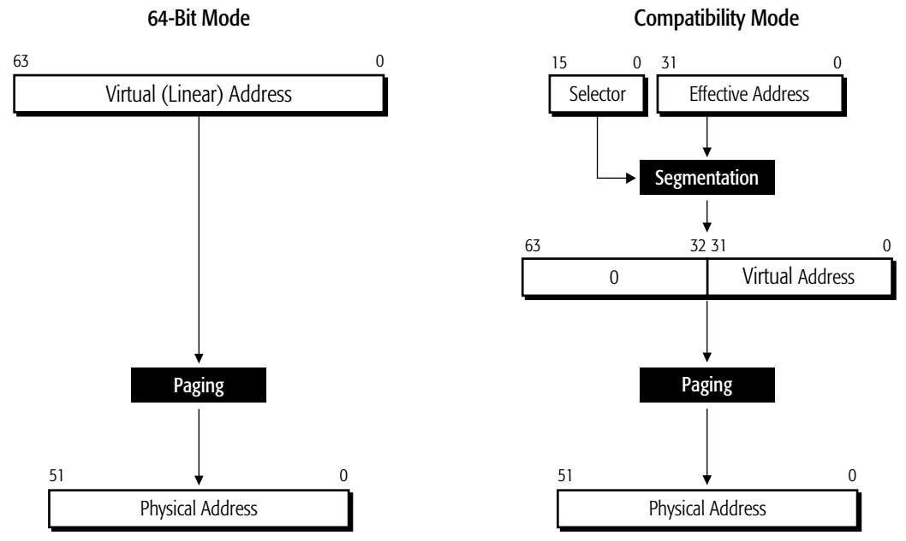{width=75%}
    </figure>

    **长模式**：

    - **64 位模式**：不使用段寄存器，直接使用 64 位的虚拟地址（线性地址），通过分页机制将虚拟地址映射到物理地址
    - **兼容模式**：通过分段机制计算得到 32 位的虚拟地址，在高 32 位补零得到完整的 64 位虚拟地址，然后通过分页机制找到物理地址

    > 分段机制的地址计算方式是：线性地址 = 段基址 * 16 + 偏移地址
    > 也就是说需要把段寄存器中存储的基地址左移 4 位（乘以 16）才能与偏移地址相加得到线性地址

## Real Mode Memory Addressing

实模式下只能对前 1MB 的内存进行寻址，这段内存被称为实内存（real memory）、常规内存（conventional memory）或 DOS 内存。

- 实模式下的内存寻址必须由段地址与偏移地址相加得到
    - 段地址：64KB 对齐的段内存地址，由段寄存器提供
    - 偏移地址：段内的偏移地址，由指令或其他寄存器提供
- 线性地址（linear address）= 段地址 × 16 + 偏移地址
    - 即段地址左移 4 位后与偏移地址相加
    - 例如段地址 = 0x1234，偏移地址 = 0x5678
    - 线性地址 = 0x1234 << 4 + 0x5678 = 0x12340 + 0x5678 = 0x179B8

### Default Segment and Offset Registers

微处理器在进行内存寻址时，必须遵循一定的规则来确定使用哪个段寄存器和偏移寄存器。

- 代码段寄存器（CS）用于确定程序代码的段地址
- 指令指针寄存器（IP/EIP/RIP）用于代码段中下一条将被执行的命令

另一种默认组合是，使用栈段寄存器（SS）和栈指针寄存器（SP/ESP/RSP）或基址指针寄存器（BP/EBP/RBP）来访问栈中的数据。

!!! example
    例如下图就展示了一个包含四个内存段的系统。假如某个段实际需要的空间不足 64KB，段之间就有可能接触甚至重叠。

    - 一个程序可以拥有多于四个甚至六个段，但同一时刻只能访问其中四个或六个段。

    <figure markdown="span">
        {width=75%}
    </figure>

!!! info "重定位"
    段与偏移地址结合的寻址方式支持重定位

    - **可重定位程序（relocatable program）**：指可以被放置在内存的任何位置，无需修改即可直接在内存中运行的程序。
        - 程序在编译时并不知道它将被加载到内存的哪个位置，因此需要通过段寄存器和偏移地址来计算实际的内存地址。
    - **可重定位数据（relocatable data）**：可以被放置在内存的任何位置，程序无需修改即可直接使用这些数据。

    <figure markdown="span">
        {width=85%}
    </figure>

    由于内存是通过相对于段基址的偏移地址来访问的，因此我们可以通过修改内存段的基址来把它们移动到内存的不同位置，而不需要修改程序中的任何指令或数据地址。

    - 操作系统可以在运行时为各个段分配实际的内存地址。

!!! note "Address Wrapping Problem"
    由于在早期的 Intel CPU（8086/8088/80186）中，内存最大的寻址空间只有 1MB（20 位地址总线），因此当段地址和偏移地址相加的结果超过 1MB 时，会发生地址回绕（address wrapping）的问题。例如

    <figure markdown="span">
        {width=75%}
    </figure>

## Intro to Protected Mode Memory Addressing

### Selectors and Descriptors

在保护模式下，段寄存器存放的不是直接的段地址，而是一个段选择子（selector），它指向描述符表（descriptor table）中的一个段描述符（descriptor）。段描述符中记录了内存段的位置（base address）、长度（limit）、访问权限（access rights）等信息。

<figure markdown="span">
    {width=85%}
</figure>

- **选择子**存放在段寄存器中，用于定位描述符表中的相应的描述符。选择子会从两个描述符表（全局描述符表 GDT 和局部描述符表 LDT）的 8192 个描述符中选择符合条件的一个。
- **描述符**存放在描述符表中，包含了段的基址、界限和访问权限等信息。
    - 有一类特殊的描述符，被称为“门”（gate），用于为某个软件例程提供代码选择子和入口地址。

### Descriptor Tables

<figure markdown="span">
    {width=85%}
</figure>

描述符表（descriptor table）是存储段描述符的表格，包括三种：

- **全局描述符表（GDT，Global Descriptor Table）**：存储系统范围内可供所有程序访问的描述符（必需）
- **局部描述符表（LDT，Local Descriptor Table）**：仅存储某个特定程序或任务使用的描述符（可选）
- **中断描述符表（IDT，Interrupt Descriptor Table）**：只保存门描述符（必需）

!!! note "全局描述符与局部描述符"
    - 全局描述符中包含适用于所有程序的段定义信息
    - 局部描述符通常只针对于某个特定的程序或任务，定义该程序或任务所需的段信息
    - 有时全局描述符也称为**系统描述符**，局部描述符称为**应用描述符**。

!!! note "空描述符"
    - GDT 中的第一个条目一定是空描述符（null descriptor），其所有字段均为零。
    - 空描述符可使不再被使用的段寄存器无效，不再被使用的段寄存器会被初始化为指向空描述符的段选择子，即空选择子（null selector）。
    - 当程序尝试访问一个空描述符时，CPU 会触发一个段错误异常。
    - 将空选择子加载到数据段寄存器（DS、ES、FS、GS）时不会产生异常，但如果用其访问内存则一定引发通用保护异常（#GP）。

!!! info "描述符的格式"
    <figure markdown="span">
        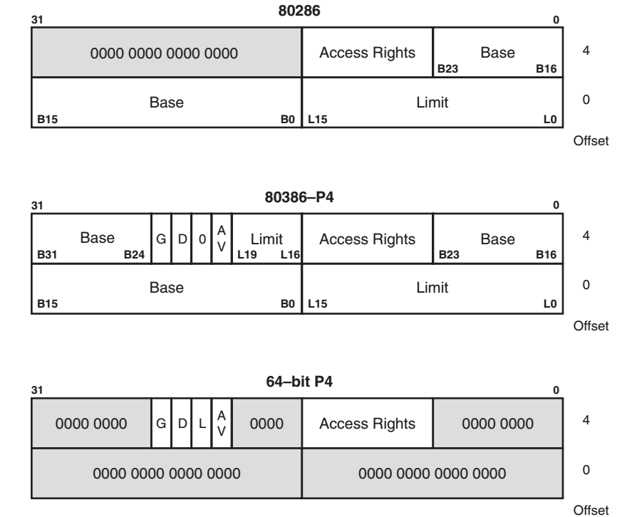{width=75%}
    </figure>

    - 每个描述符占 8 字节（64 bits）
    - 全局描述符表（GDT）和局部描述符表（LDT）的最大长度都为 64KB
    - 因此每个表最多可以包含 8192 个描述符

??? question "在保护模式下，理论上单个 x86 处理器最多运行多少个进程？"
    - 保护模式下使用描述符来管理内存段的访问
    - 每个进程都需要至少一个代码段和一个数据段，意味着至少需要 GDT 中的两个描述符
    - GDT 的大小为 64KB，每个描述符占 8 字节，因此 GDT 最多可以包含 8192 个描述符，至多能支持 4096 个进程

描述符的各个字段说明如下：

- **基址（Base Address）**：
    - 指示段的起始地址
    - 在保护模式下，段的起始地址不再需要对齐段落边界（paragraph boundary），段可以从任意地址开始
- **界限（Segment Limit）**：
    - 表示该段允许访问的最大偏移量，也就是段内最后一个有效字节的偏移。
    - 段描述符中表示 limit 的字段有两个，分别是低 16 位和高 4 位，共 20 位，因此 limit 最大为 0xFFFFF（$2^{20}-1$）
    - limit 的单位可以是字节（byte）或页（page），由描述符中的 G 位决定。
- **粒度位（Granulaity, G）**
    - 粒度位决定 limit 字段表示的单位
    - 当 G=0 时，limit 以字节为单位，段的最大长度为 (limit + 1) 字节，范围为 0 到 0xFFFFF（0 ~ 1MB - 1）
    - 当 G=1 时，limit 以 4KB 的页为单位，段的最大值为 (limit + 1) × 4KB，范围为 0xFFF 到 0xFFFFFFF（4KB - 1 ~ 4GB - 1）
 
??? example "Segment Limit Example"
    === "例一"
        For a descriptor with

        - base address: 10000000H
        - limit: 001FFH
        - G = 0

        what is the starting and ending locations?

        我们起始地址就是描述符的基地址，因为 G=0，所以 limit 以字节为单位，因此段的结束地址就是起始地址加上 limit：

        - starting address = 10000000H
        - ending address = 10000000H + 001FFH = 100001FFH

    === "例二"

        For a descriptor with

        - base address: 10000000H
        - limit: 001FFH
        - G = 1

        what is the starting and ending locations?

        起始地址仍然是描述符的基地址，但由于 G=1，limit 以 4KB 为单位，因此需要先计算出段的大小，再加到起始地址上得到结束地址：

        - 段的长度为 length = (limit + 1) × 4KB = 200H × 1000H = 200000H

        - starting address = 10000000H
        - ending address = 10000000H + length - 1 = 10000000H + 200000H - 1H = 101FFFFFH

- **访问权限（Access Rights）**：
    - 定义了段的类型（代码段、数据段、系统段等）、特权级（0-3）和其他属性
        - 例如，代码段描述符的访问权限字段会指示该段是否可执行、是否可读等信息；如果该段为数据段，还可以指定读取时指针是增长还是减少。
    - 如果段超过了其界限（limit），操作系统会触发一个中断，并产生通用保护异常（#GP，General Protection Fault）。

    <figure markdown="span">
        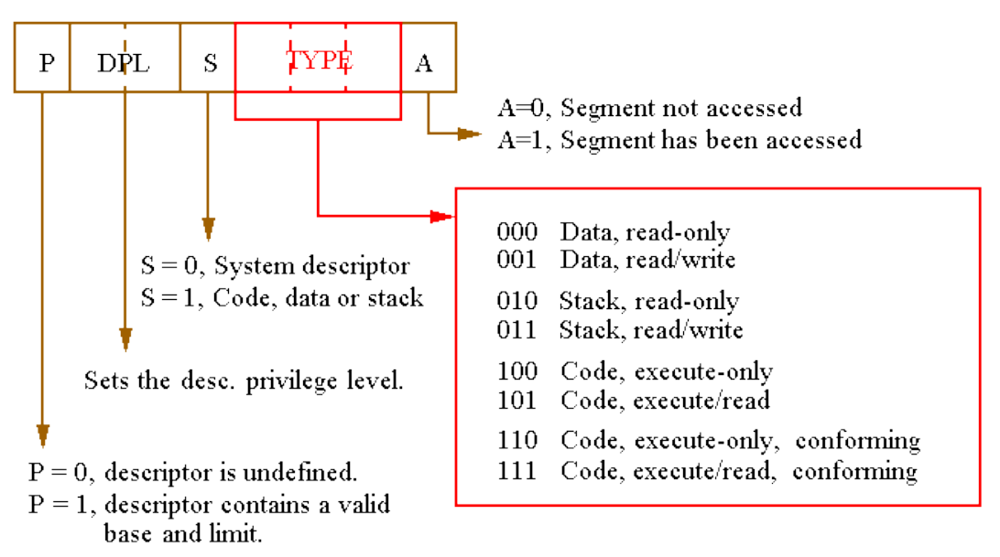{width=75%}
    </figure>

    - 其中的 S 和 Type 字段共同定义了段的类型及其权限
        - S=1 表示代码段或数据段
        - S=0 表示系统段（如任务状态段 TSS、门描述符等）
    - DPL（Descriptor Privilege Level）字段表示段的特权级，范围为 0-3
        - 0 级权限最高，通常用于操作系统内核
        - 3 级权限最低，通常用于用户程序
    - P（Present）位表示这个描述符是否有效，即该段是否存在于内存中
        - 如果 P=0，表示该段不存在，任何对该段的访问都会引发段不存在异常（#NP，Segment Not Present）
        - 如果 P=1，表示该段存在且可用

!!! note
    总而言之，当我们对内存进行寻址时，首先通过段寄存器中的选择子找到对应的描述符，然后根据描述符中的基址和界限计算出实际的内存地址，并检查访问权限以确保访问合法。

    <figure markdown="span">
        {width=75%}
    </figure>

### Segment Selector Format

<figure markdown="span">
    {width=75%}
</figure>

- 段选择子长度为 16 bits，包含一个 13 位的索引字段（Index），一个表指示位（TI）和一个 2 位的请求特权级（RPL）。
- TI 位用于指示该选择子引用的是全局描述符表（GDT）还是局部描述符表（LDT）。
    - TI=0 表示选择 GDT
    - TI=1 表示选择 LDT
- 请求特权级表示访问对应内存段时的特权级别，即当前程序的特权级别，范围为 0-3
    - RPL 用于与段描述符中的 DPL 字段进行比较，以确定当前程序是否有权限访问该段。

!!! info "三种特权级别"
    <figure markdown="span">
        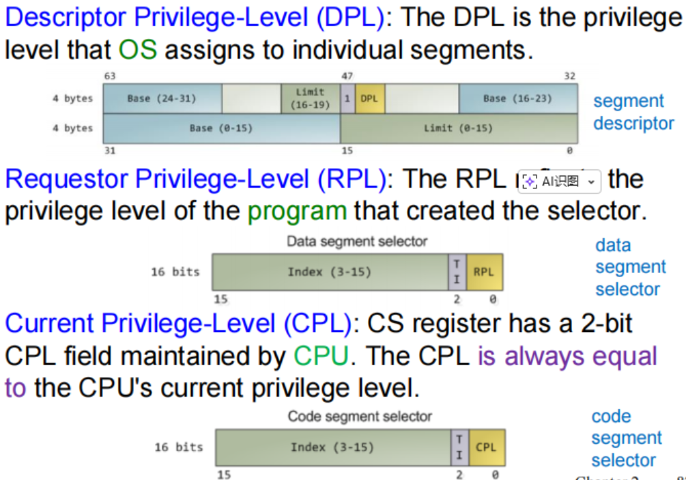{width=75%}
    </figure>

    - **Descriptor Privilege Level (DPL)**: 由操作系统分配给每个单独的段，表示该段的权限级别。在描述符中指定。
    - **Requestor Privilege Level (RPL)**: 位于段选择子的最低 2 位，用于表示请求该段的程序的权限级别（通常由创建选择子的代码决定）。
    - **Current Privilege Level (CPL)**: 当前 CPU 的权限级别，CPU 会在 CS 寄存器中的最低 2 位中存储 CPL。

??? example "Privilege Level Examples"
    - 在访问数据段时，只要 CPL 或 RPL 都小于等于 DPL（即两者都不高于 DPL），就允许访问该段。
        - CPL 和 RPL 取较高值，这被称之为有效特权级（Effective Privilege Level，EPL）。
    - 在访问堆栈段时，三者必须都相等（CPL = RPL = DPL），才能访问该段。

    <figure markdown="span">
        {width=65%}
    </figure>

    <figure markdown="span">
        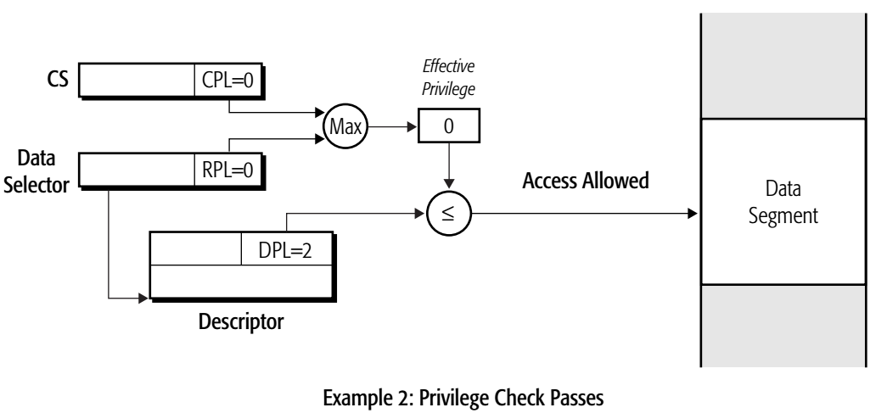{width=65%}
    </figure>

    <figure markdown="span">
        {width=65%}
    </figure>

    <figure markdown="span">
        {width=65%}
    </figure>

### Program-Invisible Registers

- 有三种描述符表
    - GDT、LDT 和 IDT
- 有四种程序不可见的寄存器
    - GDTR 和 IDTR：分别保存 GDT 和 IDT 的地址，在进入保护模式之前被加载好
    - LDTR 和 TR：指向 GDT 中的一些特殊系统描述符（例如 LDTR 寄存器相当于一个段选择子，指向 GDT 中的一个 LDT 描述符）
    - 其他的不可见寄存器被作为描述符缓存（descriptor cache）使用，存储最近使用的段描述符，以加快段地址的转换速度
- GDTR（全局描述符表寄存器）和 IDTR（中断描述符表寄存器）包含描述符表的基址和界限
    - 当进入保护模式时，会把全局描述符表的地址和界限加载到 GDTR 中。
- 局部描述符的位置由 LDTR（局部描述符表寄存器）指定
    - LDTR 存储一个段选择子，指向 GDT 中的一个 LDT 描述符
    - LDT 描述符中包含 LDT 的基址、界限和访问权限等信息，这些内容会被加载到 LDTR 中
- TR（任务寄存器）会保存一个段选择子，指向 GDT 中的一个任务状态段（TSS）描述符
    - TSS 描述符中包含任务状态段的基址、界限和访问权限等信息，这些内容会被加载到 TR 中
    - 当我们进行任务切换时，CPU 会根据 TR 中的选择子找到对应的 TSS 描述符，然后加载任务状态段的信息，以便切换到新的任务环境

!!! note "保护模式下的内存寻址过程"
    <figure markdown="span">
        {width=75%}
    </figure>

    - 当 CPU 需要访问内存时，首先会从段寄存器中获取段选择子
    - 然后根据选择子中的索引和 TI 位，找到对应的描述符表（GDT 或 LDT）中的段描述符
    - 接着根据段描述符中的界限、访问权限等判断是否允许访问该段
    - 最后根据段描述符中的基址和偏移地址计算出实际的内存地址，进行内存访问

    > selector 被乘以了 8 是因为每个描述符占 8 字节，因此需要乘以 8 才能得到描述符在表中的实际偏移地址。

    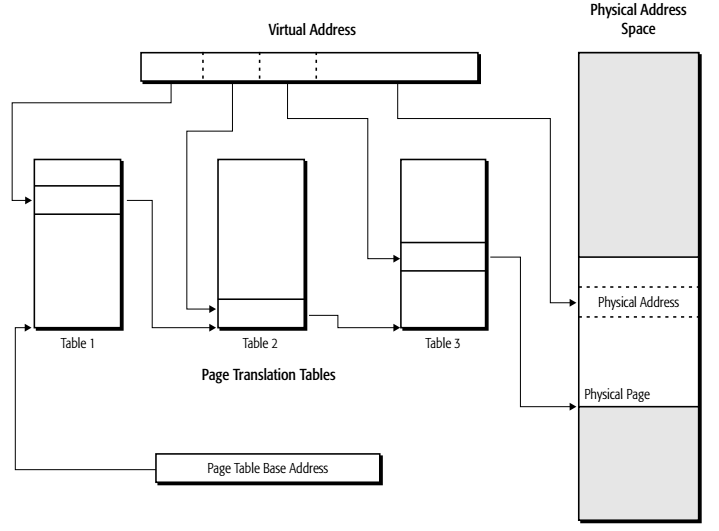{width=30% align=right}

    更具体地来说，当我们需要通过 TI 来判断是否访问 LDT 时：

    - TI=0：选择 GDT，从 GDTR 中获取 GDT 的基址，然后根据选择子中的 index 字段取出对应的描述符
    - TI=1：选择 LDT，从 GDTR 中获取 GDT 的基址，将 LDTR 作为一个特殊的选择子，找到 GDT 中指向 LDT 的描述符，获取 LDT 的基址。然后根据选择子中的 index 字段取出 LDT 中对应的描述符

    当我们切换到不同的任务时，LDTR 的值也会相应的改变，以指向当前任务所使用的 LDT 描述符，从而确保每个任务都能访问到自己的局部段描述符。

!!! info "保护模式下的分段内存模型分"
    - 系统软件可以利用分段机制来实现两种基本的内存分段模型：多段模型（multi-segmented model）和平坦内存模型（flat-memory model）。
        - 多段模型将内存划分为不同的段，如代码段、数据段和栈段，每个段都可以独立访问。
        - 平坦内存模型将整个内存空间视为一个连续的线性地址空间，所有段的基址都设置为 0，界限设置为最大值，从而实现对整个内存空间的统一访问。

## Memory Paging

> 详情可见[计组笔记](../COD/chap-5.md)

在 x86 处理器中，定义了四种地址来描述内存的组织：

1. **有效地址（Effective Address）**：
    - 也称为近指针（near pointer），指的是某个内存段内的偏移量
    - 有效地址的计算公式为 Effective Address = Base + (Scale × Index) + Displacement
        - Base：基址寄存器的值
        - Scale：缩放因子，可取值 1、2、4 或 8
        - Index：索引寄存器的值
        - Displacement：位移值，通常是指令编码中给出的一个立即数

2. **逻辑地址（Logical Address）**：
    - 也成为远指针（far pointer），表示在分段地址空间中的一个引用
    - 由段选择子（Segment Selector）和有效地址组成
    - 逻辑地址可以表示为 Logical Address = Segment Selector: Effective Address
        - Segment Selector：段寄存器中的值，用于选择描述符表中的段描述符
        - Effective Address：前面提到的有效地址

3. **线性地址（Linear Address）**：
    - 也称为虚拟地址（Virtual Address），是通过段基址和有效地址（段内偏移）相加得到的
    - 线性地址的计算公式为 Linear Address = Base Address + Effective Address
        - Base Address：段描述符中的基址
        - Effective Address：前面提到的有效地址
    - 当我们使用平面内存模型（例如 64 位模式下）时，段基址总是被设置为 0，因此线性地址等同于有效地址

4. **物理地址（Physical Address）**：
    - 是实际的内存地址，用于访问物理内存
    - 物理内存被视为由 8 bit 的字节组成的一个长序列，每一个字节都对应一个唯一的物理地址
    - 内存分页机制允许任意物理内存位置被分配给任意的线性地址

!!! info "page size"
    - 在长模式下，物理页的大小可能是 4KB、2MB、1GB
    - 在传统模式下，物理页的大小可能是 4KB、2MB、4MB

### Multiple-Level Paging

<figure markdown="span">
    {width=75%}
</figure>

??? question "为什么需要多级页表？"
    我们知道页表在某些情况会非常大，例如 64 位系统中的虚拟地址为 64 位，当我们使用 4KB 的页大小时，就需要有 $2^{64} / 2^{12} = 2^{52}$ 个页表项，假设每个页表项占 4 字节，总共需要 $2^{52} \times 4 = 2^{54}$ 字节（16 PB）的内存来存储页表。并且这还只是一个页表，而通常而言每个应用程序都需要一个独立的页表，这显然是非常不现实的。

    当我们使用分级页表时，如果我们为所有的线性地址都分配页表项，那么通过计算很容易知道我们并没有减小页表的总大小，反而因为增加了多级页表的结构而增加了内存开销。但是多级页表的优势在于它允许我们只为实际使用的内存页分配页表项，而不需要为所有可能的线性地址都分配页表项。

    具体来说，假设我们使用二级页表，两个页表中都包含 1024 个页表项（每个页表项占 4 字节）：

    - 在最开始时，我们只需要为第一级页表分配内存，这个页表占用 4KB 的内存空间。而由于暂时没有访问任何线性地址，因此第二级页表还不需要分配内存。（即此时还没有任何一个二级页表存在）
    - 当我们访问某个线性地址时，CPU 会先查找第一级页表，找到对应的页表项。如果该页表项指向的第二级页表还不存在，那么操作系统会为该第二级页表分配内存，并将其地址写入第一级页表的对应项中。
        - 例如我们需要访问某个线性地址，这个线性地址对应的第一级页表项是第 5 项，而第 5 项还没有指向任何第二级页表，那么操作系统就会为该第二级页表分配 4KB 的内存，并将其地址写入第一级页表的第 5 项中。
        - 然后 CPU 会继续查找二级页表，找到对应的页表项，从而得到物理地址。
    - 通过这种方式，我们只为实际使用的内存页分配了页表项，而不需要为所有可能的线性地址都分配页表项，从而大大减少了页表的内存开销。
        - 此时剩余的 1023 个二级页表仍然没有被分配内存，因此页表实际上只占用了 8KB（4KB 的第一页表 + 4KB 的第二页表）。

    现在反观没有使用多级页表的情况：一级页表和二级页表加起来总共有 $1024 \times 1024 = 2^{20}$ 个页表项，所以如果我们没有使用多级页表，无论实际上需要使用的页表项有多少个，都需要在一开始就创建一个大小为 $2^{20} \times 4B = 4MB$ 的页表。

    使用三级乃至更多级页表也是类似的，我们只需要在最开始时创建最外层的页表，当需要访问某个物理页时再创建相应的二级、三级等内层页表，这样就可以保证页表不会占用大量的内存空间。

    > 当然最极端的情况是所有的物理页都被使用了，那么多级页表中的每一级页表都需要被创建出来，此时多级页表的总大小会比单级页表更大一些，但是这种情况在实际应用中几乎不会出现的。

!!! note "多级分页的优缺点"
    - 优点：适合内存空间利用稀疏的应用程序
        - 单级分页：必须为每一个虚拟地址都分配一个页表项（数量巨大）
        - 多级分页：只需要为实际使用到的页目录项分配空间（总体页表项更少）
    - 缺点：多级分页会增加访问内存的时间开销。因为每一次查找都需要访问多个页表（每一级页表都需要访问一次内存），而单级分页只需要访问一次页表即可得到物理地址。

!!! example
    考虑一个采用多级分页机制的系统，页面大小为 4KB，物理内存为 16TB，虚拟地址长度为 32 位，页表项（PTE）大小为 4 字节。 

    那么需要多少级页表？给出物理地址和虚拟地址的划分。

    **答：**

    - 虚拟地址长度为 32 位，物理地址长度为 44 位（16TB = $2^{44}$ 字节）
    - 页面大小为 4KB = $2^{12}$ 字节，因此页内偏移占 12 位
    - 每一页的页表至多含有 1024 个页表项（4KB / 4B = 1024 = $2^{10}$），因此每一级页表可以映射 $2^{10}$ 个页面，每级页表需要 10 位地址
    - 虚拟页号位数：32 - 12 = 20 位，因此总页表级数为 $20 \div 10 = 2$，**需要 2 级页表**

    **地址划分示意图**如下：

    - 需要 2 级页表，虚拟地址格式为 | 10 | 10 | 12 |

    <figure markdown="span">
        {width=75%}
    </figure>

!!! info "Why 4KB Page Size?"
    决定分页的大小需要考虑以下因素：

    - 以 2 的幂为页大小有利于硬件实现以及性能提升
    - 如果页比较小，那么内部碎片会更少，能更充分地利用内存
    - 如果页比较大，那么页表的数量更少，缺页异常也会减小

    理论和实践均表明，页大小在 $2^7 \sim 2^{14}$（128B ~ 16KB）区间表现最优。Intel 在 20 世纪 80 年代发现 4KB 的页大小平均而言表现最佳。

### Page Protection

- 当虚拟地址被转换为物理地址时，处理器会执行访问保护检查
- 处理器会检查页面级的保护位，仅当访问权限允许时，才允许访问该页面，如果违反了页级保护的要求，则会引发一个页错误异常（#PF，Page Fault Exception）

<figure markdown="span">
    {width=75%}
</figure>

- 第 0 位：Present 位，表示该页是否存在于物理内存中
    - P=0：表示该页不在物理内存中，任何对该页的访问都会引发页错误异常
    - P=1：表示该页存在于物理内存中，可以进行访问
- 第 1 位：Read/Write 位，表示该页是否可写
    - R/W=0：表示该页为只读页，任何对该页的写操作都会引发页错误异常
    - R/W=1：表示该页可读可写
- 第 2 位：User/Supervisor 位，表示该页的访问权限级别
    - U/S=0：表示该页只能被特权级别为 0、1 或 2 的代码访问（通常是操作系统内核）
    - U/S=1：表示该页可以被任何特权级别的代码访问（包括用户程序）

!!! tip
    对于同一个页，页目录项（PDE，Page-Directory Entry）和页表项（PTE，Page-Table Entry）都包含保护位。如果两个项中的保护位不一致，则以更严格的保护位为准（可以通过“按位与”运算来实现）。

### Paging Registers

- 分页单元的控制由微处理器的控制寄存器内容来控制。
- 从奔腾（Pentium）处理器开始，新增了名为 CR4 的控制寄存器，用于扩展基本架构的功能。

<figure markdown="span">
    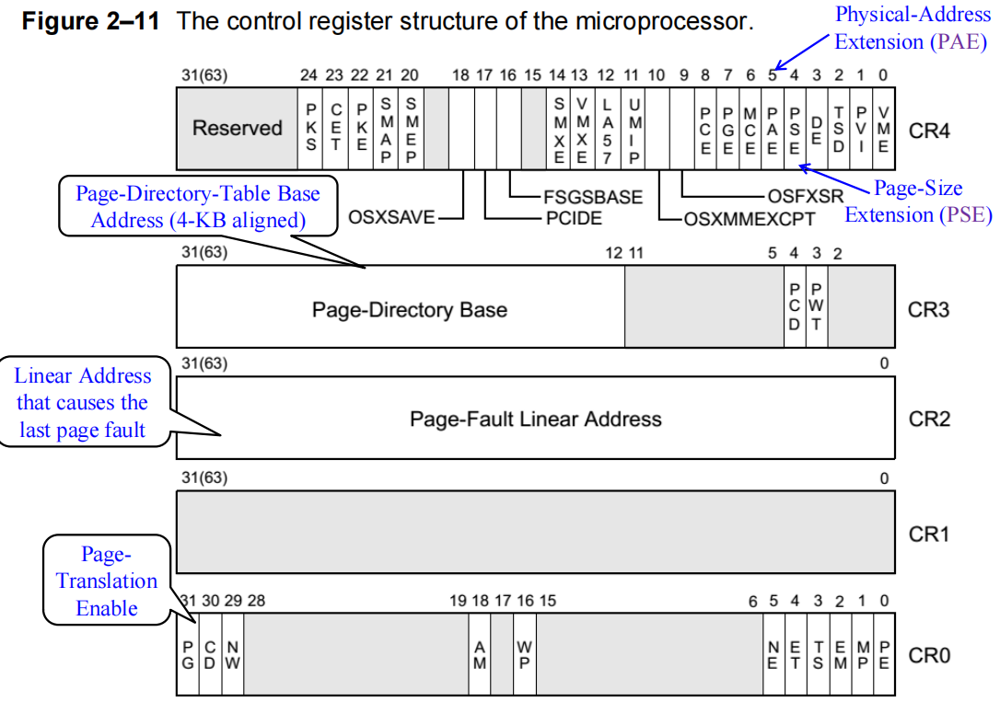{width=75%}
</figure>

- 当页错误异常（#PF）发生时，处理器会将引发异常的线性地址存储在 CR2 寄存器中，以便操作系统能够确定哪个地址导致了异常。
- 页错误处理程序（page-fault handler）可以使用这个地址定位对应的页目录和页表项
- \#PF 会在以下的情况中发生：
    - 参与地址转换的页表项或物理页没有在内存中（present/absent）
    - 对内存的访问未通过页级保护检查（例如用户/特权级别不匹配，读/写权限不足等）
- 如果在处理页错误的过程中又发生了新的页错误，那么第二个页错误对应的线性地址会覆盖 CR2 寄存器中的内容，因此操作系统需要在处理第一个页错误时，尽快保存 CR2 的值，以防止被覆盖。

!!! info "Legacy Mode Paging Model"
    在传统模式下，32 位的线性地址由两种方式转换为物理地址：

    - 两级分页：10-10-12 模型
    - 三级分页：2-9-9-12 模型

    <figure markdown="span">
        {width=75%}
    </figure>

### Extensions of Paging Model

分页模型包括两种拓展

- **页大小扩展（Page Size Extension，PSE）**：
    - 允许使用更大的页大小，例如 4MB 的大页
    - 通过设置 CR4 寄存器中的 PSE 位来启用
- **物理地址扩展（Physical Address Extension，PAE）**：
    - 允许使用超过 4GB 的物理内存
    - 通过设置 CR4 寄存器中的 PAE 位来启用
    - 启用 PAE 后，会改为使用 2-9-9-12 的三级分页模型

#### PSE

是否启用 PSE 取决于 CR4 控制寄存器中的 PSE 位和页目录项（PDE）的 PS 标志位（第 7 位）：

- 当 CR4.PSE = 1 且 PDE.PS = 1 时，该 PDE 使用 4MB 大小的页。
- 当 CR4.PSE = 1 且 PDE.PS = 0 时，PDE 仍然使用标准的 4KB 页。
- 当 CR4.PSE = 0 时，所有 PDE 都使用标准的 4KB 页，无论 PDE.PS 的值如何。

<figure markdown="span">
    {width=75%}
</figure>

!!! note "Mixing 4KB and 4MB pages"
    4MB 的物理页可以与标准的 4KB 物理页混合使用，物理页的大小由页目录项（PDE）的 PS 标志位决定。

    混合使用的好处有：

    - 超大页（4MB）可以用于内核代码
    - 常规页（4KB）可以用于普通的应用程序

    <figure markdown="span">
        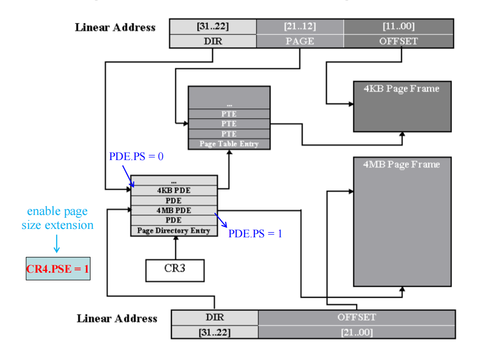{width=85%}
    </figure>

    - 仅当 CR4.PSE = 1 时，页目录项（PDE）的 PS 标志位才有效
        - 如果 PDE.PS = 1，则该 PDE 映射一个 4MB 的大页，线性地址被划分为 10位(页目录) + 22位(偏移)。
        - 如果 PDE.PS = 0，则该 PDE 指向一个页表，页表中的页表项（PTE）映射 4KB 的页，线性地址被划分为 10位(页目录) + 10位(页表) + 12位(偏移)。

!!! tip
    页目录（Page Directory）实际上就是二级页表中的外层页表，当我们启用 PSE 后，因为我们改用了 $4MB = 2^{22}$ 的页大小，线性地址的划分不再是 10-10-12，而是变成了 10-22。

#### PAE

- PAE（页面地址扩展）允许 32 位的应用程序访问超过 4GB 的物理内存空间。
- 当 CR4.PAE = 1 时，处理器会启用 PAE 功能。
- PAE 的特性有：
    - 允许最多访问 64GB（$2^{36}$ 字节）的物理内存
    - 仅用于操作系统管理更多的物理内存，应用程序看到的线性地址空间仍然是32位。
    - 支持 4KB 和 2MB 的页大小（使用 2-9-9-12 的三级分页模型）

PAE 允许虚拟地址被转换为最长 36 位的物理地址，从而支持最多 64GB 的物理内存。此时每个页表项的大小将从 4 字节增加到 8 字节，以存储更长的物理页基地址。

<figure markdown="span">
    {width=75%}
</figure>

!!! note "PAE Paging: 2-9-9-12 Model"
    在 2-9-9-12 分页模型中，内存使用了三级页表结构，具体内容为：

    - 每个页表项拓展为 8 字节
    - 由于每个物理页还是 4KB，因此页目录和页表项仍是 4KB 大小，每个页表包含 512 个页表项
    - 新增了一个被称为页目录指针表（Page Directory Pointer Table，PDPT）的结构
        - 使用线性地址的 [31:30] 位作为索引，每一个表项都指向一个页目录
        - 实际上就是三层页表中的最外层页表
    - CR3 寄存器中保存 PDPT 的物理地址

大页的大小是 4MB 还是 2MB，取决于 CR4.PSE 位和 CR4.PAE 位，具体如下：

- 如果 CR4.PAE = 1，此时 CR4.PSE 位被忽略，大页大小为 2MB（2-9-9-12 模型）
    - 当 PDE.PS = 1 时，表示该 PDE 映射一个 2MB 的大页
    - 当 PDE.PS = 0 时，表示该 PDE 指向一个页表，页表中的页表项（PTE）映射 4KB 的页
- 如果 CR4.PAE = 0，CR4.PSE = 1，大页大小为 4MB（10-10-12 模型）
    - 当 PDE.PS = 1 时，表示该 PDE 映射一个 4MB 的大页
    - 当 PDE.PS = 0 时，表示该 PDE 指向一个页表，页表中的页表项（PTE）映射 4KB 的页
- 如果 CR4.PAE = 0，CR4.PSE = 0，则所有 PDE 都使用标准的 4KB 页，无论 PDE.PS 的值如何。

### MMU

内存管理单元（MMU, Memory Management Unit）是一种用于将虚拟地址转换为物理地址的硬件单元。

- 当发生 TLB 未命中（TLB miss）时，MMU 会通过硬件状态机遍历页表，实现地址转换。

<figure markdown="span">
    {width=85%}
</figure>

- TLB 的作用是加速虚拟地址到物理地址的转换；而 CPU Cache 是用于降低对主存的访问延迟。

<figure markdown="span">
    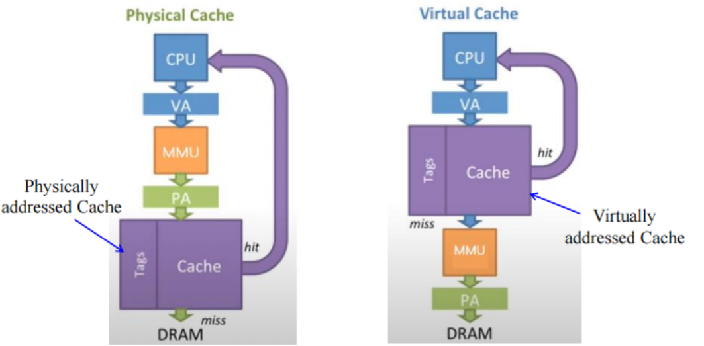{width=75%}
</figure>

!!! info "分页结构缓存"
    在多级页表中，叶级页表（leaf level）被缓存在 TLB 中，上层页表则被缓存在 MMU 中，这被称为分页结构缓存。

    <figure markdown="span">
        {width=75%}
    </figure>

### Self-Referencing Entry

在开启分页模式后，CPU 访问的每一个地址都是虚拟地址，而不是物理地址。而 OS 经常需要对页表进行修改，这就需要为 OS 提供一个能够访问页表所在的物理地址的机制，否则 OS 将无法修改甚至“看到”页表的内容。

为了解决这个问题，操作系统通常会在页目录中创建一个自引用条目（self-referencing entry），使得这个条目不再指向任何页表的物理地址，而是指向页目录本身的物理地址。通过这种方式，操作系统就可以通过这个自引用条目来访问和修改页表的内容。

- 例如在正常情况下，内存的访问为 CR3 -> 页目录 -> 页表 -> 物理页

    <figure markdown="span">
        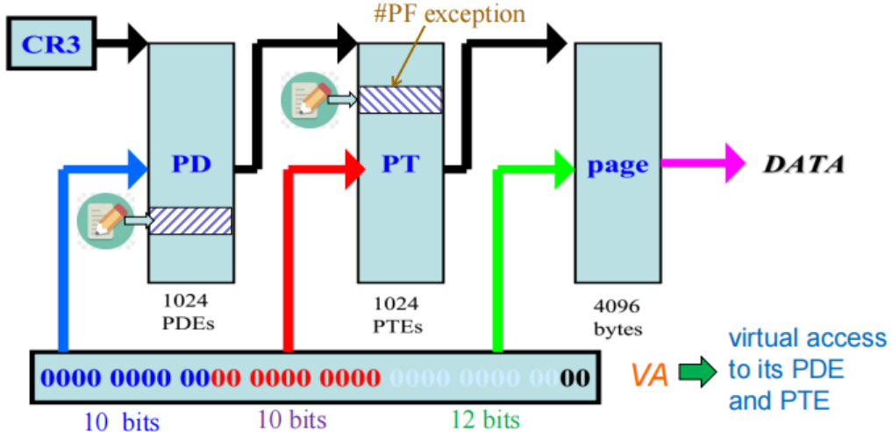{width=75%}
    </figure>

- 而当我们在页目录中选择某个索引（例如下图中为），使其对应的页目录项指向页目录本身时，访问过程变为 CR3 -> 页目录 -> 页目录 -> 页表
    - 这样一来，地址转换结束时，OS 访问到的就是页表本身所在的物理页，就可以对页表进行修改了

    <figure markdown="span">
        {width=60%}
    </figure>

在 Windows 32 位系统中，使用 0x300 作为自引用条目的索引，这样以来，给定一个虚拟地址 VA，这个虚拟地址的PDE 和 PTE 的虚拟地址可以通过如下的方式得到：

- PTE: `0xc0000000 | ((VA >> 12) << 2)`
- PDE: `0xc0300000 | ((VA >> 22) << 2)`

> 0xc0000000 的高 10 位是 1100 0000 00，即 0x300，表示自引用条目所在的位置。

这里先右移的目的是为了去掉页内偏移部分，然后再左移 2 位是因为每个页表项占 4 字节（2^2 = 4），这样就得到了对应的页表项在自引用条目中的偏移地址。

对于更具体的情况，可以参考下面的这个例子

!!! example "寻找 PTE 的物理地址"
    <figure markdown="span">
        {width=75%}
    </figure>

    我们要把求的是虚拟地址 0xe4321000 的页表项，把这个地址拆分为 10-10-12 的格式，就变为 `390 321 000`。

    按照上面的公式，我们可以计算出：

    - PTE: `0xc0000000 | ((0xe4321000 >> 12) << 2) = 0xc0000000 | (0xe4321 << 2) = 0xc0000000 | 0x398c84 = 0xc398c84`

    它的结构可以具体分析为：

    - 高 10 位：`0x300`。首先访问页目录的第 0x300 项（自引用条目），下一步不会跳转到任何页表，而是继续访问页目录本身
    - 中间 10 位：`0x390`。继续访问页目录的第 0x390 项，这个项指向了一个页表，这个页表就是原本虚拟地址 0xe4321000 所对应的页表
    - 低 12 位：`0xc84 = 0x321 << 2`。由于原本的虚拟地址 0xe4321000 中页表项索引是 0x321，因此我们需要访问这个页表的第 0x321 项。目前我们已经到达了这个页表的物理地址，而每个页表项占 4 字节，所以需要左移 2 位，得到偏移地址 0xc84，这就是我们最终要访问的页表项的物理地址。

!!! example "寻找 PDE 的物理地址"
    <figure markdown="span">
        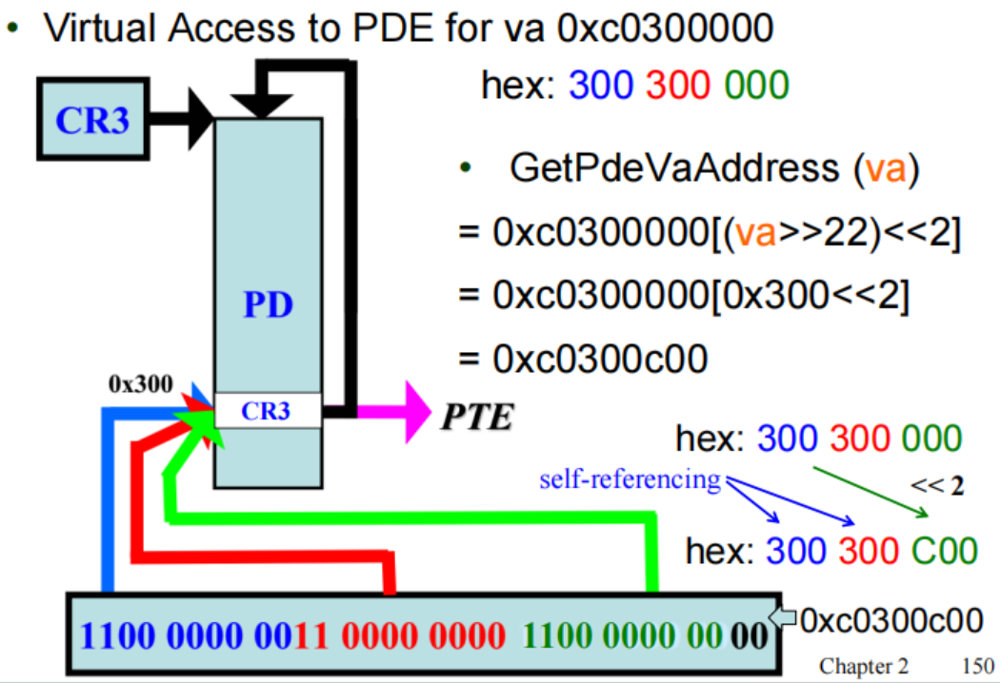{width=75%}
    </figure>

    具体的过程是一样的，只不过在第二步时我们没有跳转到任何一个页表的物理地址，而是跳转到了页目录本身的物理地址

### Combine Segmentation and Paging

- 分段
    - 将程序划分为若干个分工明确的段（segment），每个段都有自己的基址和界限
    - 对用户可见
    - 粒度较粗
- 分页
    - 将内存划分为固定大小的页（page）
    - 对用户不可见
    - 粒度较细

我们可以把分段和分页相结合，利用分段机制来管理程序的逻辑结构，同时利用分页机制来管理内存的物理布局。

- 分段负责将程序划分为不同的段，每个段都有自己的基址和界限，从而实现对程序逻辑结构的管理
- 分页负责将内存划分为固定大小的页，从而实现对内存物理布局的管理
- 在用户看来，程序被分为若干个连续的逻辑段；而在实际的物理布局上上，各个段由分页机制存放在不连续的物理页中
    - 这样也可以实现连续的逻辑地址空间（虚拟地址空间）映射到不连续的物理内存空间

!!! quote "OS 课上介绍的分段分页结合模型"
    <figure markdown="span">
        {width=75%}
    </figure>

    - 访问一个段之后可以得到对应页表的基地址
    - 从页表的条目中可以取得物理页的基地址
    - 加上页内偏移得到最终的物理地址
    