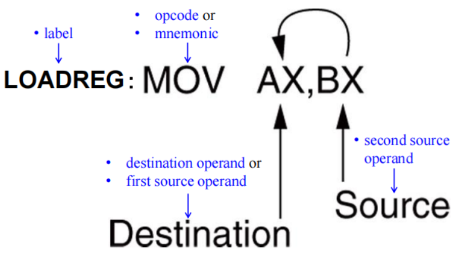
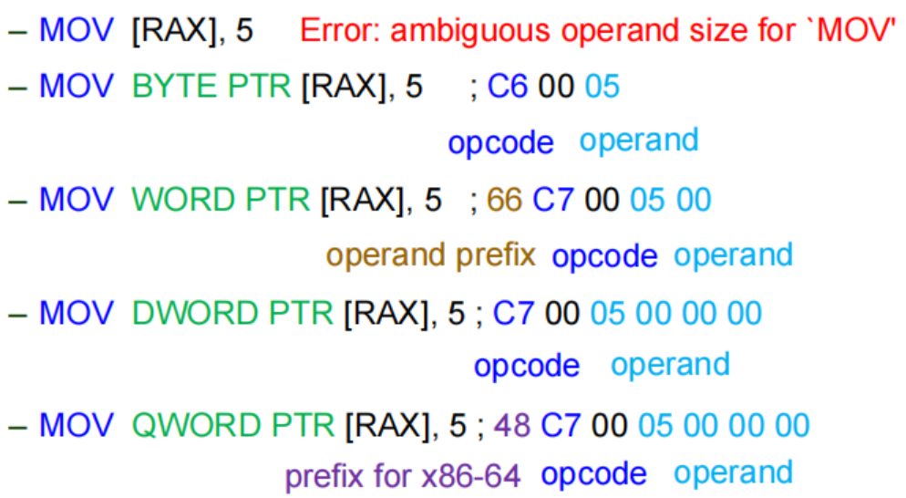
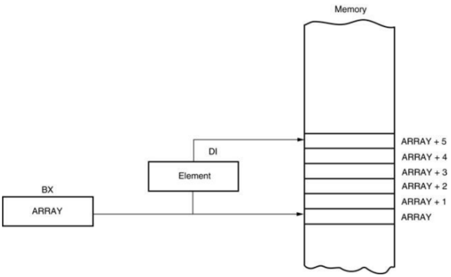
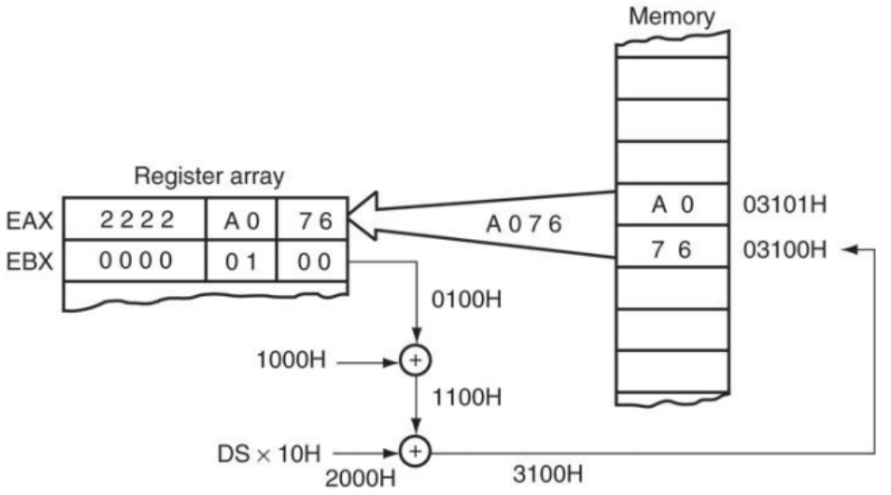
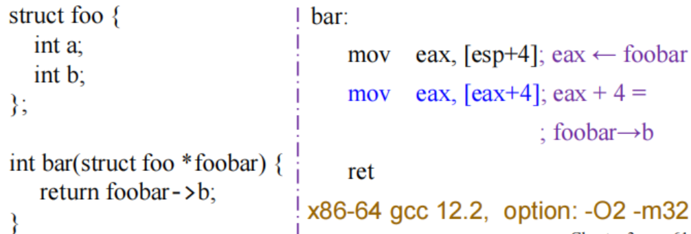
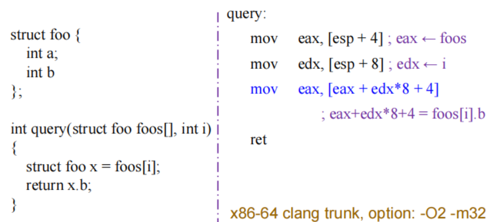
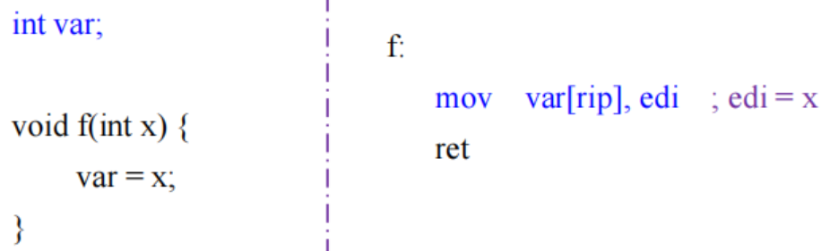
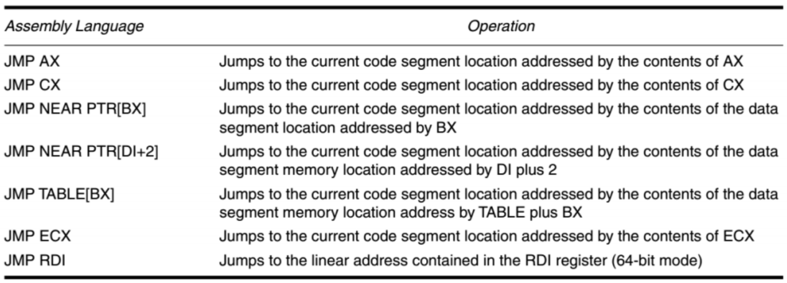
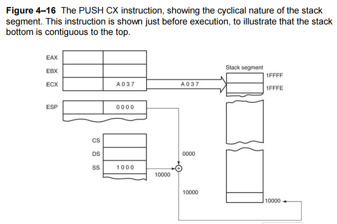
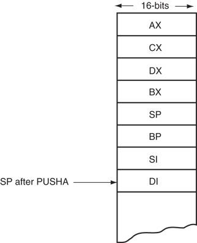

# Addressing Modes

!!! info "考纲重点"
    - 各种寻址方式
    - 实模式/保护模式/64 位内存寻址
    - 四种内存地址类型及其转换关系
    - 数据在内存中的存放规律：小端字节序

!!! note "Address Size and Operand Size and Operation Mode"
    **Address size**：

    - 地址大小决定了 CPU 能够寻址的内存空间的大小，例如 32 位的地址总线可以寻址 $2^32 = 4GB$ 的内存空间。

    **Operand size**：

    - 操作数大小决定了 CPU 每次能够处理的数据量，例如 32 位的操作数可以处理 4 字节的数据。

    **Operation mode**：三种操作模式以及它们默认的地址大小和操作数大小入如下

    - 16 位模式（real、vm86、protected）
        - 默认地址大小：16 位
        - 默认操作数大小：16 位
    - 32 位模式（protected）
        - 默认地址大小：32 位
        - 默认操作数大小：32 位
    - 64 位模式（long）
        - 默认地址大小：64 位
        - 默认操作数大小：32 位

    考虑 64 位模式下的指令 `MOV EAX, [RBX]`

    - 这里的地址大小是 64 位，因为 RBX 是一个 64 位寄存器，表示一个 64 位的内存地址。
    - 操作数大小是 32 位，因为 EAX 是一个 32 位寄存器，表示从内存中读取一个 32 

!!! definition "寻址方式"
    寻址方式指的是寻找操作数地址的方法。不同的寻址方式决定了 CPU 如何计算出操作数在内存中的实际地址。

    - **数据寻址方式（Data-Addressing Modes）**

        这种方式与数据转移操作相关，数据要么从内存转移到寄存器，要么在寄存器之间转移，例如：`MOV AX, DX`。

    - **指令寻址方式（Stack Memory-Addressing Modes）**

        这种方式涉及堆栈寄存器操作，例如：`PUSH AX` 和 `POP BX`。

    - **程序寻址方式（Program Memory-Addressing Modes）**

        这类寻址方式用于分支类指令，如 `JMP` 或 `CALL` 等。

## Data Addressing Modes

<figure markdown="span">
    {width=55%}
</figure>

`MOV` 指令是最常用也最灵活的指令，我们可以通过这条指令来分析数据的寻址方式（如上图所示）

- 源操作数位于右侧，目的操作数位于左侧，两者使用 `,` 分隔
- `MOV` 是操作码（opcode），opcode 用于告知处理器进行何种操作

在汇编语言程序中，每一条语句一般由四个部分（或称字段）组成（依然如上图所示）：

1. 最左边的字段称为**标签（label）**
    - 标签用于为该语句或内存地址提供一个符号名称
    - 所有标签必须以字母开头，或以下几个特殊字符之一开头：`@`, `$`, `?`, `_`
        - 例如 `begin`，`_start`，`$loop` 等
        - 标签长度可从 1 到 35 个字符不等
    - 标签用于表示用于存储数据或其他用途的某个内存地址

2. 第二个字段是**操作码（opcode）**
    - 操作码指定要执行的操作类型
    - 例如 `MOV` 指令用于数据传输，`ADD` 指令用于加法运算

3. 第三个字段是**操作数（operands）**
    - 操作数是操作码所使用的数据
    - 可以有一个或多个甚至没有操作数，各个操作数之间用逗号分隔

4. 最右边的字段是**注释（comments）**
    - 注释用于解释代码的功能，便于阅读和维护
    - 注释以分号 `;` 开头，分号后面的内容直到行尾都被视为注释

有三种基本的操作数类型：**立即数（immediate）**、**寄存器（register）**和**内存地址（memory address）**

- 立即数操作数：
    - 立即数是直接包含在指令中的常量值，例如 `MOV AX, 5` 中的 `5` 就是一个立即数
    - 立即数操作数只能作为源操作数，不能作为目的操作数（因为你不可能对一个常量进行修改）
- 寄存器操作数：
    - 位于通用寄存器或 SIMD 寄存器中的数据
- 内存操作数
    - 位于某个内存地址的内存单元中的数据
    - 内存地址可以通过多种方式来指定，这就是寻址方式的核心内容

!!! info "数据寻址方式"
    下面这张图展示的是以 `MOV` 指令为例的各种数据寻址方式：

    <figure markdown="span">
        {width=85%}
    </figure>  

    - 比例变址寻址方式（scaled indexed addressing mode）是基址变址寻址方式的一种扩展，仅存在于 80386 到 Core2 系列的微处理器中。
    - RIP 相对寻址方式围在图中列出，它只在 Pentium 4 及 Core2 的 64 位模式下可用。

### Register Addressing

寄存器寻址方式是数据寻址中最常用的方式，只需知道寄存器名称即可使用

- 8 位寄存器：`AH`, `AL`, `BH`, `BL`, `CH`, `CL`, `DH`, `DL`
- 16 位寄存器：`AX`, `BX`, `CX`, `DX`, `SP`, `BP`, `SI`, `DI`
- 80386 及以上的 32 位寄存器：`EAX`, `EBX`, `ECX`, `EDX`, `ESP`, `EBP`, `EDI`, `ESI`
- 64 位模式下的寄存器：`RAX`, `RBX`, `RCX`, `RDX`, `RSP`, `RBP`, `RDI`, `RSI` 以及 `R8`~`R15`

!!! tip
    - 在指令中，我们需要保证源操作数和目的操作数的数据宽度一致，否则会引发错误。例如下面这条语句会引发操作数类型不匹配错误，无法编译：

        ```assembly
        MOV EAX, BX  ; 错误：EAX 是 32 位寄存器，而 BX 是 16 位寄存器
        ```

    - 除了 TEST 和 CMP 指令之外，绝大多数指令都会改变目标寄存器或目标内存单元的内容。
    - 值得再强调一次的是，`MOV BX, CX` 这条指令只影响 EBX 寄存器的低 16 位部分（即 BX 部分）的内容，高 16 位的内容保持不变

        > 详情可见 [上一章](./chap-2.md#general-purpose-registers)

### Immediate Addressing

- 立即数指的是直接被编码在指令中的常量值
- 立即数寻址方式可以操作字节（byte）、字（word）、双字（doubleword）乃至更多位数的数据

<figure markdown="span">
    {width=75%}
</figure>

- 在某些汇编器中，立即数之前需要使用 `#` 作为前缀，例如 `MOV AX, #3456H`
- 但在大多数汇编器中（例如 MASM 和 NASM），不需要使用 `#` 前缀，直接写数字即可，比如 `MOV AX, 3456H` 

立即数可以写为十进制、十六进制或二进制数，也可以写成 ASCII 码的字符常量形式：

- 十六进制立即数要以 `H` 结尾，例如 `0AH`, `1F4H`
    - 注意：在 MASM 汇编器中，十六进制数如果以字母开头（A~F），则必须在前面加上 `0`，例如 `0AH` 而不是 `AH`，否则会被误认为是标签名
- 二进制立即数要以 `B` 结尾，例如 `1010B`, `11111111B`
- 十进制立即数直接写数字即可，例如 `10`, `255`
- 字符常量要用单引号 `'` 括起来，例如 `'A'`, `'Z'`
    - 这些字符会被转换为对应的 ASCII 码值，例如 `'A'` 对应的 ASCII 码是 `65`（十进制）或 `41H`（十六进制）

!!! info "立即数寻址方式示例"
    下面是一些使用立即数寻址方式的示例：

    <figure markdown="span">
        {width=80%}
    </figure>

!!! warning "ASCII 字符的存储"
    由于我们学习的是 Intel 架构的处理器以及汇编，使用的是小端序排列方式

    - 因此当我们存储数据 `1234H` 时，会把 `34H` 存储在低地址处，`12H` 存储在高地址处。

    而对于 ASCII 字符串 `'AB'`，需要把它“逆序”存储，也就是说从左到右先读取到哪个字符，就把它存储在低地址处，比如

    - 低地址 `1000H` 处存储字符 `'A'`（41H）
    - 高地址 `1001H` 处存储字符 `'B'`（42H）

### Memory Addressing

当操作数存储在内存中时，就需要根据指令提供的存储在寄存器/立即数中的四个参数来决定如何计算有效内存地址。

1. 基址寄存器（Base Register）
2. 变址寄存器（Index Register）
3. 比例因子（Scale Factor）
    - 部分平台支持比例因子，允许将变址寄存器的值乘以 1、2、4 或 8，以便访问数组元素
4. 偏移量（Displacement）
    - 偏移量通常是指令中的立即数，可以是正数或负数，用于调整计算出的地址

> 有效地址（Effective Address, EA）是指相对于段基址的偏移地址。

有效地址的计算可以概括成如下的一个公式：

- Effective Address = Base + (Index × Scale) + Displacement

上述四种参数的灵活结合可以构成如下的多种选址方式：

- 直接寻址（Direct Data Addressing），[Disp]
    - 例如 `MOV AX, [1234H]`，直接使用指令内部的偏移量 `1234H` 作为有效地址
- 寄存器间接寻址（Register Indirect Addressing），[Base]
    - 例如 `MOV AX, [BX]`，使用基址寄存器 `BX` 的值作为有效地址
- 基址+变址寻址（Base-plus-Index Addressing），[Base + Index]
    - 例如 `MOV AX, [BX + SI]`
- 寄存器相对寻址（Register Relative Addressing），[Base/Index + Disp]
    - 例如 `MOV AX, [BP + 10H]` 或 `MOV AX, [SI + 8]`
- 基址相对+变址寻址（Base Relative-plus-Index），[Base + Index + Disp]
    - 例如 `MOV AX, [BX + SI + 20H]`
- 比例变址寻址（Scaled-Index Addressing），[Base + (Index × Scale) + Disp]
    - 例如 `MOV AX, [EBX + ESI*4 + 30H]`

#### Direct Data Addressing

<center>
    <span style="color:blue; font-size:1.3em;">
    Effective Address = Base + (Scale × Index) + 
    <span style="color:red; font-weight:bold;">Disp</span>
    </span>
</center>

> 只使用 Disp，不使用 Base 和 Index

直接数据寻址是最简单的一种寻址方式，把指令中给出的偏移量（Displacement）作为有效地址，加到段基址上即可访问内存单元

有两种基本形式：

1. **直接寻址（Direct Addressing）**
    - 适用于 `MOV` 指令在内存和 A 类寄存器（AL、AX、EAX、RAX）之间传送数据，指令长度只有 3 字节
    - 例如 `MOV AX, [1234H]`
2. **带偏移寻址（Displacement Addressing）**
    - 除了上一种情况的所有直接数据寻址方式都属于带偏移寻址，指令长度为 4 字节

!!! tip
    这么分类的原因是处理器单独对 A 类寄存器的 `MOV` 指令进行了优化，使其指令长度更短，执行速度更快。

!!! example 
    <figure markdown="span">
        {width=75%}
    </figure>

    - 段基址左移 4 位之后与偏移量相加，得到物理地址 `11234H`
    - 然后把地址为 `11234H` 处的内存单元内容 `8AH` 读入到寄存器 AL 中

!!! info "直接寻址指令示例"
    <figure markdown="span">
        {width=75%}
    </figure>

带偏移寻址的主要区别在于它的指令长度为 4 字节，相较于直接寻址的 3 字节，指令密度更低一些。

- 直接寻址：`MOV AL, [1234H] ; A0 34 12`
- 带偏移寻址：`MOV BX, [1234H] ; 8A 1E 34 12`

!!! question 
    判断以下指令是直接寻址还是带偏移寻址：

    - `MOV EAX, [3000H] ; a1 00 30 00 00`

        直接寻址

    - `MOV EBX, [3000H] ; 8b 1d 00 30 00 00`

        带偏移寻址，因为不是 A 类寄存器
    
    - `ADD EAX, [3000H] ; 03 05 00 30 00 00` 
    
        带偏移寻址，因为不是 MOV 指令

    - `ADD EBX, [3000H] ; 03 1d 00 30 00 00` 
    
        带偏移寻址，因为既不是 A 类寄存器，也不是 MOV 指令

!!! info "Why Direct Addressing"

    - 兼容性与编码效率

        - 直接寻址（Direct Addressing）起源于8086/8088处理器。在早期，代码字节数（代码密度）和指令执行速度至关重要
        - `MOV AL/AX/EAX, [address]` 可以说是最为常见的操作，因此Intel 专门为这种操作设计了更短更高效的指令编码

    - 累加器（Accumulator）的特殊地位

        - 累加器寄存器（AL/AX/EAX/RAX）在许多计算和数据传输操作中扮演着核心角色，许多指令把累加器作为默认的隐式操作数，也对其做了优化，例如：
            - `MUL`, `DIV`：无符号乘法和除法
            - `IMUL`, `IDIV`：有符号乘法和除法
            - `IN`, `OUT`：I/O 端口数据传输
            - `LODS`, `STOS`：字符串操作

    因此在最重要的寄存器并且最常用的操作上提供一个“快速通道”是很合理的。

#### Register Indirect Addressing

<center>
    <span style="color:blue; font-size:1.3em;">
    Effective Address = 
    <span style="color:red; font-weight:bold;">Base</span>
     + (Scale × Index) + Disp
    </span>
</center>

> 仅使用 Base，不使用 Index 和 Disp

对于寄存器间接寻址：

- 在 8086 到 80286 处理器中，间接寻址只允许使用 BX、BP、SI 和 DI 这四个寄存器，例如 `MOV AX, [BX]`
- 在 80386 及以上的处理器中，还可以使用任意的拓展寄存器进行间接寻址，例如 `MOV AX, [EDX]`

!!! example "MOV AX, [BX]"
    <figure markdown="span">
        {width=75%}
    </figure>

!!! info "寄存器间接寻址示例"
    <figure markdown="span">
        {width=75%}
    </figure>

    需要注意的是，除了字符串操作之外，所有的内存与内存之间的数据传送都是不允许的，例如上图中的 `MOV [DI] [BX]` 是不合法的。

一般来说，在寄存器间接寻址或任何使用 BX、DI 或 SI 来进行内存寻址的指令中，都会使用数据段（DS）作为默认的段寄存器

- 如果使用 BP 寄存器来进行内存寻址，则会使用堆栈段（SS）作为默认的段寄存器
    - 当然，我们也可以通过显式地指定段寄存器来覆盖默认的段寄存器，例如 `MOV AX, SS:[BX]` 或 `MOV AX, DS:[BP]`
- 对于 80386 及以上处理器
    - EBP 寄存器默认在堆栈段中进行寻址
    - EAX、EBX、ECX、EDX、EDI 和 ESI 寄存器默认在数据段中进行寻址

在不同的操作模式下，寄存器间接寻址还需要有不同的处理：

- 在实模式（real mode）下，使用 32 位寄存器间接寻址时，寄存器内容不能超过 1MB 的地址范围，即不能超过 `0000FFFFH`。
- 在保护模式（protected mode）下，32 位寄存器用于间接寻址时可使用任意值。
    - 需要保证访问不会超出段界限（segment limit），这由访问权限字节来控制
- 在 64 位模式下，段寄存器不再参与地址计算，寄存器中存放的就是实际的线性内存地址。

##### Size Directives

通常，我们能从内存访问指令本身能推断出数据的大小，例如

- `MOV [DI], AL` 是一个字节操作，因为 AL 是一个 8 位寄存器
- `MOV [DI], 10H` 就无法推断出数据大小，因为立即数 `10H` 本身无法确定大小

在某些间接寻址的情况中，我们需要显式地使用大小指示符（size directives，有时也称 pointer directive）来告诉汇编器数据的大小。

- 大小指示符包括 `BYTE PTR`、`WORD PTR`、`DWORD PTR` 或 `QWORD PTR`，它们能指明被内存指针寻址的内存数据大小
- 例如 `MOV BYTE PTR [DI], 10H` 明确表示将一个字节的数据 `10H` 存储到内存地址 `[DI]` 处
- 而 `MOV DWORD PTR [DI], 10H` 则表示将一个字（16 位）的数据 `0010H` 存储到内存地址 `[DI]` 处

这些大小指示符仅在无法从指令本身推断出立即数的数据大小时才需要使用。

对于 SIMD 指令，还可以使用 `OWORD PTR` 等更大数据类型的大小指示符。

??? info "大小指示符会影响指令的编码"
    如下图所示，在 64 位模式下，使用不同大小指示符的指令会生成不同的机器码，具体的机器码长度和前缀也会有所不同：

    <figure markdown="span">
        {width=75%}
    </figure>

#### Base-plus-Index Addressing

<center>
    <span style="color:blue; font-size:1.3em;">
    Effective Address = 
    <span style="color:red; font-weight:bold;">Base</span>
     + (Scale × 
    <span style="color:red; font-weight:bold;">Index</span>
    ) + Disp
    </span>
</center>

> 同时使用 Base 和 Index，即 Base + Index

通常而言，**基址寄存器**保存着一个数据结构（如数组或记录）的起始地址，**变址寄存器**保存着某个元素在数据结构中的偏移位置

- 在 8086 到 80286 处理器中，这种寻址方式使用一个基址寄存器（BX 或 BP）和一个变址寄存器（SI 或 DI），例如 `MOV DX, [BX+DI]`
- 在 80386 及以上的处理器中，允许任意两个 32 位寄存器组合（**但 ESP 不能作为 index 寄存器**），例如 `MOV DL, [EAX+EBX]`

!!! example "MOV DX, [BX+DI]"
    <figure markdown="span">
        {width=75%}
    </figure>

    - 在 Intel 汇编器中，我们需要把 `[BX+DI]` 写成 `[BX][DI]` 的形式

!!! info "基址+变址寻址示例"
    <figure markdown="span">
        {width=75%}
    </figure>

!!! info 
    基址+变址寻址方式常用于访问数组等数据结构中的元素：

    - 我们可以把数组的起始地址加载到 BX 寄存器（基址寄存器）中，把将要访问的元素索引（偏移量）加载到 SI 寄存器（变址寄存器）中
    - 然后我们可以通过 `MOV AX, [BX + SI]` 指令来访问数组中的元素

    <figure markdown="span">
        {width=75%}
    </figure>

!!! example "访问数组中的某个元素"
    基址+变址寻址方式非常适合访问一维数组中的元素，例如下图中的这个例子。

    <figure markdown="span">
        {width=75%}
    </figure>

    - 因为我们这里是 32 位架构的机器，可以用任意的两个 32 位寄存器来作为基址寄存器和变址寄存器
    - 我们把 buf 的基地址加载到 eax 寄存器中，把元素索引（偏移量）加载到 edx 寄存器中
    - 接着可以通过 `movsx eax, BYTE PTR [eax + edx]` 指令来访问 buf 数组中的某个元素
        - 因为数组元素是 char 类型，占用 1 个字节，而目的寄存器 eax 是 32 位的，所以需要使用 `movsx` 指令来进行符号扩展

#### Register Relative Addressing

<center>
    <span style="color:blue; font-size:1.3em;">Effective Address = 
    <span style="color:red; font-weight:bold;">Base</span>
     + (Scale × 
    <span style="color:red; font-weight:bold;">Index</span>
    ) + 
    <span style="color:red; font-weight:bold;">Disp</span>
    </span>
</center>

> Base 和 Index 二选一，即 Base/Index + Disp

- 在 8086 到 80286 处理器中，寄存器相对寻址指的是把一个偏移量（Displacement，即立即数）加到基址寄存器（BX 或 BP）或变址寄存器（SI 或 DI）上，从而得到有效地址。例如 `MOV AX, [BP+10H]`
- 在 80386 及以上处理器中，偏移量可以是 32 位的，而地址寄存器可以是除了 ESP 以外的任意 32 位通用寄存器，例如 `MOV DL, [EAX+10H]`

这种寻址方式和“寄存器间接寻址”类似，只不过多了一个偏移量，用于调整计算出的有效地址。

!!! example "MOV AX, [BX+1000H]"
    <figure markdown="span">
        {width=75%}
    </figure>

!!! info "寄存器相对寻址示例"
    <figure markdown="span">
        {width=80%}
    </figure>

    - 图中的示例中包括有 `ARRAY[SI]` 和 `LIST[SI+2]` 两种寻址方式，它们实际上分别相当于 `[ARRAY + SI]` 和 `[LIST + SI + 2]`
    - 其中 `ARRAY` 和 `LIST` 是两个数据段中的标签，分别表示数组和列表的起始地址，可以用它们来计算有效地址

!!! example
    编译器会使用寄存器相对寻址方式来访问结构体时

    - 基址寄存器通常会保存结构体变量的起始地址
    - 偏移量则表示结构体成员在结构体中的位置（相对于结构体起始地址的偏移量）

    <figure markdown="span">
        {width=75%}
    </figure>

#### Base Relative-plus-Index Addressing

<center>
    <span style="color:blue; font-size:1.3em;">Effective Address = 
    <span style="color:red; font-weight:bold;">Base</span>
     + (Scale × 
    <span style="color:red; font-weight:bold;">Index</span>
    ) + 
    <span style="color:red; font-weight:bold;">Disp</span>
    </span>
</center>

> 同时使用 Base、Index 和 Disp，即 Base + Index + Disp

- 这种寻址方式与基址+变址寻址方式类似，只不过多了一个偏移量（Displacement），用于调整计算出的有效地址
    - 同时使用 Base、Index 和 Disp 三个参数来计算有效地址
    - 常用于访问二维数组等内存数据结构

!!! example "MOV AX, [BX+SI+100H]"
    <figure markdown="span">
        {width=75%}
    </figure>

    - 由于寻址方式比较复杂，因此在编程中很少使用

!!! example
    <figure markdown="span">
        {width=75%}
    </figure>

    - 编译器通常会在访问结构体数组中某个元素的成员时使用这种寻址方式

#### Scaled-Index Addressing

<center>
    <span style="color:blue; font-size:1.3em;">Effective Address = 
    <span style="color:red; font-weight:bold;">Base</span>
     + (
    <span style="color:red; font-weight:bold;">Scale</span>
     × 
    <span style="color:red; font-weight:bold;">Index</span>
    ) +
    <span style="color:red; font-weight:bold;">Disp</span>
    </span>
</center>

> 同时使用 Base、Scale、Index 和 Disp，即 Base + (Index × Scale) + Disp

80386 到 Core2 微处理器中独有的寻址方式

- 使用两个 32 位 寄存器分别作为基址寄存器和变址寄存器来访问内存
- 第二个寄存器（index）会乘以一个缩放因子（scale factor），该因子可以是 1x、2x、4x 或 8x
- 缩放因子为 1x 时可省略不写，例如 `MOV AL, [EBX+ECX]`
- 偏移量（displacement）是一个可选的立即数，当没有偏移量时也可以省略不写，例如 `MOV AL, [EBX+ECX*4]`

!!! info "比例变址寻址示例"
    <figure markdown="span">
        {width=75%}
    </figure>

!!! example
    编译器会使用比例变址寻址方式来访问结构体数组

    <figure markdown="span">
        {width=75%}
    </figure>

    - 在上面的例子中，编译器使用 edx 来保存变量索引 `i` 的值，eax 来保存结构体数组 `foo` 的基地址
    - 我们需要把 edx 乘以结构体的大小（8 字节）作为变址寄存器，然后加上基址寄存器 eax 和偏移量（成员在结构体中的位置）来计算有效地址
    - 例如我们要访问 `foos[i].b`，则需要把 edx 乘以 8（结构体大小），再加上 4（成员 b 在结构体中的偏移量）来计算有效地址，最后得到的汇编指令就是 `mov eax, [eax + edx*8 + 4]`

#### RIP Relative Addressing

传统的 x86 指令集仅在控制转移指令中支持 IP 相对寻址（RIP），

- 64 位模式支持相对于 64 位指令指针（RIP）的数据寻址，以此在 flat 内存模型下定位线性地址。
- RIP 相对寻址的写法和寄存器相对寻址类似，采用 [Base+Disp] 的语法，不过 Base 是 RIP，而不是通用寄存器。
- RIP 相对寻址的偏移量（Displacement）是一个有符号的 32 位立即数，将其符号拓展后加到 64 位的 RIP 上，得到下一条指令的有效地址

!!! example
    <figure markdown="span">
        {width=75%}
    </figure>

    - 其中 `var[rip]` 表示变量 `var` 相对于当前指令地址（RIP）的偏移量

### Canonical Addressing and Canonical Form

- 在 x86-64 系统中，线性地址（虚拟地址）在逻辑上是 64 位长。
- 但在设计 x86-64 架构时 AMD 认为完整的 64 位地址空间并不必要且开销很大，因此只使用了低 48 位（4 级分页）或 57 位（5 级分页）来表示有效的线性地址。有效地址需要通过符号扩展（sign extension）来转换为完整的 64 位地址，例如：
    - 48 位: `7C00 1810 2000` → 64 位: `0000 7C00 1810 2000`
    - 48 位: `8010 BC00 1000` → 64 位: `FFFF 8010 BC00 1000`

在 64 位模式下，如果一个地址的第 63 位到最高有效位全为 0 或全为 1，则认为该地址为**规范地址（canonical form）**。

具体来说，对于 48 位的线性地址，如果最高有效位（第 47 位）为 0，则第 48 位到第 63 位必须全部为 0；如果最高有效位为 1，则第 48 位到第 63 位必须全部为 1。

- 规范地址: `FFFF 8010 BC00 1000`， `0000 7C80 B810 2040`
- 非规范地址: `1122 3344 5566 7788`， `3375 DA44 B566 7788`

如果内存地址不是规范形式，那么就会产生通用保护异常（general-protection exception，#GP），例如 `MOV RAX, [1122334455667788H]` 会引发 #GP 异常。

- 通过检查地址是否属于规范形式，可以防止软件利用内存指针的高位（未使用部分）用作其他用途
- 遵循规范形式能保证未来在支持更大的虚拟地址空间时，现有的软件仍然能够正常工作（向前兼容性）

!!! summary
    <figure markdown="span">
        {width=75%}
    </figure>

    8086-80286：

    - Base: BX/BP
    - Index: SI/DI
    - Disp: 8位或16位

    80386 及以上：

    - Base：任意32位寄存器
    - Index：任意32位寄存器（除了ESP不能做变址寄存器）
    - Disp：8位/16位/32位

    仅当 index 存在时，才可以使用 scale，scale 可以是 1x/2x/4x/8x

    当使用 BP/EBP 或 ESP 时，默认段寄存器为 SS，否则为 DS。ESP 不能作为 index 寄存器使用。

??? example "两道例题"
    <figure markdown="span">
        {width=65%}
    </figure>

    <figure markdown="span">
        {width=65%}
    </figure>

## Program Memory Addressing Modes

程序中使用 JMP（跳转）和 CALL（调用）等指令来改变程序的执行流程，这些指令需要使用程序寻址方式来确定跳转或调用的目标地址。

- 目标操作数可以是一个标签（label）、一个内存地址，或者是一个相对于当前指令指针（IP 或 RIP）的偏移量，它指定了要跳转到的指令地址
- 跳转偏移量有两种形式
    - **相对偏移量（relative offset）**：依赖于当前的 IP/EIP，表示相对于当前指令地址的偏移量

        在汇编代码中通常以标签的形式指定（例如 `JMP start`），但它会被汇编器转换为相对于当前指令地址的有符号偏移量

        Target address offset = Current IP/EIP + Relative offset

    - **绝对偏移量（absolute offset）**：指的是对于代码段基址的一个固定偏移量

        例如 `JMP 1234H`，表示跳转到代码段基址加上偏移量 `1234H` 处的指令

        Target address offset = Value specified in the encoding

    <figure markdown="span">
        {width=65%}
    </figure>

- 跳转类型有四种：
    1. **短跳转（short jump）**：使用 8 位有符号偏移量，范围为 -128 到 +127 字节，适用于跳转距离较近的情况
    2. **近跳转（near jump）**：在当前代码段（由 CS 寄存器指定）内跳转，又称为段内跳转（intra-segment jump）
    3. **远跳转（far jump）**：跳转到与当前代码段不同，但特权级相同的另一个段，又称为段间跳转（inter-segment jump）
    4. **任务切换（task switch）**：仅在保护模式下使用，跳转到另一个任务的指令（程序控制权转移）

!!! note
    - relative 指的是相对于指令指针 IP
    - JMP 指令本身的长度为 1 字节，但其后可以跟着 1 字节或 2 字节的偏移量，这个偏移量会直接加到 IP 上，形成新的指令地址
    - 1 字节的偏移量用于短跳转，2 字节的偏移量用于近跳转和调用指令（call，函数调用）。这两种跳转都属于段内跳转

    <figure markdown="span">
        {width=65%}
    </figure>

### Direct Program Memory Addressing

使用直接程序内存寻址的指令会在 哦拼凑的中存储一个绝对远地址，例如 `JMP 1234H:5678H`，表示跳转到段地址 `1234H` 和偏移量 `5678H` 处的指令

- 这类指令通常被称为“远跳转指令（far jump instructions）”，因为它们可以跳转到任意内存地址并执行该地址处的指令
    - 在实模式下，可用内存共有 1MB，因此可以跳转到内存的前 1MB 范围内的任意地址
    - 在保护模式下（80386 到 Core2系列处理器），可以跳转到 4GB 地址空间内的任意位置

!!! example 
    <figure markdown="span">
        {width=75%}
    </figure>

    - 下面这三条指令的作用是修改 CR0 控制寄存器的最低位（PE 位），从而切换到保护模式

        ```assembly
        mov eax, cr0
        or eax, 0x1
        mov cr0, eax
        ```

    - `jmp CODE_SEG:init_pm` 指令使用了直接程序内存寻址方式，表示跳转到代码段 `CODE_SEG` 中的 `init_pm` 标签处执行

- 使用直接程序寻址的指令是段间跳转指令（inter-segment jump），也称远调用指令（far call）
- 在实际编程时，通常会使用内存地址的标签来表明跳转目标，而非直接使用具体的数值名称
- 我们可以用 `FAR PTR` 指示符来明确指定跳转目标是一个远地址，例如 `JMP FAR PTR START`

### Indirect Program Memory Addressing

微处理器允许多种间接程序运至的形式：

- 在 8086 到 80286 处理器中，间接程序寻址可以使用 16 位寄存器（AX、BX、CX、DX、SP、BP、DI 或 SI），或者任意的相对寄存器（[BP]、[BX]、[DI]、[SI]）加上一个偏移量

    例如 `JMP NEAR PTR [DI+2]`

- 在 80386 及以上的处理器中，可以使用扩展寄存器存储要跳转或调用的地址，或相对于 JMP/CALL 指令的相对地址

    例如 `JMP EAX`

- 如果一个相对寄存器中存储了跳转地址，就称其为间接跳转（indirect jump）
- 例如 `JMP NEAR PTR [BX]` 指令表示，先从 BX 所包含的地址对应的内存中取出一个偏移量，然后根据这个偏移量跳转到相应的指令地址
    - 这个偏移地址是一个 16 位的值（因为我们使用 NEAR PTR 制定了读取出的数据长度是 16 位），它是段内跳转（intra-segment jump）的偏移地址
    - 这种跳转有时也称为间接-间接跳转（indirect-indirect jump），或双重间接跳转（double indirect jump），因为它需要先从内存中读取一个地址，然后再跳转到该地址处执行指令

!!! info "间接程序寻址示例"
    <figure markdown="span">
        {width=75%}
    </figure>

    - 图中的 `JMP TABLE[BX]` 指令使用了双重间接程序寻址方式，表示先从内存地址 `TABLE + BX` 处读取一个偏移量，然后跳转到该偏移量处执行指令

## Stack Memory Addressing Modes

PUSH/POP 指令是在堆栈内存中存入和取回数据的基本指令

PUSH 和 POP 有六种形式：

1. **regester（寄存器）**：可将任意 16 位寄存器的内容压入或弹出堆栈
2. **memory（内存）**：可将 16 位或 32 位内存地址的内容存储到堆栈中，或从堆栈中取出数据存储到内存地址中
3. **immediate（立即数）**：可将常数值直接 PUSH 堆栈中
4. **segment register（段寄存器）**：可将段寄存器的内容压入或弹出堆栈
    - 注意：CS 段寄存器只能通过 PUSH 保存，不能通过 POP 恢复
5. **flags register（标志寄存器）**：可使用 PUSHF 和 POPF 指令将所有标志位压入或弹出堆栈
6. **all registers（所有寄存器）**：可使用 PUSHA 和 POPA 指令将所有通用寄存器压入或弹出堆栈

使用 PUSH 指令时，数据会被压入栈顶，栈指针寄存器（SP 或 ESP）会相应地减少；使用 POP 指令时，数据会从栈顶弹出，栈指针寄存器会相应地增加。

- 维护栈空间主要依赖于两个寄存器：
    - 栈指针寄存器（SP 或 ESP）：指向当前栈顶的位置
    - 栈段寄存器（SS）：指向当前栈所在的段
- 当一个 word（16 位）的数据被 PUSH 到堆栈时：
    - 高 8 位保存在 [SP-1] 处
    - 低 8 位保存在 [SP-2] 处
    - SP 寄存器的值自动减少 2，为下一个 word 的位置腾出空间
- 从堆栈中弹出数据时：
    - 先从 [SP] 处读取低 8 位
    - 再从 [SP+1] 处读取高 8 位
    - SP 寄存器的值自动增加 2，指向下一个可用的位置
- SP（或 ESP）始终指向栈顶的位置（最新压入的数据所在的位置）
- 栈是从高地址向低地址生长的，因此 PUSH 操作会使 SP 减少，POP 操作会使 SP 增加

!!! example "PUSH 和 POP 指令功能示例"
    <figure markdown="span">
        {width=75%}
    </figure>

    - 执行 `PUSH BX` 指令后，BX 的内容 `1234H` 被压入堆栈，SP 指向被压入数据的低 8 位
    - 执行 `POP CX` 指令后，堆栈顶的数据 `1234H` 被弹出并存储到 CX 中，回到执行 `PUSH BX` 之前的状态

### Initializing the Stack

在汇编语言中，我们可以用以下的方式对堆栈进行初始化：

```assembly
STACK_SEG SEGMENT STACK
    DW 100H DUP(?)
STACK_SEG ENDS
```

- 第一条语句标识堆栈段的开始，最后一条语句标记堆栈段的结束
- 汇编器和链接器会自动把正确的堆栈段（stack segment）地址加载到 SS 寄存器，并把堆栈段的长度（相当于堆栈段顶部的地址）加载到 SP 寄存器中
- 如果未指定堆栈段，在链接程序时会出现警告
- 堆栈的内存区位于程序前缀（program segment prefix，PSP）当中，PSP 会被附加到每个程序文件的起始位置
    - 如果为堆栈分配了过多的数据，可能会覆盖掉 PSP 里的信息，从而导致程序崩溃
- 在初始化堆栈区域时，需要同时加载堆栈段寄存器（SS）和堆栈指针寄存器（SP）

!!! note "段的循环特性"
    所有的段都具有循环特性，即段的顶端与底端位置连续相连

    - 如下图所示，当 SP 指向栈的最低地址时，如果此时再执行一次 PUSH 操作，数据会被保存在栈的最高地址处

    <figure markdown="span">
        {width=75%}
    </figure>

### Push

PUSH 指令的作用是将数据压入栈中：

- 在 8086 到 80286 处理器中，每次 PUSH 传送 2 字节，不能只传送 1 字节。
- 在 80386 及更高版本的处理器中，可以传送 2、4 或 8 字节。

**PUSHA（push all）指令**：

- PUSHA 指令会把内部通用寄存器（除了段寄存器）的内容全部依次压入栈中
- 入栈的顺序为：AX、CX、DX、BX、SP（原始值）、BP、SI、DI。
- 需要强调的是，被压入堆栈中的 SP 的值是执行 PUSHA 指令之前 SP 的值

**PUSHAD（push all double）指令**

- PUSHAD 在 80386 到 Pentium 4 处理器中用于压入 32 位寄存器，功能与 PUSHA 类似
- PUSHA 和 PUSHAD 共享同一个操作码（0x60）：
    - 操作数大小为 16 位时执行 PUSHA，操作数大小为 32 位时执行 PUSHAD
    - 早期的 8086/8088 处理器不支持该指令
    - 64 位模式下的 Pentium 4 处理器也不支持该指令

**PUSHF（push flags）指令**

- PUSHF 指令用于将标志寄存器（FLAGS）的内容压入堆栈中：

!!! note "PUSHA"
    <figure markdown="span">
        {width=60%}
    </figure>

    - PUSHA 指令会将所有 16 位通用寄存器压入栈中（共 8 个寄存器，共需要 16 字节的栈空间）
    - 所有寄存器压栈后，SP 寄存器的值会自动减少 16
    - 当需要保存 80286 及以上处理器的全部寄存器时，PUSHA 很有用。
    - PUSHAD 指令会在 80386 至 Core2 处理器上将全部 32 位寄存器压入栈中（需要 32 字节的栈空间）。

### Pop

POP 指令执行的操作与 PUSH 完全相反，用于将数据从栈中弹出，并存入目标位置

- **POP**：将栈顶数据移出，存放入 16 位的目标寄存器、段寄存器或 16 位的内存地址中（不能将立即数作为 POP 的目标操作数）
- **POPA（pop all）**：将栈中的数据依次弹出，恢复到内部通用寄存器中
    - 弹出的顺序与 PUSHA 相反，为 DI、SI、BP、SP（丢弃）、BX、DX、CX、AX
    - 弹出的 SP 值会被丢弃，不会恢复到 SP 寄存器中
- **POPAD（pop all double）**：在 80386 及以上处理器中用于弹出 32 位寄存器，功能与 POPA 类似
    - POPA 和 POPAD 共享同一个操作码（0x61）：
        - 操作数大小为 16 位时执行 POPA，操作数大小为 32 位时执行 POPAD
        - 早期的 8086/8088 处理器不支持该指令
        - 64 位模式下的 Pentium 4 处理器也不支持该指令
- **POPF（pop flags）**：将栈顶的 16 位数据弹出，写入到标志寄存器（FLAGS）中
