# Data Movement Instructions

## Modes and Opcodes

!!! tip
    本节内容以 MOV 指令为例分析指令的寻址模式、操作码及前缀等内容。

### Operation Mode

有三种操作模式，其默认的地址长度和操作数长度分别如下：

- 16 位模式（real、vm86、protected）
    - 默认地址大小：16 位
    - 默认操作数大小：16 位
- 32 位模式（protected）
    - 默认地址大小：32 位
    - 默认操作数大小：32 位
- 64 位模式（long）
    - 默认地址大小：64 位
    - 默认操作数大小：32 位

> 注意：64 位模式下，操作数大小默认为 32 位，但可以通过 REX 前缀将其扩展为 64 位。

### Processor Directive in MASM

在 MASM 汇编器中，processor directive 是一种伪指令，用于指示汇编器在汇编过程中应该启用哪些指令集、处理器类型以及相应的特性。它决定了以下内容：

- 哪些 CPU 指令是有效的
- 默认的操作数和地址长度（16 位 或 32 位）
- 可用的寄存器和寻址方式
- 允许的语法

MASM 中的处理器指令包括：

- 16 位：.8086，.186，.286
- 32 位：.386，.486，.586，.686
- 浮点：.8087，.287，.387
- 特殊用途：.MMX，.XMM

!!! exmaple "MASM 处理器伪指令"
    <figure markdown="span">
        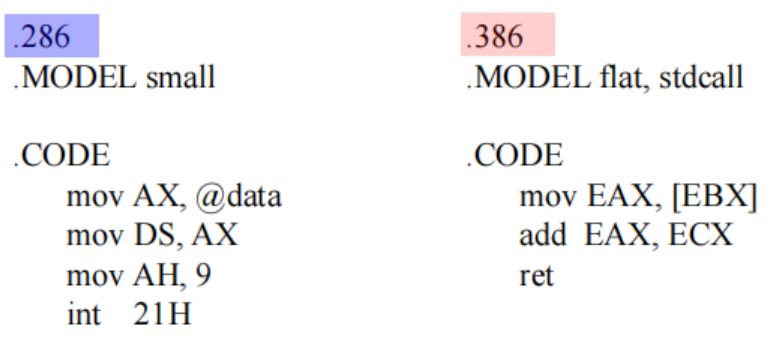{width=70%}
    </figure>

    左侧的代码中：

    - `.286` 告知汇编器使用 16 位模式，
    - `.MODEL small` 告知汇编器使用 small 的内存模型（只有一个代码段和一个数据段，每个段最大 64KB），
    - `.CODE` 标识接下来定义代码段 

    右侧的代码中：

    - `.386` 告知汇编器使用 32 位模式，
    - `.MODEL flat stdcall` 标识使用平坦内存模型和 stdcall 调用约定，

processor directive 的作用包括：

- 检查指令的有效性
    - 例如在 .286 模式下，尝试使用 32 位的寄存器会导致汇编错误。
    - [x] `MOV AX, BX` 指令合法
    - [ ] `MOV EAX, EBX` 指令不合法
- 根据默认操作数/地址大小，生成正确的指令编码
    - 例如在下图中，相同的指令在不同的汇编模式下会生成不同的机器码
    - 由于 .386 模式下默认的操作数大小为 32 位，因此 `WORD PTR [BX]` 会导致生成地址前缀 `66H` 和操作数前缀 `67H`，以指示 CPU 使用 16 位的操作数和地址

    <figure markdown="span">
        {width=70%}
    </figure>

<figure markdown="span">
    {width=80%}
</figure>

在代码段描述符中，D/B bit 和 L bit可以用来指定默认的操作模式（三个字母的含义分别是 Default/Big 和 Long）：

- L=0 and D/B = 0 表示 16 位指令模式
- L=0 and D/B = 1 表示 32 位指令模式
- L=1 表示 64 位指令模式

!!! info "地址大小前缀与操作数大小前缀"
    <figure markdown="span">
        {width=80%}
    </figure>

    如上图所示，在 16 位指令模式下，操作数和地址的位宽有且仅有 16 位一种可能，因此指令编码中不可能存在地址前缀和操作数前缀。

    但在 32 位指令模式下，由于地址和操作数可以是 16 位或 32 位，因此需要通过前缀来指示 CPU 使用哪种位宽。

    - 操作数大小前缀 `66H` 用于指定使用非默认的操作数宽度（例如在 32 位模式下使用 16 位操作数）
    - 地址大小前缀 `67H` 用于指定使用非默认的内存地址宽度（例如在 32 位模式下使用 16 位地址）

    还是相同的例子，当我们在 32 位模式下编写 `MOV AX, WORD PTR [BX]` 指令时，汇编器会生成 `66H` 和 `67H` 前缀，以指示 CPU 使用 16 位的操作数和地址。

    <figure markdown="span">
        {width=80%}
    </figure>

!!! note "Instruction Stored in Memory"
    - 指令以小端序存储在内存中，即低地址存储指令的低字节，高地址存储指令的高字节。
    - 由于指令本质上是字节串，因此它们可以从任意内存地址开始存放。
    - 指令的总长度必须小于或等于15字节。如果超过该限制，将会触发通用保护异常（general-protection exception，#GP）。

    <figure markdown="span">
        {width=60%}
    </figure>

### Opcode: Byte 1

opcode 字段决定了微处理器要执行的操作（如加减法）。绝大多数指令的 opcode 的长度为 1 字节或 2 字节。

下图展示的是大部分指令的第一个 opcode 字节的结构：

<figure markdown="span">
    {width=80%}
</figure>

- 前 6 位为二进制操作码（Binary Opcode），用于指定具体的指令操作。
- 剩余的两位分别表示方向位（D）和数据大小位（W）
    - 方向位 D 用于表示操作数的传输方向，具体含义后续再解释
    - 数据大小位 W 用于指示被操作数据的常数（字节/字/双字等）

<figure markdown="span">
    {width=80%}
</figure>

- 若 D=1，数据从 R/M 字段流向 REG 字段
- 若 D=0，数据从 REG 字段流向 R/M 字段
 
!!! tip "助记"
    - D=1 可以理解为 in，表示数据从 R/M 字段流入 REG 字段
    - D=0 可以理解为 out，表示数据从 REG 字段流出 R/M 字段

- 若 W=1，数据大小为字（16 位）或双字（32 位）
- 若 W=0，数据大小为字节（8 位）
- 大多数指令中都存在 W 位，但 D 位主要出现在 MOV 等数据传输指令中

!!! note "如何控制数据/地址的位宽？"
    <figure markdown="span">
        {width=80%}
    </figure>

    W 位用于将位宽在 byte 和默认数据之间切换，66H 和 67H 前缀用于将位宽在默认数据和非默认数据之间切换：

    - 当 W=0 时，数据的位宽一定是 byte（8 位）
    - 当 W=1 时，数据的位宽取决于当前的操作模式，如 16 位模式下为 word（16 位），32 位和 64 位模式下为 doubleword（32 位）
        - 此时如果使用前缀 `66H`，则数据位宽会被改为非默认位宽。如 16 位模式下使用 `66H`，数据位宽会变为 32 位的 doubleword（假如处理器支持处理 32 位数据的话）；32 位和 64 位模式下使用 `66H`，数据位宽会变为 16 位的 word
        - 此时如果使用前缀 `67H`，则地址位宽会被改为非默认位宽。如 32 位模式下使用 `67H`，地址位宽会变为 16 位的 word；64 位模式下使用 `67H`，地址位宽会变为 32 位的 doubleword

    !!! tip
        - 如果想要在 64 位模式下使用 64 位的数据，可以通过设置 REX 前缀的 W 位来实现
        - 64 位模式不支持切换成 16 位的地址大小

!!! question "Why Direction Bit?"
    既然汇编语法（如 `MOV AX, BX`）已经区分了源操作数和目标操作数，并且明确了数据流的方向，为什么 MOD-REG-R/M 字节不直接把目标操作数编码到左边的“REG” 字段，把源操作数编码到右边的 “R/M” 字段呢？

    - 在 MOD-REG-R/M 字节中，当目标和源操作数都采用寄存器寻址时，固定它们的编码位置是可行的，但一旦涉及到内存操作，情况就变得复杂了。
        - 因为在 x86 指令集中，源操作数和目的操作数都可能是内存地址，如果不把内存操作数固定在 R/M 字段，那么就需要较为复杂的编码规则来区分源和目的操作数究竟哪一个是内存地址，亦或者两个操作数都不是内存地址。
        - 同时对于 [BX+SI+Disp] 这种比较复杂的内存访问方式，需要让 R/M 字段配合 MOD 字段来共同表示，才能描述复杂的内存访问方式。
    - 基于一条指令最多只会有一个操作数使用内存寻址这个事实，Intel 设计了方向位（D 位），用来指示数据是流入 R/M（作为目的地），还是流出 R/M（作为源），这种设计方案更高效也更优雅。
    - 在 RISC 架构（如 RISC-V、ARM）中，由于其并不支持多种复杂的寻址方式，指令格式中的源和目的操作数位置都是固定的。因此，数据流方向其实已经由操作数字段在指令中的位置自然确定了，无需再单独加方向位。

### MOD-REG/Opcode-R/M Field: Byte 2

<figure markdown="span">
    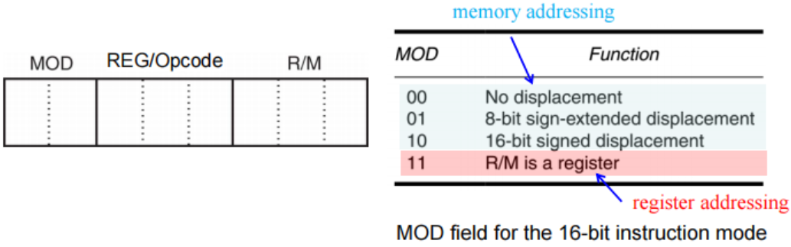{width=80%}
</figure>

#### MOD Field

MOD 字段用于指定所选指令的寻址方式，并确定所选类型是否包含位移量（displacement）。

MOD 字段有两位，可以表示四种不同的寻址模式：

- 如果 MOD 字段为 11（二进制），则表示选择寄存器寻址模式（Register Addressing Mode）。
    - 两个操作数都来自于寄存器，不涉及内存访问。
    - 此时 R/M 字段指定第二个寄存器操作数
- 如果 MOD 字段为 00、01 或 10，则表示选择内存寻址模式（Memory Addressing Mode）。
    - 此时其中一个操作数来自于内存，R/M 字段存储这个操作数对应的内存地址
    - 00 表示无位移量（No Displacement），即内存地址完全由 R/M 字段指定
    - 01 表示有 8 位位移量（8-bit Displacement），Byte-2 之后需要跟着一个存有 8 位位移量的字节，内存地址由 R/M 字段和这个个 8 位的位移量共同指定
    - 10 表示有 16 位或 32 位位移量（16-bit or 32-bit Displacement），Byte-2 之后需要跟着两个字节（16 位模式）或四个字节（32 位模式）的位移量，内存地址由 R/M 字段和这个 16 位或 32 位的位移量共同指定

#### REG/Opcode Field

REG/Opcode 字段既可以指定一个寄存器编号，也可以作为操作码（opcode）信息的额外 3 位拓展，具体含义取决于指令本身。

!!! example
    <figure markdown="span">
        {width=80%}
    </figure>

    上面这张图中

    - 第一个指令的操作码可以简写为 `20 /r`
        -  `20` 表示第一个字节的操作码
        - `/r` 表示第二个字节中 REG/Opcode 字段的含义是一个寄存器编号
    - 第二个指令的操作码可以简写成 `80 /4 ib`
        - `80` 表示第一个字节的操作码
        - `/4` 表示第二个字节中 REG/Opcode 字段的含义是操作码的额外 3 位拓展，这 3 位的二进制值为 `100`（即十进制的 4）
        - `ib` 表示在第二个字节之后还需要跟着一个字节的立即数操作数

#### R/M Field

R/M 字段既可以指定一个寄存器作为操作数，也可以结合 MOD 字段共同编码一种寻址模式。

- 当 MOD 字段为 00、01 或 10 时，R/M 字段会用于表示多种不同的寻址方式

!!! example 
    <figure markdown="span">
        {width=80%}
    </figure>

    上图展示了在 16 位模式下，`MOV DL, [DI]` 指令（机器码为 `8A15H`）的编码方式 

    - 这条指令共 2 个字节，其中 opcode 为 100010，
    - D=1（数据从 R/M 流向 REG/Opcode），W=0（数据大小为字节）
    - MOD=00（无位移量的内存寻址模式），REG/Opcode=010（表示寄存器 DL），R/M=101（表示基址为 [DI]）

    如果指令的机器码变为 `8A5501H`：

    - 指令的第一个字节保持不变
    - MOD 字段变为 01，表示有 8 位位移量的内存寻址模式
    - REG/Opcode 和 R/M 字段保持不变，还额外多了一个字节的 displacement 字段，用于存储位移量 `01H`
    - 整条指令就变成了 `MOV DL, [DI+1]`

    > 注意：在 32 位模式下，R/M 字段的编码方式与 16 位模式有所不同

#### 32-Bit Addressing Modes

<figure markdown="span">
    {width=70%}
</figure>

32 位寻址模式下，R/M 字段的含义与 16 位模式有所不同，尤其是当 R/M=100 时，指令的机器码中会出现一个名为 scaled-index byte（SIB）的字节，用于表明使用形式有所不同的缩放索引寻址方式

!!! info
    这里再回顾一下 16 位和 32 位模式下的机器码区别：

    <figure markdown="span">
        {width=80%}
    </figure>

下图展示的是 80386 及其后续处理器中 32 位寻址模式下，R/M 字段等于 100 时 scaled-index byte 的格式：

<figure markdown="span">
    {width=80%}
</figure>

- 左侧的两个位 SS（Scale Selector）用于指定索引寄存器的缩放因子，可以是 1、2、4 或 8
- 中间的三个位 index 用于指定索引寄存器
- 右侧的三个位 base 用于指定基址寄存器

!!! example
    <figure markdown="span">
        {width=80%}
    </figure>

#### 64 Bit Mode

64 位模式下，引入了一个称为 REX（register extension）的前缀，用于扩展操作数大小以及支持 R8-R15 这些拓展寄存器。

- REX 前缀是一个单字节前缀，取值范围从 40H 到 4FH，位于其他前缀之后，操作码之前
- REX 的作用是修改指令的第二个字节的 REG 和 R/M 字段
- 通过 REX 前缀，可以访问 R8-R15 这些额外的拓展寄存器

REX 共包含五个字段，高半字节是一个固定的常量，用于唯一标识 REX 前缀；低半字节被分为 W、R、X、B 四个位：

<figure markdown="span">
    {width=85%}
</figure>

低半字节的四个位含义如下：

- W 位：用于指定操作数的大小
    - W=0 表示使用默认的操作数大小（32 位）
    - W=1 表示强制使用 64 位的操作数
- R 位：用于扩展 REG 字段，附加到原先的 3 位 REG 字段的高位
    - R=0 表示使用原有的 3 位 REG 字段
    - R=1 表示将 REG 字段视为 4 位，从而支持 R8-R15 这些拓展寄存器
- X 位：用于扩展 SIB 字段中的 index 部分，附加到原先的 3 位 index 字段的高位
    - X=0 表示使用原有的 3 位 index 字段
    - X=1 表示将 index 字段视为 4 位，从而支持 R8-R15 这些拓展寄存器
- B 位：用于扩展 R/M 字段或 SIB 字段中的 base 部分，附加到原先的 3 位 R/M 或 SIB.base 的高位
    - B=0 表示使用原有的 3 位 R/M 或 SIB.base
    - B=1 表示将 R/M 或 SIB.base 视为 4 位，从而支持 R8-R15 这些拓展寄存器

!!! example
    === "例一"

        <figure markdown="span">
            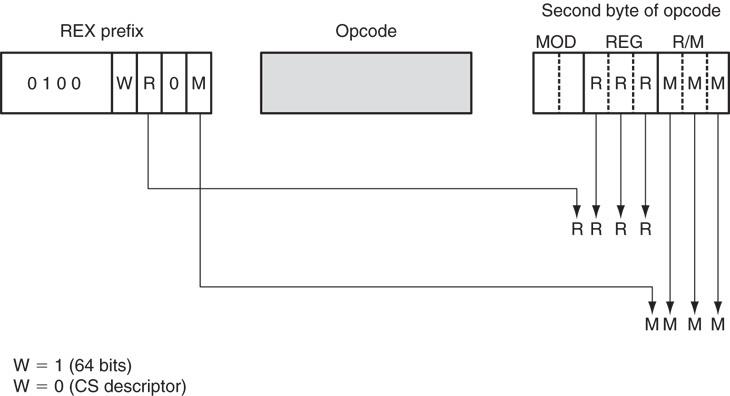{width=85%}
        </figure>

        上图中对应的指令为 `MOV R8, RAX`，其机器码为 `4D 89 FA H`（R/M 不为 100，因此没有 SIB 字段）

        - 第一个字节 `4DH` 是 REX 前缀
            - W=1，表示使用 64 位操作数
            - R=1，表示 REG 字段扩展为 4 位
            - X=0，表示 SIB 字段的 index 部分不扩展（没有 SIB 字段）
            - B=1，表示 R/M 字段扩展为 4 位
        - 第二个字节 `89H` 是 MOV 指令的 opcode 字节
            - opcode 为 100010
            - D=0（数据从 REG 流向 R/M），W=1（由于有 REX 前缀，因此使用 64 位操作数，这个 W 位实际上被 REX.W 位覆盖了）
        - 第三个字节 `FAH` 是 MOD-REG-R/M 字节
            - MOD=11，表示寄存器寻址模式，REG 和 R/M 字段需要和 REX 前缀配合使用
            - REG=1111（二进制），表示寄存器 R15
            - R/M=1010（二进制），表示寄存器 R10

    === "例二"

        <figure markdown="span">
            {width=85%}
        </figure>

        上图中对应的指令为 `MOV R10, [R15+4*R11]`，其机器码为 `4F 8B 14 9F H`（R/M 为 100，因此有 SIB 字段）

        - 第一个字节 `4FH` 是 REX 前缀
            - W=1，表示使用 64 位操作数
            - R=1，表示 REG 字段扩展为 4 位
            - X=1，表示 SIB 字段的 index 部分扩展为 4 位
            - B=1，表示 R/M 字段扩展为 4 位
        - 第二个字节 `8BH` 是 MOV 指令的 opcode 字节
            - opcode 为 100010
            - D=1（数据从 R/M 流向 REG），W=1（被 REX.W 位覆盖了）
        - 第三个字节 `14H` 是 MOD-REG-R/M 字节
            - MOD=00，表示无位移量的内存寻址模式
            - REG=1010（二进制），表示寄存器 R10
            - R/M=0100（二进制），表示后续有 SIB 字段
        - 第四个字节 `9FH` 是 SIB 字段
            - SS=10，表示索引寄存器乘以 4
            - index=1011（二进制），表示寄存器 R11
            - base=1111（二进制），表示寄存器 R15

### Legacy Prefixes

指令前缀可分为四组，对每条指令而言，每组前缀中最多只能使用一个：

<figure markdown="span">
    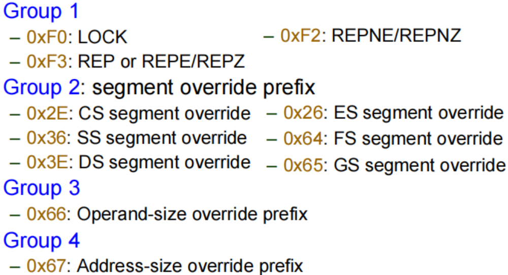{width=75%}
</figure>

#### Lock Prefix（Group 1）

LOCK 前缀的作用是使某些对内存进行“读-改-写”的指令以原子方式执行操作。

- 该前缀的目的是在多处理器系统中，使处理器可以独占对共享内存的使用。
- LOCK 前缀只能用于以下对内存操作数进行写操作的指令：
    - 字节测试和设置指令：BTS、BTR、BTC
    - 使用标志寄存器的算数和逻辑指令：ADC、ADD、AND、DEC、INC、NEG、NOT、OR、SBB、SUB、XOR
    - 各种交换指令：CMPXCHG、CMPXCHG8B、CMPXCHG16B、XADD、XCHG
- 如果 LOCK 前缀用于不支持的指令，则会产生未定义操作码异常（#UD）。

#### Segment Override Prefix（Group 2）

处理器会根据以下规则自动选择默认的段寄存器：

- 指令取指：CS
- 局部数据：DS
- 堆栈：SS
- 字符串操作的目的操作数：ES

程序员可以通过段重写前缀（segment-override prefix）来覆盖默认段寄存器，这个前缀在机器码中是一个加在指令之前的一个字节

!!! example
    <figure markdown="span">
        {width=80%}
    </figure>

#### Operand-Size Override Prefix（Group 3）

在64位模式下，指令的默认操作数大小为 32 位，但可以通过前缀来改为使用 16 位、32 位或 64 位的操作数。

- REX 前缀的 W 位（REX.W）可指定操作数为 64 位
- 66H 前缀可指定操作数为 16 位（非默认大小）
- 假如两者同时存在，由于 REX 前缀优先级更高，因此操作数大小会被设置为 64 位

<figure markdown="span">
    {width=80%}
</figure>

!!! note "控制操作数位宽的优先级"
    目前我们学到的控制操作数位宽的方式有三种，优先级从高到低依次为：

    1. 操作码字节中的 W 位（8 位或非 8 位）
    2. REX.W（强制使用 64 位）
    3. 操作数大小前缀 `66H`（切换至非默认大小）

    具体的操作数位宽由优先级最高的方式决定。

    <figure markdown="span">
        {width=80%}
    </figure>

    具体的判断流程为（以 64 位模式为例）：

    - 若 opcode W 位 = 0，则操作数大小为 8 位
    - 若 opcode W 位 = 1，则继续判断 REX.W 位
        - 若 REX.W 位 = 1，则操作数大小为 64 位
        - 若 REX.W 位 = 0，则继续判断是否存在 `66H` 前缀
            - 若存在 `66H` 前缀，则操作数大小为非默认大小（16 位）
            - 若不存在 `66H` 前缀，则操作数大小为默认大小（32 位）

!!! info "How can instructions share an opcode?"
    默认操作数的大小由当前的操作模式决定，但操作数大小覆盖前缀（REX 或 66H）可以改为使用非默认的操作数大小

    例如在 64 位模式下，下面几条指令的机器码各有不同：

    <figure markdown="span">
        {width=80%}
    </figure>

#### Address-size Override Prefix（Group 4）

在 64 位模式下，默认的地址大小是 64 位，虽然可以通过前缀将地址大小覆盖为 32 位，但不支持 16 位地址。 

- 地址大小覆盖前缀（67H）用于选择非默认的地址大小。

<figure markdown="span">
    {width=80%}
</figure>

!!! example
    内存地址的默认大小由当前操作模式决定，但可以通过地址大小覆盖前缀（67H）改为使用非默认的地址大小

    <figure markdown="span">
        {width=80%}
    </figure> 

!!! example
    <figure markdown="span">
        {width=65%}
    </figure> 

    > 解释：操作模式为 32 位，而地址大小为 16 位，数据大小为 8 位，因此我们需要使用 `67H` 前缀来覆盖地址大小，并且要设置 opcode 字节中的 W 位为 0 来指定使用 8 位数据

!!! tip "前缀的顺序"
    - 对于传统前缀而言，它们之间没有顺序要求，无论谁先谁后，CPU 的指令解码器都可以识别出它们的含义
        - 但是需要保证这些传统前缀属于不同的 group，否则无法共存
    - 但是当存在 REX 前缀时，必须将 REX 前缀放在所有传统前缀的后面，紧邻在操作码字节之前

## Load Effective Address (LEA)

Load-effective address 旨在支持 C 语言等高级语言，它主要分为两类：

- LEA：加载有效地址（offset）。
- LDS、LES、LFS、LGS 和 LSS：加载远指针（即加载 segment selector 和 offset）。

!!! example 
    考虑一个非常简单的结构体：

    ```c
    struct point {
        int x;
        int y;
    };
    ```

    下面这个例子可以让我们更好地理解 LEA 指令的作用：

    <figure markdown="span">
        {width=80%}
    </figure>

    - mov 指令的作用是把地址对应的内存单元中的值加载到寄存器中
    - lea 指令的作用是把地址本身加载到寄存器中

### LEA

LEA 指令的作用是将源操作数计算出来的有效地址加载到目标寄存器中

- 结合上面关于 mov 和 lea 指令的例子：
    - `LEA BX, [DI]` 会将 [DI] 指定的偏移地址（即存在 DI 寄存器中的地址）加载到 BX 寄存器中
    - `MOV BX, [DI]` 会将 [DI] 指定的内存地址中的内存数据加载到 BX 寄存器中
- `SEG` 和 `OFFSET` 伪指令分别会返回某一内存位置对应的段地址和偏移地址
- 如果操作数是一个偏移量，那么 OFFSET 伪指令和 LEA 指令的效果是一样的

!!! example
    <figure markdown="span">
        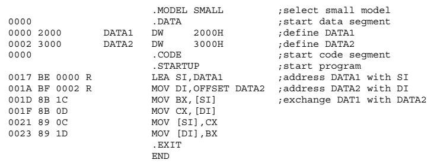{width=80%}
    </figure>

    上图中这段程序的作用是，先将 DATA1 的地址加载到 SI 中，然后把 DATA2 的地址加载到 DI 中（划蓝线部分），然后交换这两个内存地址中的内容。

通常而言，OFFSET 伪指令会比 LEA 指令更高效

- 例如在 80486 处理器中，执行 `MOV BX, OFFSET LIST` 只需一个时钟周期，而执行 `LEA BX, LIST` 则需两个时钟周期
- 类似于 `MOV BX, OFFSET LIST` 这种形式的指令，汇编器会将其翻译为一个立即数加载指令 `MOV BX, imm16/imm32`，其中 imm16/imm32 就是 LIST 的偏移地址
    - 例如变成 `MOV BX, 123` 这种形式

!!! tip
    - OFFSET 伪指令只能用于获取内存地址的偏移部分，不能用于计算复杂的地址表达式
    - 例如 `LEA BX, [SI+DI*2+10H]` 这种形式的地址表达式只能使用 LEA 指令来计算，不能使用 OFFSET 伪指令

### LDS, LES, LFS, LGS, and LSS

- LEA 指令会将偏移地址加载到任意的 16 位寄存器中，其中品阿姨地址由所选择的寻址方式决定
- LDS 和 LES 指令用于从内存中加载远地址
    - 把从内存中获取的偏移地址加载到 16 位或 32 位寄存器中
    - 把从内存中获取的段地址或段选择子加载到 DS 或 ES 段寄存器中

!!! example
    <figure markdown="span">
        {width=80%}
    </figure>

    如上图所示，当 DS=1000H 且 DI=1000H 时，`LDS BX,[DI]` 指令会从地址 11000H 和 11001H 加载数据到 BX 寄存器，并从地址 11002H 和 11003H 加载数据到 DS 寄存器。

这类指令可以用任何寻址方式来访问包含段地址以及偏移地址共 32 位或 48 位的内存区域：

- 32 位远指针：16 位段地址 + 16 位偏移地址  
- 48 位远指针：16 位选择子 + 32 位偏移地址  

在 80386 及以上处理器中，LFS、LGS 和 LSS 指令被新加入指令集。因此现在可以通过这些指令将任意 16 位或 32 位通用寄存器加载为偏移地址，同时将 DS、ES、FS、GS 或 SS 段寄存器加载为段地址或段选择子。

- LDS、LES、LFS、LGS 和 LSS 指令的工作方式是从内存中获取一个远地址，并保存在指定的寄存器对
    - 首先获取偏移地址，并将其加载到指定的通用寄存器中
    - 然后获取段地址或段选择子，并将其加载到指令对应的段寄存器中

!!! info "lea 类型指令示例"
    <figure markdown="span">
        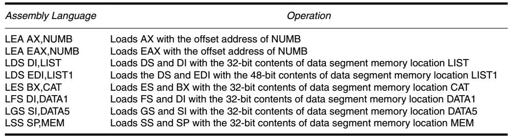{width=80%}
    </figure>

!!! example
    下面这段汇编代码的作用是先保存旧的 SS 和 SP，改为使用新的堆栈段和堆栈指针，然后执行一些操作，最后恢复旧的 SS 和 SP。

    <figure markdown="span">
        {width=80%}
    </figure>

    - CLI 指令（clear interrupt）用于禁止中断，STI 指令（set interrupt）用于允许中断，这两条指令可以确保在切换堆栈时不会被中断打断
    - `MOV WORD PTR SADDR, AX` 指令的功能和 `MOV WORD PTR [SADDR], AX` 是一样的，都是将 AX 寄存器中的值保存到内存地址 SADDR 处，只不过这里把方括号省略了
    - `LSS SP, SADDR` 指令会将内存地址 [SADDR] 处的偏移地址加载到 SP 寄存器中，并将内存地址 [SADDR+2] 处的段选择子加载到 SS 段寄存器中

## String Data Transfers

有五种字符串传输指令：

- LODS（load string）：将字符串从内存加载到寄存器中
- STOS（store string）：将字符串从寄存器存储到内存中
- MOVS（move string）：在内存和内存之间传输字符串
- INS（input string）：从端口输入字符串到内存
- OUTS（output string）：将字符串从内存输出到端口

有两种字符串比较指令：

- SCAS（scan string）：扫描字符串并与 AL/AX/EAX 寄存器中的值进行比较
- CMPS（compare string）：比较两个存放在内存中的字符串

> 每条指令的后缀 S 代表 string

上面的每条指令可以以 byte、word、double-word 为单位进行操作，并且会隐式地使用 DI、SI 寄存器来进行内存寻址。字符串指令执行效率较高，因为它们能够通过重复前缀（REP、REPE/REPZ、REPNE/REPNZ）来自动重复执行并且修改数组下标（即索引）。

!!! example "string comparison"
    <figure markdown="span">
        {width=80%}
    </figure>

    上图展示了使用 CMPSB 指令比较两个字符串的过程：

    - REPE 前缀表示当比较结果相等且计数寄存器 CX 不为零时，重复执行 CMPSB 指令
    - 首先将 DS:SI 和 ES:DI 指向的内存地址中的字节进行比较
    - 然后根据 DF（方向标志）的值，决定 SI 和 DI 是递增还是递减
    - 最后更新 CX 寄存器，表示剩余需要比较的字节数


### DI and SI

- DI/EDI 默认与附加段 ES 配合使用，作为字符串操作的目的地址指针，
    - 字符串指令的目的操作数必须使用 ES 段，不可更改
- SI/ESI 默认与数据段 DS 配合使用，
    - 可以通过段超越前缀改为使用其他的段寄存器，例如 CS、ES 等

### The Direction Flag

方向标志（Direction Flag，DF）位于标志寄存器中，决定了字符串操作中地址指针的移动方向：

- 若 DF=0，则地址指针自动递增（向高地址方向移动）
- 若 DF=1，则地址指针自动递减（向低地址方向移动）

这个标志仅会被字符串指令所使用，不会影响其他类型的指令。

- CLD（clear direction flag）指令用于将 DF 清零，使地址指针递增
- STD（set direction flag）指令用于将 DF 置位，使地址指针递减

### Repeat Prefix

基本的字符串操作指令一次只能处理一个内存值或一对内存值，如果添加重复前缀（REP），则可以重复执行字符串操作指令，直到不满足重复条件或 CX/ECX 寄存器的值变为零。

| 前缀           | 含义                                    |
|---------------|-----------------------------------------|
| REP           | 当 ECX > 0 时重复执行指令                  |
| REPZ, REPE    | 当零标志（ZF）为 1 且 ECX > 0 时重复执行指令 |
| REPNZ, REPNE  | 当零标志（ZF）为 0 且 ECX > 0 时重复执行指令 |

!!! tip
    - **REP**：无条件重复，仅依赖于计数器寄存器 ECX 的值
    - **REPE/REPZ**（repeat while equal/zero）：在比较结果相等（ZF=1）且计数器 ECX 不为零时重复执行
    - **REPNE/REPNZ**（repeat while not equal/not zero）：在比较结果不相等（ZF=0）且计数器 ECX 不为零时重复执行

!!! example
    <figure markdown="span">
        {width=80%}
    </figure>

    在上图的例子中，MOVSB 指令会把 string1 的 10 个字节拷贝到 string2 中

    - 在重复执行 MOVSB 指令时，SI 和 DI 会根据 DF 的值自动递增或递减

### Suffixes

- B：表示按字节（byte）进行操作
- W：表示按字（word）进行操作
- D：表示按双字（double-word）进行操作

例如，MOVSB 表示按字节传输字符串，LODSW 表示按字加载字符串

### LODS

> 唯一一条不需要 REP 前缀的字符串指令

LODS 的作用是把大小为 byte/word/double-word 的数据从内存加载到 AL/AX/EAX 寄存器中，其中内存地址由 DS:SI 指定。

- 指令的后缀表示操作的数据大小，也会影响 SI 寄存器的递增或递减步长
    - 若后缀为 B，则 SI 递增或递减 1
    - 若后缀为 W，则 SI 递增或递减 2
    - 若后缀为 D，则 SI 递增或递减 4
- LODS 会隐式地使用 A 类寄存器（AL/AX/EAX）作为目标寄存器，而不会在汇编代码或 opcode 中显式地指定

!!! example
    <figure markdown="span">
        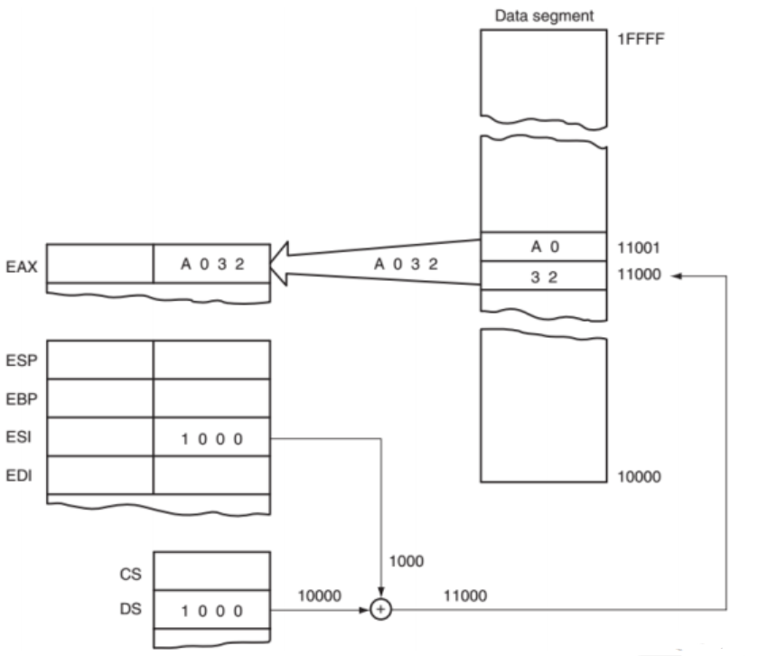{width=80%}
    </figure>

    上图展示的是 LODSW 指令的执行过程：（整行指令就只有 `LODSW` 这五个字母），表示从 DS:SI 指定的内存地址加载一个字（word）到 AX 寄存器中，然后根据 DF 的值更新 SI 寄存器。

    - 如果我们想要加载 ES 段中的数据，可以使用段重写前缀 `ES:`，例如 `ES:LODSW`

### STOS

STOSB、STOSW 和 STOSD 分别将 AL、AX 或 EAX 的值存储到目的地址 ES:DI（或 ES:EDI）指定的内存位置中。

和 LODS 指令类似，STOS 指令会隐式地使用 A 类寄存器（AL/AX/EAX）作为源寄存器，而不会在汇编代码或 opcode 中显式地指定。

!!! tip
    除了 LODS 指令之外，所有字符串数据传输指令都可以使用 REP 前缀来重复执行

当我们使用 REP 前缀时，STOS 指令会不断地将源操作数的值写入到目标内存地址中，直至不满足重复条件或 CX/ECX 寄存器的值变为零为止。

- 因此我们可以用 STOS 指令来快速地初始化一段内存区域

!!! example
    <figure markdown="span">
        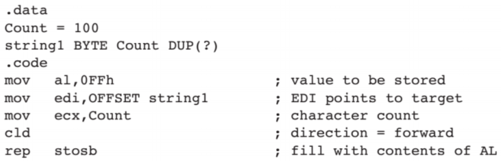{width=80%}
    </figure>

    例如在上面的例子中，就可以通过 `rep stosb` 指令把 string1 中的每个字节都赋值为 0FFH

### MOVS

MOVS 指令的作用是把大小为 byte/word/double-word 的数据从 DS:SI 传输到 ES:DI 指定的内存位置中，并根据数据大小（后缀 B/W/D）自动更新 SI 和 DI 的值

- MOVS 指令常用于在内存之间传输数据快
- 从 8086 到 Pentium 4 微处理器，**MOVS 是唯一允许直接在内存与内存之间的进行数据传输的指令**

### INS

<figure markdown="span">
    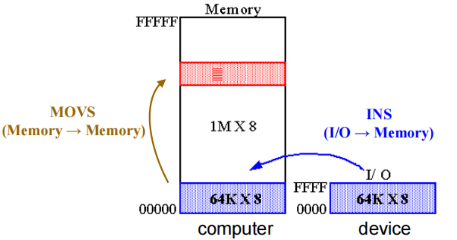{width=80%}
</figure>

> I/O 设备有独立于内存的地址空间，CPU 通过端口号（port number）与 I/O 设备进行通信

INS 指令的作用是将从指定端口号输入的数据存储到内存地址 ES:DI（或 ES:EDI）中。

- 使用 DX 或 EDX 作为源操作数用于指定 I/O 地址或端口，使用 ES:DI 作为目标操作数用于指定内存地址

INS 指令有两种形式：显式操作数和无操作数形式

- 显式操作数形式允许明确指定源和目的操作数，例如 `INS WORD PTR [DI], DX`
    - 源操作数必须是 DX，目标操作数应为 ES:DI 或 ES:EDI
- 无操作数形式则隐式地使用 DX 作为源操作数，ES:DI 或 ES:EDI 作为目标操作数，并且可以通过后缀来指定传输数据的大小，例如 `INSW`
    - INSB：从 8 位 I/O 设备输入数据，并存储到由 DI 索引的内存
    - INSW：输入 16 位 I/O 数据，存储到大小为 word 的内存位置
    - INSD：输入 32 位 I/O 数据，存储到大小为 double-word 的内存位置
- 两种形式的 INS 指令都可以与 REP 前缀结合使用，以便从端口输入多个数据项（读取数据块）

!!! example
    <figure markdown="span">
        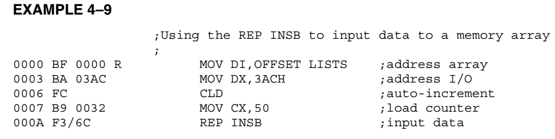{width=80%}
    </figure>

    在上图的例子中，从端口号为 3ACH 的 I/O 设备读取 50 个字节的数据，并将其存储到 ES 段的内存数组 LISTS 中。

### OUTS

与 INS 指令相反，OUTS 指令的作用是将数据输出到指定端口号的 I/O 设备中。

- 源操作数是由 DS:SI 或 DS:ESI 指定的内存地址。
- 目标操作数（I/O 地址，或称 I/O 端口）与 INS 指令一样，包含在 DX 寄存器中。
- 在 Pentium 4 和 Core2 的 64 位模式下，不支持 64 位输出，但 RSI 中的地址宽度为 64 位。

OUTS 指令同样允许显式操作数和无操作数两种形式：

- 显式操作数形式允许明确指定源和目的操作数，例如 `OUTS DX, WORD PTR [SI]`
    - 源操作数应该为 DS:SI 或 DS:ESI，目标操作数是 DX
- 无操作数形式可用后缀来指定传输数据的大小
    - OUTSB 指令将 SI 索引的一个 byte 大小的内存数据输出到 8 位 I/O 设备。
    - OUTSW 指令输出一个 word（16 位）的内存数据到 16 位 I/O 设备。
    - OUTSD 指令输出一个 double-word（32 位）的内存数据到 32 位 I/O 设备。

!!! example
    <figure markdown="span">
        {width=80%}
    </figure>

    在上图的例子中，将内存数组 ARRAY 中的 100 个字节数据输出到端口号为 3ACH 的 I/O 设备中。

## Miscellaneous Data Transfer Instructions

### XCHG

> XCHG 是 exchange 的缩写，表示交换

XCHG 指令的作用是交换寄存器与另一个寄存器或内存单元的内容。

- 不能交换段寄存器，也不能进行内存与内存之间的数据交换。
- 一种少见的具有两个输出的指令
- 可交换 byte、word 和 double-word 大小的数据，并且可以使用除了立即数寻址之外的所有寻址方式
- 使用  16 位的 AX 寄存器和另一个 16 位寄存器进行交换时，XCHG 指令最为高效，此时该指令的机器码只有一个字节

<figure markdown="span">
    {width=80%}
</figure>

- 当使用内存寻址方式时，哪个操作数是内存操作数并不重要，例如 `XCHG AL,[DI]` 与 `XCHG [DI],AL` 是等效的。
- XCHG 指令常用于实现进程同步中的信号量

!!! example
    <figure markdown="span">
        {width=85%}
    </figure>

    上图中展示的是如何使用 xchg 指令来获取和释放自旋锁（spinlock）

    - 在获取锁时，需要保证当前锁是可用的（即 `locked` 变量为 0）
        - 使用 `XCHG EAX, [locked]` 指令将 `locked` 变量的值与 EAX 寄存器中的值交换
        - 如果 `locked` 变量原本为 0，则交换后 EAX 中的值也为 0，表示成功获取锁
        - 如果 `locked` 变量原本为 1，则交换后 EAX 中的值为 1，表示锁已被其他线程占用，需要回到循环继续尝试获取锁
    - 在释放锁时，只需将 `locked` 变量设置为 0 即可，表示锁已被释放

### LAHF and SAHF

LAHF（load AH from flags）指令会把 EFLAGS 寄存器的低 8 传输到 AH 寄存器中

-  AH := EFLAGS (SF:ZF:0:AF:0:PF:1:CF)
    - 把符号标志（SF）、零标志（ZF）、辅助进位标志（AF）、奇偶标志（PF）和进位标志（CF）传输到 AH 寄存器的对应位置中
    - 第 1、3、5 作为保留位，分别被设置为 1、0、0

SAHF（store AH into flags）指令则是把 AH 寄存器的内容传输回 EFLAGS 寄存器中

- 把 AH 寄存器的各个标志位传输到 EFLAGS 寄存器中对应的位置
- SAHF 指令会忽略 AH 的 1、3、5 位，并且把 EFLAGS 寄存器中的这些位分别设置为 1、0、0

### XLAT

XLAT（translate，Table Look-up Translation，查表转换）指令使用隐式操作数 AL 和 BX

- 用于将 AL 的无符号数作为偏移量，与 BX 中保存的基地址（[BX]）相加，从而计算出一个内存地址 [BX+AL]，并将该内存地址中的字节加载到 AL 寄存器中
- XLAT 的效果类似于 `MOV AL, [seg:BX + AL]`
    - 其中 seg:[BX] 是表的基地址，默认的段寄存器为 DS，也可以使用段超越前缀修改
    - 注意，[seg:BX + AL] 这种寻址方式只能用于 XLAT 指令，不能用于其他指令

!!! example
    XLAT 常用来实现数据的格式转换。例如，将菜单中食品的索引号转换为对应价格：

    - 首先把菜单的价格表的地址取出，存放在 DS:BX 中，价格表的大小为 256 字节
    - 食物的索引号放在 AL 寄存器中
    - 执行 XLAT 指令后，索引对应的食品价格会被 AL 寄存器中

!!! tip 
    XLAT 指令会修改 AL 的内容，但不会改变 EAX[31:8] 中的值

### Input and Output Ports

各种外部设备会通过输入端口和输出端口与数据总线相连，每个输入或输出端口都具有唯一的地址，这类似于内存中的每个字节单元都有唯一的地址。

!!! note "ouput port"
    <figure markdown="span">
        {width=75%}
    </figure>

    输出端口包含一个比较器，用于将自身的固定地址与地址总线上的值进行比较。
    
    当地址总线的地址与自身端口地址相等，且控制总线上有写信号时，锁存器会把数据总线上的数据保存下来。

!!! note "ouput port"
    <figure markdown="span">
        {width=75%}
    </figure>

    外部设备的每个输入信号都通过一个三态缓冲器送到数据总线。

    当地址总线的地址与自身端口地址相等，且控制总线上有读信号时，三态缓冲器才会被使能，输入信号才可以被送到数据总线。

### IN & OUT

IN 和 OUT 指令用于执行 I/O 操作

- I/O 设备仅会和 AL、AX 或 EAX 寄存器进行数据交换
- IN 指令用于从指定端口号的 I/O 设备读取数据到 AL/AX/EAX 寄存器中
- OUT 指令用于将 AL/AX/EAX 寄存器中的数据写入到指定端口号的 I/O 设备中

> 只有 80386 及以上的处理器才可以使用 EAX 寄存器

指令通常存储在 ROM（只读存储器）中

- 存储在 ROM 中的定端口（fixed-port）指令是被永久固定的（ROM 具有只读属性）
- 存储在 RAM 中的定端口地址可以被更改，但这并不是常见的做法
- I/O 操作期间，端口地址会出现在地址总线上

I/O 端口寻址有两种形式：

- **固定端口寻址（fixed-port addressing）**
    - 允许使用 8 位 I/O 端口地址在 AL、AX 或 EAX 和端口之间传输数据
    - 端口号是紧跟在指令操作码后的一个字节立即数（00h 到 FFh）
    - 例如 `IN AL, 60H` 指令会从端口号为 60H 的 I/O 设备读取一个字节的数据到 AL 寄存器中
- **可变端口寻址（variable-port addressing）**
    - 允许在 AL、AX 或 EAX 与 16 位端口地址之间传递数据
    - I/O 端口号存储在 DX 寄存器中（0000h 到 FFFFh），并且可在程序执行过程中动态改变
    - 例如 `IN AX, DX` 指令会从 DX 寄存器指定的端口号的 I/O 设备读取一个字的数据到 AX 寄存器中

!!! info "IN and OUT instructions"
    <figure markdown="span">
        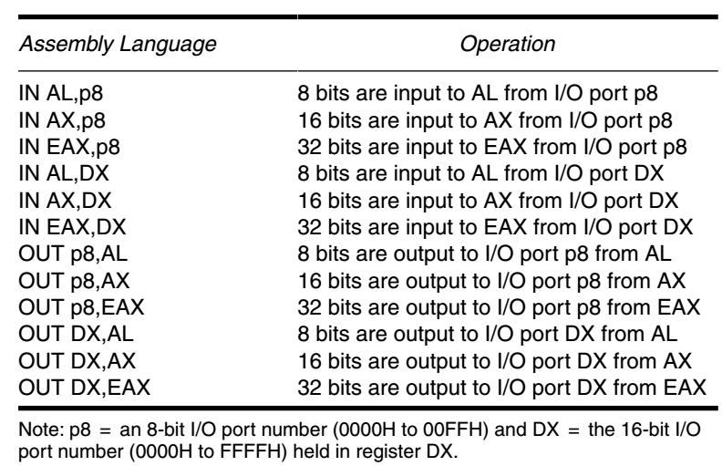{width=85%}
    </figure>

### MOVSX and MOVZX

MOVZX（移动并零扩展）和 MOVSX（移动并符号扩展）指令出现在 80386 到 Pentium 4 的指令集中，它们的作用是将较小的数据类型移动到较大的数据类型中，同时进行零扩展或符号扩展。

<figure markdown="span">
    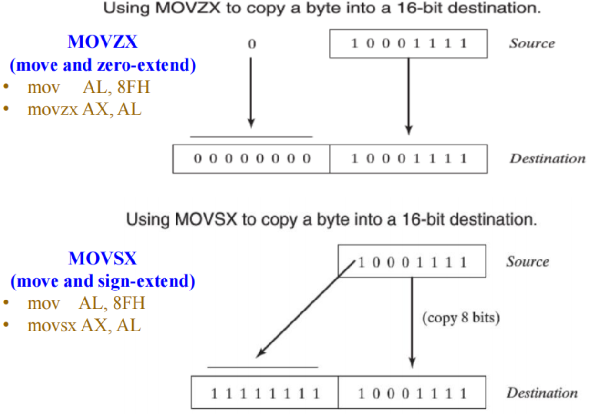{width=75%}
</figure>

<figure markdown="span">
    {width=75%}
</figure>

### BSWAP

BSWAP（byte swap，字节交换）指令用于交换 32 位或 64 位寄存器中的字节顺序，使这些寄存器中的字节按相反的顺序排列。

- 常用于在大端格式和小端格式之间转换
- 它可以把任意 32 位寄存器中的字节顺序进行反转
    - 例如 `BSWAP EAX` 会将 EAX 的内容从 12345678H 转换为 78563412H

<figure markdown="span">
    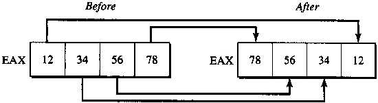{width=75%}
</figure>

假如不使用 BSWAP 指令，我们就需要通过以下的方式进行字节交换：

```assembly
XCHG AH, AL
ROR EAX, 16 ; 循环右移 16 位，相当于把高 16 位和低 16 位交换
XCHG AH, AL
```

在 64 位操作下，由于操作数的默认大小为 32 位，就需要通过 REX 前缀才能对 64 位寄存器执行 BSWAP 指令：

<figure markdown="span">
    {width=75%}
</figure>

<figure markdown="span">
    {width=80%}
</figure>

!!! warning
    对 16 位寄存器使用 BSWAP 指令的结果是**未定义的**，如果要交换 16 位寄存器的两个字节，应使用 XCHG 指令

    - 例如 `XCHG AL, AH` 会将 AX 寄存器中的两个字节进行交换

### CMOV

> CMOV 是 conditional move 的缩写，表示有条件的数据移动

每个 CMOVcc 指令在 EFLAGS 寄存器（CF、OF、PF、SF 和 ZF）中的标志位处于特定状态（或条件）时才执行数据移动操作

- 每条指令都带有一个条件码（condition code，cc），用于指示要检测的条件
    - 只有在条件为真时，才进行数据移动操作
    - 如果条件不满足，则不进行移动，程序继续执行 CMOVcc 指令后的下一条指令
    - 例如 CMOVZ 指令仅在零标志 ZF 被设置时才执行数据移动操作
- 目的操作数只能是 16 位、32 位或 64 位的*寄存器*，但源操作数可以是16 位、32 位或 64 位的*寄存器或内存空间*
- 若要在汇编器中使用它，必须在程序中添加 .686 开关

!!! info "the conditional move instructions"
    <figure markdown="span">
        {width=85%}
    </figure>

CMOV 指令的目的是避免使用分支指令
    - 当 CPU 遇到分支操作（例如 JNE）时，会进行分支预测
    - 如果预测错误，CPU 需要清空流水线并重新加载指令，这会导致性能下降
    - 而如果使用条件移动指令（例如 `CMOVE eax, edx`），则可以避免分支预测，从而提高性能

!!! example
    <figure markdown="span">
        {width=85%}
    </figure>

    考虑一个简单的例子：我们需要根据 condition 来决定变量 `a` 的值是 `b` 还是 `c`，我们可以使用传统的分支指令来实现，也可以使用 CMOV 指令来实现。

    - 其中的 `cmovnz` 表示 move if not zero，即当 ZF=0 时执行数据移动操作

此外，CMOVcc 指令还可以将控制依赖转化为数据依赖，从而将多条路径上的并到同一个基本块中。这会使得基本块包含更多指令，从而扩展指令调度的操作空间，提升指令级并行度（ILP），提高 CPU 的执行效率。

## Segment Override Prefix

段超越前缀几乎可以添加到任何寻址模式下的指令中

- 允许我们使用非默认的段寄存器来访问内存
- 唯一不能加前缀的指令是使用代码段寄存器进行地址生成的跳转（jmp）和调用（call）指令
    - 例如 `JMP label` 和 `CALL label`
- 在编码时，汇编器会通过在指令开头添加一个额外的字节，来选择备用段寄存器

!!! info "instructions that include segments"
    <figure markdown="span">
        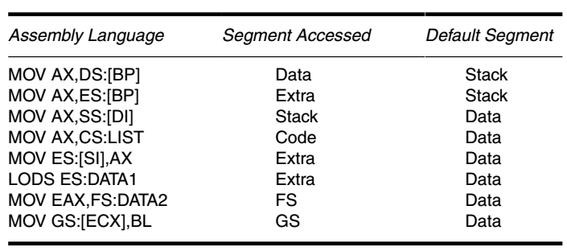{width=85%}
    </figure>

## Assembler Detail

汇编器有两种使用方式：

- 一种是使用特定汇编器独有的“模型”（`.model` 指令）来指定代码段、数据段和堆栈段的大小
- 另一种是使用完整的段定义（`.code`、`.data` 和 `.stack`）来定义各个段，从而对汇编过程进行全面控制，并且对所有汇编器都是通用的

### Directives vs Instructions

汇编语言的语句可分为两类：伪指令（directives）和指令（instructions）。

- **Directives**：告诉汇编器怎么做
    - 例如生成机器码、分配存储空间等
    - 只在汇编时起作用，本身不会生成任何机器代码
- ***Instructions**：告诉 CPU 具体做什么
    - 会被汇编为机器码，并最终链接到可执行文件中，在程序运行时由 CPU 执行

### Directives in MASM

伪指令（directives）用于指导汇编器如何处理操作数或程序的某一部分，有些伪指令会在内存中生成相应的信息，有些则不会。

- `BYTE PTR` 用于指明指针或变址寄存器所引用的数据大小
- `DB`（define byte）用于在内存中分配一个字节的数据空间

!!! info "MASM 中常见的伪指令"
    <figure markdown="span">
        {width=75%}
    </figure>

### Storing Data in Memory Segment

`DB`（define byte）、`DW`（define word）和 `DD`（define double-word）伪指令都是 MASM 中常用来定义和存储内存数据的指令。如果系统中有数值协处理器，DQ（define quad-word）和 DT（define ten-byte）伪指令也很常见

下面这些伪指令会为内存位置分配一个符号名称，并指明其大小

- 可以使用 `DUP`（duplicate）伪指令来讲内存初始化为同一个值
    - 例如 `DATA1 DB 5 DUP(0)` 和 `DATA1 DB 0,0,0,0,0` 是等价的，都会在内存中分配 5 个字节，并将它们初始化为 0
- 当 DB、DW、DD 的操作数是 `?` 时，表示仅分配内存但不进行初始化
- `ALIGN` 伪指令用于将下一个数据项对齐到指定的边界上
    - `ALIGN` 的参数必须是 2 的幂次方，例如 1、2、4、8 等，并且不能大于段的对齐值
    - 例如 `ALIGN 4` 会将下一个数据项对齐到 4 字节边界上

!!! question 
    > 这道题好像是一道历年真题？

    <figure markdown="span">
        {width=75%}
    </figure>

    这道题的要求我们分析进行多次 mov 操作时，ax 保存的对应值是多少。

    `.data` 定义了数据段的内容，`mov ax, @data` 和 `mov ds, ax` 两条指令的操作是把数据段的地址载入到 DS 寄存器中（`@data` 是数据段的段地址）。

    为了方便后续分析，我们需要把数据段中的内容从低地址到高地址排列出来，需要注意以下两点：

    - 内存是按小端模式存储数据的，因此 `DW 1B7CH` 会将 7CH 存储在低地址，1BH 存储在高地址
    - 对于 ASCII 码字符串，我们从左到右先读到哪一个字符，就把这个字符存储在低地址，例如我们要把 'AB' 中的 'A'（31H）存储在低地址，'B'（32H）存储在高地址

    综上所述，数据段的内容如下图所示：

    <figure markdown="span">
        {width=80%}
    </figure>

### ASSUME, EQU and ORG

EQU（equate，等同）伪指令用于为一个符号定义一个常量值，这个常量值可以是数值、ASCII 码或 label。

EQU 的语法形式为 `CONSTANT_NAME EQU expression`

- 汇编器只能给 label 分配给 byte、word 或 double-word 类型的地址
- 如果要将一个 byte 的标签转换为 word 或 double-word 类型，可以使用 `THIS` 伪指令
    - THIS 指令的用法有：
        - `LABEL_NAME THIS WORD`：将 LABEL_NAME 转换为 word 类型
        - `LABEL_NAME THIS DWORD`：将 LABEL_NAME 转换为 double-word 类型

ORG（origin，起始地址）伪指令用于设置程序或数据段（或代码段）中数据（或代码）的起始偏移地址

- 有时我们需要用 ORG 伪指令来将数据或代码分配到某个绝对偏移地址上

ASSUME 伪指令用于告诉汇编器哪些段寄存器分别对应什么名字，例如

```asm
ASSUME CS:CODE_SEG, DS:DATA_SEG, SS:STACK_SEG, ES:EXTRA_SEG
```

!!! example
    <figure markdown="span">
        {width=80%}
    </figure>

### PROC and ENDP

PROC 和 ENDP 伪指令用于标记一个过程（即子程序）的开始和结束，且每个过程必须被分配一个名称。

格式如下：

```asm
name PROC [near/far]
    statements
    ret
name ENDP
```

- PROC 指令后通常需要指定 NEAR 或 FAR（仅在 32 位系统有效
    - NEAR（近）过程指的是与程序在同一个代码段中的过程
    - FAR（远）过程可以位于内存系统的任意位置
- NEAR 过程被认为是 local 的，而 FAR 过程被认为是 global 的
- 在过程块内部定义的任何标签，都会被视为继承了该过程的 NEAR/FAR 属性

### MACRO and ENDM

MACRO 和 ENDM 伪指令用于定义宏（macro），宏是一种在汇编代码中重复使用的代码块。

- 当调用一个宏时，汇编器会将宏的代码直接插入到调用点处
- 这种插入代码的方式也被称作内联扩展（inline expansion）

定义宏的格式为：

```asm
name MACRO [para1,para2,...]
    statements
ENDM
```

!!! example
    宏也可以在数据段中使用。例如我们可以定义一个用于 GDT 描述符的宏：

    <figure markdown="span">
        {width=80%}
    </figure>

    这样一来我们就可以很方便地定义多个 GDT 描述符，而不需要重复写相同且冗长的代码

### INCLUDE

INCLUDE 伪指令用于在汇编时，将另一个源文件（由文件名指定）中的代码插入到当前源文件中

语法为 `INCLUDE filename`

<figure markdown="span">
    {width=80%}
</figure>

### Memory Organization

内存组织结构定义了软件的内存相关属性，包括代码大小、数据指针、指令编码、段组合类型、段装入顺序等。

汇编器采用两种基本格式来定义内存组织：

- 全段定义（full-segment definitions）
    - 能更好地控制汇编语言任务，因此推荐用于复杂程序。
- 使用模型（.model）定义
    - MASM 汇编器支持多种内存模型，从 tiny 到 huge 不等，这些模型控制着段寄存器的使用方式和指针的默认大小。
    - `.model` 伪指令会定义代码和数据指针的大小，并且会隐式地生成段定义。

#### Full-Segment Definitions

全段定义使用 `SEGMENT`、`ENDS` 和 `ASSUME` 等伪指令来定义段，并以此向汇编器和链接器传递信息。

全段定义的格式以及例子如下图所示：

<figure markdown="span">
    {width=70%}
</figure>

!!! info "Processor Directive VS Segment Attribute"
    - 处理器指令（processor directive）会隐式定义默认的操作模式
    - 段属性（segment attribute）会显示地指定在本地段中使用的操作模式，使其能够覆盖默认模式

    允许使用的段属性与操作模式必须匹配，否则会导致汇编错误。例如：

    - `.286` 只允许使用 `use16` 段属性
    - `.386` 允许使用 `use16` 和 `use32` 段属性

#### ASSUME Directive

- SEGMENT 指令本身并不告知段的用途类型，需要用 ASSUME 伪指令来指定段寄存器与段名称之间的对应关系
- assume 伪指令的基本格式为

    ```ASM
    assume [CS:段名,] [DS:段名,] [ES:段名,] 
           [FS:段名,] [GS:段名,] [SS:段名]
    ```

- 比如下面这些命令都是有效的
   - `assume DS:DSEG`
   - `assume CS:CSEG, DS:DSEG, ES:DSEG, SS:SSEG`
   - `assume CS:CSEG, DS:NOTHING`

当汇编器遇到一条形如 `mov var,0` 的指令时，首先需要判断 var 属于哪个段

- 如果变量 var 没有声明在当前 assume 设定的任何段中，汇编器就会报错

#### END

END 指令用于告知汇编器一个模块（module）的结束

- 通常，每个源代码模块的最后一行都会有一条 END 语句。
- 有且只有一个模块可以包含带有 label 的 END 语
- 带有 label 的 END 语句表示程序的入口点（entry point）
    - 例如 `END START` 指示汇编器从标签 START 开始执行程序

#### Models

内存模型（Memory model）是 MASM 独有的概念

- MASM 中的 `.model` 伪指令为实模式提供了 6 种内存模型，分别是 tiny、small、medium、compact、large 和 huge
- 在保护模式下还支持使用 flat 模型（`.model flat`）
    - flat 模型假设所有段都映射到一个连续的线性地址空间中，因此不需要使用段寄存器来访问内存
- `@DATA`、`@STACK`、`@CODE` 等特殊伪指令可用于标识不同的段
- MASM 在 x64 下不再使用 `.model` 指令

|   模型  | 数据段 | 代码段 | 说明                                                    |
|:-------:|:------:|:------:|---------------------------------------------------------|
|   Tiny  |  near  |  near  | 仅有一个段，同时包含代码和数据（CS=DS=SS）              |
|  Small  |  near  |  near  | 一个代码段和一个数据段（DS=SS）                         |
|  Medium |  near  |   far  | 多个代码段，一个数据段（DS=SS）                         |
| Compact |   far  |  near  | 一个代码段，多个数据段                                  |
|  Large  |   far  |   far  | 多个代码段，多个数据段                                  |
|   Huge  |  huge  |   far  | 多个代码段，多个数据段，单个数组可以大于一个段（>64KB） |


!!! example
    我们可以按照如下的方式来使用内存模型：

    ```asm
    .model small
    .stack 100h
    .data
        ; 数据段内容

    .code

        ; 代码段内容

    ... ; 程序的其余部分

    end main ; 程序入口点
    ```
