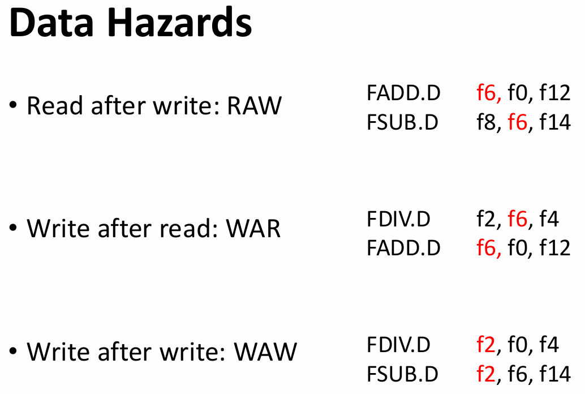
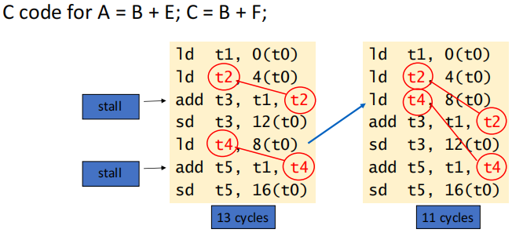
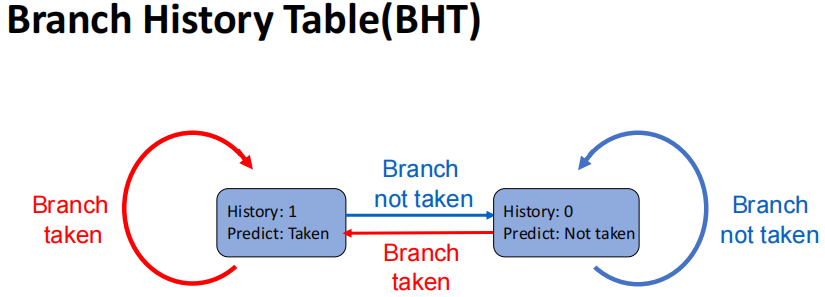
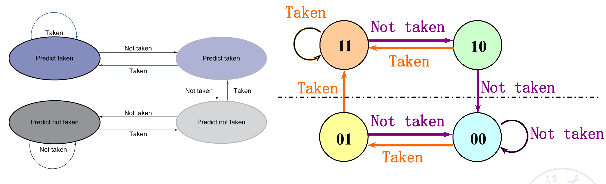
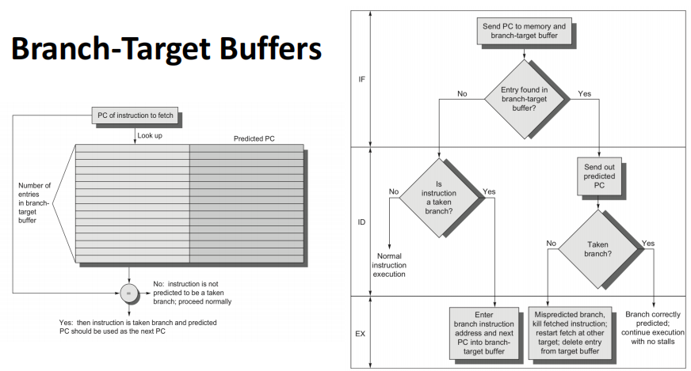
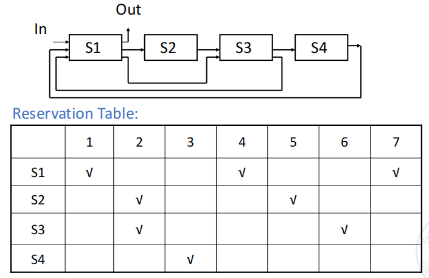
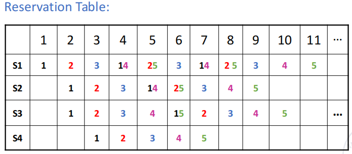
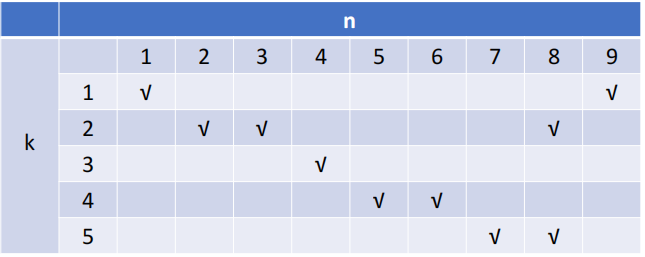
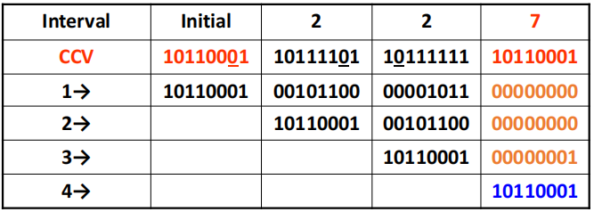
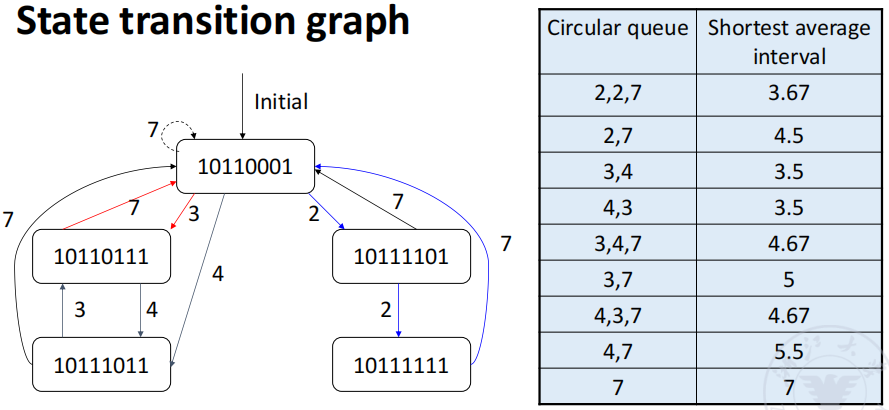

# 流水线

<figure>
    
</figure>

## What is pipelining?

有两种方式加速程序的执行

- 缩短每条指令的执行时间
    - 例如使用高速设备、提升指令内部微操作的并行度
- 对一段程序整体的执行进行加速
    - 使用流水线、多发射等方式

比如一条指令可以被分为 3 个阶段

<figure>
    
</figure>

那么我们就有下面三种执行模式：

- Sequential execution
- Single overlapping execution
- Twice overlapping execution

### Sequential execution

<figure>
    
</figure>

即按顺序依次执行每一条指令，执行时间等于每条指令的执行时间乘以指令的数量

### Overlapping execution

重叠执行时，如果不同阶段的时间不一致，那么就可能导致等待，造成资源的浪费；如果不等待，那么用时较长的阶段就可能因同时使用同一份硬件资源而导致冲突。

<figure>
    
</figure>

<figure>
    
</figure>

最理想的情况是每个阶段的时间都相等，就有 single 和 twice overlapping execution 两种方案，即同时有额外的一个或两个指令在执行。

<figure>
    
</figure>

<figure>
    
</figure>

流水线可能产生内存访问冲突，常见的解决方案有

- **Instruction memory** & **data memory**
- **Instruction cache** & **data cache** (same memory): Harvard structure
- **Multibody cross structure** (same memory with limitations)
- Adding **instruction buffer** between memory and instruction decode unit

<figure>
    
</figure>

添加了 buffer 之后，可以在 buffer 满之前一直不停把指令存放到里面，这样取指令的时间就变得很短，此时 IF 就可以和 ID 阶段合并。

但这样合并过后的 ID 阶段的时间也未必与 EX 阶段一致，那么我们可以再给 ID 阶段之后添加一个 buffer，把 decode 的结果存放到这个 buffer 里面，这样下一次的 ID 就不必等到当前的 EX 执行结束才开始。

<figure>
    
</figure>

<figure>
    
</figure>

- 可以看到，上图中 `ID K+2` 在 `ID K+1` 完成后就可以立即开始，而不需要等到 `EX K` 完成后再开始，这就减少了等待的时间

## Classes of pipelining

- **Single function pipelining（单功能流水线）**: only one fixed function pipelining.
-  **Multi function pipelining（多功能流水线）**: each section of the pipelining can be
connected differently for several different functions.

    - 执行不同的运算（功能）时会使用流水线中不同的段（某个段可能会被多次使用）

??? example "多功能流水线"
    <figure>
        
    </figure>

针对于多功能流水线，还可以继续细分为两种：

- Static pipelining

    静态流水线：同一个时刻流水线内只能做某个特定的功能。

    需要执行不同的功能时，需要等待当前的所有功能执行完毕后才可以切换。

- Dynamic pipelining

    动态流水线：同一个时刻流水线可以做多个功能。

    执行指令更灵活，但控制起来也更复杂。

!!! example "静态与动态流水线"
    <figure>
        
    </figure>

    横轴表示时间，纵轴表示此时使用到的是流水线的哪一部分硬件（空间资源）。

流水线也可以按照划分粒度的不同进行分类

- Component level pipelining (in component - operation pipelining)

    处理器内部的算术和逻辑操作组件被分为多个段，实现部件级别的流水线

- Processor level pipelining (inter component - instruction pipelining)

    指令级流水线，将指令分为多个子阶段，每个子阶段由不同功能单元执行

- Inter processor pipelining (inter processor - macro pipelining)

    多处理器之间的流水线，将多个处理器连接起来，每个处理器完成一个大任务的一部分

也可以分为线性/非线性流水线

- Linear pipelining
- Nonlinear pipelining

    指令的执行过程可能有回路，某些操作单元可能会被多次使用

<figure>
    
</figure>

还有其他分类方法：

- 顺序与乱序流水线

    - Ordered pipelining（顺序流水线）：指令的执行顺序与指令的发射顺序一致
    - Disordered pipelining（乱序流水线）：指令的执行顺序与指令的发射顺序不一致

- 标量/向量处理器

    - Scalar pipelining（标量流水线）
    - Vector pipelining（向量流水线）：
    
    The processor has vector data representation and vector instructions. It is the combination of vector data representation and pipelining technology.

## Performance evaluation of pipelining

### Throughput

流水线的目的是提高单位时间内执行的指令数目，即提高吞吐率（throughput）。
$$ TP = \frac{n}{T_K} < TP_{max} $$

<figure>
    
</figure>

假设流水线被分为 $M$ 段，共有 $n$ 条指令要执行：

$$ TP=\dfrac{n}{n+m-1}TP_{max} $$

当流水线各个阶段的耗时不等时，最大吞吐率 $TP_{max}$ 取决于最慢的阶段（bottleneck segment）。

???+ example 

    - $M = 4$
    - Time of S1, S3, S4: $\Delta t$
    - Time of S2: $3\Delta t$ (Bottleneck)

    流水线中耗时最长的段被称为瓶颈段（bottleneck segment）

    <figure>
        
    </figure>

    <figure>
        
    </figure>

    吞吐量最大值 $TP_{max}$ 仅和瓶颈段的时间有关

解决瓶颈问题的方法有两种

- Subdivision

    把瓶颈段分成若干段执行

    <figure>
        
    </figure>

- Repetition

    对多条指令的瓶颈段进行重复执行（并行执行），对单条指令而言没有提升，但对多条指令可以提升吞吐率

    <figure>
        
    </figure>

    <figure>
        
    </figure>

### Speedup

加速比（speedup）是指在流水线中总的执行时间相较于不使用流水线的提升程度。
$$ Sp = \dfrac{T_{seq}}{T_{pipe}} $$

$$ S_p = \dfrac{n \times m \times \Delta t_0}{(m+n-1)\Delta t_0} = \dfrac{n \times m}{m+n-1} $$

- if $n>>m, Sp \approx m$

### Efficiency

我们这里定义的效率（efficiency，$\eta$）是指对于计算机时空资源的利用程度，对于下面的时空图而言，效率就等于实际使用计算机资源的格子数除以总的格子数。

<figure>
    
</figure>

$$ \eta = \dfrac{n\times m \times \Delta t_0}{m(m+n-1)\Delta t_0} = \dfrac{n}{m+n-1} $$

- if $n>>m, \eta \approx 1$

!!! example "计算流水线性能"

    === "静态双功能流水线"

        假设我们现在有一个静态双功能流水线，要计算两个向量 A 和 B 的点积。

        <figure>
            
        </figure>

        由于这是**静态流水线**，同一时刻只能做一类事情，一种操作后才能去做另一种操作。
        
        这里我们需要先做乘法，排空流水线，再做加法。需要注意的是，我们需要先让四个乘法结果分成两组相加后，再把它们的结果再相加，需要三次加法运算。

        <figure>
            
        </figure>

        最终得到 
        
        - $T_p = 7/15 \Delta t$
        - $Sp = \dfrac{4 \times 3 \Delta t + 3 \times 4 \Delta t}{15 \Delta t} = 1.6$
        - $\eta = \dfrac{4 \times 3 \Delta t + 3 \times 4 \Delta t}{4 \times 15 \Delta t} = 32\%$

    === "动态双功能流水线"
        
        使用动态流水线时可以在同一时刻执行不同类型的操作，因此不需要等待。

        需要注意的是在进行乘法操作时，需要占据功能部件 2 的时间为 $2\Delta t$

        <figure>
            
        </figure>

        <figure>
            
        </figure>

!!! tip
    流水线的级数并不是越多越好，当流水线的级数过多时会导致

    - 设计复杂度大大增加
    - 需要大量处理在执行中指令之间可能存在的依赖关系
    - 控制逻辑会变得非常庞大和复杂

!!! note "影响多功能流水线相率的因素"
    - 当多功能流水线执行某个功能时，总有一些用于其他功能的段处于空闲状态
    - 在流水线建立过程中（最开始的几条指令刚刚传入流水线），一些段也会处于待使用的空闲状态
    - 流水线各段的时间不等时，时钟周期取决于瓶颈段的时间
    - 静态流水线在功能切换时，需要清空流水线
    - 上一个操作的输出是下一个操作的输入
    - 还有一些额外的开销：流水线寄存器的延迟以及时钟偏移（时钟信号到达两个寄存器之间的时间差）

## Hazards of Pipelining

流水线中的指令依赖主要可以分为以下几种情况：

- 数据依赖（Data Dependences）

    后续指令所需要使用到的数据依赖于前一条指令的结果

- 名称依赖（Name Dependences）

    后续指令所需要使用到的寄存器与前一条指令所写入的寄存器相同（但是未必存在数据相关）

- 控制依赖（Control Dependences）

    某些指令是否执行取决于前面的分支指令的执行结果

Hazard 指的是流水线中由于指令之间的依赖关系而导致的冲突。

- Structural hazards
    - A required resource is busy
- Data hazard
    - Need to wait for previous instruction to complete its data read/write
- Control hazard
    - Deciding on control action depends on previous instruction

### Structure Hazards

由于对硬件资源的使用冲突而导致的冒险。

例如在一个流水线中只有一块内存，load 和 store 指令为了数据需要访问内存，后续指令的取指操作也需要访问内存，这样就会导致结构冒险。

解决方法只有 stall 或增加硬件资源（包括使用分离的指令内存和数据内存、使用分离的指令 cache 和数据 cache 等）。

> Can always solve a structural hazard by adding more hardware

### Data Hazards

An instruction depends on completion of data access by a previous instruction

包括读后写（RAW）、写后读（WAR）、写后写（WAW）三种情况

<figure markdown="span">
    {width=55%}
</figure>

通常通过 stall 或者 forwarding 来解决，但 load-use data hazard 无法仅通过 forwarding 解决，在 forwarding 之后还是需要 stall 一个周期

为了尽可能地减少 stall，提高 CPU 的运行效率，也可以对没有相互依赖关系的指令进行调度（Code Scheduling），从而尽可能地减少需要的 stall 周期数。

<figure markdown="span">
    {width=65%}
</figure>

- **静态调度**：程序还没有运行时，**编译器**为我们优化了代码，改变了指令的执行顺序。
- **动态调度**：程序在运行时，**处理器**为我们优化了代码，改变了指令的执行顺序。

!!! info
    具体如何判断是否出现了 data hazard、出现了之后要从哪个阶段对数据进行 forwarding、要对阶段寄存器如何处理在这里就不详细展开了，具体可见[计组笔记](../COD/chap-4.md#pipline-hazards)。

!!! abstract "Summary of Data Hazards"
    - EX hazard & MEM hazard
        - forwarding
    - Double hazard
        - Revise the forwarding condition
    - Load-use hazard
        - One stall is needed, except for forwarding

### Control Hazards

解决办法有几种：

- 直接 stall，直到确定要是否要跳转和要跳转到的地址之后再继续执行后续指令
- predict，在 RISC-V 中一般是 predict not taken，仅在预测错误的时候才 stall
    - 也有动态分支预测的技术，即把分支指令的历史结果存储在一个表中，将要执行 branch 指令时就去检查这个表中是否有相应的指令，根据表中的内容来决定是否跳转；如果判断错误了，就 flush 流水线并且调整预测结果
- 将判断 branch 是否跳转的硬件移到 ID 阶段，提前进行判断

#### Dynamic Branch Prediction

Use dynamic prediction

- Branch prediction buffer (aka branch history table)
- Indexed by recent branch instruction addresses
- Stores outcome (taken/not taken)
- To execute a branch

    - Check table, expect the same outcome

        把之前预测的结果存在一个表里，通过历史结果判断未来，根据之前的分支结果预测这次。

    - Start fetching from fall-through or target
    - If wrong, flush pipeline and flip prediction

<figure markdown="span">
    {width=70%}
</figure>

<figure markdown="span">
    {width=70%}
</figure>

!!! info "Advanced Techniques for Instruction Delivery and Speculation"
    - Increasing Instruction Fetch Bandwidth

        - Branch-Target Buffers(BTBs)

        <figure markdown="span">
            {width=90%}
        </figure>

        类似于 TLB，用于存放分支指令以及分支预测的目标地址。
        
        - 如果遇见一条需要跳转的分支指令，但它不在表中，就把它加入到表中；否则就不需要加入表中
        - 如果执行一条分支指令时发现它在 BTB 中，但是不需要跳转，就把这条指令从表中移除

    - Specialized Branch Predictors: Predicting Procedure Returns, Indirect Jumps, and Loop Branches
        - Integrated Instruction Fetch Units

            一个聚合了综合分支预测、指令预取、指令内存访问等功能的单元

    - Benefit
        - Get instructions at branch target faster
        - It can provide multiple instructions at the branch target once, which is necessary for the multi processor;
        - branch folding
            - It is possible to achieve unconditional branching without delay, or sometimes conditional branching without delay.

## Schedule of Nonlinear pipelining

**Linear pipelining**: Each section of the pipelining is connected serially without feedback loop. When data passes through each segment inthe pipelining, each segment can only flow once at most

**Nonlinear pipelining**: In addition to the serial connection, there is also a
feedback loop in the pipelining

之前我们学到的都是线性流水线，但是有些时候执行某些指令时需要反复用到某些硬件资源，这就会在流水线中形成一条回路，这就是非线性流水线。

非线性流水线会遇到调度问题：我们需要决定何时向流水线中引入一个新的任务（一条新指令）而不会与已经在流水线中的指令发生冲突。

!!! example
    <figure markdown="span">
        {width=60%}
    </figure>

    例如这里表的横轴表示时钟的拍数，纵轴表示需要使用的硬件资源。如果随意地向流水线内不断引入新指令，就会导致硬件资源使用的大量冲突

    <figure markdown="span">
        {width=60%}
    </figure>

!!! tip
    在这里我们暂且假设进入非线性流水线的指令都是相同的。

解决上述问题的方法是对非线性流水线进行调度，以避免冲突：

1. Initial conflict vector

    使用二进制表示，从右往左数第几位是 1 就表示每隔几拍这个指令就会产生冲突

2. Conflict vector
3. State transition graph
4. Circular queue
5. Shortest average interval

!!! example
    <figure markdown="span">
        {width=60%}
    </figure>

    首先分别观察每一个部件每隔多少拍会产生冲突：

    - 第一个部件每个 8 拍会出现冲突，第二个部件隔 1，5，6 拍会出现冲突，第三个部件不会出现冲突，第四、第五个部件隔 1 拍会出现冲突
    - 于是我们把第 1，5，6，8 位二进制数字置为 1，其余为 0，就得到了初始的冲突向量（initial conflict vector）10110001

    <figure markdown="span">
        {width=60%}
    </figure>

    接着我们可以画一个表格来计算当前的冲突向量（current conflict vector，CCV），它是目前在流水线中的所有冲突向量取交集的结果。

    上图中纵轴表示引入第几条指令，横轴表示在隔了几个周期后引入新的指令。（**我们暂时只考虑所有指令都相同的情况**）

    1. 比如在上图中，initial 的 CCV 在第 2、3、4、7 位是 0，因此我们可以隔 2、3、4、7 拍后引入新一条的指令
    2. 我们选择隔 2 拍后引入第二条指令，就把第一条指令的冲突向量右移 2 位（高位补 0），并把移位后的冲突向零与第二条指令的冲突向量**按位或**起来，得到新的 CCV。
    3. 现在 CCV 的第 2、7 位是 0，我们可以隔 2 拍或 7 拍后引入第三条指令，以此类推
    
    这样，我们就找到了一个循环调度：2-2-7。
    
    循环调度是不唯一的，我们还可以用类似的方法找到更多的循环调度方法，然后求出平均的间隔（执行完一个循环所需要暂停的周期数除以这个循环中的指令数量）
    
    - 例如 2-2-7 的平均间隔就是 (2+2+7) / 3 = 3.67

    <figure markdown="span">
        {width=70%}
    </figure>

!!! summary
    1. How the instruction is executed
        - Sequential execution
        - Overlap once
        - Second overlap
        - Pipeline
    2. Classification of pipelines
        - Single function, multi-function
        - Static, dynamic
        - Linear, non-linear
        - In-order, out-of-order
    3. Performance indicators of the pipeline
        - Throughput rate
        - Speedup ratio effectiveness
    4. Factors affecting the performance of the pipeline
        - Pipeline design
        - Type of instructions
        - Instructions related
            - Data dependence
            - Name dependence
            - Control dependence
    5. Dynamic Branch Prediction
        - Branch History Table (BHT)
        - Branch-Target Buffer (BTB)
    6. Non-linear pipeline scheduling problem
