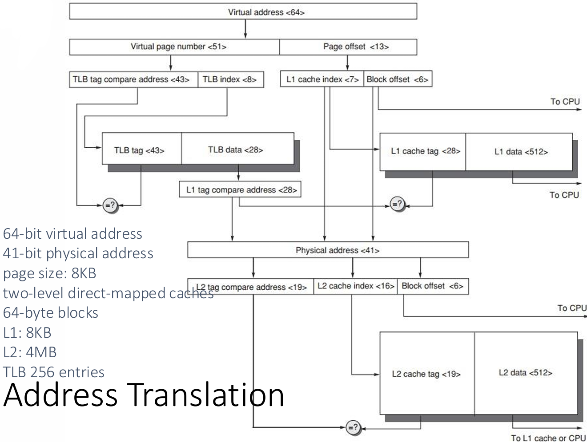

# Memory Hierarchy

## Introduction

<figure markdown="span">
    {width=70%}
</figure>

### Cache

**Cache**: a safe place for hiding or storing things.（但其实到现在也不够安全）

- Cache **Hit**/**Miss**：When the processor **can**/**cannot** find a requested data item in the cache
- **Block/Line Run**：A fixed-size collection of data containing the requested word, retrieved from the main memory and placed into the cache
    - 是 cache 和主存进行数据交换的最小单位，其中包含着我们所需要使用到的数据（例如某个 word）

    <figure markdown="span">
        {width=70%}
    </figure>

- Cache **Locality**
    - **Temporal locality**：need the requested word again soon

        访问过一个数据后，很可能在不久的将来还会再次访问这个数据

    - **Spatial locality**：likely need other data within the same block soon

        被访问的数据所在的 block 中的其他数据也很可能在不久的将来会被访问到

- Cache **Miss**
    - cache miss 发生后所需要的时间取决于：
        - **Latency**: the time to retrieve the first word of the block
        - **Bandwidth**: the time to retrieve the rest of this block
    - 发生 cache miss 的原因包括：
        - **Compulsory**: first reference to a block

            强制未命中：第一次访问这个 block 时发生的未命中

        - **Capacity**: blocks discarded and later retrieved
 
            容量未命中：由于 cache 的容量有限，之前存储在 cache 中的 block 被丢弃了，后来又需要访问这个 block 时发生的未命中

        - **Conflict**: program makes repeated references to multiple addresses from different blocks that map to the same location in the cache

            冲突未命中：程序多次访问不同的 block 中的地址，这些 block 映射到 cache 中的同一个位置，导致之前存储在 cache 中的 block 被丢弃了，后来又需要访问这个 block 时发生的未命中

!!! info "36 terms of Cache"
    <figure markdown="span">
        {width=75%}
    </figure>

## Four Questions for Cache Designers

> 这一部分只随便记一些，详细内容可以参考我的[计组笔记](../COD/chap-5.md)

**Caching** is a general concept used in processors, operating systems, file systems, and applications.
There are Four Questions for Cache/Memory Hierarchy Designers

- Q1: Where can a block be placed in the upper level/main memory? 

    (**Block placement**)

    - Fully Associative, Set Associative, Direct Mapped

- Q2: How is a block found if it is in the upper level/main memory?

    (**Block identification**)

    - Tag/Block

- Q3: Which block should be replaced on a Cache/main memory miss? 

    (**Block replacement**)

    - Random, LRU,FIFO

- Q4: What happens on a write? 

    (**Write strategy**)

    - Write Back or Write Through (with Write Buffer)

### Q1: Block Placement

- Direct mapped：内存中的每一个 block 只能映射到 cache 中的一个固定的位置
    - 可以通过 (Block address) modulo (Number of blocks in the cache) 取模计算得到相应位置
- Fully-associative：内存中的 block 可以映射到 cache 中的任意位置
    - 需要在 cache 中查找这个 block 的 tag 来判断这个 block 是否在 cache 中
    - 但是查找时需要比较所有的 tag，速度较慢
- Set-associative：内存中的 block 会被映射到 cache 中的一个 set 中
    - 根据 index 来确定这个 block 映射到 cache 中的哪个 set 中
    - 再根据 tag 来判断这个 block 是否这一个 set 里
    - 直接映射相当于 1 路组相联，全相联相当于 n 路组相联（n 是 cache 的块数）

### Q2: Block Identification

- 如果是直接映射，那就根据 block address 取模来得到 cache 中的 index
- 如果是组相联，那就根据 block address 取模来得到 cache 中的 index，根据 index 找到对应的 set，再根据 tag 在 set 中寻找对应的 block
- 如果是全相联，那就直接把地址的高位作为 tag，低位作为 offset 来在整个 cache 中查找

<figure markdown="span">
    {width=75%}
</figure>

### Q3: Block Replacement

cache 满了之后，如果我们希望访问的数据不在 cache 中，就需要将 cache 中的某个 block 替换掉

- **Random replacement**：randomly pick any block

    随机选择一个 block 来替换，简单粗暴

- **Least Recently Used (LRU)**：pick the block in the set which was least recently accessed

    替换掉最久没有被使用的 block，需要使用额外的数据位来记录每个 block 的使用情况，较为复杂，但也有 LRU 的近似算法或代替算法

- **First In First Out (FIFO)**：Choose a block from the set which was first came into the cache

    替换掉最早被加载到 cache 中的 block，同样需要额外的数据位来记录每个 block 的加载时间，但是不需要像 LRU 那样不断地更新数据位，简单易实现

!!! example "Strategy of Block Replacement"
    Suppose:

    - Cache block size is 3, and access sequence is shown as follows.

        2, 3, 2, 1, 5, 2, 4, 5, 3, 4

    - FIFO, LRU and OPT are used to simulate the use and replacement of cache block.

        这里的 OPT 指的是理想情况下最优的替换策略：假设我们知道未来的访问顺序，并且能做出最好的选择

        - FIFO:

            <figure markdown="span">
                {width=75%}
            </figure>

        - LRU:

            <figure markdown="span">
                {width=75%}
            </figure>

        - OPT:

            <figure markdown="span">
                {width=75%}
            </figure>

    如果我们增大 cache 的大小，或者改变访问顺序，就有可能得到不同的结果。

    - Hit rate is related to the replacement algorithm, the access sequence, the cache block size.

#### Stack replacement algorithm

有些算法在 cache 增大时命中率至少不会下降，有些算法在 cache 增大时命中率反而有可能下降。我们称使用更大的 cache 时命中率至少不会低于原来情况的算法为 **stack replacement algorithm**。

即使用更大的 cache 的性能至少不会比使用小的 cache 差。

- $B_t(n)$ represents the set of access sequences contained in a cache block 
of size $n$ at time $t$.
- $B_t(n)$ is the subset of $B_t(n＋1)$.

LRU 替换算法就是一种堆栈替换算法，FIFO 则不是。

!!! example
    我们可以使用一个堆栈来模拟 LRU，栈顶是最近被访问的数据，栈的最下方是最久未被访问的。当堆栈满了之后，我们就将栈底的数据替换掉。

    我们不难看出堆栈的大小越大，发生的 cache miss 次数越少，于是 cache hit 的概率就越高。

    <figure markdown="span">
        {width=85%}
    </figure>

#### LRU —— Comparison Pair Method

该如何**只使用门和触发器**来实现 LRU 算法？—— Comparison Pair Method

- **Basic idea**:

    Let each cache block be combined in pairs, use a **comparison pair flip-flop** to record the order in which the two cache blocks have been accessed in the comparison pair, and then use a gate circuit to combine the state of each comparison pair flip-flop, you can find the block to be replaced according to the LRU algorithm.

    让所有的 cache 块两两结对，使用一个触发器来记录这两个块最近的访问次序（例如 $T_{AB}$ 为 1 表示 A 比 B 最近被访问过，0 表示 B 比 A 最近被访问过），然后使用门电路将每个触发器的状态结合起来，就可以找到最久没有被访问的块了。

!!! example
    考虑我们有 A, B, C 三个 cache 块，我们需要使用 $C_3^2 = 3$ 个触发器来记录这三个 cache 块的访问顺序。$T_{AB} = 1$ 表示 A 比 B 最近被访问过，其他同理。

    <figure markdown="span">
        {width=65%}
    </figure>

    <figure markdown="span">
        {width=65%}
    </figure>

不难知道，当我们有 p 个 cache 块时，需要 $C_p^2 = \frac{p(p-1)}{2}$ 个触发器来记录这些 cache 块的访问顺序。

当 p 增大时所需要的触发器的数量会迅速增大，因此在 p 较大时，使用这种方法来实现 LRU 算法就不太现实了。

### Q4: Write Strategy

- **Write Hit**：
    - **Write Through**: 直接把数据同时写入 cache 和主存中

        由于写回到内存所需的时间较长，这个过程需要 Write stall，或者使用 Write Buffer 来缓冲写入的内容（但只要写入 cache 和写入内存的耗时存在差距，始终无法避免 Write stall）。

    - **Write Back**: 写命中时，只把数据写入 cache 中，并将这个 block 标记为 dirty，表示这个 block 中的数据和主存中的数据不一致了。

        只有在这个 block 需要被替换并且 dirty 位为 1 时，才会将这个 block 中的数据写回到主存中。

- **Write Miss**：
    - **Write Allocate**: 先将这个 block 加载到 cache 中，然后再将数据写入 cache 中
    - **Write Around(No Write Allocate)**: 直接将数据写入主存中，不加载到 cache 中

!!! note
    通常来说
    
    - Write Back 会和 Write Allocate 组合使用
    - Write Through 会和 Write Around 组合使用

??? example
    <figure markdown="span">
        {width=75%}
    </figure>

## Memory System Performance

懒得记了（x

总之就是 CPU 运行时间等于指令的时钟周期与访问内存带来的额外周期相加，再乘以每个时钟周期所需的时间。

<figure markdown="span">
    {width=75%}
</figure>

<figure markdown="span">
    {width=75%}
</figure>

??? example
    <figure markdown="span">
        {width=75%}
    </figure>

How to Improve？

- Reduce the miss penalty
- Reduce the miss rate
- Reduce the time to hit in the cache
- Reduce the miss penalty and miss rate via parallelism

## Virtual Memory

内存总是有限的，当一个进程需要使用到的内存超过了物理内存的大小时，就需要使用虚拟内存来扩展内存的大小。虚拟内存技术能通过将虚拟地址映射到物理地址的方式来让程序认为自己拥有了连续的、更大的内存空间。

- Why virtual memory (besides larger)?
- Virtual-physical address translation?
- Memory protection/sharing among multi-program?

<figure markdown="span">
    {width=65%}
</figure>

如果没有使用虚拟内存技术，那么所有进程都将在同一个物理内存中运行，这样就会导致进程之间的内存冲突、相互影响，也有可能引发各种安全问题。

<figure markdown="span">
    {width=65%}
</figure>

使用了虚拟内存之后，每一个进程都认为自己独占了一整块内存空间，从虚拟内存到物理内存的映射由操作系统来完成，这就实现了内存保护和共享。

- Easier/flexible memory management
- Share a smaller amount of physical memory among many processes
- Physical memory allocations need not be contiguous
- Introduces another level of secondary storage

### Virtual Memory Allocation

- Paged virtual memory
    - page: fixed-size block
    - page address: page# +o ffset

        地址由页表编号与页内偏移量连接起来得到

- Segmented virtual memory
    - segment: variable-size block
    segment address: seg#、offset

        地址的第一部分是段号，第二部分是段内偏移量，需要使用段表来进行地址转换

<figure markdown="span">
    {width=60%}
</figure>

!!! info "Paging vs Segmentation"
    <figure markdown="span">
        {width=65%}
    </figure>
   
    现在的操作系统一般都使用分页存储，或者是分页和分段相结合的方式来进行内存管理。

### How virtual memory works?

关于 cache 的 4 个问题都在虚拟内存中有对应的问题。

- Q1. Where can a block be placed in main memory?

    由于缺页带来的损失非常高（需要访问磁盘），与之相比，比较 tag 所花费的时间就不值一提了，因此我们采用全相联的方式来进行映射，从而降低 miss rate。

- Q2. How is a block found if it is in main memory?

    如上面所说的，虚拟地址分为两部分：页号和页内偏移量。页号相当于页表的索引，可以帮助我们从页表中找到对应的页表项，然后根据页表存储的物理地址来找到物理内存中对应的页。

    <figure markdown="span">
        {width=65%}
    </figure>

- Q3. Which block should be replaced on a virtual memory miss?

    - Least recently used (LRU) block，使用 LRU 来替换掉最久没有被使用的 block
    - use/reference bits，使用访问位来记录每个页是否被访问过

        OS 每隔一段时间清空一次访问位，然后根据访问位来判断哪些页是最久没有被使用的，这些页就是可以被替换的

- Q4. What happens on a write?

    因为访问磁盘的速度太慢了，因此我们只能采用 Write-back strategy，同时仅在 dirty 位为 1 时才会将被替换的数据写回到磁盘中。

### Page Table：Address Translation

- Page tables are often large

    例如 32-bit virtual address, 4KB pages, 4 bytes per page table entry.

    那么页表的大小就是 $2^{32} / 2^{12} * 4 = 2^{22} = 4MB$。

- Logically two memory accesses for data access:
    - one to obtain the physical address from page table
    - one to get the data from the physical address

我们想要利用页表来读取数据需要两次访问内存，第一次访问页表获取数据的物理地址，第二次访问这个物理地址获取数据，效率低下。因此我们可以采用类似于 cache 的方式来加速页表的访问 —— TLB。

Translation lookaside buffer (TLB) 会保存最近被使用到的页表项，这让我们只需要访问 TLB 而无需访问页表就可以得到数据的物理地址

- tag: portions of the virtual address
- data: a physical page frame number, protection field, valid bit, use bit, dirty bit

!!! example
    首先发送 tag（即 VPN，virtual page number）到 TLB 中进行查找，并查看访问类型是否违反了保护位。如果没有，就尝试在 TLB 中寻找匹配的项，如果找到了，就可以直接使用 TLB 中的物理页号（PPN）加上偏移量来访问数据了。

    <figure markdown="span">
        {width=65%}
    </figure>

    <figure markdown="span">
        {width=65%}
    </figure>

    <figure markdown="span">
        {width=65%}
    </figure>

### Page Size Selection

Pros of **larger** page size

- Smaller page table, less memory (or other resources used for the memory map);

    在进程使用的内存大小不变的情况下，页更少，所以页表更小。

- Larger cache with fast cache hit;

    需要遍历的页更少，因此 hit time 减小

- Transferring larger pages to or from secondary storage is more efficient than transferring smaller pages;

    一次能搬运更多的数据，减少与磁盘的交互次数，更高效

- Map more memory, reduce the number of TLB misses;

    TLB 能映射到更多的物理内存空间，miss 次数更少。

Pros of smaller page size

- Conserve storage

    When a contiguous region of virtual memory is not equal in size to a multiple of the page size, a small page size results in less wasted storage.

    能更充分地利用内存空间（同一张页表内的地址必须是连续的），碎片化的内存空间更少

结合以上两方面，有的操作系统会使用不同大小的页来进行内存管理（multiple page sizes）

???+ abstract "Address Translation"
    <figure markdown="span">
        {width=75%}
    </figure>

### Summary

!!! summary
    - Memory hierarchy
        - From single level to multi level
        - Evaluate the performance parameters of the storage system (average price per bit C; hit rate H; average memory access time T)
    - Cache basic knowledge
        - Mapping rules
        - Access method
        - Replacement algorithm
        - Write strategy
        - Cache performance analysis
            - Reduce miss rate
            - Reduce miss penalty
            - Reduce hit time
    - Virtual Memory (the influence of memory organization structure on Cache failure rate)

