# Instruction-Level Parallelism (ILP)

!!! info "Dependences and Hazards"
    - **Dependences**: properties of *programs*
    - **Hazards**: properties of the *pipeline organization*

    <figure markdown="span">
        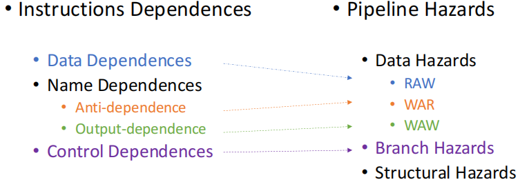{width=60%}
    </figure>

## Dynamic Scheduling

<figure markdown="span">
    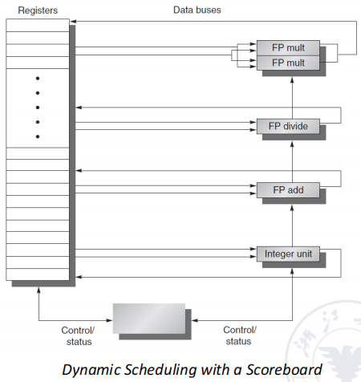{width=60%}
</figure>

在 RISC-V 流水线架构中，我们会在 ID 阶段检测是否存在 structure hazard 和 data hazard。当一条指令不会由于数据冒险而被阻塞时，我们会将其发出到 EX 阶段。

但由于数据依赖等情况，我们可能会因为前面的指令没有被执行完毕而导致后续的指令被阻塞，通常我们解决这个问题的方法是 dynamic scheduling，即对指令的发出顺序进行动态调度，以加快指令的整体执行速度。

- **Idea**: Dynamic Scheduling
- **Method**: out-of-order execution

当然乱序执行指令也可能会引入 WAR、WAW 等数据依赖问题，因此我们就需要使用一些算法对指令进行调度和处理。

- **Scoreboard algorithm**：an approach to schedule the instructions
- **Tomasulo's Approach**：introduces register renaming in hardware to minimize WAW and WAR hazards

!!! example "Example of WAW & WAR Hazards"
    <figure markdown="span">
        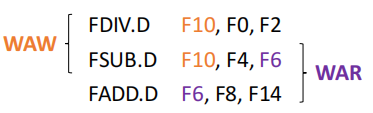{width=80%}
    </figure>

    例如在上面的三行代码中，由于不同类型指令执行所需的时间不同，并且因为乱序导致的执行完毕的时刻也不同，可能会导致

    - WAW（写后写）：如果 FSUB 指令完成得比 FDIV 指令更早，那么 FSUB 指令写入 F10 的结果可能会被 FDIV 指令覆盖掉，与我们期望的结果不一致
    - WAR（写后读）：如果由于乱序，FADD 指令在 FSUB 指令之前完成，那么 FSUB 指令读取到的 F6 的值可能就和我们预期的不一样，导致程序得到错误结果

为了支持乱序执行，我们把 ID 阶段分为两个子阶段

1. **Issue（IS）**：解码指令内容，并检查是否存在结构冒险。这是一个按序执行（in-order）的阶段，即指令进入这个阶段的顺序必须与原始的程序顺序一致。

    检查结构冒险包括

    - 检查是否有可用的功能单元（ALU、FRU 等）
    - 检查是否有可用的寄存器（寄存器重命名）
    - 检查是否有可用的保留站（reservation station）

2. **Read Operands（RO）**：读取操作数的值，并检查是否存在数据冒险。这个阶段是一个乱序执行（out-of-order）的阶段，即指令可以在没有数据冒险时立即开始执行这个阶段，而不需要等待前面的指令完成 RO 阶段后才能开始

## Scoreboard algorithm

Scoreboard 算法的基本思想是添加一个硬件结构来跟踪指令的状态和数据依赖关系。这个硬件结构称为 **scoreboard**，它包含了每个功能单元的状态信息、每个寄存器的状态信息和每个指令的状态信息。

- 指令状态表：跟踪每条指令的状态（处于哪个阶段），包括 Issue、Read Operands、Execute 和 Write Result 等阶段
- 功能组件状态表：跟踪每个硬件功能组件的状态，包括 Busy、Op、Fi、Fj、Fk、Qj、Qk、Rj 和 Rk 等字段
- 寄存器状态表：记录寄存器是否被某个指令使用，是否已经完成写回

??? info "功能组件状态各个字段的含义"
    - **Busy**: 该功能组件是否正在使用中
    - **Op**: 该功能组件正在执行的操作类型
    - **Fi**: 该功能组件正在使用的目标寄存器
    - **Fj、Fk**: 该功能组件正在使用的第一、二个源寄存器
    - **Qj、Qk**: 该功能组件正在使用的第一、二个源寄存器的保留站编号（它们的值应该来自于哪一条指令/功能部件）
    - **Rj、Rk**: 该功能组件正在使用的第一、二个源寄存器的值是否已经准备好（是否可以直接使用）
        - yes: 已经准备好了，但还未读取
        - no 且 Qj/Qk 不为空: 还未准备好，等待 Qj/Qk 指向的指令完成
        - no 且 Qj/Qk 为空: 操作数已经读取完毕了

!!! example

    ```asm
    FLD F6, 34(R2)
    FLD F2, 45(R3)
    FMUL.D F0, F2, F4
    FSUB.D F8, F2, F6
    FDIV.D F10, F0, F6
    FADD.D F6, F8, F2 
    ```

    - Instruction Status

        <figure markdown="span">
            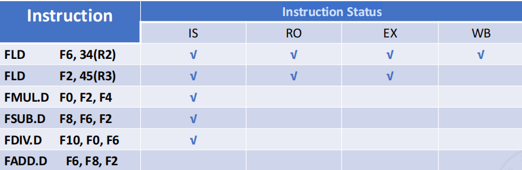{width=65%}
        </figure>

        在这里，指令 1 已经执行完毕，scoreboard 上不会再保存它的状态；指令 2 已经完成 EX，但还未 WB；后续的指令 3、4 需要使用到指令 2 的结果，因此它们完成了 IS 阶段，但还没有执行 RO 阶段；指令 5 需要使用到指令 3 的结果，因此也停留在了 IS 阶段；指令 6 是加法操作，但由于指令 4 是 SUB，也需要使用到加法运算单元，存在结构冒险，因此它无法进入 IS 阶段。

    - Function Component Status

        <figure markdown="span">
            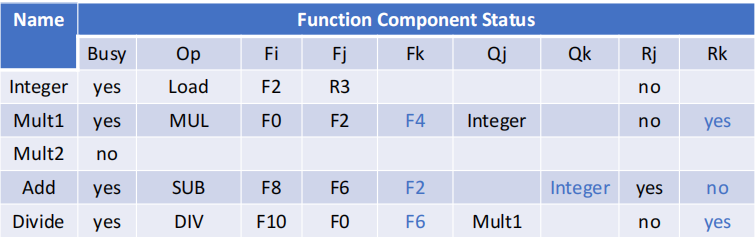{width=65%}
        </figure>

        当一条指令进入 IS 阶段之后，对应的功能部件就会被占用，直到它完成 WB 阶段才会释放相应的硬件资源。可以在此时的功能部件状态表中看到各个功能部件的使用情况。

    - Register Status

        <figure markdown="span">
            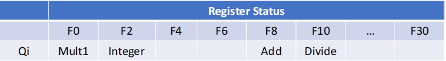{width=65%}
        </figure>

        寄存器状态表中记录了各个寄存器的值需要从哪条指令中获取（寄存器的值将会被哪条指令所修改）

    程序经过若干个时钟周期的执行之后，其结果如下面几张图所示，需要注意的是，由于乘法指令执行较慢，因此它 WB 的时间会比 SUB 还更慢。

    <figure markdown="span">
        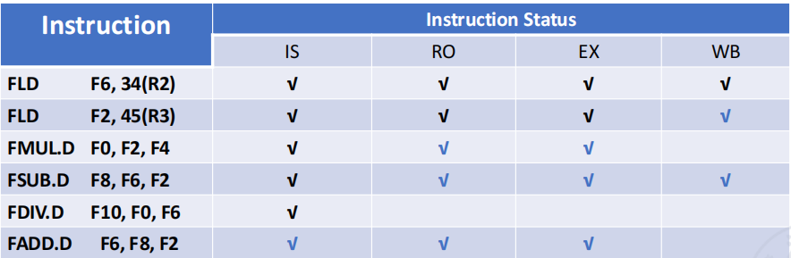{width=65%}
    </figure>

    <figure markdown="span">
        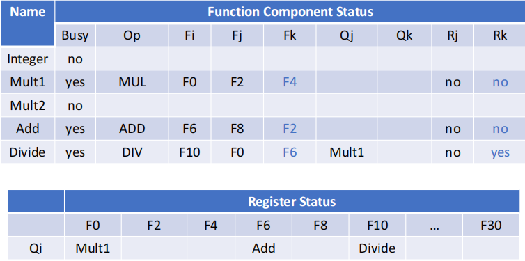{width=65%}
    </figure>

总的来说，Scoreboard 算法可以检测出指令之间的冲突，但并没有真正解决冲突，他只是通过记录额外的信息来借助阻塞的方式去避免冲突的发生。

## Tomasulo's Approach

Tomasulo's Approach 主要是通过**寄存器重命名**和**保留站**来解决数据冒险和结构冒险的问题。它的基本思想是将寄存器的值与指令的执行顺序解耦，从而允许指令在没有数据依赖的情况下并行执行。

<figure markdown="span">
    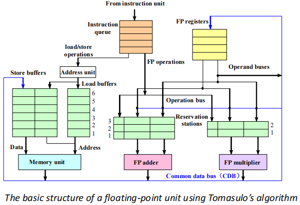{width=75%}
</figure>

- It tracks when operands for instructions are available to minimize RAW hazards;
- It introduces register renaming in hardware to minimize WAW and WAR hazards.

托马斯洛算法所使用到的寄存器重命名和保留站的概念可以帮助我们解决数据冒险和结构冒险的问题。

1. **保留站**（Reservation Station）：用于存储指令的操作数和状态信息。每个功能单元都有一个保留站，用于存储等待执行的指令（上图中的绿色区域）。保留站可以存储指令的操作数（源操作数可能来自于其他指令的执行结果）、目标寄存器和指令的状态信息等。
2. **公共数据总线**（Common Data Bus，CDB）：用于在指令执行完成后，在执行 WB 阶段之前就将结果发送到所有需要使用该结果的指令。CDB 可以将结果广播到所有的保留站和寄存器状态表中，从而实现数据的共享和传递。

我们可以来具体看看在托马斯洛算法中每条指令所经过的三个主要阶段：

1. **Issue**：Get the next instruction from the head of the instruction queue (FIFO)

    从一个先进先出的取出指令队列中获取下一条指令，并放入对应的保留站中

    - If there is a matching reservation station that is empty, issue the instruction to the station with the operand values, if they are currently in the registers.

        如果对应的保留站中有空位，就把对应的指令发射（issue）到保留站中。如果所需的值已经出在寄存器中了，那就带着值一起发射；如果没有，就把保留站中的 Qj 和 Qk 设置为对应的功能单元的编号。

    - If there is not an empty reservation station, then there is a structural hazard and the instruction stalls until a station or buffer is freed.

        如果保留站没有空位，那就说明存在结构冒险，需要阻塞等待。*保留站的空闲情况决定指令是否流出，而不是由功能部件的空闲情况决定。*

    - If the operands are not in the registers, keep track of the functional units that will produce the operands.

        如果操作数不在寄存器中，就需要跟踪哪个功能单元会产生这个操作数。

2. **Execute**：Execute the instruction when the operands are available

    - When all the operands are available, the operation can be executed at the corresponding functional unit.
        
        当保留站中某条指令的所有操作数都准备就绪了，就可以开始执行这条指令，这一步是乱序的。

    - Load and store require a two-step execution process：

        - It computes the effective address when the base register is available.
        - The effective address is then placed in the load or store buffer

        Load / Store 指令需要额外的一步来计算目标地址，计算好后会把目标地址放到 buffer 里

3. Write results

    - When the result is available, write it on the CDB and from there into the registers and into any reservation stations (including store buffers).

        通过 CDB 把结果写回到寄存器中，并且把结果广播到所有需要这个结果的保留站中。（保留站对应的操作数会被标记为这一条指令）

    - Stores are buffered in the store buffer until both the value to be stored and the store address are available, then the result is written as soon as the memory unit is free.

        Store 指令会被缓存在 store buffer 中，直到所需要被保存的值（可能来自寄存器）和存储地址都准备好了，才会在内存单元空闲时写入内存中。

???+ example
    <figure markdown="span">
        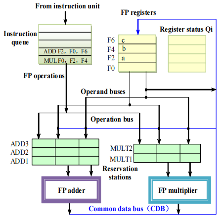{width=65%}
    </figure>

    最开始时，指令保存在 FIFO 队列中。当指令进入保留站时，如果能直接使用寄存器中的值，就把值读出来，不使用这个寄存器的名字；如果不能直接使用寄存器中的值，就把将会写入这个寄存器的指令名放入保留站中。

    <figure markdown="span">
        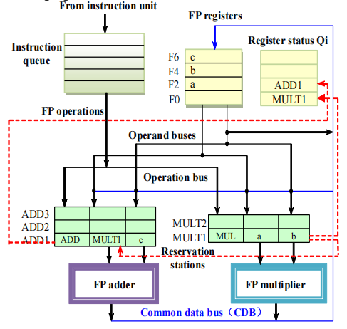{width=65%}
    </figure>

    例如这里 MUL 指令可以直接使用寄存器的值，因此保留站里直接写入 `a` 和 `b`；此时 MUL 指令对应的保留站名称是 `MULT1`，而 ADD 指令需要用到 MUL 的结果，因此保留站中对应寄存器的位置就需要写为 `MULT1`，而不是寄存器的名字。 

    同时我们还需要更新寄存器状态表，指明对应寄存器将会被 `MULT1` 和 `ADD1` 指令所修改。

    <figure markdown="span">
        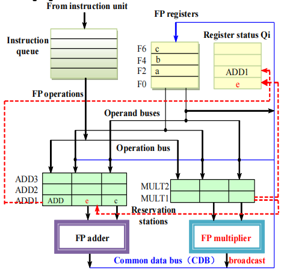{width=65%}
    </figure>

    当我们执行完毕 `MULT1` 后，就需要修改 Qi，并且把结果广播到所有需要这个结果的保留站中，例如这里我们需要修改保留站 `ADD1` 中的第一个源寄存器的值。

    在这个过程中，我们实际上就完成了寄存器重命名，从而避免了 WAW 和 WAR 的数据冒险。

托马斯洛算法使用到了三个表：

- **Instruction status table**: This table is included only to help you understand the algorithm; it is not actually a part of the hardware.
- **Reservation stations table**: The reservation station keeps the state of each operation that has issued.

    保留站状态表（相当于功能部件状态表）记录了有多少指令当前正在执行，相较于 scoreboard 做了简化，对于源操作数而言只需要记录两组数据。

    Each reservation station has seven fields:

    - **Op**: The operation to perform on source operands.
    - **Qj, Qk**: The reservation stations that will produce the corresponding source operand.
    - **Vj, Vk**: The value of the source operands.
    - **Busy**: Indicates that this reservation station and its accompanying functional unit are occupied.
    - **A**: Used to hold information for the memory address calculation for a load or store.

- **Register status table (Field Qi)**: The number of the reservation station that contains the operation whose result should be stored into this register.

    寄存器状态表记录了指令最终结果需要写到哪个寄存器中

??? example
    ```asm
    FLD F6, 34(R2)
    FLD F2, 45(R3)
    FMUL.D F0, F2, F4
    FSUB.D F8, F2, F6
    FDIV.D F10, F0, F6
    FADD.D F6, F8, F2 
    ```

    <figure markdown="span">
        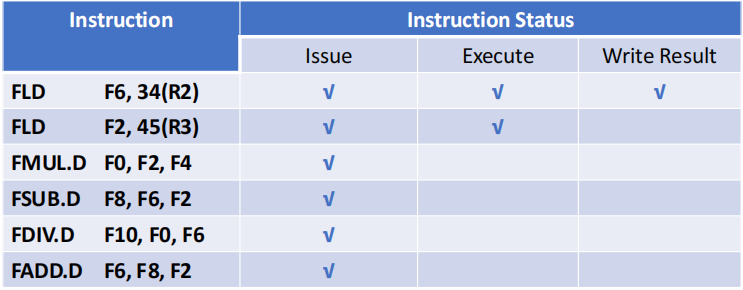{width=65%}
    </figure>

    假设现在第一条 Load 指令已经执行完毕，但第二条指令还没有把结果写回。后续的指令都已经发射，但由于第 3、4 条指令依赖于第二条 Load 指令的结果，第 5、6 条指令依赖于第 3、4 条指令的结果，它们都没有开始执行。

    <figure markdown="span">
        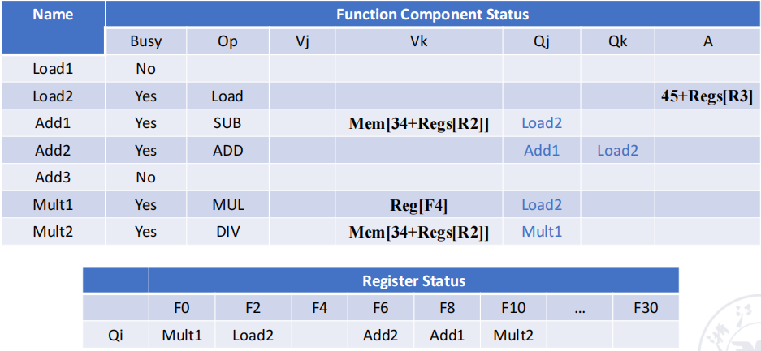{width=65%}
    </figure>

    上面的功能组件表中最左侧为保留站名，Qj、Qk 表示两个源操作数的数据依赖于哪一条指令

    <figure markdown="span">
        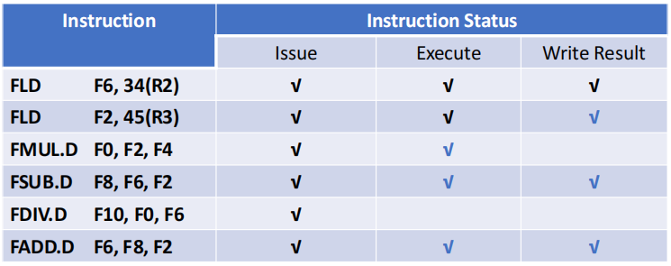{width=65%}
    </figure>

    <figure markdown="span">
        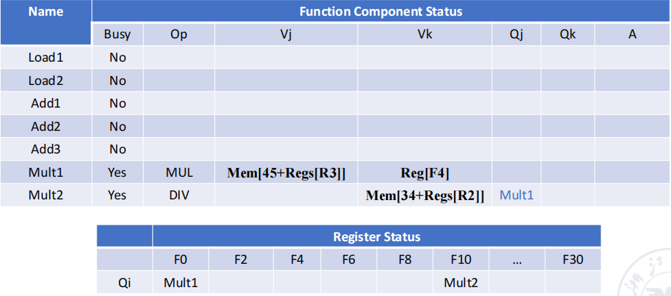{width=65%}
    </figure>

    经过若干个周期后，现在我们可以看到此时所有的名相关都已经不存在了。在指令 5 放入保留站时，它已经获取了 F6 的值并且放入了保留站中，此时无论指令 6 是否在指令 5 开始执行前就写回，都不会影响指令 5 的操作数，这就消除了它们之间的依赖关系。

!!! tip
    指令在执行完毕后未必能立即从保留站中离开，它们需要按照进入保留站的顺序依次离开。如果后进入的指令先执行完毕，就需要等待前面的指令执行完毕并离开后才能离开保留站。

!!! summary

    1. Tomasula's Algorithm main contributions
        - Dynamic scheduling
        - Register renaming —— eliminating WAW and WAR hazards
        - Load/store disambiguation
        - Better than Scoreboard Algorithm
    2. Tomasulo's Algorithm major defects
        - Structural complexity.
        - Its performance is limited by Common Data Bus.
        - A load and a store can safely be done out of order, provided they access different addresses. If a load and a store access the same address, theeither:
            - The load is before the store in program order and interchanging them results in aWAR hazard, or
            - The store is before the load in program order and interchanging them results in aRAW hazard
            - Interchanging two stores to the same address results in a WAW hazard
    3. The limitations on ILP approaches directly led to the movement to multicore.

## Hardware-Based Speculation

为了保证程序的正确性，我们希望即使指令是乱序执行的，它们**完成**的顺序也应该是和原始程序的顺序一致。为了做到这一点，我们需要添加一个 reorder buffer（ROB），它的作用是跟踪指令的完成顺序，并在指令完成后将结果写回到寄存器中。

当指令执行完毕后，先把结果写入 ROB 中，buffer 中的指令应该按照指令流出的顺序依次写回寄存器中。因此我们需要给每个指令都记录一个 commit 状态，当之前的所有指令都 commit 了之后，当前指令才能 commit。

<figure markdown="span">
    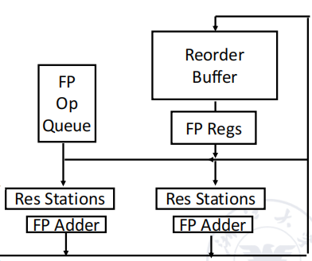{width=60%}
</figure>

添加了 ROB 后，使用托马斯洛算法的浮点运算单元的基础结构如下：

<figure markdown="span">
    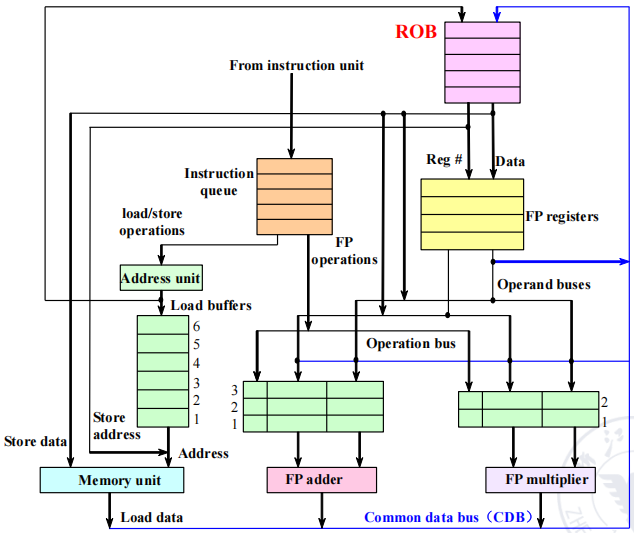{width=65%}
</figure>

- **Issue**：get instruction from FP Op Queue
- **Execution**：operate on operands (EX)
- **Write result**：finish execution (WB)
- **Commit**：update register with reorder result

Hardware-based speculation combines three key ideas
- dynamic branch prediction to choose which instructions to execute
- speculation to allow the execution of instructions before the control dependences are resolved (with the ability to undo the effects of an incorrectly speculated sequence)
- dynamic scheduling to deal with the scheduling of different combinations of basic blocks

添加 ROB 后的 IS 和 EX 阶段与 Tomasulo's Approach 一致，不同的是在 WB 阶段给指令增加了一个 commit 状态，当指令 commit 之后才可以把结果写回寄存器。

- WB
    - The ROB holds the result of an instruction between the time the operation associated with the instruction completes and the time the instruction commits

        在指令执行完毕但还未 commit 时，指令的结果会被保存在 ROB 中。

    - The ROB is a source of operands for instructions, just as the reservation stations provide operands in Tomasulo’s algorithm.

        ROB 也可以像保留站一样作为指令的操作数来源

- instruction commit 
    - The key idea behind implementing speculation is to allow instructions to execute out of order but to force them to commit in order and to prevent any irrevocable action (such as updating state or taking an exception) until an instruction commits.

        指令可以乱序执行，但必须按发射顺序提交，以此防止出现不可挽回的错误

    - The reorder buffer (ROB) provides additional registers in the same way as the reservation stations in Tomasulo’s algorithm extend the register set.

!!! example
    ```asm
    FLD F6,34(R2)
    FLD F2,45(R3)
    FMUL.D F0,F2,F4
    FSUB.D F8,F2,F6
    FDIV.D F10,F0,F6
    FADD.D F6,F8,F2
    ```

    还是我们之前的两个例子中的程序，现在我们可以看一看当 FMUL.D 准备好 commit 时各个状态表中的内容

    <figure markdown="span">
        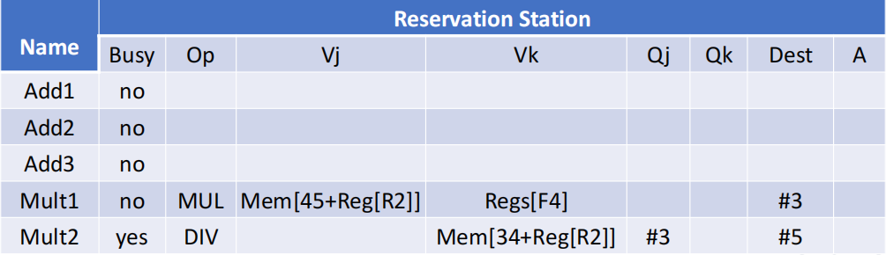{width=65%}
    </figure>

    <figure markdown="span">
        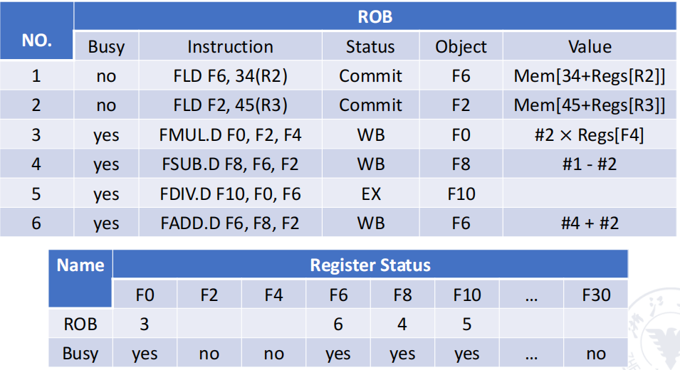{width=65%}
    </figure>

    - 上图中 Dest 表示的是第几条指令
    - busy 一列指的是当前还在执行（即还未 commit）的指令

!!! example "Practice in Class"
    <figure markdown="span">
        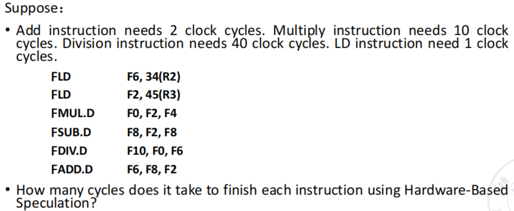{width=70%}
    </figure>

    假设 ADD/SUB 的 EX 阶段需要 2 个周期，MUL 的 EX 阶段需要 10 个周期，DIV 的 EX 阶段需要 40 个周期，Load 的 EX 阶段需要 1 个周期。

    <figure markdown="span">
        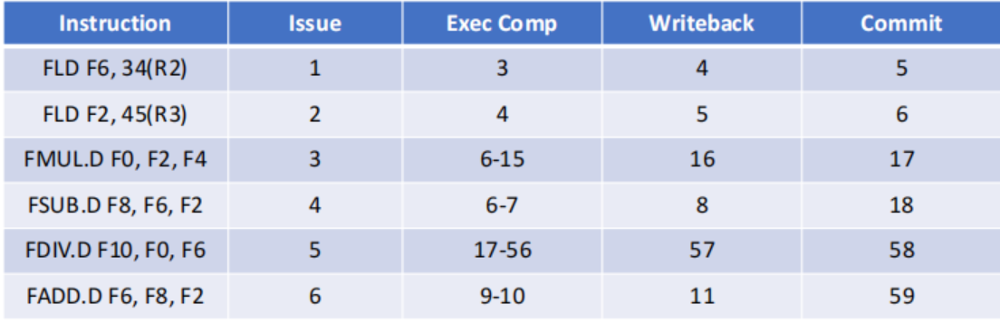{width=70%}
    </figure>

    - 需要注意的是，由于 load/store 执行还需要计算内存地址，因此 EX 阶段会晚一个周期开始
    - 实际上前几个阶段的执行和 Tomasulo's Approach 是一样的，只是需要在最后添加一个 commit 阶段，并且保证提交顺序与流出顺序一致即可
    - In-order Issue/Commit, Out-of-Order Execution/Writeback

- Instructions are finished in order according to ROB 
- It can be precise exception. 
- It is easily extended to integer register and integer function unit.
- But the hardware is too complex.

## Exploiting ILP Using Multiple Issue and Static Scheduling

multiple issue（多流出/多发射）是指在一个时钟周期内发射多条指令。它可以分为两种类型：

- **Superscalar**: multiple instructions from the same instruction stream are issued in a single cycle.

    一个周期可以发射多条指令，并且发射的指令数目不是固定的，取决于特定的代码环境。

    发射的指令数目会有一个上限（1-8 条指令），如果上限为 n，则称为 n 发射超标量处理器

    - 静态调度超标量：编译器在编译时就决定了发射的指令数目
    - 动态调度超标量：在运行时决定发射的指令数目，通过硬件来完成

- **VLIW(Very Long Instruction Word)**:

    超长指令字，通过编译器来决定发射的指令数目。
    
    每个时钟周期发射的指令条数是固定的，编译器会把多条指令打包成一条长指令，从而实现多发射。

<figure markdown="span">
    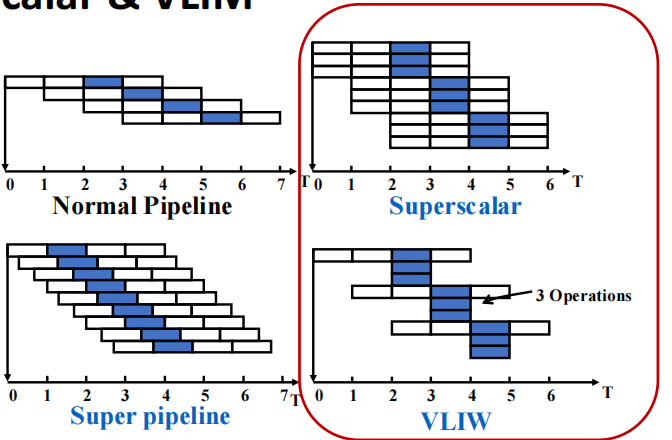{width=60%}
</figure>

!!! extra "Super pipelined"
    - 包含 8 个或更多个流水线阶段的处理器被称为**超流水线处理器**（super pipelined processor）
    - 把传统流水线阶段分解为更多更简单的子阶段，，可以让每个阶段的工作量更少，从而提升时钟频率

    如下图所示，我们在小于一个阶段用时的时间段 $\Delta t$ 后，就发射下一条指令

    <figure markdown="span">
        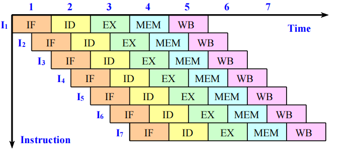{width=60%}
    </figure>

    实际上做的是对流水线的再细分，例如下图是 MIPS R4000 流水线结构的示意图

    <figure markdown="span">
        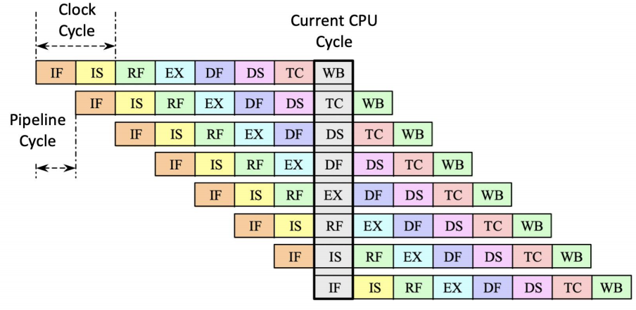{width=60%}
    </figure>
