# DLP and TLP

!!! abstract "Flynn 分类法"
    Flynn 分类法按照指令和数据流不同的组织方式，将计算机系统分为四类：

    - SISD（Single Instruction Single Data）：单指令单数据流，传统的单核处理器。
    - SIMD（Single Instruction Multiple Data）：单指令多数据流，适用于向量处理器和图形处理器。
    - MISD（Multiple Instruction Single Data）：多指令单数据流，较少见，通常用于冗余计算。
    - MIMD（Multiple Instruction Multiple Data）：多指令多数据流，现代多核处理器。

    <figure markdown="span">
        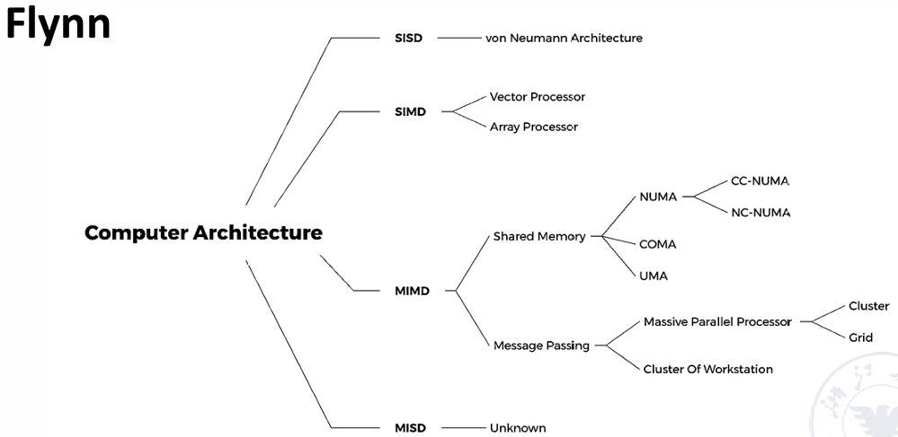{width=80%}
    </figure>

## SIMD: vector processor

### Vector Processor & Scalar Processor 

- **向量处理器（vector processor）**：具有向量数据表示和相应的向量指令的*流水线处理器*。
- **标量处理器（scalar processor）**：没有向量数据表示和相应的向量指令的*流水线处理器*。

它们通常有三种处理数据的模式：

1. Horizontal processing method
    - Vector calculations are performed horizontally from left to right in a row.
        - 每行从左到右横向计算，一行计算完毕后才开始下一行。
    - Problems with horizontal processing:
        - 每部分计算都会出现 RAW（Read After Write）数据依赖，流水线效率低下
        - 若使用静态多功能流水线（static multi-functional pipeline），每次切换功能部件都需要排空流水线，这样的效率甚至不如顺序执行
        - horizontal processing method 不适用于向量处理器
2. Vertical processing method
    - The vector calculation is performed vertically from top to bottom in a column manner
3. Vertical and horizontal processing method (group processing method)
    - 把上面两种方法结合起来

!!! example
    考虑计算 $D = A \times (B+C)$，向量长度为 $N$

    - Horizontal processing method
        - 分成 $N$ 个 scalar operations，逐行计算
        - 先计算 $d_1 \leftarrow a_1 \times (b_1 + c_1)$，然后计算 $d_2 \leftarrow a_2 \times (b_2 + c_2)$，依次类推
        - 计算过程可以写作：
            - $k_i \leftarrow b_i + c_i$
            - $d_i \leftarrow a_i \times k_i$
        - 会出现 N 次数据相关，需要 2N 次功能切换
    - Vertical processing method
        - 先计算向量加法，再计算向量乘法
        - 计算过程可以写作：
            - $K \leftarrow B + C$
            - $D \leftarrow A \times K$
        - 只会出现 1 次数据相关，和 2 次功能切换
    - Vertical and horizontal processing method
        - 如果 N 很大，一个向量无法容纳所有数据，那么数据分成多个组
        - $N = S \times n + r$，即分成 $S$ 组，每组 $n$ 个元素，最后剩下的一组可能有 $r$ 个元素
        - 组内做纵向计算，组间做横向计算
        - S+1 次数据相关，和 2(S+1) 次功能切换


- 方法二操作要求处理器结构为 **memory-memory structure**：
    - 源向量和目标向量都要存储在内存中，计算的中间结果也要写回到内存里

    <figure markdown="span">
        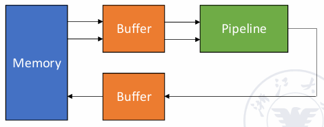{width=80%}
    </figure>

- 方法三操作要求处理器结构为 **register-register structure**：
    - 使用可以快速访问的向量寄存器，用于存储源向量、目标向量和中间结果
    - 计算组件的输入输出端直接与向量寄存器相连，中间结果直接存储在寄存器中

### Vector Processor Example -- Cray-1

<figure markdown="span">
    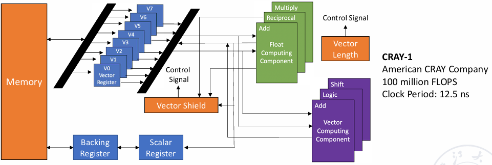{width=80%}
</figure>

- 包含 8 个向量寄存器，每个寄存器可以存储 64 个 64 位的浮点数，寄存器之间通过向量总线连接。
- 有 12 条可以并行执行的单功能流水线

<figure markdown="span">
    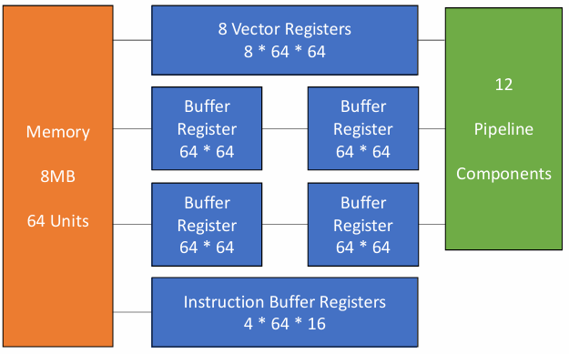{width=65%}
</figure>

- 每个向量寄存器 $V_i$ 都有单独的一个总线，连接至 6 个功能部件
- 每个向量功能部件也有一个总线，用于将计算结果返回给向量寄存器总线
- 当没有出现 $V_i$ 冲突和功能冲突时，每个向量寄存器 $V_i$ 和每个功能部件都可以并行工作

!!! info
    - **$V_i$ conflict**: The source vector or result vector of each vector instruction working in parallel uses the same $V_i$

        - 即向量寄存器之间的使用存在依赖，后续指令需要等待前面指令的执行完成后再执行
        - 向量元素级别的等待，即前面的指令的第一个元素计算完成后，就开始计算后面指令的第一个元素
        - Writing and reading data related
            $$ V0 \leftarrow V1 + V2 $$
            $$ V3 \leftarrow V0 + V4 $$
        - Reading data related
            $$ V0 \leftarrow V1 + V2 $$
            $$ V3 \leftarrow V1 \times V4 $$

    - **Functional conflict**: Each vector instruction working in parallel must use the same functional unit

        - 多条指令需要使用同一个功能部件
        - 只能等待前面的指令彻底执行完毕后（最后一个元素计算完成）才能开始执行后续指令
        - 例如当我们只有一个乘法单元时，下面的指令就会出现功能冲突：
            $$ V0 \leftarrow V1 + V2 $$
            $$ V3 \leftarrow V4 \times V5 $$

#### Instruction Types of CRAY-1

<figure markdown="span">
    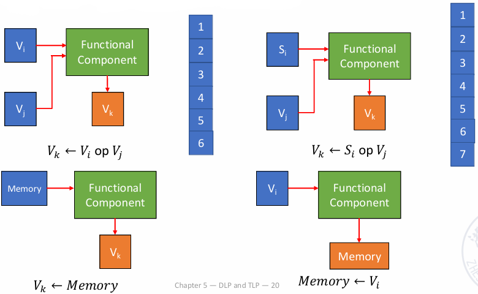{width=70%}
</figure>

向量加法需要 6 个周期，乘法需要 7 个周期，内存读写需要 6 个周期。

#### Improve the Performance of Vector Processor

- Set up multiple functional components and make them work in parallel.
- Use vector chaining technology to speed up the execution of a string of vector instructions.
- Adopt recycling mining technology to speed up recycling processing.
- Using a multi-processor system to further improve the performance.

第 1、3、4 种方法实际上都是增加硬件资源，在这里我们主要介绍第 2 种方法

!!! tip "Vector Chaining"
    - 向量链接（vector chaining）是指将一个向量指令的结果直接作为下一个向量指令的输入，而不需要将结果写回到寄存器或内存中。
    - 例如我们有两条指令，第一条指令的计算结果是第二条指令的输入。那么我们就可以把这两条指令链接起来，第一条指令每计算出一个元素，就立即传递给第二条指令，从而实现类似于流水线的连续执行。

!!! example
    考虑 $D = A \times (B+C)$，假设向量长度 $N \leqslant 64$，元素均为浮点数，$B$ 和 $C$ 分别存储在寄存器 $V_0$ 和 $V_1$ 中

    我们可以按照如下的方法计算：

    ```asm
    V3 <- memory    // access vector A
    V2 <- V0 + V1   // Vector B and Vector C perform floating point addition
    V4 <- V3 * V2   // Floating point multiplication, the result is stored in V4
    ```

    前两条指令不存在冲突，可以并行执行；第三条指令 RAW 依赖于前两条指令，但是我们可以将它们连接起来

    <figure markdown="span">
        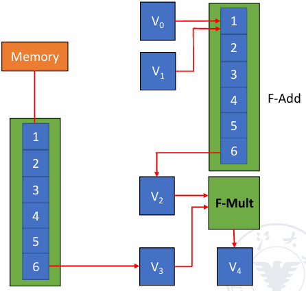{width=70%}
    </figure>

    > 假设把向量元素数据送到功能部件、把向量元素数据存储到向量寄存器中、把数据从内存中送到 fetch function unit 里都需要一拍

    - 路径一：1 拍从内存到 fetch function unit，6 拍进行取数据操作，1 拍把取出的数据送至 V3
    - 路径二：1 拍将数据从 V0 和 V1 送到加法单元，6 拍进行加法操作，1 拍把加法结果送至 V2

    两条路径花费的时间都是 8 拍，因此在第 9 拍乘法单元就可以开始计算

!!! question 
    考虑下面的指令，它们在不同情况下执行花费的总时间是多少？

    ```asm
    V3 <- memory
    V2 <- V0 + V1
    V4 <- V3 * V2
    ```

    1. 指令顺序执行

        经过 8 拍后第一个元素从内存中被取出，在经过 N-1 拍后所有元素都被取出，共需要 (1+6+1)+N-1 拍，后面的两条指令类似。

        于是我们可以知道总共需要的拍数为
        $$[(1+6+1)+N-1] + [(1+6+1)+N-1] + [(1+7+1)+N-1] = 3N+22 $$

    2. 并行执行前两条指令，然后再执行最后一条指令

        需要的拍数为：
        $$ \max\{ [(1+6+1)+N-1], [(1+6+1)+N-1] \} + [(1+7+1)+N-1] = 2N+15 $$

    3. 采用向量链接技术

        我们只需要直到 V4 的第一个元素需要多长时间被计算出来即可：(1+6+1)+(1+7+1)=17 拍，随后还有 N-1 个元素需要计算，因此总拍数为 N+16

## SIMD: array processor 

阵列处理器：N 个处理单元（processing element, PE）会组成一个处理器阵列，从 $PE_0$ 到 $PE_{N-1}$，每个处理单元都可以独立地执行指令。

- 阵列之间有通信通道，将处理元素连接起来
- 每个阵列都使用一个单一的控制单元来控制所有处理单元，使得指令可以并行地运行
- 有时阵列处理器也被称为并行处理器（parallel processor）

根据内存在系统中的布局，阵列处理器可以被分为两类：

- Distributed memory
- Centralized shared memory

### Distributed Memory

<figure markdown="span">
    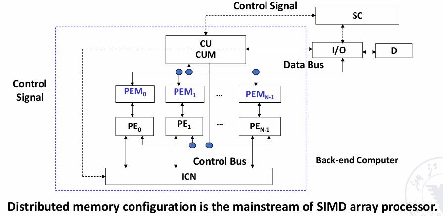{width=70%}
</figure>

PE 是处理单元，PEM 是处理单元对应的内存，CU 是控制单元，CUM 是控制单元的内存，ICN 是内部控制的互联网络

### Centralized Shared Memory

<figure markdown="span">
    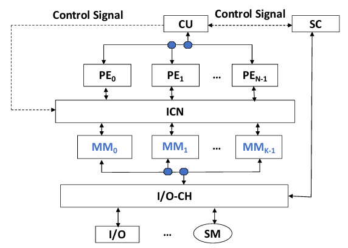{width=70%}
</figure>

多个处理器阵列通过一个互联网络共享一个中央内存，所有处理器阵列都可以访问这个中央内存。

### Parallel Computer Design

上面这两种设计都需要把处理单元连接起来，假设有 n 个处理单元，如果我们让它们两两相连，那就需要 $C_n^2 = \dfrac{n(n-1)}{2}$ 个连接，这样的开销很大且难以实现。

!!! definition
    A network composed of switching units according to a certain topology and control mode to realize the interconnection between multiple processors or multiple functional components within a computer system.

    我们使用一个网络图（network graph）来表示处理单元之间的连接关系，其中每个节点表示一个处理单元，每条边表示两个处理单元之间的连接。

一个互联网络主要由一个部分组成：CPU, memory, interface, link and switch node

!!! tip "Some key points"
    - Topology of interconnection network
        - Static topology

            静态拓扑，即处理单元之间的连接关系在设计时就已经确定，并且在运行时不会改变。

        - Dynamic topology

            动态拓扑，即处理单元之间的连接可以在运行时根据需要进行调整，例如通过调整开关可以改变节点之间的连接关系。

    - Timing mode of interconnection network
        - Synchronization system: Use a unified clock. Such as SIMD array processor

            同步系统，即所有处理单元都使用同一个时钟信号来同步工作，所有处理单元在同一时刻执行相同的指令。

        - Asynchronous system: No uniform clock. Each processor in the system works independently

            异步系统，即每个处理单元都可以独立地工作，没有统一的时钟信号。每个处理单元可以根据自己的时钟信号来执行指令。

    - Exchange method of interconnection network
        - Circuit switching
        - Packet switching
    - Control Strategy of interconnection network
        - Centralized control mode: 有一个全局控制器来管理所有处理单元的工作
        - Distributed control mode: 没有全局控制器

### Goal of interconnection network

- Single-stage interconnection network: There are only a limited number of connections at the only level to realize information transmission between any two processing units.

    单级连接，只有有限数量的连接

- Multi-stage interconnection network: It is composed of multiple single-level networks in series to realize the connection between any two processing units.

    多级连接，把多个单级网络串联起来

N 个入端和 N 个出端会建立一个映射关系 $j \to f(j)$，入端和出端通常都使用二进制来进行编码，这个映射关系被称为互连函数（interconnection function）。

### Single-stage interconnection network

<figure markdown="span">
    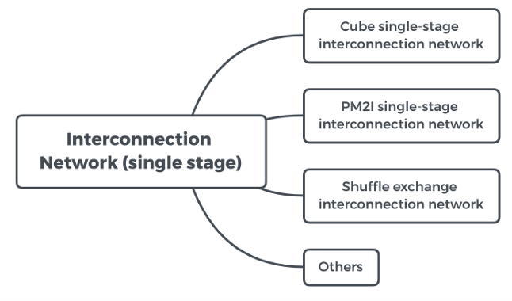{width=70%}
</figure>

#### Cube

假设有 N 个入端和出端，我们使用 n-bit 来对它们进行编码（$n = \log_2 N$），表示为 $P_{n-1} \cdots P_1 P_0$

那么我们就有 n 个不同的互连函数（对第 i 位取反）：
    $$ Cube_i(P_{n-1} \cdots P_i \cdots P_0) = P_{n-1} \cdots \overline{P_i} \cdots P_0 $$

!!! example
   
    <figure markdown="span">
        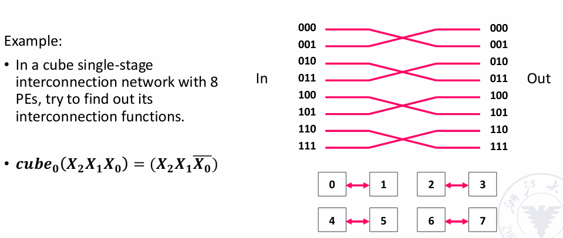{width=70%}
    </figure> 

    <figure markdown="span">
        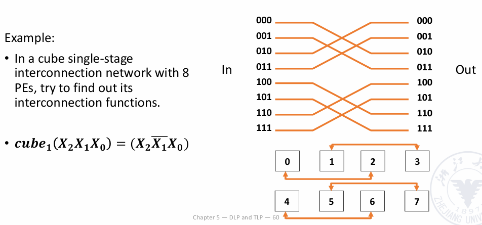{width=70%}
    </figure> 

    <figure markdown="span">
        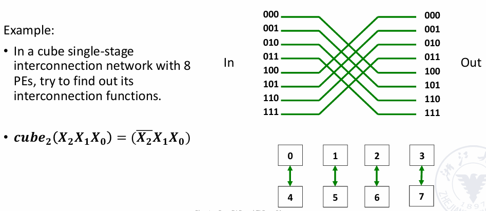{width=70%}
    </figure> 

<figure markdown="span">
    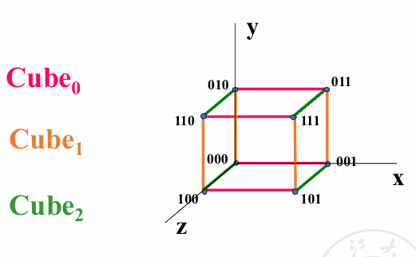{width=70%}
</figure> 

- 当 n=3 时，网络的连接情况看起来就像是一个立方体，这也就是 cube 这一名称的由来，从一个节点到另一个节点至多需要经过 3 条边。
- 不难发现，当我们使用 Cube 连接时，任意两个节点之间的距离（即需要经过的边数）最多为 n。

#### PM2I

- **PM2I**：Plus Minus $2^i$
- 互联网络共有 2n 种：
    $$ PM2_{+i}(j) = (j + 2^i) \mod N $$
    $$ PM2_{-i}(j) = (j - 2^i) \mod N $$

    其中 N 为互联网络中的节点数量，$0 \leqslant j \leqslant N-1$，$0 \leqslant i \leqslant n-1$

!!! example
    - N = 8

    <figure markdown="span">
        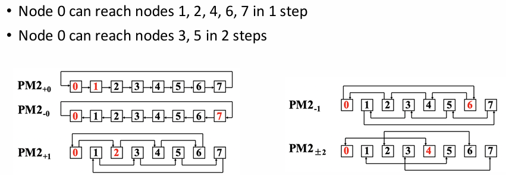{width=70%}
    </figure> 

#### Shuffle exchange network

顾名思义，Shuffle exchange network 主要由两部分组成：shuffle + exchange

- **Shuffle**：将输入数据进行打乱，一般将输入数据的二进制编码进行循环左移或右移
- **Exchange**：将打乱后的数据进行交换，交换的方式通常是是将相邻的两个数据进行交换

$$ Shuffle(P_{n-1} \cdots P_1 P_0) = P_{n-2} \cdots P_1 P_0 P_{n-1} $$

!!! example
    - N = 8

    <figure markdown="span">
        {width=70%}
    </figure> 

不难发现，000 和 111 与其他任何节点都不相连，因此我们还需要在此基础上增加 exchange 的连线

<figure markdown="span">
    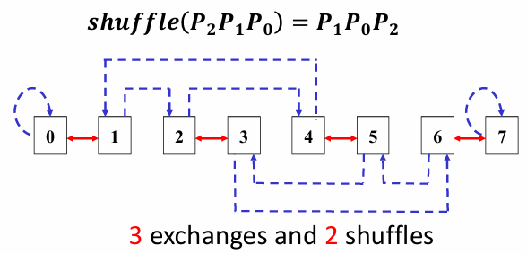{width=70%}
</figure> 

- 任意两个节点相连至多需要经过 3 exchange + 2 shuffle，总共需要 5 条边。
- 更一般的，任意两个节点之间的距离（即需要经过的边数）最多为 n exchange + n-1 shuffle，总共需要 2n-1 条边。

??? extra "其他连接方式"
    - Linear array

        开销低，但任意节点出现问题都会导致整个网络崩溃

        <figure markdown="span">
            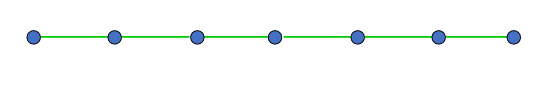{width=70%}
        </figure>

    - Circular array

        也可以在环上增加一些弦来提高连接效率

        <figure markdown="span">
            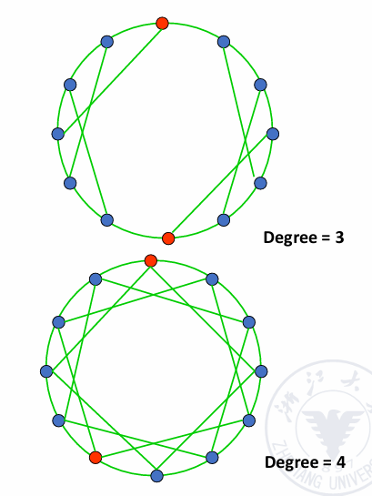{width=70%}
        </figure>

    - Tree array

        <figure markdown="span">
            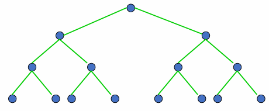{width=70%}
        </figure>

        可以拓展为 Tree with loop、Binary fat tree

        <figure markdown="span">
            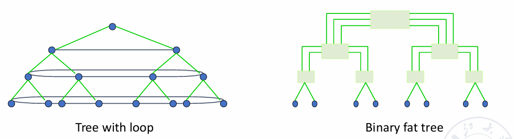{width=70%}
        </figure>

    - Star array

        <figure markdown="span">
            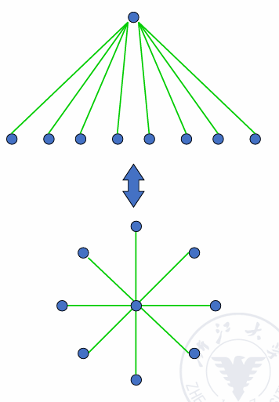{width=70%}
        </figure>

    - Grid

        <figure markdown="span">
            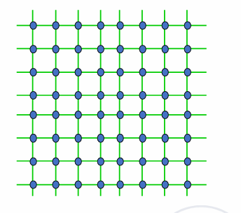{width=70%}
        </figure>

    - Cube with loop

        <figure markdown="span">
            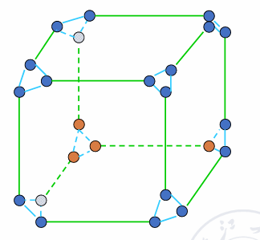{width=70%}
        </figure>

    <figure markdown="span">
        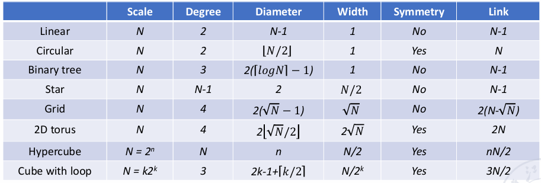{width=80%}
    </figure>

### Multi-stage interconnection network

<figure markdown="span">
    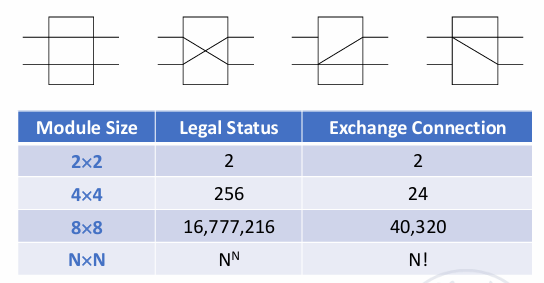{width=80%}
</figure>

通过交叉开关来控制网络之间的连接方式，开关的控制也有很多方式：

- 每个开关都有自己的控制器
- 使用一个全局控制器来控制所有开关
- 介于上面两者之间，将开关分级，每一级的开关都相同

最常用的方式是级控制，每一级开关的状态都是相同的

<figure markdown="span">
    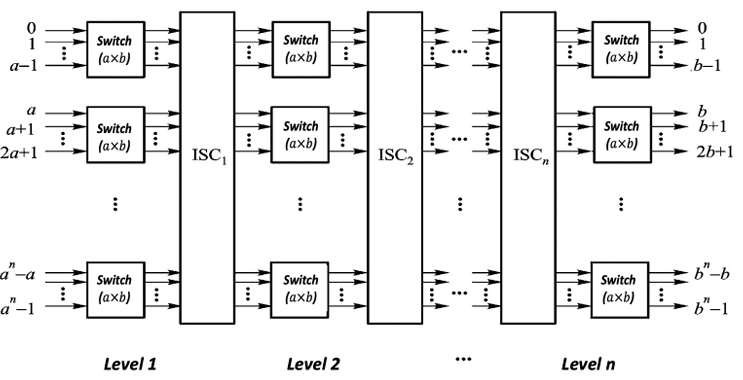{width=65%}
</figure>

#### Switching unit

- 带有两个输入和两个输出的控制单元是多级互连网络的基本组件
- 下面四种连接状态分别为：

    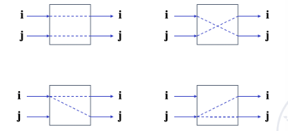{align=right width=35%}

    - Straight
    - Exchange
    - Upper broadcast
    - Lower broadcast


- 如果只有 Straight 和 Exchange 两种连接状态，我们称其为 **two-function switch unit**
- 如果上面四种连接状态都有，我们称其为 **four-function switch unit**。

随着入端和出端数量的增加，还可以有其他的连接状态：

<figure markdown="span">
    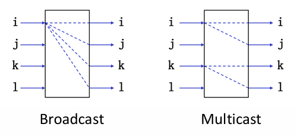{width=60%}
</figure>

#### Multi-stage cube interconnection network

我们假设：

- Switch unit: two-function switch unit
- Control mode: stage, part stage and unit control
- Topology: cube structure

如果有 N 个输入，我们需要把开关分为 $n = \log_2 N$ 级，每一级有 $2^{n-1}$ 个开关，每个开关有两个输入和两个输出。

<figure markdown="span">
    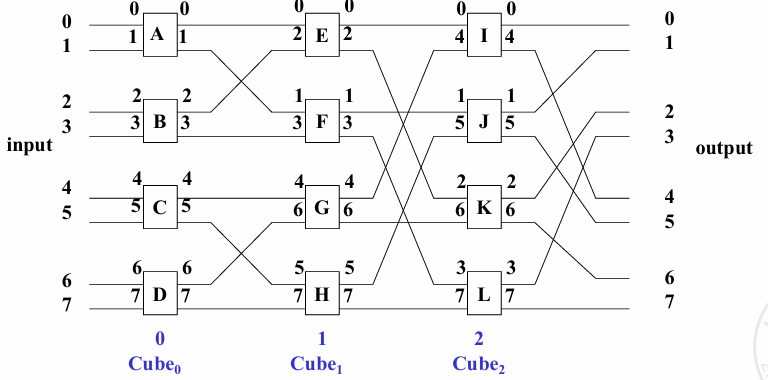{width=70%}
</figure>

上图中的开关与开关之间的连线方式是固定的，但是开关内部对于两个输入和两个输出的连接方式是可以改变的，因此我们可以通过控制开关的状态来实现不同的连接方式。

!!! note "不同连接方式对应的互连函数"
    <figure markdown="span">
        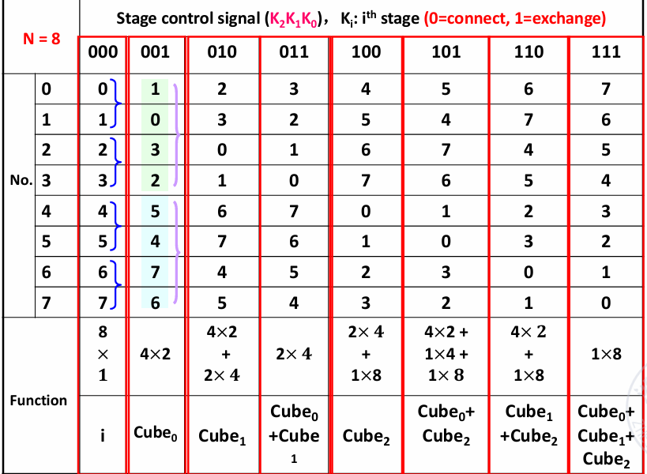{width=70%}
    </figure>

    因为这是 two-function switch unit，我们用 0 表示 connect，1 表示 exchange，那么上图中的每一列都对应一种连接方式。
    
    可以看到我们可以通过改变开关的状态来实现各种不同的连接方式。

#### Multi-stage shuffle exchange network

也被称为 **Omega network**

- The switch function has four functions
- The topological structure is shuffled topology followed by a four function switch
- Control mode is unit control

<figure markdown="span">
    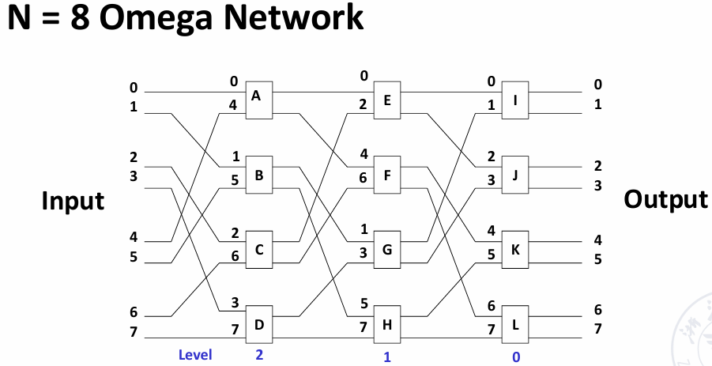{width=70%}
</figure>

!!! tip
    如果我们限定 omega network 也只能使用直连和交换两种模式，那么我们可以看到它就是 cube network 的逆网络

    <figure markdown="span">
        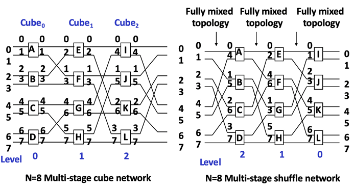{width=70%}
    </figure>

    Omega network 与 n-cube network 的不同之处在于：

    - The level of Omega network data flow: n-1, n-2,..., 1, 0.

        The level of n-cube network data flow: 0, 1,..., n-1.

    - The Omega network uses a **four-function exchange unit**.

        The n-cube network uses a **two-function exchange unit**.

    - Omega network **can** realize **one-to-many** broadcasting function.
    
        N-cube network **cannot** achieve.

<figure markdown="span">
    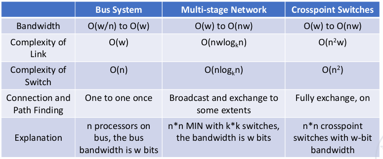{width=80%}
</figure>

## DLP in GPU


