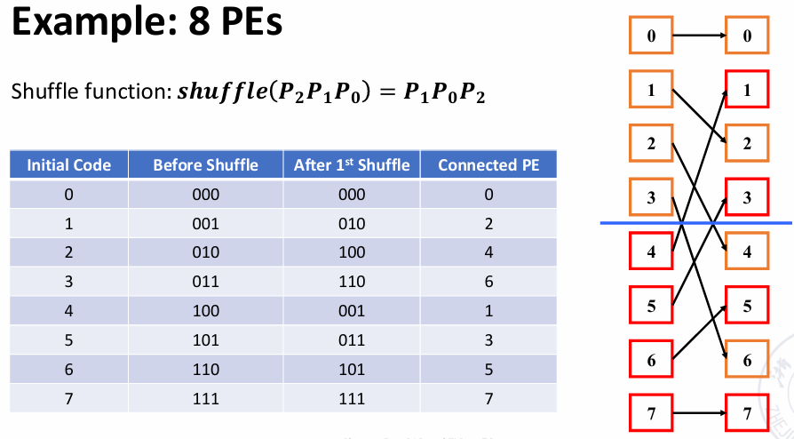
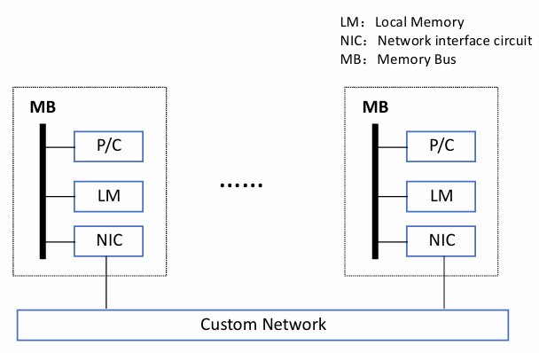

# DLP and TLP

!!! abstract "Flynn 分类法"
    Flynn 分类法按照指令和数据流不同的组织方式，将计算机系统分为四类：

    - SISD（Single Instruction Single Data）：单指令单数据流，传统的单核处理器。
    - SIMD（Single Instruction Multiple Data）：单指令多数据流，适用于向量处理器和图形处理器。
    - MISD（Multiple Instruction Single Data）：多指令单数据流，较少见，通常用于冗余计算。
    - MIMD（Multiple Instruction Multiple Data）：多指令多数据流，现代多核处理器。

    <figure markdown="span">
        {width=80%}
    </figure>

## SIMD: vector processor

### Vector Processor & Scalar Processor 

- **向量处理器（vector processor）**：具有向量数据表示和相应的向量指令的*流水线处理器*。
- **标量处理器（scalar processor）**：没有向量数据表示和相应的向量指令的*流水线处理器*。

它们通常有三种处理数据的模式：

1. Horizontal processing method
    - Vector calculations are performed horizontally from left to right in a row.
        - 每行从左到右横向计算，一行计算完毕后才开始下一行。
    - Problems with horizontal processing:
        - 每部分计算都会出现 RAW（Read After Write）数据依赖，流水线效率低下
        - 若使用静态多功能流水线（static multi-functional pipeline），每次切换功能部件都需要排空流水线，这样的效率甚至不如顺序执行
        - horizontal processing method 不适用于向量处理器
2. Vertical processing method
    - The vector calculation is performed vertically from top to bottom in a column manner
3. Vertical and horizontal processing method (group processing method)
    - 把上面两种方法结合起来

!!! example
    考虑计算 $D = A \times (B+C)$，向量长度为 $N$

    - Horizontal processing method
        - 分成 $N$ 个 scalar operations，逐行计算
        - 先计算 $d_1 \leftarrow a_1 \times (b_1 + c_1)$，然后计算 $d_2 \leftarrow a_2 \times (b_2 + c_2)$，依次类推
        - 计算过程可以写作：
            - $k_i \leftarrow b_i + c_i$
            - $d_i \leftarrow a_i \times k_i$
        - 会出现 N 次数据相关，需要 2N 次功能切换
    - Vertical processing method
        - 先计算向量加法，再计算向量乘法
        - 计算过程可以写作：
            - $K \leftarrow B + C$
            - $D \leftarrow A \times K$
        - 只会出现 1 次数据相关，和 2 次功能切换
    - Vertical and horizontal processing method
        - 如果 N 很大，一个向量无法容纳所有数据，那么数据分成多个组
        - $N = S \times n + r$，即分成 $S$ 组，每组 $n$ 个元素，最后剩下的一组可能有 $r$ 个元素
        - 组内做纵向计算，组间做横向计算
        - S+1 次数据相关，和 2(S+1) 次功能切换


- 方法二操作要求处理器结构为 **memory-memory structure**：
    - 源向量和目标向量都要存储在内存中，计算的中间结果也要写回到内存里

    <figure markdown="span">
        {width=80%}
    </figure>

- 方法三操作要求处理器结构为 **register-register structure**：
    - 使用可以快速访问的向量寄存器，用于存储源向量、目标向量和中间结果
    - 计算组件的输入输出端直接与向量寄存器相连，中间结果直接存储在寄存器中

### Vector Processor Example -- Cray-1

<figure markdown="span">
    {width=80%}
</figure>

- 包含 8 个向量寄存器，每个寄存器可以存储 64 个 64 位的浮点数，寄存器之间通过向量总线连接。
- 有 12 条可以并行执行的单功能流水线

<figure markdown="span">
    {width=65%}
</figure>

- 每个向量寄存器 $V_i$ 都有单独的一个总线，连接至 6 个功能部件
- 每个向量功能部件也有一个总线，用于将计算结果返回给向量寄存器总线
- 当没有出现 $V_i$ 冲突和功能冲突时，每个向量寄存器 $V_i$ 和每个功能部件都可以并行工作

!!! info
    - **$V_i$ conflict**: The source vector or result vector of each vector instruction working in parallel uses the same $V_i$

        - 即向量寄存器之间的使用存在依赖，后续指令需要等待前面指令的执行完成后再执行
        - 向量元素级别的等待，即前面的指令的第一个元素计算完成后，就开始计算后面指令的第一个元素
        - Writing and reading data related
            $$ V0 \leftarrow V1 + V2 $$
            $$ V3 \leftarrow V0 + V4 $$
        - Reading data related
            $$ V0 \leftarrow V1 + V2 $$
            $$ V3 \leftarrow V1 \times V4 $$

    - **Functional conflict**: Each vector instruction working in parallel must use the same functional unit

        - 多条指令需要使用同一个功能部件
        - 只能等待前面的指令彻底执行完毕后（最后一个元素计算完成）才能开始执行后续指令
        - 例如当我们只有一个乘法单元时，下面的指令就会出现功能冲突：
            $$ V0 \leftarrow V1 + V2 $$
            $$ V3 \leftarrow V4 \times V5 $$

#### Instruction Types of CRAY-1

<figure markdown="span">
    {width=70%}
</figure>

向量加法需要 6 个周期，乘法需要 7 个周期，内存读写需要 6 个周期。

#### Improve the Performance of Vector Processor

- Set up multiple functional components and make them work in parallel.
- Use vector chaining technology to speed up the execution of a string of vector instructions.
- Adopt recycling mining technology to speed up recycling processing.
- Using a multi-processor system to further improve the performance.

第 1、3、4 种方法实际上都是增加硬件资源，在这里我们主要介绍第 2 种方法

!!! tip "Vector Chaining"
    - 向量链接（vector chaining）是指将一个向量指令的结果直接作为下一个向量指令的输入，而不需要将结果写回到寄存器或内存中。
    - 例如我们有两条指令，第一条指令的计算结果是第二条指令的输入。那么我们就可以把这两条指令链接起来，第一条指令每计算出一个元素，就立即传递给第二条指令，从而实现类似于流水线的连续执行。

!!! example
    考虑 $D = A \times (B+C)$，假设向量长度 $N \leqslant 64$，元素均为浮点数，$B$ 和 $C$ 分别存储在寄存器 $V_0$ 和 $V_1$ 中

    我们可以按照如下的方法计算：

    ```asm
    V3 <- memory    // access vector A
    V2 <- V0 + V1   // Vector B and Vector C perform floating point addition
    V4 <- V3 * V2   // Floating point multiplication, the result is stored in V4
    ```

    前两条指令不存在冲突，可以并行执行；第三条指令 RAW 依赖于前两条指令，但是我们可以将它们连接起来

    <figure markdown="span">
        {width=70%}
    </figure>

    > 假设把向量元素数据送到功能部件、把向量元素数据存储到向量寄存器中、把数据从内存中送到 fetch function unit 里都需要一拍

    - 路径一：1 拍从内存到 fetch function unit，6 拍进行取数据操作，1 拍把取出的数据送至 V3
    - 路径二：1 拍将数据从 V0 和 V1 送到加法单元，6 拍进行加法操作，1 拍把加法结果送至 V2

    两条路径花费的时间都是 8 拍，因此在第 9 拍乘法单元就可以开始计算

!!! question 
    考虑下面的指令，它们在不同情况下执行花费的总时间是多少？

    ```asm
    V3 <- memory
    V2 <- V0 + V1
    V4 <- V3 * V2
    ```

    1. 指令顺序执行

        经过 8 拍后第一个元素从内存中被取出，在经过 N-1 拍后所有元素都被取出，共需要 (1+6+1)+N-1 拍，后面的两条指令类似。

        于是我们可以知道总共需要的拍数为
        $$[(1+6+1)+N-1] + [(1+6+1)+N-1] + [(1+7+1)+N-1] = 3N+22 $$

    2. 并行执行前两条指令，然后再执行最后一条指令

        需要的拍数为：
        $$ \max\{ [(1+6+1)+N-1], [(1+6+1)+N-1] \} + [(1+7+1)+N-1] = 2N+15 $$

    3. 采用向量链接技术

        我们只需要直到 V4 的第一个元素需要多长时间被计算出来即可：(1+6+1)+(1+7+1)=17 拍，随后还有 N-1 个元素需要计算，因此总拍数为 N+16

## SIMD: array processor 

阵列处理器：N 个处理单元（processing element, PE）会组成一个处理器阵列，从 $PE_0$ 到 $PE_{N-1}$，每个处理单元都可以独立地执行指令。

- 阵列之间有通信通道，将处理元素连接起来
- 每个阵列都使用一个单一的控制单元来控制所有处理单元，使得指令可以并行地运行
- 有时阵列处理器也被称为并行处理器（parallel processor）

根据内存在系统中的布局，阵列处理器可以被分为两类：

- Distributed memory
- Centralized shared memory

### Distributed Memory

<figure markdown="span">
    {width=70%}
</figure>

PE 是处理单元，PEM 是处理单元对应的内存，CU 是控制单元，CUM 是控制单元的内存，ICN 是内部控制的互联网络

### Centralized Shared Memory

<figure markdown="span">
    {width=70%}
</figure>

多个处理器阵列通过一个互联网络共享一个中央内存，所有处理器阵列都可以访问这个中央内存。

### Parallel Computer Design

上面这两种设计都需要把处理单元连接起来，假设有 n 个处理单元，如果我们让它们两两相连，那就需要 $C_n^2 = \dfrac{n(n-1)}{2}$ 个连接，这样的开销很大且难以实现。

!!! definition
    A network composed of switching units according to a certain topology and control mode to realize the interconnection between multiple processors or multiple functional components within a computer system.

    我们使用一个网络图（network graph）来表示处理单元之间的连接关系，其中每个节点表示一个处理单元，每条边表示两个处理单元之间的连接。

一个互联网络主要由一个部分组成：CPU, memory, interface, link and switch node

!!! tip "Some key points"
    - Topology of interconnection network
        - Static topology

            静态拓扑，即处理单元之间的连接关系在设计时就已经确定，并且在运行时不会改变。

        - Dynamic topology

            动态拓扑，即处理单元之间的连接可以在运行时根据需要进行调整，例如通过调整开关可以改变节点之间的连接关系。

    - Timing mode of interconnection network
        - Synchronization system: Use a unified clock. Such as SIMD array processor

            同步系统，即所有处理单元都使用同一个时钟信号来同步工作，所有处理单元在同一时刻执行相同的指令。

        - Asynchronous system: No uniform clock. Each processor in the system works independently

            异步系统，即每个处理单元都可以独立地工作，没有统一的时钟信号。每个处理单元可以根据自己的时钟信号来执行指令。

    - Exchange method of interconnection network
        - Circuit switching
        - Packet switching
    - Control Strategy of interconnection network
        - Centralized control mode: 有一个全局控制器来管理所有处理单元的工作
        - Distributed control mode: 没有全局控制器

### Goal of interconnection network

- Single-stage interconnection network: There are only a limited number of connections at the only level to realize information transmission between any two processing units.

    单级连接，只有有限数量的连接

- Multi-stage interconnection network: It is composed of multiple single-level networks in series to realize the connection between any two processing units.

    多级连接，把多个单级网络串联起来

N 个入端和 N 个出端会建立一个映射关系 $j \to f(j)$，入端和出端通常都使用二进制来进行编码，这个映射关系被称为互连函数（interconnection function）。

### Single-stage interconnection network

<figure markdown="span">
    {width=70%}
</figure>

#### Cube

假设有 N 个入端和出端，我们使用 n-bit 来对它们进行编码（$n = \log_2 N$），表示为 $P_{n-1} \cdots P_1 P_0$

那么我们就有 n 个不同的互连函数（对第 i 位取反）：
    $$ Cube_i(P_{n-1} \cdots P_i \cdots P_0) = P_{n-1} \cdots \overline{P_i} \cdots P_0 $$

!!! example
   
    <figure markdown="span">
        {width=70%}
    </figure> 

    <figure markdown="span">
        {width=70%}
    </figure> 

    <figure markdown="span">
        {width=70%}
    </figure> 

<figure markdown="span">
    {width=70%}
</figure> 

- 当 n=3 时，网络的连接情况看起来就像是一个立方体，这也就是 cube 这一名称的由来，从一个节点到另一个节点至多需要经过 3 条边。
- 不难发现，当我们使用 Cube 连接时，任意两个节点之间的距离（即需要经过的边数）最多为 n。

#### PM2I

- **PM2I**：Plus Minus $2^i$
- 互联网络共有 2n 种：
    $$ PM2_{+i}(j) = (j + 2^i) \mod N $$
    $$ PM2_{-i}(j) = (j - 2^i) \mod N $$

    其中 N 为互联网络中的节点数量，$0 \leqslant j \leqslant N-1$，$0 \leqslant i \leqslant n-1$

!!! example
    - N = 8

    <figure markdown="span">
        {width=70%}
    </figure> 

#### Shuffle exchange network

顾名思义，Shuffle exchange network 主要由两部分组成：shuffle + exchange

- **Shuffle**：将输入数据进行打乱，一般将输入数据的二进制编码进行循环左移或右移
- **Exchange**：将打乱后的数据进行交换，交换的方式通常是是将相邻的两个数据进行交换

$$ Shuffle(P_{n-1} \cdots P_1 P_0) = P_{n-2} \cdots P_1 P_0 P_{n-1} $$

!!! example
    - N = 8

    <figure markdown="span">
        {width=70%}
    </figure> 

不难发现，000 和 111 与其他任何节点都不相连，因此我们还需要在此基础上增加 exchange 的连线

<figure markdown="span">
    {width=70%}
</figure> 

- 任意两个节点相连至多需要经过 3 exchange + 2 shuffle，总共需要 5 条边。
- 更一般的，任意两个节点之间的距离（即需要经过的边数）最多为 n exchange + n-1 shuffle，总共需要 2n-1 条边。

??? extra "其他连接方式"
    - Linear array

        开销低，但任意节点出现问题都会导致整个网络崩溃

        <figure markdown="span">
            {width=70%}
        </figure>

    - Circular array

        也可以在环上增加一些弦来提高连接效率

        <figure markdown="span">
            {width=70%}
        </figure>

    - Tree array

        <figure markdown="span">
            {width=70%}
        </figure>

        可以拓展为 Tree with loop、Binary fat tree

        <figure markdown="span">
            {width=70%}
        </figure>

    - Star array

        <figure markdown="span">
            {width=70%}
        </figure>

    - Grid

        <figure markdown="span">
            {width=70%}
        </figure>

    - Cube with loop

        <figure markdown="span">
            {width=70%}
        </figure>

    <figure markdown="span">
        {width=80%}
    </figure>

### Multi-stage interconnection network

<figure markdown="span">
    {width=80%}
</figure>

通过交叉开关来控制网络之间的连接方式，开关的控制也有很多方式：

- 每个开关都有自己的控制器
- 使用一个全局控制器来控制所有开关
- 介于上面两者之间，将开关分级，每一级的开关都相同

最常用的方式是级控制，每一级开关的状态都是相同的

<figure markdown="span">
    {width=65%}
</figure>

#### Switching unit

- 带有两个输入和两个输出的控制单元是多级互连网络的基本组件
- 下面四种连接状态分别为：

    {align=right width=35%}

    - Straight
    - Exchange
    - Upper broadcast
    - Lower broadcast


- 如果只有 Straight 和 Exchange 两种连接状态，我们称其为 **two-function switch unit**
- 如果上面四种连接状态都有，我们称其为 **four-function switch unit**。

随着入端和出端数量的增加，还可以有其他的连接状态：

<figure markdown="span">
    {width=60%}
</figure>

#### Multi-stage cube interconnection network

我们假设：

- Switch unit: two-function switch unit
- Control mode: stage, part stage and unit control
- Topology: cube structure

如果有 N 个输入，我们需要把开关分为 $n = \log_2 N$ 级，每一级有 $2^{n-1}$ 个开关，每个开关有两个输入和两个输出。

<figure markdown="span">
    {width=70%}
</figure>

上图中的开关与开关之间的连线方式是固定的，但是开关内部对于两个输入和两个输出的连接方式是可以改变的，因此我们可以通过控制开关的状态来实现不同的连接方式。

!!! note "不同连接方式对应的互连函数"
    <figure markdown="span">
        {width=70%}
    </figure>

    因为这是 two-function switch unit，我们用 0 表示 connect，1 表示 exchange，那么上图中的每一列都对应一种连接方式。
    
    可以看到我们可以通过改变开关的状态来实现各种不同的连接方式。

#### Multi-stage shuffle exchange network

也被称为 **Omega network**

- The switch function has four functions
- The topological structure is shuffled topology followed by a four function switch
- Control mode is unit control

<figure markdown="span">
    {width=70%}
</figure>

!!! tip
    如果我们限定 omega network 也只能使用直连和交换两种模式，那么我们可以看到它就是 cube network 的逆网络

    <figure markdown="span">
        {width=70%}
    </figure>

    Omega network 与 n-cube network 的不同之处在于：

    - The level of Omega network data flow: n-1, n-2,..., 1, 0.

        The level of n-cube network data flow: 0, 1,..., n-1.

    - The Omega network uses a **four-function exchange unit**.

        The n-cube network uses a **two-function exchange unit**.

    - Omega network **can** realize **one-to-many** broadcasting function.
    
        N-cube network **cannot** achieve.

<figure markdown="span">
    {width=80%}
</figure>

## Loop-Level Parallelism（LLP）

- 循环是许多并行类型的基础
- 寻找和实现循环级并行是实现 DLP 与 TLP 的关键

!!! example "example1"
    ```C
    for (i=999; i>=0; i=i-1)
        x[i] = x[i] + s;
    ```

    这个循环体中的内容是不存在相互依赖关系的，因此我们可以让这 1000 次循环并行执行。

!!! example "example2"
    ```C
    for (i=0; i<100; i=i+1) {
        A[i+1] = A[i] + C[i];   /* S1 */
        B[i+1] = B[i] + A[i+1]; /* S2 */
    }
    ```

    我们注意到本次迭代的运算依赖于上一次迭代的结果，因此显然我们不可能让所有的迭代并行执行，但是我们希望能让同一个循环体内部的指令可以并行执行。

    这个循环体中，我们会发现 S2 的执行依赖于本次循环中 S1 的执行结果

    - S1 and S2 use values computed by S1 in previous iteration
    - S2 uses value computed by S1 in same iteration
    
    我们可以修改上面的代码，把 S1 的第一次循环与 S2 的最后一次循环提取出来，改成如下的形式，就可以并行执行了：

    ```C
    A[1] = A[0] + C[0];         /* S1 */
    for (i=1; i<100; i=i+1) {
        A[i+1] = A[i] + C[i];   /* S1 */
        B[i] = B[i-1] + A[i];   /* S2 */
    }
    B[100] = B[99] + A[100];    /* S2 */
    ```

    现在我们就消除了循环体内部的依赖，虽然乍一看代码变得复杂了，但是实际上这么做可以利用循环级并行来提高程序的执行效率（同一次迭代中循环体的内容可以同时执行）。

    为方便起见，我们把执行一行代码看作一次运算

    - 原始代码需要进行 2×100 = 200 次运算
    - 修改后的代码需要进行 1+100+1 = 102 次运算

!!! example "example3"
    ```C
    for (i=0; i<100; i=i+1) {
        A[i] = A[i] + B[i];     /* S1 */
        B[i+1] = C[i] + D[i];   /* S2 */
    }
    ```

    在这个例子中，S1 会使用 S2 在上一次迭代的运算结果，但是没有出现循环依赖，因此这个循环也是可以并行的。模仿 example2 的思路，我们可以把 S1 的第一次循环与 S2 的最后一次循环提取出来 


    ```C
    A[0] = A[0] + B[0];         /* S1 */
    for (i=1; i<100; i=i+1) {
        A[i] = A[i] + B[i];     /* S1 */
        B[i+1] = C[i] + D[i];   /* S2 */
    }
    B[100] = C[99] + D[99];     /* S2 */
    ```

    现在循环内部的依赖关系就消除了，原始代码需要 200 次运算，修改后的代码需要 102 次运算。

!!! example "example4"
    ```C
    for (i=0; i<100; i=i+1) {
        Y[i] = X[i] / c;    /* S1 */
        X[i] = X[i] + c;    /* S2 */
        Z[i] = Y[i] + c;    /* S3 */
        Y[i] = c - Y[i];    /* S4 */
    }
    ```

    上面这个例子出现了各种依赖，包括数据相关和名相关
    
    - 数据相关：
        - RAW：S1 和 S3，S1 和 S4
    - 名相关：
        - WAR：S1 和 S2，S3 和 S4
        - WAW：S1 和 S4
    
    我们可以通过重命名变量来消除这些名相关

    ```C
    for (i=0; i<100; i=i+1) {
        T[i] = X[i] / c;      /* S1 */
        P[i] = X[i] + c;      /* S2 */
        Z[i] = T[i] + c;      /* S3 */
        Y[i] = c - T[i];      /* S4 */
    }
    ```

    现在 S1 和 S2 之间没有依赖关系，S3 和 S4 之间也没有依赖关系，因此我们可以让 S1 和 S2 并行执行，S3 和 S4 并行执行。

    > 下面这部分是我的想法，PPT 上没有，不一定正确（

    我们注意到循环体内部被分为了两组（S3、S4 依赖于 S1），现在我们接着模仿前面例子的思路，把 S1 和 S2 的第一次循环提取出来，S3 和 S4 的最后一次循环提取出来

    ```C
    T[0] = X[0] / c;          /* S1 */
    P[0] = X[0] + c;          /* S2 */

    for (i=1; i<100; i=i+1) {
        T[i] = X[i] / c;      /* S1 */
        P[i] = X[i] + c;      /* S2 */
        Z[i-1] = T[i-1] + c;  /* S3 */
        Y[i-1] = c - T[i-1];  /* S4 */
    }

    Z[99] = T[99] + c;        /* S3 */
    Y[99] = c - T[99];        /* S4 */
    ```

### Vector Chaining Technology

!!! example
    <figure markdown="span">
        {width=85%}
    </figure>

    - 有两个 load/store 单元，执行需要 10 个时钟周期
    - 一个乘法器，执行需要 7 个时钟周期
    - 一个加法器，执行需要 4 个时钟周期

    假设流水线是满的，每个时钟周期都可以开始一个新的指令。指令如下所示，向量长度为 64。

    ```asm
    Vld   v0, x5        ; load vector X
    Vmul  v1, v0, f0    ; vector –scalar multiply
    Vld   v2, x6        ; Load vector Y
    Vadd  v3, v1, v2    ; vector –vector add
    Vst   v3, x6        ; store the sum
    ```

!!! question
    1. 如果不使用向量链接技术，执行完这 5 条指令需要多少个时钟周期？
    2. 如果使用向量链接技术，需要进行多少组元素传递（convey）操作？（即有多少组向量链接）
    3. 如果每个元素传入和传出链接寄存器（chaining register）都需要 1 个时钟周期，那么使用向量链接技术执行上述指令需要多少个时钟周期？

??? tip
    - 其实这个题目的表述还不够清晰，没说两个 load 能不能同时执行（
    - 在这里我们不考虑指令乱序执行的情况，假设指令按顺序执行。
    - 一个运算单元只能同时接受一个向量链接的输入，因此 add 指令不能同时接受 mul 和 load 的输出。

!!! answer
    1. 当我们不使用向量链接时，
        - load/store 需要 10+63 = 73 个时钟周期
        - mul 需要 7+63 = 70 个时钟周期
        - add 需要 4+63 = 67 个时钟周期

        因此所需的总时钟周期为： 73+70+73+67+73 = 356

        > 还有另一种思路，我们让两次 load 同时执行，因此总时钟周期为：73+70+67+73 = 283

    2. 由于 add 同时需要 mul 和 load 的运算结果，而我们不可能让加法运算单元的不停切换链接对象，来交替接受来自于 mul 和 load 的输出，因此我们不能同时把 mul 和 load 链接到 add 上。

        考虑到以上情况，我们可以得到两组向量链接，其中需要三次传递：

        - 1 -> 2

            `Vld -> Vmul`

        - 3 -> 4 -> 5 
            
            `Vld -> Vadd -> Vst`

        其中第二组可以这么链接的原因是我们有两个 load/store 单元，因此可以同时进行 load 和 store 操作。

    3. 两组向量链接需要按顺序执行，先执行第一组，再执行第二组

        - 第一组需要 10+1+1+7+63 = 82 个时钟周期
        - 第二组需要 10+1+1+4+1+1+10+63 = 91 个时钟周期

        因此总时钟周期为：82+91 = 173

## MIMD: Tread-level Parallelism

!!! info "MIMD"
    <figure markdown="span">
        {width=70%}
    </figure>

- 线程级并行（TLP）是由软件系统或程序员在较高层次上确认和识别的
- 线程由数百到数百万条指令组成，这些指令可以并行执行。

Multi-processor system 可以分为两大类：

- based on shared memory
    - 系统中的地址空间是唯一的，所有处理器共享这一个地址空间
    - 这不意味着在物理上只有一块内存，这个共享的地址空间可以通过一块共享的物理内存实现，也可以通过具有硬件和软件支持的分布式内存实现（也就是说在逻辑上是共享的，但在物理上是分布式的）
- based on message passing
    - 每个处理器都有自己的内存，不能直接访问其他处理器的内存，称为局部内存或私有内存
    - 通过消息（message）来进行通信和同步，例如处理器 A 想要向 B 发送数据，就需要将数据打包成消息，然后通过网络发送给 B，B 收到消息后再进行处理

### Shared Memory Systems

<figure markdown="span">
    {width=70%}
</figure>

- 共享内存被划分为若干块，它们共同组成一个统一的地址空间
- 由一个统一的操作系统负责管理所有处理器的信息，负责管理不同线程所使用的内存
- 如果所有的 CPU 都对所有的内存模块以及 I/O 设备有相同的访问权限，并且 CPU 在系统中是可交换的，那么我们就称这个系统为**对称多处理器系统**，（Symmetric Multi-processor, SMP）。

### Message Passing Systems

<figure markdown="span">
    {width=70%}
</figure>

- 每个线程（处理器）都有自己的私有内存，他们通过 ICN（interconnection network）进行通信
- 我们也可以构建多层次的通信网络，让若干个处理器使用一个 ICN，然后再让这些 ICN 通过一个更大的 ICN 进行连接

<figure markdown="span">
    {width=70%}
</figure>

### MIMD Architecture

- Different memory access models of MIMD multi-processor system
    - Uniform Memory Access (**UMA**)
    - Non Uniform Memory Access (**NUMA**)
    - Cache Only Memory Access (**COMA**)
- Further division of MIMD multi-computer system
    - Massively Parallel Processors (**MPP**)
    - Cluster of Workstations (**COW**)

#### UMA

<figure markdown="span">
    {width=70%}
</figure>

- 物理内存由所有处理器一致地共享
- 所有处理器对于任意的内存字节的访问时间是相同的
- 每个处理器也可以有自己的 cache、memory 等

<figure markdown="span">
    {width=70%}
</figure>

#### NUMA

<figure markdown="span">
    {width=70%}
</figure>

- 所有 CPU 共享一个一致的地址空间，实际上是把每个 CPU 的私有内存连接起来
- 访问共享内存的时间是不均匀的，访问自己的 local memory 的时间是最短的，访问其他 CPU 的内存的时间会更长

NUMA 还可以进行两种拓展：

- NC-NUMA：Non-Cache NUMA
    - 没有 cache，所有的内存访问都需要直接访问物理内存
- CC-NUMA：Cache Coherent NUMA
    - 有 cache 与相应的目录（directory）
    - 需要考虑 cache coherence （缓存一致性）问题，即多个处理器的 cache 中可能会有相同的内存地址的副本，如何保证这些副本的一致性

<figure markdown="span">
    {width=70%}
</figure>

!!! info "UMA and NUMA"
    - **UMA** is also called **symmetric (shared-memory) multiprocessors (SMP)** or c**entralized shared-memory multiprocessors**.
    - **NUMA** is called **distributed shared-memory multiprocessor (DSP)**.

    <figure markdown="span">
        {width=70%}
    </figure>

#### COMA

<figure markdown="span">
    {width=70%}
</figure>

- COMA 是 NUMA 的一种特殊形式，地址空间由各个处理器的 cache 组成，所有的内存访问都需要通过 cache 来进行。
- 它使用分布式的缓存目录进行远端 cache 的访问。数据在最开始时可以被分配在任意 cache 中，但程序开始执行后这些数据会被移动到需要使用的地方去

<figure markdown="span">
    {width=70%}
</figure>

!!! example "Challenges of Parallel Processing"
    <figure markdown="span">
        {width=70%}
    </figure>

    <figure markdown="span">
        {width=70%}
    </figure>

## Cache Coherence

内存一致性（cache coherence）是指在多处理器系统中，多个处理器的 cache 中可能会有相同的内存地址的副本，这些副本需要保持一致。

- 如果一个处理器修改了某个内存地址的值，但是这个修改还除以 cache 中，没有更新到 memory 里，如果此时其他处理器也使用到了这个内存地址的值，那么就会出现数据不一致的问题。

!!! info "Memory Consistency and Cache Coherence" 
    > Consistency 与 Coherence 都可翻译为“一致性”，但它们的含义不同：

    - **Memory Consistency**：Need Memory Consistency Model
        - 当被写入的一个值将要被读操作返回时，
        - 如果一个处理器写入了位置 A，然后写入了位置 B，那么任何看到 B 的新值的处理器也必须看到 A 的新值
    - **Cache Coherence**：Need Cache Coherence Protocol
        - 所有处理器的读取都必须返回最近写入的值（读出来的一定是最新的数据）
        - 两个处理器对同一位置的写入，都必须被所有处理器中都以相同的顺序被看到


我们一般通过一些协议来确保不会出现内存一致性问题，主要可以分为两类：

- Bus snooping protocol 
    - 在总线上监听各个处理器之间发生了什么事情
    - UMA
- Directory based protocol
    - 应用于分布式系统
    - NUMA

### Snoopy Coherence Protocols

#### MSI Protocol

<figure markdown="span">
    {width=70%}
</figure>

当我们写入数据时，通常会有两种保持一致性的方法：

- **Invalidate Strategy**：更新数据时，让其他处理器的 cache 中的副本被标记为 invalid（无效）
    - It invalidates other copies on a write
    - 当其他处理器需要访问这个内存地址时，就会重新从 memory 中读取最新的数据
- **Update Strategy**：更新数据时，让其他处理器的 cache 中的副本被更新为最新的数据
    - Update all the cached copies of a data item when that item is written
    - 这样其他处理器就可以直接使用这个副本，而不需要重新从 memory 中读取数据
    - 也被称为广播（broadcast）策略，但是开销很大，不太常用

cache 块有三种状态（MSI protocol）

- **Modified（M）**：表示这个 cache 块是最新的，是唯一的副本（其他 cache 中没有这个数据项），并且也还没有写回 memory 中
- **Shared（S）**：表示这个 cache 块是最新的，并且在其他的 cache 中还有副本
- **Invalid（I）**：表示这个 cache 块不是最新的，这个数据在其他 cache 中被更新了，但还未更新到这个 cache 中 

??? note "Write Invalidation Protocol（write back）"
    当我们进行读写操作时，数据的 state 会不断发生变化：

    **CPU 行为**：

    <figure markdown="span">
        {width=80%}
    </figure>

    <figure markdown="span">
        {width=80%}
    </figure>

    **总线信号**

    <figure markdown="span">
        {width=80%}
    </figure>

    <figure markdown="span">
        {width=80%}
    </figure>

!!! example
    一个多处理器系统中 cache 和 memory 的初始状态如下所示。每个处理器都使用直接映射，有 4 个 cache 块，使用 write back 策略，使用基础的写无效监听协议（write invalidate snooping protocol）。

    <figure markdown="span">
        {width=85%}
    </figure>

    给出执行以下行为后系统中发生的动作：

    1. C0, R, A10C
    2. C1, W, A104, 0204
    3. C0, W, A118, 0308

    !!! tip "answer"
        1. 

            ```asm title="C0, R, A10C"
            C0, read miss
            C2 write back A10C
            Memory A10C, 010C -> 020C
            C2.3 (S, A10C, 020C)
            Memory returns 020C to C0
            C0.3 (S, A10C, 020C)
            ```

        2. 

            ```asm title="C1, W, A104, 0204"
            C1 write hit
            C0 invalidation      # 令 C0 和 C2 中的 A104 块无效
            C0.1 (I, A104, 0104)
            C2 invalidation
            C2.1 (I, A104, 0104)
            C1.1 (M, A104, 0204)
            ```

        3. 

            ```asm title="C0, W, A118, 0308"
            C0, write miss
            C0 write back A108
            Memory A108, 0108 -> 0208
            Memory returns 0118 to C0
            C0.2 (M, A118, 0118)
            C0.2 (M, A118, 0308)
            ```

#### MSI Protocol Extensions

**MESI Protocol**：在 MSI 协议的基础上增加了一个状态：Exclusive（E）

- **Modified（M）**：cache 中的数据有效，但是 memory 中的数据是旧的（无效的），并且在其他处理器的 cache 中没有这个数据的副本
    - 被其他处理器 read 或发生 read miss：变为 shared
- **Exclusive（E）**：没有其他 cache 项包含这个数据，并且 memory 中的数据是最新的
    - 被其他处理器 read 或发生 read miss：变为 shared
    - 对 exclusive 的数据进行写入时，它会变为 modified 状态，并且不需要在总线上广播这一操作
- **Shared（S）**：这行数据存在于多个 cache 项中，并且 memory 中的数据是最新的
- **Invalid（I）**：这个 cache 项中的数据是无效的

> MESI 协议有很多种不同的实现（如何进行状态转换），相应的状态转换图也会不同

!!! example
    <figure markdown="span">
        {width=70%}
    </figure>

    <figure markdown="span">
        {width=70%}
    </figure>

### Directory Protocol

<figure markdown="span">
    {width=70%}
</figure>

使用一个目录来记录哪些处理器的 cache 有特定数据块的副本，当数据需要更新时，处理器通过目录向这些拥有数据副本的处理器发送失效信号，从而是其他所有副本变为 invalid 状态。

有三种状态：

- **Shared**

    一个或多个节点的 cache 中有这个数据块的副本，并且 memory 中的数据是最新的

- **Uncached**

    没有任何节点的 cache 中有这个数据块的副本

- **Modified**

    有且仅有一个节点的 cache 中有这个数据块的副本，并且 memory 中的数据是旧的（无效的），此时这个处理器被称为这个数据块的 owner

!!! note 
    For uncached block:

    - Read miss
        - 发出请求的节点会收到数据，状态变为 sharing node
        - 数据块是 shared 的
    - Write miss
        - 发出请求的节点会收到数据，状态变为 sharing node
        - 数据块是 exclusive 的

    For shared block:

    - Read miss
        - 发出请求的节点会从内存中收到数据，并且被加入到 sharing set 中
    - Write miss
        - The requesting node is sent the value, all nodes in the sharing set are sent invalidate messages, sharing set only contains requesting node, block is now exclusive
        - 发出请求的节点会收到数据，其他节点会被发送失效消息，现在这个节点是 owner，sharing set 只包含发出请求的节点
        - 数据块变为 exclusive 的

    For exclusive block:

    - Read miss
        - 向 owner 发送数据获取消息，数据块变为 shared
        - owner 向目录发送数据，数据被写回内存中
        - 现在 sharing set 中包含原先的 owner 和发出 read 请求的节点
    - Data write back
        - 数据块被置为 uncached 状态，sharing set 变为空
    - Write miss
        - 向原先的 owner 发送失效消息，并且把新写入的数据发送到目录中
        - 发出请求的节点成为新的 owner，数据块仍然是 exclusive 的

## MIMD: Data-Level Parallelism

### Massively Parallel Processors (MPP)

<figure markdown="span">
    {width=70%}
</figure>

- 由数百个处理器组成（集群）
- 每个节点都可以认为是一个独立的 system

### Cluster of Workstations (COW)

- 由多个 PC 或工作站连接在一起组成
- 可以通过各种大规模生产的商用组件组装，性价比较高
