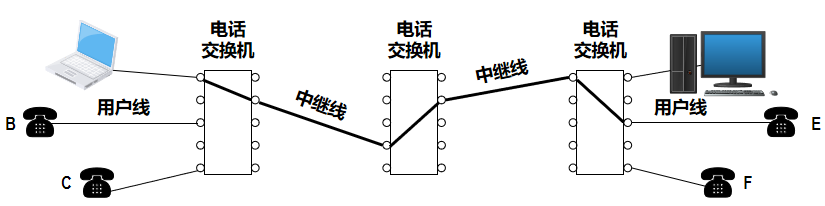
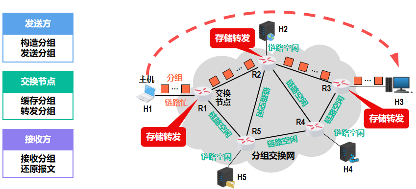
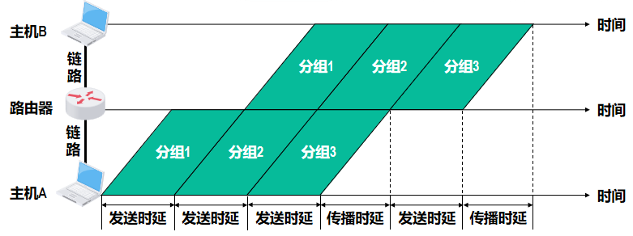
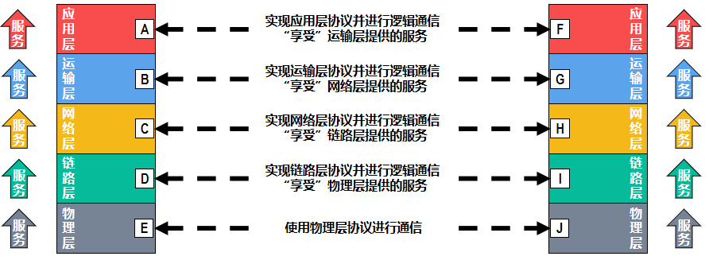
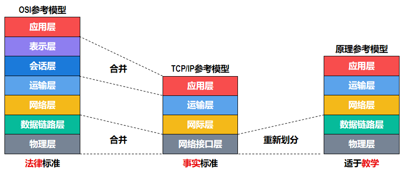

# 计算机网络体系结构

## 计算机网络概述

### 概念

计算机网络没有一个精确而统一的定义。

我们可以说计算机网络是一个将众多分散的、独立的计算机系统通过通信线路连接起来，由功能完善的软件实现数据交换和资源共享的系统。

!!! tip "internet 与 Internet"
    - **internet**（**互联网**，或**互连网**）是一个通用名词，泛指由多个计算机网络互连而成的计算机网络。这些网络之间可以使用任意的通信协议作为通信规则，不一定要使用 TCP/IP 协议。
    - **Internet**（**因特网**）是一个专有名词，指的是全球最大的互连网。它使用 TCP/IP 协议作为通信规则。

### 组成

从不同的角度来看，计算机网络的组成可以分为以下几种：

- 从**组成成分**来看，计算机网络主要由硬件、软件和协议三大部分组成
- 从**工作方式**来看，计算机网络（这里指 Internet）可分为边缘部分和核心部分
    - 边缘部分：所有连接到互联网上的供用户直接使用的主机，用来进行通信和资源共享
    - 核心部分：由各种通信线路和交换设备组成的网络骨干，用来实现主机之间的互连
- 从**功能组成**来看，计算机网络由通信子网和资源子网组成

### 电路交换、报文交换和分组交换

#### 电路交换

电路交换分三步：**连接建立、数据传输、连接释放**，即分配通信资源、占用通信资源、归还通信资源。

在电路交换的通信过程中，物理通信路径始终被用户独占，直到通信结束后才被释放。单计算机之间的数据传送是突发式的，线路的占用率很低，资源利用率不高。

<figure markdown="span">
    {width=75%}
</figure>

#### 报文交换

数据以报文为单位进行交换和传输，用户数据加上源地址、目的地址等信息后封装成报文。保温在网络中使用**存储转发技术**，先把整个报文传送到相邻节点，全部存储后查找转发表，再转发到下一节点，直到到达目的节点。每个保温都可单独选择到达目的节点的路径。

#### 分组交换

分组交换和报文交换一样采用**存储转发技术**，但数据单位是分组。分组交换将用户数据分成若干个长度较小的分组，每个分组都包含源地址、目的地址等信息。每个分组独立传送，可能经过不同的路径到达目的节点，最后由目的节点按序重组为完整的数据。

<figure markdown="span">
    {width=75%}
</figure>

!!! info "分组交换的优缺点"
    **优点**：

    - 没有建立连接和释放连接的过程
    - 分组传输过程中有较高的通信线路利用率
    - 交换机节点可以为每一个分组独立选择传输路径

    **缺点**：

    - 分组的首部会带来额外的传输开销
    - 分组在传输过程中可能发生拥塞，导致分组丢失
    - 分组可能乱序到达目的节点，需要重新排序

!!! abstract "三种交换方式的比较"
    <figure markdown="span">
        {width=75%}
    </figure>

### 计算机网络的分类

1. 按分布范围：
    - 广域网（WAN）
    - 城域网（MAN）
    - 局域网（LAN）
    - 个人局域网（PAN）
2. 按传输技术：
    - 广播式网络
    - 点对点网络
3. 按交换方式：
    - 电路交换网络
    - 报文交换网络
    - 分组交换网络
4. 按拓扑结构：
    - 总线型网络
    - 星型网络
    - 环型网络
    - 网状网络
5. 按使用者：
    - 公用网
    - 专用网
6. 按传输介质：
    - 有线网络
    - 无线网络

### 计算机网络的性能指标

常用的性能指标有八个：

1. **速率（speed）**：数据的传送速率，也成为数据率（data rate）或比特率（bit rate）

    基本单位是比特/秒（bit/s，也可写成 bps）。常用单位有 kbps（千比特/秒）、Mbps（兆比特/秒）、Gbps（吉比特/秒）等。

    !!! warning "数据量单位和速率单位的区别"
        - 数据量单位中的 K、M、G、T 分别表示 $2^{10}$、$2^{20}$、$2^{30}、$2^{40}$
        - 速率单位中的 k、M、G、T 分别表示 $10^{3}$、$10^{6}$、$10^{9}、$10^{12}$

        在计算时需要明确区分

2. **带宽（bandwidth）**：信道所能传送的最高速率，带宽的单位和速率相同
3. **吞吐量（throughput）**：单位时间内通过某一通信信道的**实际数据量**，受网络带宽的限制
4. **时延（delay）**：数据从网络的一端传送到另一端所耗费的时间，也称为延迟或迟延。

    时延由以下四部分组成：

    - 发送时延（transmission delay）：也称传输时延，将数据完成地发送出去所需的时间

        发送时延 = 数据包长度 / 发送速率

    - 传播时延（propagation delay）：信号在信道中从发送端传播到接收端所需的时间

        传播时延 = 信道长度 / 信号传播速度

    - 处理时延（processing delay）：路由器或交换机处理数据包所需的时间
    - 排队时延（queuing delay）：数据包在路由器或交换机的缓冲区等待传输所需的时间

    总时延 = 发送时延 + 传播时延 + 处理时延 + 排队时延

    !!! tip
        若无特殊说明，处理时延和排队时延通常可以忽略不计（同时也是最难估计的两部分时延）

        <figure markdown="span">
            {width=75%}
        </figure>

5. **时延带宽积**：时延和带宽的乘积，表示在网络中“在途”的数据量，可以表示发送的第一个比特即将到达终点时，发送端已经发送了多少比特的数据

    时延带宽积 = 传播时延 × 信道带宽

6. **往返时延（round-trip time, RTT）**：数据从发送端到接收端再返回发送端所需的时间）
7. **利用率（utilization）**：包括链路利用率和网络利用率
    - 链路利用率：某条链路有百分之几的时间是被利用的（有数据通过）
    - 网络利用率：网络中所有链路的利用率的加权平均

    当某条链路的利用率增大时，分组在交换节点中的排队时延就会随之增大，该链路引起的总时延也会增大

    令 $D_0$ 表示网络空闲时的时延，$D$ 表示网络利用率为 $U$ 时的时延，则有：
    $$ D = \frac{D_0}{1-U} $$

8. **丢包率（packet loss rate）**：在一定的时间范围内，传输过程中丢失的分组数与发送的分组数之比

    丢包有以下两种情况：

    - 分组在传输过程中出现误码，被传输路径中的节点交换机（例如路由器）或目的主机检测出误码而丢弃。
    - 节点交换机根据丢弃策略主动丢弃分组。

## 计算机网络体系结构与参考模型

### 分层结构

计算机网络的各层及其协议的集合被称为网络的体系结构。计算机网络体系结构通常都具有可分层的特性，他将复杂的大系统分成若干较容易实现的层次。

- 每层都实现一种相对独立的功能，减少各层之间的耦合度
- 各层功能的精确定义独立于具体实现，便于各层的设计和实现
- 保持下层对上层的独立性，上层单向使用下层提供的服务

第 n 层的活动元素称为第 n 层实体（entity），实体指任何可发送或接受信息的硬件或软件进程。第 n 层实体为第 n+1 层实体提供服务，此时称第 n 层实体为服务提供者，第 n+1 层实体为服务使用者。

> 一般而言各层的计数从下往上数，例如物理层在最底层，它就是第一层。

通信双方相同层次中的实体被称为对等实体（peer entity），它们通过对等协议进行通信。

- 对等层之间传送的数据单元被称为协议数据单元（protocol data unit, PDU）。
    - n-PDU 表示第 n 层的协议数据单元
- 不同层之间传送的数据单元称为服务数据单元（service data unit, SDU）。
    - n-SDU 表示第 n 层的服务数据单元，即来自于第 n+1 层的 PDU

### 协议、接口、服务

1. **协议**：同一层的对等实体之间进行通信所遵循的规则和约定

    > 不对等实体之间是没有协议的

    协议包括三部分：

    - 语法（syntax）：指数据与控制信息的格式（格式）
    - 语义（semantics）：需要发出何种控制信息、完成何种动作以及做出何种应答（操作）
    - 同步（syn，也称为时序）：指发送方和接收方执行各种操作的条件和时序（时序关系）

2. **接口**：相邻层之间的连接方式和约定

    同一网络节点内相邻两层的实体之间交换信息的逻辑接口被称为服务访问点（service access point, SAP），它被用于区分不同的服务类型。每层都只能为相邻的层定义接口，不可跨层定义。

    服务通过 SAP 提供给上层使用，第 n 层的 SAP 就是第 n+1 层可以访问第 n 层服务的接口。

3. **服务**：下一层为其上一层提供的功能

    服务是通过接口提供给上层使用的。服务的类型和质量由服务定义，服务的实现由协议完成。

    对等实体在协议的控制下，可以为上层提供服务，但要实现本层协议，还需要使用下层提供的服务。上层要使用下层所提供的服务，必须与下层交换一些命令，这些命令称为**服务原语**。

    > 例如 OSI 参考模型将原语分为四类：请求、指示、响应和确认。（request, indication, response, confirmation）

!!! info "协议与服务"
    - 只有本层协议的实现才能保证向上一层提供服务
    - 本层服务的用户之恩那个看见服务而看不见下面的协议，即下层协议对上层用户是“透明的”
    - 协议是“水平的”，服务是“垂直的”

    <figure markdown="span">
        {width=75%}
    </figure>

!!! info "服务的分类"
    - 面向连接服务与无连接服务
        - 面向连接服务：铜锌铅双方必须建立丽娜姐，分配相应的资源以保证通信能正常进行。可分为连接建立、数据传输、连接释放三个阶段。TCP 就是一种面向连接服务的协议
        - 无连接服务：不需要建立连接，数据报文独立传送，互不影响。IP、UDP 就是无连接服务的协议
    - 可靠服务与不可靠服务
        - 可靠服务：网络通过差错控制、流量控制等机制，确保数据正确无误地传送到目的地
        - 不可靠服务：网络不对数据的正确性作任何保证，只是“尽最大努力（best-effort）”地将数据送到目的地
    - 有应答服务与无应答服务
        - 有应答服务：接收方在收到数据后，向发送方返回一个应答信息，通知发送方数据是否已正确收到。如 FTP 协议
        - 无应答服务：接收方不向发送方返回任何应答信息，如 UDP 协议

### OSI 参考模型

OSI 参考模型由国际标准化组织（ISO）提出，全称为开放式系统互联参考模型（Open System Interconnection Reference Model），一般简称为 OSI 模型。

OSI 模型将计算机网络划分为七层，自下而上依次为：

1. **物理层（Physical Layer）**
    - 传输单位是比特
    - 负责在物理媒介上发送比特流，主要考虑的是采用什么传输媒体、采用什么物理接口来传输比特流，以及如何表示 0/1 比特的问题
2. **数据链路层（Data Link Layer）**
    - 传输单位是帧（frame），数据链路层把网络层川传递下来的 IP 分组封装成帧，并且可靠地传输到相邻节点的网络层
    - 负责把可能出错的物理链路变成一条可靠的链路，主要功能包括差错检测与纠正、流量控制、介质访问控制等
3. **网络层（Network Layer）**
    - 传输单位是数据包（datagram），
    - 关心的是通信子网的运行控制，为不同主机提供通信服务
    - 对分组进行路由选择，并实现流量控制、拥塞控制、差错控制和网际互连等功能

    > 网络层的流量控制与数据链路层的流量控制含义一样，都是协调发送方的发送速率和接收方的接收速率。

4. **传输层（Transport Layer）**
    - 负责主机中两个进程之间的通信
    - 为端到端连接提供可靠的传输服务，即为端到端连接提供差错控制、流量控制、数据传输管理等服务

    !!! tip 
        数据链路层提供的是点到点的通信服务，而传输层提供的是端到端的通信服务，注意两者的区别

        - 点到点：可理解为主机与主机之间的通信，一个点指一个硬件地址或 IP 地址
        - 端到端：不同主机内两个进程的通信（进程由端口号来标识）

5. **会话层（Session Layer）**
    - 允许不同主机上的各个进程之间进行会话
    - 包含检查点（checkpointing）和恢复（recovery）功能，允许在传输过程中断后从检查点继续传输
6. **表示层（Presentation Layer）**
    - 处理两个通信系统中交换信息的表示方式，即数据的编码、加密和压缩等
    - 负责数据格式的转换，使得来自不同主机的应用进程能够理解彼此交换的数据
7. **应用层（Application Layer）**
    - 直接为用户的应用进程提供服务
    - 包括文件传输、电子邮件、远程登录等常用的网络应用

### TCP/IP 模型

TCP/IP 模型从低到高依次为

1. **网络接口层（Network Interface Layer）**：对应 OSI 模型的物理层和数据链路层
2. **网际层（Internet Layer）**：对应 OSI 模型的网络层
    - 定义了标准的分组格式和协议，即 IP 协议
3. **传输层（Transport Layer）**：对应 OSI 模型的传输层
    - 负责让发送端和目的端主机上的对等实体进行会话，主要协议有 TCP 和 UDP
    - TCP（Transmission Control Protocol，传输控制协议）是一种面向连接的、可靠的传输层协议，数据传输的单位是报文段（segment）
    - UDP（User Datagram Protocol，用户数据报协议）是一种无连接的、不可靠的传输层协议，数据传输的单位是数据报（datagram）
4. **应用层（Application Layer）**：对应 OSI 模型的会话层、表示层和应用层

!!! note "TCP/IP 模型与 OSI 模型"
    - OSI 模型是一个理论模型，TCP/IP 模型是一个实际模型
    - OSI 模型的每一层都有明确的功能划分，而 TCP/IP 模型的每一层功能比较复杂
    - OSI 模型是一个自顶向下的设计方法，而 TCP/IP 模型是一个自底向上的设计方法

        即 OSI 模型先有模型，后有协议规范，适合描述各种网络；而 TCP/IP 模型先有协议，后有模型，不适合其他任何非 TCP/IP 的网络

    学习计算机网络时，我们通常采取两个模型结合的方式，既学习 OSI 模型的分层结构和各层功能，又学习 TCP/IP 模型的具体协议，将计算机网络分为 5 层来学习：物理层、数据链路层、网络层、传输层和应用层。

    <figure markdown="span">
        {width=75%}
    </figure>

