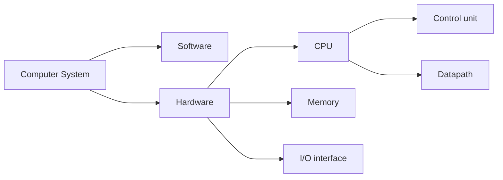
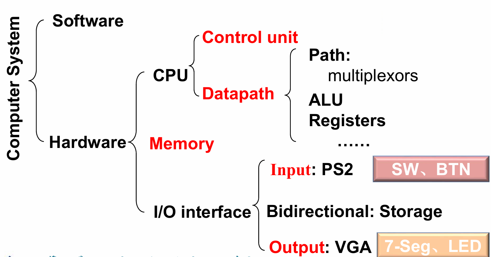

# Computer Abstractions and Technology

## Eight Great Ideas in Computer Architecture

有一些在实际的题目中难以区分，需要注意题目中的某些暗示。

- Design for Moore’s Law (设计紧跟摩尔定律)
    - Moore's Law: Integrated circuit resources double every 18-24 months.
- Use Abstraction to Simplify Design (采用抽象简化设计)
    - 采用层次化、模块化的设计
- Make the Common Case Fast (加速常见事件)
- Performance via Pipelining (通过并行提高性能)
- Performance via Pipelining (通过流水线提高性能)
    - 所有流程同时进行，每个流程工作的对象是相邻流程的产品
- Performance via Prediction (通过预测提高性能)
- Hierarchy of Memories (存储器层次)
    - Disk / Tape $\xrightarrow{Files}$ Main Memory(DRAM) $\xrightarrow{Pages}$ L2-Cache(SRAM) $\xrightarrow{Blocks}$ L1-Cache(On-Chip) $\xrightarrow[Operands]{Instr.}$ Registers
- Dependability via Redundancy (通过冗余提高可靠性)

---

## Components of a Computer

The five classic components of a computer:

- input;
- output;
- memory (DRAM);
    - 程序、数据存储的地方，也是程序“运行的位置”；
    - cache memory (SRAM): buffer for the DRAM memory;
- datapath;
    - 负责实际的数据处理；
- control;
    - 负责指挥控制如何进行数据处理，给出控制信号；

---

## Performance

衡量计算机的性能和表现的重要标准是“运行速度”

- Response Time / Execution Time 从程序开始到结束的时间
- Throughput(吞吐量) / Bandwidth 单位时间内完成的任务数量

$$ Performance = \frac{1}{Execution\ Time} $$

当我们衡量一个 CPU 的性能，或者具体分析一个 CPU 的性能构成时，就需要更加具体的指标:

- CPU (execution) time（CPU 执行时间）
- CPU clock cycle（时钟周期数）
- clock rate(frequency)（时钟频率） / clock cycle time（时钟周期）

$$
\begin{aligned}
CPU\ Time &= CPU\ Clock\ Cycles \times Clock\ Cycle\ Time \\
         &= \frac{CPU\ Clock\ Cycles}{Clock\ Rates}
\end{aligned}
$$

- IC (Instruction Count): 指令总数
- CPI (cycles per instruction): 平均每条指令所需要的时钟周期数 = 总时钟周期数 / IC，一般与编译器有关
- 若不同的指令有不同的 CPI，则我们可以用 Average CPI

$$
\begin{aligned}
Clock\ Cycles &= Instruction\ Count \times Cycles\ per\ Instruction(CPI)\\
CPU\ Time &= Instruction\ Count \times CPI\times CPI\ Cycle\ Time\\
 &= \dfrac{Instruction\ Count \times CPI}{Clock\ Rate}
\end{aligned}
$$

综上，可以得到 $ CPU\ Time = \frac{Instructions}{Program} \times \frac{Clock\ Cycles}{Instruction} \times \frac{Seconds}{Clock Cycle} $

---

## 一些常见名词

MIPS: Millions of Instructions Per Second

- 在其他参数都相同时才有比较意义
- 在不同的 ISA 之间不能仅凭 MIPS 比较；也不可用于比较指令的复杂程度

ISA: 指令集合架构(Instruction Set Architecture)

定义了计算机硬件与软件之间的接口。它具体包括：

- 支持的指令类型（数据处理、控制、输入/输出等）
- 数据类型（整数、浮点数、字符等）
- 寄存器设计（寄存器数量和类型）
- 地址模式（如何计算指令操作数的地址）

RISC（Reduced Instruction Set Computing）是一种指令集设计理念

- 指令数量较少，且所有指令都在单个时钟周期内执行。
- 每条指令长度相同，通常为固定大小。
- 使用大量的寄存器以减少内存访问。
- 简化的寻址模式，提高了执行效率。
- 硬件设计更简单，易于流水线操作，提高了性能。

MISC（Minimal Instruction Set Computing）是一种极简指令集设计

- 指令集非常小，通常只有几条基本指令。
- 每条指令可能需要多个周期才能执行。
- 多数指令依赖于程序的所有操作通过少量基本指令组合完成。
- 硬件实现简单，小型设备或特定应用中常见。

CISC（Complex Instruction Set Computing）是另一种指令集设计理念

- 包含大量指令，且每条指令可以执行复杂的操作。
- 指令长度不固定，许多指令可以通过一条指令进行多步操作。
- 支持更多的寻址模式和数据类型。
- 可以减少程序的大小，因为许多操作可以通过单条指令完成。