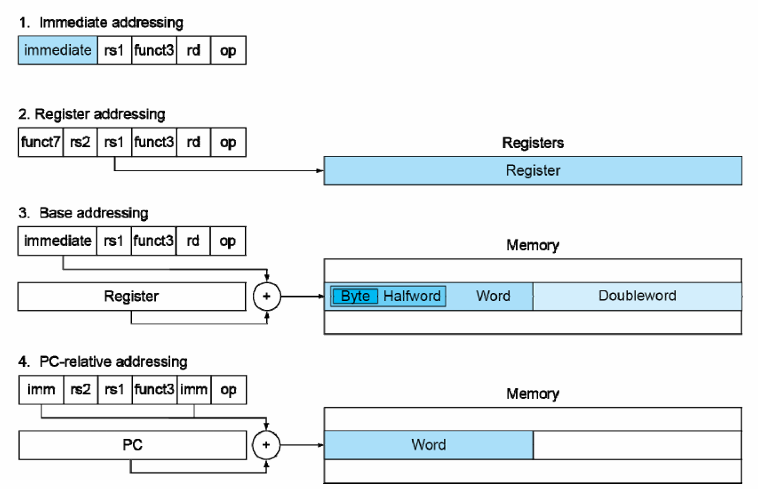

# Instructions: Language of the Computer

## Introduction

- Language of the machine

    - Instructions (Statement)
    - Instruction Set (Syntax)

- Design goal

    - Maximize performance

        在同样资源（时间、空间）的情况下尽可能提高性能

    - Minimize cost

        在保证同样性能的情况下尽可能降低成本

    - Reduce design time

        指令集更简单，易于理解和设计

- 我们课程中使用的指令集为 RISC-V

**Instruction Characteristics**

<figure>
    
</figure>

指令集的基本结构包括：Operator（操作符）、Operands（操作数）

- 不同指令集中指令的编码通常不同，例如可用 000 表示加法，这也被称为指令的 Encoding（编码）
- 操作数的位宽可能不同，对应的来源也可能不同，可能来自寄存器、内存、立即数等

冯诺依曼架构：指令被认为是一种特殊的数据，和其他数据储存在**同一个内存**中，可以进行读写操作

哈佛架构：指令和数据**分开存储**，分别有自己的内存空间

!!! tip
    在实验课中我们实现的实际上是哈佛架构，但在考试中的具体题目也可能是冯诺依曼架构的。

## Operations

- 每一个计算机都需要实现算数运算操作

    - Only one operation per instruction
    - Exactly **3** variables

        例如`add a b c`，表示将`b`和`c`相加，结果存入`a`，$a \gets b + c$

- Design Principle 1 —— **Simplicity favors regularity**

    **简单源自规整**，如每条指令都包含三个操作数

!!! example
    - C code 
    ```C
    f = (g + h) - (i + j);
    ```
    - RISC-V code
    ```
    add t0, g, h
    add t1, i, j
    sub f, t0, t1
    ```

## Operands

### Register Operands

- 算术指令（Arithmetic Instructions）的操作数只能来自寄存器或立即数
- RISC-V 中有 32 个 64-bit 的寄存器，分别用`x0`到`x31`表示

    - 32-bit 的数据被称为一个 word，64-bit 的数据被称为一个 doubleword

| Name    | Register Name | Usage                         | Preserved or call? |
|---------|---------------|-------------------------------|--------------------|
| x0      | 0             | The constant value 0          | n.a.               |
| x1(ra)  | 1             | Return address(link register) | yes                |
| x2(sp)  | 2             | Stack pointer                 | yes                |
| x3(gp)  | 3             | Global pointer                | yes                |
| x4(tp)  | 4             | Thread pointer                | yes                |
| x5-x7   | 5-7           | Temporaries                   | no                 |
| x8-x9   | 8-9           | Saved                         | yes                |
| x10-x17 | 10-17         | Arguments/results             | no                 |
| x18-x27 | 18-27         | Saved                         | yes                |
| x28-x31 | 28-31         | Temporaries                   | no                 |

!!! note "为什么 x0 寄存器的值需要保持为 0 ？"
    Make the common fast.

    在实际的运算中常会有 0 参与，把它单独存放在一个寄存器中，便于计算。

### Memory Operands

使用内存的好处在于可以存储比寄存器更多、更复杂的数据，例如数组或结构体等

- 访问内存的速度通常比访问寄存器慢
- 通过内存地址（Memory Address）判断我们需要的数据储存在内存的哪个位置
- RISC-V 中的内存地址是 **byte addressed** 的，也就是说每个地址对应一个 8-bit 的字节

RISC-V 中的内存访问指令有两种：

- Load：从内存中读取数据，储存到寄存器中
- Store：将寄存器中的数据写入内存

RISC-V 是 **Little Endian（小端序）** 的，也就是说低位字节存储在低地址，高位字节存储在高地址，Big Endian（大端序）则相反 

!!! info "Little vs Big Endian"
    - Little Endian：数据的低位字节存储在低地址
    - Big Endian：数据的高位字节存储在低地址

    例如，对于 32-bit 的数据 `0x01234567`，在内存中的存储方式如下：

    - Little Endian：`01 23 45 67`
    - Big Endian：`67 45 23 01`

    <figure>
        
    </figure>

与一些其他的 ISA 不同，RISC-V 不要求 word 在内存中对齐，也就是说一个 word 的数据可以从任意地址开始

- words align：一个 word 是 4 个字节，就要求一个 word 的起始地址一定要是 4 的倍数

!!! note "Memory Alignment"
    <figure>
        
    </figure>

    上图中第一种情况是对齐的，第二种情况是不对齐的

    - 对齐的好处在于可以提高内存访问的效率，比如能够保证不需要读取两次才能得到一个 word 的数据
    - 不对齐的好处在于节省空间

!!! example "Memory Operand Example"
    - C code
    ```C
    A[12] = h + A[8];
    ```
        
        这里我们默认数组的元素都是 doubleword 的，并且 assume h in `x21`, base address of A in `x22`

    - RISC-V code
    ```c
    ld x9, 64(x22)
    add x9, x21, x9
    sd x9, 96(x22)
    ```

    因为地址以 byte 为单位，且 1 doubleword = 8 byte，那么我们在根据访问内存中相应的数据时需要分别偏移 $8 \times 8 = 64$ bytes 和 $8 \times 12 = 96$ bytes。

### Registers vs. Memory

- Registers are faster to access than memory

    寄存器中的数据可以直接取出来就用，但内存中的数据需要先根据内存地址找到数据所在位置，然后传输回运算单元

- Operating on memory data requires loads and stores

    使用内存中的数据需要执行额外的指令才能取出/写回

- Compiler must use registers for variables as much as possible

    编译器尽量使用寄存器存变量。只有在寄存器不够用时，或者使用寄存器无法保存的数据（数组、结构体等）时，才会选择用内存。

### Constant or Immediate Operands

除了使用寄存器或内存中的数据之外，我们还可能使用到常量数字或者立即数（Immediate），如 $ h = h + 5 $ 

`addi x22, x22, 5`

- Immediate：Other method for offering operands

!!! summary
    <figure>
        
    </figure>

    - 为什么内存是 61 个 doubleword？

    因为 RISC-V architecture 的地址是 64 位的，因此总共可以寻址 $2^{64}$ 个地址，每个地址对应一个 byte，因此总共有 $2^{64}$ 个 byte，也就是 $2^{64} / 8 = 2^{61}$ 个 doubleword。因此我们`load`和`store`指令可以访问的范围就是这 $2^{61}$ 个 doubleword。

## Signed and Unsigned Number

这部分就是老生常谈的二进制反码和补码的知识，就不再重复了

## Representing Instructions in the Computer

计算机中的所有信息都使用二进制来表示，指令也不例外，指令会被编码成二进制的形式，称为机器码（Machine Code）。

!!! note "RISC-V instructions"
    所有的 RISC-V 指令都是都会被编码成规整的 32-bit，一部分是 opcode，一部分是 operands 等等。

<figure>
    
</figure>

### R-format

<figure>
    
</figure>

- **opcode**: basic operation and format of an instruction.
- **rd**: the register destination operand.
- **funct3**: an additional opcode field.
- **rs1**: the first register source operand.
- **rs2**: the second register source operand.
- **funct7**: an additional opcode field.

### I-format

<figure>
    
</figure>

包括立即数算术运算和`load`指令

- **rs1**: source or base address register number
- **immediate**: constant operand, or offset added to base 
address
    - 立即数是二进制补码表示的有符号数
    - 相当于把 rs2, funct7 合并了，得到一个 12-bit 的立即数

### S-format

<figure>
    
</figure>

- **rs1**: base address register number
- **rs2**: source operand register number

    rs2 寄存器的数据就是将要写入内存的数据

- **immediate**: offset added to base address
    - 这里需要注意，S-format 指令的立即数在指令中的位置和 I-format 是不同的
    - 立即数的位置被分割成了两部分，这样能保证 rs1 和 rs2 所在的位置保持不变

??? example
    <figure>
        
    </figure>

    <figure>
        
    </figure>

!!! note "Stored Program in Computer"
    <figure>
        
    </figure>

    - 事实上指令和程序和数据一样，都会被表示为二进制的形式，储存在内存中
    - 有的程序可以对别的程序进行操作
        - 例如编译器（Compiler）、连接器（Linker）等
    - Binary compatibility allows compiled programs to work on different computers

        二进制的兼容性使得编译好的程序可以在不同的计算机上运行

## Logical Operations

| Operation     | C  | Java | RISC-V    |
|---------------|----|------|-----------|
| Shift left    | << | <<   | slli      |
| Shift right   | >> | >>   | srli      |
| Bit-by-by AND | &  | &    | and, andi |
| Bit-by-by OR  | \| | \|   | or, ori   |
| Bit-by-by XOR | ^  | ^    | xor, xori |
| Bit-by-by NOT | ~  | ~    | -         |

RISC-V 中的按位 NOT 指令需要通过异或来实现，如`xori x2, x2, -1`

### Shift

- 将二进制数据向左或向右移动，
- 左移时在右侧补 0，右移时在左侧补 0 或符号位，需要根据是逻辑右移还是算术右移来决定
- 左移 i 位相当于乘 $2^i$, 右移 i 位相当于除 $2^i$
- 通常 shift 指令使用的是 I 型指令，`slli`、`srli`、`srai`

    <figure>
        
    </figure>

    - 为什么还会有一个`funct6`？

        因为 RISC-V 的数据至多是 doubleword，也就是 $64 = 2^6$ 位，因此左移或者右移的立即数只需要 6 位就可以表示

### AND、OR、XOR

可能是寄存器和寄存器的数据之间按位运算，也可能是寄存器的数据与立即数按位运算

## Instructions for Making Decisions

### Branch instructions

- `beq rs1, rs2, label`

    如果`rs1`和`rs2`相等，那么跳转到`label`处

- `bne rs1, rs2, label`

    如果`rs1`和`rs2`不相等，那么跳转到`label`处

除了上面两种之外，还有一些其他的条件跳转指令，如`blt`、`bge`、`bltu`、`bgeu`等

??? example 
    === "判断语句"
        <figure>
            
        </figure>

    === "循环跳转"
        <figure>
            
        </figure>

branch 类型指令的立即数是作为地址偏移量与当前指令的 PC 相加来计算需要跳转到的地址的

- 由于立即数只有 12 位，跳转的范围有限

!!! note "index out of bounds 检测"
    `If (x20 >= x11 || x20 < 0) goto IndexOutofBounds;`
    
    上面的这条指令可以只需要一条指令就可以实现：
    
    `bgeu x20, x11, IndexOutofBounds`
    
    > 需要注意的是，这里我们默认 x11 中存的值大于 0，否则上面这个判断条件无论如何都是 True，这样就没有意义了

    如果 x20 > 0，那么两个数都是整数，用 bgeu 也不会有问题；如果 x20 < 0，那么由于 x20 用二进制补码来表示，这时候它又会被视为一个很大的正数，因此`bgeu x20, x11`也是成立的。

### slt instruction

slt：Set on Less Than

- `slt rd, rs1, rs2`

    如果`rs1` < `rs2`，那么`rd` = 1，否则`rd` = 0

此外，还有

- slti：Set on Less Than Immediate
- sltu：Set on Less Than Unsigned
- sltiu：Set on Less Than Immediate Unsigned

### Case/Switch

`jalr rd rs1 imm` 或 `jalr rd imm(rs1)`

jalr 指令是 I 型指令，具体操作是从寄存器中取出数据，然后把这个数据与一个立即数相加，跳转到这地址去，同时把下一条指令的地址，即 PC+4 写入 rd 寄存器中。

假如我们不需要下一条指令的地址，我们就把 rd 寄存器设置为 x0，因为 x0 寄存器的值始终是 0，不会被修改。

??? example "Compiling a switch using jump address table"
    <figure>
        
    </figure>

    <figure>
        
    </figure>

    <figure>
        
    </figure>

    在上面的这个例子中，编译器实际上会把 switch 语句中不同情况对应的的程序内容写到内存不同的位置，然后把这些地址用一个表来存储。当程序执行到 switch 语句时，会先找到这个地址表的位置，然后从表中读取所需要的地址，然后再把这个地址对应的内容从内存里读取出来。

!!! note "Basic Blocks"
    A **basic block** is a sequence of instructions with

    - No embedded branches (except at end)
    - No branch targets (except at beginning)

    我们把一些不含有分支跳转语句同时也不会作为跳转目标的指令的集合称为**基本块**，基本块是编译器优化的基本单位。

## Supporting Procedures in Computer Hardware

Procedure/Function —— be used to structure programs

- 一个用于完成特定任务的子程序
- 易于理解，可以被复用

调用一个函数主要可以分为 6 步

1. Place Parameters in a place where the procedure can access them（in registers `x10`~`x17`）

    向子程序传递参数，通常使用寄存器

2. Transfer control to the procedure

    将处理器的控制权转交给子程序

3. Acquire the storage resources needed for the procedure

    为子程序分配所需的存储资源

4. Perform the desired task

    执行子程序的任务

5. Place the result value in a place where the calling program can access it 

    将结果传递给函数调用者（通常也是一个程序）

6. Return control to the point of origin (address in x1)

    将控制权返回给调用这个函数的程序

### Procedure Call Instructions

- **Procedure call**: jump and link

    指令格式为 `jal x1, ProcedureLabel`，

    会把下一条指令的地址（PC+4）写入 x1 寄存器中，然后跳转到 ProcedureLabel 处开始执行相应进程

- **Procedure return**: jump and link register

    指令格式为 `jalr x0, 0(x1)`
    
    跳转到`x1`寄存器存储的地址去，由于`x0`寄存器的值始终是 0，因此实际上并不会把下一条指令的地址写入寄存器中

### Using More Registers

- Registers for procedure calling

    - `x10`~`x17`：8 个用于存储参数的寄存器
    - `x1`：用于存储返回地址的寄存器

- Stack：Ideal data structure for spilling registers

    - Stack pointer (`sp`): `x2`
    - Push: `sp = sp - 8`
    - Pop: `sp = sp + 8`

!!! note "Leaf/Non-leaf Procedure"
    - **Leaf procedure**: does not call other procedures

        不会调用其他的函数的函数，因此不需要保存寄存器的值，也不需要保存此程序的返回地址

    - **Non-leaf procedure**: calls other procedures

        会调用其他的函数的函数，因此需要保存寄存器的值和返回地址

    对于嵌套的函数调用，我们需要保存上一个函数的返回地址到栈中，然后再调用下一个函数，这样就可以保证在下一个函数执行完后，可以返回到上一个函数中。

??? example "Nested Procedure"
    <figure>
        
    </figure>

    <figure>
        
    </figure>   

Disadvantages of recursion：

- 使用大量资源，有可能造成栈溢出
- 需要栈反复 push 和 pop，使得内存的利用十分低效

!!! info "Preserved or not"
    <figure>
        
    </figure>

    - 父函数需要保证子函数可以随便使用 temp reg（`x5`-`x7`，`x28`-`x31`），子函数返回到父函数时不需要保证这些寄存器的值不变
    - 子函数返回到父函数时，saved reg（`x8`-`x9`，`x18`-`x27`）的值需要恢复到父函数调用子函数的值之前的状态

!!! info "Local Data on the Stack"
    <figure>
        
    </figure>

## Communicating with People

- Byte-encoded character sets

    - ASCII: 7-bit encoding
    - Unicode: 16-bit encoding

- Unicode: 16-bit/32-bit character set

    - UTF-8, UTF-16: variable-length encodings

由于数据的编码有不同的长度，因此往内存读写数据也要有不同长度的 load 和 store

- Load byte/halfword/word: Sign extend to 64 bits in rd

    寄存器是 64 位的，取出来的数据可能不足 64 位，要把取出来的数据按符号位扩充到 64 位，高位补符号位

    - lb rd, offset(rs1)
    - lh rd, offset(rs1)
    - lw rd, offset(rs1)

- Load byte/halfword/word unsigned: Zero extend to 64 bits in rd

    取出来的数据可能不足 64 位，无符号拓展到 64 位，高位补 0

    - lbu rd, offset(rs1)
    - lhu rd, offset(rs1)
    - lwu rd, offset(rs1)


- Store byte/halfword/word: Store rightmost 8/16/32 bits

    只把读出来的数据的低 8/16/32 位存入内存，高位写入时会被忽略（内存会按对应字节写入）

    - sb rs2, offset(rs1)
    - sh rs2, offset(rs1)
    - sw rs2, offset(rs1)

    offset 不一定是 2/4/8/16/32 的倍数，因为 RISC-V 是可以不对齐的（但实际上 sh 的 offset 通常是 2 的倍数，sw 的 offset 通常是 4 的倍数）

### Strings
 
通常有三种表示字符串的方式：

- Place the length of the string in the first position
- An accompanying variable has the length
- A character in the  last position to mark the end of a string

Java 采用第一种表示方法，C 采用第三种表示方法

??? example "tring Copy Example"
    <figure>
        
    </figure>

    <figure>
        
    </figure>

    事实上上面的例子还可以改进

    - i 不应该分配给 `x19`，而应该分配给一个临时寄存器，这样就不需要用堆栈保存 `x19` 的值了
    - 对于一个 leaf procedure，编译器应当在用完所有的临时寄存器之后，再去考虑使用其他的寄存器

        - 为什么要强调是 leaf procedure？

            因为对于 non-leaf procedure，临时寄存器中的值可能会被后续调用的函数所改变

## RISC-V Addressing for Wide Immediate and Addresses

### Wide Bit Immediate addressing

I 型指令至多只能提供范围在 12 位以内的立即数，但是有时候我们需要更大范围的立即数，这时候就需要使用 U 型指令

`lui rd imm`的作用是把 20 位的寄存器写入 rd 寄存器的 [31:12] 位，低 12 位填充 0

<figure>
    
</figure>

!!! example
    <figure>
        
    </figure>

    在这个例子中我们希望寄存器最终的值是 32 位的常数 `0x003D0900`。先使用`lui`指令在寄存器的高 [31:12] 位写入`0x003D0`即`976`，然后使用`addi`指令在寄存器的低 [11:0] 位写入`0x900`即`2304`。

!!! warning
    当我们使用`lui`和`addi`指令来载入一个大立即数时，如果`addi`的立即数最高位是 1，那么这个立即数会被当作负数来处理，会额外加上`0xFFFFF000`，这样就会导致结果不是我们想要的。

    观察分析之后我们可以知道，额外加上`0xFFFFF000`之后相当于`lui`的立即数减小了 1，因此这时候我们应该让`lui`的立即数加 1，这样就可以把`0xFFFFF000`的影响抵消了。

    例如我们要得到`0xDEADBEEF`，我们应该使用的指令是
    ```assembly
    lui x5, 0xDEADC     // 而不是 0xDEADB
    addi x5, x5, 0xEEF
    ```

### Branch Addressing

SB-type(B-type) 指令的格式

<figure>
    
</figure>

实际上 SB 型指令并不会把立即数的每一个 bit 都储存在机器码中，储存的是立即数舍去最后一位的结果，即`imm[12:1]`。因为指令的地址一定是偶数倍的，最低位一定是 0，因此我们可以把这个 bit 省略掉。

当需要计算跳转地址时，我们就把机器码中的立即数部分取出并左移一位，然后再根据这个值计算跳转地址，这样就能够实现一个 13-bit 的 offset。
$$ Target \\ Address = PC + Branch \\ offset = PC + imm \times 2 $$

### Jump Addressing

UJ-type(J-type) 实际上只有`jal`一个指令 

<figure>
    
</figure>

`jal`指令有 20-bit 用来存储立即数，和 SB 型指令一样，它存储的是立即数舍去最后一位的结果，即`imm[20:1]`，这样就可以实现保存一个 21-bit 的 offset。

!!! question "如何实现长距离的跳转？"
    - 首先用`lui`指令目标地址的[31:12]位写入临时寄存器

        temp_reg $\gets$ address[31:12]

    - 接着再用`jalr`指令把 address[11:0] 的值加上这个寄存器的值，并跳转到目标地址

        `jalr x0, address[11:0](temp_reg)`

!!! example
    <figure>
        
    </figure>

    <figure>
        
    </figure>

    SB 类型指令直接用 PC+offset 来计算跳转地址。这里的 offset 需要把取出来的立即数在最低位填充 0 才能得到。

- All RISC-V instructions are 4 bytes long
- PC-relative addressing refers to the number of halfwords

    PC 相对地址是指相对于当前指令的地址的偏移量，这个偏移量是以 halfword 为单位的

!!! question "既然每一条指令的地址都是 4 的倍数，为什么不直接省略后两位，而只省略一位？"
    实际上 RISC-V 是允许进行指令长度为 2 字节的 extension 的，只不过我们并没有学到这部分内容。

    课本原文：
    > However, the RISC-V architects wanted to support the possibility of instructions that are only 2 bytes long, so the branch instructions represent the number of *halfwords* between the branch and the branch target. 

??? example "Branching far away"
    <figure>
        
    </figure>

    有时候我们要跳转到一个 Branch 指令够不着的地址去，但是这个地址也没有远到需要使用`lui`和`jalr`指令来实现。这时候我们可以使用`jal`指令来实现跳转（范围为 $-2^{20} \sim 2^{20}-1$）。

### RISC-V Addressing Summary

{align=right width=60%}


RISC-V 有 4 中寻址方式

- 立即数寻址

    `addi x5, x6, 4`

- 寄存器寻址 

    `add x5, x6, x7`

- 基地址寻址 

    `ld x5,100(x6)`

- PC 相对寻址 

    `beq x5,x6,L1`

<figure>
    
</figure>

## Synchronization in RISC-V

- Two processors sharing an area of memory
    - P1 writes, then P2 reads
    - Data race if P1 and P2 don’t synchronize
        - Result depends of order of accesses
    
        当两条指令都需要使用同一块内存时，如果没有同步，那么就会出现数据竞争，结果取决于两条指令的执行顺序

- Hardware support required
    - Atomic read/write memory operation
    - No other access to the location allowed between the read and write

Load Reserved: `lr.d rd,(rs1)`

- 把`Mem[rs1]`的值存到`rd`中，然后在`rs1`对应地址上设置一个保留标记（reservation set）

Store Conditional: `sc.d rd,(rs1),rs2`

- 在尝试把`rs2`的值存到`Mem[rs1]`之前，会先判断`rs1`的地址上是否有保留标记

    - 如果观察到了保留标记，就说明从上一条`lr.d`指令之后`Mem[rs1]`的值没有被改变，那么就把`rs2`的值存到`Mem[rs1]`中，并且把`rd`设置为 0
    - 如果没有观察到保留标记，说明`Mem[rs1]`的值已经被改变了，那么就不会把`rs2`的值存到`Mem[rs1]`中，并且把`rd`设置为一个非零值
    - 无论是否存储成功，`rs1`地址上的保留标记都会被清除

!!! example
    <figure>
        
    </figure>

    在第二个例子中，如果`sc.d`没有在`Mem[rs1]`上观察到保留标记，那么就不会把`rs2`的值存到`Mem[rs1]`中，并且会从头开始重新执行一次`lr.d`指令，直到确保`lr.d`指令和`sc.d`指令之间没有其他的指令对`Mem[rs1]`进行了修改。

## Translating and Starting a Program

<figure>
    
</figure>

以 C 语言程序为例

- 首先 C 源程序被编译器编译成汇编代码
- 然后再由汇编器将汇编代码转换成机器码
- 接着再由链接器将机器码和库文件链接成可执行文件
- 最后把可执行文件加载到内存中，由操作系统执行。

### Object file

<figure>
    
</figure>

目标文件可以分为以下几个部分：

- object file header

    包含了一些关于目标文件的基本信息，如文件大小、目标文件其他部分的位置等

- text section

    包括所需的指令及其地址

- static data segment and dynamic data

    static data 会在整个程序的生命周期中一直存在，而 dynamic data 会在程序运行时动态分配

- relocation information

    重定位信息，标注各个部分在内存中的绝对位置，以便链接器将各个部分正确地连接到一起

- Symbol table:

    global definitions and external refs

- Debug information

    for associating with source code

### Link

Object modules(including library routine) $\to$ executable program

- Place code and data modules symbolically in memory
- Determine the addresses of data and instruction labels
- Patch both the internal and external references (Address of invoke)

### Loading a Program

Load from image file on disk into memory

1. Read header to determine segment sizes
2. Create virtual address space
3. Copy text and initialized data into memory
    
    Or set page table entries so they can be faulted in

4. Set up arguments on stack
5. Initialize registers (including sp, fp, gp)
6. Jump to startup routine
    
    - Copies arguments to x10, … and calls main procedure
    - When main returns, do exit syscall

### Dynamic Linking

- **静态链接**

    - 在**生成可执行文件时**把所有需要的的库文件都链接到可执行文件中
    - 导致可执行文件的体积变得很大，但可以保证程序的独立性

- **动态链接**

    - 在**程序运行时**才会把库文件链接到程序中
    - 可以减小可执行文件的体积，并且可以使用到最新的库文件
    - 但库文件的位置和版本可能会发生变化，可能会导致程序无法运行

## Arrays vs. Pointers

指针指向的目标地址可以被改变，但数组的基地址是固定的，因此使用指针和数组完成相同的工作时，翻译得到的汇编代码也有所不同

!!! example "Clearing an Array"
    <figure>
        
    </figure>

    在这个例子中，我们使用指针和数组来清空一个数组，可以看到使用指针的方式会比使用数组的方式多出一些指针的操作，因此使用指针的方式会更加高效。

## Other RISC-V Instructions

- Base integer instructions (RV64I)
    - Those previously described, plus
    - auipc rd, immed  // rd = (imm<<12) + pc
        - follow by jalr (adds 12-bit immed) for long jump
    - slt, sltu, slti, sltui: set less than (like MIPS)
    - addw, subw, addiw: 32-bit add/sub
    - sllw, srlw, srlw, slliw, srliw, sraiw: 32-bit shift
- 32-bit variant: RV32I
    - registers are 32-bits wide, 32-bit operations

我们在计组实验课中实现的是 RV32I 的指令集，但是考试中可能会考到的是 RV64I 的指令集，因此需要注意 RV64I 和 RV32I 的区别。

