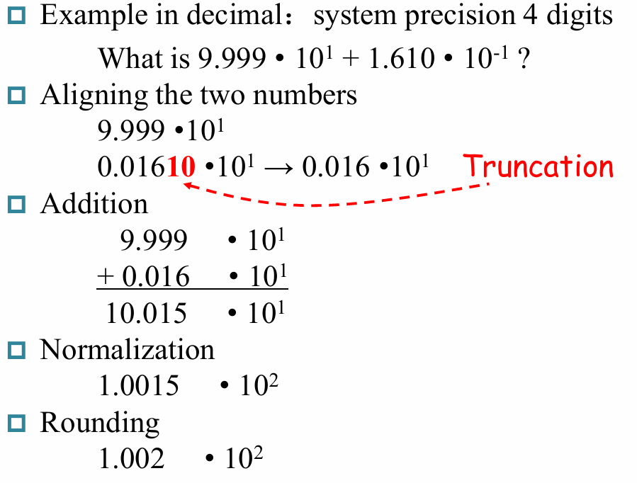

# Arithmetic for Computers

## Introduction

在计算机中指令可分为三类

- memory-reference instructions
    需要ALU计算内存地址，如`lw`, `sw`

    - `lw`: load word, 从内存中读取一个字
    - `sw`: store word, 将一个字写入内存

- arithmetic-logical instructions
    需要ALU执行算数或逻辑运算，如`add`, `sub`, `and`, `or`, `slt`

    - `slt`: set less than, 如果第一个操作数小于第二个操作数，将结果置为1，否则置为0

- control flow instructions
    需要ALU进行条件判断，如`beq`, `bne`, `jal`

    - `beq`: branch if equal, 若两操作数相等则跳转至指定地址
    - `bne`: branch not equal, 若两操作数不相等则跳转至指定地址
    - `jal`: jump and link, 跳转至指定地址并将下一条指令地址存入寄存器

### 有符号数的表示

- Sign and Magnitude
- 1's Complement
- 2's Complement
- Bias Notation(偏移表示法)

!!! note "关于偏移表示法"
    **偏移表示法（移码）**可用于表示正数或复数，其基本思想是引入一个**偏移量**，使得所有数都是非负数。例如，偏移量为100，那么-100可表示为0，0可表示为100，100可表示为200。这样一来硬件就可以把所有的数字当作无符号数来处理，而不需要区分正负数，从而简化了硬件的设计与实现，常用于浮点数表示等。

    例如我们使用8 bit来表示数字，偏移量就可以设置为$2^7 - 1 = 127$，这时候

    - 数字0表示为$0 + 127 = 127$，即 `01111111`
    - 数字-1表示为$-1 + 127 = 126$，即 `01111110`
    - 数字1表示为$1 + 127 = 128$，即 `10000000`

    要从偏移表示法转换为原始的有符号数，只需要减去偏移量即可。

    对于二进制补码表示的有符号数，要将其变为偏移法表示，只需要把它的符号位反转，再整体减去1即可，如

    - $1$: `00000001` -> `10000000`
    - $-1$: `11111111` -> `01111110`
    - $0$: `00000000` -> `01111111`

## Arithmetic

加法和减法在这里不再赘述，主要讨论乘法和除法，但需要注意的是加减法的溢出检测。在设计加减法器时，通常会在数据位的基础上额外添加一位用于判断是否溢出或进位，这通常称为溢出位（Overflow Bit）或进位位（Carry Bit）

|Operation|Operand A    |Operand B    |Result overflow   |
|:--------|:------------|:------------|:-----------------|
| $A + B$ |$\geqslant 0$|$\geqslant 0$|$< 0$         (01)|
| $A + B$ |$< 0$        |$< 0$        |$\geqslant 0$ (10)|
| $A - B$ |$\geqslant 0$| $< 0$       |$< 0$         (01)|
| $A - B$ |$< 0$        |$\geqslant 0$|$\geqslant 0$ (10)|

表格中，溢出位在结果的符号位的左侧，可以看出，发生溢出时溢出位与进位位的异或结果为1，即$C_{n+1} \oplus C_n = 1$

### Multiplication

#### Unsigned multiplication

$$ Product = Multiplicand \times Multiplier $$

- **Version 1**

最简单朴素的想法，根据当前处理的 Multiplier 的位的`0/1`来选择是否要将 Multiplier 的对应移位结果加到 Product 上去。

每执行一次判断，都要左移被乘数，同时右移乘数来获取新一位的来判断下一步是否要做加法。

{ width=70% }

但是这种方式实现的乘法相当消耗资源，需要 128+128+64 bit 的寄存器，和一个 128 bit ALU

- **Version 2**

可以发现，在V1中我们做了大量的128位加法，但是实际上被加过去的 Multiplicand 有效内容只有 64 位。经过改进后的V2解决了这个问题。

{ width=70% }

这里我们把储存 Multiplicand 的寄存器换成了64位的，把移位操作转移到了 Product 寄存器中进行。这里需要注意的是，64位的加法始终只在Product寄存器的高64位上进行，而每一次操作后都要把 Product 寄存器右移一位，经过64次操作之后就得到了最终的乘积。

- **Version 3**

我们还发现，我们对Multiplier的右移是为了枚举最低位，但是为了实现这个枚举，我们每次都要做64位的右移；此外在最开始时，Product寄存器的低位是没有意义的。

仔细思考后可以发现，Product寄存器和Multiplier寄存器都要进行右移，而每一次右移后 Multiplier 寄存器的有效数据就减少一位，而 Product 寄存器的有效数据就增加一位，那么我们就可以在最开始时直接把 Multiplier 放在 Product 寄存器的低64位，每一次右移都可获得 Multiplier 的最低位，同时也给 Product 腾出来了一个位置用于新一次的加法，因此这样的设计是合理的。

{ width=70% }

这么做的好处在于大大节省空间了，少用了一个64 bit的寄存器，总共需要 128 bit 的寄存器和一个 64 bit ALU，相比于 Version 1，提升是相当可观的。

#### Signed multiplication

- 直观的有符号乘法

有符号数由于符号位的存在不能直接相乘，我们可以直接根据乘数和被乘数的符号位来决定乘积的符号位（直接异或即可），然后再对绝对值进行无符号乘法。

- **Booth's Algorithm**

Booth's Algorithm 的主要思想在于减少乘数中`1`的数量，也即减少进行加法运算的次数，想办法用移位操作代替加法，因为很显然的是移位操作消耗的时间要少于加法。

在原先的乘法中，每当乘数中有一个`1`，都要进行一次加法，但是如果乘数中有一串较长的`1`时，就可以把它转化为一个大数字减一个小数，如：`00111100 = 01000000 - 00000100`，虽然进行了一次减法，但我们确实减少了做加法的次数，这在许多情况中是可以加快运算速度的

{ width=70% }

进行Booth算法时，我们每次对乘数进行两位两位的观察，但因为我们要进行$n$次操作，但这样只能观察$n-1$次，因此我们一开始时要在乘数的右边补上一个零再开始做 Booth 的乘法。$Bit_{-1} = 0$

- 10 - **subtract** multiplicand from left half
- 11 - no arithmetic operation - just **shift**
- 01 - **add** multiplicand to left half
- 00 - no arithmetic operation - just **shift**

要注意右移时可能会改变$Bit_{-1}$，并且右移时不能改变符号位，左侧填充的数字应当与符号位相同。

!!! example
    === "例1"
        { width=70% }

    === "例2"
        { width=70% }

    ---

    需要提醒的是，这里在进行乘法运算时采用了上面V3的思路，即在最开始把乘数放在 Product 寄存器的低位中，每次把 Multiplier 右移后，$Bit_{-1}$就变成了移出来的那一位数据

    Booth's Algorithm 对于有符号数都是成立的，

#### Faster Multiplication

这里采用了并行加速的思想，32位数乘32位数，就相当于32个32位数相加，我们可以采取用空间（硬件资源）换时间的方式来加速乘法，需要考虑的是花销与性能的 trade off。

{ width=80% }

### Division

$$ Dividend = Quotient \times Divisor + Reminder $$

除法在某种程度上与乘法相似，也可以有不断改进的Version，只不过是除数在被除数的高位上进行减法。

如果减法得到的结果大于0，那么商的对应位为1，否则就要把减去的除数再重新加回来，商的对应位为1。也就是说，如果能除下来，就直接在被除数上减去除数，如果不能除下来，那就要加回来然后直接移位看下一位能不能除下来。

在这里就偷懒只给出V1和V3了。

- **Version 1**

将除数放到高位。从高位开始减，减完将除数右移。商也随之不断左移。如果减完之后是负数，需要还回去。

{ width=70% }

??? example "7÷2 V1"
    { width=70% }

- **Version 3**

优化的思路和乘法器十分类似，每次循环都是 Reminder 寄存器的最高位在做减法，减了之后就左移把最高位丢弃了，右侧空出来的位置就可以用来保存新计算得到的 Quotient。

{ width=70% }

??? example "7÷2 V3"
    { width=70% }

    这里我们需要注意一下，因为最开始时 Reminder 寄存器的高位都是没有意义的0，这个时候直接做减法的话结果肯定是小于0的，没有什么意义，因此在最开始时就要把 Reminder 寄存器左移一位，然后再开始进行减法和移位操作。

    因为最开始的时候就左移了一次，最后就要右移一次把这个左移给抵消掉。事实上这里的 Reminder 寄存器要多一位，因为最后一步右移的存在，上一步左移出来的数据不能直接丢弃，还需要右移回去。

对于有符号数的除法，就直接用它们的绝对值来做无符号除法，然后再给商和余数加上符号即可。

- 余数的符号始终与被除数相同，商的符号可根据除数、被除数和商来决定，即
- 余数的符号 = 被除数的符号
- 商的符号 = 被除数的符号 $\oplus$ 除数的符号

除以零时会发生溢出，硬件不负责对此进行处理，由软件负责检测和处理除零问题

## Floating point number

在数字位数较多时我们常用科学计数法来表示十进制数，对于二进制数，我们也可以采用类似的方式进行表示，这就是浮点数(Floating point number)的表示方法。

### Normal Numbers(规格化数)

{ width=45% }

我们通常讨论的浮点数都遵守 IEEE 754 标准，包括单精度和双精度两种，在 C 语言中就是我们常见的`Float`和`Double`

|    |S   |exp |frac|
|:---|:---|:---|:---|
|Float|1|8|23|
|Double|1|11|52|

规格化浮点数采用 $(-1)^S \times M \times 2^E$ 的形式来表示，其中

- S: sign. $S = 1$ 时表示复数
- M: 位数. 通常而言 $M = 1.frac = 1 + frac $
- E: 阶码. 通常而言 $E = exp - Bias$

    对于单精度浮点数 $Bias = 127(2^7-1)$，对于双精度浮点数 $Bias = 1023(2^{10}-1)$.

!!! note 
    - 为什么要把 exponent 放在前面？（因为数的大小主要由 exponent 决定。）
    - exponent 采用移码表示是为了防止一个浮点数中出现两个符号位，同时在对指数位进行运算时，无符号数显然要比有符号数更简单
    - 对于规格化数，尾数一定会有前导`1`，因此实际上只需要表示小数部分(fraction)就足够了

### Precision

单精度和双精度浮点数转换为十进制数时的精度（小数点后有效位数）分别为：

- single: approx $2^{-23}$

    $23 \times \log_{10} 2 \approx 23 \times 0.2 \approx 7$ demical digits of precision

- double: approx $2^{-52}$

    $52 \times \log_{10} 2 \approx 52 \times 0.2 \approx 16$ demical digits of precision

### Limitations

显然，浮点数能表示的范围也是有限的

- Overflow(上溢): The number is too big to be represented
- Underflow(下溢): The number is too small to be represented

### Denormal Numbers(非规格化数)

我们容易注意到上面的表示方法，即规格化数无法表示零以及零附近很小的数，这时候就要使用到非规格化数。对于这样的特殊情形，IEEE 754 有特别规定，用特殊的值保存它们：

{ width=80% }

在上表中：

- 第1条表示 0，即指数和尾数都是0
- 第2条表示非规格化数，这种数主要是为了用来表示一些很小的数，它的取值为 $(-1)^S \times (0 + fraction) \times 2^{-Bias}$
- 第3条表示正常的浮点数；
- 第4条表示无穷大或者无穷小，出现在 exponent overflow 或者浮点数运算中非 0 数除以 0 的情况；
- 第5条表示非数(Not a Number)，出现在 0/0, inf / inf, inf - inf, inf $\times$ 0 的情况

### Floating-Point Addition

浮点数的加法可以分为以下步骤（减法类似）：

1. Alignment：指数对齐，**将小指数对齐到大指数**
2. The proper digits have to be added
3. Addition of significands：尾数部分相加减
4. Normalization of the result： 将结果规格化
5. Rounding：将 Fraction 部分舍入到正确位数；舍入结果可能还需要规格化，此时回到步骤4继续运行

{ width=60% }

??? question "为何在对齐时要把小指数对齐到大指数？"
    首先，小对大的过程是在小指数的 fraction 前补`0`，可能导致末尾数据丢失；大对小的过程是在大指数的 fraction 后补`0`，可能导致前面的数据丢失。在计算过程中，我们保持的精确位数是有限的，而在迫不得已丢去精度的过程中，让小的那个数的末几位被丢掉的代价比大的前几位丢失要小太多了，也就是说，丢弃掉末尾的数据对整个数字的改变最小。

!!! example
    { width=70% }

**FP Adder Hardware**

{ width=70% }

- 蓝色线为控制通路，黑色线为数据通路
- 首先比较两个浮点数的指数部分，并进行对齐。同时尾数可能还需要加上前导`1`
- Normalize 部分是对计算结果进行规格化处理，假如后面的舍入步骤导致浮点数变得非规格化了，那么就需要再进行一次 Normalize

### Floating-Point Multiplication

$ (s1 \cdot 2^{e1}) \cdot (s2 \cdot 2^{e2}) = (s1 \cdot s2) \cdot 2^{e1 + e2} $

浮点数的乘法要分别处理符号位、指数位和尾数：

- Add exponents

    这里要**减去一个 Bias**，因为 Bias 加了 2 次

- Multiply the significands
- Normalize
- Over/Underflow?

    有的话要抛出异常，通过结果的指数判断。

- Rounding
- Sign

    根据两个操作数的符号决定结果的符号

!!! example
    { width=70% }

**Data Flow**

{ width=70% }

- 右边返回的箭头：Rounding 后可能会进位，需要重新规格化

### Accurate Arithmetic

IEEE 754 规定了一些额外的舍入控制，用来保证舍入的精确性

{ width=70% }

Round to nearest even 只对0.5有效，别的数都和普通的四舍五入一样

- `guard` / `round`
    - 一般的浮点数后面还会有 2 bits，分别称为`guard`和`round`，其主要目的是让计算结果的舍入更加的精确：
    - 只在运算的过程中保留，结果中不会体现

    事实上加法只需要用到 guard，但是对于乘法，如果存在前导 0，需要将结果左移，这时候 round bit 就成了有效位，能避免精度的损失。

- `sticky`
    只要 round 右边出现过非零位，就将`sticky`置`1`，这一点可以用在加法的右移中，可以记住是否有 1 被移出，从而能够实现 "round to nearest even"。

- `ulp (units in the last place)`

    The number of bits in error in the least significant bits of the significant between the actual number and the number that can be represented.

    - 精度损失不会超过 0.5 个 `ulp`