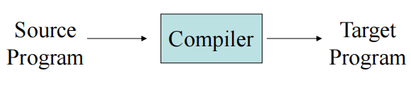
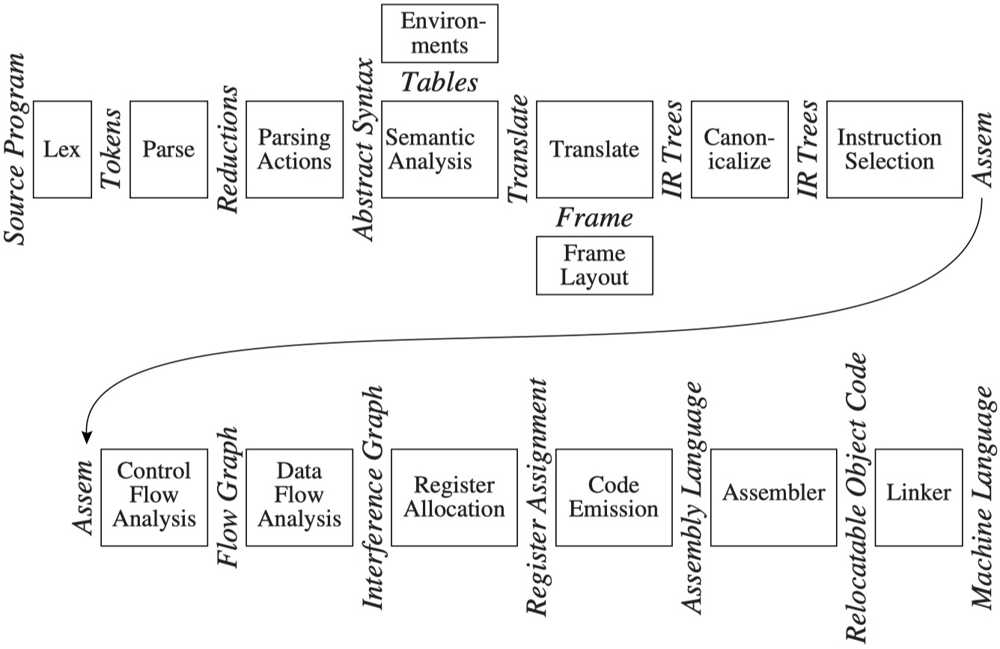

# Introduction

## What，Why and How?

- What is a Compiler?
    - 编译器就是把一种语言（源语言）翻译到另一种语言（目标语言）的一个程序

    <figure markdown="span">
        {width=75%}
    </figure>

- Why Should We Learn Compilers?
    - 帮助我们更深刻地了解技术和应用背后的原理，在其他方面也会有帮助

- How to Learn Compilers?
    - 课堂上学习理论知识
    - 实验中实现一个 SysY 到 RISC-V 的简单编译器
    - 使用课本来了解 Tiger 语言的语法以及编译器实现细节

## Modules and Interfaces

<figure markdown="span">
    {width=85%}
</figure>

在课本中，一个编译器被划分为了多个模块（阶段）以及模块间的接口：

- **Phases**: one or more modules
    - 在编译工程中操作不同的抽象“语言”
- **Interfaces**: the data structures that are passed between phases
    - 描述编译器的不同模块之间是如何进行信息交换的

| Phase | Description |
|:---:|:---:|
| Lex | 将源文件分为各个独立的单词（word）或 token |
| Parse | 分析程序的短语结构 |
| Parsing Actions | 为每个短语构建对应的抽象语法树 |
| Semantic Analysis | 确定每个短语的含义，讲变量的使用与其定义联系起来，检查表达式类型，请求翻译每个短语 |
| Frame Layout | 将变量、函数参数等以机器依赖的方式放入激活记录（栈帧 stack frames）中 |
| Translate | 生成中间表示树（IR树），不依赖于任何特定的源语言或目标机器架构 |
| Canonicalize | 将副作用移出表达式，清理条件分支以便后续阶段处理 |
| Instruction Selection | 将IR树节点分组为簇，使其与目标机器指令的动作相对应 |
| Control Flow Analysis | 将指令序列分析为控制流图，该图展示程序执行时可能遵循的所有控制流程 |
| Dataflow Analysis | 收集程序变量间信息流动的相关数据。例如，存活分析可计算每个程序变量仍需保持有效值（即存活状态）的位置 |
| Register Allocation | 选择一个寄存器来存储程序使用的各个变量和临时值；不在同一时间点活跃的变量可以共同使用同一寄存器 |
| Code Emission | 将每条机器指令中的临时名称替换为机器寄存器 |

## Tools and Software

有两种最有用的抽象：

- **Regular expressions** for lexical analysis.
- **Context-free grammars** for parsing

编译时使用的两种工具：

- **Lex**：把一个正则表达式转换成一个词法分析器（lexer）
- **Yacc**：把一个 context-free grammar 转换成一个语法分析器（parser）

