# Liveness Analysis

## Liveness Analysis

当两个临时变量永远不会同时被使用时，我们就可以把它们存储在同一个寄存器当中，以节省寄存器的数量。为了分析哪些变量可以被存储在同一个寄存器当中，我们需要分析每个变量的**生命周期**（或**活跃周期*）*，也就是它被定义和使用的范围。

!!! definition "活跃性分析"
    活跃性分析（Liveness Analysis）是编译器优化中的一种数据流分析技术，用于确定程序中每个变量在何时是活跃的。
    
    一个变量被认为是活跃的，如果它在未来某个点会被使用，我们就认为该变量此时是活跃的。

### Example

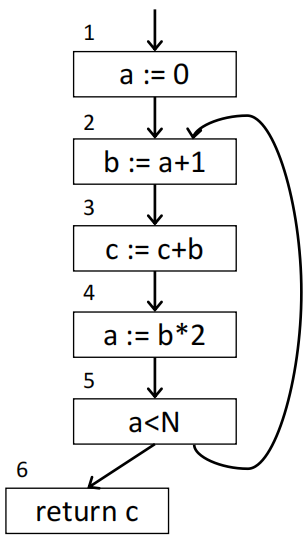{width=30% align=right}

为了分析变量的活跃性，我们可以构建一个控制流图：

- **node**：程序中的语句
- **edge**：程序的控制流。当语句 m 之后可以出现语句 n 时，就有一条边 m $\to$ n

考虑如下一个简单的程序，它的控制流图如右图所示：

```
    a <- 0
L1: b <- a + 1
    c <- c + b
    a <- b * 2
    if b < N goto L1
    return c
```

- 变量 a 在语句 1 和语句 4 中被定义，在语句 2 和 5 中被使用
- 变量 b 在语句 2 中被定义，在 3 和 4 中被使用
- 变量 c 的定义位置不确定，它可能是一个函数参数、局部变量或者甚至是一个未定义变量，我们认为它在整个程序中都是活跃的

<figure markdown="span">
    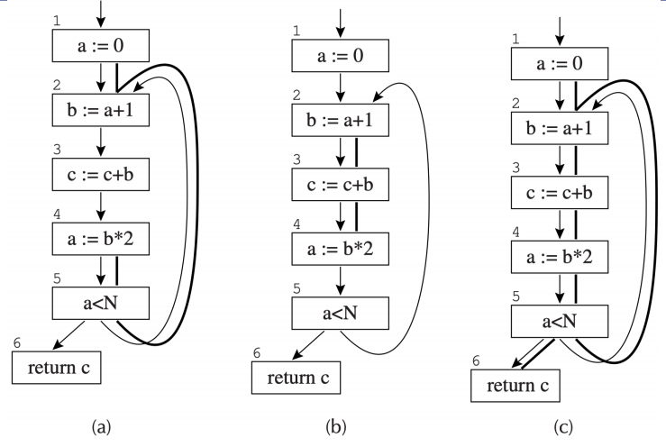{width=75%}
</figure>

从上图中我们可以看到，变量 a 和 b 永远不会同时活跃，因此它们可以被存储在同一个寄存器当中，而变量 c 则需要单独的寄存器来存储。

### Flow Graph Terminology

我们使用以下的术语来描述流图节点的属性：

- **out-edges**：从该节点指向后继节点的边的集合
- **in-edges**：从前驱节点指向该节点的边的集合
- **pred[n]**：节点 n 的所有前驱节点集合
- **succ[n]**：节点 n 的所有后继节点集合

继续以上面的程序为例：

- 节点 5 的 out-edges 是 $\{5 \to 2, 5 \to 6\}$
- $succ[5] = \{2, 6\}$
- 节点 2 的 in-edges 是 $\{1 \to 2, 5 \to 2\}$
- $pred[2] = \{1, 5\}$

### Uses and Defs

我们称对一个变量或临时变量的赋值会**定义（define）**这个变量；当一个变量出现在赋值语句或其他表达式的右侧时，我们就称这个变量被**使用（use）**了。

- $def[n]$：在节点 n 中被定义的变量集合
- $def[v]$：定义了变量 v 的节点集合
- $use[n]$：在节点 n 中被使用的变量集合
- $use[v]$：使用了变量 v 的节点集合

依旧是以上面的程序为例：

- $def(3) = \{c\}$
- $use(3) = \{c, b\}$
- $def(a) = \{1, 4\}$
- $use(a) = \{2, 5\}$

### Liveness

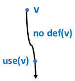{width=20% align=right}

如果在某条边上存在一条从这条边指向对变量 v 的 use 的路径，并且在这条路径上没有定义 v 的节点，那么我们就说变量 v 在这条边上是**活跃的**。

- 这个变量会在后续被使用
- 这个变量在被使用之前不会被重复定义

我们还有几个用于描述变量状态的术语：

- **live-in**：如果一个变量在某节点的 in-edges 上是活跃的，那么我们就说这个变量在该节点是 live-in 的
- **live-out**：如果一个变量在某节点的 out-edges 上是活跃的，那么我们就说这个变量在该节点是 live-out 的
- **in[n]**：节点 n 的 live-in 变量集合
- **out[n]**：节点 n 的 live-out 变量集合

## Dataflow Equation for Liveness

变量的活跃性信息（in[n] 和 out[n]）可以通过它们的 use 和 def 计算出来：

- **Rule 1**：If $a \in in[m]$ for $\exists m \in succ[n]$, then $a \in out[n]$
- **Rule 2**：If $a \in use[n]$, then $a \in in[n]$
- **Rule 3**：If $a \in out[n]$ and $a \not\in def[n]$, then $a \in in[n]$

前两条规则是显然的：如果一个变量在某个后继节点的 live-in 变量集合中，那么它一定在在当前节点的 live-out 变量集合中；如果一个变量在当前节点被使用了，那么它在当前节点的 live-in 变量集合中。

第三条规则需要注意的是，如果一个变量在当前节点的 live-out 变量集合中，则可能存在两种情况：这个节点定义了这个变量，或这个变量在该节点的 live-in 变量集合中。

!!! example 
    <figure markdown="span">
        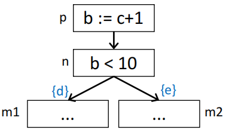{width=75%}
    </figure>

    假设：$in[m1] = \{d\}, in[m2] = \{e\}$

    那么根据上面的三条规则，我们可以推断出如下结果：

    - $out[n] = \{d, e\}$
    - $in[n] = \{b, d, e\}$
    - $out[p] = \{b, d, e\}$
    - $in[p] = \{c\} \cup (\{b, d, e\} - \{b\}) = \{c, d, e\}$

我们可以把上面这三条规则总结为两条数据流方程：
$$ \begin{aligned}
in[n] &= use[n] \cup (out[n] - def[n]) \\\\
out[n] &= \bigcup_{s \in succ[n]} in[s]
\end{aligned} $$

在实际使用中，我们可以通过迭代法来求上述两个方程的解：

<figure markdown="span">
    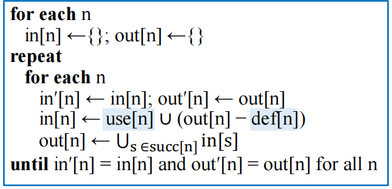{width=75%}
</figure>

- 通过分析语句 n 本身我们就可以知道 use[n] 和 def[n]，因此我们将它们视为已知值
- 每一次迭代都会向 in[n] 和 out[n] 中添加新的变量，当它们不再发生变化时，我们就得到了最终的解

!!! example "前向计算求解数据流方程"
    <figure markdown="span">
        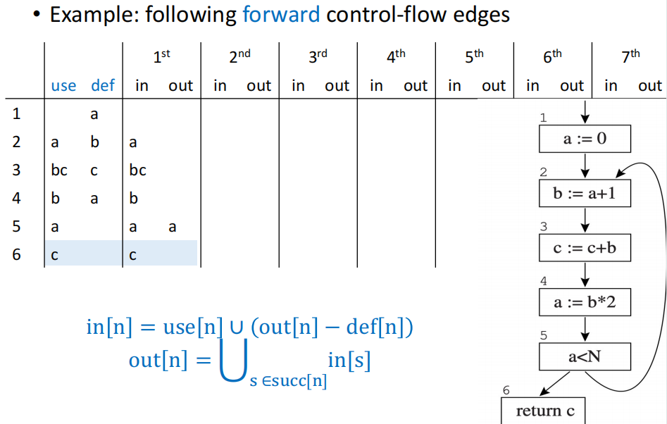{width=75%}
    </figure>

    在第一次迭代后，得到的结果如上图所示。这种方法无疑是非常低效的，因为每次迭代都需要从头到尾遍历整个控制流图，这就导致迭代的次数可能会非常多。

    <figure markdown="span">
        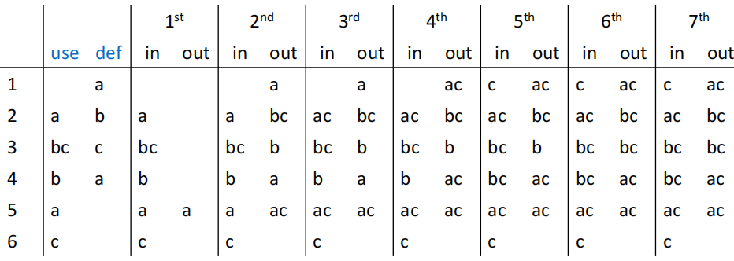{width=75%}
    </figure>

我们不难注意到，对于一个节点 n 来说，out[n] 的值是由它的后继节点的 in[s] 决定的，而 in[n] 可以结合它自身的 out[n] 以及 use[n] 和 def[n] 来计算出来。因此，我们可以通过先计算 out[n]，再计算 in[n] 的方式来后向计算求解数据流方程。

!!! example "后向计算求解数据流方程"
    <figure markdown="span">
        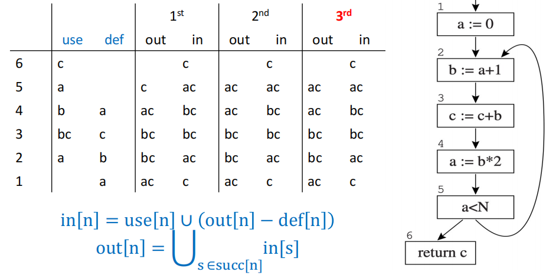{width=75%}
    </figure>

    可以看到，通过后向计算，我们只需进行少量的迭代就可以到达稳定解，效率得到了极大的提升。

## More Discussions

### Variants of the Calculation

计算变量的活跃性还有一些变体：

- **Basic Block**：在流图中，仅有一个前驱节点和一个后继节点的节点意义不大，我们可以把这些节点和它们的前驱、后继节点合并成一个节点，得到一个节点数更少的图结构，每一个节点就代表一个基本块（Basic Block）。

    在基本块内部，变量的活跃性是相同的，因此我们可以直接对基本块进行活跃性分析。

- **One variable at a time**：当需要某个变量的信息时，单独计算这个变量的数据流

    在实际中有用，因为许多临时变量的生命周期非常短暂，我们只需要分析它们的活跃性，而不需要分析所有变量的活跃性。

### Representations of Sets

集合 in[n] 和 out[n] 具有两种基本操作：集合的并、集合之间做差。有多种数据结构可以用来表示这些集合：

- **Bit Arrays**：每个变量对应一个位，集合中的变量对应的位为 1，不在集合中的变量对应的位为 0

    - 用于稠密集合
    - 假设程序中有 N 个变量，每一个 word 有 K 个 bit，那么每个集合的大小就是 N bits
    - 并集操作：对两个集合对应的 bit 进行按位或操作，共需要 N/K 次位运算

- **Sorted Lists**：将所有变量按照键（例如变量名称）的顺序排列成一个列表

    - 用于稀疏集合
    - 并集操作：将两个列表合并

### Time Complexity

在一个大小为 $N$ 的程序中，至多有 $N$ 个节点和 $N$ 个变量

- 每次集合运算的最差情况需要遍历所有变量，时间成本为 $O(N)$
- 在循环当中，单次遍历需要经过所有的节点，节点数为 $O(N)$，因此单次迭代的时间成本为 $O(N^2)$
- 由于 in 和 out 都是单调增长的集合（每一次迭代都至少有其中之一增加了一个变量，否则就已经到达稳定解了），对于每一个节点来说，它们的这两个集合的大小都不超过 $N$，一共至多有 $N$ 个节点，因此所有的 in 和 out 的大小总和不超过 $2N^2$，因此迭代的次数也不超过 $O(N^2)$
- 综上所示，**在最差情况下，活跃性分析的时间复杂度为 $O(N^4)$**。但在实际几乎不可能出现这种情况，实际的复杂度大约在 $O(N)$ 到 $O(N^2)$ 之间。

### Least Fixed Points

```
    a <- 0
L1: b <- a + 1
    c <- c + b
    a <- b * 2
    if b < N goto L1
    return c
```

我们还可以假设存在一个在该程序片段中未被使用的变量 d，那么得到的 in 和 out 集合就会发生改变：

<figure markdown="span">
    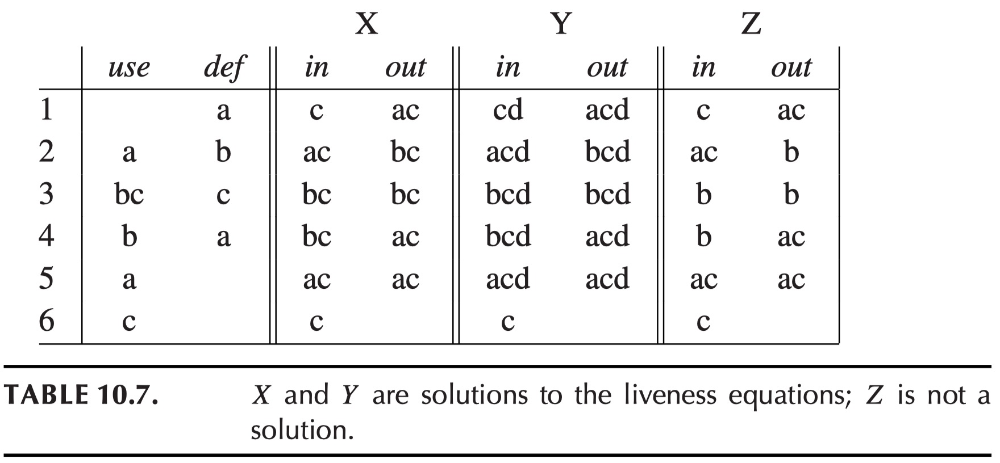{width=75%}
</figure>

对于我们已知的 use 和 def 来说，X 和 Y 都是满足数据流方程的解，尽管它们并不相同；Z 一定是错误的，因为它不满足数据流方程。

事实上对于数据流方程的所有解都是一种近似解（approximate solution），因为可能还会存在许多在程序片段中完全没有出现，但是实际存在的程序变量，我们能做的就是求出最小的近似解（least solution），也就是满足数据流方程的所有解的交集。

- 如果我们无法确定一个变量在某个节点是否活跃，我们就保守地认为它是活跃的
- 虽然这可能导致编译后的代码使用比实际所需更多的寄存器，但总是能保证程序的正确性

!!! definition "Least Fixed Point"
    最小不动点（Least Fixed Point）是满足数据流方程的所有解的交集：

    - X 是数据流方程的解
    - 方程的所有解都包含 X（即 X 是所有解的交集）

    所有的方程都存在一个最小不动点，并且迭代算法总是能够找到这个最小不动点。

    > 具体证明略

### Static and Dynamic Liveness

<figure markdown="span">
    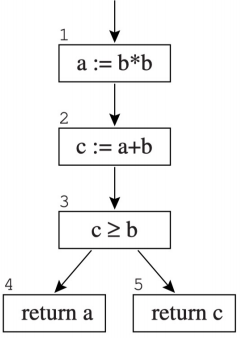{width=75%}
</figure>

我们可以很容易知道 `c >= b` 是一个恒为真的式子，因此节点 4 永远不会被执行到，因此变量 a 实际上在节点 2 之后就不再是活跃的了。

但是任何编译器都无法完全理解每个程序中所有控制流的具体运行机制——这可以由停机问题推导出来，具体证明略。这表明并不存在一种能始终准确判断控制流走向的通用算法，因此我们只能采用保守的近似算法：假设所有条件分支都会被执行到，即认为所有的边都是可达的，这些分支上的所有变量都是活跃的。

因此我们可以定义出**静态活跃性（Static Liveness）**和**动态活跃性（Dynamic Liveness）**：

- **动态活跃性**：一个变量 a 在节点 n 上是动态活跃的，如果在程序的某次执行过程中，存在一条从 n 出发的路径，这条路径可以到达 a 的一个 use，并且在这条路径上没有 a 的 def
- **静态活跃性**：一个变量 a 在节点 n 上是静态活跃的，如果在程序的控制流图中，存在一条从 n 出发的路径，这条路径可以到达 a 的一个 use，并且在这条路径上没有 a 的 def

如果变量 a 在节点 n 上是动态活跃的，那么它一定在节点 n 上也是静态活跃的。

## Interference Graphs

活跃性分析的最重要应用之一就是寄存器分配。我们将阻止两个变量被分配到同一个寄存器的状态定义为**干扰（interference）**：如果两个变量在某个节点上同时活跃，那么它们就会干扰对方。

有两种类型的干扰：

- 变量的活跃范围重叠
- 当变量 a 必须由某条无法寻址寄存器 r1 的指令生成时，则 a 和 r1 之间存在干扰

干扰的常见表达方式包括：

- 矩阵：一个 $N \times N$ 的矩阵，其中 $N$ 是变量的数量，如果变量 i 和 j 之间存在干扰，则在矩阵中的第 i 行第 j 列的做标记（例如设值为 1）
- 无向图：每个变量对应一个节点，如果两个变量之间存在干扰，则在它们之间画一条无向边

<figure markdown="span">
    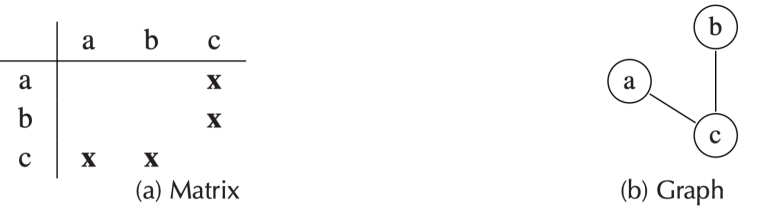{width=75%}
</figure>

### Special Treatment of MOVE instructions

我们不应在 MOVE 操作的源操作数和目标操作数之间引入人为干扰，考虑下面这个例子：

```
t := s          // copy
x := ... s ...  // use of s
y := ... t ...  // use of t
```

一般而言，因为 t 和 s 同时活跃，我们会添加一条干扰边 (s, t)。但因为它们存储的是相同的值，因此我们可以先不添加干扰边 (s, t)，如果后续它们之中出现了非 move 的 define，再添加干扰边 (s, t)。

```hl_lines="2"
t := s          // copy、
t := ...        // non-move define of t
x := ... s ...  // use of s
y := ... t ...  // use of t
```

因此，对每一个 define 添加干扰边的规则如下：

- 对于定义了变量 a 的非 move 指令 n，其中 $out[n] = \{b_1, \cdots, b_j \}$，我们需要添加干扰边 $(a, b_1), \cdots, (a, b_j)$
- 对于 move 指令 n（如 `a := s`），其中 $out[n] = \{b_1, \cdots, b_j \}$，我们需要添加干扰边 $(a, b_1), \cdots, (a, b_j)$，但如果 $b_i$ 是 move 指令 n 的源操作数（即 $b_i = s$），则不添加干扰边 $(a, b_i)$
