# Register Allocation

在 chap10 的最末尾，我们计算出了**冲突图（interference graph）**，而在 chap11 中，我们的任务是为变量分配寄存器。一个很显然的想法是：在冲突图中相互连接的两个节点不能被分配到同一个寄存器中，因为它们的生命周期是重叠的。

我们可以将这个问题抽象为**图着色问题（graph coloring problem）**，也就是给冲突图中的每个节点分配一个颜色，使得相邻的节点不能有相同的颜色。如果颜色数量（即可用的寄存器数量）不足以为所有节点分配颜色，那么我们就需要将一些变量溢出（spill）到内存中。

!!! abstract "寄存器分配整体流程"
    寄存器分配（或者说图着色问题）是一个 NP 完全问题，因此我们只能使用一种线性时间的近似算法来给出一个足够好的结果。这个算法可以分为四个主要阶段：

    1. **Build**：根据活跃性分析构建冲突图
    2. **Simplify**：简化冲突图，反复移除度数小于 $k$ 的节点，直到图为空或者所有节点的度数都 $\geqslant k$，其中 $k$ 是可用寄存器的数量。被移除的节点会被压入一个栈中，等待后续的着色阶段
    3. **Spill**：溢出处理，当图中所有节点的度数都 $\geqslant k$ 时，我们需要选择一个节点作为 potential spill variable，将其从图中移除，并将其标记为溢出变量。然后我们回到 Simplify 阶段，继续简化图
    4. **Select**：从栈中不断弹出节点，为其分配颜色（寄存器）；如果没有可用的颜色（邻居已用光 $k$ 种颜色），则将其标记为溢出变量，发生 actual spill

## Coloring By Simplification

> 构建干扰图的过程可以利用上一章的活跃性分析结果来完成，这里不再赘述。

### Simplify

我们假设已经有了干扰图，并且有 k 个可用的寄存器。我们可以使用简化算法来为干扰图着色。

一种不难得出的 observation 是：

!!! note "核心观察"
    如果图 $G$ 中有一个度数小于 $k$ 的节点 $m$，记将其从图中移除后得到的图为 $G' = G - \{m\}$，那么 $G$ 可被 $k$ 着色的充分必要条件是 $G'$ 可被 $k$ 着色。

    - **充分性**：如果 $G'$ 可被 $k$ 着色，那么我们一定可以为节点 $m$ 分配一个不与其邻居冲突的颜色（因为 $m$ 的 degree 小于 $k$），从而得到 $G$ 的 $k$ 着色
    - **必要性**：如果 $G$ 可被 $k$ 着色，那么将节点 $m$ 移除后得到的图 $G'$ 也一定可被 $k$ 着色

由此我们可以得出一个**基于栈的（或者说递归式的）化简算法**：

1. 找到一个度数 < k 的节点，将其从图中移除并压入栈中
2. 移除操作会降低其他节点的度数，可能会产生新的度数 < k 的节点，重复步骤 1
3. 重复上述步骤直到图为空或者所有节点的度数都大于等于 k

### Spill

在 simplify 过程中的某个阶段，可能会出现**图 G 中剩余的所有节点的度数都大于等于 k**的情况（我们称这些节点是 of significant degree 的），这时我们就需要进行溢出处理（spill）。

spill 的含义是寄存器数量不足，我们可能需要将其存储在内存中，而不是寄存器中。我们可以选择一个节点作为 potential spill 节点，将其从图中移除，并将其标记为溢出变量。然后我们回到 simplify 阶段，继续简化图。

- 这里我们使用了一种乐观的近似方法：被 spill 的节点不会再影响图中的其他节点，可以直接将其溢出并压入栈中，等待后续的着色阶段。
- 我们可以在后续的 select 阶段中为其分配寄存器，如果没有可用的寄存器，则将其标记为 actual spill。

??? example 
    假设最开始时图 G 如下图所示，栈是空的。

    <figure markdown="span">
        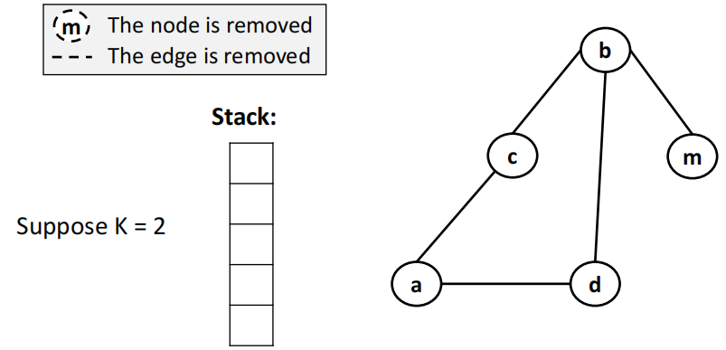{width=65%}
    </figure>

    当我们移除了节点 m 之后，发现图中剩余所有节点的度数都大于等于 k，这时我们就需要选择一个节点作为 potential spill 节点，将其从图中移除，并将其标记为溢出变量，这里我们选择节点 b。

    <figure markdown="span">
        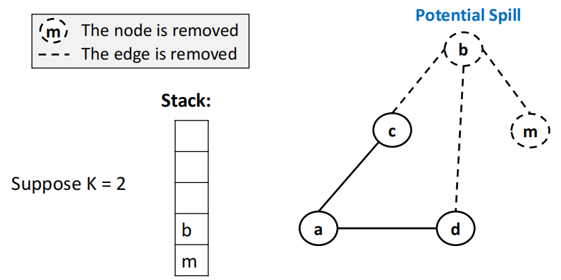{width=65%}
    </figure>

    然后我们回到 simplify 阶段，继续简化图，直到图为空或者所有节点的度数都大于等于 K（此时需要再次找一个 potential spill 节点）。

    <figure markdown="span">
        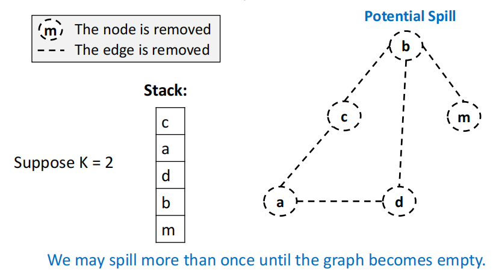{width=65%}
    </figure>

### Select

Select 阶段是从栈中不断弹出节点，为其分配颜色（寄存器）。如果 potential spill variable 在 pop 时发现没有可用的颜色（邻居已用光 k 种颜色），则将其标记为溢出变量，发生 actual spill。

- 从一个空图开始，不断将节点从栈顶弹出，为其分配一个不与其邻居冲突的颜色（寄存器），尝试重建原始图
- 如果没有可用的颜色（邻居已用光 k 种颜色），则将其标记为溢出变量，发生 actual spill

!!! example
    延续上一个例子，我们从栈中不断弹出节点，为其分配颜色（寄存器），直到栈为空。

    <figure markdown="span">
        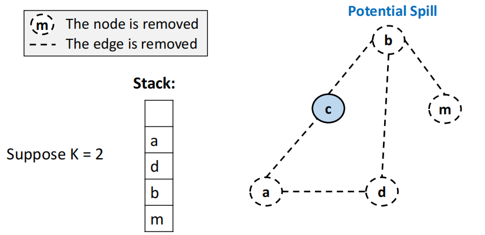{width=65%}
    </figure>

    <figure markdown="span">
        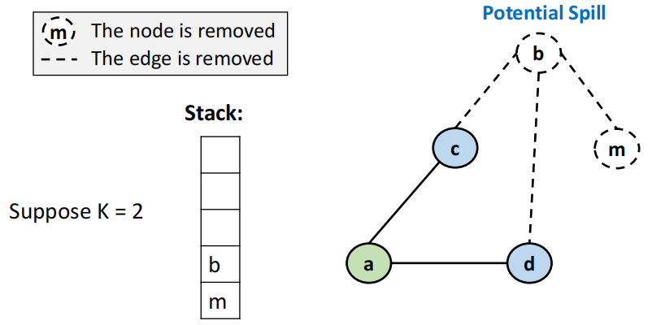{width=65%}
    </figure>

    这里的节点 b 是虽然一个 potential spill 节点，但是我们其实可以为它分配一个不与任何邻居冲突的颜色（蓝色），因此在本次的图着色过程中并没有发生 actual spill。

    <figure markdown="span">
        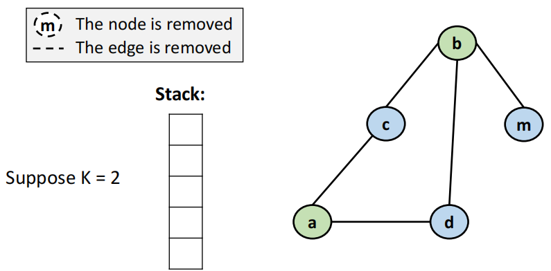{width=65%}
    </figure>

!!! tip "Actual Spill"
    在 select 阶段弹出一个 potential spill 节点 n 时：

    - 如果 n 的邻居使用的**颜色数 < k**，则我们**可以**为 n 分配一个不与其邻居冲突的颜色，不会发生 actual spill
    - 如果 n 的邻居使用的**颜色数 = k**，则我们**无法**为 n 分配一个不与其邻居冲突的颜色，发生 actual spill

    例如下面这个例子中的节点 d 就发生了 actual spill，但我们还是会继续弹出后续的节点，只不过认为节点 d 已经溢出到内存中，不再参与图着色。

    <figure markdown="span">
        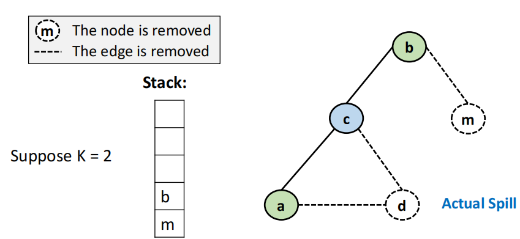{width=65%}
    </figure>

### Start Over

如果在 select 阶段出现 actual spill，那么我们就需要重写整个程序，将涉及到发生 actual spill 的变量的操作与内存操作关联袭来 —— 每次使用这个变量时都需要从内存中加载到寄存器中，每次修改这个变量时都需要将其从寄存器中写回到内存中。

具体的修改方法如下：

- 在每一次 **use** 之前都插入一个 load 操作，将变量从内存中加载到寄存器中
- 在每一次 **def** 之后都插入一个 store 操作，将变量从寄存器中写回到内存中

这样一来，一个 spill 变量的生命周期就被分成了多个不连续的片段，相当于多个生命周期很短的 temporary，这些新变量会成为冲突图中的新节点，可能会与其他节点冲突。因此我们需要从头开始重新构建冲突图，并重新进行 build、simplify、select 阶段，直到没有 actual spill 发生为止。

- 实际中通常只需要 1~2 次迭代就可以达到收敛

!!! summary
    <figure markdown="span">
        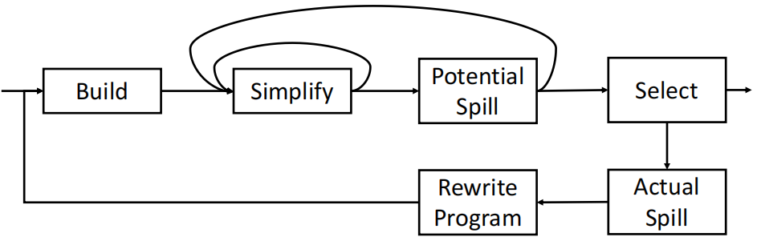{width=75%}
    </figure>

??? example
    假设 $K=4$，

    <figure markdown="span">
        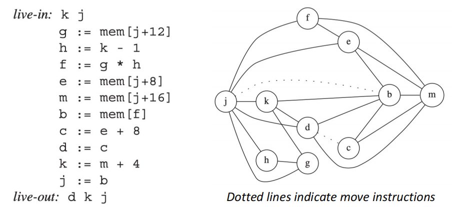{width=75%}
    </figure>

    - 在 simplify 阶段，可以注意到 g、h、c、f 这四个节点的度数小于 4，可以直接移除
    - 当移除了 g、h 之后，发现 k 的度数降低了，也可以移除
    - 继续依次移除节点 k、d、j、e、f、b、c、m
    - 在此过程中没有出现 potential spill 节点，因此 simplify 阶段结束后，我们可以直接进入 select 阶段

    <figure markdown="span">
        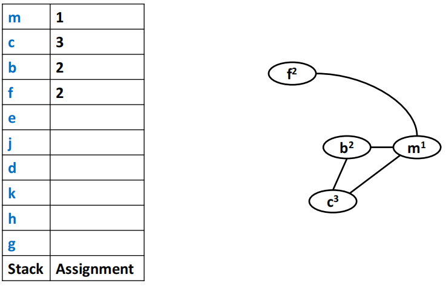{width=75%}
    </figure>

    <figure markdown="span">
        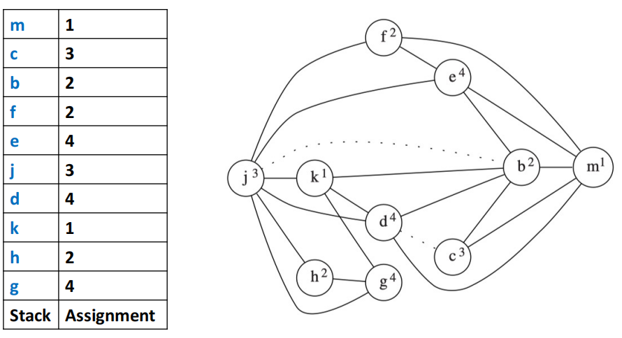{width=75%}
    </figure>

## Coalescing

### Motivation

在上一个 chap 中构建干扰图时，我们知道如果两个变量在某个节点中被 MOVE 指令相互赋值，例如 `s := t`，那么它们存储的实际上是相同的值，可以不添加干扰边。一个直观的想法是，既然它们保存的是完全相同的值，那么实际上这个 MOVE 指令可以直接删去，然后将这两个变量合并为一个节点，从而减少冲突图中的节点数量，降低图着色的难度。

因此，如果 MOVE 指令的源变量和目标变量在冲突图中不相互干扰，那么我们就可以将它们合并为一个节点，从而消除这个 MOVE 指令，这个过程被称为**合并（coalescing）**。

- 合并后的节点的边是两个节点的边的并集

<figure markdown="span">
    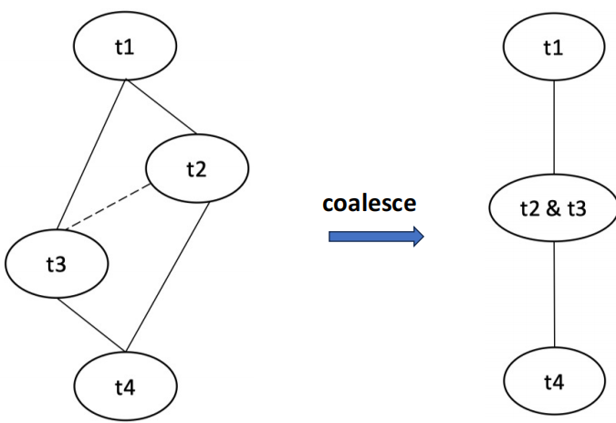{width=65%}
</figure>

但是合并操作可能会导致一些问题：合并后的节点的度数可能会大于等于 k，从而导致原先是 k-可着色的图不再可以被 k 种颜色着色。为了避免这种情况，我们需要在合并前进行一些检查，确保合并后的节点仍然是 k-可着色的。

有两种经典的方法来进行这种检查：**Briggs 方法**和 **George 方法**。

### Briggs

!!! note "Briggs 方法"
    节点 a 和 b 可以合并，当且仅当合并后的节点 ab 的高度数（significant degree，degree $\geqslant$ K）邻居的数量少于 K 个。

**理由**：

- simplify 阶段会先移除所有的度数小于 K 的节点，因此此时 ab 只与剩下来的高度数邻居相邻（其他邻居节点都被移除了）
- 如果 ab 的高度数邻居数量少于 K 个，那么在 select 阶段我们仍然可以为 ab 分配一个不与其邻居冲突的颜色，不改变图的 k-可着色性。

### George

!!! note "George 方法"
    节点 a 和 b 可以合并，当且仅当对于 a 的每一个邻居 t，要么 t 已经与 b 相邻，要么 t 的度数小于 K。

**理由**：

- 如果 t 已经与 b 相邻，边 $(a, t)$ 和边 $(b, t)$ 在合并后会变为边 $(ab, t)$，因此不会增加图中任何一个节点的度数
- 如果 t 的度数小于 K，那么在 simplify 阶段 t 会被移除，因此不会影响 select 阶段为 ab 分配颜色

### summary

加入了合并操作后，寄存器分配的整体流程如下：

<figure markdown="span">
    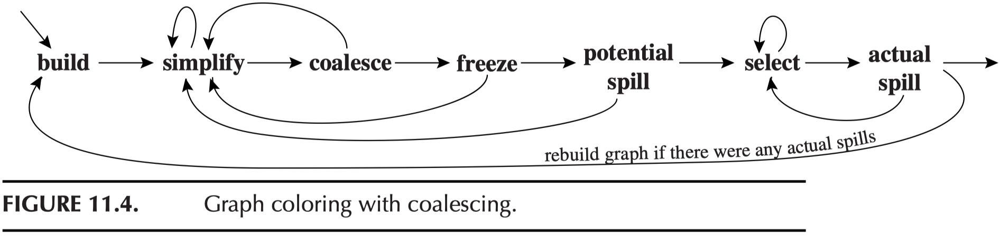{width=80%}
</figure>

1. **Build**：
    - 根据活跃性构建冲突图
    - 标记 move-related 节点（将 MOVE 指令的源节点和目标节点用虚线连接）
2. **Simplify**：
    - 简化冲突图，反复移除度数小于 k 的并且非 move-related 的节点
3. **Coalesce**：
    - 在化简后的图上进行保守合并操作
    - 若合并生成的节点不再是 move-related 的，则可以再次进行 simplify
    - 反复进行 simplify 和 coalesce，直到图中只剩下 move-related 的节点或度数大于等于 k 的节点
4. **Freeze**：
    - 当 simplify 和 coalesce 都无法进行时，选择一个度数低的 move-related 的节点，**放弃它的合并可能性**，将其视为非 move-related 的节点，然后回到 simplify 阶段重新执行
5. **Spill**：
    - 当 simplify、coalesce 和 freeze 都无法进行时，选择一个高度数节点作为 potential spill 节点，将其从图中移除，并将其标记为溢出变量
    - 然后我们回到 simplify 阶段，继续简化图
6. **Select**：
    - 从栈中不断弹出节点，为其分配颜色（寄存器）
    - 如果没有可用的颜色（邻居已用光 k 种颜色），则将其标记为溢出变量，发生 actual spill

!!! tip
    并不是所有的被虚线连接的节点都是可以合并的，我们需要使用 Briggs 或者 George 方法来判断它们是否可以合并。

## Precolored Nodes

一部分寄存器被用于特殊用途，这些物理寄存器通常会与特殊的 temporary 永久绑定：

- 栈指针寄存器（stack pointer register）
- 帧指针寄存器（frame pointer register）
- 函数参数寄存器（argument registers）
- 返回值寄存器（return value registers）

这些 temporary 对应的节点是 precolored（预着色）的，因为它们在冲突图中已经被预先分配了颜色（寄存器），并且有以下性质：

- 这些预着色节点在程序的整个生命周期中都是活跃的，因此它们在冲突图中与其他预着色节点相互连接。
    - 因此每种颜色都至多只能存在一个预着色节点
    - 我们可以为普通的临时变量分配与预着色节点相同的颜色，前提是两者不会发生冲突
- 预着色节点**不能被 simplify**（它们的颜色已经固定了）
- 预着色节点**不能被 spill**（因为它们必须使用相应的物理寄存器，否则程序无法运行）
- 预着色节点可以与普通节点进行**保守合并**
    - 使用 George 判据时，必须选普通节点作为 a 来测试可合并性

### Temporary Copies of Machine Registers

着色算法会不断进行 simplify、coalesce、spill 等操作，直到图中只剩下预着色节点为止。

因为预着色节点不会 spill，为了缩短它们的 live range，有时寄存器的 front-end 会生成相应的 MOVE 指令来将其中的值移出/移入到普通节点中，从而避免预着色节点的值在整个程序中都保持活跃，影响其他普通节点的着色。

<figure markdown="span">
    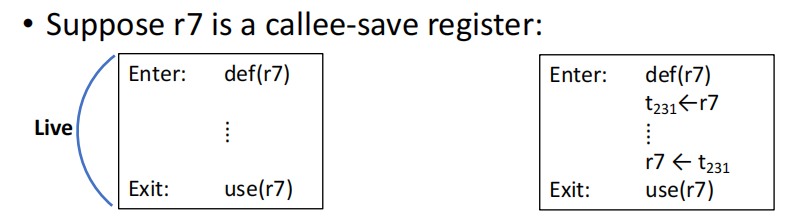{width=80%}
</figure>

例如在上图中我们将寄存器 r7 的值分配到了一个临时变量 t231 中，从而做到了 r7 的值只在需要的时候才保持活跃：

- 如果寄存器的使用压力较大，t231 的值会被 spill 到内存中去，需要时再取出来
- 如果寄存器的使用压力较小，t231 会和 r7 合并，因此 MOVE 指令会被消除，实际上这个变量的值一直保存在 r7 中

### Caller-Save and Callee-Save Registers

<figure markdown="span">
    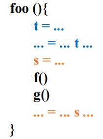{width=80%}
</figure>

上图中的寄存器分为两类：

- 蓝色部分是不跨函数调用的变量，通常被分配给 caller-save 寄存器
- 橙色部分是在多个函数调用中都存活的变量，通常被分配给 callee-save 寄存器，由被调用者负责保存/恢复其中的值

### Example with Precolored Nodes

最后我们用一个结合了本章所有内容的例子来说明寄存器分配的整个流程（k = 3）：

首先我们将一个简单的 c 语言转换为相应的中间代码：

<figure markdown="span">
    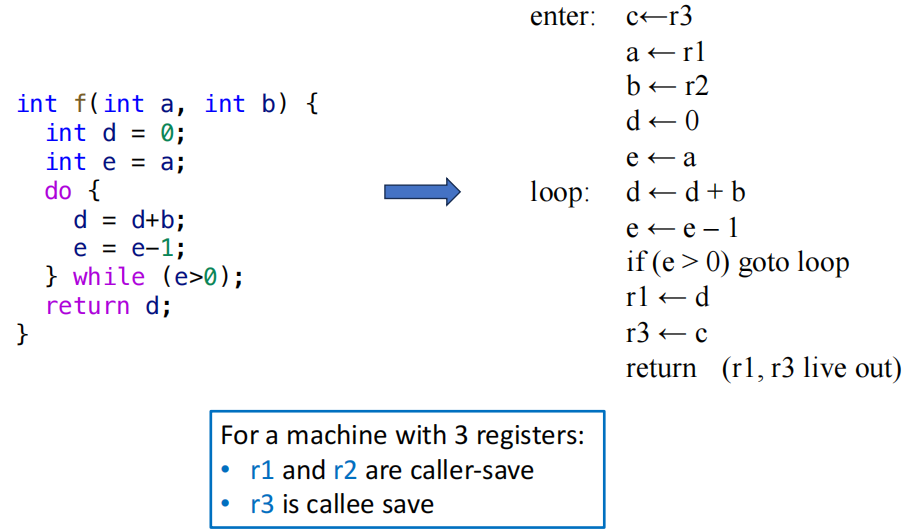{width=80%}
</figure>

- r1、r2、r3 是预着色节点，不能被 simplify 或 spill
- r3 是 callee-save 寄存器，因此需要一个单独的临时变量 c 来专门保存它的值
- r1 和 r2 是 caller-save 寄存器，其中保存的是函数参数，需要把其中的内容取出来

我们可以构建一个如下所示的冲突图：

<figure markdown="span">
    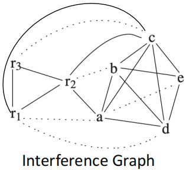{width=80%}
</figure>

我们可以发现没有 simplify 和 freeze 的机会，所有的非预着色节点的度数都 $\geqslant k$，并且合并操作也是不行的。因此我们必须选择一个节点作为 potential spill 节点。

!!! note "如何选择 spill 节点"
    在选择 spill 节点时，我们总是希望选择 spill 之后对**程序性能影响最小的节点**（即最度数尽可能多，但是不常被使用的节点），通常我们会使用以下的启发式（spill priority 越低越应该被优先溢出）：
    $$ \text{spill priority} = \frac{c_{out}(n) + 10 \times c_{in}(n)}{\text{degree(n)}} $$

    其中 $c_{out}(n)$ 是节点 n 的在循环之外的 uses + defs 之和， $c_{in}(n)$ 是节点 n 的在循环之内的 uses + defs 之和，degree(n) 是节点 n 的度数。

    我们可以用以下的直观理解来解释：

    - 使用和定义次数越少的变量 spill cost 越低
    - 在循环内被频繁定义和使用的变量 spill cost 很高，因为需要多次执行 load/store 操作
    - 度数高（说明冲突多）的变量更难以被着色，应该优先被溢出

<figure markdown="span">
    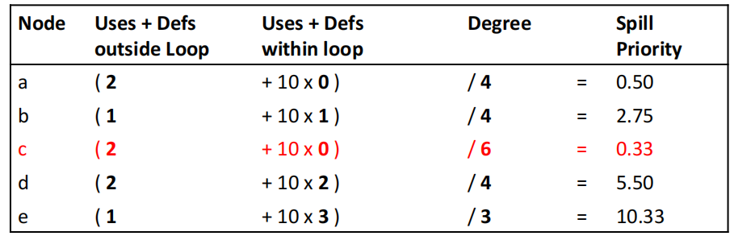{width=80%}
</figure>

经过计算我们决定选择节点 c 作为 spill 节点。后续的操作不再详细解释，可以从结合先前的内容来理解：

<figure markdown="span">
    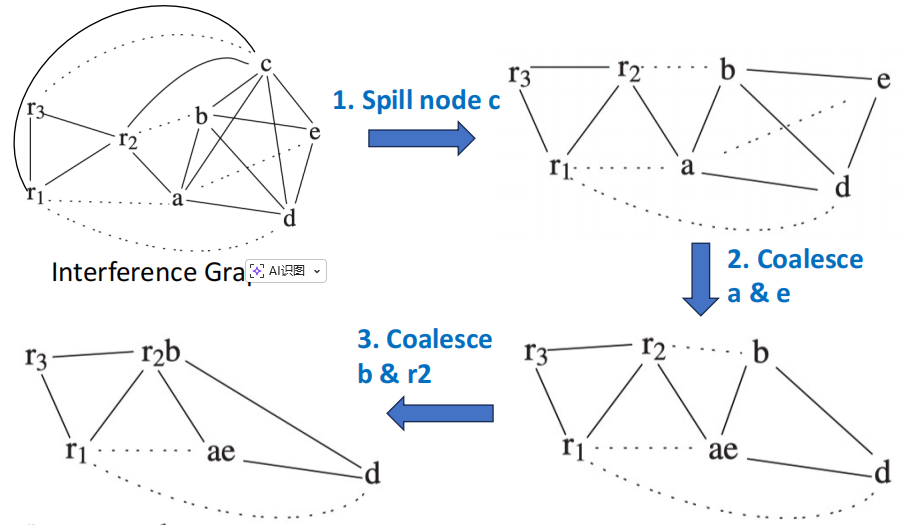{width=80%}
</figure>

<figure markdown="span">
    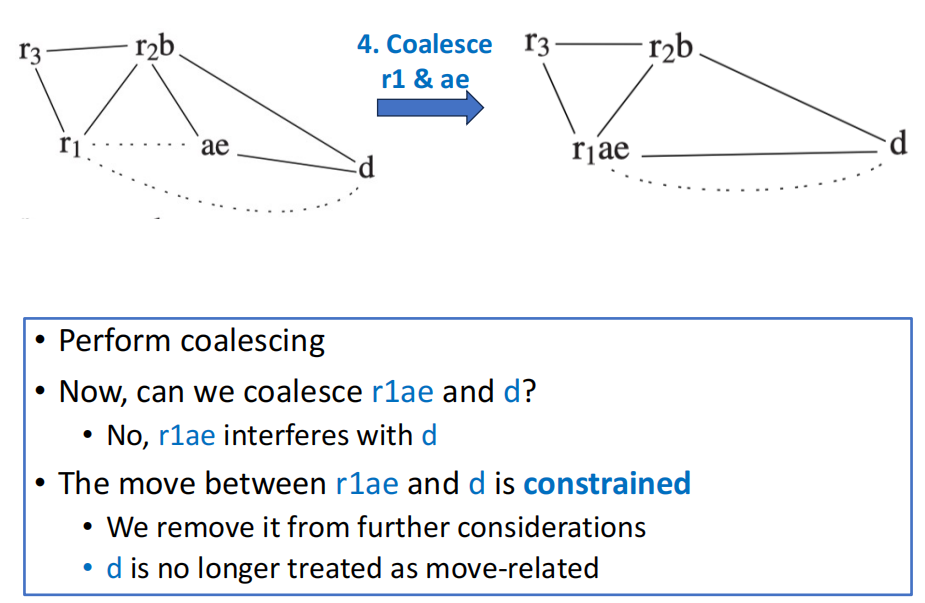{width=80%}
</figure>

<figure markdown="span">
    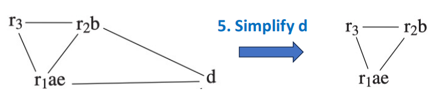{width=80%}
</figure>

<figure markdown="span">
    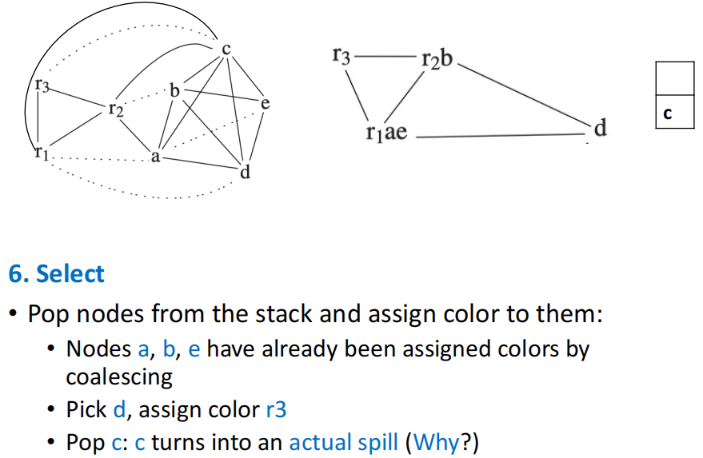{width=80%}
</figure>

- 到这一步我们已经完成了 select 阶段的着色操作，但是因为节点 c 发生了 actual spill，因此我们需要重写程序
- 首先在 c 的每一次 def 之后都插入一个 store 操作，将其值写回到内存中
- 然后在 c 的每一次 use 之前都插入一个 load 操作，将其值从内存中加载到寄存器中

<figure markdown="span">
    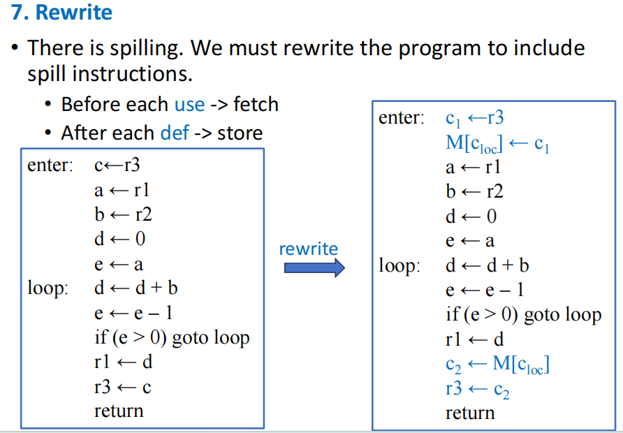{width=80%}
</figure>

- 如上图所示，我们已经重写了整个程序，现在需要重新构建冲突图，并重新进行 build、simplify、select 阶段，直到没有 actual spill 发生为止。

<figure markdown="span">
    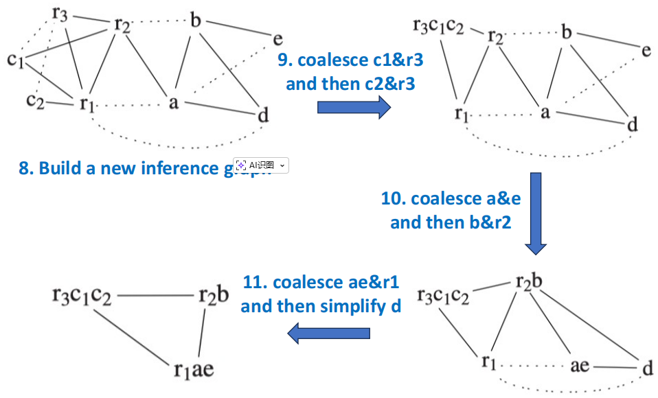{width=80%}
</figure>

<figure markdown="span">
    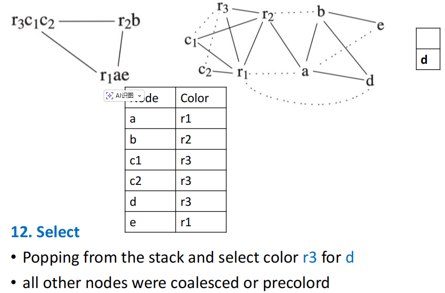{width=80%}
</figure>

<figure markdown="span">
    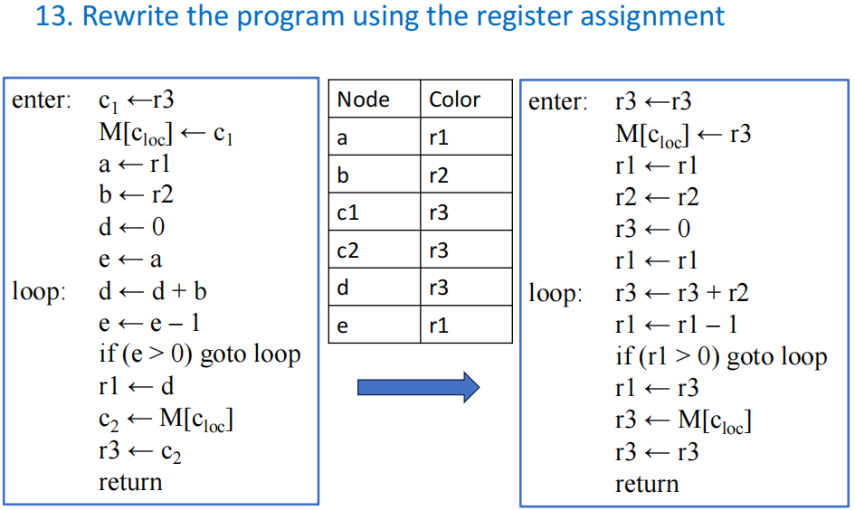{width=80%}
</figure>

- 为所有的变量都分配了颜色（其实就是分配了寄存器）之后，我们可以把所有的临时变量替换为相应的寄存器，最终得到如上图所示的中间代码

<figure markdown="span">
    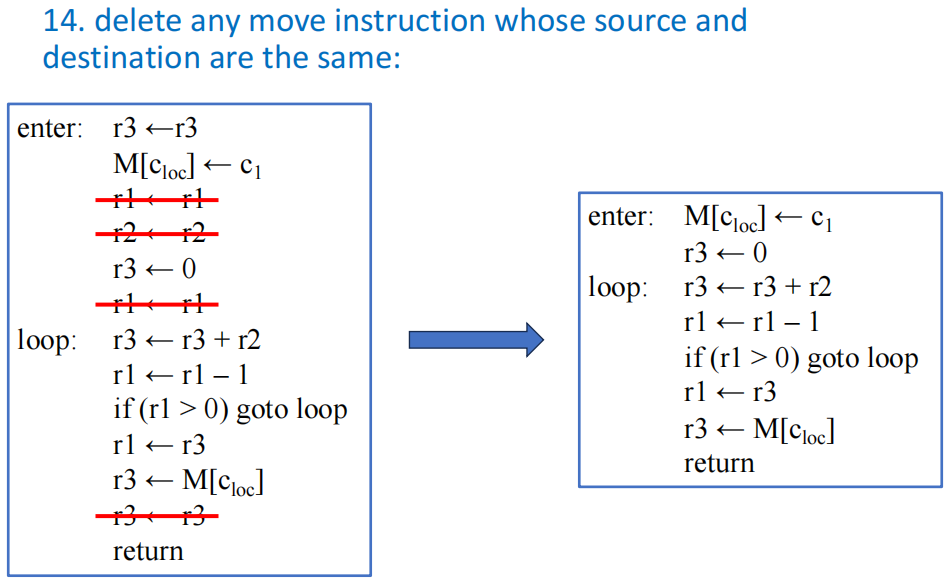{width=80%}
</figure>

- 最后我们可以对中间代码进行化简，删除无意义的 MOVE 指令，得到如上图所示的最终中间代码