# Garbage Collection

**垃圾回收（Garbage Collection，GC）**是指自动管理内存的过程，主要目的是自动地释放不再使用的内存空间，以便程序可以继续运行而不会耗尽内存资源。垃圾回收时**程序运行时**系统的职责（而非编译器的职责），但是编译器应当为垃圾回收提供必要的支持。

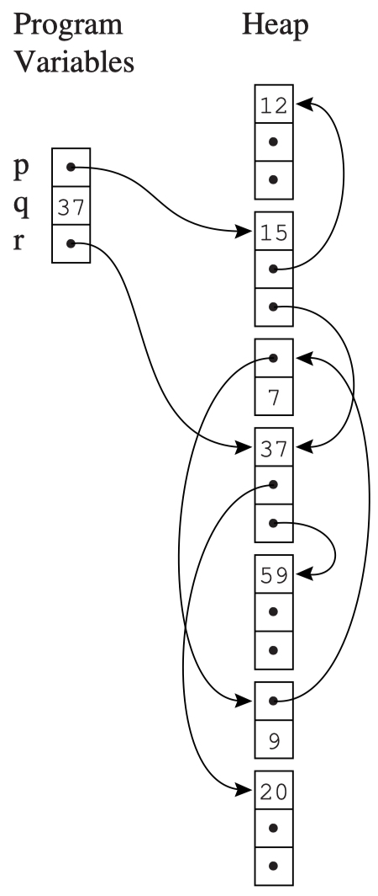{width=22% align=right}

在最理想的情况下，GC 机制能回收任何未来不会被用到的数据和记录，但是精确判断这一点是不可能做到的，我们只能使用保守的可达性信息来近似：

- **可达性**：如果一个对象可以通过一系列的引用（或者说指针）从根对象（如全局变量、栈上的局部变量等）访问到，那么这个对象就是可达的。否则，它就是不可达的。

    可达的概念可以用以下两个条件来判断：

    - 某个寄存器包含指向这个对象的指针
    - 其他的可达对象中包含指向这个对象的指针
    
- 如果一个对象不可达，那么它就是垃圾对象，可以被回收。

如右图所示，程序变量（寄存器、堆上的局部变量、全局变量等）和被分配在 heap 中的记录会构成一个有向图。程序变量是这个有向图的根（roots），从根出发可以访问到的记录都是可达的；无法从根访问到的记录就是不可达的，可以被回收。

## Mark-and-Sweep Collection

Mark-and-Sweep 是一个两阶段的垃圾回收算法：

- **Mark 阶段**：从根对象出发，用 DFS 遍历所有可达的对象，并将它们标记为“已访问”。

    <figure markdown="span">
        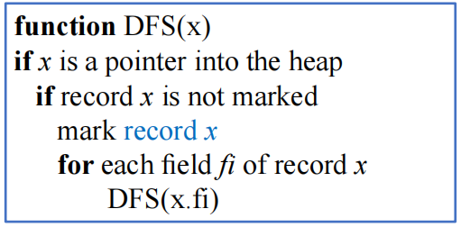{width=70%}
    </figure>

- **Sweep 阶段**：线性扫描整个堆，将所有未标记的节点（垃圾对象）链接到一个 freelist，表示这些内存空间可以被重新分配。并且清楚所有已标记节点的标记，为下一次 GC 做准备

    <figure markdown="span">
        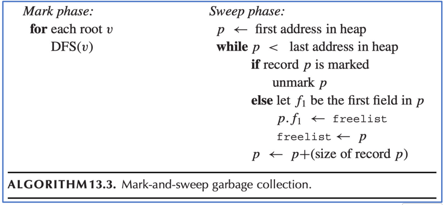{width=70%}
    </figure>

每当需要在堆中分配新纪录时，程序会从 freelist 中找到一个空位分配；当 freelist 为空时，会再次触发一次垃圾回收机制。

### Cost

我们可以对 Mark-and-Sweep 算法的成本进行一些分析：

- 设 $H$ 为堆的大小，$R$ 为所有可达数据的大小
- Mark 阶段的时间复杂度为 $O(R)$，Sweep 阶段的时间复杂度为 $O(H)$，因此总的时间复杂度为 $c_1 R + c_2 H$
- GC 会为 freelist 添加 $H-R$ 个 word 的新空间，因此每个 word 的摊销成本（amortized cost）为
$$ \frac{c_1 R + c_2 H}{H-R} $$

    - 当 $R$ 接近 $H$ 时，摊销成本会非常高

### Using an Explicit Stack

Mark-and-Sweep 算法存在一个显著问题：DFS 算法是递归的，在极端情况下，它的递归栈会形成一个含有 H 个 activate record 的链表，大小比整个堆还大，这显然是不合理的。

一个解决办法是用数组来作为**显式栈（explicit stack）**来代替递归调用，这样就可以避免递归栈过大的问题。这样一来使用的空间就是 H 个 word，而非 H 个 activate record。

<figure markdown="span">
    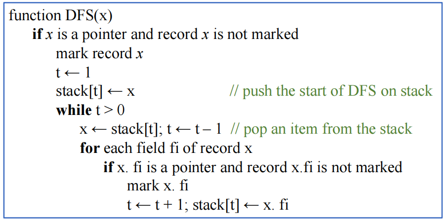{width=70%}
</figure>

其中 t 是栈顶的下标，`stack` 中保存的是指向待访问且未被标记的 record 的指针

### Pointer Reversal

解决递归栈过大的另一种方法是使用**指针反转（pointer reversal）**技术来实现 DFS 遍历。其基本思想是使用 record 的指针构成一个有向图，从而利用 record 中的指针域来保存 DFS 的回溯信息，从而避免使用额外的栈空间。

观察上面显式栈算法的最后两行，我们注意到在将字段 `x.fi` 的内容（这是一个指针）压入栈中之后，`x.fi` 的原始内容将不会再被使用，那么我们就可以用 `x.fi` 来保存 DFS 的回溯信息，从而避免使用额外的栈空间

- 当栈发生 pop 时，就恢复 `x.fi` 的原始内容

指针反转算法可以概括为：

- 在搜索过程中遇到新纪录 `x` 时：
    - 标记记录 `x` 为已访问
    - 在执行 `DFS(x.fi)` 之前，将 `x.fi` 的原始内容保存下来（为了 DFS 能搜索后续目标），然后将 `x.fi` 设置为指向当前节点的父节点（指针反转）
    - 当无法继续搜索时，沿着 `x.fi` 回溯到父节点，并恢复 `x.fi` 的原始内容

??? example "指针反转的直观展示"
    <figure markdown="span">
        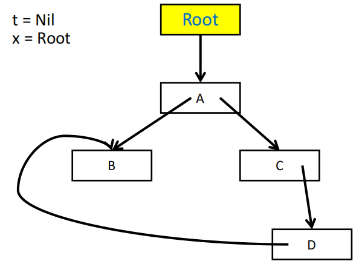{width=70%}
    </figure>

    <figure markdown="span">
        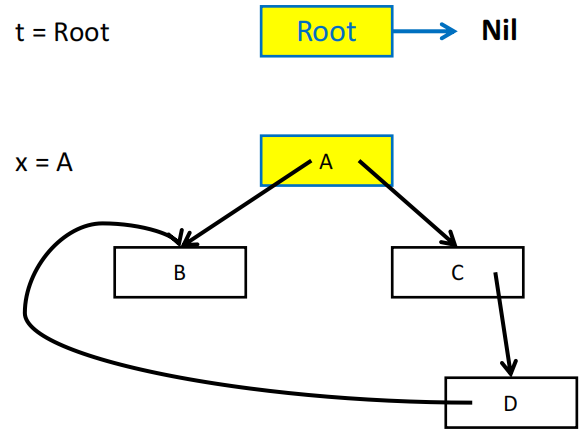{width=70%}
    </figure>

    <figure markdown="span">
        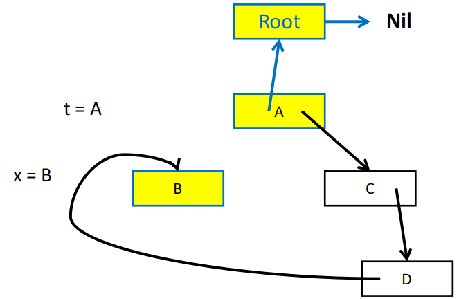{width=70%}
    </figure>

    <figure markdown="span">
        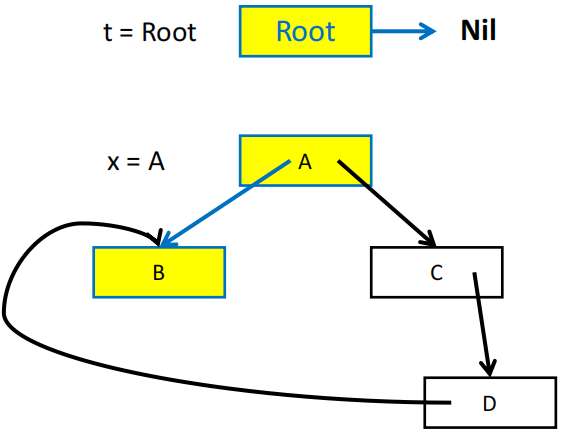{width=70%}
    </figure>

    <figure markdown="span">
        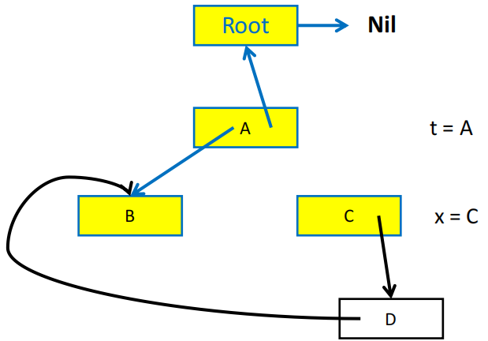{width=70%}
    </figure>

    <figure markdown="span">
        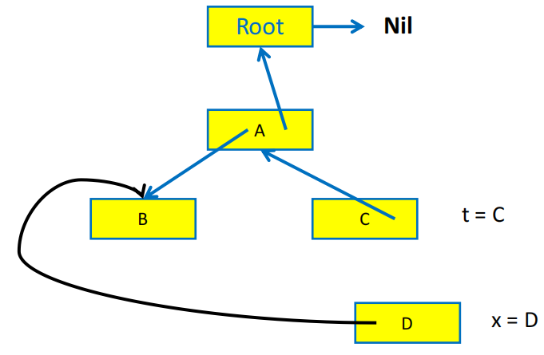{width=70%}
    </figure>

    <figure markdown="span">
        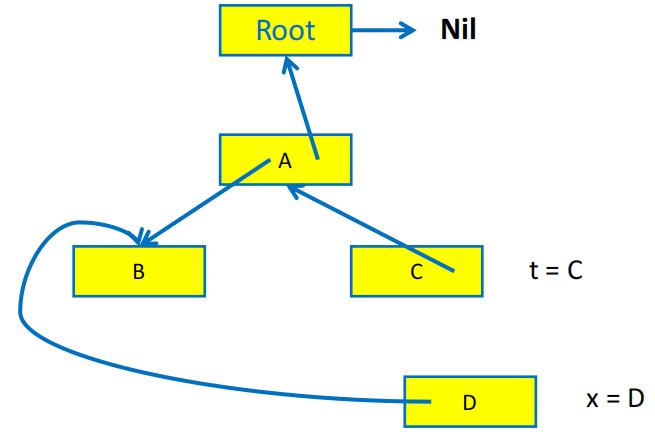{width=70%}
    </figure>

    <figure markdown="span">
        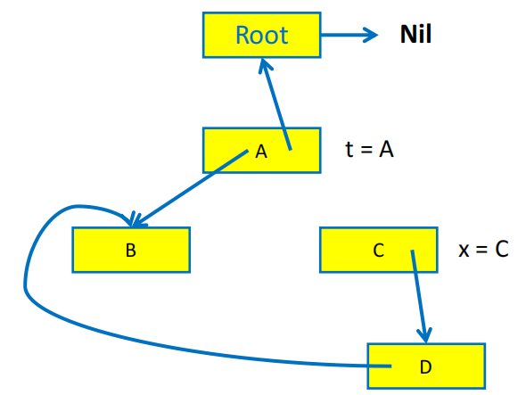{width=70%}
    </figure>

    <figure markdown="span">
        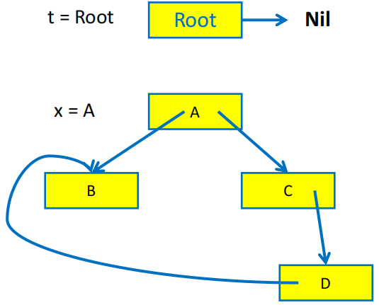{width=70%}
    </figure>

    <figure markdown="span">
        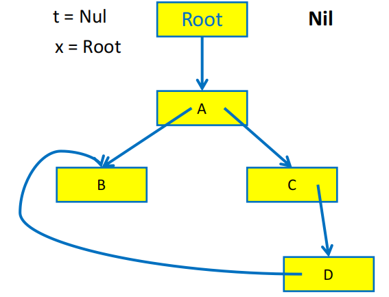{width=70%}
    </figure>

指针反转算法需要用一个 `done` 数组来记录当前的 record 已经处理了多少个字段，例如 `done[x0] = 0` 表示 record `x0` 的第一个字段（下标从 0 开始）还没有被访问过，`done[x0] = 1` 表示 `x0` 的第一个字段已经被访问过了，接下来要访问的是第二个字段。

```c
function DFS(x):
  if x 是指针且 x 未被标记
    t <- nil                            // t 是栈顶指针，指向当前正在访问的节点的父节点
    mark x; done[x] <- 0
    while true
      i <- done[x]                      // 当前 x 已经处理了多少个字段
      if i < #fields in x               // 还有字段没有被访问过
        y <- x.fi                       // 访问 x 的第 i 个字段
        if y 是指针 且 y 未标记
            x.fi <- t; t <- x; x <- y   // 指针反转，入栈
            mark x; done[x] <- 0        // 准备访问更深的节点
        else
          done[x] <- i + 1              // 访问下一个字段
      else                              // x 的所有字段都已经被访问过了
        y <- x; x <- t                  // 出栈，把指针反转回来
        if x = nil then return          // 说明刚刚的 x 就是根节点，停止 DFS
        i <- done[x]                    // 回到父节点，准备访问父节点的下一个字段
        t <- x.fi; x.fi <- y            // 恢复指针
        done[x] <- i + 1                // 访问父节点的下一个字段
```

!!! summary
    - **优点**：
        - 在 GC 期间对象/记录不会被移动
        - 能处理循环引用问题
    - **缺点**：
        - 进行 GC 时程序会被暂停
        - 可能导致堆上内存碎片化，导致 cache miss 以及更复杂的内存分配问题

## Reference Counting

### Idea

- 为每个记录维护一个**引用计数**，表示指向这个记录的指针数量
- 当一个新的引用被建立时，引用计数加 1；当一个引用被删除时，引用计数减 1
- 当引用计数归零时，说明这个记录不会再被任何对象访问到，可以被回收

### Implementation

编译器在每次出现使用到记录 p（例如 `x.fi = p`）的赋值操作时，都会在生成的代码中插入一些指令来维护引用计数：

```
// 先减小 x.fi 原来的值的引用计数
z <- x.fi
z.refcount <- z.refcount - 1
if z.refcount = 0 then free(z)

// 再增加 p 的引用计数
x.fi <- p
p.refcount <- p.refcount + 1
```

!!! note
    当记录 `z` 被移入 freelist 时，我们可以直接递减它的各字段 `z.fi` 的引用计数，但一种更好的方法是在 `z` 被移出 freelist 时（即它占据的空间被重新分配给其他记录时）再递减它的各字段的引用计数，这么做有两个好处：

    - 将递归的引用计数递减操作分解为了更短的片段，能提升对实时性要求较高的程序的效率
    - 递归的引用计数递减仅会发生在 alloctor 中，而不会发生在程序的其他部分，从而减少了对程序其他部分的干扰

### Problems and Pros & Cons

引用计数存在一些问题：

1. 无法解决循环引用问题，例如 `x.fi = y` 和 `y.fi = x`，即使 `x` 和 `y` 都不再被任何对象引用，是不可达的，它们的引用计数仍然为 1，因此无法被回收
2. 需要在每次赋值操作时都需要添加多条指令来维护引用计数，增加了运行时的开销

!!! summary "Reference Counting"
    **优点**：

    - 实现简单，容易理解
    - 可以在程序运行时就进行垃圾回收，而不需要暂停程序的执行
    - 可以在对象被回收时立即释放内存，减少内存占用

    **缺点**：

    - 无法回收循环引用的对象
    - 维护引用计数的开销较大，尤其是在有频繁的赋值操作的程序中
    - 出现大量的递归回收时可能导致程序卡顿

## Copying Collection

**基本思想**：将内存分为两个半区

- **from-space**：程序当前正在使用的半区
- **to-space**：空闲的半区，用于存放从 from-space 中复制过来的可达对象

当 from-space 耗尽，需要进行 GC 时，会遍历程序变量构成的图，将所有可达记录**复制**到 to-space 的连续区域中；当复制完成后，from-space 中的所有记录都可以被回收，然后交换 from-space 和 to-space 的角色。

<figure markdown="span">
    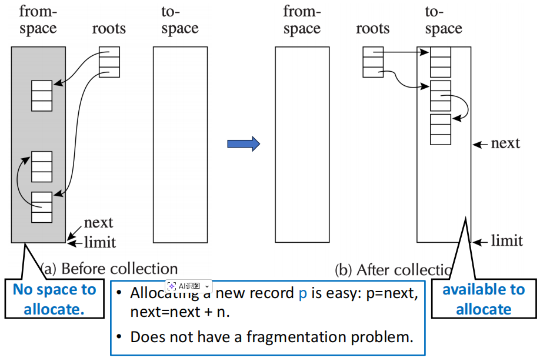{width=70%}
</figure>

### Pointer Forwarding

实现复制收集的一种方法是**指针转发（pointer forwarding）**。其基本思想是在复制时为每个记录添加一个额外的字段 `forwarding pointer`，用于指向它在 to-space 中的副本。之后任何一个指向原始记录的指针都可以通过 `forwarding pointer` 来转而改为指向它在 to-space 中的副本。

```c
function Forward(p)
  if p 指向 from-space then 
    if p.f1 指向 to-space             // 已复制，f1 是转发指针
      return p.f1
    else                             // 未复制
      for each field fi of p         // 修改 p 的各字段指针，使其指向 to-space 中的副本
        next.fi <- p.fi              // next 表示的是 to-space 中将要被分配内存的地址
      p.f1 <- next                   // 把 f1 设置为转发指针
      next <- next + sizeof(record p)// 改变 next 的值，用于为下一个对象的副本分配内存
      return p.f1
  else
    return p                         // 非指针或已指向 to-space
```

### Cheney's Algorithm

Cheney's Algorithm 的思想是采用 BFS 遍历可达数据，并且在复制过程中利用 to-space 中已经复制过来的记录来保存回溯信息，从而避免使用额外的栈空间。

Cheney's Algorithm 引入了指针扫描机制，使用 `scan` 和 `next` 将 to-space 划分为三个部分：

- **Copied**：记录已经被复制，但是记录内部的指针未必已经被扫描（指针可能还没转发）
- **Copied and Scanned**：记录已经被复制，并且记录内部的指针已经被扫描（指针已经转发）
- **Empty**：记录还没有被复制

<figure markdown="span">
    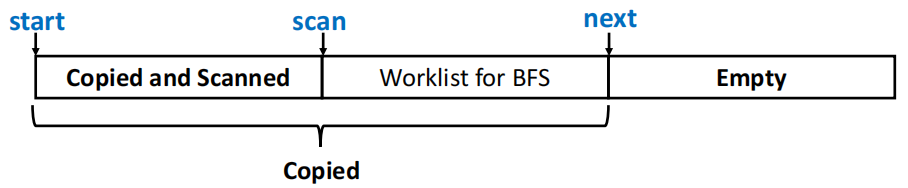{width=80%}
</figure>

```c
scan <- next <- beginning of to-space
for each root r
    r <- Forward(r)

while scan < next
    for each field fi of record at scan
        scan.fi <- Forward(scan.fi)
    scan <- scan + sizeof(record at scan)
```

<figure markdown="span">
    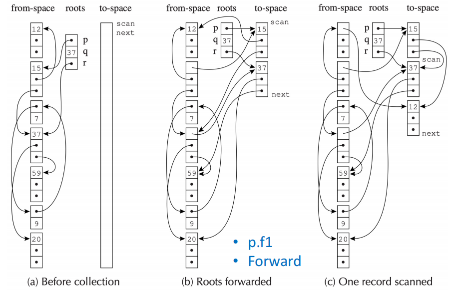{width=80%}
</figure>

!!! warning "Limitation of Cheney’s Algorithm"
    - 在计算机系统中通常会有对空间局部性的假设：
        - 如果一个对象被访问过，那么它的邻近对象也很可能会被访问
    - Cheney's Algorithm 使用的是 BFS 遍历，位于地址 a 的对象可能包含一个指向位于地址 b 的对象的指针，但 a 和 b 可能相距很远，这会破坏空间局部性假设。
    - 基于深度优先的复制策略能满足空间局部性假设，但是基于 DFS 的复制策略需要使用显式栈或者指针反转技术来保存回溯信息，实现复杂且效率低下

### A Hybrid Algorithm

为了兼顾空间局部性和避免使用额外的栈空间，我们可以使用一个结合 DFS 和 BFS 的混合算法：

```c
// Forward(p)：指针转发函数 —— 确保 p 指向的是 to-space 中的副本
//   若 p 尚未被复制，则调用 Chase 将其（及尽可能多的子孙）复制过去
function Forward(p)
  if p 指向 from-space then         // p 还指向旧半区，需要转发
    if p.f1 指向 to-space then      // 已复制，f1 是转发指针，直接返回副本地址
      return p.f1 
    else                            // 未复制，调用 Chase 进行复制
      Chase(p);                     // Chase 会把 p 及其可达子对象链式复制到 to-space
      return p.f1                   // 复制完成后，p.f1 已指向 to-space 中的副本
  else // 非指针（整数等）或已经指向 to-space，无需处理
    return p
```

```c
// Chase(p)：链式复制函数 —— 从 p 出发，沿"尚未被复制的子指针"链尽可能远地复制
//   核心思想：模仿 DFS 的"一条路走到底"，使父子对象在 to-space 中相邻，
//   从而兼顾空间局部性（优于纯 BFS 的 Cheney 算法）
function Chase(p) 
  repeat
    q <- next                           // q = to-space 中为 p 的副本分配的首地址
    next <- next + sizeof(record p)     // 推进 next，为下一轮分配预留空间
    r <- nil                            // r 记录"下一个需要 Chase 的对象"，初始为空
    for each field fi of record p       // 遍历 p 的所有字段，浅拷贝到副本 q 中
      q.fi <- p.fi                      // 将字段值原样复制到 q 的对应字段
      if q.fi 指向 from-space and q.fi.f1 不指向 to-space then  // q.fi 指向一个尚未被复制的 from-space 对象
        r <- q.fi                       // 记住它：本次复制完毕后接着 Chase 它（深度优先）
    p.f1 <- q                           // 在原对象 p 的 f1 字段设置转发指针，指向其副本 q
    p <- r                              // 转向下一个待 Chase 的对象，继续深入
  until p = nil                         // 没有更多未复制的子孙时停止
```

- 这个算法的基本思路是用 BFS 来进行复制，但在复制一个对象时，会优先检查它的子对象能否被复制到和它临近的内存空间里

!!! summary "Copying Collection"
    - **优点**：
        - 无需堆栈或指针反转操作
        - 执行时间与可达对象数成正比
        - 复制的对象在内存中是连续的，能提升空间局部性，减少 cache miss
    - **缺点**：
        - 需要额外的空间来保存 to-space，程序执行时有一半的空间被浪费
        - 需要精确的类型信息（某个字段是指针还是非指针），否则无法正确地进行复制

## Interface to the Compiler

虽然 GC 是在程序运行时进行的，但是编译器需要为支持 GC 的语言提供必要的接口功能：

### Fast Allocation

根据统计，程序中大约七分之一的指令是 store，为了减小在堆上分配内存和进行垃圾回收的开销，应该使用复制收集机制（因为速度快）

- 可分配空间应当为连续的空闲区域
- 下一个可用位置就是 to-space 中的 next 指针
- 这个区域的末尾就是该程序可用内存区域的 limit 标记

我们可以把垃圾收集机制缩小到短短几条指令（假设记录大小为 N）

```c
if next + N > limit then
    call GC() // 调用垃圾收集机制
else
    result <- next
    next <- next + N
    ... // 在 result 指向的地址处分配记录
```

### Describing Data Layouts

进行 GC 必须知道每个记录的字段数量以及每个字段是否为指针。

- **静态类型语言**：让每一个对象都包含一个指向**类型描述符（type-descriptor）**的指针，类型描述符中包含了对象的字段数量以及每个字段是否为指针的信息
- **面向对象语言**：每个类本身就包含一个类型描述符，可以直接利用类型描述符动态查找相关信息

### Pointer Map

编译器必须告诉 GC 以下信息：

- 哪些临时变量和局部变量是包含指针的
- 它们被保存在寄存器中还是 activation record（即栈帧）中

Tiger 编译器的做法是维护一个 pointer map，用于记录在**开始 GC 时，哪些寄存器和栈帧中的局部变量是指针**。

- 何时开始 GC：在每次进行 `alloc` 内存分配调用时，或每次函数调用时（可能间接调用 `alloc`）
- 最好将函数的返回地址作为 pointer map 的 key，这样在 GC 时就可以根据返回地址找到对应的 pointer map，从而知道哪些寄存器和栈帧中的局部变量是指针。
    - GC 会从栈顶向下扫描，每个返回地址对应一个 pointer map entry，GC 会根据 pointer map 来判断哪些局部变量是指针，从而进行正确的垃圾回收。
    - callee-save 寄存器需要特殊处理：假设 f 调用 g，g 调用 h。那么 g 的 pointer map 必须描述它的哪些 callee-save 寄存器在调用 h 时包含指针，以及哪些 callee-save 寄存器来自于上一层的 f 函数。

### Derived Pointers

编译器可能会生成一个指向堆记录的中间位置，或指向记录之外位置的指针，而非总是指向记录的起始地址

例如假设 a 是一个数组的起始地址

```
t1 <- a - 2000  // 一个指向数组 a 之前的位置的指针
t2 <- t1 + i
t3 <- M[t2]     // 实际访问的是 a[i-2000]
```

我们称 t1 是一个由基指针 a 派生出来的指针（derived pointer），GC 在处理派生指针时可能会出现问题。

**解决方法**：

- pointer map 必须记录哪些指针是派生指针，并且指定它们的基指针
- 当 GC 将基指针移动到 to-space 中时，GC 也必须将所有派生指针移动到 to-space 中的相应位置
- 只要派生指针依然是活跃（alive）的，那么基指针也必须是活跃的，即使看起来基指针已经不会再被使用了（即看起来是 dead 的）
