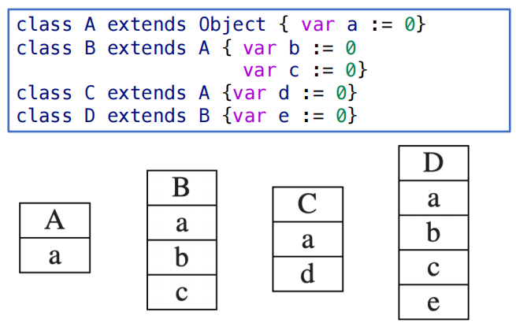
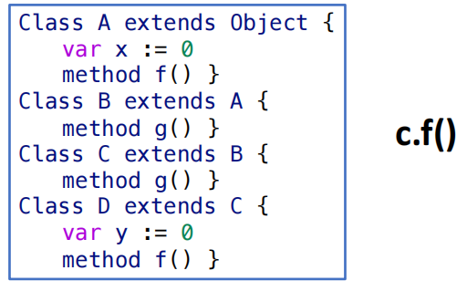
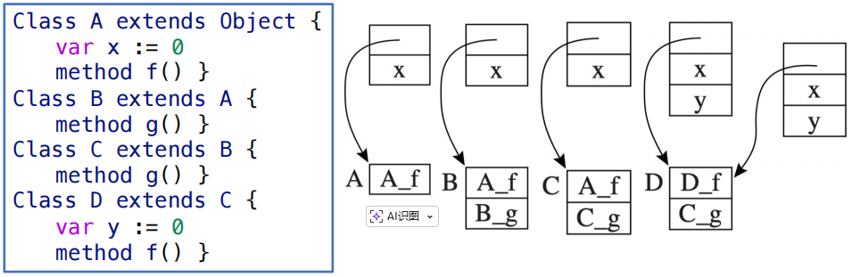
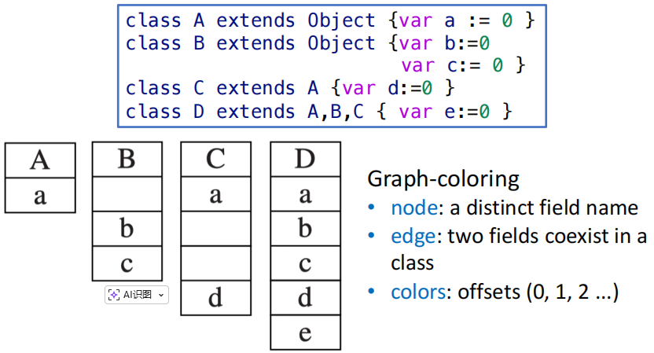

# Object-Oriented Language

!!! tip
    本章的很多内容我们都已经在 OOP 中学过了，这些内容我会直接快速掠过。

在面向对象的语言中，所有（或者说至少大部分）的“值”都是对象。对象是一个类的实例，包括**状态**和**行为**。对象的状态由类的**字段（field）**表示，行为由类的**方法（method）**表示。

面向对象语言有三个重要特征：

- **继承（inheritance）**：一个类可以继承另一个类的状态和行为。
- **封装（encapsulation）**：对象的状态和行为可以被封装在对象内部，只能通过对象提供的公开接口来访问。
- **多态（polymorphism）**：在调用对象的方法时，实际调用的是对象所属类的实现，而不是变量声明的类的实现。（动态绑定）

## Object-Tiger

### Syntax

教材和 PPT 用拓展了类的 Object-Tiger 语言作为面向对象语言的示例。它在 Tiger 原有语法的基础上新增了类声明、对象创建、类方法调用等语法。

```
dec → classdec
classdec → class class-id extends class-id { {classfield } }
classfield → vardec
classfield → method
method → method id(tyfields) = exp
method → method id(tyfields) : type-id = exp
```

Object-Tiger 还支持类的继承声明：`class B extends A { ... }` 表示类 `B` 继承自类 `A`。

- 这条语句只能出现在声明 `A` 的 `let` 表达式作用域范围内
- `A` 的所有字段和方法都隐式地属于 `B`
- `A` 的方法可以被 override，但是函数名称、参数类型和返回类型都必须完全一致
- 字段不能被 override
- 预定义类 `Object` 没有任何字段和方法，它是是所有类的父类，所有类都隐式地继承自 `Object`

类的每一个方法事实上都有一个隐式的参数 `self`，它指向调用该方法的对象本身。`self` 不是保留字，仅是每个方法中被自动绑定的标识符。

可以通过以下语法来创建类对象，访问类属性和调用类方法：

- `b = new B`
- `b.x`
- `b.f(x, y)`

```
exp → new class-id
    → lvalue . id()
    → lvalue . id(exp{, exp})
```

### Inheritance in Object-Tiger

在 PPT 的示例程序中，有 `Car extends Vehicle` 的继承声明，表示类 `Car` 继承自类 `Vehicle`。因此，类 `Car` 的对象可以访问类 `Vehicle` 的字段和方法。

```C
var c := new Car
var v : Vehicle := c
v.drive() // 调用的是 Vehicle 的 drive 方法
```

这就出现了**多态（polymorphism）**：变量 `v` 的声明类型是 `Vehicle`，但是它实际引用的对象是 `Car`。因此，调用 `v.drive()` 时，`drive()` 函数隐参数 `self` 指向的是一个 `Car` 对象，因此它调用的实际上是 `Car` 类的 `drive()` 方法，而不是 `Vehicle` 类的 `drive()` 方法。

## Single Inheritance of Data Fields

在单继承的情况下，子类继承父类的所有数据字段和方法。

### Fields

单继承的最经典做法是 prefixing：先排放父类的属性字段，然后在排放子类的属性字段。这样，父类对象和子类对象的前缀部分是相同的，因此当我们通过父类指针访问子类对象的前缀部分时，可以直接用 offset 快速访问父类的属性字段。

<figure markdown="span">
    {width=70%}
</figure>

例如上面这个例子，当我们想要访问属性 `a` 时，无论 `v` 是哪一个类的对象，我们都可以直接用 M(v + offset(0)) 来访问它。

### Methods

类的方法实例的编译方式和函数非常类似（因为其实 methods 就是一个函数）：它会被转换为一串机器码，存储在指令空间的特定位置，并用一个 label 来标识它的入口地址。

- 例如 `Truck.move()` 方法的机器码保存在指令空间的一段空间中，它的 label 为 `Truck_move`

### Static Methods

在一些面向对象语言中，类方法可以被声明为 static 的。

如果 `f` 是一个 static method，那么 `c.f()` 的调用目标只由 `c` 的**静态类型**决定：

- 首先查找 `c` 属于哪一个类，假设是类 `C`
- 然后在类 `C` 中查找方法 `f`，假设没有找到；那么就需要沿着祖先类链向上查找，直到找到方法 `f` 或者到达根类 `Object` 为止。
    - 如果找到了方法 `f`，那么就调用它；如果没有找到，那么就报错。
- 这里我们假设在祖先类 `A` 中找到了方法 `f`，因此 `c.f()` 就会被编译为 `A_f`

### Dynamic Methods

如果 `f` 是一个 dynamic method，那么 `c.f()` 的调用目标由 `c` 的**动态类型**决定：

- `c` 的静态类型可能是 `C`，但是在运行时我们可能会给 `c` 赋值为一个 `D` 类的对象（`D` 是 `C` 的子类），例如 `c : C := new D`
- 如果 `D` override 了方法 `f`，那么 `c.f()` 就会调用 `D` 类的 `f` 方法

<figure markdown="span">
    {width=70%}
</figure>

解决这个问题的方法是在每一个类中维护一个**虚函数表（virtual function table，vtable）**（或者也称为 dispatch vector），它是一个指针数组，存储了该类的所有方法的入口地址。每一个对象都包含一个指向指向它所属类的类描述符的指针，类描述符中包含 vtable。

vtable 的构建方式同样采用 prefixing：

- 子类的 vtable 首先把包含父类的 vtable，然后再排放子类自己新声明的方法的入口地址。
- override 不会改变各方法所在的 slot 位置，只会修改这个 slot 中存储的入口地址。

<figure markdown="span">
    {width=70%}
</figure>

要执行一个动态方法 `c.f()`，编译后的代码需要执行以下步骤：

1. 从对象 `c` 的偏移量为 0 的位置获得指向类描述符 `d` 的指针
2. 访问类描述符 `d`，根据 `f` 的偏移量，在 `d` 的 vtable 中取得方法 `f` 的入口地址 `addr`
3. 调用 `addr`，并把 `c` 作为隐式参数传入

## Multiple Inheritance

在多继承中，一个类 `D` 可能继承于多个类 `A, B, C`，显然我们需要思考这三个类的属性字段谁应该放在 `D` 的前缀部分。

### Global Graph Coloring

一种解决办法是对所有类进行静态分析（使用图着色算法），为每一个字段名确定一个偏移量，这个偏移量会在包含该字段的所有类中统一使用

<figure markdown="span">
    {width=70%}
</figure>

但是这样的字段布局会导致对象中间存在一些空洞（holes），在对象数量多时会大量浪费空间。一种解决方法是：

- 使用类描述符将每个对象的字段封装起来，
- 由 class descriptor 来负责维护维护该字段在本类对象中的偏移量
- 因为 class descriptor 的数量远少于对象数量（一个类只需要一个 class descriptor），因此存在空洞是可以接受的

当然这样的实现方法也有一些问题：每次访问对象的字段时都需要通过类描述符来查找偏移量，这涉及到额外的内存访问，可能会影响性能。

1. 先从类对象的偏移量为 0 的位置获得指向类描述符 `d` 的指针
2. 在类描述符 `d` 中查找属性字段 `a` 的偏移量 `offset`
3. 回到对象 `c` 中，使用 `offset` 来访问属性字段 `a`

!!! warning "Problem"
    全局的图着色要求同时看到所有的类，因此通常只能存在 link-time 完成；并且如果语言支持在程序执行时动态加载新类，原有的颜色分配可能会被破坏，因此全局图着色方法不适合于动态增量链接的系统。

### Hashing

还有另一种适合于分离编译（separate compilation）和动态增量链接（dynamic linking）的方法：在每一个类描述符中都维护一个 hash table，负责将字段名称映射到偏移量上，或者这将方法名称映射到方法实例上。

- `Ftab`：field-offset table，存储字段偏移量以及指向方法实例的指针
- `Ktab`：key table，存储字段名称指针，用于冲突检测
- 如果类中存在字段 `x`，则 `Ftab` 中的第 `hash(x)` 个元素存储字段 `x` 的偏移量，`Ktab` 中的第 `hash(x)` 个元素存储字段名称 `x` 的指针

使用 hash table 之后，访问字段可以看作一次类访问和两次表访问：

1. 先从类对象 `c` 的偏移量为 0 的位置获得指向类描述符 `d` 的指针
2. 访问类描述符，`Ktab` 保存在类描述符中，要获取字段名 `f`，需要访问地址为 `d + Ktab + hash(x)` 的位置
3. 检查是否满足 `f == ptr(x)`，如果是，则没有冲突
4. 获取字段偏移量 `offset`，它保存在地址为 `d + Ftab + hash(x)` 的位置
5. 最后，回到对象 `c` 中，使用 `offset` 来访问属性字段 `x`，`x` 的位置是 `c + offset`

## Testing Class Membership

许多 OO 语言支持在程序运行时测试某个对象是否属于某个类，例如在 Java 中可以使用 `instanceof` 关键字来测试对象的类成员关系。

假设不存在多继承，实现 `x instanceof C` 的最简单实现方法是直接沿着 class descriptor 的祖先链向上查找

```ASM
    t1 ← x.descriptor
L1: if t1 = C goto true
    t1 ← t1.super
    if t1 = nil goto false
    goto L1
```

### Display

上面那种沿着祖先链查找的方法虽然很简单，但是在类层次结构很深时查找性能会比较低，因此我们可以使用**display**来优化它：

!!! info "display"
    display 是一个指针数组，存储了当前对象的所有祖先类的 class descriptor 的指针。display 的第 `i` 个元素存储深度为 `i` 的祖先类的 class descriptor 的指针。

    假设当前类 `D` 的类嵌套深度为 j，那么在 `D` 的类描述符中

    - `display[j] = D` 
    - `display[j-1] = D.super`
    - `display[j-2] = D.super.super`
    - `display[0] = Object`
    - `display[k] = nil`，其中 k > j

利用 display，我们可以很方便地判断一个对象 `x` 是否属于类 `D`：如果在 `x` 的类描述符中，`display[j] = D`，那么它就属于类 `D`；否则就不属于。

因此实现 `x instanceof D` 就只需要三步：

1. 从类对象 `c` 的偏移量为 0 的位置获得指向类描述符 `d` 的指针
2. 访问类描述符，获取 `display[j]` 中的类指针
3. 比较这个类指针是否对应于类 D

### Type Coercions

若 `C extends B`，那么我们将 `C` 的对象视为 `B` 类是没有问题的（将子类对象视为父类，upcast）

```
// safe
var c : C := new C
var b : B := c       
```

但是将父类视为子类（downcast）是不行的，因为子类中可能包含父类中不存在的字段和方法，访问这些字段或者方法会导致未定义行为

```
var b : B := new B
var c : C := b
c.some_field_of_C_but_not_B // undefined behavior
```

因此 Java、Modula-3 这类 OO 语言会在进行 downcast 时插入一个 `instanceof` 类型检查，如果在运行时这个对象不属于该类，则抛出异常。

- C++ 的 `static_cast` 不做运行时检查，可能导致 UB；`dynamic_cast` 则相对比较安全

### Typecase

在 Module-3 语言中，存在名为 `Typecase` 的机制，它的作用是**类型分派（type-based dispatch）**，可以做到根据在运行时的动态类型来选择走不同的分支语句：

```
TYPECASE expr
OF C1 (v1) => S1
 | C2 (v2) => S2
 ...
ELSE S0
END
```

例如在上述语句中，当 `expr` 的类型满足 `Ci` 时，就会去执行语句 `Si`；当满足多个条件时（比如我们可能认为子类也属于它的父类），优先执行第一个被满足的子句。

typecase 在编译上可以被转换为一系列的 else-if 语句，每个分支都做：

1. 测试对象是否属于某个 class
2. narrowing（约束条件判断）
3. 局部变量声明

## Private Fields and Methods

一些 OO 语言可以将某些字段和方法设置为 private，使得它们不能被类外部访问，这些 private 保护通常由编译阶段的类型检查来实现

privacy 和 protection 在不同的语言中，可能具有如下的不同特性：

- 字段和方法只能在类内部访问
- 字段和方法可以被声明类及其子类访问
- 字段和方法只能在声明类所属的 module（package、namespace）中访问
- 字段可以被类外部读取，但是只能被这个类自身的方法修改
