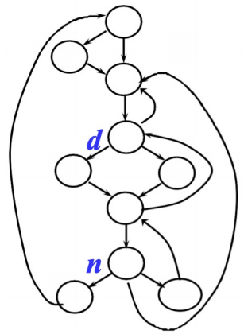
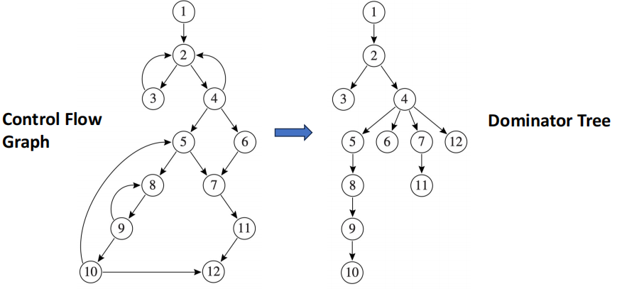
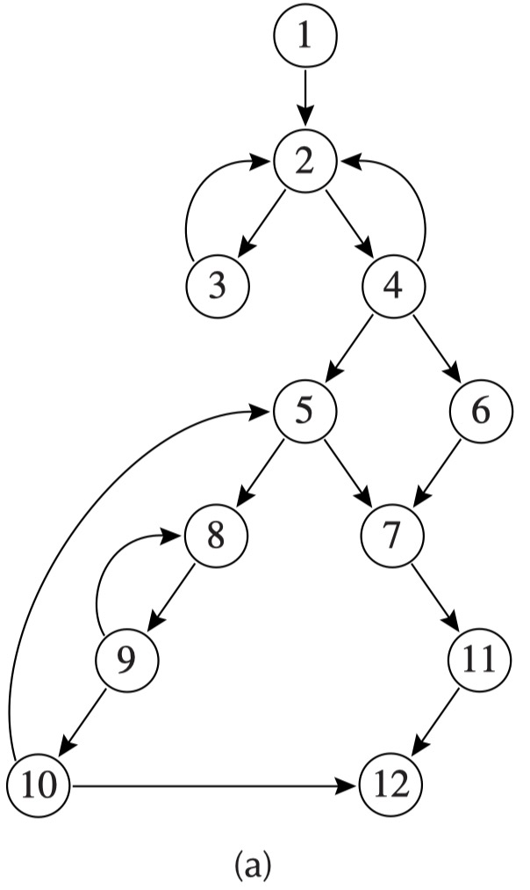
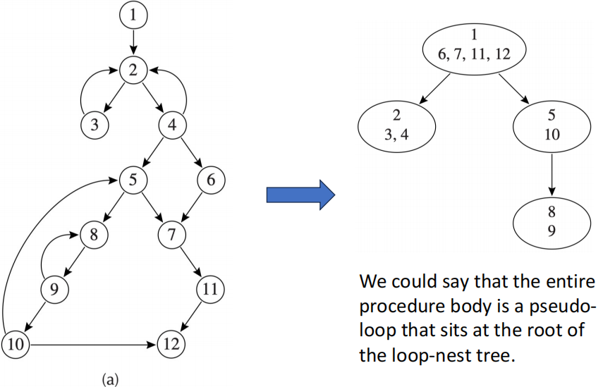
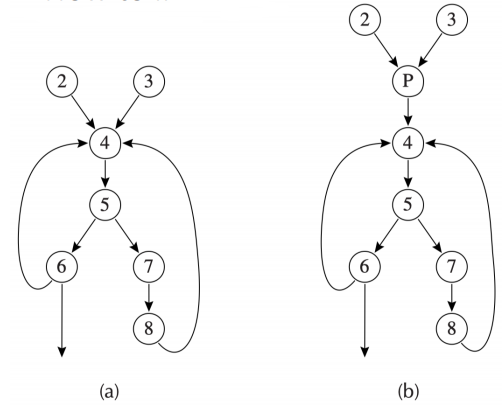
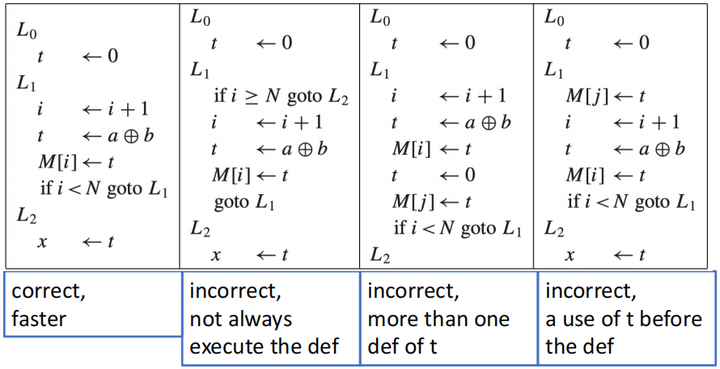
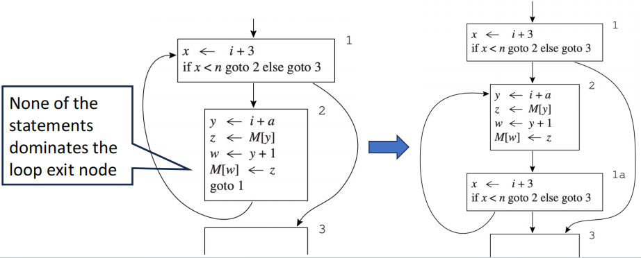

# Loop Optimization

通常来说，循环会占据程序执行的大部分时间，因此优化的编译循环对于提高程序性能至关重要。

!!! definition
    在控制流图中，一个循环（loop）是一组节点的集合 $S$，其中包含一个头节点 $h$，并且满足以下性质：

    - $S$ 中的任何一个节点都存在一条通向 $h$ 的有向边路径
    - 总存在一条从 $h$ 通向 $S$ 中任意节点的有向边路径
    - 除了 $h$ 之外，$S$ 之外的节点不存在与 $S$ 中任何节点的边（$h$ 是循环的唯一入口） 

    > 循环的唯一入口是 header，但是可以存在多个出口

- **loop entry node**：有在循环之外的前驱节点
- **loop exit node**：有在循环之外的后继节点

## Dominators

为了优化循环结构，我们需要定义节点之间的支配关系：

!!! definition "Dominator"
    > 记控制流图的起始节点为 $s_0$

    我们称一个节点 $d$ **支配（dominates）**了节点 $n$，当且仅当任何从 $s_0$ 通向 $n$ 的路径都必须经过 $d$，此时我们称 $d$ 是 $n$ 的**支配者（dominator）**。

    - 每一个节点都支配它自身
    - 一个节点可以拥有多个支配者

    <figure markdown="span">
        {width=60%}
    </figure>

假设 $D[n]$ 是所有支配 $n$ 的节点集合，那么我们可以通过以下算法来求出各个节点的支配者集合：

$$ \begin{aligned}
D[s_0] &= \{ s_0 \} \\
D[n] &= \{n\} \cup \bigcap_{p \in pred[n]} D[p] \quad (n \ne s_0)
\end{aligned} $$

- 这个算法需要多次迭代才能收敛
- 对于 $n \neq s_0$，将 $D[n]$ 初始化为图中所有节点构成的集合，因为每一次迭代只会让 $D[n]$ 不断精简

### Immediate Dominators & Dominator Tree

!!! theorem 
    在一个连通图中，如果 $d$ 支配 $n$，$e$ 也支配 $n$，那么要么 $d$ 支配 $e$，要么 $e$ 支配 $d$

我们记 $idom(n)$ 是节点 $n\, (n \neq s_0)$ 的**直接支配者（immediate dominator）**，则：

- $idom(n)$ 有且只有一个
- $idom(n)$ 不能是 $n$ 自身
- $idom(n)$ 不支配 $n$ 的其他任何 dominator

如果我们去掉数据流图中的所有边，然后为每个 $n$ 添加一条从 $idom(n)$ 指向 $n$ 的边，就可以得到一个树状图，称为 dominator tree：

<figure markdown="span">
    {width=80%}
</figure>

!!! tip
    dominator tree 中的边不一定存在于 CFG 中，例如上图中 CFG 就不存在 `4 -> 7` 的边

### Natural Loops

若在 CFG 中 $h$ 支配 $n$，并且存在一条边 `h -> n`，我们称这条边为**回边（back edge）**

一条回边 `h -> n` 的**自然循环（natural loop）**是指满足以下条件的节点 $x$ 构成的集合：

- $h$ 支配 $x$
- 存在一条从 $x$ 到 $n$ 的路径，并且该路径不经过 $h$

!!! example
    <figure markdown="span">
        {width=45%}
    </figure>

    - `3 -> 2` 的 natural loop 是 $\{3, 2\}$
    - `4 -> 2` 的 natural loop 是 $\{4, 2\}$

### Loop-Nest Tree

!!! note 
    如果循环 $A$ 和 $B$ 有不同的 header，并且 $B$ 的所有节点都在 $A$ 中（即 $B \subseteq A$），我们称 $B$ 嵌套与（nested within）$A$，或称 $B$ 是 $A$ 的**内循环（inner loop）**。

我们可以构造一个程序的 loop-nest tree，流程如下：

1. 计算出 CFG 的 dominators
2. 构造出 dominator tree
3. 找出所有的 back edge、natural loops，以及相应的循环头节点
4. 对于所有循环头节点 $h$，将 $h$ 的所有 natural loop 合并为单个节点，记为 `loop[h]`
5. 构建一个由循环头节点组成的树，根节点为 `loop[s_0]`，如果 $h_2$ 在 `loop[h1]` 中，则将 `loop[h2]` 作为 `loop[h1]` 的子节点

<figure markdown="span">
    {width=75%}
</figure>

### Loop Preheader

许多循环优化操作需要在循环开始之前插入一些语句，例如将涉及循环不变量的计算移到循环外来减小开销。但是假如 loop header 有多个外部的前驱节点，就没办法有一个统一的为之类插入这些语句。

解决方法是在 header 之前插入一个 **preheader** 节点 $p$，作为 header 的唯一前驱节点：

- $p$ 在循环之外，并且是 header 的唯一前驱节点
- 所有 header 原先的前驱节点都改为指向 $p$，并且 $p$ 指向 header

<figure markdown="span">
    {width=75%}
</figure>

## Loop-Invariant Computations

如果一个循环中存在语句 `t <- a op b`，其中 $a$ 和 $b$ 都不依赖于循环中的任何变量，那么在每一次迭代中 `t` 的值都不会改变，我们称这样的语句为**循环不变量（loop-invariant）**。

一个定义语句 $d$ `t <- a1 op a2` 是一个循环不变量，当且仅当满足以下任一条件：

- $a_i$ 是常量
- 所有会对 $d$ 产生影响的对 $a_i$ 的定义语句都在循环之外（在循环期间 $a_i$ 的值不会改变）
- 只有一个对 $a_i$ 的定义语句会影响 $d$，并且这个定义语句是循环不变量

**简而言之，循环不变量是指在循环中计算结果不会改变的式子/变量。**

### Hoisting

我们可以将一个式子从循环中移到循环外部的过程称为**hoisting**。

假设 `t <- a op b`` 是一个循环不变量，我们需要判断何时能够进行 hoisting。

把式子 $d$ `t <- a op b` 移到循环的 preheader 的标准是：

- $d$ dominates all loop exits at which $t$ is live-out
- 并且 loop 只有一个对 $t$ 的定义语句
- 并且 $t$ 不属于 loop preheader 的 live-out 集合

<figure markdown="span">
    {width=75%}
</figure>

!!! tip
    `t <- a op b` 可能产生一些隐式的副作用（溢出等算术异常），这时候即使它是循环不变量，也不能随便 hoist。

!!! note "Turning while loops into repeat-until loops"
    while 循环的出口通常是 header，这会导致 loop exit 不被循环体中的语句支配（因为 header 可能有多个前驱节点），很难满足 hoisting 的条件。

    通常的处理方法是把 while 循环转换成 if + repeat-until 循环的形式，这样一来，循环体中的语句就可以支配 loop exit，从而更可能满足 hoisting 的条件。

    <figure markdown="span">
        {width=75%}
    </figure>
