# Lexical Analysis

!!! info "Compiling Process"
    编译器是把一种语言（源语言）翻译到另一种语言（目标语言）的一个程序，它会先拆解代码，理解其结构和含义，再以不同方式重新组合。

    - **front end**：分析（analysis）源代码，构建抽象语法树（AST）
    - **back end**：负责综合（synthesis），将 AST 转换为目标代码
    - 除此之外还有 **middle end**，负责生成中间表示（IR）以及对机器依赖的代码进行优化

分析可以被划分为以下几个部分：

1. 词法分析（Lexical Analysis）
    - 以一个字符流（character stream）为输入，输出一个 token 流（token stream）
2. 语法分析（Syntax Analysis）
    - 分析程序的短语结构
    - 为每个短语构建对应的抽象语法树
3. 语义分析（Semantic Analysis）
    - 确定程序/短语的含义

!!! tip
    这一章里很多东西都在 TCS 里讲过了，关于 正则表达式、DFA、NFA 的内容只会简单写一写

## Lexical Token

lexical token 是一串字符，代表了程序中的一个基本元素。它由两部分组成：

1. **token name**：token 的类型
2. **semantic value**：有一部分 token 还会有一个可选的语义值（semantic value），它是一个字符串，包含了 token 的具体文本内容
    - 例如类型为 `ID` 的 token 可能会有一个语义值，表示标识符的名字
    - 而类型为 `COMMA` 的 token 则没有语义值，因为它的文本内容已经完全由 token name 表示了

!!! example "Token Example"
    <figure markdown="span">
        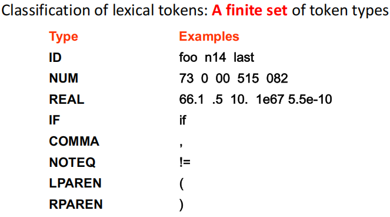{width=75%}
    </figure>

为了实现词法分析器，我们就需要明确地描述源语言的词法规则（lexical rules）。我们可以用自然语言来描述这些规则，但更为形式化的方法是使用正则语言或者有限自动机（DFA/NFA）来描述。

- **Regular expressions**：用于描述 token 的模式
    - 易于理解但很难实现
- **DFA**：用于实现词法分析器的状态转换逻辑
    - 易于实现，但难以根据规范来手动构建
- **Mathematics**：以上两种方法的结合

<figure markdown="span">
    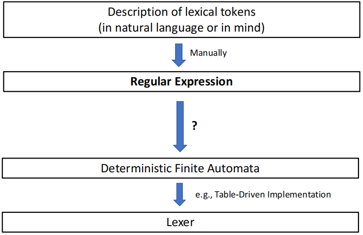{width=75%}
</figure>

## Regular Expression

- 每一个正则表达式 $r$ 都对应一个正则语言 $L(r)$，它是由所有匹配 $r$ 的字符串组成的集合
    - 正则表达式 $\varepsilon$ 匹配空字符串，即 $L(\varepsilon) = \{""\}$ 
- 正则表达式有三种基本的构造方式：
    1. **Concatenation**：如果 $r$ 和 $s$ 是正则表达式，那么 $rs$ 也是一个正则表达式，且 $L(rs) = L(r)L(s)$
    2. **Alternation**：如果 $r$ 和 $s$ 是正则表达式，那么 $r|s$ 也是一个正则表达式，且 $L(r|s) = L(r) \cup L(s)$
    3. **Kleene Star**：如果 $r$ 是一个正则表达式，那么 $r^*$ 也是一个正则表达式，且 $L(r^*) = (L(r))^*$

正则表达式还可以使用缩写和一些简化的符号：

- `[abcd]` 表示 `a|b|c|d`
- `[a-z]` 表示`[abcdefghijklmnopqrstuvwxyz]` 即所有小写字母
- `a?` 表示 `a|ε` 即 `a` 或者空字符串，`a+` 表示 `aa*` 即一个或多个 `a`

!!! tip "tiger 语言中的注释" 
    在 tiger 语言中，注释的语法是使用两个横杠 `--` 开始，直到行尾的换行符结束，即
    
    `("--"[a-z]*"\n")|(" "|"\n"|"\t")+` 表示 do nothing

由于在正则表达式进行匹配时，可能会出现模糊的情况，我们通常会遵循以下的两个规则；

- 最长匹配（longest match）规则：当有多个正则表达式能够匹配输入字符串时，选择匹配最长字符串的那个正则表达式
- 优先匹配（priority match）规则：当有多个正则表达式能够匹配输入字符串，并且它们匹配的字符串长度相同，那么选择在正则表达式列表中位置最靠前的那个正则表达式
    - 这意味着正则表达式的书写顺序会对匹配结果产生影响

## Finite Automata

<figure markdown="span">
    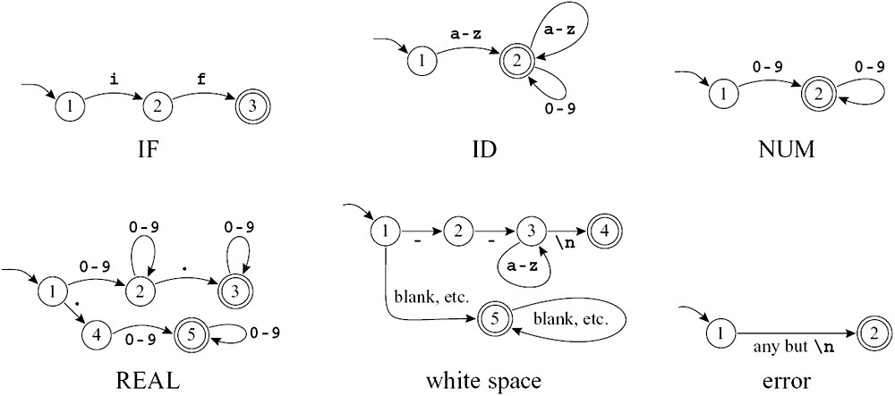{width=85%}
</figure>

- 状态（state）使用圆圈表示
    - 终止状态（final state）使用双圆圈表示
    - 起始状态（start state）使用一个被无来源的箭头指向的圆圈表示
- 各个状态之间的转换（transition）使用箭头表示，箭头上标注了触发转换的输入字符
    - 如果一个状态对于某个输入字符没有定义转换，那么就会被认为进入了一个死状态（dead state），在这个状态下所有输入都会导致 error

!!! example "DFA Example"
    <figure markdown="span">
        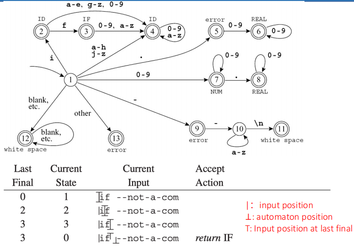{width=85%}
    </figure>

    - 首先读入 `i`，从状态 1 转换到状态 2，因为状态 2 是一个终止状态，此时要把 last final state 设为 2
    - 接着读入 `f`，从状态 2 转换到状态 3，因为状态 3 也是一个终止状态，所以 last final state 变为 3
    - 然后读入空格，状态 3 没有定义对于空格的转换，这就表示 token 结束了，此时我们就可以把 token 的类型设为 `IF`，并且把输入指针回退到空格的位置，状态恢复到 0（因为我们已经完成了一个 token 的识别，所以要回到起始状态准备识别下一个 token）

    <figure markdown="span">
        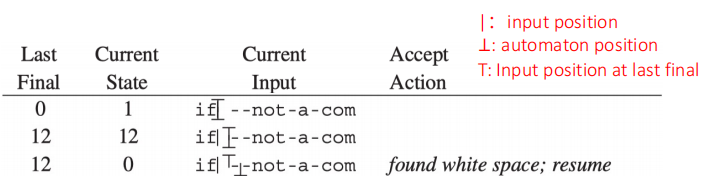{width=85%}
    </figure>

    - 我们重新开始读入，读入空格，进入状态 12 的循环，这个状态会一直保持在状态 12，直到读入一个非空格的字符为止

    <figure markdown="span">
        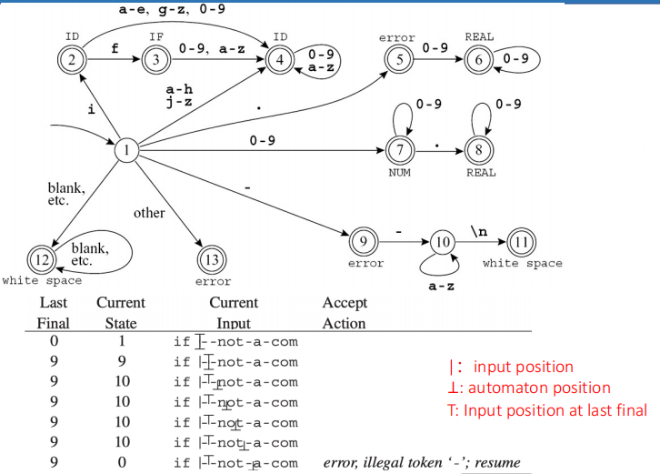{width=85%}
    </figure>
 
    - 再次开始读入之后，我们读入了 `--not` 进入了状态 10，但紧接着读入了一个横杠 `-`，状态 10 没有定义对于 `-` 的转换，这就表示 token 结束了，到那时此时处一个非终止状态，这是一个 error，我们可以选择忽略这个 token，继续从状态 0 开始读入下一个 token
    - 我们从错误之处开始，即 `--not` 之后的下一个横杠 `-` 开始读入，读入之后进入状态 9，但下一个读到的字符是 `a`，状态 9 没有定义对于它的转换，这就又是一个 error

## Nondeterministic Finite Automata

NFA 相较于 DFA 的区别在于 

- NFA 允许在某个状态对于某一个输入字符有多个转换结果，即输入同一个字符可能会进入到不同的状态中，因此对于同样的输入，在 NFA 中可能会经过不同的路径。
- NFA 还允许存在 $\varepsilon$-transition，即在没有输入任何字符的情况下，状态之间也可以进行转换

在 NFA 的多条路径中，只要存在某一条路径能够成功地匹配输入字符串，那么这个 NFA 就认为这个字符串是被接受的（accepted）的。

<figure markdown="span">
    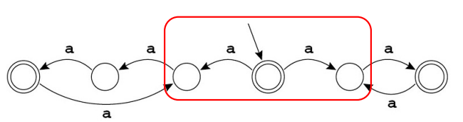{width=85%}
</figure>

### RE to NFA

我们可以使用 Thompson 算法 来将一个正则表达式转换为一个 NFA。这个算法的核心思想是递归地构建 NFA 的状态转换图，针对正则表达式的不同构造方式（concatenation、alternation、Kleene star）分别处理。

- 对于单个字符 `a`，或者 空字符串 $\varepsilon$，我们可以直接构建这个简单的 NFA
- 对于正则表达式的 3 种基本构造方式，我们可以按照以下的方式来构建 NFA

    > 假设已经有两个正则表达式 $r$ 和 $s$，以及它们对应的 NFA $N_r$ 和 $N_s$

    1. **Concatenation**（`rs`）：将 $N_r$ 的终止状态和 $N_s$ 的起始状态通过一个 $\varepsilon$-transition 连接起来
    2. **Alternation**（`r|s`）：创建新的起始状态和终止状态，从新的起始状态分别 $\varepsilon$ 连接到 $N_r$ 和 $N_s$ 的起始状态，同时将 $N_r$ 和 $N_s$ 的终止状态分别 $\varepsilon$ 连接到新的终止状态
    3. **Kleene Star**（`r*`）：创建新的起始状态和终止状态，从新的起始状态 $\varepsilon$ 连接到新的终止状态和 $N_r$ 的起始状态，同时将 $N_r$ 的终止状态 $\varepsilon$ 连接到新的终止状态和 $N_r$ 的起始状态

!!! tip
    通过 Tompson 算法构建的 NFA 仅含有一个终止状态，并且终止状态没有任何 outgoing transition

!!! info "RE to NFA"
    > 在后续的图例中实际上都省略了起始状态的存在（并且似乎存在一些问题？）

    <figure markdown="span">
        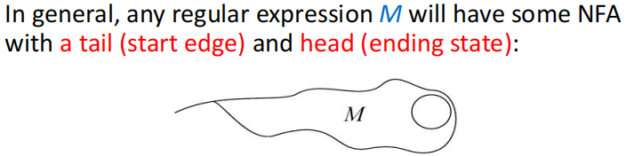{width=75%}
    </figure>

    <figure markdown="span">
        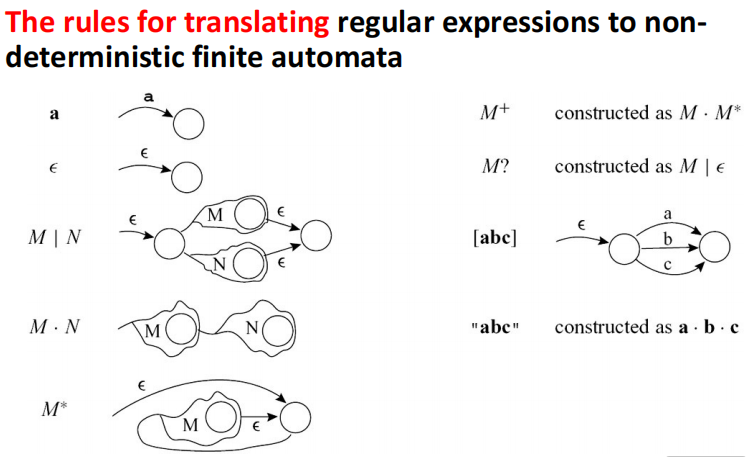{width=85%}
    </figure>

### NFA to DFA

使用**子集构造法**，具体方法也在 TCS 中讲过了：

- NFA 的初始状态的 $\varepsilon$ 闭包作为 DFA 的初始状态
- 对于已经得到的每一个 DFA 状态（对应于 NFA 状态的子集 $A=\{a_1, a_2, \ldots, a_k\}$）
    - 对于每一个输入字符 $c$，计算 NFA 中从状态 $a_i$ 出发，经过输入字符 $c$ 和 $\varepsilon$-transition 可以到达的状态集合 $S_i$，然后将这些集合合并得到一个新的状态集合 $S = \bigcup_{i=1}^k S_i$，如果 $S$ 还没有被添加到 DFA 中，就将其添加为一个新的 DFA 状态，并且添加从状态 $A$ 到状态 $S$ 的转换，转换条件为输入字符 $c$
    - 如果 $S$ 中包含 NFA 的终止状态，那么 DFA 中对应的状态 $S$ 也应该被标记为终止状态
    - 重复这个过程，直到没有新的 DFA 状态被产生为止

!!! note
    在课堂上使用的 PPT 中，NFA 转 DFA 的过程被概括为以下的算法：

    <figure markdown="span">
        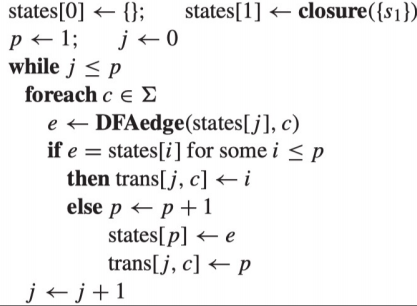{width=75%}
    </figure>

    - $s_1$ 代表 NFA 的起始状态，$p$ 代表新创建的 DFA 状态的数量
    - `closure` 函数的结果是从输入的状态集合出发，经过 $\varepsilon$-transition 可以到达的所有状态的集合
    - `DFAedge(d, c)` 函数的结果是从状态集合 $d$ 出发，经过输入字符 $c$ 和 $\varepsilon$-transition 可以到达的所有状态的集合

!!! example
    <figure markdown="span">
        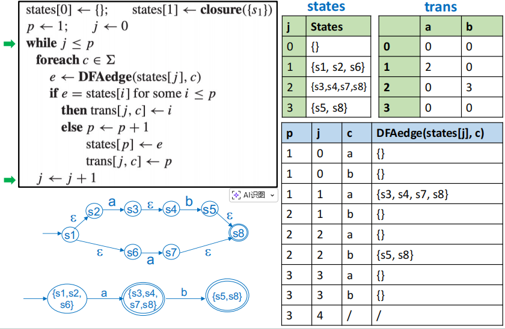{width=85%}
    </figure>

### DFA to Minimal DFA

将 DFA 最小化的思路是合并等价的状态。

!!! info
    两个 DFA 状态 $p$ 和 $q$ 被认为是等价的，如果对于任意输入字符串 $w$，从状态 $p$ 出发经过输入字符串 $w$ 可以到达一个终止状态，当且仅当从状态 $q$ 出发经过输入字符串 $w$ 也可以到达一个终止状态。（即它们对于任何相同的输入字符串要么都接受，要么都拒绝）

    - 显然，两个等价状态要么都是终止状态，要么都不是终止状态，这可以作为判断状态是否等价的一个必要条件

我们说一个字符串 $w$ 区分（distinguishes）两个状态 $p$ 和 $q$，如果从状态 $p$ 出发经过输入字符串 $w$ 可以到达一个终止状态，而从状态 $q$ 出发经过输入字符串 $w$ 不能到达一个终止状态，或者反过来。此时我们就称状态 $p$ 和 $q$ 是可区分的（distinguishable）的。

- 空字符串 $\varepsilon$ 可以区分一个终止状态和一个非终止状态
- 对于两个可区分的状态 $s$ 和 $t$，一定存在一个输入字符 $c$，$s$ 到达状态 $s'$，$t$ 到达状态 $t'$，并且状态 $s'$ 和 $t'$ 也是可区分的

DFA 最小化算法：

- 划分部分：
    1. 将 DFA 的状态集合划分为终止状态和非终止状态两个部分 $\Pi = \{ S-F, F \}$
    2. 对 $\Pi$ 中的每一个组进行迭代地划分
        - 如果两个状态对任意的输入都会到达 $\Pi$ 中的同一个组，那么它们就被划分为同一个组；否则它们就被划分为不同的组
        - 重复这个过程，直到没有新的划分被产生为止
- 构造部分：
    - 在每一个组中都选择一个状态作为代表，其余状态都可以删掉
    - 含有原起始状态的组中的代表作为新的起始状态，含有原终止状态的组中的代表作为新的终止状态（终止状态的组中一定只有终止状态，因为非终止状态和终止状态不可能在同一个组中）
    - 得到的新的状态集合就是最小化后的 DFA 的状态集合，新的转换关系由原 DFA 的转换关系决定

!!! tip
    如果原本的 DFA 中存在多个终止状态 $F_1, F_2, \ldots, F_k$，我们在初始划分时就需要把它们到划分为不同的组 $\Pi = \{ S-F, F_1, F_2, \ldots, F_k \}$，这样才能保证在划分过程中不会把不同的终止状态划分到同一个组中  1

!!! example
    <figure markdown="span">
        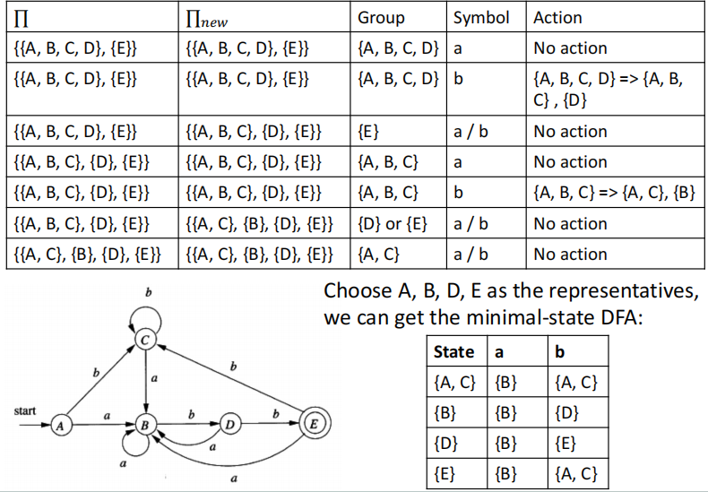{width=85%}
    </figure>

    划分部分：

    - 首先对于组 $\{A,B,C,D\}$，当输入为 $b$ 时状态 $D$ 会到达 $E$，而其他状态仍然会到达组 $\{A,B,C,D\}$ 中，因此会把状态 $D$ 划分为一个新的组 $\{D\}$，剩下的状态 $A$、$B$、$C$ 划分为另一个组 $\{A,B,C\}$。
    - 当考虑新的组 $\{A,B,C\}$ 时，输入 $b$ 又会使状态 $B$ 被划分出来，得到 $\{B\}$ 和 $\{A,C\}$ 两个组
    - 最后得到的组划分为 $\{A,C\}$、$\{B\}$、$\{D\}$、$\{E\}$，它们不会再被划分。

    构造部分：

    - 选择状态 $A$、$B$、$D$、$E$ 分别作为各组的代表，就可以得到一个最小的 DFA $D'$：

    <figure markdown="span">
        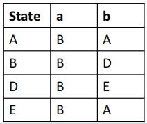{width=55%}
    </figure>

## Lex: Lexical Analyzer Generator

> 详细内容可参考[实验文档的附录部分](https://compiler.pages.zjusct.io/sp26/appendix/lex_yacc/)

我们在上面介绍的从正则表达式到 NFA，再到 DFA，最后到最小化 DFA 的过程是比较机械的，可以通过计算机程序来实现自动化的生成词法分析器。Lex 就是这样一个工具，它可以根据用户提供的正则表达式和对应的 token，自动生成一个词法分析器。

Lex 的输入文件（如`a.l`）的基本结构如下：

```lex
%{
    user code
%}
    definitions
%%
    rules
%%
    user subroutines
```

- user code：在词法分析器中需要使用的一些全局变量或者函数的定义
- definitions：一些正则表达式的定义，我们可以在这一部分为一些常用的正则表达式定义一个别名，以便在后续的 rules 部分中使用
- rules：每一行包含一个正则表达式和对应的动作（action），当输入字符串匹配到这个正则表达式时，就会执行对应的动作
    - 格式为 `regular expression { action }`
- user subroutines：一些用户自定义的函数，这些函数可以在 rules 部分的 action 中被调用


