# Parsing

<figure markdown="span">
    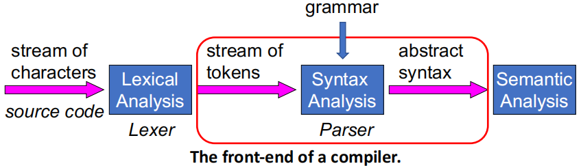{width=75%}
</figure>

解析（parsing）是编译器分析阶段的第二步，主要负责分析程序的短语结构，并为每个短语构建对应的抽象语法树（AST）。解析的输入是词法分析器输出的 token 流，输出则是一个抽象语法树。

- 一般而言，在进行语义分析时不会处理语法错误，语法错误会在解析阶段被捕获并报告，因此在语义分析阶段可以假设输入的程序已经是语法正确的。这种模块化的设计使得编译器的实现更加清晰和高效。

一个解析器通常会使用上下文无关文法（Context-Free Grammar, CFG）来描述编程语言的语法结构。解析器的主要任务是根据 CFG 来构建抽象语法树。

- Top-Down Parsing（自顶向下解析）
    - 从语法树的根节点开始构建，逐步向下展开。
    - 预测分析（Predictive Parsing）是一种常见的自顶向下解析方法，适用于 LL(1) 文法。
- Bottom-Up Parsing（自底向上解析）
    - 从输入的 token 流开始，逐步构建语法树，直到达到根节点。
    - LR(1) 解析器是一种常见的自底向上解析方法，适用于 LR(1) 文法。

## Context-Free Grammar

为了保证我们得到的 token 流是一个正确的程序，我们需要

- 形式化地描述哪些 token 序列是合法的程序
- 提供一种方法来验证一个 token 序列是否符合这个描述

正则表达式虽然可以描述一些简单的语言结构，但对于编程语言来说，正则表达式的能力是有限的。编程语言通常具有嵌套结构和递归定义，这些特性使得正则表达式无法有效地描述它们。

- 例如一个语言 $L = \{(^i )^i | i \geqslant 0\}$，即由 $i$ 个左括号和 $i$ 个右括号组成的字符串集合。这个语言无法用正则表达式描述，因为正则表达式无法处理嵌套结构。

因此我们需要更强大的工具来描述编程语言的语法结构，这就是上下文无关文法（Context-Free Grammar, CFG）。

### Definition

一个 CFG 包含以下四个基本元素：

1. **终结符集合（Terminals，$T$）**：构成语言的基本符号，通常是 token。
    - 在语法分析中，终结符就是词法分析器输出的 lexical token。
2. **非终结符集合（Non-terminals，$N$）**：用于定义语言的结构，通常表示语法类别。
3. **起始符号（Start Symbol，$S,\ S \in N$）**：一个特殊的非终结符，表示整个语言的起点。
4. **产生式/规则（Production/Rules）**：定义了非终结符是如何生成终结符和其他非终结符的组合的。
    - 每个产生式的形式为 $X \to Y_1 Y_2 \cdots Y_k$，其中 $X$ 是一个非终结符，$Y_i$ 可以是终结符、非终结符或空串 $\varepsilon$。

我们把根据 CFG 生成字符串的过程称为**推导（Derivation）**，推导的结果可以用**语法树（Parse Tree）**来表示。

1. 从仅包含起始符号 $S$ 的字符串开始。
2. 将字符串中的一个非终结符 $X$ 通过一个产生式 $X \to Y_1 Y_2 \cdots Y_k$ 替换为 $Y_1 Y_2 \cdots Y_k$。
3. 重复上一步的替换，直至字符串中只包含终结符为止。

<figure markdown="span">
    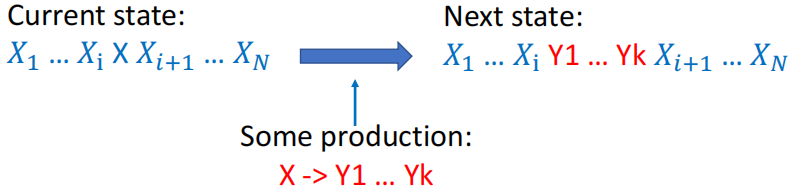{width=75%}
</figure>

我们称能被上下文无关文法 $G$ 生成的字符串集合为该文法所定义的语言，记为 $L(G)$，即 $L(G) = \{w \in T^* | S \to^* w\}$，其中 $w$ 是由终结符组成的字符串。

- 一个字符串属于 $L(G)$ 当且仅当它可能从起始符号 $S$ 通过一系列产生式推导得到。

!!! example "一个 CFG 的例子"
    <figure markdown="span">
        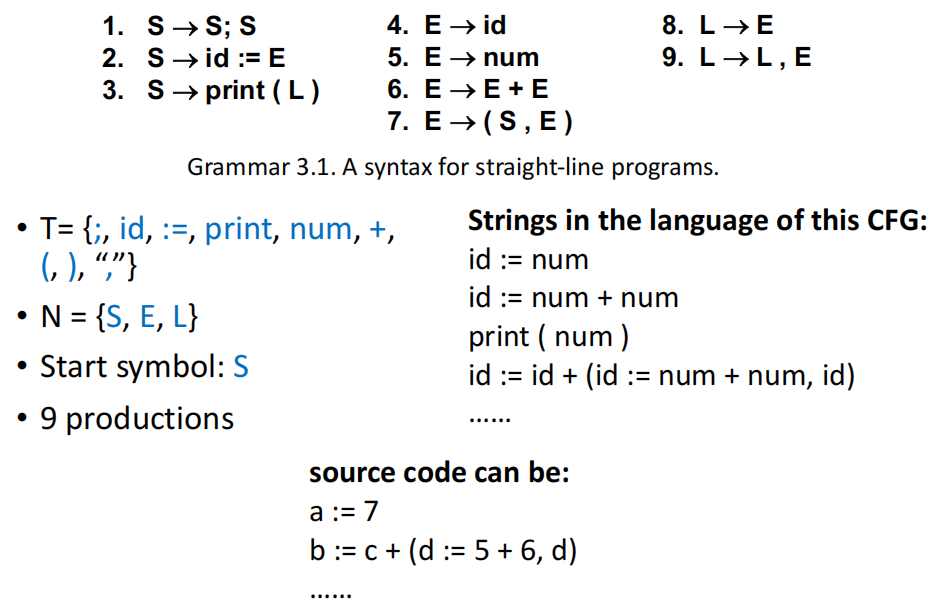{width=75%}
    </figure>

### Derivations & Parse Tree

根据一个 CFG 来推导的过程可以用一个树状结构来直观地展示出来，这就是**语法树（Parse Tree）**。在语法树中：

- 根节点是起始符号 $S$。
- 内部节点是非终结符。
- 叶子节点是终结符。
    - 当我们对叶子节点进行中序遍历时，得到的字符串就是通过推导生成的字符串，即原始的输入字符串。

!!! example "语法树例子"
    <figure markdown="span">
        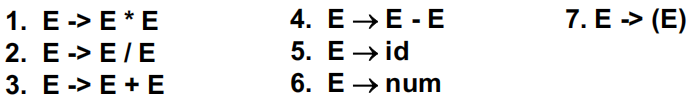{width=65%}
    </figure>

    <figure markdown="span">
        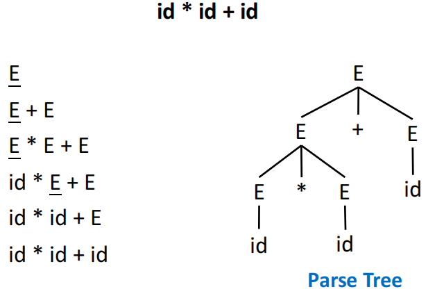{width=65%}
    </figure>

在上面的这个例子中，我们在推导时总是选择将最左边的非终结符进行替换，这种推导方式被称为**最左推导（Left-most Derivation）**。相应地，如果我们总是选择将最右边的非终结符进行替换，那么这种推导方式被称为**最右推导（Right-most Derivation）**。

在无二义性（Ambiguity）的 CFG 中，最左推导和最右推导会得到完全相同的语法树。

!!! example "与上面例子相同的最右推导"
    <figure markdown="span">
        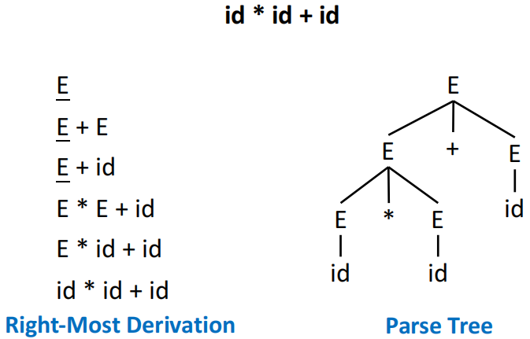{width=65%}
    </figure>

### Ambiguous Grammarsv

如果存在一个字符串 $w$，使得它可以通过两种不同的推导方式生成，那么这个 CFG 就是**二义性（Ambiguous）**的。二义性会导致解析器在构建语法树时产生歧义，从而无法确定正确的语法结构。

例如上面的那一个例子，我们可以两种方法生成字符串 `id * id + id`：

<figure markdown="span">
    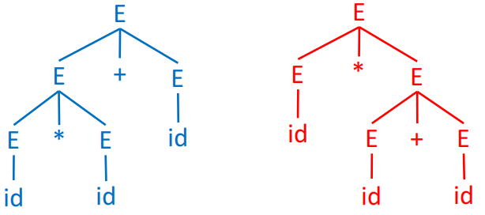{width=65%}
</figure>

对于不同的解析树，编译器可能会产生不同的结果，这在实际编译过程中是不可接受的。

!!! example
    <figure markdown="span">
        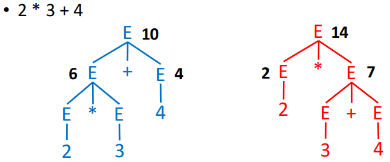{width=75%}
    </figure>

处理二义性问题的最直接的办法就是把二义性文法改写成等价的非二义性文法。对于上面的例子，我们可以通过引入新的非终结符来消除二义性：

<figure markdown="span">
    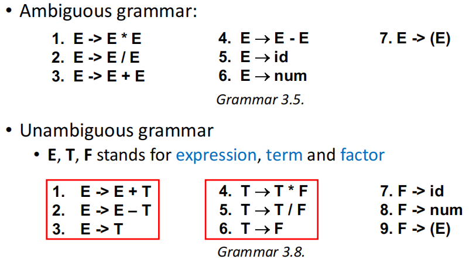{width=65%}
</figure>

!!! question
    - 该如何保证运算的优先级？
        - 因为我们希望乘除法的优先级要大于加减法，所以我们引入了一个新的非终结符 `T` 来表示乘除法的表达式，而 `E` 则表示加减法的表达式。这样一来当我们在解析时，乘除法的表达式会更靠近叶子节点，从而保证了乘除法的优先级高于加减法。
    - 如何保证运算是左结合的？
        - 因为我们希望加减法和乘除法都是左结合的，即 `1 - 2 - 3` 应当被解析为 `(1 - 2) - 3` 而不是 `1 - (2 - 3)`。所以我们在定义 `E` 和 `T` 的产生式时，使用了递归的方式来表示左结合。例如在 `E` 的定义中，我们有 `E -> E + T | E - T | T`，这表示一个加法或减法表达式可以由一个更大的加法或减法表达式和一个乘除法表达式组成，从而保证了加减法的左结合性。
        - 简单来说，我们定义新的产生式时，要保证产生式右侧的第一个符号与左侧的符号相同，格式为 `X -> X op Y` 而非 `X -> Y op X`，其中 `op` 是一个运算符，这样就保证了运算的左结合性。

!!! tip
    有一些语言仅存在有二义性的文法，而不存在无二义性的文法，这类语言在编程语言的应用中可能存在问题

在语法分析时，我们需要确保整个文件都被完成地解析了，因此我们需要引入一个特殊的结束标记 $ \$ $（EOF），并且在文法中添加一个新的起始符号 $S'$ 和一条i虚拟的产生式 $S' \to S \$ $。这样一来我们就可以表明在完成了 $S$ 的完整解析之后到达了文件的末尾

## Predictive Parsing

语法解析器可以分为三类：

1. **通用解析器（Universal Parsers）**：能够处理任意上下文无关文法，但通常效率较低，不适合于实际编译器的实现。
2. **自顶向下解析器（Top-Down Parsers）**：从语法树的根节点开始构建，逐步向下展开，适用于 LL(1) 文法。
3. **自底向上解析器（Bottom-Up Parsers）**：从输入的 token 流开始（叶节点），逐步构建语法树，直到达到根节点，适用于 LR(1) 文法。

无论是自顶向下还是自底向上的解析器，都采用从左到右逐个符号扫描输入的方式。

!!! info
    - 人工实现的解析器通常使用 LL 文法
    - 通过自动化工具构建的解析器通常使用 LR 文法，因为 LR 文法更强大，可以处理更多的语言结构。

### Top-Down Parsing

在自顶向下解析中，解析树按照从上到下，从左到右的顺序构建。解析器从起始符号开始，根据输入的 token 流逐步展开语法树，直到匹配到输入的 token。

!!! example
    <figure markdown="span">
        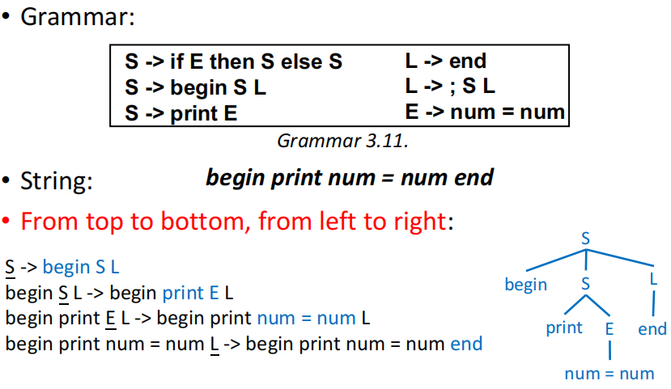{width=75%}
    </figure>

递归向下解析（Recursive Descent Parsing）是一种常见的自顶向下解析方法，它使用一组递归函数来实现每个非终结符的解析。每个函数对应一个非终结符，根据输入的 token 来决定如何展开语法树。

- 需要为每一个非终结符编写一个递归函数，调用这个函数就表示尝试匹配这个非终结符
- 每一个文法产生式都对应于函数中的一个分支，函数根据输入的 token 来选择哪个分支进行解析。

??? example "递归向下解析的例子"
    <figure markdown="span">
        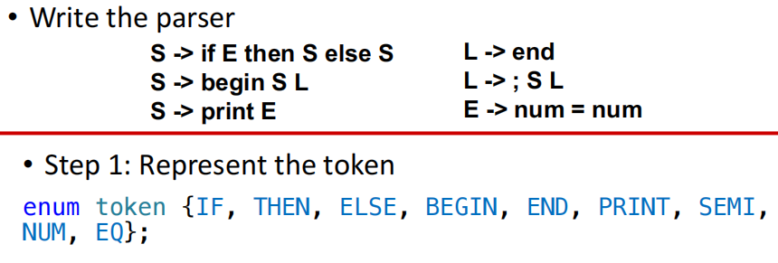{width=75%}
    </figure>

    <figure markdown="span">
        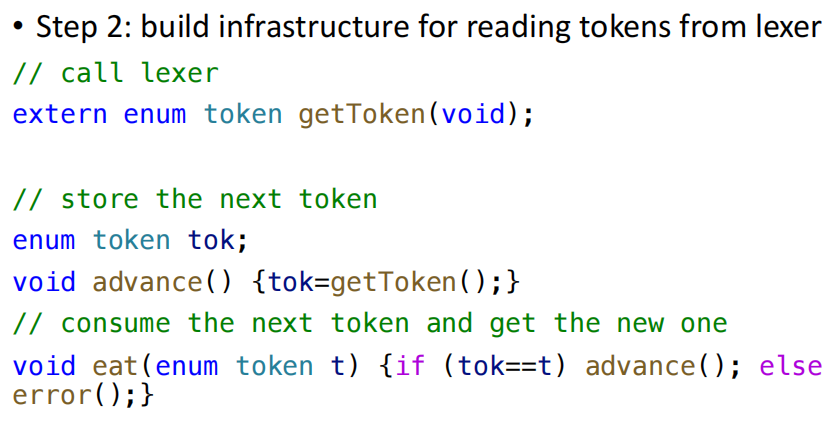{width=75%}
    </figure>

    <figure markdown="span">
        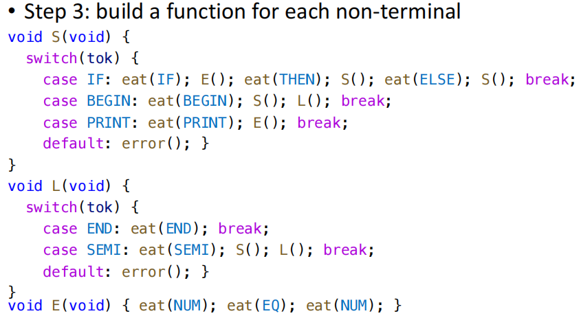{width=75%}
    </figure>

    在这个例子中，我们通过维护了一个全局的 token（变量 `tok`）来跟踪当前正在解析的 token。每当我们匹配一个 token 时，我们就调用 `eat(token)` 来消耗这个 token，并通过 `getToken()` 来获取下一个 token。这样我们就可以逐步解析输入的 token 流，并构建出对应的语法树。

上面这一个文法非常特殊，它的每一个非终结符，其产生式右侧的第一个符号都是不同的，这样我们就可以通过下一个 token 来唯一确定应该使用哪个产生式来展开语法树。

但对于某些文法来说，可能在接收到一个 token 时存在多种可能的产生式可以使用，这时我们就无法确定应该使用哪个产生式来展开语法树，这种情况就需要回溯**回溯（Backtracking）**。

!!! example "回溯的例子"
    考虑如下的文法：

    ```
    S -> SL
    S -> begin E, SL
    ```

    如果读取到的下一个 token 是 `begin`，我们就无法确定应该使用哪个产生式来展开 `S`，因为两者经过展开都可以得到以 `begin` 开头的字符串。这时我们就需要尝试使用其中一个产生式进行解析，如果解析失败了，我们就需要回溯到之前的状态，尝试使用另一个产生式进行解析。

为了解决回溯带来的效率问题，我们可以通过使用**预测解析（Predictive Parsing）**来避免回溯。预测分析是递归下降解析的一种特殊形式，它可以通过向前查看（lookahead）固定数量的 token（通常为 $k=1$ 个）来唯一确定应该使用哪个产生式来展开语法树。

- 预测解析可以解析 $LL(k)$ 文法：从左向右解析（**L**eft-to-right），最左推导（**L**eft-most Derivation），并且使用 $k$ 个 token 的向前查看来做出解析决策。

### Predictive Parsing Table

要在 $k=1$ 的情况下实现预测解析，我们需要明确指导每条产生式右侧可能出现的第一个**终结符**，这就需要我们构建**预测分析表（Predictive Parsing Table）**，以及构建预测分析标所需的三个概念：Nullable、FIRST 集合、FOLLOW 集合。

!!! definition "Nullable"
    如果一个非终结符 $X$ 可以推导出空串 $\varepsilon$（即 $X \to^* \varepsilon$），我们称 $X$ 是**可空的（Nullable）**，`Nullable(X) = True`。

    - 可以通过类似于计算 epsilon 闭包的方式来迭代计算 Nullable 集合，直到没有新的可空非终结符被添加为止。
    - 对于任意一个产生式 $X \to Y_1 Y_2 \cdots Y_k$，如果所有的 $Y_i$ 都是 Nullable 的，那么 $X$ 也是 Nullable 的。

    <figure markdown="span">
        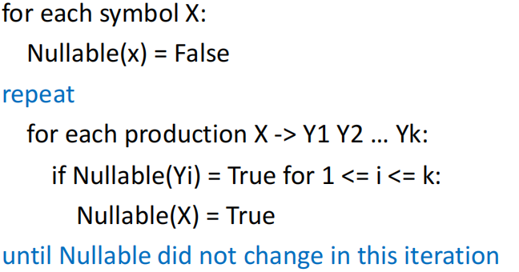{width=65%}
    </figure>

!!! definition "FIRST 集合"
    $FIRST(\gamma)$ 指的是能从符号串 $\gamma$ 推导出的字符串中，所有可以位于起始位置的终结符构成的集合。也就是说，如果 $\gamma \to^* t\beta$，那么 $t \in FIRST(\gamma)$，其中 $t$ 是一个终结符，$\beta$ 和 $\gamma$ 是任意的符号串。

    $FIRST(X)$ 集合的计算规则如下：

    - 如果 $X$ 是一个终结符，那么 $FIRST(X) = \{X\}$。
    - 如果 $X$ 是一个非终结符，首先令 $FIRST(X) = \emptyset$，然后对于每个产生式 $X \to Y_1 Y_2 \cdots Y_k$，执行以下步骤：
        1. 将 $FIRST(Y_1)$ 中的所有非空串元素添加到 $FIRST(X)$ 中。
        2. 如果 $Y_1$ 是 Nullable 的，那么继续将 $FIRST(Y_2)$ 中的所有非空串元素添加到 $FIRST(X)$ 中。
        3. 重复上述步骤，直到遇到一个非 Nullable 的符号或者处理完所有的 $Y_i$。

!!! definition "FOLLOW 集合"
    $FOLLOW(X)$ 指的是在某个产生式中，可能紧跟在非终结符 $X$ 的后面出现的终结符构成的集合。也就是说，如果存在一个产生式 $A \to \alpha X \beta$，那么 $FIRST(\beta) \subseteq FOLLOW(X)$，其中 $\alpha$ 和 $\beta$ 是任意的符号串。

    - 如果 $\beta$ 是空串或者 $\beta$ 可以推导出空串，那么 $FOLLOW(A) \subseteq FOLLOW(X)$。

    FOLLOW 集合的计算规则如下：

    1. 当我们使用结束符号 $\$$ 时（$S' \to S \$ $），需要首先将结束符号 $\$$ 添加到起始符号 $S$ 的 FOLLOW 集合中。
    2. 对于任意的符号串 $\alpha$ 和 $\beta$，如果存在一个产生式 $Y \to \alpha X \beta$，则
        - 将 $FIRST(\beta)$ 中的所有元素添加到 $FOLLOW(B)$ 中。即 $FOLLOW(X) = FOLLOW(X) \cup FIRST(\beta)$，但不包括空串 $\varepsilon$。
        - 如果 $\beta \to^* \varepsilon$（也包括 $\beta$ 本身为空串的情况），则将 $FOLLOW(Y)$ 中的所有元素添加到 $FOLLOW(X)$ 中。即 $FOLLOW(X) = FOLLOW(X) \cup FOLLOW(Y)$。
    3. 不断重复上述步骤，直到没有新的元素被添加到任何 FOLLOW 集合中为止。

!!! info "计算这三种集合的伪代码"
    <figure markdown="span">
        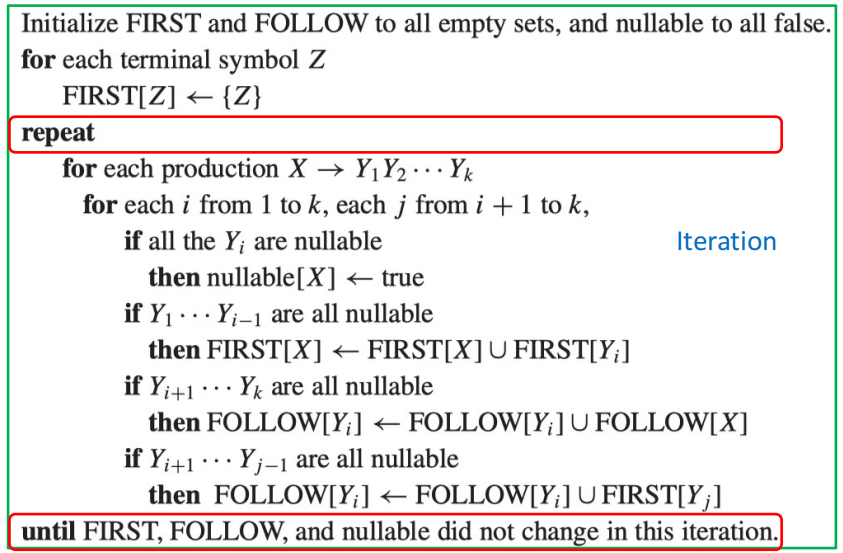{width=75%}
    </figure>

!!! example "计算 Nullable、FIRST 和 FOLLOW 集合"
    <figure markdown="span">
        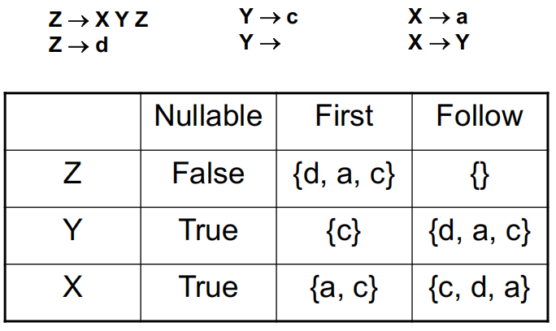{width=65%}
    </figure>

通过上面的定义以及计算方法，我们就可以计算出一个 CFG 中每个非终结符的 Nullable、FIRST 集合和 FOLLOW 集合。在这个过程中需要注意的是，由于非终结符之间可能存在相互依赖的关系，因此在计算这些集合时需要进行多次迭代，直到所有集合都稳定下来为止。

- 在计算这三个集合时，为了保证计算的高效性，我们可以按照先 Nullable，再 FIRST，最后 FOLLOW 的顺序进行计算。因为 Nullable 集合的计算相对简单，而 FIRST 和 FOLLOW 集合的计算可能会依赖于 Nullable 集合的结果。

有了 Nullable、FIRST 和 FOLLOW 集合之后，我们就可以构建预测分析表了。对于一个二维的预测分析表 $M$，每一行都对应非终结符 $X$，每一列对应下一个终结符 $t$（即 next-token，包括结束符号 $\$$）。

对于文法中的每一条产生式 $X \to \gamma$，我们需要根据以下规则来填充预测分析表：

1. 如果 $t \in FIRST(\gamma)$，则将 $X \to \gamma$ 添加到 $M[X, t]$ 中。
2. 如果 $\varepsilon \in FIRST(\gamma)$（即 $\gamma$ 是 Nullable 的），则对于每个 $t \in FOLLOW(X)$，将 $X \to \gamma$ 添加到 $M[X, t]$ 中。

!!! example "预测分析表"
    对于上面的那一个例子，我们最终会得到如下的一个预测分析表：

    <figure markdown="span">
        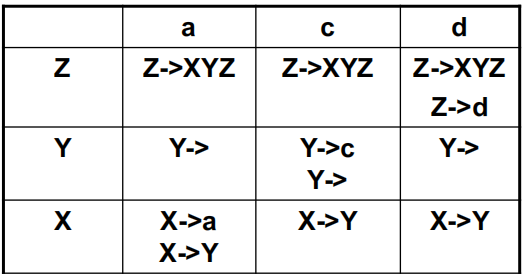{width=65%}
    </figure>

!!! note
    - 空白单元格：如果 $M[X, t]$ 是空的，表示当前非终结符是 $X$，下一个 token 是 $t$ 时，解析器无法继续进行解析，这通常意味着输入的 token 流不符合文法（即语法错误，syntax error）。
        - 我们在实现解析器时，可以在遇到空白单元格时直接报告语法错误，并且可以提供一些错误恢复的机制，例如跳过一些 token 或者抛出一个异常来继续解析后续的输入。
    - LL(1) 文法：如果对于一个 CFG $G$，对于每个非终结符 $X$ 和每个终结符 $t$，预测分析表 $M[X, t]$ 中最多只有一条产生式，那么我们就称这个 CFG 是一个 LL(1) 文法。换句话说，LL(1) 文法是指在构建预测分析表时，每个单元格中最多只能有一条产生式，这样就保证了在解析过程中不会出现二义性，从而可以实现高效的预测解析。

!!! info "LL(k)"
    对于更一般的 LL(k) 文法，我们需要使用 $k$ 个 token 的向前查看来构建预测分析表。此时预测分析表的每一列都对应一个长度为 $k$ 的终结符序列，而不是单个终结符。当这个预测分析表中的每个单元格中最多只有一条产生式时，我们就称这个 CFG 是一个 LL(k) 文法。

    <figure markdown="span">
        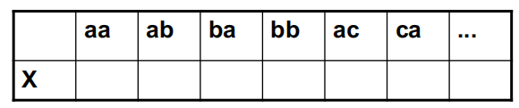{width=75%}
    </figure>

### Non-Recursive Predictive Parser

除了编写一个递归的预测解析器之外，我们还可以通过使用一个显式的栈来实现一个非递归的预测解析器。这个非递归的预测解析器的核心思想是使用一个栈来模拟递归调用的过程，它的基本步骤如下：

- 初始化栈，将起始符号 $S$ 和结束符号 EOF $\$$ 压入栈中。
- 重复以下步骤，直到栈顶是 EOF $\$$：
    1. 读取下一个输入 token $t$。
    2. 如果栈顶是一个终结符 $X$，则检查 $X$ 是否与 $t$ 匹配。如果匹配，则将该终结符弹出栈顶并继续；如果不匹配，则报告语法错误。
    3. 如果栈顶是一个非终结符 $X$，则根据预测分析表 $M[X, t]$ 中的条目来决定使用哪个产生式来展开 $X$。将对应的产生式右侧的符号逆序（从右到左）依次压入栈中。
        - 如果 $M[X, t]$ 中没有条目，则报告语法错误。
- 当栈顶是 EOF $\$$ 时，表示输入的 token 流已经被成功解析完毕，此时解析器可以接受输入（accept）并结束解析过程。

!!! example "非递归预测解析器的例子"
    <figure markdown="span">
        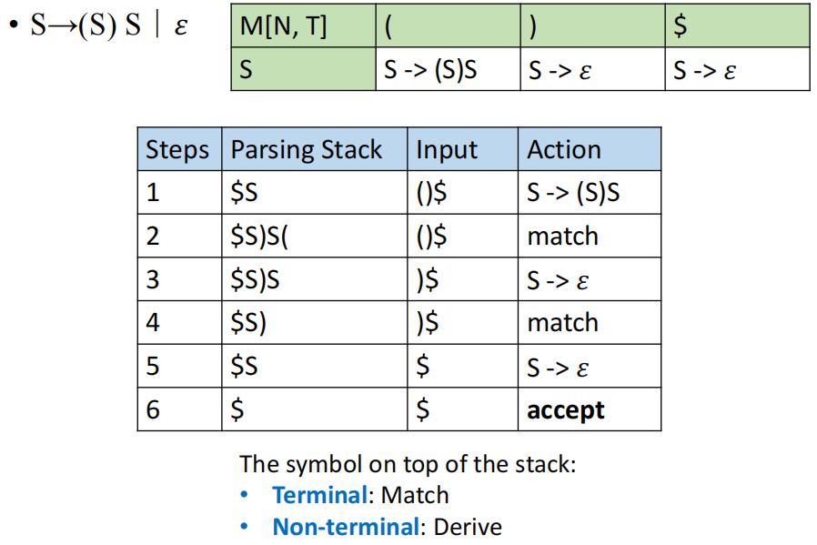{width=75%}
    </figure>

### Eliminate Left-Recursion

当一个文法无法生成无冲突的 LL(1) 预测分析表时，我们就需要对这个文法进行改写，以消除左递归。**左递归（Left Recursion）**是指一个非终结符 $A$ 的产生式中直接或间接地包含了 $A$ 本身，例如 $A \to A \alpha$ 或 $A \to B \to A \beta$。

!!! example "左递归的例子"
    考虑一个文法：
    $$ E \to E + T \\ | \\ T $$
    其中 $E$ 是一个非终结符，$T$ 是另一个非终结符。这个文法是左递归的，因为 $E$ 的产生式中直接包含了 $E$ 本身。

    - 根据 $E \to E + T$ 这个产生式，我们可以知道 $FIRST(E+T) \subset FIRST(E)$，而又因为 $E$ 是 $E+T$ 的一部分，就有 $FIRST(E) \subset FIRST(E+T)$，因此 $FIRST(E) = FIRST(E+T)$，这就导致了预测分析表中 $M[E, t]$ 中会有两条产生式一定会同时出现 $E \to E + T$ 和 $E \to T$ 两条产生式，从而无法构建一个无冲突的 LL(1) 预测分析表。

自顶向下的解析方法无法处理左递归的文法，因为在解析过程中会陷入无限递归的循环中。为了消除左递归，我们可以将左递归的文法改写成等价的非左递归文法。

- 原始文法：
    $$
    A \to A \alpha \\ | \\ \beta
    $$
    其中 $A$ 是一个非终结符，$\alpha$ 是一个符号串，$\beta$ 是一个不以 $A$ 开头的符号串。
- 改写后的文法：
    $$
    \begin{aligned}
    A &\to \beta A' \\\\
    A' &\to \alpha A' \\ | \\ \varepsilon
    \end{aligned}
    $$

这样一来，我们就成功地消除了左递归，使得改写后的文法可以被自顶向下的解析方法处理了。需要注意的是，在改写过程中，我们引入了一个新的非终结符 $A'$ 来表示原来左递归部分的重复结构，同时保留了原来非左递归部分的结构。

!!! example "消除左递归的例子"
    <figure markdown="span">
        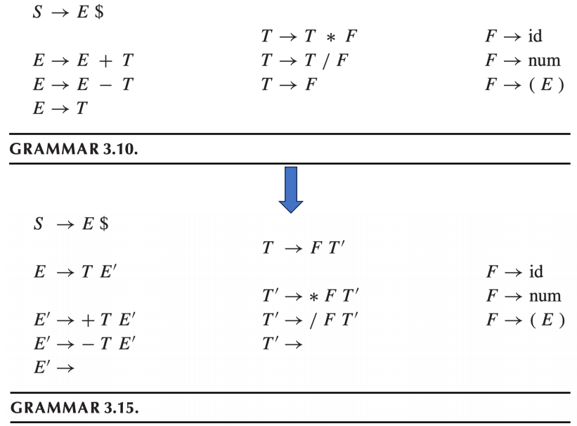{width=70%}
    </figure>

!!! note "Left Factoring"
    在某些情况下，文法可能存在**公共前缀（Common Prefix）**，这也会导致预测分析表中出现冲突，从而无法构建一个无冲突的 LL(1) 预测分析表。为了处理这种情况，我们可以通过**左因子化（Left Factoring）**来改写文法。

    - 原始文法：
        $$
        A \to \alpha \beta_1 \\ | \\ \alpha \beta_2  \\ | \\ \alpha
        $$
        其中 $\alpha$ 是一个公共前缀，$\beta_1$ 和 $\beta_2$ 是两个不同的符号串。
    - 改写后的文法：
        $$
        \begin{aligned}
        A &\to \alpha A' \\\\
        A' &\to \beta_1 \\ | \\ \beta_2 \\ | \\ \varepsilon
        \end{aligned}
        $$

## Bottom-Up Parsing

自底向上解析是指从输入的 token 流开始，逐步构建语法树，直到达到根节点。自底向上解析器通常使用一个栈来存储已经解析的符号，并且通过不断地进行**规约（Reduction）**和**移进（Shift）**操作来构建语法树。

!!! info "LR(k) Parsing"
    LR(k) 解析器是一种常见的自底向上解析方法，它比 LL(k) 解析更强大：能够在看到与生成式右侧完整对应的输入标记后才做出决策

    > **L**eft-to-right parse, **R**ightmost derivation, $k$-token lookahead

    - 规约的过程就相当于执行**最右推导的逆过程**：将产生式右侧的符号替换为产生式左侧的非终结符。
    - 当成功把 token 流规约到起始符号 $S$ 时，表示输入的 token 流已经被成功解析完毕，此时解析器可以接受输入（accept）并结束解析过程。

!!! example 
    <figure markdown="span">
        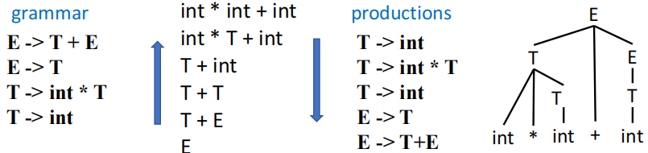{width=75%}
    </figure>

### LR Parsing

在进行 LR 解析时，我们需要维护一个状态栈来跟踪当前的解析状态，以及一个输入缓冲区来存储剩余的输入 token。我们使用**点号（dot）**来表示当前正在解析的位置，例如 $\alpha \cdot \beta$ 表示我们已经成功解析了子串 $\alpha$，期望接下来尝试解析子串 $\beta$。其中 $\alpha$ 可能包含终结符和非终结符，而 $\beta$ 只包含终结符。

!!! example
    <figure markdown="span">
        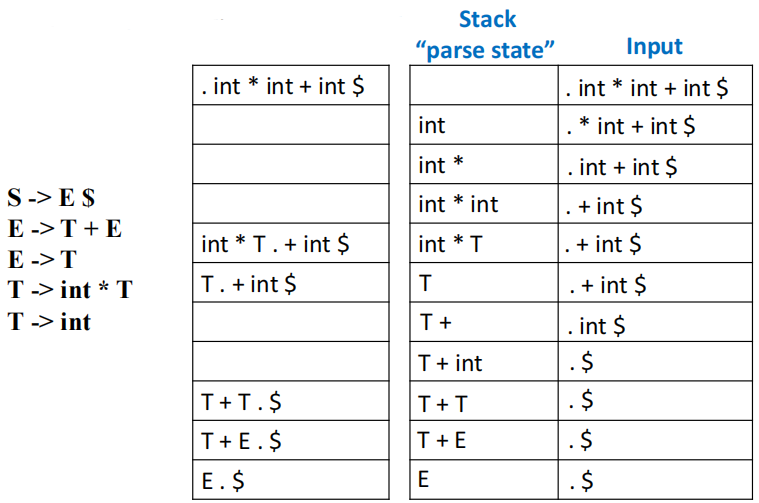{width=75%}
    </figure>

在移进-规约分析中，parser 会维护栈以及输入缓冲区，并不断执行以下操作：

- **移进（Shift）**：将输入缓冲区中的下一个 token 移入栈中，并更新状态。
- **规约（Reduce）**：如果栈顶的符号序列与某个产生式的右侧匹配，那么就可以将这些符号规约为该产生式的左侧非终结符，并更新状态。
    - 例如栈顶的符号与产生式 $X \to ABC$ 的右侧匹配，那么就把 $ABC$ 从栈顶弹出（pop C、pop B、pop A），然后把 $X$ 压入栈顶（push X）。
- **接受（Accept）**：当栈顶是起始符号 $S$ 并且输入缓冲区已经空了，表示输入的 token 流已经被成功解析完毕，此时解析器可以接受输入并结束解析过程。
- **错误（Error）**：如果当前状态和输入 token 没有对应的移进或规约操作，那么就报告语法错误。

### LR(0) Parsing

LR(0) 解析器是最简单的 LR 解析器，仅通过栈结构即可进行解析的文法，其移进/归约决策过程不使用任何向前查看（lookahead）来做出解析决策，因此只能处理相对有限的文法。

LR(0) 的主要想法是通过构建一个状态机来表示解析过程中的各种状态，每个状态都对应于一个 LR(0) 项集（LR(0) Item Set）。LR(0) 项目是一个产生式的右侧符号序列，其中有一个点号（dot）表示当前解析的位置。

- 从一个经过增广过后的文法 $S' \to S\$$ 开始
- $A \to \alpha \cdot \beta$ 被称为 item，  表示我们已经成功解析了 $\alpha$，期望接下来看到（接收到）$\beta$。
    - 例如 $E \to E + \cdot T$ 表示我们已经成功解析了 $E$，期望接下来看到 $+ T$；$T \to a \cdot$ 表示产生式的右侧已经完全匹配了输入 token 流中的 $a$，我们可以进行规约操作。

我们可以定义各个 LR(0) item 之间的转移关系，从而得到一个 NFA。这个 NFA 的每一个状态都是对应于一个 item，每一个状态转移都对应于输入一个 token 或者根据点号右侧的第一个非终结符进行移进（即 epsilon 转移）。通过对这个 NFA 进行子集构造，我们可以得到一个 DFA，这个 DFA 的每一个状态都对应于一个 LR(0) 项目集。

- 事实上只需要把 $\varepsilon$-闭包的结果进行子集构造就可以了，因为 $\varepsilon$-闭包的结果已经包含了所有可能的转移了。
    
!!! example 
    <figure markdown="span">
        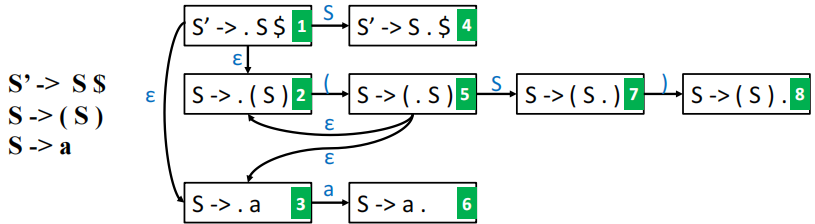{width=75%}
    </figure>

    <figure markdown="span">
        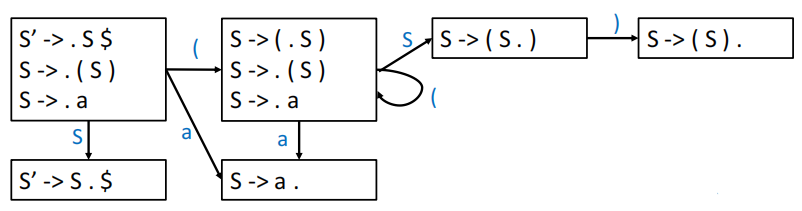{width=75%}
    </figure>

!!! note "LR(0) Parsing 的算法"
    <figure markdown="span">
        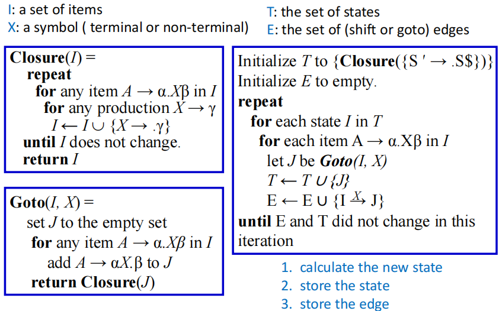{width=75%}
    </figure>

    **Closure**：

    - 如果在某个 item 中，点号右侧的第一个符号是一个非终结符，那么意味着我们需要考虑接下来接收到的 token 可能会匹配这个非终结符以及它的的产生式，因此我们需要将这个非终结符的所有产生式，以及这些产生式继续递归展开得到的产生式都加入到当前的 item 集合中。
    - 也就是说，对于 
        $$ A \to \alpha \cdot X \beta $$
        
        我们接下来需要把所有形如 
        $$ X \to \cdot \gamma $$ 
        的 item 都加入到当前的 item 集合中，并且对于这些新的 item，并且不断递归地进行上述操作，直到没有新的 item 被加入为止。

    **Goto**：

    - 如果状态 $I$ 中包含 item 
        $$ A \to \alpha \cdot X \beta $$
        
        那么在接收到符号 $X$（可以是终结符或非终结符）之后，我们就可以将点号向右移动一位，得到新的 item
        $$ A \to \alpha X \cdot \beta $$

        并且再对这个新的 item 进行 Closure 操作，得到一个新的状态 $J$，这样我们就可以定义从状态 $I$ 到状态 $J$ 的转移。

    构建 LR(0) 的 DFA 的过程可以概括为以下几个步骤：

    1. 从增广文法的起始符号 $S'$ 开始，构建初始状态 $I_0 = Closure(\{S' \to \cdot S\$\})$。
    2. 对于每个状态 $I$ 和每个符号 $X$，计算 $Goto(I, X)$，如果 $Goto(I, X)$ 不为空且不在已有的状态集合中，则将 $Goto(I, X)$ 作为一个新的状态加入到状态集合中，并记录从状态 $I$ 到新状态的转移。
    3. 重复步骤 2，直到没有新的状态被加入为止。
    4. 最终得到的状态集合和转移关系就构成了 LR(0) 的 DFA。

!!! example "LR(0) DFA 的移进-规约决策"
    <figure markdown="span">
        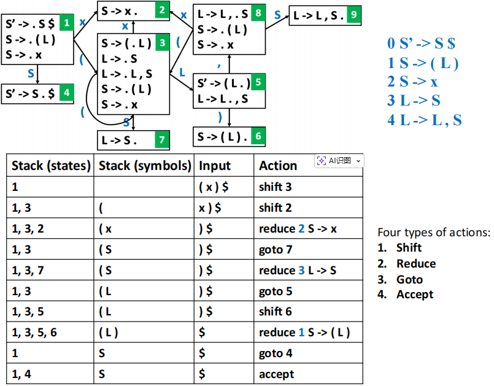{width=75%}
    </figure>

    判断一个输入是否 accept 的过程如下：

    1. 初始化状态栈，将初始状态 $I_0$ 压入栈中。
    2. 查看栈顶与的状态以及当前输入的 token，根据分析表执行以下几种操作之一：
        - `shift n`：读取一个输入符号，根据读入符号转移到新的状态 $n$，把新状态 $n$ 压入栈中。
            - 由于我们还考虑了使用符号栈，因此要把输入符号压入符号栈中。
        - `reduce k`：根据第 $k$ 条产生式 $A \to \gamma$，弹出栈顶的 $|\gamma|$ 个状态。
            - 注意这里要把符号栈中的 $\gamma$ 弹出，并且把 $A$ 压入符号栈中。
        - `goto n`：通常在规约操作之后执行，不需要读入任何新的输入符号，直接根据当前状态和规约后的非终结符来确定新的状态。
        - `accept`：表示输入的 token 流已经被成功解析完毕，接受输入并结束解析过程。
        - `error`：表示当前状态和输入 token 没有对应的移进或规约操作，报告语法错误。

    这一个算法流程的关键在于状态栈与符号栈需要一一对应，每一次 shift 都要把新状态压入状态栈；每一次 reduce 都要根据产生式的右侧符号数量来弹出状态栈中的状态，然后根据栈顶状态以及 reduce 后的非终结符来 goto 到新状态

!!! note "LR(0) 动作表"
    我们可以直接根据 LR(0) 的 DFA 来构建一个 LR(0) 的 Action/Goto Table，从而直观地展示在每个状态下对于每个输入符号应该执行的操作（shift、reduce、goto 或 accept）。

    > 这里我们把 Action Table 和 Goto Table 合并成了一个表格 $T$，以便于展示。

    表的每一行都对应于一个状态，每一列对应于一个输入符号（包括终结符和非终结符）。我们根据 DFA 中的转移关系来填充表格 $T$：

    - **shift**：若状态 $i$ 经过终结符 $t$ 转移到状态 $n$，则在 $T[i, t]$ 中填入 `sn`（shift n）。
    - **goto**：若状态 $i$ 经过非终结符 $X$ 转移到状态 $n$，则在 $T[i, X]$ 中填入 `gn`（goto n）。
    - **reduce**：若状态 $i$ 包含一个已经解析了目前所有输入的 item $A \to \alpha \cdot$，表示产生式 $A \to \alpha$ 已经匹配了目前输入 token 流的后半部分，那么对于**所有的终结符** $t$，在 $T[i, t]$ 中都填入 `rk`（reduce k），其中 $k$ 是产生式 $A \to \alpha$ 在文法中的编号（index）。
    - **accept**：如果状态 $i$ 包含 item $S' \to S \cdot \$ $，表示起始符号 $S$ 已经完全匹配了输入的 token 流，并且后面没有其他输入了，那么在 $T[i, \$]$ 中填入 `a`（accept）。

    对于上面的那一个例子，我们最终会得到如下的一个 LR(0) 的 Action/Goto Table：

    <figure markdown="span">
        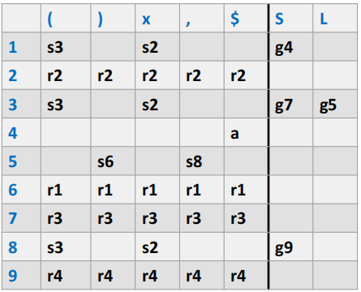{width=65%}
    </figure>

!!! tip
    - LR(0) 只根据当前状态做出决策，因此很容易遇到冲突：
        - Shift-Reduce Conflict：某种情况下既可以移进，也可以规约
    - 仅当某个文法构造出的 LR(0) 表不存在冲突，我们才称它为 LR(0) grammar

### SLR Parsing

SLR Parsing 即 Simple LR Parsing，它的思路是在保留 LR(0) 的状态机结构的基础上，通过引入 FOLLOW 集合来解决 LR(0) 中的冲突问题，从而能够处理更多的文法。

如下图，考虑一个比较简单的文法，在 LR(0) 表中，我们会发现 $T[3,+]$ 这一个表项中既可以进行 `shift 4` 操作，也可以进行 `ruduce 2` 操作，这就产生了 Shift-Reduce Conflict。

<figure markdown="span">
    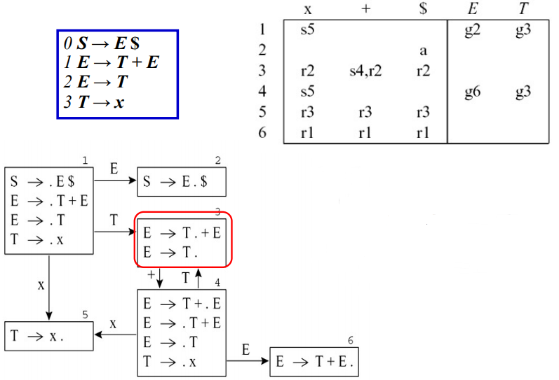{width=75%}
</figure>

SLR 对此进行的修正为：

- 当状态中存在一个已经完成处理的 item $A \to \alpha \cdot$ 时，不再对所有的终结符都填写 reduce，而是仅对于位于 FOLLOW(A) 中的终结符填写 reduce
- $T[i,a] = r_k,\ \text{if } a \in FOLLOW(A)$

这样一来，上图中的表格里就只有 $\$$ 才会进行 reduce

<figure markdown="span">
    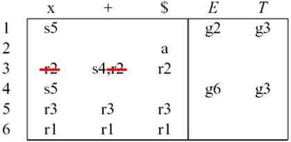{width=60%}
</figure>

!!! note "SLR Parsing"
    <figure markdown="span">
        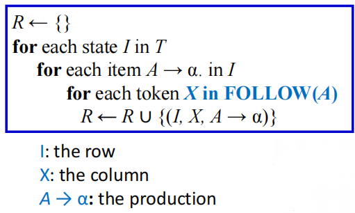{width=75%}
    </figure>

    SLR Parsing 的算法流程与 LR(0) 类似，唯一的区别在于在构建 Action Table 的 reduce 操作时，我们需要根据 FOLLOW 集合来决定，从而避免一些 Shift-Reduce Conflict，从而能够处理更多的文法了。

??? question "为什么要使用 FOLLOW set？"
    因为 FOLLOW 集合表示了在某个非终结符之后可能合法出现的终结符，因此我们可以利用 FOLLOW 集合来限制 reduce 操作的适用范围，从而避免在不应该 reduce 的情况下进行 reduce 操作，进而解决一部分的 Shift-Reduce Conflict。

### LR(1) Parsing   

SLR 虽然比 LR(0) 能处理更多的文法，但它仍然存在一些无法处理的文法。LR(1) 解析器通过引入更精确的向前查看（lookahead）来解决这个问题，从而能够处理更多的文法。

LR(1) 的思路是在 DFA 的每个状态中，不仅包含 LR(0) 的 item，还包含一个向前查看符号（lookahead symbol），表示在当前状态下，期望接收到的下一个输入 token。这样一来，我们就可以根据当前状态和下一个输入 token 来做出更精确的解析决策，从而避免一些 Shift-Reduce Conflict 和 Reduce-Reduce Conflict。

LR(1) 的 item 可以写作为如下形式：
$$ (A \to \alpha \cdot \beta,\\ x) $$
其中 

- $A \to \alpha \cdot \beta$ 是一个 LR(0) 的 item，表示我们已经成功解析了 $\alpha$，期望接下来看到 $\beta$。
- $x$ 是一个终结符，表示在当前状态下，当产生式右侧的符号被完全处理后，期望接收到的下一个输入 token。

这一个 item 的含义是：

- 子串 $\alpha$ 已经位于符号栈的顶部
- 输入流的头部应当是一个可以从 $\beta x$ 推导出的符号串

因此对于 item $ (A \to \alpha \cdot \beta,\\ x) $，下一个输入 token 应当位于 $FIRST(\beta x)$ 中，其中 $\beta$ 可以是一个空串。

!!! note "LR(1) Parsing 的算法"
    LR(1) 解析器的算法流程与 LR(0) 非常类似，唯一的区别在于在构建 DFA 的过程中，我们需要同时考虑 item 中的向前查看符号（lookahead symbol），从而得到一个更精确的状态机。

    **Closure**：

    - 与 LR(0) 的 Closure 类似，但在 LR(1) 中，我们还需要考虑向前查看（lookahead）的部分。例如对于 item 
        $$ (A \to \alpha \cdot X \beta,\\ z) $$
        
        如果 $X$ 是一个非终结符，那么我们需要将所有形如 
        $$ (X \to \cdot \gamma,\\ w) $$ 
        的 item 加入到当前的 item 集合中，其中 $w$ 是一个位于 $FIRST(\beta x)$ 中的终结符。

    **Goto**：

    - 与 LR(0) 的 Goto 几乎完全一致，只需要保留 lookahead 的部分即可。例如对于 item 
        $$ (A \to \alpha \cdot X \beta,\\ z) $$
        
        当我们接收到符号 $X$ 时，我们就可以将点号向右移动一位，得到 item
        $$ (A \to \alpha X \cdot \beta,\\ z) $$

        并且再对这个新的 item 进行 Closure 操作，得到一个新的状态。

    **Reduce**：

    - 当状态中存在一个完成了处理的 item $(A \to \alpha \cdot,\ z)$ 时，我们仅对于 $z$ 这个特定的终结符进行 reduce 操作，即仅在 $T[i, z]$ 中填入 `rk`，其中 $k$ 是产生式 $A \to \alpha$ 在文法中的编号（index）。
        - 这里的 $z$ 表示的是当前状态下的 lookahead 符号

??? info "LR(0) 与 LR(1) 的对比"
    <figure markdown="span">
        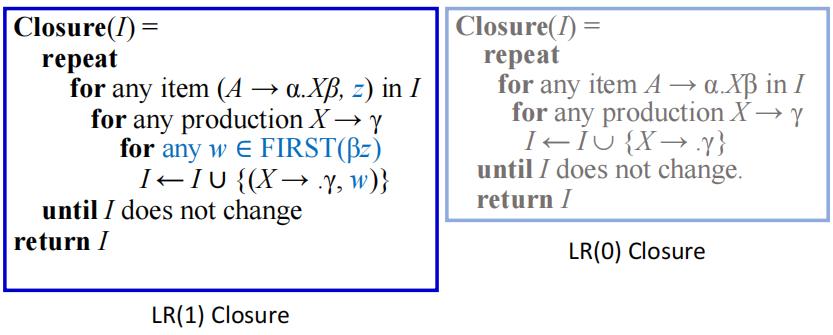{width=75%}
    </figure>

    <figure markdown="span">
        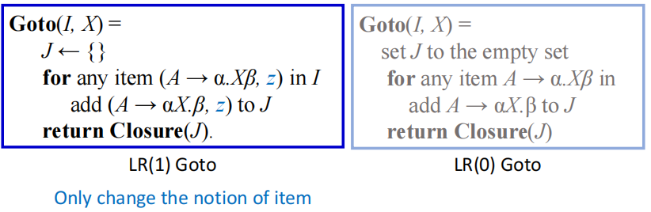{width=75%}
    </figure>

    <figure markdown="span">
        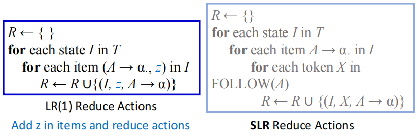{width=75%}
    </figure>

!!! example
    <figure markdown="span">
        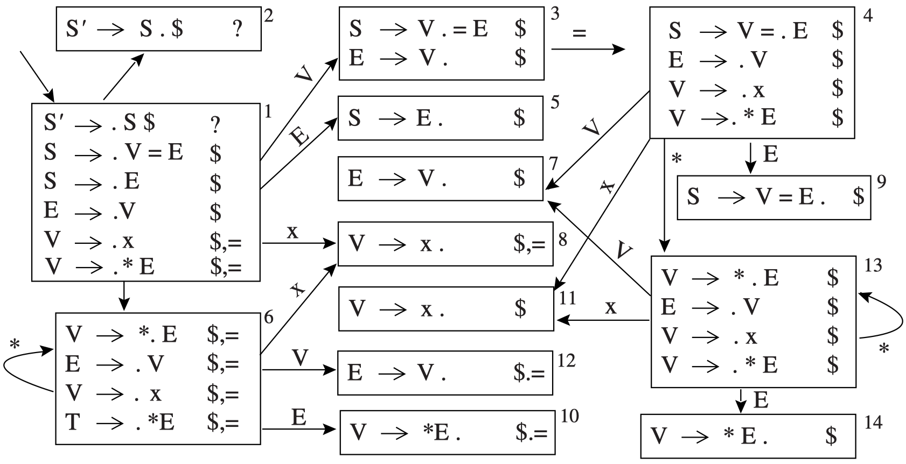{width=70%}
    </figure>

    <figure markdown="span">
        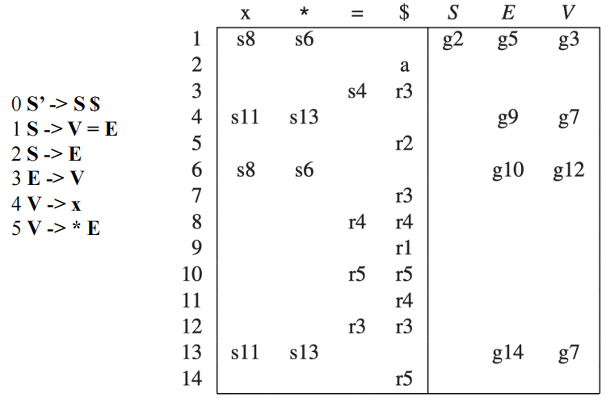{width=70%}
    </figure>

### LALR(1) Parsing

LR(1) 解析得到的状态可能非常多，从而使得解析表也非常大。LALR(1) parsing 相当于在 LR(0) 和 LR(1) 的能力和表规模之间的一个折中方案。

LALR(1) 解析器的核心思想是将 LR(1) 中除了 lookahead 以外完全相同的状态合并在一起，从而得到一个更小的状态集合。具体来说，我们首先构建 LR(1) 的 DFA，然后对于那些 LR(1) item 集合相同但 lookahead 不同的状态进行合并，得到一个新的 DFA，这个新的 DFA 就是 LALR(1) 的 DFA。

<figure markdown="span">
    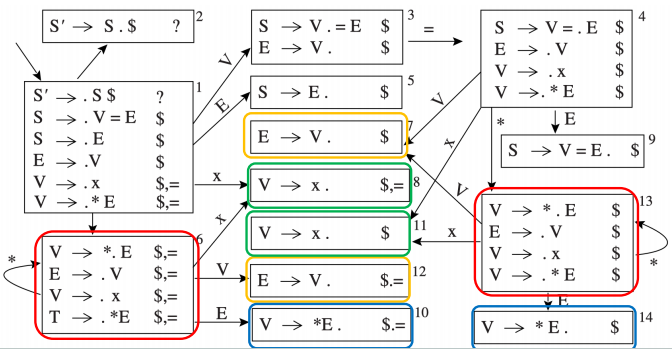{width=70%}
</figure>

经过合并后，解析表的规模会大大减少，但同时也可能引入一些新的冲突，因为合并后的状态可能包含了来自不同 LR(1) 状态的 item，但在实际的应用中这种差距带来的影响通常是可以接受的，因此 LALR(1) 解析器在实际中被广泛使用。

!!! info "Hierarchy of Grammar Classes"
    <figure markdown="span">
        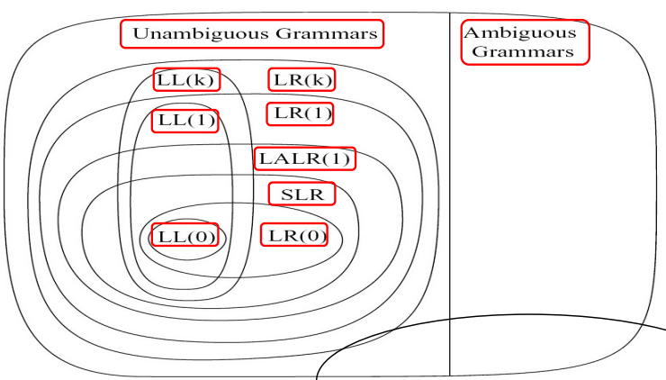{width=70%}
    </figure>

    就 LR 类文法而言，它们能够表达的文法范围大致如下；
    $$ LR(0) \subset SLR(1) \subset LALR(1) \subset LR(1) $$

    - LR(0) 只看状态，不看 lookahead
    - SLR(1) 使用与 LR(0) 相同的状态，但在 reduce 时使用 FOLLOW 集合来限制 reduce 的适用范围
    - LR(1) 使用更精确的状态（包含 lookahead）来做出解析决策，因此能够处理更多的文法
    - LALR(1) 通过合并 LR(1) 中除了 lookahead 以外完全相同的状态来减少状态数量

!!! info "LR Parsing of Ambiguous Grammars"
    LR 解析器在遇到二义性文法时会产生冲突，最典型的例子是 dangling else 问题：

    ```
    S -> if E then S else S
    S -> if E then S
    S -> other
    ```

    对于一个语句 `if a then if b then s1 else s2`，我们无法确定这个 `else` 是应该与第一个 `if` 还是第二个 `if` 进行匹配，这就导致了 Shift-Reduce Conflict。

    在大多数编程语言中都选择将 `else` 与最近的 `if` 进行匹配，相当于在遇到 shift-reduce 冲突时采用 prefer shift 的策略来解决这个冲突，从而使得这个文法在实际应用中是可解析的。

    实际上可以通过两种办法来消除这个二义性：

    1. 修改文法结构：我们可以通过引入新的非终结符 `Match` 和 `UnMatch` 来区分已经匹配了 `else` 的语句和没有匹配 `else` 的语句，从而消除二义性。例如：

        <figure markdown="span">
            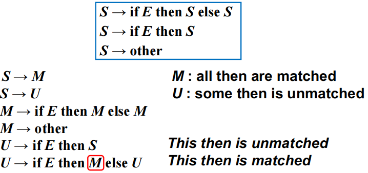{width=70%}
        </figure>

    2. 使用优先级和结合性规则：我们可以在解析器中定义一些优先级和结合性规则来指导解析器在遇到冲突时应该选择哪一个操作。例如，我们可以规定 `else` 的优先级高于 `then`，从而使得 `else` 总是与最近的 `if` 进行匹配。

        - 需要注意的是，绝大部分的 shift-reduce conflict 和几乎所有的 reduce-reduce conflict 都表明文法的定义还不够清晰，需要回到文法的定义层面进行修改来消除这些冲突，而不是在解析器中通过一些 hack 的方式来解决这些冲突。

### Error Recovery

在实际的编译器实现中，我们希望能够在输入遇到语法错误时，尽可能地继续解析后续的输入，而不是直接停止解析过程，这样一来编译器就可以一次性报告更多的错误，而不是每次只报告第一个错误。这就需要我们在解析器中实现一些错误恢复的机制。

错误恢复有两种技术：**局部错误恢复（Local error recovery）**和**全局错误修复（Global error repair）**。

### Local Error Recovery

局部错误恢复机制的核心思想是在遇到语法错误时，尝试通过调整解析栈（parse stack）以及错误检测点处的输入数据，从而使解析过程能够继续进行下去。常见的局部错误恢复技术包括：

例如在 yacc 中，可以采用的一个方法是使用一个特殊错误符号来控制恢复流程：

- 当 parser 在解析某个表达式时遇到语法错误，它会将一个特殊的错误符号 `error` 压入栈中，并且跳过当前输入 token 直到找到一个能够与 `error` 符号进行规约的产生式为止。
- 例如在表达式中间遇到语法错误时，paser 应跳转至下一个分号或右括号处并继续解析。

!!! example 
    <figure markdown="span">
        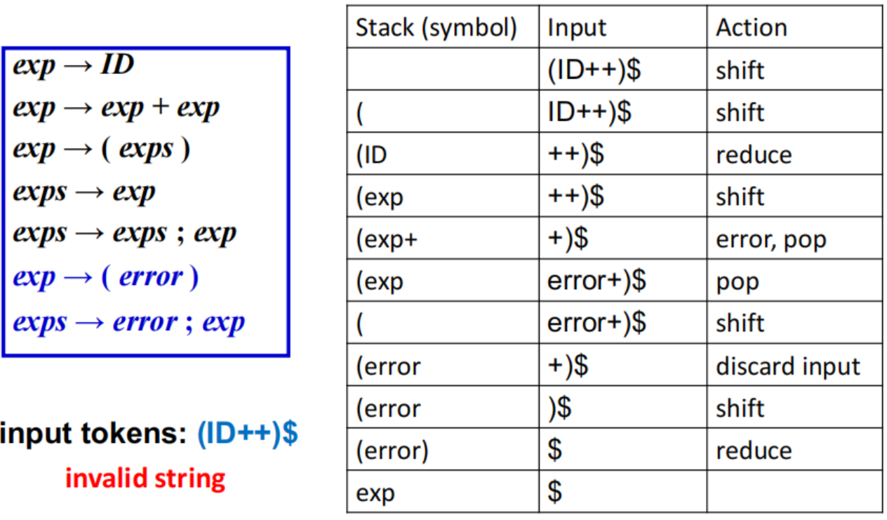{width=70%}
    </figure>

从上面这个例子可以看出来，当 LR parser 进入错误状态时，将执行以下操作：

1. （如果有必要的话）不断地弹出栈顶状态，直到 error 符号对应的动作是 shift
2. 移进（shift）error 符号
3. 读取输入 token 直到找到一个能够与 error 符号进行规约的产生式为止
    - 即直接不断读取并丢弃输入 token，知道到达非 error 的 token 为止
4. 此后恢复到正常的解析流程中

### Global Error Repair

全局错误修复机制的核心思想是在遇到语法错误时，尝试通过修改输入 token 流来使其符合文法，从而使解析过程能够继续进行下去。常见的全局错误修复技术包括：

- 插入（Insertion）：在输入 token 流中插入一个新的 token，使得输入符合文法。
    - 例如在缺少一个分号时，可以插入一个分号来恢复解析。
- 删除（Deletion）：从输入 token 流中删除一个 token，使得输入符合文法。
    - 例如在多了一个分号时，可以删除这个分号来恢复解析。
- 替换（Replacement）：将输入 token 流中的一个 token 替换为另一个 token，使得输入符合文法。
    - 例如在一个变量名写错了时，可以将这个变量名替换

!!! info "Burke-Fisher 错误修复机制"
    Burke-Fisher 错误修复机制是一种基于启发式搜索的全局错误修复方法。当 parser 遇到一个语法错误时，它会尝试对错误报告点之前的 $k$ 个 token 进行修改（插入、删除或替换），从而生成一个新的 token 流。然后 parser 会尝试解析这个新的 token 流，如果能够成功解析，那么就接受这个修复方案；如果无法成功解析，那么就继续尝试其他的修改方案，直到找到一个能够成功解析的方案为止。

    - 虽然这个方法有些暴力，但它能够在很多情况下成功地修复语法错误，从而使得 parser 能够继续解析后续的输入，提供更好的错误报告和用户体验。


