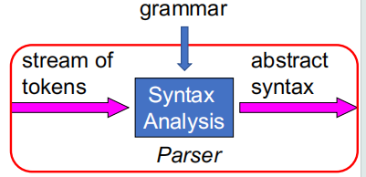
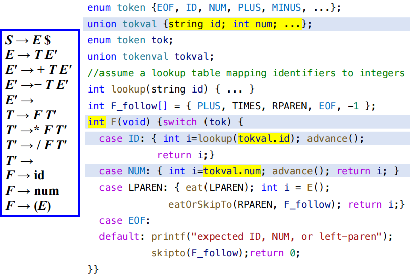
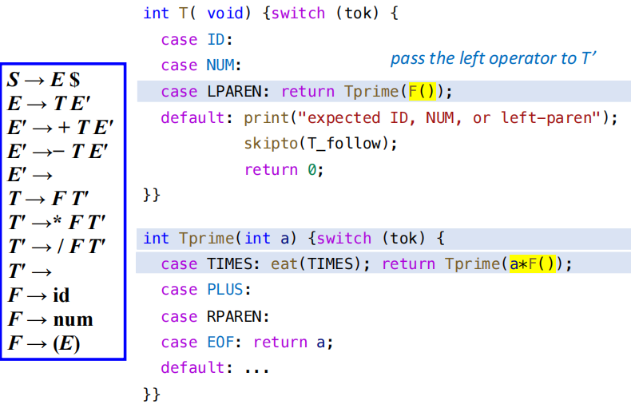
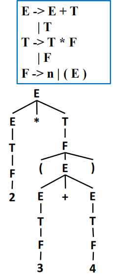
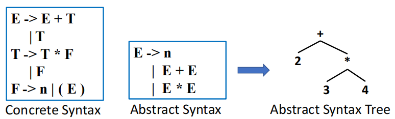
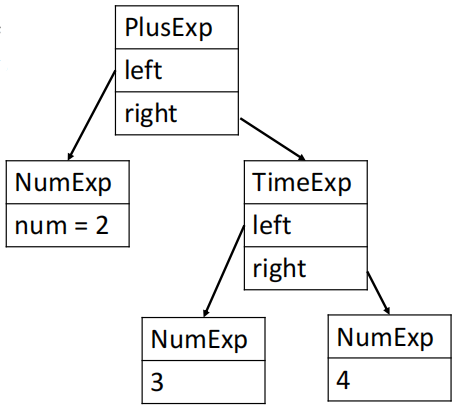

# Abstract Syntax

<figure markdown="span">
    {width=75%}
</figure>

语法分析器的哦你做除了判断输入的字符串是否符合文法之外，还需要为后续的其他工作提供有效的信息，通常包括：

- 构建抽象语法树（Abstract Syntax Tree，AST）
- 进行语义分析，例如类型检查、作用域分析等
- 生成中间表示（Intermediate Representation，IR）

## Semantic Actions

解析器的语义动作（Semantic Actions）是指对能被文法规则解析的短语做出有效的处理，例如在 yacc 中就是在产生式规则中嵌入 C 语言代码来实现这些动作。

### Semantic Actions in Recursive Descent

在递归下降分析器中，语义动作通常表现为：

- 解析函数的返回值
- 解析函数执行时的副作用
- 返回值与副作用的结合

对于每个终结符和非终结符符号，我们都会为其关联一种语义值类型，这些语义值类型代表着能从这些符号中派生出的短语的语义信息。

- 语义值类型源自于编译器的实现语言

<figure markdown="span">
    {width=75%}
</figure>

在实际的实现中，我们为了避免出现左递归，通常会对文法进行改写，使其适合递归下降分析器的实现。例如

```
E' -> + T E'
E' -> - T E'
T' -> * F T'
T' -> / F T'
```

这时候我们会注意到文法中的所有操作符都只有右操作数，为了继续实现左结合的语义效果，一种常见的技巧是把“已经计算出来的左侧的结果”作为参数传递给右侧的右递归函数。

<figure markdown="span">
    {width=75%}
</figure>

在上图的例子中，我们把 `F` 的计算结果作为参数传递给 `Tprime`，即 `Tprime(F())`，这样在 `Tprime` 中我们就可以直接使用这个结果，从而实现左结合的语义效果。

图中被标记的几行代码对应着以下两条文法：

```
T -> F T'
T' -> * F T'
```

### Semantic Actions in Yacc-Generated Parsers

在 Yacc 生成的语法分析器中，语义动作会直接写在产生式之后的花括号中，常用的一些记号如下：

- `$$`：产生式左侧非终结符的语义值
- `$i`：产生式右侧第 1i 个符号的语义值
- `%union`：定义一个联合类型来存储不同类型的语义值
- `<variant>`：指定某个符号使用联合类型中的哪个成员，即使用哪一种语义值类型

!!! note 
    - Yacc 生成的解析器会维护一个与状态栈相对应的语义值栈，当解析器执行归约操作时，就会执行相应的 C 语言语义动作，同时更新语义值栈中的值，以便后续的解析操作能够正确地使用这些语义信息。
    - 当执行规约操作 `A -> Y1 ... Yk` 时，解析器会将语义值栈顶的 k 个元素弹出（对应于 Y1 ... Yk 从符号栈弹出），并将它们作为参数传递给语义动作中的 `$1, $2, ..., $k`。语义动作执行完成后，解析器会将结果压入语义值栈中（对应于把 A 压入符号栈），以供后续的解析操作使用。
    - 由于 LR 解析器执行语义动作的顺序是固定的（因为它完全随着规约过程进行），所以它本质上相当于对语法树的一种由下至上、从左到右的遍历

## Abstract Parse Trees

理论上我们可以实现一个能够完全适配 yacc 解析器的所有语义动作的编译器，但这种做法会导致可读性和可维护性极差，并且要求编译器只能按照“短语被识别出来的顺序”来进行分析操作

更为模块化也更为合理的做法是把语法问题和语义问题分开，在不同的模块中分别处理。一种较为常见的实现方法是让解析器构建一棵解析树，后续的操作只需要在这棵树上进行遍历即可，而不需要关心解析器的具体实现细节。

### Abstract Syntax

**Why？**

{width=20% align=right}

构建解析树的过程是自下而上的，输入中的每一个 token 都对应于一个叶子节点，每一次规约操作都会在树上添加一个新的内部节点。

如右图所示的解析树被称为具体解析树（concrete parse tree），它包含了输入字符串的完整结构信息，包括所有的非终结符和终结符节点，直接反映着源语言的具体语法。

但这种具体解析树并不适合于直接交给后续阶段使用：

- 它包含了许多对于后续阶段来说无关紧要的细节，例如括号、逗号等符号，这些符号在语义分析和代码生成阶段并不需要。
- 树的结构过于复杂，会占用更多的内存空间
- 树的结构过于依赖与具体的文法，当文法被改写时，树的结构也会发生变化，这会导致后续阶段的实现变得更加复杂和不稳定

**What？**

为了给编译的后续阶段提供更加干净的接口，我们可以使用抽象语法（abstract syntax）来表示输入字符串的结构信息。抽象语法树（Abstract Syntax Tree，AST）是一种简化的树结构，它只保留了输入字符串中对于语义分析和代码生成阶段来说重要的信息，而忽略了那些无关紧要的细节。

<figure markdown="span">
    {width=75%}
</figure>

需要明确的是，抽象语法本身并不包含足够的信息来构造树的结构，我们需要使用具体语法来构造树的结构，在构造树的过程中，我们会根据具体语法中的规则来决定哪些节点需要保留，哪些节点需要忽略，从而得到一棵简化的抽象语法树。

- AST 只保留输入的短语结构，解析中涉及到的优先级、结合性等细节信息都被直接丢弃了

### Abstract Syntax Tree

为了能让后续的阶段能操作 AST，我们需要用合适的数据结构来表示 AST。一种常见的 C 语言实现方法是使用结构体来表示 AST 中的每一个节点：

- 为每一个非终结符定义一个 `typedef`
- 为该非终结符的每一个产生式都定义一个 `union` 成员

```c
typedef struct A_exp_ *A_exp;
struct A_exp_ {
    enum {A_numExp, A_plusExp, A_timesExp} kind; 
    union {
        int num; 
        struct {A_exp left; A_exp right;} plus;
        struct {A_exp left; A_exp right;} times; 
    } u; 
};
A_exp A_NumExp(int num);
A_exp A_PlusExp(A_exp left, A_exp right);
A_exp A_TimesExp(A_exp left, A_exp right);
```

在构造函数中我们需要为每个节点分配内存，并且根据节点的类型来初始化相应的成员变量，例如：

```c
A_exp A_PlusExp(A_exp left, A_exp right) {
    A_exp e = checked_malloc(sizeof(*e));
    e->kind = A_plusExp;
    e->u.plus.left = left;
    e->u.plus.right = right;
    return e;
}
```


!!! example 
    构造 `2 + 3 * 4` 的 AST：

    ```c
    e1 = A_NumExp(2);
    e2 = A_NumExp(3);
    e3 = A_NumExp(4);
    e4 = A_TimesExp(e2, e3);
    e5 = A_PlusExp(e1, e4);
    // e5 就是表达式 2 + 3 * 4 的 AST 根节点
    ```

    <figure markdown="span">
        {width=65%}
    </figure>

我们可以通过定义语义动作来做到在进行语法分析的同时就自动构建 AST，例如在 yacc 中我们做到在识别出特定的 concrete syntax 时立即构造出对应的 AST 节点：

```yacc
%left PLUS
%left TIMES
%%
exp : NUM              { $$ = A_NumExp($1); }
    | exp PLUS exp     { $$ = A_PlusExp($1, $3); }
    | exp TIMES exp    { $$ = A_TimesExp($1, $3); }
    ;
```

### Positions

在 one-pass compiler 中，词法分析、语法分析和语义分析是同时进行的，因此在进行语义分析时，我们需要知道输入字符串中每个 token 的位置信息，以便在发现错误时能够给出准确的错误信息。

- 在 one-pass compiler 中，词法分析器会维护一个 current position 的全局变量来记录当前正在处理的 token 的位置信息，这个信息通常包括行号和列号。

但对于使用 AST 的编译器来说，语法分析器和语义分析器是分开的，因此我们需要在 AST 中为每个节点添加位置信息，以便在进行语义分析时能够准确地定位错误。常见的做法是添加一个 `pos` 字段来记录节点在输入字符串中的位置信息，例如行号、列号等：

在理想情况下，解析器应在语义值栈的同时维护一个位置栈，这样一来语义操作也能够访问到位置信息

- Bison 可以直接支持位置栈，使用 `%locations` 声明来启用位置跟踪功能，并且在语义动作中可以使用 `@i` 来访问对应于第 i 个符号的位置信息。
- 标准的 Yacc 并不直接支持位置栈，但定义一个非终结符 `pos`，它的语义值就是它的位置。

```yacc
%{ extern A_OpExp (A_exp,A_binop,A_exp,position); %}
%union { int num; string id; position pos; ...};
%type <pos> pos

pos: { $$ = EM_tokpos; }
exp: exp PLUS pos exp {$$= A_OpExp($1, A_plus, $4, $3); }
```
