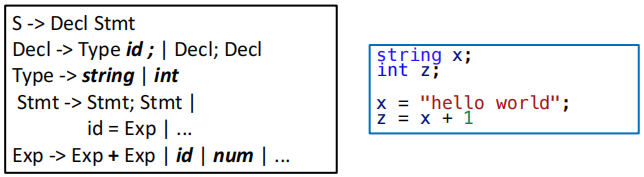
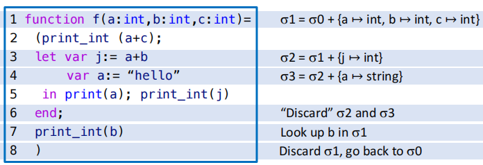
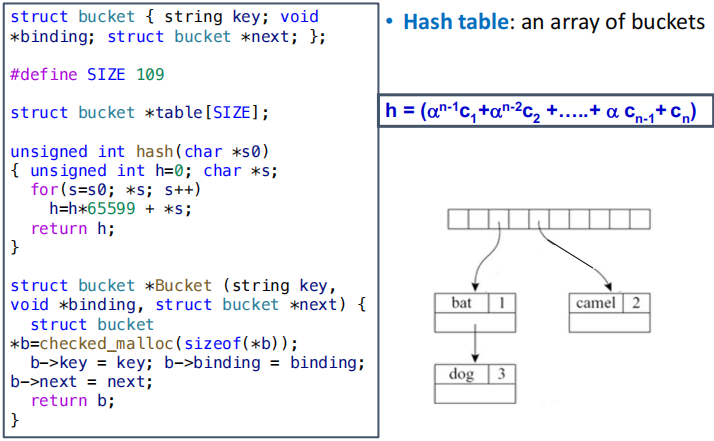
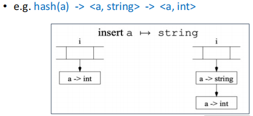
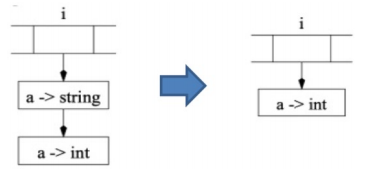
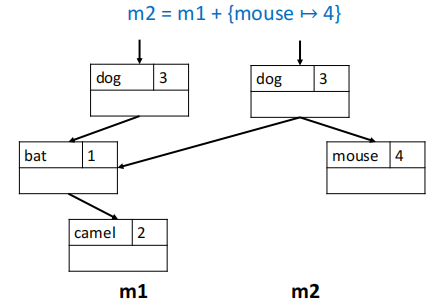
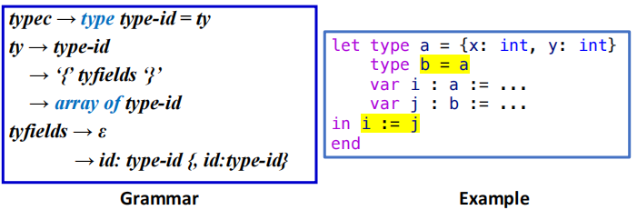
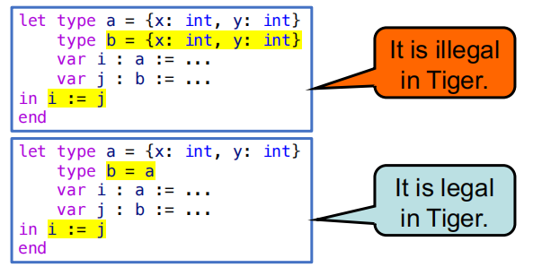

# Semantic Analysis

语义分析（Semantic Analysis）是编译器中的一个重要阶段，主要负责检查程序的语义正确性，它位于语法分析之后、IR 生成之前。语义分析的主要任务包括但不限于：

- 类型检查：确保操作数的类型正确，例如不能将一个整数与一个字符串相加。
- 作用域分析：检查变量和函数的作用域，确保它们在使用之前已经声明。
- 变量和函数的定义检查：确保所有使用的变量和函数都已经定义

<figure markdown="span">
    {width=75%}
</figure>

考虑一个简单的例子，从单纯的语法角度来看，上图中右侧的代码是完全合法的：它满足了左侧中提供的表达式文法，但是从语义的角度来看，`x` 是一个字符串变量，`x + 1` 是一个非法的表达式，因为我们不能将一个字符串与一个整数相加。

具体而言，语义分析所要做的工作就是对从语法分析阶段获取的 AST 进行处理，将其翻译为更适合后端处理的中间表示。

## Symbol Tables

语义分析阶段的特点在于需要维护一个**符号表**（也被称之为**环境**），这个表会将标识符（identifier）映射到它们的相关信息，例如类型、作用域等。

- **Binding**：从一个符号（symbol）到它的相关信息的映射关系，例如
    $$ x \mapsto \text{int} $$
- **Environment**：bindings 构成的集合，例如
    $$\sigma_0 = \{ x \mapsto \text{int}, y \mapsto \text{string} \} $$
- **Symbol Table**：用于具体实现 environment 的数据结构，

!!! example "Motivating Example of Symbol Tables"
    下面我们通过一个简单的 Tiger 函数来说明符号表的作用：

    <figure markdown="span">
        {width=75%}
    </figure>

    - 我们记函数被定义之前的环境为 $\sigma_0$，其中包含了全局作用域中的变量和函数的绑定关系。
    - 在函数开始定义之后，我们需要把 `a b c` 这三个函数参数的映射关系加入到符号表中，形成一个新的环境 $\sigma_1$。
    - 在 Tiger 语言中，形如 `let ... in ... end` 的表达式会引入一个新的作用域，因此在 `let` 表达式中我们需要把 `j` 和 `a` 这两个变量的绑定关系加入到符号表中，形成新的环境
        - 新定义的局部变量 `a` 会覆盖掉之前函数参数 `a` 的绑定关系，这就是所谓的**变量遮蔽**（variable shadowing）
    - 当离开 `end` 之后，我们需要把 `j` 和 `a` 这两个变量的绑定关系从符号表中移除，回到之前的环境 $\sigma_1$。
    - 离开函数体之后，我们又会回到最初的环境 $\sigma_0$。

### The Interface of Symbol Tables

一个可用的符号表应当至少支持以下四种操作：

- `insert`：将一个新的绑定关系加入到符号表中
- `lookup`：查询一个符号的绑定关系
- `beginScope`：进入一个新的作用域
- `endScope`：离开当前作用域，回到之前的作用域（回到旧环境中）

### Multiple Symbol Tables

当语言支持 `package` 或者 `module` 这样的模块化的封装机制时，我们通常会为每个模块维护一个独立的符号表，这些符号表之间通过某种方式进行连接，以支持跨模块的符号查询，从而形成一个层次化的符号表结构。

- 一个类内部的成员应当存储在该类自己的符号表中
- 外层的 package 或 module 环境不会直接保存所有的类的成员信息，而是通过某种方式连接到这些类的符号表中，以支持对这些成员的访问

例如在 Java 中，我们会为每个类维护一个符号表，当需要访问类内部的变量 `E.a` 时，我们首先会查询 `E` 这个类的符号表，找到这个局部环境中 `a` 的绑定关系，从而获取到它的值。

```java
package M;
class E {
    static int a = 5;
}
class N {
    static int b = 10;
    static int a = E.a + b;
}
class D {
    static int d = E.a + N.a;
}
```

在这个例子中，我们有三个类 `E`、`N` 和 `D`，每个类都有自己的符号表，它们最终形成的环境层级如下：

$$ \begin{aligned}
& \sigma_1 = \{ a \mapsto \text{int} \} \\
& \sigma_2 = \{ E \mapsto \sigma_1 \} \\
& \sigma_3 = \{ b \mapsto \text{int},\ a \mapsto \text{int} \} \\
& \sigma_4 = \{ N \mapsto \sigma_3 \} \\
& \sigma_5 = \{ d \mapsto \text{int} \} \\
& \sigma_6 = \{ D \mapsto \sigma_5 \} \\
& \sigma_7 = \sigma_2 + \sigma_4 + \sigma_6
\end{aligned} $$

- 在 Java 中，前向引用时允许的，因此在 `N` 类中访问 `E.a` 是合法的。`E`、`N` 和 `D` 这三个类的符号表最终会被连接到一起，形成一个层次化的符号表结构 $\sigma_7$，即 package `M` 的符号表。
- 需要获取 `E.a` 的值时，我们首先在 package 环境里查询 `E` 这个类的符号表 $\sigma_1$，然后再在 $\sigma_1$ 中查询 `a` 的绑定关系，从而获取到它的值。

### Implementing Symbol Tables

符号表的实现风格主要分为两种：命令式（imperative）和函数式（functional）。

#### Imperative Style

命令式风格会直接修改当前的符号表来得到新的符号表。

- 例如当我们要在环境 $\sigma_1$ 中加入一个新的绑定关时，我们会直接修改 $\sigma_1$ 来得到新的环境 $\sigma_2$。
- 当环境 $\sigma_2$ 存在时，我们就无法再访问到之前的环境 $\sigma_1$，直到我们从 $\sigma_2$ 中退出之后才能重新访问 $\sigma_1$。
- 因此我们需要在进入新的作用域之前把当前的环境保存起来，以便在离开作用域时能够恢复到之前的环境。
    - 我们可以通过使用单个全局的环境 $\sigma$ 以及一个 undo stack。当离开一个环境时，就可以借助辅助信息来撤销之前的修改。

在大型程序中标识符可能非常多，因此符号表的 lookup 操作必须非常高效，常见的实现方式是 hash table + linked list。

<figure markdown="span">
    {width=75%}
</figure>

- 插入操作实际上不难实现，只需要把新的结点插入到对应哈希桶的链表头部即可。

```c
void insert(string key, void *binding) {
    int index = hash(key) % SIZE;
    table[index] = Bucket(key, binding, table[index]);
}
```

<figure markdown="span">
    {width=65%}
</figure>

- lookup 操作的具体实现就是访问对应哈希桶的链表 `table[index]`，从链表的头部开始寻找第一个 key 匹配的结点，如果找到了就返回它的绑定关系，否则继续往下找，直到链表的末尾。

```c
void *lookup(string key) {
    int index=hash(key)%SIZE
    struct bucket *b;
    for (b = table[index]; b; b=b->next) 
        if (0==strcmp(b->key,key)) 
            return b->binding; 
    return NULL; 
}
```

- 当我们退出一个环境时，就需要利用辅助信息把之前插入的新节点 pop 出去，恢复成原来的环境。

```c
void pop(string key) { 
    int index=hash(key)%SIZE
    table[index]=table[index].next; 
}
```

<figure markdown="span">
    {width=65%}
</figure>

#### Functional Style

函数式风格不会直接修改旧环境，而是会创建一个新环境 $\sigma' = \sigma + \{ a \mapsto \tau \}$，并且在新环境 $\sigma'$ 中保留对旧环境 $\sigma$ 的访问权限。

在这种情况下，如果我们依然用哈希表来做更新，往往需要复制一整个哈希数组，成本很高，因此应该使用具有共享结构的搜索树来实现。

例如我们在环境 $m_1$ 中加入一个新的绑定关系 `mouse`，得到新的环境 $m_2$，在 $m_2$ 中我们仍然可以访问到 $m_1$ 中的绑定关系。
$$ \begin{aligned}
& m_1 = \{ \text{bat} \mapsto 1,\ \text{camel} \mapsto 2,\ \text{dog} \mapsto 3 \} \\
& m_2 = m_1 + \{ \text{mouse} \mapsto 4 \}
\end{aligned} $$

<figure markdown="span">
    {width=70%}
</figure>

可以看到，$m_2$ 在包含了新的绑定关系 `mouse` 的同时，也保留了对 $m_1$ 中原有绑定关系的访问权限，从而不需要对原先的环境进行修改。

!!! note 
    - **Imperative Style**
        - 进入新作用域后直接在原有符号表上进行修改（相当于销毁了旧表）
        - 退出作用域时需要借助辅助信息来恢复之前的环境
    - **Functional Style**
        - 进入新作用域时创建一个新的符号表，原有的符号表依然存在
        - 退出作用域时直接丢弃当前符号表，回到之前的环境

## Symbols in the Tiger Compiler

在 Tiger 编译器中使用的是破坏性更新（destructive update）的命令式风格的符号表实现。但是这样的实现还是存在一些问题：如果每一次 lookup 时都要做一次字符串比较，就会导致较大的开销。一种更为高效的做法是：

- 把字符串转换为一个 symbol，每一个 symbol 对象都对应于一个整数值（例如内存地址等）
- 所有的相同的字符串总是会映射到同一个 symbol 对象上，因此我们只需要比较 symbol 对象的对应的整数值就可以了，而不需要进行字符串比较。

这么做的好处是相当明显的：对一个整数值做哈希处理显然要比字符串快得多，并且整数键的比较（是否相等？是否大于？）也要比字符串高效得多。

### Tiger 的符号与符号表接口

```c
typedef struct S_symbol_ *S_symbol;
S_symbol S_Symbol(string name);
string S_name(S_symbol sym);

typedef struct TAB_table_ *S_table;
S_table S_empty(void);
void S_enter(S_table t, S_symbol sym, void *value);
void *S_look(S_table t, S_symbol sym);
void S_beginScope(S_table t);
void S_endScope(S_table t);
```

在接口中可以注意到我们在函数参数和函数返回类型中都使用了 `void *` 来表示符号表中绑定关系的类型。因为我们可以很方便地把任何类型的值都转换为 `void *`，或者反过来把 `void *` 转换为任何类型的值，因此这样的接口可以具有很好的通用性。

在不同的环境里，`void S_enter(S_table t, S_symbol sym, void *value);` 中的 `value` 可以是不同类型的值：

- 在类型环境中，`value` 对应的是 `Ty_ty` 类型的值，表示一个类型信息
- 在变量环境中，`value` 对应的是 `E_enventry` 类型的值，表示一个变量或者函数的信息

!!! note "类型环境（tenv）和变量环境（venv）"
    在 Tiger 编译器中，我们通常会维护两个符号表：一个是类型环境（tenv），用于存储类型相关的绑定关系；另一个是变量环境（venv），用于存储变量相关的绑定关系。

    - 类型环境（tenv）中存储的是从类型名称到类型信息的映射关系，例如 `int`、`string` 等基本类型，以及用户定义的类型。
    - 变量环境（venv）中存储的是从变量名称到变量信息，以及函数名称到函数信息的映射关系，例如变量的类型、函数的参数类型和返回类型等。

    !!! tip
        类型环境和变量环境中的绑定关系互不干扰，因此可能出现类型名称和变量名称（或函数名称）相同的情况，例如我们可以同时存在一个名为 `string1` 的类型和一个名为 `string1` 的变量：

        ```tiger
        type string1 = string
        var string1: string = "hello"
        ```

        但是因为变量名和函数名共用一个符号表，所以在变量环境中我们不能同时存在一个变量 `string1` 和一个函数 `string1`，否则就会发生命名冲突。

Tiger 编译器使用一个全局哈希表和一个辅助栈来实现符号表的功能：

- `S_beginScope`：记录当前符号表的状态，在辅助栈中压入一个特殊标记，当添加新的绑定关系时，也在辅助栈中记录下这个绑定关系，以便在离开作用域时能够撤销这些绑定关系。
- `S_endScope`：将表格恢复至最近一次尚未结束的 beginScope 时的状态，具体实现方法是不断地从辅助栈中 pop 出绑定关系，直到 pop 出的是那个特殊标记为止。

## Type Checking

### Types in Tiger Programming Language

在 Tiger 语言中的类型可以分为两类：

- 原始类型：`int` 和 `string`
- 构造类型：`record` 和 `array` 
    - `record` 类型由一组字段组成，每个字段都有一个名称和一个类型，一定程度上可以理解为 C 语言中结构体的弱化版。例如 `type person = { name: string, age: int }` 定义了一个 `person` 类型，它是一个包含 `name` 和 `age` 两个字段的记录类型。
    - `array` 类型由一个元素类型组成，表示一个元素类型的数组。例如 `type intArray = array of int` 定义了一个 `intArray` 类型，它是一个包含整数元素的数组类型。

<figure markdown="span">
    {width=70%}
</figure>

在具体的实现细节中，还会显式地使用以下几种类型：

- `nil` 类型：表示一个空值，通常用于表示 record 类型的空指针。
- `void` 类型：表示一个没有返回值的函数的返回类型。
- `name` 类型：表示一个类型别名，也用于递归类型的占位符

```c
typedef struct Ty_ty_ *Ty_ty;
struct Ty_ty_ {
    enum {
        Ty_record, Ty_nil, Ty_int, Ty_string,
        Ty_array, Ty_name, Ty_void
    } kind;
    union {
        Ty_fieldList record;
        Ty_ty array;
        struct {S_symbol sym; Ty_ty ty;} name;
    } u;
};
```

!!! tip "递归定义的类型"
    在定义一个新类型时，我们常常会遇见递归定义的情况。一个典型的例子是定义一个链表类型：`type list = { head: int, tail: list }`。
    
    在定义 `list` 类型时，我们需要使用 `list` 这个类型本身来定义它的 `tail` 字段，这就形成了一个递归定义的情况。为了处理这种情况，我们可以先把它的 `head` 和 `tail` 字段的类型定义为一个占位符（placeholder），例如 `name` 类型，然后在后续的类型检查过程中再把这个占位符替换为实际的类型。

### Type Equivalence and Namespace in Tiger

#### Type Equivalence

!!! info "Type Equivalence"
    - **Name equivalence (NE)**： 我们称 T1 和 T2 两个类型是等价的，当且仅当它们是通过完全相同的类型声明定义的
        - 例如对于 `type a = int` 和 `type b = int`，在 name equivalence 的规则下，`a` 和 `b` 是不等价的。
        - 而对于 `type a = int` 和 `type b = a`，在 name equivalence 的规则下，`a` 和 `b` 才是等价的。
    - **Structural equivalence (SE)**：我们称 T1 和 T2 两个类型是等价的当且仅当它们由相同的构造函数以及相同的构造顺序构造出来的（即结构上是相同的）
        - 例如对于 `type a = int` 和 `type b = int`，在 structural equivalence 的规则下，`a` 和 `b` 是等价的。
        
Tiger 语言采用的是 name equivalence 的类型系统，因此在 Tiger 中两个类型是否等价取决于它们的定义方式，而不是它们的结构。

在 Tiger 语言中，每一个 record 类型都会被分配一个唯一的类型标识符（type tag），因此即使两个 record 类型的字段完全相同，它们也不会被认为是等价的。

<figure markdown="span">
    {width=70%}
</figure>

#### Namespace

Tiger 拥有两套分离的命名空间：

- Type namespace：用于存储**类型名称**，例如 `int`、`string`、`person` 等。
- Value namespace：用于存储**变量名称**和**函数名称**，例如 `x`、`y`、`f` 等。

也就是说，在 Tiger 语言中，我们可以同时存在一个类型名称和一个变量名称（或函数名称）相同的情况，它们可以共存于不同的命名空间中，例如：

```tiger
let type a = int
    var a := 1
in ...
end
```

但如果我们在值环境中先定义了一个函数 `a`，在定义一个变量 `a`，就会把原先的函数 `a` 的绑定关系覆盖掉，例如：

```tiger
let function a (b: int) = ...
    var a := 1
in ...
end
```

因此 Tiger 的语义分析阶段需要维护两个 environment：

- Type environment：将类型符号映射到它们的类型对象上
    - `symbol -> Ty_ty`
- Value environment：将变量符号映射到他们的类型对象上，或把函数符号映射到它们的参数和返回类型上
    - `symbol -> Ty_ty`
    - `symbol -> struct {Ty_tyList formals, Ty_ty result;}`

??? info "Tiger 中 Value Environment 的具体实现细节"
    ```c
    typedef struct E_enventry_ *E_enventry;
    struct E_enventry_ {
        enum {E_varEntry, E_funEntry} kind;
        union {
            struct {Ty_ty ty;} var;
            struct {Ty_tyList formals; Ty_ty result;} fun;
        } u;
    };
    E_enventry E_VarEntry(Ty_ty ty); 
    E_enventry E_FunEntry(Ty_tyList formals, Ty_ty result);
    S_table E_base_tenv(void); /* Ty_ty environment */
    S_table E_base_venv(void); /* E_enventry environment */
    ```

Tiger 使用 `Semant` 模块来对抽象语法进行语义分析（包括类型检查）。这个模块包含四个核心函数，这些函数会遍历语法树来执行分析操作：

```c
struct expty transVar(S_table venv, S_table tenv, A_var v);
struct expty transExp(S_table venv, S_table tenv, A_exp a);
void transDec(S_table venv, S_table tenv, A_dec d);
Ty_ty transTy(S_table tenv, A_ty a);
```

它们的具体功能分别为：

- `transVar`：处理左值
- `transExp`：处理表达式
- `transDec`：处理声明并更新环境
- `transTy`：将抽象语法树中的类型转换为语义分析阶段使用的类型对象

这四个函数会同时执行类型检查和中间表示（IR）生成的工作，但是我们暂时只考虑类型检查的问题。

### Type-Checking Expressions

我们暂时先考虑对表达式的类型检查，涉及到的函数是 `transExp`，它检查表达式的类型，然后查询并更新相应的 environment。

- arguments：
    - `venv`：变量环境
    - `tenv`：类型环境
    - `a`：抽象语法树中的表达式节点
- result：一个被翻译后的表达式以及它的 Tiger 类型
    - 使用结构体 `struct expty {Tr_exp exp; Ty_ty ty;};` 来表示

!!! example
    我们以加法为例进行说明。
    
    在 Tiger 语言中执行的是非重载式的类型检查，因此对于 `e1 + e2` 这样的表达式，我们需要保证 `e1` 和 `e2` 的类型都是 `int`，并且整个表达式结果的类型也必须是 `int`

    因此 `transExp` 在发现 `A_opExp` 时，需要

    1. 递归地检查左右两个子表达式
    2. 检查这两个子表达式的类型是否满足运算符的约束
    3. 如果检查通过，就返回一个新的 `expty` 结构体，其中 `ty` 是 `int` 类型。

而对于一个变量的类型检查，我们还需要考虑这个变量是否为左值。在 Tiger 中左值有三种：

```
lvalue -> id
       -> lvalue.field
       -> lvalue[exp]
```

这三种情况分别对应着：普通变量（`A_simpleVar`）、记录类型的字段访问（`A_fieldVar`）以及数组类型的元素访问（`A_subscriptVar`）。

在 `transVar` 函数中，我们需要根据变量的类型来进行不同的处理：

```c
struct expty transVar(S_table venv, S_table tenv, A_var v) 
{ /* A_var is the structure for l-value */
    switch(v->kind) {
        case A_simpleVar: {
            E_enventry x = S_look(venv, v->u.simple);
            if (x && x->kind == E_varEntry)
                return expTy(NULL, actual_ty(x->u.var.ty));
            else {
                EM_error(v->pos, "undefined variable %s", S_name(v->u.simple));
            return expTy(NULL, Ty_Int());}
        }
        case A_fieldVar:
            ...
    }
}
```

### Type-Checking Declarations

#### Variable Declarations

- 对于没有类型约束的变量声明，例如

    ```tiger
    var x := exp
    ```

    处理的大致步骤如下：

    1. 对这个变量的初始化表达式执行 `transExp` 来获取它的类型
    2. 把这个变量的绑定关系加入到变量环境中

    ```c
    void transDec(S_table venv, S_table tenv, A_dec d) {
        switch(d->kind) { 
            case A_varDec: { 
                struct expty e = transExp(venv,tenv,d->u.var.init);
                S_enter(venv, d->u.var.var, E_VarEntry(e.ty));
        }
        ...
        }
    }
    ```

- 对于有类型约束的变量声明，例如

    ```tiger
    var x : type-id := exp
    ```

    还需要进行一些额外的检查：

    - 约束条件和初始化表达式的类型必须一致
    - 若初始化表达式的类型为 `Ty_nil`，则约束条件必须是一个` Ty_record` 类型（由 Tiger 的相关手册规定）

#### Type Declarations

对于非递归的类型声明

```tiger
type type-id = ty
```

- `type` 是类型声明的关键字
- `type-id` 是类型名称
- `ty` 是类型定义，可以是一个基本类型、一个 record 类型或者一个 array 类型

我们需要递归地调用 `transTy`，来把抽象语法树的类型 `A_ty` 转换为语义分析阶段使用的类型对象 `Ty_ty`，然后把这个类型对象加入到 `tenv` 中。

#### Function Declarations

对于函数声明

```tiger
function id (tyfields) ： type-id = exp
```

- `function` 是函数声明的关键字
- `id` 是函数名称
- `tyfields` 是函数参数列表，每个参数都有一个名称和一个类型，例如 `(a: int, b: string)`
- `type-id` 是函数的返回类型，例如 `int`
- `exp` 是函数体的表达式

语义分析阶段处理函数声明时需要进行以下几个步骤：

1. 在 `venv `中查找到返回类型
2. 将形参列表翻译为 `Ty_tyList` 类型的对象
3. 把函数的绑定关系加入到 `venv` 中
4. 打开函数体的局部作用域，将每一个形参都加入到 `venv` 中
5. 对函数体执行 `transExp` 来获取它的类型，并且检查这个类型是否与函数声明中的返回类型一致

??? example "函数声明处理的参考实现"
    ```c
    void transDec(S_table venv, S_table tenv, A_dec d) { 
        switch(d->kind) {
            case A_functionDec: {
                A_fundec f = d->u.function->head;
                Ty_ty resultTy = S_look(tenv, f->result); 
                Ty_tyList formalTys = makeFormalTyList(tenv,f->params); 
                S_enter(venv, f->name, E_FunEntry(formalTys,resultTy));
                S_beginScope(venv); 
                {A_fieldList l; Ty_tyList t;
                for(l=f->params, t=formalTys; l; l=l->tail, t=t->tail)
                    S_enter(venv,l->head->name,E_VarEntry(t->head));
                } 
                transExp(venv, tenv, d->u.function->body); 
                S_endScope(venv); 
                break; 
            }
            ...
        }
    }
    ```

    这是一个极为化简的实现：

    - 只处理了单个函数的情况
    - 只处理了一定会有返回结果的函数
    - 不处理程序中可能出现的错误
    - 不检查函数体表达式的类型是否与函数声明中的返回类型一致

#### Recursive Declarations

递归声明包括递归类型和递归函数两种情况：


- 对于递归的类型声明，例如

    ```tiger
    type list = { first: list, rest: list }
    ```

    我们会发现如果我们需要定义 `list`，就首先知道 `list` 的类型是什么才能定义它的字段类型，这就形成了一个递归定义的情况。
    
    一般而言，我们会通过两遍扫描来处理递归类型声明：

    1. 先把声明的 "headers"放入到环境当中，例如先处理 `type list =`
        - 在这个阶段我们还不知道 `list` 的具体类型是什么，因此我们可以先用 `Ty_name` 类型作为一个占位符来使用。
        - `#!c S_enter(tenv, name, Ty_Name(name, NULL));`
    2. 在声明的 "body" 上调用 `transTy` 来获取它的类型对象，例如处理 `{ first: list, rest: list }`
        - 在这个阶段我们就可以用 `transTy` 返回的类型来替换掉之前的占位符 `Ty_name`了。

    !!! warning "循环递归定义"
        在一组相互递归的类型声明中，每一个循环都必须至少通过一次 record 或 array 的构造来打破递归。例如下面这个定义是非法的

        ```tiger
        type a = b
        type b = a
        ```

        必须这么定义才是合法的：

        ```tiger
        type a = b
        type b = {i: a}
        ```

- 对于递归的函数也需要两遍来处理。

    例如 `f` 和 `g` 这两个函数是相互递归调用的，我们需要

    1. 第一遍先收集所有函数的头部信息：函数名、参数类型列表、返回类型
    2. 第二遍在环境已经包含了所有函数的头部信息的基础上来检查函数体
