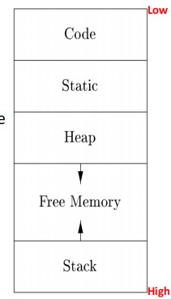
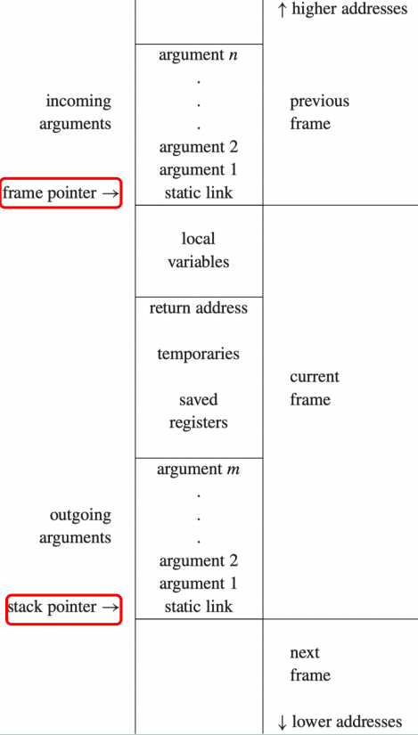
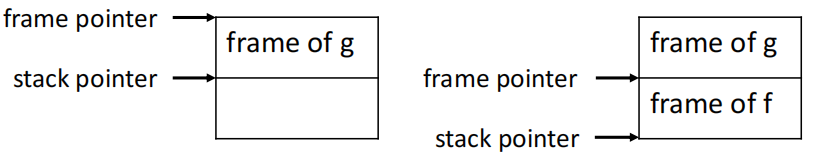
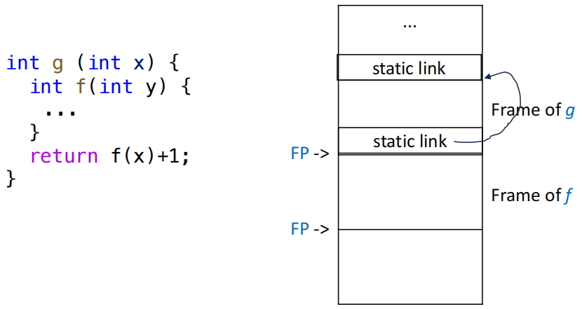
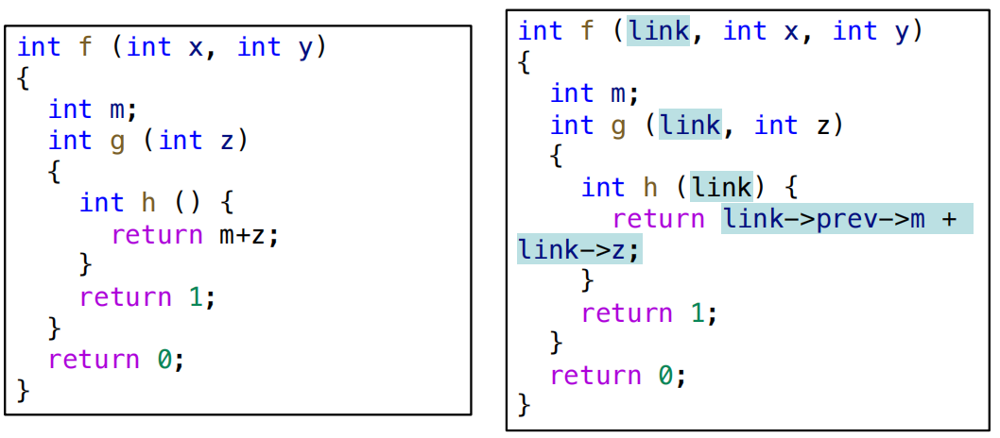
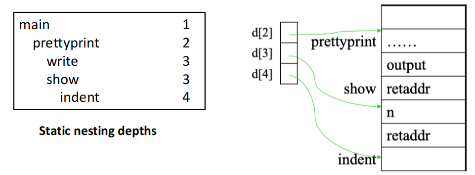
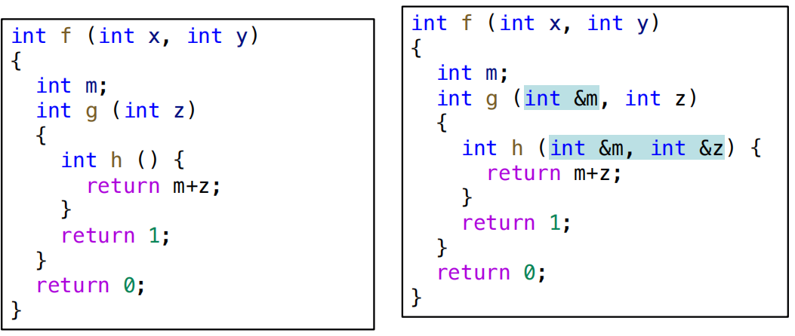
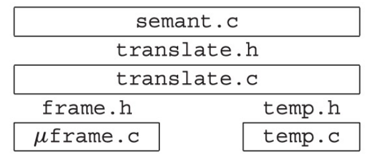

# Activation Records

{width=25% align=right}

当一个程序运行时会拥有一个自己的逻辑地址空间，一般而言内存划分的方式如下：

- **code**：可执行的目标代码
- **static**：在编译时大小已知的数据对象，例如全局常量、编译器生成的数据等
- **stack**：程序调用过程中生成的数据结构，被称为**活动记录（activation record）**，包括函数的参数、局部变量、返回地址等
- **heap**：动态分配的内存区域，大小在运行时确定


我们称对函数 f 的一次调用是 f 的一个**激活（activation）**，每次激活都会在栈上生成一个活动记录。我们可以把活动记录理解为这个函数调用的一个实例，包含了这个实例的所有信息，例如参数、局部变量、返回地址等。当函数调用结束时，这个活动记录就会被销毁。

- 有时我们也把活动记录成为帧（frame）或调用帧（call frame）、栈帧（stack frame），它们都是同一个概念的不同称呼。

## Stack Frames

{width=25% align=right}

**stack pointer**：指向当前活动记录的顶部。由于栈是从高地址向低地址增长的，因此地址高于栈指针的内存空间我们都认为是已经使用了的。

一个函数的 stack frame 指的是该函数在栈上占用的那一块内存区域，通常包含以下内容：

- incoming arguments
- local variables
- return address
- temporaries
- saved registers
- outgoing arguments
- static link

### Frame Pointer

stack pointer 代表的是栈顶的位置，而 frame pointer 则是指向当前函数的活动记录的底部。

当我们在一个函数 g 中调用另一个函数 f 时，会发生如下的动作：

- 进入 f：
    1. 保存旧的帧指针 FP
    2. FP = SP
    3. SP = SP - frame size
- 退出 f：
    1. SP = FP
    2. 恢复到旧的帧指针 FP

当 frame size 是固定的时，FP 的值恒等于 SP + frame size，因此我们可以直接使用 SP 来访问函数的参数和局部变量，而不需要使用 FP。

<figure markdown="span">
    {width=75%}
</figure>

### Registers

寄存器的使用是所有函数共享的，因此当多个函数使用同一个寄存器时，我们需要保存和恢复寄存器的值，以避免不同函数之间的干扰。

- **caller-save register**：由调用者负责保存和恢复的寄存器，通常用于存储函数参数和返回值。
- **callee-save register**：由被调用者负责保存和恢复的寄存器，通常用于存储函数的局部变量和临时值。

### Parameter Passing

Tiger 语言采用的函数参数传递方式是 **pass-by-value**，即将参数的值复制到函数的活动记录中。当函数调用结束时，这些参数的值就会被销毁。即把实参的值复制到形参中，函数内部对形参的修改不会影响实参。

在现代机器中，我们不会把所有的参数都压入栈中传递，而是采用前 k 个参数通过寄存器传递，剩余参数通过栈传递的规定。

这样设计的好处是可以做到更高效的函数参数传递，但可能导致一个典型的问题：

```c
void f(int a) {
    int z = ...;
    h(z);
    int t = a + 2;
}
```

假设在调用函数 `h` 前，参数 `a` 的值被保存在寄存器 `r1` 中，那么在调用 `h(z)` 时，`r1` 的值可能会被覆盖，那么我们还是需要把 `a` 的值保存在栈上，实际上并没有减少开销。

课件给出了几种解决这个问题的方法：

1. 如果在调用 `h(z)` 时，参数 `a` 已经是 dead 的（不再需要使用），那么就可以直接覆盖掉 `r1` 的值
2. 如果函数是一个 leaf procedure（不调用其他函数），那么就可以直接使用寄存器来传递参数，而不需要使用栈
3. 某些优化编译器可以采用 inter-procedural register allocation 的机制，在编译时一次性分析整个程序中的所有函数，并且协调每一个函数的寄存器使用，以避免寄存器的冲突
4. 某些架构拥有 register windows 的机制，在每次函数调用时都能分配一组全新的寄存器

### Reference & Address

#### Call-by-Reference

如果编程语言允许返回一个参数的地址，例如：

```c
int* f(int x) { return &x; }
```

显然参数 `x` 必须拥有一个内存地址，因此必须保存在栈上。但是当函数返回时形参 `x` 会被释放掉，此时返回的这个地址就变成了一个悬空指针（dangling pointer），如果我们在函数外部访问这个地址，就会导致未定义行为。

这就带来了另一种函数参数传递方式：call-by-reference，将参数的地址传递给函数。

- 如果我们把变量 `x` 作为参数传递给函数 `f(y)`，编译器实际上会把 `x` 的地址直接传递给 `f`
- 在函数 `f` 内部对 `y` 的任何读写操作实际上都是对 `x` 的读写操作
- 每一次对 `y` 的访问都会被编译器翻译成对 `x` 的访问，因此我们不需要在函数内部为 `y` 分配一个新的内存地址。当我们返回或使用 `&y` 时，实际上使用的就是 `&x`

#### Return Address

若函数 `g` 调用 `f`，从 `f` 返回后应该继续执行 `g` 中的下一条指令，因此在调用 `f` 时需要把 `g` 中下一条指令的地址保存在栈上，这个地址被称为 `f` 的 return address。

- non-leaf procedure：需要把自己的 return address 保存在栈上，从子函数中返回时再取出来
- leaf procedure：不调用其他函数，因此不需要保存 return address，可以直接使用寄存器来存储 return address

### Frame-Resident Variables

现代的 Modern procedure-call convention 回用寄存器来传递参数、保存返回地址、返回函数结果，但我们同样需要知道什么时候要把变量保存在 frame（即内存）里，典型的情况包括：

- 变量按引用传递，因此必须具有地址
- 当前函数调用的子函数需要使用这个变量
- 变量过大，单个寄存器无法保存
- 变量是数组类型，需要使用地址来访问数组元素
- 储存该变量的寄存器有其他用途，变量必须保存到其他地方
- 局部变量和临时变量过多，无法全部存入寄存器

我们称满足上面条件之一的变量 **escape**，即它的生命周期超出了当前函数的范围，因此必须保存在内存中。

### Static Links

对于 Tiger、Pascal、ML 这种允许嵌套函数声明的语言，内层函数可以直接访问外层函数的变量和参数。我们把这种函数结构称为 **Block Structure**，也就是说函数的定义可以嵌套在另一个函数的定义内部。

例如下面这个 Tiger 的例子:

!!! example 

    ```tiger hl_lines="4 7 9 12 13"
    type tree = {key: string, left: tree, right: tree}
    function prettyprint(tree: tree): string =
    let
        var output := ""

        function write(s: string) =
            output := concat(output, s)

        function show(n: int, t: tree) =
        let
            function indent(s: string) =
                (for i := 1 to n do write(" ");
                output := concat(output, s);
                write("\n"))
        in
            if t=nil
            then indent(".")
            else (indent(t.key);
                show(n+1, t.left);
                show(n+1, t.right))
        end
    in
        show(0, tree); output
    end
    ```

    - 我们需要在 `write` 里访问 `prettyprint` 的局部变量 `output`
    - 在 `indent` 中访问 `show` 的参数 `n` 和 `prettyprint` 的 `output`

在这种情况下，仅仅靠 FP+offset 的方式是不够的，因为外部函数的变量并不保存在自己的 frame 中。因此我们需要在每个函数的 frame 中增加一个指向外部函数的 frame 的指针，这个指针被称为 **static link**。

> 调用函数 f 时，会额外传递一个指针，这个指针指向**源码中直接包围 f 的外层函数的最近一个活动记录**，也就是说这个指针指向了 f 的静态父函数的 frame，这就是 static link。

<figure markdown="span">
    {width=75%}
</figure>

具体到上面的例子

- 编译器在处理时会向 `write` 和 `show` 传递一个指向 `prettyprint` 的 frame 的指针，当它们需要访问变量 `output` 时，就可以通过这个指针来找到 `prettyprint` 的 frame，从而访问 `output`。
- 当更内一层的函数 `indent` 需要访问 `output` 时，会先沿着自己的 static link 找到 `show` 的 frame，发现 `show` 的 frame 中也没有 `output`，然后继续沿着 `show` 的 static link 找到 `prettyprint` 的 frame，最终访问到 `output`。

!!! example 
    static link 的具体实现可以理解为如下的伪代码：

    <figure markdown="span">
        {width=75%}
    </figure>

当前函数的嵌套深度为 n 时，如果要访问一个深度为 m 的变量（m < n），我们需要沿着 static link 向上跳转 n-m 次，才能找到这个变量所在的 frame，然后再根据 offset 来访问这个变量。

优点：

- 参数传递带来的额外开销较小

缺点：

- 每次访问一个非局部变量都要进行多次跳转（多次内存寻址）效率较低
- 函数的嵌套深度越深，访问非局部变量的开销就越大

### Display & Lambda Lifting

#### Display

实现 Block Structure 的另一种方法是使用 **display**：构建一个全局的指针数组 `display`，`display[i]` 指向最近一次进入的、静态嵌套深度为 i 的函数的 frame。

<figure markdown="span">
    {width=75%}
</figure>

#### Lambda Lifting

当我们在函数 f 内部调用另一个函数 g 时，所有被 g 实际调用的外部变量都会作为额外参数传递给 g，这个过程被称为 **lambda lifting**。

<figure markdown="span">
    {width=75%}
</figure>

但是这有一个显而易见的缺点：当函数 g 调用的外部变量过多时，参数列表就会变得非常长，导致函数调用的开销增加。

### Higher-Order Functions

通常而言，我们会假设局部变量在函数返回后不再被使用，但如果一个语言同时支持

- 嵌套函数
- 函数作为返回值

那么就可能需要在函数返回后仍保留局部变量，例如下面这个 ML 的例子：

```sml
fun f(x) =
    let fun g(y) = x + y 
    in g 
end
```

当函数 `f` 返回之后，局部变量 `x` 仍然被函数 `g` 使用。如果我们只把 `x` 保存在 `f` 的栈帧里，当 `f` 返回时 `x` 就会被销毁掉，此时 `g` 就无法访问 `x` 了，这显然是不正确的。

因此当出现这类情况时，就不能只是用 stack 来保存变量了，需要使用更加复杂的内存管理机制，例如 heap 来保存这些变量，并且在函数返回时不销毁它们。

## Frames in The Tiger Compiler

课本的 Tiger 编译器实现里没有直接让语义分析模块来直接操作栈帧以及偏移量、寄存器，而设计了一个机器无关的抽象接口 `frame` 模块来间接操作栈帧

```c title="frame.h"
typedef struct F_frame_ *F_frame;
typedef struct F_access_ *F_access;
typedef struct F_accessList_ *F_accessList;
struct F_accessList_ {
    F_access head; 
    F_accessList tail;
};

F_frame F_newFrame(Temp_label name, U_boolList formals);
Temp_label F_name(F_frame f);
F_accessList F_formals(F_frame f);
F_access F_allocLocal(F_frame f, bool escape);
```

- `F_frame`：负责记录某个函数的 frame 的信息，包括以下内容：
    - 所有形参的位置
    - 实现 "view shift" 的信息
    - 已分配的局部变量数量
    - 函数在机器码中的 label
    - `F_newFrame(f, l)` 会为函数 `f` 创建一个具有 k 个形参的 frame，其中 `l` 是一个由 k 个布尔值构成的列表，第 i 个布尔值为 true 表示第 i 个参数 escape
- `F_access`：负责记录具体某个变量在 frame 中的访问方式，例如它是保存在寄存器里还是保存在内存里

    ```c
    struct F_access_ {
        enum {inFrame, inReg} kind;
        union {
            int offset; /* InFrame */
            Temp_temp reg; /* InReg */
        } u;
    };
    ```

    此外还有两个方法函数，用于设置变量的访问方式：

    ```c
    static F_access InFrame(int offset);
    static F_access InReg(Temp_temp reg);
    ```

我们可以通过 `#!c F_accessList F_formals(F_frame f);` 接口函数来提取函数参数的访问方式，通过 `#!c F_access F_allocLocal(F_frame f, bool escape);` 来在语义分析阶段为局部变量分配存储空间

- `escape = true`：返回一个 `inFrame` 的 `F_access`
- `escape = false`：可以返回一个 `inReg` 的 `F_access`

### Local Variables

在 Tiger 语言中，局部变量的分配机制并不是常见的声明时申请，结束生命周期时就回收，而是

- 每次遇到变量声明时，就申请一块内存空间，然后把这块空间和变量 `v` 绑定在一起
- 当作用域结束时会清除这个绑定关系，但对应的 frame slot 未必会被回收，可能不会被物理复用

!!! example 
    ```tiger
    function f() =
    let
        var v := 6
    in
        (print(v);
        let var v := 7 in print(v) end;
        print(v);
        let var v := 8 in print(v) end;
        print(v))
    end
    ```

    这段 Tiger 代码的输出是 `6 7 6 8 6`，三个 `v` 是三个不同的变量，编译器会分别创建三个不同的 access。

    如果编译器足够聪明的话，可以发现后两个 `v` 的生命周期并不重叠，因此它们可以复用同一个 frame slot，从而节省内存空间。

### Calculating Escapes

为了正确调用 `F_allocLocal` 来为局部变量分配内存，编译器必须事先知道变量是否 escape，因此需要使用 `findEscape` 函数来：

- 遍历整个 AST，查找所有变量的声明深度以及使用深度
- 如果使用深度大于声明深度，那么就说明这个变量会被内层函数访问，escape 了，结果记录在 environment 中

### Temporaries and Labels

Tiger 编译器使用“抽象寄存器”和“抽象地址”的机制

- **Temporary**：变量值保存在寄存器中
    - `Temp_temp` 是局部变量的抽象名，编译器会在后续的寄存器分配阶段把它映射到具体的物理寄存器上
- **Label**：机器语言中的某个地址，具体位置尚未确定
    - `Temp_label` 是静态内存地址的抽象名，编译器会在后续的代码生成阶段把它映射到具体的内存地址上

具体来说，语义分析阶段会说这个变量需要保存在某个 `temp` 中，那个函数的入口地址需要保存在某个 `label` 中，但它们具体对应哪个寄存器或者内存地址，都是在后续的寄存器分配和代码生成阶段才确定的。从而实现了语义和具体机器布局的解耦。

### Translate

<figure markdown="span">
    {width=55%}
</figure>

Tiger 编译器实际上在语义分析和变量的具体布局之间设置了两层抽象：

- `frame.h` 和 `temp.h` 接口提供了与机器无关的内存变量和寄存器变量的视图抽象，从而使我们不需要关心变量具体保存在哪里
- `Translate` 模块通过处理嵌套作用域的概念来对上面这个功能进行了增强

```c title="translate.h"
typedef struct Tr_access_ *Tr_access;
typedef ... Tr_accessList ...

Tr_accessList Tr_AccessList(Tr_access head, Tr_accessList tail);
Tr_level Tr_outermost(void);
Tr_level Tr_newLevel(Tr_level parent, Temp_label name,
U_boolList formals);
Tr_accessList Tr_formals(Tr_level level);
Tr_access Tr_allocLocal(Tr_level level, bool escape);
```

这一模块的职责是：

- 为 Semant 模块管理形参、局部变量以及函数的嵌套层级 `Tr_level`
- 管理各个函数的 static link 的传递

!!! question "为什么不直接使用 Frame 模块来管理这些内容？"
    - 许多源语言并不支持嵌套函数定义，因而 Frame 模块应当独立于所编译的具体源语言，它应当只关注 frame 的抽象表示和操作，而不应该涉及到嵌套函数的概念
    - 另一方面，Translate 模块则是专门为支持嵌套函数定义的源语言设计的，它负责管理函数的嵌套层级以及 static link 的传递，因此它需要把 static link 当作一个隐藏参数插入到函数调用中，而 Frame 模块则不需要关心这些细节

