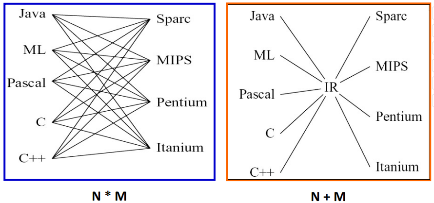
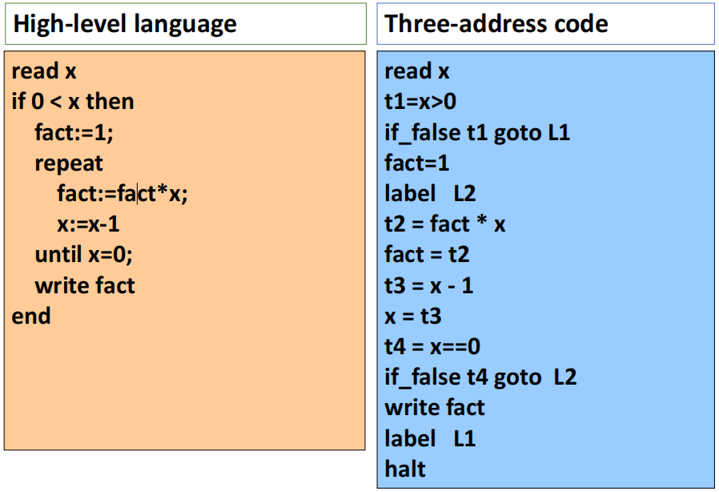
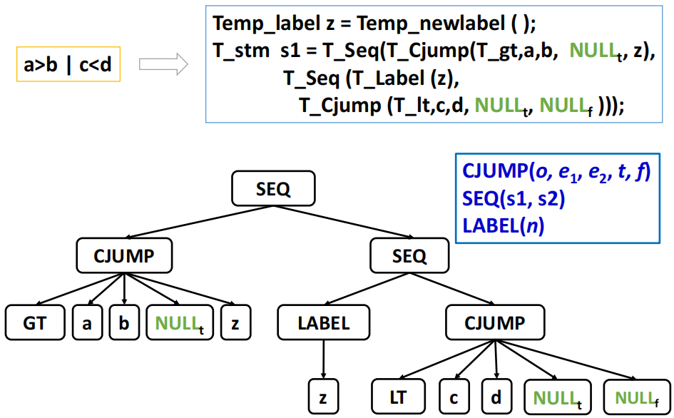
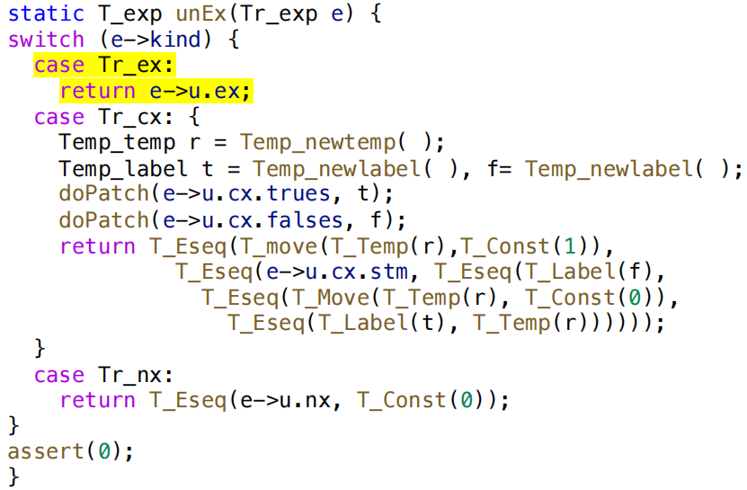
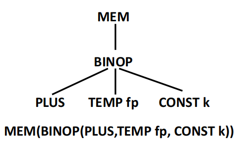
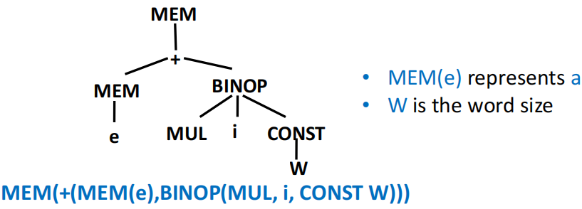
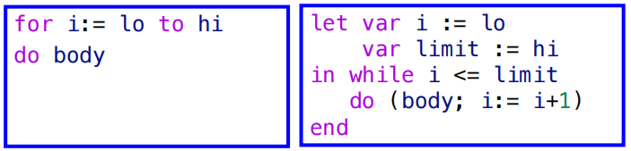

# Intermediate Code Generation

**中间表示（intermediate representation，IR）**是介于源代码和目标代码之间的一种抽象表示形式，通常用于编译器的优化和代码生成阶段。

!!! question "为什么需要中间表示？"
    假如我们直接将 AST 翻译为目标机器码，这会导致两部分的内容高度耦合，编译器的设计和实现会变得非常复杂。

    - 假设有 N 种源语言，M 种目标机器，那么每一种组合都需要单独进行翻译，需要处理 N × M 种情况
    - 而当我们引入中间表示之后，我们只需要将 N 种源语言翻译为中间表示，然后再将中间表示翻译为 M 种目标机器码，这样就只需要处理 N + M 种情况，大大简化了编译器的设计和实现。

    <figure markdown="span">
        {width=75%}
    </figure>

我们可以把 IR 视作一种抽象的机器语言：

- 它可以表达目标机器的各种操作，而无需关注特定机器的细节
- 同样的，IR 也不依赖于源语言的特定特性，因此可以被多种源语言使用
- IR 有多种形式，包括 expression trees、three-address code、static single assignment (SSA) 等等
- 一个编译器中可以使用多级的 IR 来进行不同程度的抽象和优化

显然，IR 的这些特点使得 IR 具有模块化和可移植性的优势

!!! info "front end 和 back end"
    我们可以把编译器的设计分为两部分：

    - **front end**：负责将源代码翻译为 IR 的部分，通常包括词法分析、语法分析、语义分析等
    - **back end**：负责将 IR 翻译为目标机器码的部分，通常包括 IR 优化、把 IR 翻译为机器指令、寄存器分配等

    > 有时候我们也会把 IR 优化和寄存器分配等过程单独划分为一个中间阶段，称为 optimizer 或 middle end，它位于 front end 和 back end 之间。

## Three-Address Code

三地址码（three-address code）是一种常见的 IR 形式，它使用一个简单的指令格式来表示程序的操作。每条三地址码指令通常包含一个操作符和最多三个操作数，例如：

```
x = y op z
```

我们称这些操作数为**地址（address）**，地址可以是源代码中的**变量名**、**常量**、编译器生成的**临时变量**（例如 t1、t2）等

通常而言，我们都可以很轻易地把源语言的表达式改写为三地址指令的序列，例如 `2 * a + (b - 3)` 就可以被翻译为：

```
t1 = 2 * a
t2 = b - 3
t3 = t1 + t2
```

三地址码没有统一的标准格式，其原因在于不同源语言可能具有不同的特性和语义，因此需要不同的指令形式来表达。

!!! example 
    <figure markdown="span">
        {width=75%}
    </figure>

上面这个例子并不复杂，我们可以很轻易地看出源语言代码和三地址码序列之间的对应关系。

三地址码都以一个链表或数组的形式实现，最常见的实现方式是将其作为一个**四元组**实现：第一个字段是操作符，后三个字段分别是三个操作数。对于不需要三个操作数的指令，我们可以把不需要的操作数设置为 null 或者省略掉。

```
t1 = x > 0          ->  (gt, x, 0, t1)
if_false t1 goto L1 ->  (if_f, t1, L1, _)
fact = 1            ->  (asn, 1, fact, _)
label L2            ->  (lab, L2, _, _)
```

其他的实现方式还有三元组（triple）和间接三元组（indirect triple）等等，这些实现方式各有优缺点，编译器设计者可以根据具体的需求选择合适的实现方式。

## Intermediate Representation Tree

一个好的 IR 应当具有以下几个特点：

- 便于在语义分析阶段生成
- 便于被翻译到各种实际的机器语言
- 每个构造都必须具有清晰简洁的含义
    - IR 的优化转换可以方便地指定和实现

IR 的核心思想是每一个独立组件都只做一件简单的事情：取数、存数、做加法、移动（move）、跳转（jump）等等，这些组件可以被组合成更复杂的操作。

翻译只做两件事情：

1. 若干任意的抽象语法 $\to$ 正确的 IR 指令集合
2. IR 指令集合 $\to$ 目标真实机器指令集合

### Expressions (`T_exp`)

表达式（expression）是指计算某个数值的过程，可能伴随着副作用

| 节点 | 含义 |
|------|------|
| `CONST(i)` | 整数常量 i |
| `NAME(n)` | 符号常量 n（汇编标签）|
| `TEMP(t)` | 临时变量 t（即虚拟寄存器）|
| `BINOP(o, e1, e2)` | 对 e1、e2 施加二元操作 o（包括 PLUS, MINUS, MUL, DIV, AND, OR, XOR, LSHIFT, RSHIFT, ARSHIFT） |
| `MEM(e)` | 从地址 e 开始的 wordSize 字节大小的内存内容。作为 MOVE 的左孩子时表示 store，其他所有情况下都表示 fetch |
| `CALL(f, l)` | 函数调用：将函数 f 应用于参数列表 l，从左到右进行求值 |
| `ESEQ(s, e)` | 先执行语句 s（可能会产生副作用），再对表达式 e 求值作为结果 |

### Statements (`T_stm`)

语句（statement）执行副作用和控制流，**没有返回值**

| 节点 | 含义 |
|------|------|
| `MOVE(TEMP t, e)` | 计算 e，把结果移入临时变量 t |
| `MOVE(MEM(e1), e2)` | 计算 e1 得到地址 a，然后计算 e2，将结果存入从 a 开始的大小为 wordSize 的内存里 |
| `EXP(e)` | 计算表达式 e 并丢弃结果 |
| `JUMP(e, labs)` | 跳转到地址 e（可以是 NAME(label) 或经过计算得出的地址） |
| `CJUMP(o, e1, e2, t, f)` | 按顺序计算 e1、e2，用关系运算符 o 比较两个结果。若是 true 则跳转到标签 t 处，若是 false 则跳转到 f 处 |
| `SEQ(s1, s2)` | 先执行语句 s1 ，然后再执行 s2 |
| `LABEL(n)` | 定义符号 n 的常量值为当前机器码地址（NAME(n) 是在使用符号 n，LABEL(n) 是在定义符号 n） |

## Translation into IR Trees

在这一步里，我们的翻译操作是将抽象语法表达式节点 `A_xx` 翻译为 IR 树节点 `T_xx`

### Expressions

表达式（expression）有三种类型，它们在抽象语法树和 IR 树中对应的节点类型如下：

| AST 节点 | IR 表示 | 含义 |
|------|------|---------|
| `Ex` | `T_exp` | 有返回值的表达式 |
| `Nx` | `T_stm` | 无返回值的表达式（如某些过程调用、while） |
| `Cx` | `T_stm` + true/false 跳转标签 | 有布尔值的表达式，可能会产生跳转 |

具体的数据结构实现示例如下：

```c
typedef struct Tr_exp_ *Tr_exp;
struct Cx { patchList trues; patchList falses; T_stm stm; };
struct Tr_exp_ {
    enum { Tr_ex, Tr_nx, Tr_cx } kind;
    union {
        T_exp ex;
        T_stm nx;
        struct Cx cx;
    } u;
};

static Tr_exp Tr_Ex ( T_exp ex);
static Tr_exp Tr_Nx ( T_exp nx);
static Tr_exp Tr_Cx ( patchList trues, patchList falses,T_stm stm);
```

#### Back Patching

<figure markdown="span">
    {width=75%}
</figure>

一个简单布尔表达式 `a < b | c < d` 可以被翻译为如上图所示的 IR 树：

- 我们支持短路求值，因此在 `a < b` 为 true 时直接跳转到 `true` 标签，在 `a < b` 为 false 时则会根据标签 `z` 跳转到 `c < d` 处继续判断
- 由于我们在这个布尔表达式里还不知道具体的 jump 目标地址，因此暂时将这些地址设置为 NULL，等待后续的回填（back patching）阶段来填充这些地址
    - 我们需要两个回填列表：true patch list 和 false patch list
- 我们可以把若干个布尔表达式通过逻辑运算符连接起来
    - `a < b | c < d`：在 `a < b` 的 falses 跳转地址上回填 `c < d` 的 label
    - `a < b & c < d`：在 `a < b` 的 trues 跳转地址上回填 `c < d` 的 label

#### Conversion between Ex, Nx, Cx

有时我们还需要把某种表达式转换为等效的另一种表达式，例如 `flag = (a < b)` 就需要把 `a < b` 这个 Cx 转换为 Ex 来进行赋值操作。

```c
static T_exp unEx(Tr_exp e);     // 任意表达式 -> Ex
static T_stm unNx(Tr_exp e);     // 任意表达式 -> Nx
static struct Cx unCx(Tr_exp e); // 任意表达式 -> Cx
```

以 `unEx(Tr_exp e)` 函数为例，这个函数的作用是把任意的 `Tr_exp` 转换为 `T_exp`：

- 当 `e` 是 `Tr_ex` 时，直接返回 `e->u.ex`
- 当 `e` 是 `Tr_nx` 时，返回一个 ESEQ，其中包含了 `e->u.nx` 这个语句和一个默认值 0 的表达式
- 当 `e` 是 `Tr_cx` 时，返回一个 ESEQ，其中包含了 `e->u.cx.stm` 这个语句和一个默认值 1 的表达式，根据结果是 true 还是 false 的不同，跳转到 `e->u.cx.trues` 或 `e->u.cx.falses` 这两个标签中的一个

<figure markdown="span">
    {width=75%}
</figure>

### Simple Variables

对于一个定义在当前函数的栈帧中的局部变量，我们可以把它翻译为如下所示的 IR 树：

<figure markdown="span">
    {width=65%}
</figure>

- k 是变量在当前帧中的偏移量
- fp 是指向当前帧的指针

回顾上一章的内容，我们知道 Semant 模块不应直接调用 Tree 或 Frame 模块，所有对 IR 树的操作都应该由 Translate 模块来完成：

```c
Tr_Exp Tr_simpleVar (Tr_Access, Tr_Level);
```

Semant 模块会传入变量的 access（通过 `Tr_allocLocal` 函数获取），以及使用这个变量的函数的嵌套深度 level

要翻译变量 v，我们需要知道帧指针以及 word size 的大小，以便于 Translate 模块使用 `F_exp` 函数来将 access 转为 Tree expression。

```c title="frame.h"
Temp_temp F_FP(void);            // frame pointer
extern const int F_wordSize;     // word size of the machine
T_exp F_Exp(F_access acc, T_exp framePtr); // turn an access into a tree expression
```

### Array Variables

不同语言对数组变量的处理不同：

- **Pascal**：数组变量代表数组**内容**。
    - `a := b` 会拷贝整个数组。
- **C**：数组类似于“指针常量”，它本身不能被赋值，但它指向的内容可以被修改。
- **Tiger / Java / ML**：数组变量行为像**指针**。
    - 新的数组值可以通过形如 `intArray[n] of i` 的表达式来构造。
    - 数组之间的赋值实际是指针之间的赋值（修改指针指向的地址），不会修改数组内容。

Tiger 中的 record 也是指针，record 之间的赋值同样是**指针赋值**，而不是**内容赋值**。

### Structured L-Values

- **左值 (L-value)**：**可以**出现在赋值语句的左侧，表示一个可赋值的位置。如 `x`、`y.p`、`a[i+2]`。
- **右值 (R-value)**：**只能**出现在赋值语句的右侧，不表示可赋值位置。如 `a + 3`、`f(x)`。

> 在 C 和 C++ 的课程中我们已经对 L-value 和 R-value 很熟悉了，就不展开解释了。

在 Tiger 中，所有的变量和左值都是标量（scale）

- 数组和 record 变量实际上都是指针，因此也是一种标量

!!! tip
    在 C 或 Pascal 等语言中还存在结构化左值，例如 C 中的结构体和 Pascal 中的数组变量，它们并不是标量。

如果我们还考虑翻译结构化左值，我们就需要对 `T_Mem` 函数进行扩展：

```c
T_exp T_Mem(T_exp, int size);
```

对应的 IR 语法为 `Mem(+(TEMP fp,CONST kn), S)` 其中 `k` 是变量在当前帧中的偏移量，`S` 是变量的大小（对于数组和 record 来说可能大于 word size）。

### Subscripting and Field Selection

- 我们可以通过以下的方式来计算一个数组元素 `a[i]` 的地址：

    ```text
    (i - l) × s + a
    ```

    - `a`：数组元素的基地址
    - `l`：索引范围的下界
    - `s`：每个元素的字节大小

    如果 a 是全局变量的（编译时就拥有一个确定的常量地址），那么 `a - s × l` 就可以在编译时完成计算。

- 我们可以通过 `r + offset(f)` 来计算一个 record 变量的字段 f 的地址，其中 `offset(f)` 是字段 f 在这个 record 中的内部偏移量。

因为数组变量 `a` 是一个左值，因此数组下标表达式 `a[i]` 的结果也是一个左值。要想得到 `a[i]` 的地址，我们需要对 `a` 的地址进行算术运算

在 Tiger 中所有的 record 和数组变量其实都是指向 record 或数组结构的指针，因此需要 MEM 运算符来访问它们的内容

`a[i]` 的 IR 树如下所示：

<figure markdown="span">
    {width=65%}
</figure>

从技术上来讲，一个左值应当被表示为一个地址（就是上图中去掉 MEM 节点之后的部分），当我们需要访问这个左值的内容时才会使用 MEM 运算符来访问这个地址上的内容。

### Arithmetic

在 Tiger 语言里

- 每一个整数算术运算都对应于一个 Tree 的 BINOP 操作符节点
- **没有一元运算符**：一元取反操作用 `n = 0 - n` 来实现，取补码通过和全 1 的异或来实现
- **没有浮点数**：浮点数的取反不能直接用 `0 - f` 来实现（许多浮点数表示方法都支持负零），但好在 Tiger 语言里没有浮点数

### Conditionals

对比较运算符的翻译结果是一个 Cx 表达式，这个表达式包含了一个 T_stm 语句和两个回填列表（true 和 false）

```c
stm = CJUMP(LT, x, CONST(5), NULLt, NULLf)
trues = {t}
falses = {f}
```

当我们遇到形如 `if e1 then e2 else e3` 的 if 表达式时，可以通过比较直观的方式来翻译它：

- e1 是一个 Cx 表达式，需要对它应用 `unCx` 函数
- e2 和 e3 都是 Ex 表达式，需要对它们应用 `unEx` 函数
- 设置一个临时变量 `r` 来存储 if 表达式的结果，根据 e1 的真假来决定 `r` 的值是 `e2` 还是 `e3`

```
nCx(e1)
LABEL t
r = unEx(e2)
JUMP join
LABEL f
r = unEx(e3)
JUMP join
...
LABEL join
TEMP r
```

!!! tip
    我们也可以通过更优化的方式来翻译 if 表达式：

    - 如果 e2 和 e3 都是 statement（没有返回值），继续使用 unEx 来翻译它们也可以，但是更好的办法或许是针对这种情况做特殊处理
    - 如果 e2 或 e3 为 Cx 表达式，直接用 `unEx` 来翻译会生成一大堆混乱的跳转和标签，应当对这种情况做特殊处理

### While Loops

while 循环的大致结构如下：

```
test:
    if not(condition) goto done
    body    // break -> jump done
    goto test
done:
```

- 当出现 break 语句时，我们需要在循环体内把它翻译为 `goto done`。
- 为了知道 done label 在哪里，我们就需要在翻译 while 循环时把 done 标签传递给循环体的翻译函数 `transExp`，从而跳转到最近的一个外层循环的 done 标签。

### For Loops

对 for 循环的最简单处理方法是先把它重写为一个 while 循环，然后再按照 while 循环的方式来翻译它：

<figure markdown="span">
    {width=65%}
</figure>

但是这里还有一个小问题：当 `limit = maxint` 时，`i + 1` 出现整型溢出，`i <= limit` 这个条件永远为 true，因此这时我们不应该把 goto done 的条件设置为 `i > limit`（即 `!(i <= limit)`），而应该设置为 `i >= limit`：

```
if lo > hi goto done
i := lo
limit := hi
test:
    body
    if i >= limit goto done
    i := i + 1
    goto test
done:
```

### Function Call

翻译函数调用 `f(a1, ..., an)` 很简单，只需添加**静态链接**作为隐式的额外参数即可

```
CALL(NAME(f), [static_link, unEx(a1), ..., unEx(an)])
```

- f 是函数的标签
- static_link 是一个指向当前函数的静态父函数的帧指针

## Translation of Declarations

### Declarations

在 Tiger 里进行声明会调用 `transDec` 函数，对帧数据结构进行修改：

- 函数体中的每个变量声明都会在帧中预留额外的空间（位于 FP + offset 处）
- 每个函数声明都会为这个函数的 body 保留一段内存空间来存放相应的代码

### Variable Declarations

`transDec` 函数会更新值环境和类型环境，

- 变量初始化会被翻译为**赋值表达式**，这些赋值表达式对应的 tree expression 必须位于 let 语句的 body 部分之前
    - let 语句的形式为 `let ... in ... end`，其中 `...` 部分分别是变量声明和函数声明，以及 let 语句的 body
- 如果我们把 `transDec` 函数应用于函数和类型声明上，返回值应当是一个“无效”的表达式（例如 `EXP(CONST(0))`）

### Function Declarations

函数会被翻译为一个“汇编语言片段”，包含**前言（prologue）**、**函数体**和**后记（epilogue）**三个部分：

- prologue：
    1. 标记函数开始的伪指令（这是特定汇编语言所需的）
    2. 函数名的 label 定义
    3. 调整栈指针的指令（分配新 frame）
    4. 将逃逸参数（包括静态链接）存入 frame，将非逃逸参数移入新的临时寄存器
    5. 保存所有 callee-save 寄存器（包括返回地址寄存器）的 store 指令
- body：函数体的 IR 树
    6. 翻译后的表达式
- epilogue：
    7. 将返回值移至相应寄存器的指令
    8. 恢复 callee-save 寄存器的 load 指令）
    9. 重置栈指针的指令（用于释放 frame）
    10. 返回指令（这是特定汇编语言所需的）
    11. 根据汇编语言的需要，标记函数结束的伪指令

### Fragment

Translate 阶段会为每个函数都产生一个 **fragment**，包含：

- frame：frame 描述符，包含关于局部变量和参数的机器特定信息
- body：函数 `procEntryExit1` 返回的结果


