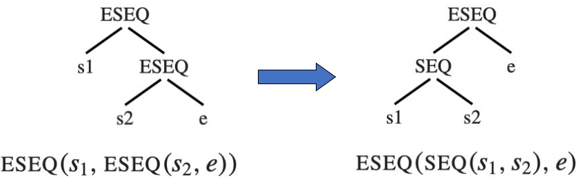
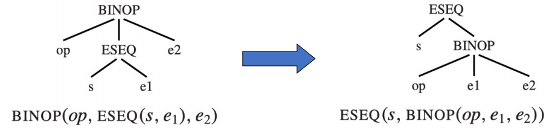
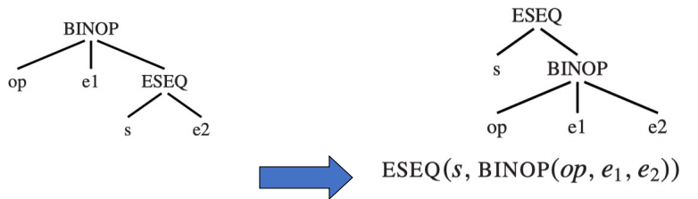
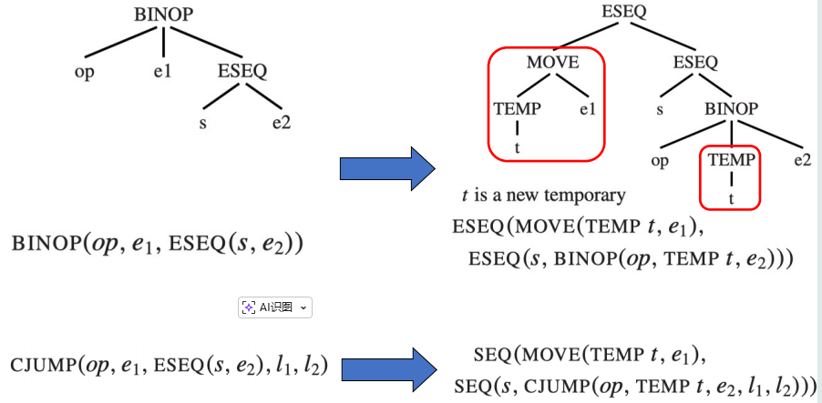
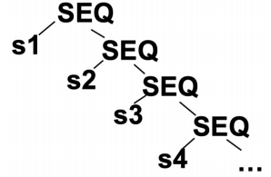
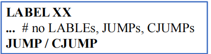
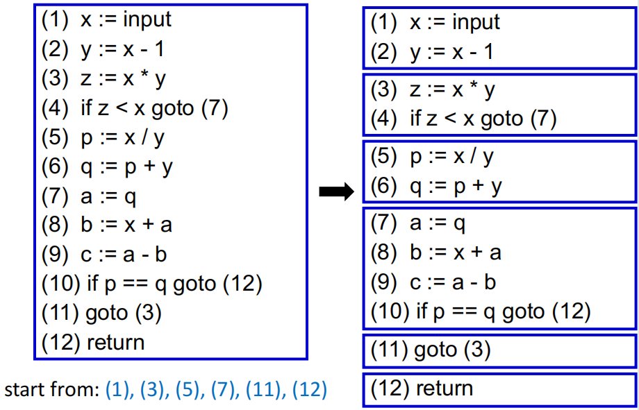
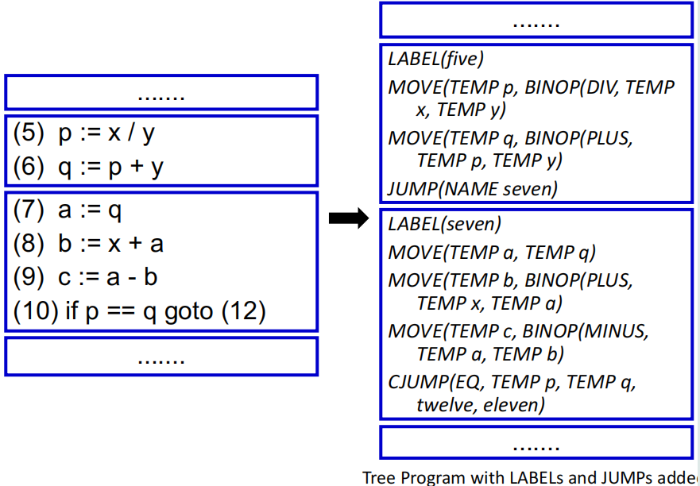
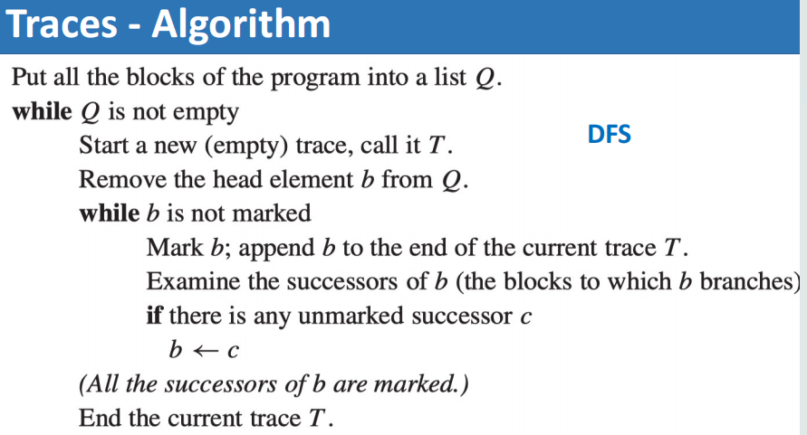
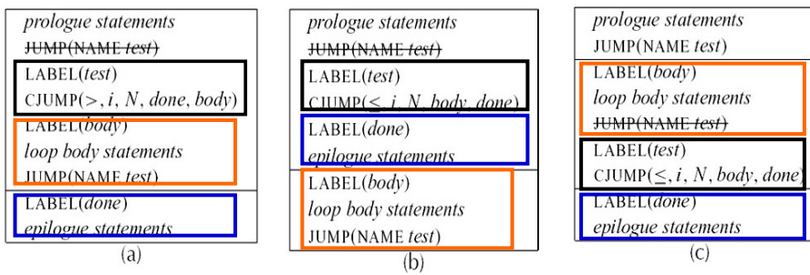

# Basic Blocks and Traces

在 chap7 中我们已经将抽象语法转换为了 IR tree，但 Tree 语言还必须转换为汇编代码或机器代码才能够被真正执行。Tree 语言由于经过了一定的抽象，无法精确地和机器指令一一对应，而且 Tree 语言的某些特性还可能会影响编译优化的效果：

- **CJUMP 指令有两个跳转 label**：
    - 在 IR 树中 CJUMP 指令的结构为 `CJUMP(relop, e1, e2, true, false)`，其中 `true` 和 `false` 分别是两个跳转 label。
    - 大多数机器指令只支持一个跳转 label，不符合跳转条件时会顺序执行（fall through）下一条指令。
- **ESEQ 节点导致指令顺序不可修改**：
    - ESEQ 节点的结构为 `ESEQ(stm, exp)`，其中语句 `stm` 的副作用可能会影响 `exp` 的计算结果，因此对子树进行不同顺序的求值，可能会改变程序的行为。
    - 但只有当子表达式可以按任意顺序求值时，寄存器分配、指令调度等编译优化方法才能发挥作用。
- **表达式中的 CALL 节点会导致问题**
    - CALL 节点中使用的参数可能也依赖于其他子表达式产生的副作用，会导致和上一条相同的问题
- **CALL 节点出现在另一个 CALL 节点的参数中**
    - 对于 `CALL(f, [e1, CALL(g, [e2, …])])` 这种情况，内层 CALL 在修改形参寄存器时可能会破坏外层 CALL 的参数值。

为了解决上述的这些问题，我们需要对 IR 树进行三个阶段的转换：

1. 将 IR tree 重写为一系列规范树（canonical tree），
2. 将这些规范树划分为一组基本块（basic block），每个基本块是一个内部不包含跳转指令或 label 的指令序列，满足以下条件：
    - 只有第一个指令可以是 LABEL 指令
    - 只有最后一个指令可以是 JUMP 或 CJUMP 指令
    - 其他指令都不能是 LABEL、JUMP 或 CJUMP 指令
3. 将上述的基本块按一定次序排列（基本块之间的顺序不影响程序的语义），形成一个或多个 trace
    - 每个 trace 是一个基本块序列，其中每个基本块末尾的 CJUMP 的 false label 都是下一个基本块的 LABEL。
    - 从而实现消除 CJUMP 指令中的 false label，使得每个 CJUMP 指令都只需要一个跳转 label，与实际机器指令的结构相匹配。

## Canonical Trees

!!! definition "规范树（Canonical Tree）"
    规范树是指满足以下性质的 IR 树中结构

    - 不包含 SEQ 和 ESEQ 节点
    - 每一个 CALL 节点的父节点只能是 `EXP(...)` 或 `MOVE(TEMP t, ...)` 形式的语句

- 性质 1 确保每棵规范树最多包含一个语句节点（即根节点）其余节点都是非 ESEQ 的表达式节点。
- 性质 2 让 CALL 节点的子节点不可能是另一个 CALL 节点
- 性质 1 和 2 共同保证了 CALL 的父节点必须是规范树的根节点，同时也最多存在一个 CALL 节点（因为 `EXP(...)` 和 `MOVE(TEMP t, ...)` 都最多只能接受一个 CALL 节点作为子节点）。

为了将 IR 树转换为规范树，我们需要依次进行以下三个步骤：

1. **消除 ESEQ 节点**
2. **将 CALL 节点提到顶层**
3. **消除 SEQ 节点**

### Eliminate ESEQs

消除节点 `ESEQ(s, e)` 的核心思路是把 ESEQ 节点在树结构中的位置不断向上提升，直到它们能够变为 SEQ 节点为止

#### ESEQ 在左子树

!!! example 
    <figure markdown="span">
        {width=75%}
    </figure>

    在这个例子里，我们把右侧的 ESEQ 节点提升上来之后，左侧的这个 ESEQ 节点就变成了 SEQ 节点（因为两个子树都是 statement），同时也保证了执行顺序仍是是 s1 -> s2 -> e，没有改变程序的语义。

!!! example 
    <figure markdown="span">
        {width=75%}
    </figure>

    从这个例子里我们可以看出，当一些常见的语句里出现 ESEQ 节点时，我们可以通过一些简单的变换来把 ESEQ 节点提升到更高层

我们可以做一个简单的总结：

```
ESEQ(s1, ESEQ(s2, e))              ->  ESEQ(SEQ(s1, s2), e)
BINOP(op, ESEQ(s, e1), e2)         ->  ESEQ(s, BINOP(op, e1, e2))
MEM(ESEQ(s, e1))                   ->  ESEQ(s, MEM(e1))
JUMP(ESEQ(s, e1))                  ->  SEQ(s, JUMP(e1))
CJUMP(op, ESEQ(s, e1), e2, l1, l2) ->  SEQ(s, CJUMP(op, e1, e2, l1, l2))
```

上面的情况都有一个隐含的条件：当 ESEQ 出现在左子树时，我们对树结构的修改不会影响程序的实际语义。

#### ESEQ 出现在右子树

但是当 ESEQ 出现在 BINOP 或 CJUMP 的右子树时，就可能出现问题，例如下面的情况：

<figure markdown="span">
    {width=75%}
</figure>

照搬我们上面总结的规则后，我们会发现 e1 和 s 的求值顺序发生了改变，可能会导致程序的行为发生改变。例如 `s = MOVE(MEM(x), y)`、`e1 = MEM(x)` 会使用同一个内存地址时，重写前后 e1 读取到的值就不一样了。

解决这种 **s 和 e1 不可交换**的情况的办法是先把 e1 的值保存到一个临时寄存器 t 中，然后在重写后把 t 作为 BINOP 或 CJUMP 的子树：

<figure markdown="span">
    {width=75%}
</figure>

当 e1 本身不依赖于 s 的副作用，即 **s 和 e1 可交换**时，我们就可以省略掉这个临时寄存器：

```
BINOP(op, e1, ESEQ(s, e2))         ->  ESEQ(s, BINOP(op, e1, e2))
CJUMP(op, e1, ESEQ(s, e2), l1, l2) ->  SEQ(s, CJUMP(op, e1, e2, l1, l2))
```

但是两段代码是否可交换一般而言是不可判定的：编译器在看到 `s = MOVE(MEM(x), y)`、`e1 = MEM(x)` 时并不能确定它们是否会访问同一个内存地址。Tiger 编译器会使用一个非常简单的 commute 函数来判断两段代码是否可交换：

- 常数可以和任何语句交换
- 空语句可以和任何语句交换
- 其余所有情况都认为不可交换

```c
static bool isNop(T_stm x) { 
    return x->kind == T_EXP && x->u.EXP->kind == T_CONST;
}
static bool commute(T_stm x, T_exp y){
    return isNop(x) || y->kind == T_NAME || y->kind == T_CONST;
}
```

#### General Rewriting Rules

对于每一种 Tree statement 或 expression，我们都可以总结出类似的重写规则来消除 ESEQ 节点：

- **subexpression-extraction**：从所有的子表达式中把 "statement" 提取出来，然后把这些子表达式变成 ESEQ-clean 的版本
- **subexpression-insertion**：用 clean 版本的子表达式构建原节点，然后用 SEQ 或 ESEQ 把之前提取出来的 statement 插入到新节点的前面

例如对子表达式列表 `[e1, e2, ESERQ(s, e2)]` 我们有三种处理方式：

|情形|重写方式|
|---|---|
| s 和 e1、e2 都可交换 |  `(s; [e1, e2, e3])` |
| e2 和 s 不可交换 |  `(SEQ(MOVE(t1, e1), SEQ(MOVE(t2, e2), s)); [TEMP(t1), TEMP(t2), e3])` |
| e2 可以和 s 交换但 e1 不可交换 | `(SEQ(MOVE(t1, e1), s); [TEMP(t1), e2, e3])` |

### Move CALLs to Top Level

我们构造 IR 树的 Tree 语言允许将 CALL 作为子表达式，但是由于每个函数都会将其结果保存在同一个返回值寄存器 `TEMP(RV)` 中，这会导致当一个表达式里出现两个 CALL 时，第二个 CALL 就会把第一个 CALL 的返回值覆盖掉。

解决的思路是每一个 CALL 结束后就将返回值保存到一个临时寄存器里去：

```
CALL(f, args)  ->  ESEQ(MOVE(TEMP t, CALL(f, args)), TEMP t)
``` 

再结合我们在上一步做到的消除 ESEQ 的结果，最后 CALL 的父节点就只可能是两种情况：

- `EXP(CALL(...))`：函数的返回值被直接丢弃
- `MOVE(TMEP t, CALL(...))`：函数的返回值被保存在临时变量 t 里

### Eliminate SEQs

完成前两个步骤之后，所有的 ESEQ 都被消除了，CALL 节点也都被提升到了顶层，此时的 IR 树就长成这样：

```
SEQ(SEQ(SEQ(..., sx), sy), sz)
```

我们可以对这棵 IR 树重复运用规则 `SEQ(SEQ(s1, s2), s3) -> SEQ(s1, SEQ(s2, s3))` 来把所有的 SEQ 节点都移到右子树：

```
SEQ(s1, SEQ(s2, ..., SEQ(s_{n-1}, s_n)...))
```

<figure markdown="span">
    {width=55%}
</figure>

这时候的 SEQ 节点就把各语句连接成了一个**线性语句列表**，每个 si 内部都不含有 SEQ 或 ESEQ 节点了。

!!! summary
    我们可以总结出将 IR 树转换为规范树的一些规则：

    | 原形式 | 重写结果 |
    | --- | --- |
    | `ESEQ(s1, ESEQ(s2, e))` | `ESEQ(SEQ(s1, s2), e)` |
    | `BINOP(op, ESEQ(s, e1), e2)` | `ESEQ(s, BINOP(op, e1, e2))` |
    | `MEM(ESEQ(s, e1))` | `ESEQ(s, MEM(e1))` |
    | `JUMP(ESEQ(s, e1))` | `SEQ(s, JUMP(e1))` |
    | `CJUMP(op, ESEQ(s, e1), e2, l1, l2)` | `SEQ(s, CJUMP(op, e1, e2, l1, l2))` |
    | `BINOP(op, e1, ESEQ(s, e2))` | `ESEQ(MOVE(TEMP t, e1), ESEQ(s, BINOP(op, TEMP t, e2)))` |
    | `CJUMP(op, e1, ESEQ(s, e2), l1, l2)` | `SEQ(MOVE(TEMP t, e1), SEQ(s, CJUMP(op, TEMP t, e2, l1, l2)))` |
    | `MOVE(ESEQ(s, e1), e2)` | `SEQ(s, MOVE(e1, e2))` |
    | `CALL(f, a)` | `ESEQ(MOVE(TEMP t, CALL(f, a)), TEMP t)` |


## Basic Blocks

在上一步中，我们做到了把程序的语句平铺为线性化的形式，但这些语句之间的控制流关系还没有被明确地表达出来。

当我们分析控制流（control flow）时，我们只关心跳转指令，其余所有指令都不重要。常见的方法是将连续的非跳转指令划分为一个**基本块（basic block）**，每个基本块内部都是按顺序执行的，基本块之间的控制流关系由跳转指令来表达。

!!! definition "基本块（Basic Block）"
    基本块是指满足以下条件的语句序列：

    - 只有第一个语句可以是 LABEL 指令
    - 只有最后一个语句可以是 JUMP 或 CJUMP 指令
    - 其他语句都不能是 LABEL、JUMP 或 CJUMP 指令

    <figure markdown="span">
        {width=55%}
    </figure>

把长长的程序语句列表转换为若干基本块的算法如下：

!!! Algorithm
    1. 把整个语句序列从头到尾扫描
    2. 遇到一个 LABEL 时，开始一个新的基本块（前一个基本块结束）
    3. 遇到 JUMP / CJUMP 时，结束当前基本块（下一条语句开始新一个基本块）
    4. 划分结束后，如果有基本块的末尾不是 JUMP 或 CJUMP，则在末尾添加一个跳转到下一个基本块的 JUMP 指令
    5. 如果一个基本块的第一个语句不是 LABEL，则在前面添加一个新的 LABEL

!!! example
    考虑下面的程序：

    ```
    (1)  x := input
    (2)  y := x - 1
    (3)  z := x * y
    (4)  if z < x goto (7)
    (5)  p := x / y
    (6)  q := p + y
    (7)  a := q
    (8)  b := x + a
    (9)  c := a - b
    (10) if p == q goto (12)
    (11) goto (3)
    (12) return
    ```

    我们首先要对程序进行基本块划分：

    - (3)、(7)、(12) 是某些跳转指令的目标，应当在前一行添加 LABEL，并且在此处开始一个新块
    - (4) 和 (10) 是跳转指令，应当在此处结束当前块，并且在下一行开始一个新块

    于是我们就得到了下面的基本块划分：

    <figure markdown="span">
        {width=75%}
    </figure>

    上述的基本块划分操作结束之后，其实我们还需要把这段源语言程序转换为相应的 Tree language：

    <figure markdown="span">
        {width=75%}
    </figure> 

## Traces

### Motivation

划分出基本块之后，我们可以把基本块任意排列而不影响程序的执行结果，但我们希望通过某种方式来确定基本块的排列顺序，以便于生成更高效的代码。

从这个角度出发，我们可以做到下面两件事情：

- 让基本块的末尾的 CJUMP 指令的 false label 都指向下一个基本块的 LABEL
- 让基本块末尾的 JUMP 指令的目标基本块紧跟在当前基本块的后面，这样一来就可以直接把这个 JUMP 指令优化掉

!!! definition "Trace"
    Trace 是指在程序执行过程中可连续执行的一系列语句，其中可以包含条件分支语句。

    - 一个程序中可以包含许多个相互重叠的 trace

我们在排列 CJUMP 指令和 false label 时的目标是：

- 生成一组可以完全覆盖整个程序的 trace
- 每个 block 都必须恰好属于一个 trace
- 每个 trace 都不包含循环结构

自然的，我们希望尽可能地减少 trace 的数量，进而减少从一条 trace 跳转到另一条 trace 的次数。

### Algorithm

我们需要寻找一组能覆盖整个程序的 trace，思路是一个 DFS 算法：从一条 trace 的起始块出发，沿着一条可能的执行路线探索，这样走出来的一条路线就是一条 trace，直到走到一个已经被访问过的块或者一个循环结构为止，然后再从另一个未访问过的块出发继续探索，直到所有块都被访问过为止。

<figure markdown="span">
    {width=75%}
</figure>

### Finishing Up

为了化简后续阶段的实现，Tiger 编译器会将有序排列的 trace 整合为一个长语句列表，并且进行如下的一些调整：

- 若 CJUMP 后紧跟着它的 false label
    - 不需要进行任何调整
- 若 CJUMP 后紧跟着它的 true label
    - 交换 CJUMP 的 true label 和 false label，并且把它的 condition 取反
- 若 CJUMP 后跟着其他的 label
    - 引入一个新的 false label `lf'`
    - 将单个 CJUMP 语句替换为如下的三条语句：

    ```
    CJUMP(cond, a, b, lt, lf') 
    LABEL lf'
    JUMP(NAME lf )
    ```

### Optimal Traces

不同的 trace 划分结果会得到不同的 JUMP / CJUMP 数量，这也会对后续其他类型的优化产生影响（例如寄存器分配和指令调度），因此我们希望能够得到一个最优的 trace 划分结果。

<figure markdown="span">
    {width=75%}
</figure>

上图中的 while 循环有三种排布方式：

- **(a)** trace 的结构为 `test -> body -> done`，每一个 while 循环都包含一条 CJUMP 和一条 JUMP
- **(b)** 将 body 和 test 交换位置，trace 的结构为 `body -> test -> done`，每一个 while 循环仍包含一条 CJUMP 和一条 JUMP
- **(c)** trace 的结构为 `body -> test -> done`，消去了一条 JUMP，每一个 while 循环只包含一条 CJUMP

我们可以知道，如 (c) 所示的 trace 划分结果能让程序更加“顺序地”执行，这也利于后续的进一步优化
