# Instruction Selection

在上一个 chapter 中，我们对 IR 树进行了规范化和重排，方便我们进行后续的优化和代码生成。本章介绍的 Instruction Selection 的主要任务时把 IR 树翻译成**伪汇编代码**（pseudo-assembly code），后续进行寄存器分配等操作时再把其中的伪寄存器替换成真实物理寄存器。

## Tree Patterns and Tile

IR 树中的每一个节点都只表达一种操作（fetch、store、add、mul 等），但真实的汇编指令往往包含多个操作（例如 x86 中的 `add` 指令可以同时进行 fetch 和 store）。每一条机器指令都可以被表示为一个 IR 树的片段，被称之为**树模式（tree pattern）**。

**Instruction Selection** 的任务就是用尽可能少的树模式去不重叠地覆盖（tiling）整棵 IR 树。

为了便于说明指令选择的算法，教材提出了一个简化的 RISC 指令集——**Jouette**，它的主要指令如下图所示：

<figure markdown="span">
    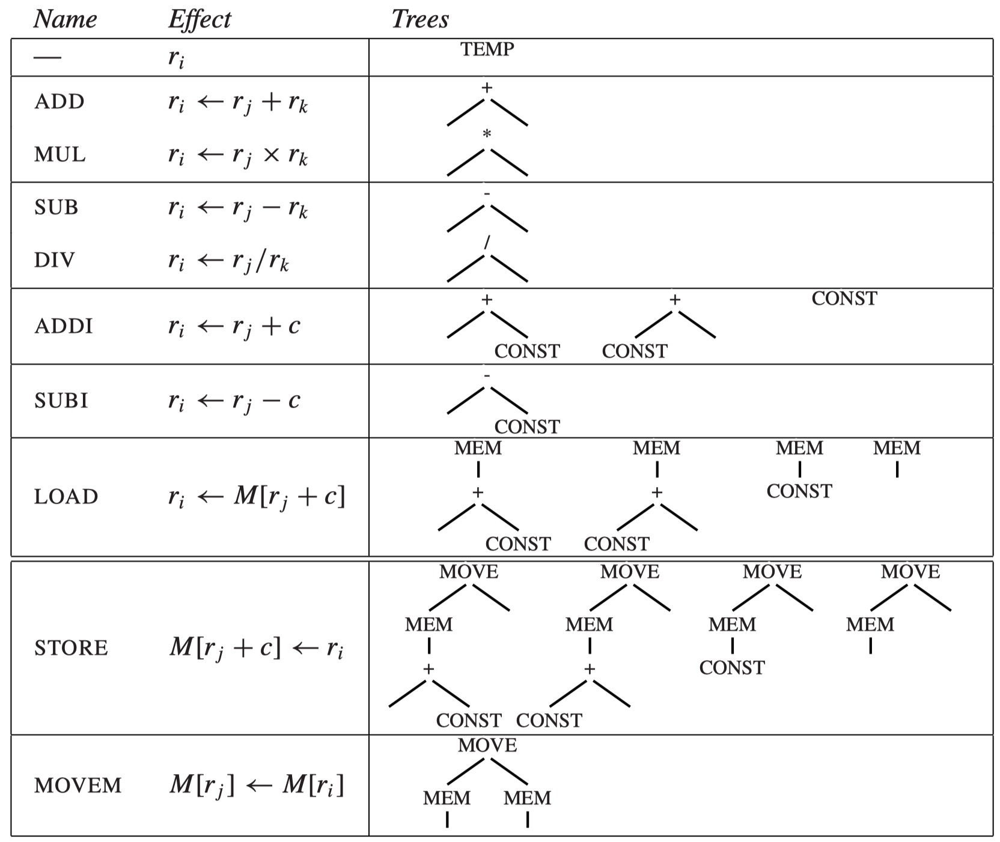{width=75%}
</figure>

- 图中左侧是指令名称以及作用效果，右侧是该指令对应的 tree pattern
    - 某些指令可能对应多个 tree pattern，这来自于交换操作数或使用 r0 寄存器的特殊情况（例如 `LOAD ri <- M[r0 + c]` 只需要 CONST 节点而不需要做加法
- 寄存器 r0 的值恒为 0，许多涉及到使用常数 0 的操作都会使用到它

!!! example
    考虑数组元素赋值操作 `a[i] := x`，它的 IR 树如下所示：

    <figure markdown="span">
        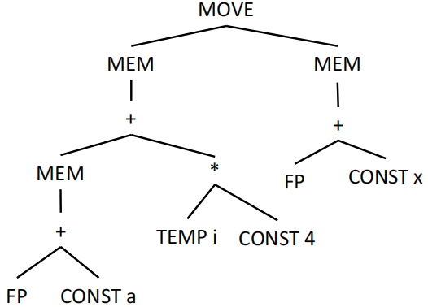{width=75%}
    </figure>

    这棵 IR 树有多种覆盖方式，以下是比较典型的两种：

    <figure markdown="span">
        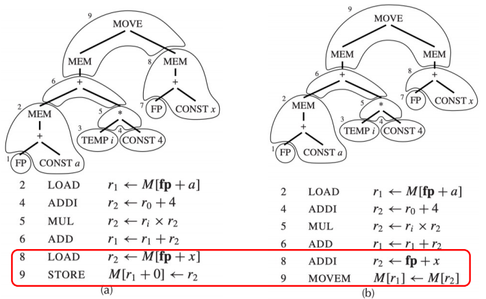{width=75%}
    </figure>

    - **(a)** 使用了 6 个 tile（包括一个 STORE），生成了 6 条指令
    - **(b)** 使用了 5 个 tile + 一个 MOVEM 操作，生成了 5+m 条指令（假设 MOVEM 操作的指令数为 m）

    如果我们认为每条指令的 cost 都是 1，那么方案 (a) 的总 cost 是 6，而方案 (b) 的总 cost 是 5+m。选择哪一种方案取决于 m 的值。

    我们总是可以做到使用很多个只能覆盖一个节点的“小 tile” 来覆盖整棵树，这样做的代价总是最大的，这就提供了一个 cost 的上界。

    <figure markdown="span">
        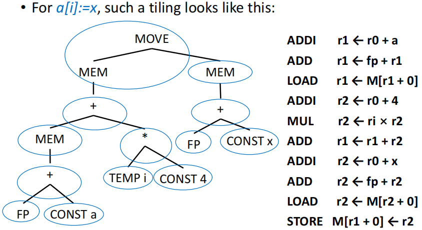{width=75%}
    </figure>

### Optimal and Optimum Tilings

- **Optimum tiling**：最优覆盖，所有合法覆盖中总 cost 最小的覆盖
    - 全局最优的覆盖，可能存在不止唯一一个解
- **Optimal tiling**：最佳覆盖，不存在两个相邻 tile 能够合并为一个 cost 更低的 tile 的覆盖
    - 局部最优的覆盖
    - 如果一个 tree pattern 的 cost 大于等于它的子树模式的 cost 之和，那么它就不可能出现在 optimal tiling 中，应当被拆分

**每一个 optimum tiling 都是一个 optimal tiling，但反过来不一定成立**

<figure markdown="span">
    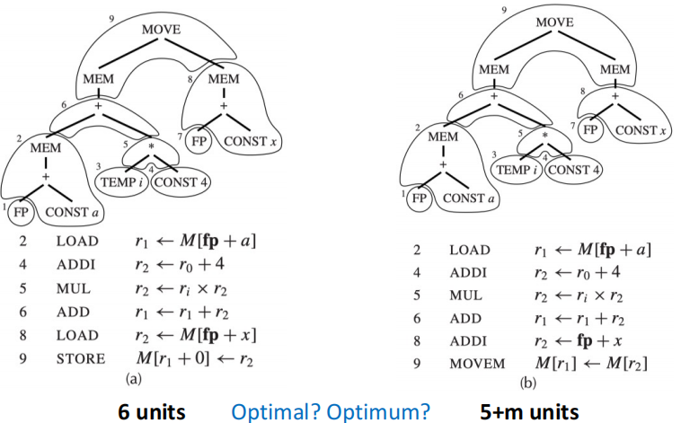{width=75%}
</figure>

回顾我们刚刚的例子，左侧的代价为 6，右侧的代价为 5+m。

- 若 m > 1，那么左侧是 optimum；若 m < 1，那么右侧是 optimum；若 m = 1，那么两者都是 optimum
- 无论 m 的值如何，两边的方案都是 optimal，因为任意两个相邻的 tile 都不能合并为一个总 cost 更低的 tile

## Algorithms for Instruction Selection

### Maximal Munch

**Maximal Munch** 是一种能够求出 optimal tiling 的贪心算法，主要思路为：

1. 从根节点开始**自顶向下**遍历 IR 树
2. 每一次都使用可匹配 tile 中最大的那一个去覆盖当前节点
3. 对 tile 的每个 leaf 所连接的子树继续重复上述操作

<figure markdown="span">
    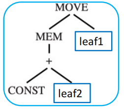{width=75%}
</figure>

我们使用节点数量来评估 tile 的“大小”：每次选择能够覆盖最多节点的 tile 来覆盖当前节点。

maximal munch 具有以下特点：

- 生成指令的顺序与指令的执行顺序相反：根节点会先被匹配到某条指令上，但它依赖于子树对应指令的结果，因此必须最后执行
- 如果在根结点处有两个相同大小的 tile 都能匹配，那么选择两者中的哪一个都没有区别

!!! example
    对指令 `a[i] := x` 的 IR 树进行 maximal munch，首先会匹配到 `STORE` 的 tree pattern，然后再对剩余的没被覆盖的节点递归地使用 maximal munch，最终得到的覆盖方案如下所示：

    <figure markdown="span">
        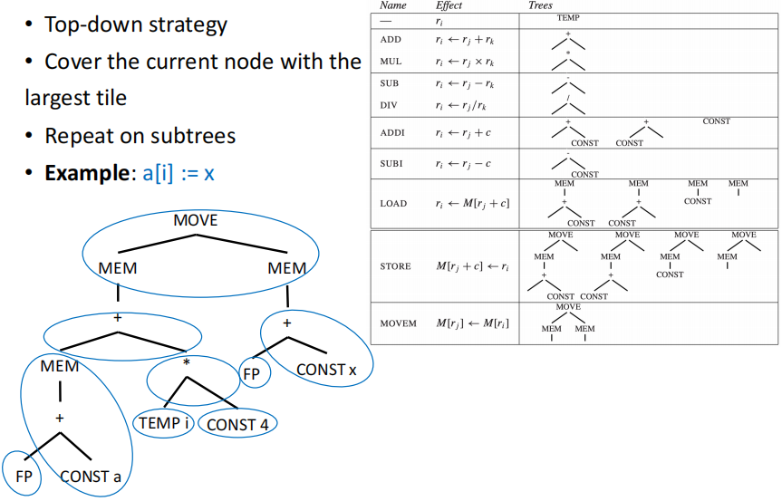{width=85%}
    </figure>

### Dynamic Programming

Maximal munch 算法的不足之处在于它只能求出 optimal tiling，而不能保证求出 optimum tiling。如果我们改为使用动态规划（dynamic programming）的方法，就可以求出 optimum tiling。

DP 算法的思路是自底向上的：

1. 首先递归计算所有子节点的最小代价，将节点 x 的代价记为 $f(x)$
2. 对当前节点 n，找到所有能匹配 n 的 tile
3. 对于所有匹配 n 的 tile $t$，它的 leaves 所连接的子树 $l$ 的代价 $f(l)$ 已经在前面计算好了，因此 tile $t$ 的总代价为 $c_t + \sum_{l \in leaves(t)} f(l)$，其中 $c_t$ 是 tile t 本身的 cost
4. 每一步都选择总代价最小的 tile 来覆盖当前节点 n，即
    $$ f(n) = \min_{t \in T_n} \{ c_t + \sum_{l \in leaves(t)} f(l) \} $$
    
    其中 $T_n$ 是所有能够匹配节点 n 的 tile 的集合

这样的 DP 算法基于子问题的最优解来构建全局最优解，因此能够保证求出 optimum tiling。

#### Cost Annotation

!!! example
    考虑一个很简单的式子：`MEM(+(CONST 1, CONST 2))`

    <figure markdown="span">
        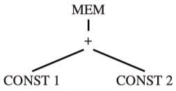{width=75%}
    </figure>

    我们使用记号 `(cost, #pattern)` 来表示某节点的最小代价及其选用的 pattern 的编号，我们可以从叶子节点开始分析：

    - `CONST 1`：只有 ADDI 这个 pattern 能匹配，代价为 1，对应编号为 8，因此 `(1, 8)`
    - `CONST 2`：同理，也是 `(1, 8)`
    - `+` 节点：能有多个 pattern 匹配
        - `+(e1, e2)`：本身的 cost 为 1，两个子树的 cost 都是 1，总 cost 为 3，pattern 编号为 2
        - `+(CONST, e1)`：本身的 cost 为 1，子树的总 cost 是 1，总 cost 为 2，pattern 编号为 6
        - `+(e1, CONST)`：同上，总 cost 也是 2，pattern 编号为 7
        - 因此最小代价为 2，结果为 `(2, 6)` 或者 `(2, 7)`
    - `MEM` 节点：同样有多个 pattern 匹配
        - `MEM(e1)`：本身的 cost 为 1，子树的 cost 是 2，总 cost 为 3，pattern 编号为 13
        - `MEM(+(e1, CONST))`：本身的 cost 为 1，子树的 cost 是 1，总 cost 为 2，pattern 编号为 10
        - `MEM(+(CONST, e1))`：同上，总 cost 为 2，pattern 编号为 11
        - 因此最小代价为 3，结果为 `(2, 10)` 或者 `(2, 11)`

    最终计算完毕后，IR 树的图被标记成了如下的样子：

    <figure markdown="span">
        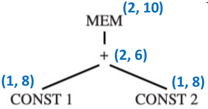{width=65%}
    </figure>

#### Instruction Emission

确定了根节点的代价之后，我们就开始做 instruction emission。

对于节点 n：

- 对于 n 所选定 tile 的每一个叶子 $l_i$，执行 $Emission(l_i)$ 来生成对应的指令
- 最后生成 n 所选定 tile 对应的指令

!!! tip
    Emission 的过程并不会递归到节点 n 的每一个 children 上，而是只会递归到 n 所选定 tile 的每一个 leaf 上。
    
    例如上面那个例子中，我们为 `MEM` 节点选定的 tile 是 `MEM(+(e1, CONST))`，因此我们只会递归地对 `e1` 进行 instruction emission，而不会对 `+` 和另一个 `CONST` 进行 instruction emission，因为它们不是 leaf。

    <figure markdown="span">
        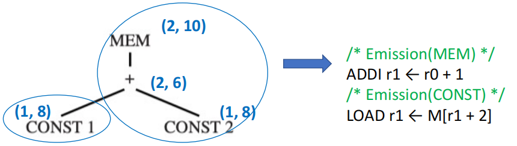{width=75%}
    </figure>

!!! note "Tiling 算法的复杂度"
    假设以下数据：

    - $N$：IR 树中节点的总数量
    - $K$：平均每个 tile 中的非叶子节点数量
    - $K'$：在给定子树的根节点上，为了需要判断哪些 tile 能匹配，需要检查的最大节点数量
    - $T'$：平均每个节点能够匹配的 tile 的数量

    **Maximal Munch**：贪心的、自顶向下的算法，每次选择一个 tile 覆盖当前节点后，跳转到该 tile 的 leaves 上继续递归。由于平均一个 tile 覆盖 $K$ 个节点，因此需要选择大约 $\dfrac{N}{K}$ 个 tile，

    每次选择一个 tile 需要检查 $K'$ 个节点来判断哪些 tile 能匹配，并且需要从 $T'$ 个 tile 中选择一个，因此每次选择的成本约为 $K' + T'$，总的复杂度正比与 
    $$ \dfrac{N}{K} \cdot (K' + T') $$。

    **Dynamic Programming**：自底向上的算法，需要对每个节点进行一次 DP 计算，每次 DP 计算需要检查 $K'$ 个节点来判断哪些 tile 能匹配，并且需要从 $T'$ 个 tile 中选择一个，因此总的复杂度正比于
    $$ N \cdot (K' + T') $$。

### Tree Grammar

> 本节内容只需大致了解即可

对于有更复杂指令集、多种寄存器类型及寻址模式的机器，可能会有更多和更复杂的 tree pattern，手动实现覆盖算法就很困难且容易出错。此时就需要使用**树文法（tree grammar）**来描述指令集的 tree pattern，将指令选择问题转化为文法解析问题。具体来说，需要应用动态规划算法的推广版本进行解析。

假设一个更复杂版本的 Jouette 机器支持两类寄存器：

- **a 寄存器**：用于地址计算
- **d 寄存器**：用于数据计算

<figure markdown="span">
    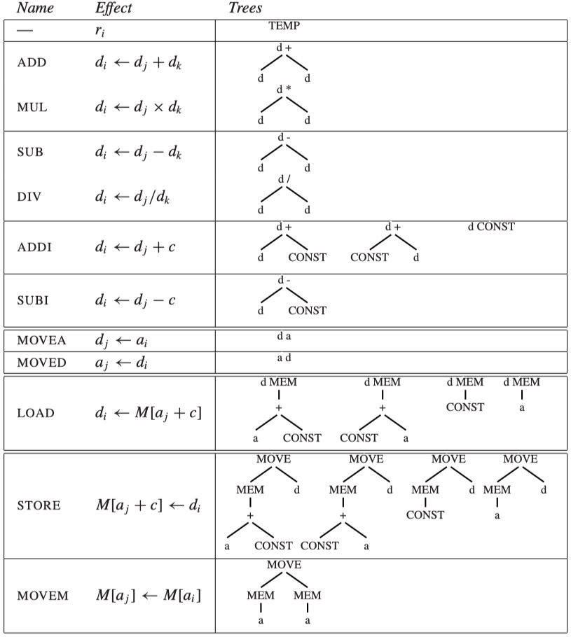{width=80%}
</figure>

每个 tile 的根和 leaves 都需要标注上 `a` 或者 `d` 来表示它们对应的寄存器类型。相应的树文法需要包含以下非终结符：

- `s`：用于 statement
- `a`：用于结算结果保存到 a 寄存器的 expression
- `d`：用于结算结果保存到 d 寄存器的 expression

LOAD、 MOVEA 和 MOVED 指令的文法规则可能如下所示：

```
d -> MEM(+(a, CONST))
d -> MEM(+(CONST, a))
d -> MEM(CONST)
d -> MEM(a)
d -> a
a -> d
```

这样的文法规则有高度的歧义性：同一个表达式的确可以由多种指令序列实现，因此同一棵树也有多种 parse 方式。

我们的目标是寻找 cost 最小的 parse 而非唯一的 parse，因此需要使用拓展的动态规划算法来求解：

- 每个节点需要为每个非终结符都计算一个最小代价，例如对于一个节点 n：
    - `cost(n, s)`：以 n 为根的子树被解析为 statement 的最小代价
    - `cost(n, a)`：以 n 为根的子树被解析为 a 寄存器的 expression 的最小代价
    - `cost(n, d)`：以 n 为根的子树被解析为 d 寄存器的 expression 的最小代价
- 进行动态规划的递推操作时，需要根据 tile 的 leaf 在文法中对应的非终结符来计算 tile 的代价

## CISC Machines

CISC 机器相较于 RISC 机器的主要区别和问题如下所示：

| RISC Machine | CISC Machine |
| --- | --- |
| 32 个寄存器 | 更少的寄存器（16个、8个或者更少） |
| 整数/指针寄存器只有一类 | 寄存器被分为多类，某些操作只能在特定寄存器上执行 |
| 算术运算只能在寄存器之间进行 | 算术运算可以通过寻址模式来直接在内存中进行 |
| 使用三地址指令 `r1 <- r2 ⊕ r3` | 使用两地址指令 `r1 <- r1 ⊕ r2` |
| load/store 指令只通过 `M[reg+const]` 的形式访问内存 | 有多种寻址模式 |
| 每条指令都是定长的 32 位或 64 位 | 每条指令的长度不固定，可能是 1 字节、2 字节、4 字节或者更多 |
| 每条指令都只产生一个结果或一个副作用 | 每条指令可能产生自动递增等多个副作用 |

CISC 机器为了解决这些问题的方法如下：

- 更少的寄存器：允许编译器更自由地生成 TEMP 节点，并假设寄存器分配器能够有效完成任务
- 多类别的寄存器：在 Pentium 处理器上执行乘法运算时，左操作数必须是 eax，结果的高位部分会被保存在 edx。
    - 但在 Tiger 程序中这些高位部分是无用的，解决办法是显式地 move 操作数和结果，例如 `t1 <- t2 * t3` 可以被翻译成 
    
        ```
        mov eax, t2
        mul t3
        mov t1, eax
        ```

- 两地址指令：添加一个额外的 move 指令，如 `t1 <- t2 + t3` 可以被翻译成

    ```
    mov t1, t2
    add t1, t3
    ```

- 算术运算可以访问内存：在执行运算前将所有操作数加载到寄存器中，运算完成后将其重新存储回内存。
- 多种寻址模式：将相应的寻址模式改写成若干简单的 RISC 指令

!!! info
    显然，生成 optimal tiling 的算法要比生成 optimum tiling 的算法更简单

    - 对于 CISC 机器：optimum 和 optimal 之间的 gap 可能很大，因此需要使用 DP 算法来求解 optimum tiling
    - 对于 RISC 机器：optimum 和 optimal 之间的 gap 可能很小甚至没有区别，一般来说 maximal munch 就能够得到一个足够好的覆盖方案
