# Object Detection

计算机视觉的主要任务包括：图像分类（Image Classification）、语义分割（Semantic Segmentation）目标检测（Object Detection）、实例分割（Instance Segmentation）等。

<figure markdown="span">
    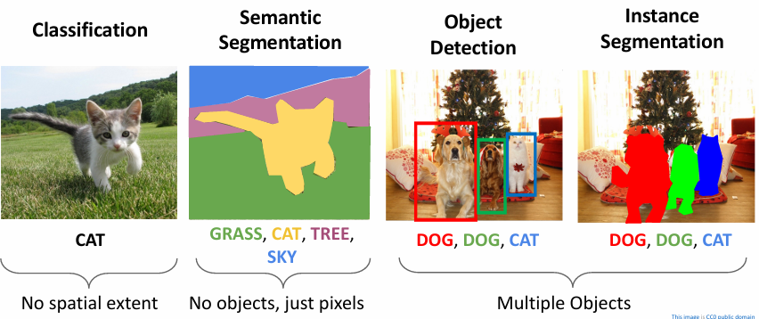{width=70%}
</figure>

## 基本概念

### Task Definition

<figure markdown="span">
    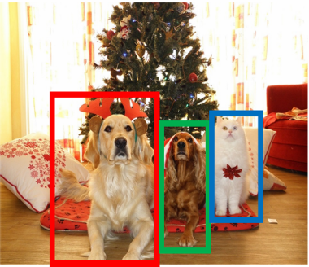{width=50%}
</figure>

目标检测的任务可以概括为：给定一张图片，检测出图片中的物体，并给出物体的类别和位置。

- input：a single RGB image
- output：A set of detected objects; For each object predict:
    - Category label (from fixed, known set of categories)
    - Bounding box (four numbers: x, y, width, height)

目标检测的挑战在于：

- Multiple outputs：每张图片都可能需要输出多个目标
- Multiple types of output：既需要预测目标的种类标签（what）也需要给出目标的边界框（where）
- Large images：分类任务通常使用 224x224 的图像，但目标检测会使用到分辨率更高的图像，通常是 800x600

!!! info "type of object detection"
    <figure markdown="span">
        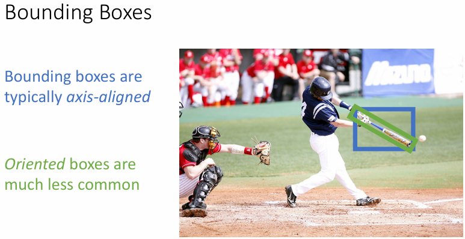{width=60%}
    </figure>
        
    - 一般使用水平和竖直的边界框，带有“方向”的框较为少见

    <figure markdown="span">
        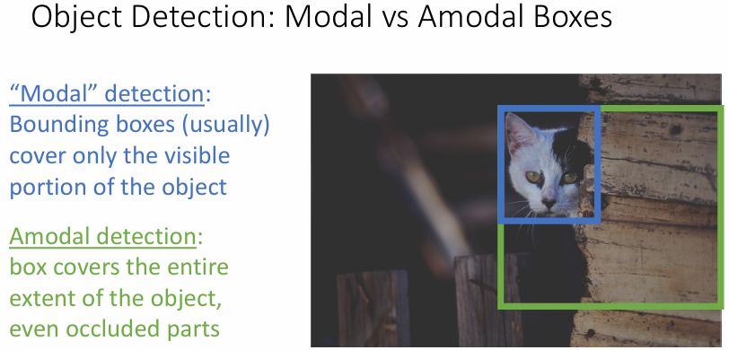{width=60%}
    </figure>

    - 边界框中只包含可以直接观察到的内容称为模态检测（modal detection）
    - 框中包含整个目标，甚至包括被遮挡的部分的检测称为非模态检测（amodal detection）

### Intersection over Union (IoU)

为了比较我们预测的准确程度，我们使用交并比（Intersection over Union，IoU）来定义预测结果与真实结果（ground-truth）的匹配程度，有时它也被称为 Jaccard similarity 或 Jaccard index。

<figure markdown="span">
    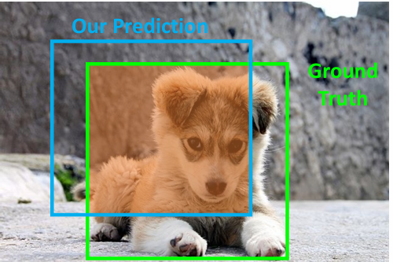{align=left width=40%}
    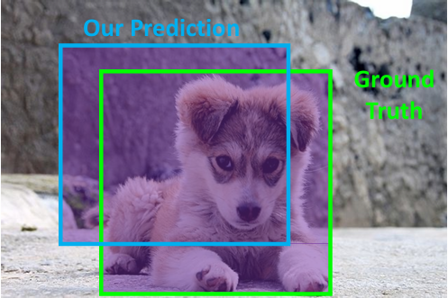{align=right width=40%}
</figure>

$$ \dfrac{Area \ of \ Intersection}{Area \ of \ Union} $$

通常而言，我们认为 IoU > 0.5 就是不错的结果，IoU > 0.7 是相当好的结果，IoU > 0.9 是几乎完美的结果

=== "IoU > 0.5"
    <figure markdown="span">
        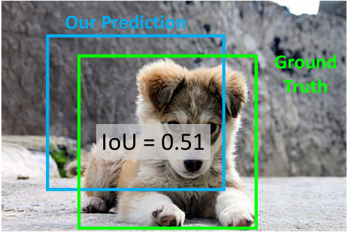{width=60%}
    </figure>

=== "IoU > 0.7"
    <figure markdown="span">
        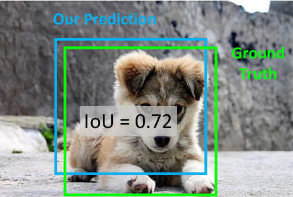{width=60%}
    </figure>

=== "IoU > 0.9"
    <figure markdown="span">
        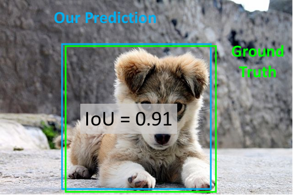{width=60%}
    </figure>

## Detecting Objects

### Region Proposals

对于单个目标的识别任务，我们可以使用一个预训练的模型来从图像中提取特征向量，然后再分别使用两个全连接层来执行分类和划出边界框的任务，这个多任务模型的损失可以定义为这两个任务的损失加权后的和。

<figure markdown="span">
    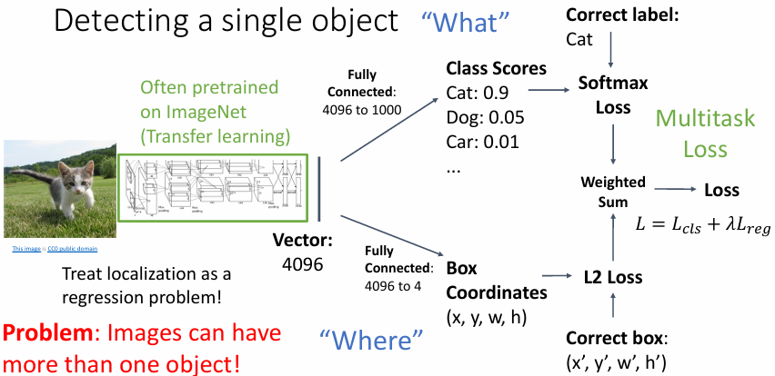{width=70%}
</figure>

但对于多个目标的识别任务而言，为每一个目标都单独训练一个全连接层显然是不现实的，并且在一些情况中图像中有多少个需要识别的目标是未知的。

解决这个情形的一个简单粗暴地方法是在图像中使用一个不断滑动的窗口（sliding window），使用这个窗口对图像进行裁剪（crop），对裁剪出来的小窗口实施单目标的识别任务。

<figure markdown="span">
    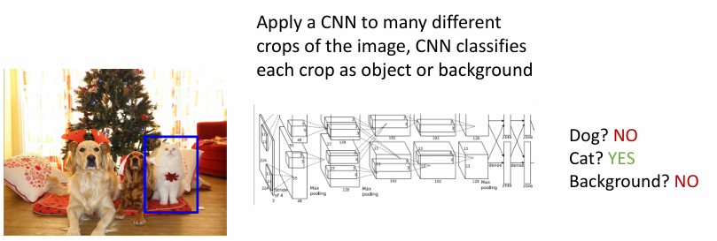{width=75%}
</figure>

但是这么做有两个很明显的问题：

1. 对于一个大小为 $H \times W$ 的图像，假设我们的窗口大小为 $h \times w$，那么这个窗口可能的位置就有 $(W-w+1) \times (H-h+1)$，所有可能的窗口就有
    $$ \sum_{h=1}^H \sum_{w=1}^W (W-w+1)(H-h+1) = \dfrac{H(H+1)}{2} \dfrac{W(W+1)}{2} $$ 
    这显然是不可接受的
2. 使用上述的滑动窗口法时，会对同一个目标进行多次检测，也会造成不必要的浪费

这时就可以引出 Region Proposals（区域提议）这一概念，它的核心是

- 寻找一个很有可能覆盖所有目标的边框的集合
- 通常基于启发式算法，例如寻找 blob-like 的图像区域
- 相对而言运行较快，例如 Selective Search 使用 CPU 在几秒钟内给出 2000 个 region proposals

### R-CNN: Region-Based CNN

R-CNN 结合了 region proposal 和 CNN，

<figure markdown="span">
    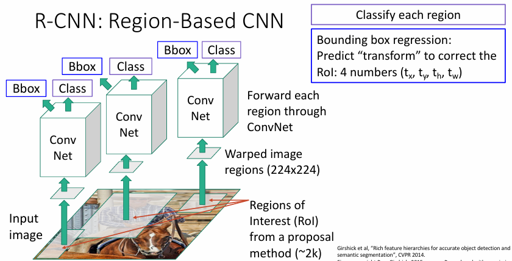{width=70%}
</figure>

1. R-CNN 首先使用 Selective Search 算法来生成区域提议，获得约 2000 个候选区域。
2. 每个候选区域都会被放缩到一个固定的大小（例如 224x224），接着送入一个预训练的卷积神经网络来进行特征提取。
3. 然后 R-CNN 会对每一个候选区域的特征图进行分类，判断该区域是否包含目标物体，并提供一个类别标签；此外，R-CNN 还会使用一个线性回归模型来预测候选区域的边界框是否需要调整，目的是让边界框更准确地匹配目标物体。
4. 最后，R-CNN 会通过 非极大值抑制（Non-Maximum Suppression，NMS） 来去除多余的重叠框，确保每个物体只对应一个边界框。NMS 会根据置信度分数（Score）来判断哪个边界框是最优的，剔除重叠度高的候选框。

!!! note "Non-Maximum Suppression (NMS)"
    1. 选择下一个得分最高的边框
    2. 遍历得分较低且与当前选定边框的交并比大于某个阈值（例如 0.7）的其他边框，把它从候选的边框中去除
    3. 如果还剩下边框没有考虑，那么就回到步骤 1

    <figure markdown="span">
        {width=60%}
    </figure>

    例如这里分类得分最高的是蓝色边框，并且橙色边框与它的重叠程度（交并比）高于了指定的阈值，于是就要把橙色边框去掉；下一次操作中得分最高的是紫色边框，黄色边框与它的重叠程度大于了阈值，于是也要去掉。

    最终剩下的就是蓝色和紫色两个边框

    <figure markdown="span">
        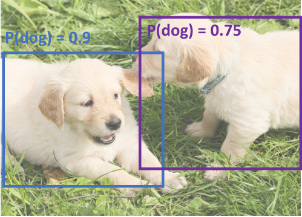{width=60%}
    </figure>

!!! warning 
    NMS 对于真实目标高度重叠的图像，有可能会把许多正确的边框给去除掉，直到目前仍没有什么好的解决方法

    <figure markdown="span">
        {width=60%}
    </figure>

### Mean Average Precision (mAP)

Mean Average Precision 是评估目标检测的精确程度的指标，它的工作步骤如下：

1. Run object detector on all test images (with NMS)
2. For each category, compute Average Precision (AP) = area under Precision vs Recall Curve
    - For each detection (highest score to lowest score)
        - If it matches some GT box with IoU > 0.5, 
        mark it as positive and eliminate the GT
        - Otherwise mark it as negative
        - Plot a point on PR Curve
    - Average Precision (AP) = area under PR curve
3.  Mean Average Precision (mAP) = average of AP for each category
4. For “COCO mAP”: Compute mAP@threshfor each IoUthreshold (0.5, 0.55, 0.6, …, 0.95) and take average

<figure markdown="span">
    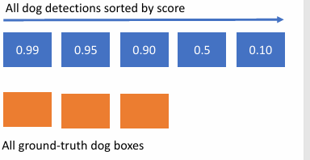{width=75%}
</figure>

例如在上图的示例中我们最终通过目标检测找到了 5 个标签为狗的边框，而真实包含狗的边框有三个

<figure markdown="span">
    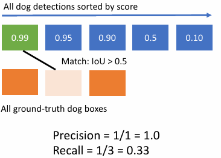{width=75%}
</figure>

首先我们对第一个检测结果进行评估，发现它能与其中一个真实边框对应上，那么此时的准确率为 1/1，召回率为 1/3

<figure markdown="span">
    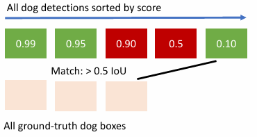{width=75%}
</figure>

以此类推，我们对这 5 个边框都进行了评估，其中第 1、2、5 个边框能与真实边框对应上，那么此时准确率为 3/5，召回率为 3/3

<figure markdown="span">
    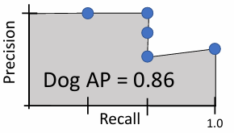{width=75%}
</figure>

我们可以绘制出在此过程中各阶段结果对应的点，如图所示的阴影部分面积就是我们在阈值设置为 0.5 情况下得到的狗的平均精确度（Average Precision）

<figure markdown="span">
    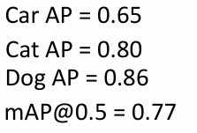{align=left width=40%}
    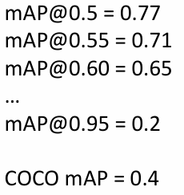{align=right width=40%}
</figure>

类似地，我们也可以在 0.5 阈值下对多个种类求出 AP，并且把这些结果求平均，得到阈值为 0.5 时的 mAP。然后我们还可以对不同阈值下的 mAP 再求平均，得到 COCO mAP。

### Fast R-CNN

Fast R-CNN 是 R-CNN 的一个改进版本，它通过首先在整个图像上一次性运行 CNN 提取特征图，并在特征图上进行 RoI Pooling（Region-of-Interest Pooling），从而避免了为每个候选区域单独提取特征，显著提高了效率。

<figure markdown="span">
    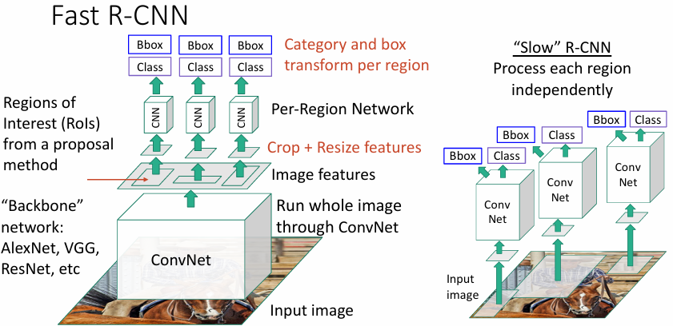{width=70%}
</figure>

- 用于提取特征向量的 CNN 被称为 backbone network，即骨干网络；对每个从特征图中提取出的区域进行处理的 CNN 被称为  Per-Region Network。
- 从特征图上寻找候选区域时同样要对特征图进行裁剪和放缩（Crop + Resize）

!!! info "Fast R-CNN vs “Slow” R-CNN"
    <figure markdown="span">
        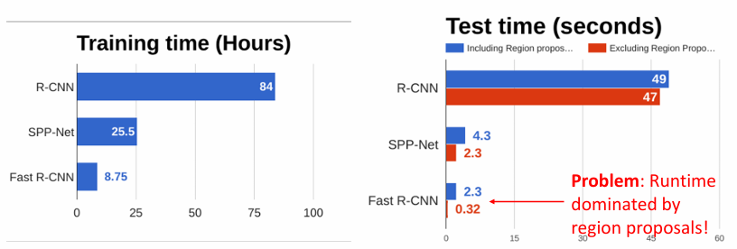{width=80%}
    </figure>

    可以看到 Fast R-CNN 无论是训练用时还是测试用时都比 R-CNN 要快得多，甚至 Fast R-CNN 在测试时的耗时主要来源于 region proposal 而非识别等操作。

#### RoI Pooling

我们要在特征图上对每个候选区域进行处理，因此我们需要将特征图上不同大小的候选区域映射到相同大小的特征图上，这就需要 RoI Pooling。

RoI Pooling 的主要步骤是：

1. 将原始图像的候选区域映射到特征图上（snap to grid cell）
2. 将候选区域划分为 $H \times W$ 个子区域（实践中通常取 $H=W=7$，下图的示例中取 $H=W=2$）
3. 对每个子区域进行 Max Pooling
4. 将 Max Pooling 的结果拼接成一个大小为 $H \times W$ 的特征向量

这样一来，我们就可以将不同大小的候选区域映射到相同大小的特征图上，从而可以使用全连接层来进行分类和回归。

<figure markdown="span">
    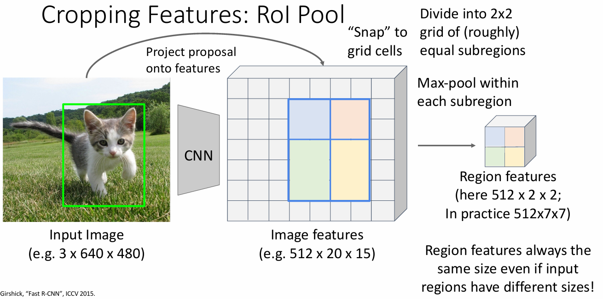{width=70%}
</figure>

但是由于卷积的特性，原始图像中的 region proposal 未必能与特征图上的 grid cell 对齐，从原始图像到特征图像的映射会出现一定的误差（misalignment），这就会导致 RoI Pooling 时的信息损失，于是就有了 RoI Align。

#### RoI Align

RoI Align 的目标是解决 RoI Pooling 的对齐问题，它通过双线性插值（bilinear interpolation）来保留更多的空间信息，避免了量化误差，保证了特征的精确对齐。

- 对齐每个 RoI：对于每个 RoI，我们首先计算出 RoI 在特征图上的位置，然后根据该位置在特征图上进行精确的像素对齐。
- 双线性插值：对于每个 RoI 分割网格中的每个像素位置（采样点），RoI Align 会利用特征图中的四个邻近像素进行双线性插值，得到更精确的特征值。
- 得到区域特征：得到了每个 RoI 的精确特征后，我们像往常一样进行 RoI Pooling，将特征图上不同大小的候选区域通过划分区域和 max pooling 映射到相同大小的特征向量上。

!!! example
    <figure markdown="span">
        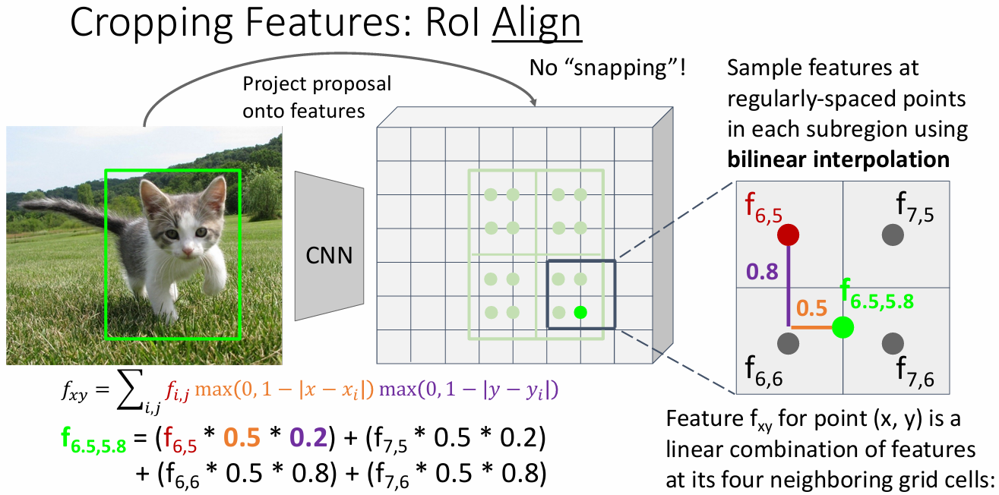{width=70%}
    </figure>

    例如在上图中，与高亮的绿色采样点对应的区域是图中紫色方框标注出来的区域，RoI Align 会利用这个区域的四个邻近像素（红色点）进行双线性插值，得到更精确的特征值。

    对特征图上 RoI 中的每一个采样点都进行双线性插值操作后，现在我们输出的特征向量就与原始图像中的 RoI 对齐了。

### Faster R-CNN

> Faster R-CNN 的命名就来自于它比 Fast R-CNN 还要更快的训练和运行速度，相当简单粗暴...

<figure markdown="span">
    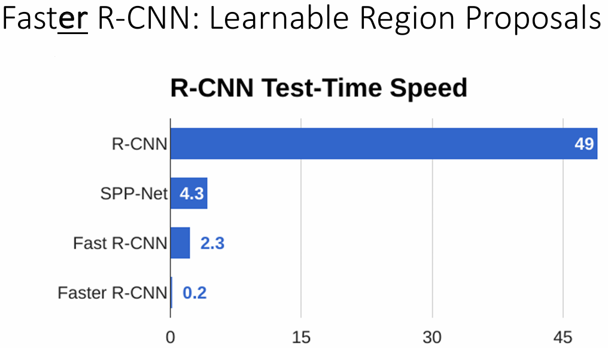{width=50%}
</figure>

Faster R-CNN 引入了 Region Proposal Network（RPN）来代替传统的 Region Proposal 方法，从而大幅提升了目标检测的效率。

<figure markdown="span">
    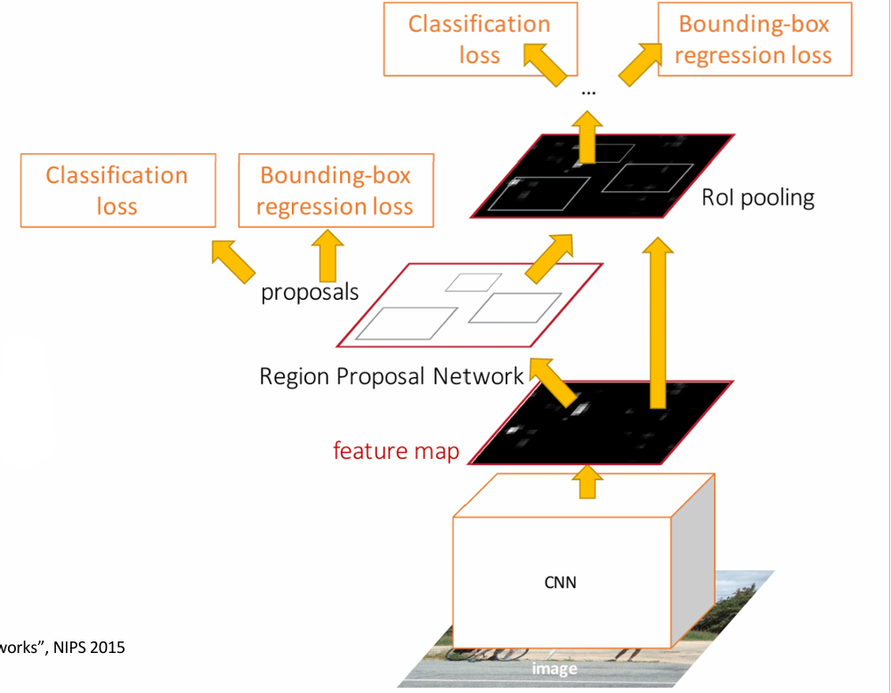{width=50%}
</figure>

RPN 是一个小型的卷积神经网络，通常与主网络（用于目标检测的 CNN）共享骨干网络输出的特征图，它的工作原理如下：

- **滑动窗口机制**：RPN 通过一个滑动窗口在 CNN 特征图上滑动，每个窗口都会生成多个候选框。每个候选框有两个输出：一个是目标物体的概率（即该框是否包含目标物体），另一个是边界框的回归值（即预测框的坐标调整量）。
- **多种尺度和长宽比**：RPN 会为每个滑动窗口生成多个不同尺度和长宽比的候选框，这些框被称为锚框（Anchor Boxes）。

    <figure markdown="span">
        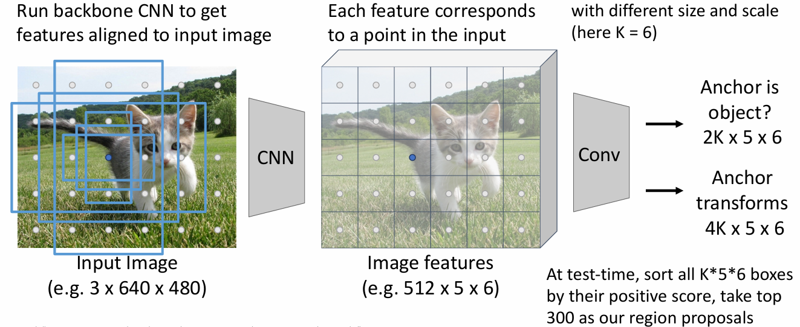{width=50%}
    </figure>    

- **边界框回归**：每个候选框还会进行边界框回归（Bounding Box Regression），以进一步优化框的位置。

!!! note
    引入了 Region Proposal Network 之后，Faster R-CNN 现在就拥有了 4 种损失：

    1. **RPN classification**: anchor box is object / not an object
    2. **RPN regression**: predict transform from anchor box to proposal box
    3. **Object classification**: classify proposals as background / object class
    4. **Object regression**: predict transform from proposal box to object box
