# Image Segmentation

## Semantic Segmentation

语义分割（Semantic Segmentation）的目标是将图像中的每个像素分配到一个特定的类别中。它并不区分同一类别中的不同实例，只关注每一个像素属于哪一个类别。

<figure markdown="span">
    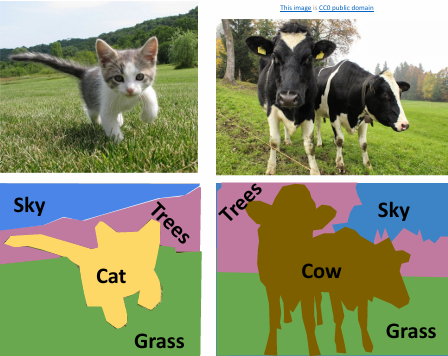{width=60%}
</figure>

类似于目标识别，我们也可以通过滑动窗口的方式来实现语义分割，但是这样的方法计算量太大，过于低效耗时。处理语义分割任务的常用方法是全卷积网络（Fully Convolutional Network，FCN）。

<figure markdown="span">
    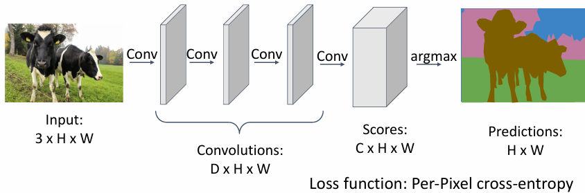{width=85%}
</figure>

假设我们设计了一个由很多卷积层构成的网络，并且能一次性对图像总的所有像素进行预测和分类，那么我们就会发现两个突出的问题：

- 有效感受野会随着使用的卷积层数量线性增长，导致分辨率下降，分割结果模糊。
- 对高分辨率的图像进行卷积操作是非常昂贵的，例如当我们想要整个图像有一个整体的感知时，就需要很多层的卷积操作。

那么现在我们就可以转变思路，首先对图像进行下采样操作，然后在较低的分辨率下进行卷积操作，最后再通过上采样操作将结果恢复到原始分辨率。

<figure markdown="span">
    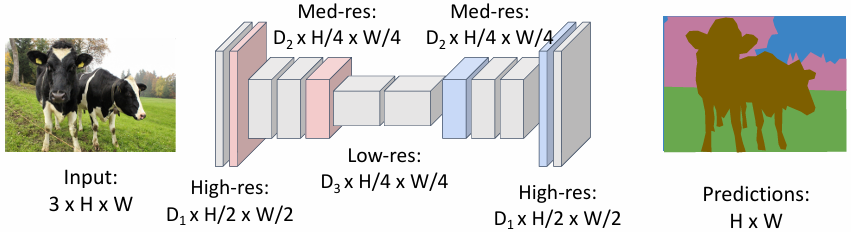{width=85%}
</figure>

目前为止，我们已经知道了如何对图像进行下采样，例如 pooling 和 stride convolution，但是该如何进行上采样呢？

### Upsampling

#### Bed of Nails & Nearest Neighbor

<figure markdown="span">
    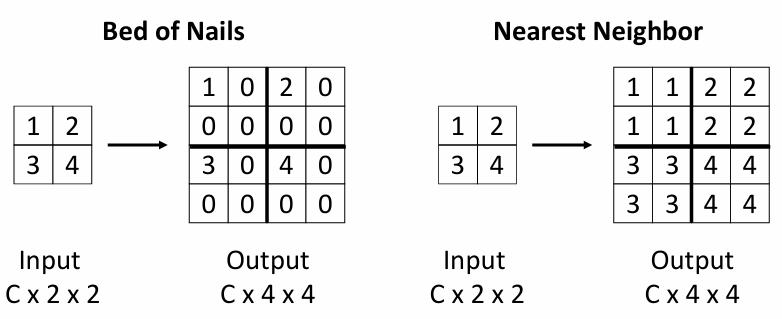{width=70%}
</figure>

- bed of nails：将每个像素的值复制到上采样后对应的池化窗口的左上角，然后填充其他像素为 0。
- nearest neighbor：把上采样前像素的值复制到池化窗口中的所有像素。

#### Bilinear Interpolation

<figure markdown="span">
    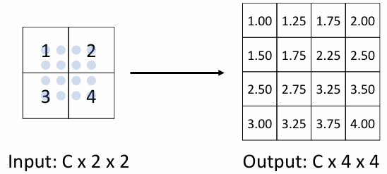{width=70%}
</figure>

- bilinear interpolation：通过线性插值法利用两个最近的 neighbor 来计算上采样后各个像素的值。

    计算公式为 $$ f_{x,y} = \sum_{i,j} f_{i,j} max(0, 1-|x-i|) max(0, 1-|y-j|) $$
    其中 $i \in \\{ \lfloor x \rfloor  - 1, \cdots \lceil x \rceil + 1 \\},\ j \in \\{ \lfloor y \rfloor  - 1, \cdots \lceil y \rceil + 1 \\} $

#### Bicubic Interpolation

<figure markdown="span">
    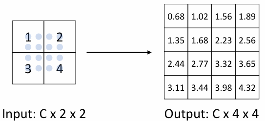{width=70%}
</figure>

- bicubic interpolation：类似于 bilinear interpolation，只不过考虑了三个最近的 neighbor。

#### Max Unpooling

<figure markdown="span">
    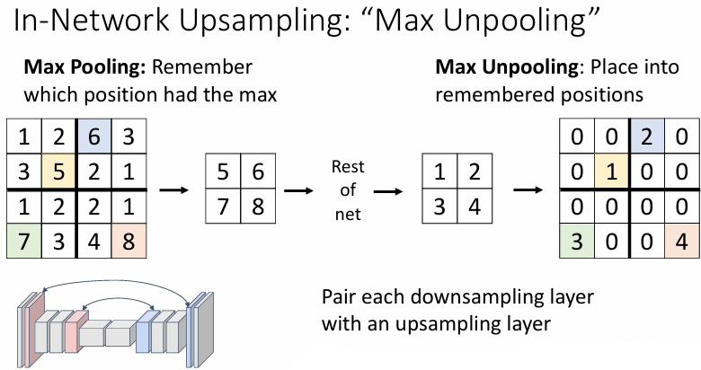{width=70%}
</figure>

- max unpooling：在进行最大池化时我们要记住每个池化窗口中最大值的所在位置，在 max unpooling 的时候就要把对应位置的像素从上采样之前的像素值复制过来，其余为止填 0.

#### Transposed Convolution

<figure markdown="span">
    {width=70%}
</figure>

回顾普通的卷积操作，我们可以将其看作是一个特征图上的滑动窗口，每次滑动都会通过若干个输入值计算得到一个输出值。

<figure markdown="span">
    {width=70%}
</figure>

而转置卷积（transposed convolution）则是将卷积操作反过来，从一个输出值反推回多个输入值。具体来说就是将输入图像中的其中一个像素值与一个 filter 相乘，然后将结果分别加到输出图像的不同位置上。

!!! example "1D example"
    <figure markdown="span">
        {width=80%}
    </figure>

我们还可以从矩阵乘法的角度来考虑转置卷积操作。（这也是转置卷积这一术语的由来）

例如当我们进行一维的卷积操作时，我们可以将每一个滑动窗口中的若干个像素值都看作一个行向量，把这些行向量组合起来就得到了一个矩阵。而 filter 则可以看作一个列向量，将这个列向量与矩阵相乘就得到了卷积操作的结果。

转置卷积操作则与之相反，每个滑动窗口中的若干个像素值都看作一个列向量，组合起来就得到一个矩阵。filter 仍看作一个列向量，将这个列向量与矩阵相乘就得到了转置卷积操作的结果。

!!! exmaple
    === "exmaple1"
        <figure markdown="span">
            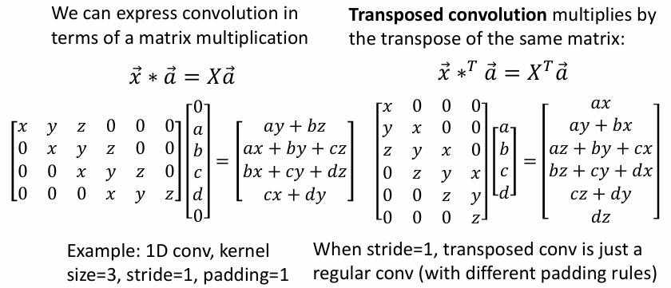{width=80%}
        </figure>

    === "exmaple2"
        <figure markdown="span">
            {width=80%}
        </figure>

!!! info 
    transposed convolution 操作还有一些其他的名称，例如我们可能会在各种文章和 paper 中遇到：

    - deconvolution（bad name）
    - upconvolution
    - fractionally-strided convolution
    - backward strided convolution

现在我们有了上采样的方法，就可以使用 fully convolutional network 来进行语义分割了。

## Instance Segmentation

> Detect all objects in the image, and identify the pixels that belong to each object (Only things!)
>
> 需要注意的是，实例分割只关注图像中的物体，而不关注图像的背景。

Approach： Perform object detection, then predict a segmentation mask for each object!

### Mask R-CNN

Mask R-CNN 是 Faster R-CNN 的扩展，通过在 Faster R-CNN 的基础上增加一个新的分支来解决实例分割问题。

Mask R-CNN 引入了一个新的分支，用于生成每个 RoI 的二值掩码。这个掩码是一个小的二进制图像（通常为 28x28 或 56x56），它与候选区域的大小一致，标记该区域内每个像素是否属于某个物体的像素。

<figure markdown="span">
    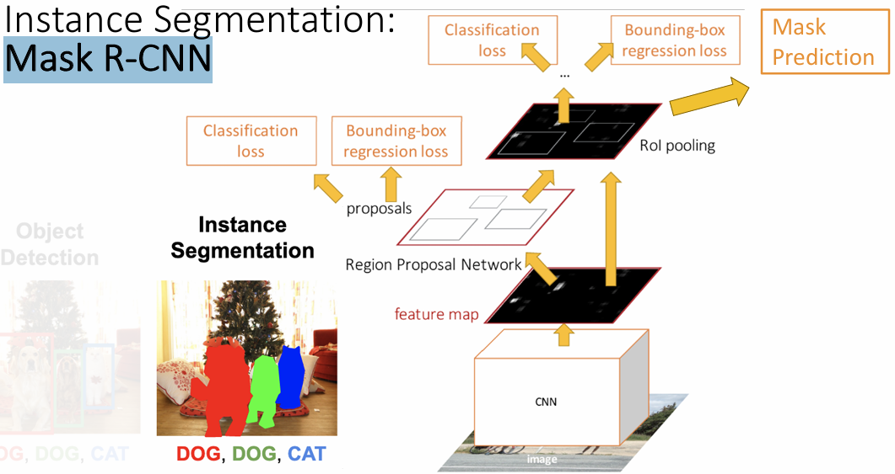{width=65%}
</figure>

!!! example 
    <figure markdown="span">
        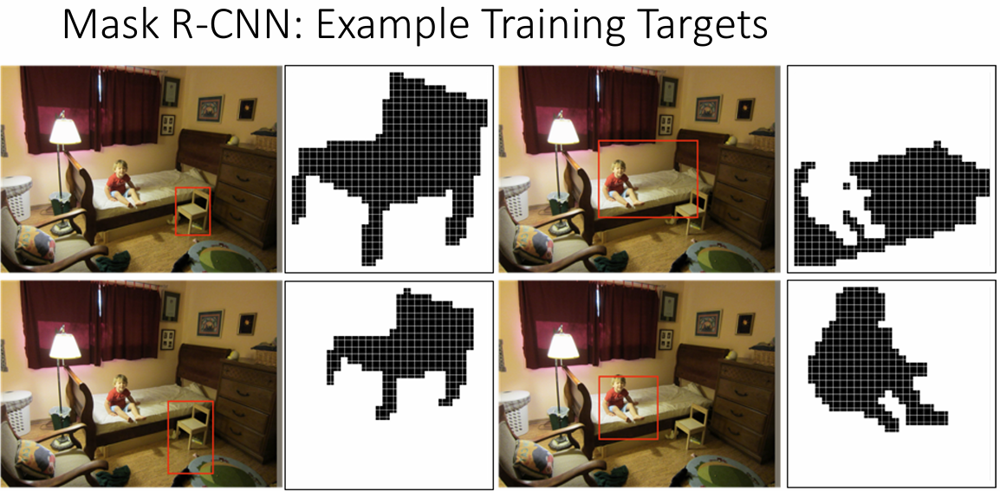{width=65%}
    </figure>    

<figure markdown="span">
    {width=65%}
</figure>

### Beyond Instance Segmentation

- Panoptic Segmentation：同时处理实例分割和语义分割，将图像中的每个像素分配到一个特定的类别中，并且区分同一类别中的不同实例。

    <figure markdown="span">
        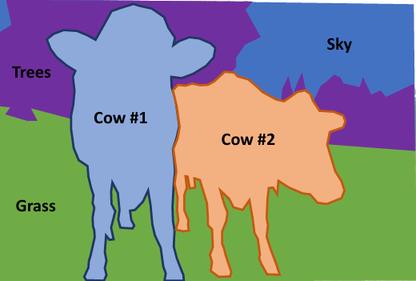{width=55%}
    </figure>

- Human Keypoints Detection：检测人体的关键点，例如头部、肩膀、手肘、手腕等。

    <figure markdown="span">
        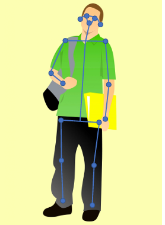{width=45%}
    </figure>
