# Attention

## Attention Mechanism

### Introduction

在前一节所学的 Seq2Seq 模型中，我们使用了一个 RNN 来处理输入序列，把它编码为一个固定长度的向量，然后使用另一个 RNN 来解码这个向量。这个方法在处理短序列时效果很好，但在处理长序列时，固定长度的向量可能无法捕捉到所有的信息。为了解决这个问题，我们引入了注意力机制（Attention Mechanism）。

<figure markdown="span">
    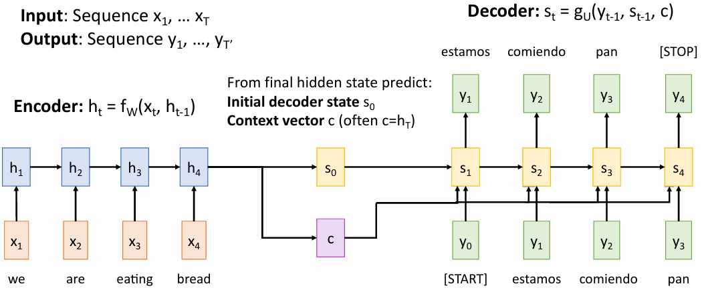{width=75%}
</figure>

### Attention

注意力机制的核心思想是，在解码时，我们不再使用一个固定长度的向量来表示整个输入序列，而是根据当前的解码状态动态地选择输入序列中的某些部分进行关注。具体来说，我们为每个输入序列中的元素计算一个权重（attention weight），这个权重表示了该元素在当前解码状态下的重要性。然后，我们使用这些权重对输入序列进行加权求和，得到一个新的上下文向量（context vector），这个上下文向量将用于解码过程。

<figure markdown="span">
    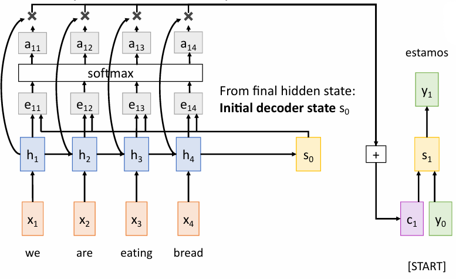{width=60%}
</figure>

例如我们在经过编码器后，得到了一个包含 4 个隐藏状态的序列 $h_1, h_2, h_3, h_4$，以及一个最终的隐藏状态 $s_0$（它也是解码器的初始状态）。然后我们利用 $s_0$ 与每一个隐藏状态 $h_i$ 计算得到一个 alignment scores（对齐分数），表示当前的解码状态与输入序列中每个元素的相关性。

> 我们可以使用一个简单的函数来计算这个对齐分数，例如点积（dot product）或双线性（bilinear）函数。

接着我们将这些对齐分数通过 softmax 函数转换为权重 $\alpha_i$，表示每个输入元素在当前解码状态下的重要性。最后，我们使用这些权重对输入序列的隐藏状态进行加权求和，得到一个新的上下文向量 $c_i$，这个上下文向量将用于解码过程。

用数学的语言来描述这个过程，我们可以表示为：
$$ e_{t,i} = f_{att}(s_{t-1}, h_i),\quad f_{att} \text{ is an MLP} $$
$$ \alpha_{t,i} = \frac{exp(e_{t,i})}{\sum_{j=1}^{T_x} exp(e_{t,j})} $$
$$ c_t = \sum_{i=1}^{T_x} \alpha_{t,i} h_i $$

<figure markdown="span">
    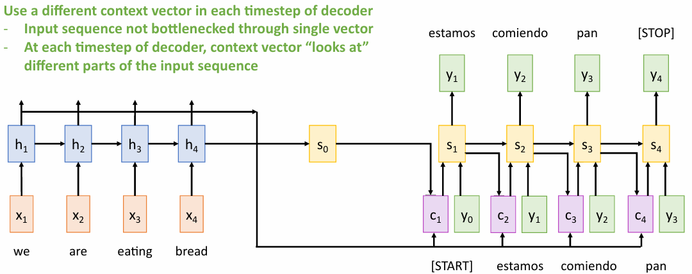{width=70%}
</figure>

然后我们将这个上下文向量 $c_t$ 与当前的解码状态 $s_{t-1}$ 结合起来，利用输入 $y_{t-1}$ 进行解码，得到下一个解码状态 $s_t$。这个过程可以表示为：
$$ s_t = f_{dec}(y_{t-1}, s_{t-1}, c_t) $$
其中 $y_0$ 是解码器的初始输入（start token），$f_{dec}$ 是解码器的函数。这个解码过程将会持续到生成结束符号（end token）为止。

!!! example 
    === "English to French transla on"
        <figure markdown="span">
            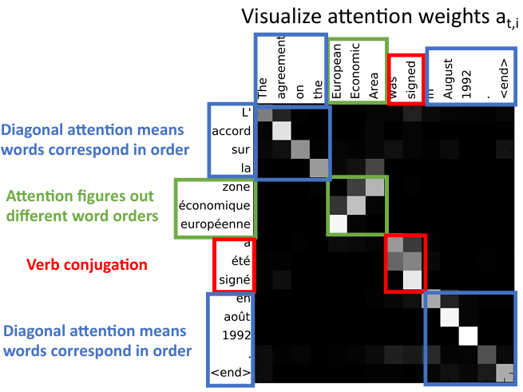{width=70%}
        </figure>

        上面的例子是一个英语到法语的翻译任务，像素点越亮表示对应的注意力越大。

        我们可以看到，在解码过程中，注意力机制使得模型能够在对不同的输入单词进行关注，从而生成相对应的法语单词，并且能够处理英语和法语中单词语序不同的情况。

    === "Image Cap oning"
        <figure markdown="span">
            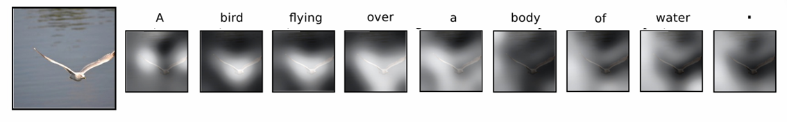{width=80%}
        </figure>

        这里我们也可以观察到，注意力机制使得模型能够在对不同的输入图像区域进行关注，从而生成相对应的描述。

## Attention Layer

有了注意力机制之后，我们就希望能够让它具有更多的泛用性，从而可以在不同的任务中使用。为此，我们将注意力机制封装成一个层（layer），称为注意力层（Attention Layer）。

注意力层的输入是一个查询（query）向量 $q$，一个输入向量序列 $X$，以及一个相似度函数；经过计算将得到一个相似度向量 $e$，表示查询向量与输入向量序列中每个元素的相似度、一个权重向量 $\alpha$，表示每个输入元素在查询向量下的重要性，以及一个输出向量 $y$，表示输入向量序列的加权求和。

**Inputs**：

- Query Vector: $q$ (shape: $D_Q$),
- Input Vector: $X$ (shape: $N_X \times D_Q$)
- similarity function: scaled dot product

**Computation**：

- Similarities: $e$ (Shape: $N_X$), $e_i = q \cdot x_i / \sqrt{D_Q}$
- Attention weights: $a = \text{softmax}(e)$ (Shape: $N_X$)
- Output vector: $y = \sum_i a_i x_i$ (Shape: $D_x$)

!!! tip
    在注意力机制中，我们使用点积来计算相似度，这种方法简单且高效，但会在向量维度很大时得到一个很大的结果。
    
    为了解决这个问题，我们可以使用缩放点积（scaled dot product）来计算相似度，即将点积结果除以一个缩放因子 $\sqrt{D_Q}$，其中 $D_Q$ 是查询向量的维度。这样可以避免在计算 softmax 时出现数值不稳定的问题。

### Mul ple query vectors

我们还可以对上面的输入进行一些更改：使用多个查询向量 $Q$，而不是一个查询向量 $q$，这样我们就可以在同一时间处理多个查询。

**Inputs**：

- Query Vectors: $Q$ (shape: $N_Q \times D_Q$),
- Input Vectors: $X$ (shape: $N_X \times D_Q$)

**Computation**：

- Similarities: $E = Q \cdot X^T / \sqrt{D_Q}$ (Shape: $N_Q \times N_X$)

    其中 $E_{i,j} = Q_i \cdot X_j / \sqrt{D_Q}$

- Attention weights: $A = \text{softmax}(E,dim=1)$ (Shape: $N_Q \times N_X$)
    
    其中 $A_{i,j} = \frac{exp(E_{i,j})}{\sum_{k=1}^{N_X} exp(E_{i,k})}$

- Output vectors: $Y = AX$ (Shape: $N_Q \times D_x$)  

    其中 $Y_i = \sum_j A_{i,j} X_j$

### Key-Value Attention

最后我们还注意到，输入向量 $X$ 既可以用作查询向量 $q$ 的输入，也可以用作输出向量 $y$ 的输入。

在这两个过程中，我们实际上关心的是输入向量 $X$ 的不同部分，因此我们可以将输入向量 $X$ 分为两个部分：键（key）和值（value）。键向量 $K$ 用于计算相似度，而值向量 $V$ 用于计算输出。

于是我们就可以额外引入两个矩阵 $W_K$ 和 $W_V$，将它们分别与输入向量相乘，得到键向量 $K$ 和值向量 $V$。

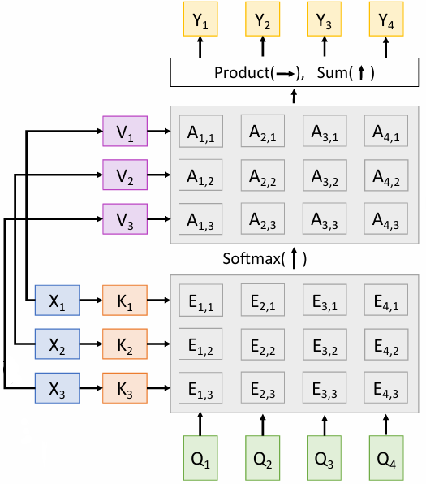{align=right width=30%}

**Inputs**：

- Query Vectors: $Q$ (shape: $N_Q \times D_Q$)
- Input Vectors: $X$ (shape: $N_X \times D_X$)
- Key Vectors: $K$ (shape: $D_X \times D_Q$)
- Value Vectors: $V$ (shape: $D_X \times D_V$)

**Computation**：

- Key Vectors: $K = XW_K$ (shape: $N_X \times D_Q$)
- Value Vectors: $V = XW_V$ (shape: $N_X \times D_V$)
- Similarities: $E = QK^T / \sqrt{D_Q}$ (shape: $N_Q \times N_X$)

    其中 $E_{i,j} = (Q_i \cdot K_j) / \sqrt{D_Q}$

- Attention weights: $A = \text{softmax}(E,dim=1)$ (shape: $N_Q \times N_X$)

    其中 $A_{i,j} = \frac{exp(E_{i,j})}{\sum_{k=1}^{N_X} exp(E_{i,k})}$

- Output vectors: $Y = AV$ (shape: $N_Q \times D_V$)

    其中 $Y_i = \sum_j A_{i,j} V_j$

这样我们就完成了一个完整的注意力层的设计。

### Self-Attention

在上面的注意力层中，我们使用了查询向量 $Q$ 作为输入，但是我们也可以直接通过输入向量 $X$ 来计算得到查询向量 $Q$，即将输入的查询向量 $Q$ 改为查询矩阵 $W_Q$，通过 $Q=XW_Q$ 来计算得到查询向量 $Q$。

这样我们就可以将注意力层应用于输入向量 $X$ 的每个元素上，得到一个新的输出向量 $Y$。

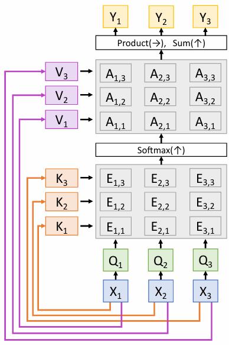{align=right width=30%}

**Inputs**：

- Input Vectors: $X$ (shape: $N_X \times D_X$)
- Key Vectors: $K$ (shape: $D_X \times D_Q$)
- Value Vectors: $V$ (shape: $D_X \times D_V$)
- Query Vectors: $Q$ (shape: $D_X \times D_Q$)

**Computation**：

- Query Vectors: $Q = XW_Q$ (shape: $N_X \times D_Q$)
- Key Vectors: $K = XW_K$ (shape: $N_X \times D_Q$)
- Value Vectors: $V = XW_V$ (shape: $N_X \times D_V$)
- Similarities: $E = QK^T / \sqrt{D_Q}$ (shape: $N_X \times N_X$)

    其中 $E_{i,j} = (Q_i \cdot K_j) / \sqrt{D_Q}$

- Attention weights: $A = \text{softmax}(E,dim=1)$ (shape: $N_X \times N_X$)

    其中 $A_{i,j} = \frac{exp(E_{i,j})}{\sum_{k=1}^{N_X} exp(E_{i,k})}$

- Output vectors: $Y = AV$ (shape: $N_X \times D_V$)

    其中 $Y_i = \sum_j A_{i,j} V_j$

!!! info
    自注意力机制的特点在于，它可以在输入序列的每个元素之间建立联系，从而捕捉到输入序列中元素之间的关系。因此改变输入序列的顺序不会影响自注意力机制的计算结果，它只会影响计算的顺序。
    $$ f(s(x)) = s(f(x)) $$
    其中 $s(x)$ 是输入序列 $x$ 的一个重排序操作。

    <figure markdown="span">
        {width=60%}
    </figure>

- 自注意力机制本身并不“知道”它所处理的向量的排列顺序，这是它对输入序列的排列不敏感的原因。
- 为了让自注意力机制能够处理输入序列的排列顺序，我们可以在输入序列中添加一个位置编码（positional encoding）向量。这个位置编码向量可以是一个固定的向量，也可以是一个可学习的向量。
- 位置编码向量的作用是为输入序列中的每个元素提供一个唯一的标识，从而使得自注意力机制能够区分输入序列中不同元素之间的关系。
    - 例如 NLP 中，单词的不同顺序会影响句子的意思，因此我们需要为每个单词添加一个位置编码向量，以便自注意力机制能够捕捉到单词之间的关系。

<figure markdown="span">
    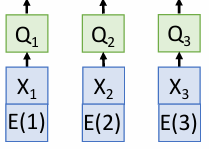{width=60%}
</figure>

#### Masked Self-attention

<figure markdown="span">
    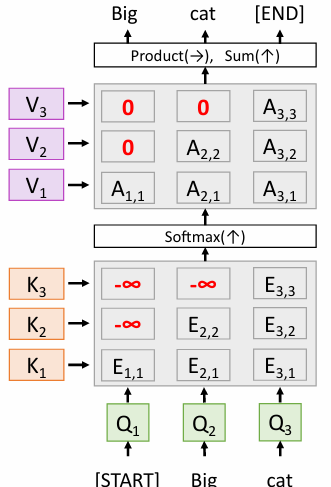{width=60%}
</figure>

Masked Self-attention 是一种自注意力机制的变种，它在计算注意力权重时会对某些位置进行屏蔽（mask），使得模型只能关注到当前时间步之前的位置，而不能关注到当前时间步之后的位置。

具体的操作是把注意力权重矩阵中的某些位置设置为负无穷大（-inf），这样在计算 softmax 时，这些位置的权重就会变为 0，从而实现屏蔽的效果。这样一来，模型在生成下一个单词时就只能依赖于当前时间步之前的单词，而不会受到未来单词的影响。

#### Multi-head Self-attention

<figure markdown="span">
    {width=60%}
</figure>

Multi-head Self-attention 是一种自注意力机制的扩展，它通过将输入向量 $X$ 分成多个头（head），并对每个头分别计算注意力权重，从而实现对输入序列的多种不同的表示，捕获不同的关系和特征。

具体的步骤是：

- 将输入向量 $X$ 分成 $h$ 个头
- 对每个头分别计算注意力权重和输出向量，使用上面提到的查询矩阵 $W_Q$、键矩阵 $W_K$ 和值矩阵 $W_V$ 等，最终得到 $h$ 个输出向量 $Y_1, Y_2, \ldots, Y_h$。
- 将 $h$ 个输出向量拼接在一起，得到一个新的输出向量
- 将拼接后的输出向量通过一个线性变换，得到最终的输出向量 $Y$。

多头机制的好处在于，它可以让模型在同一时间关注到输入序列中的不同部分，从而捕捉到更多的信息和特征，并且可以提高模型的表达能力。同时通过并行计算，也提高了模型的效率。

!!! example "CNN with Self-Attention"
    <figure markdown="span">
        {width=80%}
    </figure>    

!!! abstract "Three Ways of Processing Sequences"
    <figure markdown="span">
        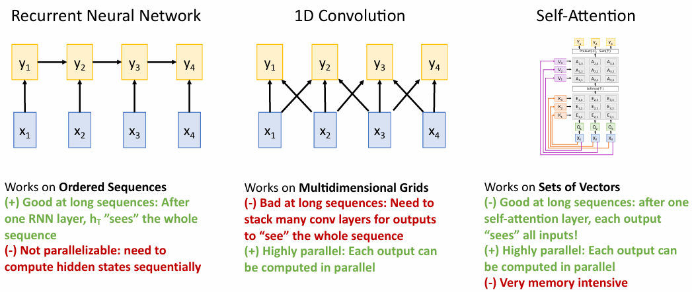{width=90%}
    </figure>

## Transformer

Transformer 是一种基于自注意力机制的模型，它在自然语言处理（NLP）任务中取得了很好的效果。Transformer 模型的核心思想是使用自注意力机制来捕捉输入序列中元素之间的关系，从而实现对输入序列的建模。

<figure markdown="span">
    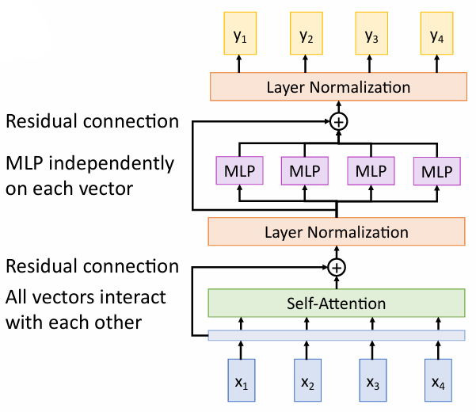{width=50%}
</figure>   

transformer block 指的是上图中输入 x 和输出 y 之间的部分，包括自注意力层、层归一化层、前馈网络和残差连接。

- 输入为一组向量 x，输出为一组向量 y。
- 自注意力层是向量之间唯一有交互的地方，其他的层都是对每个向量单独进行操作。
- 将自注意力层的输出与输入 x 进行相加（残差连接），然后进行层归一化（Layer Normalization），以稳定训练过程。
- 层归一化和多层感知机（MLP）单独对每个向量进行操作，最后将 MLP 的输出与输入 x 进行相加（残差连接），然后再进行一次层归一化。
- Transformer 模型的计算过程是高度可扩展的，可以通过增加层数和宽度来提高模型的表达能力；同时也是高度可并行化的，可以通过并行计算来提高模型的训练效率。

### Post-Norm and Pre-Norm Transformer

上面的 Transformer 模型是一个 Post-Norm Transformer，即在每个子层的输出上先进行残差连接，然后再进行层归一化（Layer Normalization）。

<figure markdown="span">
    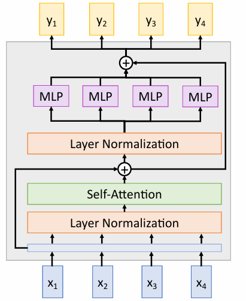{width=50%}
</figure>

它的一种变体是 Pre-Norm Transformer，如右图所示即在每个子层的输入上先进行层归一化，然后再进行残差连接。这种变体的好处在于，它可以更好地稳定训练过程，尤其是在深层网络中，因此在实践中也得到了广泛的应用。

!!! info "Transformer"
    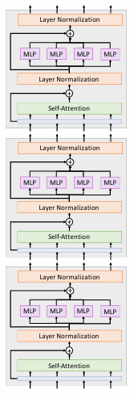{align=right width=15%}

    当我们把若干个 Transformer block 堆叠在一起时，我们就得到了一个完整的 Transformer 模型。

    Transformer 模型的输入是一个序列，输出也是一个序列。它可以用于各种自然语言处理任务（NLP），例如机器翻译、文本生成、文本分类等。

    > 由于 Transformer 模型的高度可扩展性和可并行性，它在大规模数据集上训练时表现得非常好，因此在自然语言处理领域取得了很大的成功。

