# Convolutional Neural Networks

## Convolution Layer

### Filter

<figure markdown="span">
    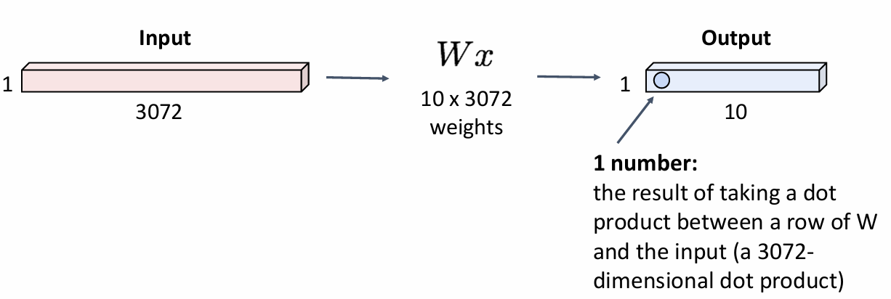{width=60%}
</figure>

在先前，我们在处理图像时会把图像展平成一个长向量，然后输入到全连接层中。但是这样做会导致图像的空间结构被破坏，这对于图像识别任务来说是不利的。

<figure markdown="span">
    {width=70%}
</figure>

我们可以使用 filter 来对图像进行处理，以得到保留了图像空间结构信息的一个抽象数据。例如下图中我们对 3×32×32 的图像应用了一个作用范围是 3×5×5 的 filter，filter 会把 3×5×5 范围内的图像信息汇总处理成一个数字，这样就得到了一个大小为 1×28×28 的激活图（activation map）。

> filter 的具体操作就是把这个 3×5×5 范围中对应元素进行点乘并相加

!!! tip
    在这一节中，图像的 depth 或者说 channels 应该始终与 filter 的 depth 相同。

<figure markdown="span">
    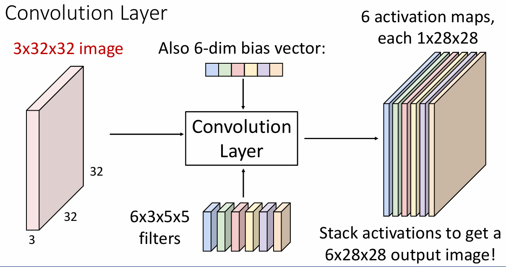{width=70%}
</figure>

当然我们也可以对这个图象一次性应用多个 filter，比如这里我们一次性应用 6 个，这样就可以得到六个 1×28×28 的 activation map。（实际处理中，我们在使用 filter 之后还会对得到的数字加上一个 bias，但在阐述原理时有时会为了方便而忽略这一点）

> 我们可以把处理后的结果视为 6 个堆叠在一起的 1×28×28 的 activation map；也可以视为一个 28×28 的网格，其中每个格点对应着一个 6 维向量。

<figure markdown="span">
    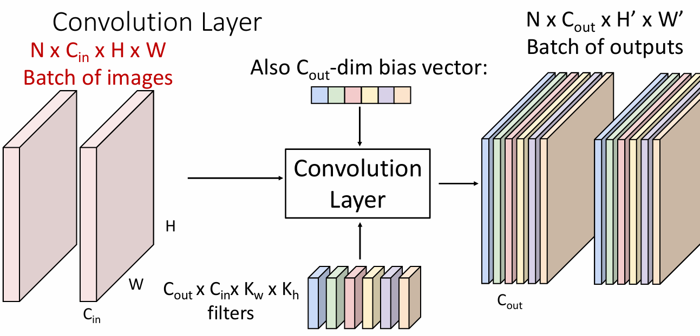{width=70%}
</figure>

通常我们还会对图像进行批量处理，因此输入数据的大小可能是 $N \times C_{in} \times H \times W$ 的，其中 $N$ 是图片的数量，$C_{in}$ 是图像的通道数，$H$ 和 $W$ 分别是图像的高和宽。

<figure markdown="span">
    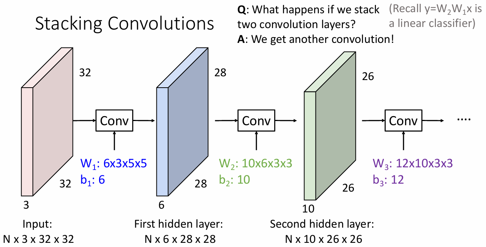{width=70%}
</figure>

我们可以对图片进行若干个卷积层的处理，但是这样还会有一个问题：我们对图像的卷积操作是线性的，直接把两个 filter 作用到同一个图像上，实际上就相当于另一个 filter 单独的作用，这显然会让多层卷积失去意义。

这时候我们可以对它使用激活函数，使每一层的变换都是非线性的，这样一来多层的卷积操作才是有意义的。

<figure markdown="span">
    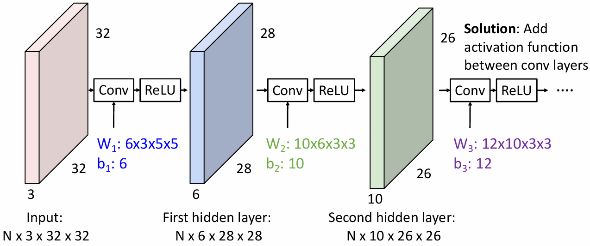{width=70%}
</figure>

### Padding

<figure markdown="span">
    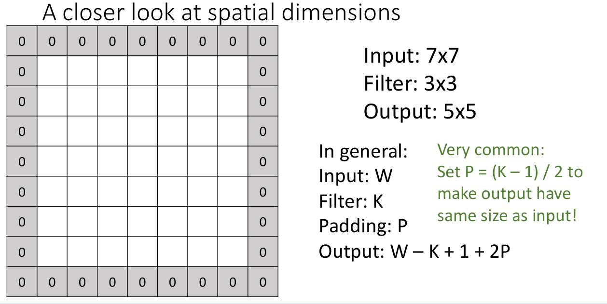{width=60%}
</figure>

对于一个尺寸为 $W$ 的输入，如果我们使用的 filter 的尺寸是 $K$，那么得到的输出将是 $W-K+1$ 的，这意味着每一次进行卷积操作都会缩小输出的图像的尺寸，若干次卷积操作后图像将会“消失”。

解决这个问题的方法是在卷积时在图像的边缘填充（padding）上若干个像素，这样就可以保证卷积后图像的大小不变或变小得没那么快。

!!! info 
    虽然对于 padding 有很多种填充方式，例如只在某个方向上填充，填充的数据不是 0 等等，但是在实践中最常用的还是 same padding（填充使得卷积后的图像大小不变），并且填充的数字为 0，这在实践中也证明是相当有效的。

### Receptive field

感受野（receptive field）是指输出图像中的某个像素点会受到输入图像中像素影响的范围，

<figure markdown="span">
    {width=60%}
</figure>

有时 receptive field 也指初始的输入图像中能影响到最终的输出图像的某个像素点的范围。比如上图的例子中，每经过一次卷积操作，receptive field 的范围就扩大 $K-1$，经过 $L$ 层卷积之后，receptive field 的大小就是 $1+L \times (K-1)$。

### Stride

步长（stride）是指在进行卷积操作时相邻两次采样的间距。比如上面的卷积的步长都是 1。

有时候我们希望多层卷积后的输出结果能对整个图片的整体空间结构有一个感知，但是在卷积核的大小（即上面进行卷积的边长）不变时，这就需要非常多层的卷积才能使整个图片都处在它的感受野的范围内。

通过增加步长，我们可以有效地扩大多层卷积的感受野，从而减少卷积的层数。

<figure markdown="span">
    {width=60%}
</figure>

增加步长之后还会减小卷积后输出图像的大小，例如在上图中输出图像就是 $\dfrac{W – K + 2P}{S} + 1$

> 对于 $W – K + 2P$ 不能被 $S$ 整除的情况，有时会根据具体要求向上或向下取整，但通常来说都会保证它们之间能整除。

!!! question
    假设现在输入的大小为 3×32×32，我们有 10 个 5×5 的 filter，步长为 1，填充大小为 2，那么

    - 输出的大小为 10×32×32

        - 输出图像的尺寸为 $\dfrac{32 + 2*2 - 5}{1} + 1 = 32$

    - 有 760 个可学习参数

        - 共有 10 个 filter，每个 filter 有 3×5×5+1 (for bias) = 76 个可学习参数

    - 涉及到 768000 次点积后相加的操作

        - 共有 10×32×32=10240 个点要输出，每个输出点需要有两个 3×5×5 的张量相乘（75 个元素），75×10240=786000

<figure markdown="span">
    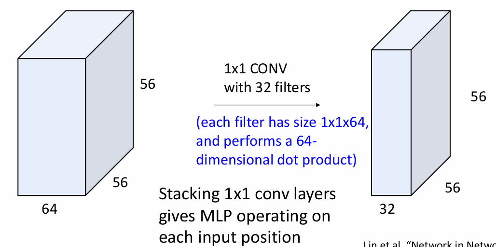{width=60%}
</figure>

有时我们还会对图像进行卷积核大小为 1×1 的卷积操作，这样操作的主要目的是改变图像的通道（或者说 depth）。

乍一看它好像和我们之前学的全连接神经网络很像，但全连接神经网络会把图像拉伸成一个向量，然后再进行处理，因此

- 全连接神经网络适合在网络的末端对图形进行最终的处理（例如给每个分类打分，此时就不在意之后的空间结构了）
- 1×1 卷积适合在保持图像空间结构的情况下调节图像的通道数

!!! exmaple
    上面我们举的例子都是二维情况下的卷积，实际上还有一维、三维等情况的卷积。

    <figure markdown="span">
        {width=60%}
    </figure>

    <figure markdown="span">
        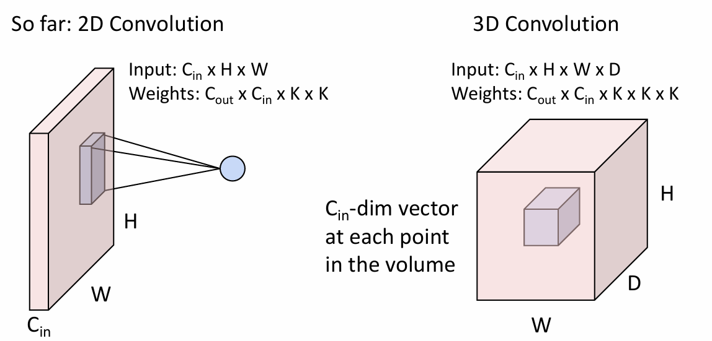{width=60%}
    </figure>

!!! summary
    - Input: $C_{in} \times H \times W$
    - Hyperparameters:
        - Kernel size: $K_H \times K_W$ 
        - Number of filters: $C_{out}$
        - Padding: $P$
        - Stride: $S$
    - Weight matrix: $C_{out} \times C_{in} \times K_H \times K_W$ 
    
        (giving $C_{out}$ filters of size $C_{in} \times K_H \times K_W$)

    - Bias vector: $C_{out}$
    - Output size: $C_{out} \times H' \times W'$ where:
        $$ H' = \dfrac{H - K + 2P}{S} + 1 $$

        $$ W' = \dfrac{W - K + 2P}{S} + 1 $$

    <figure markdown="span">
        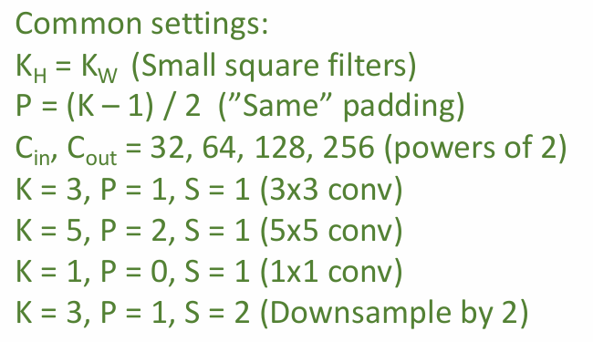{width=45%}
    </figure>

## Pooling Layers

池化（pooling）是卷积神经网络中的一种下采样技术，用于在减小特征图尺寸的同时保留重要的特征信息（空间、色彩信息等）。

<figure markdown="span">
    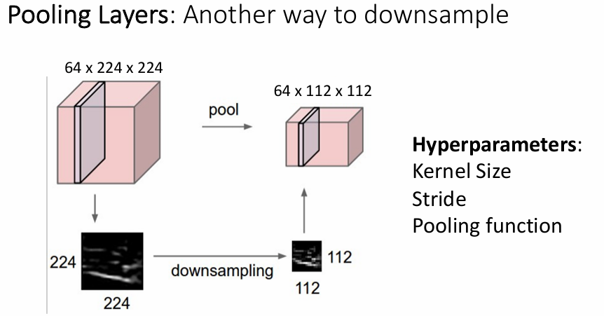{width=65%}
</figure>

> 需要注意的是，虽然池化和 filter 都能减小特征图尺寸，但池化不会减少特征图的通道数

常见的池化有：

- **max pooling**
    - 在一个池化窗口中选择最大值作为它的输出
    - 可以保留原图像中最显著的特征
- **average pooling**
    - 以池化窗口中各元素的平均值作为它的输出
    - 可以使输出图像更加平滑

<figure markdown="span">
    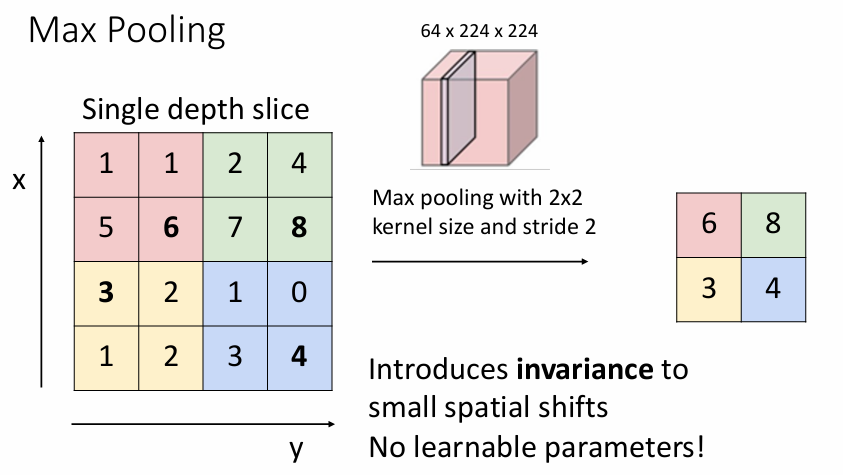{width=60%}
</figure>

!!! summary
    - **Input size**: $C \times H \times W$
    - **Hyperparameters**:
        - Kernel size: $K$
        - Stride: $S$
        - Pooling function: max pooling or average pooling
    - **Output size**: $C \times H' \times W'$ where:
        $$ H' = \frac{H - K}{S} + 1 $$
        $$ W' = \frac{W - K}{S} + 1 $$
    - **Learnable parameters**: None！

???+ example
    <figure markdown="span">
        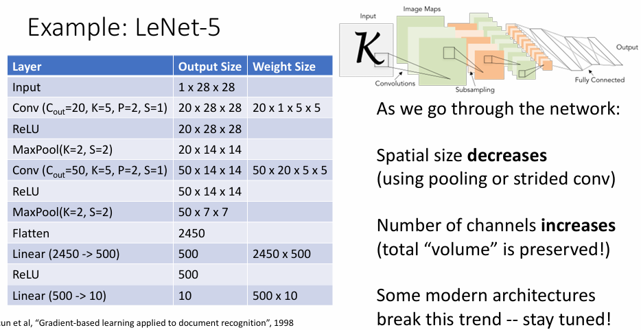{width=80%}
    </figure>

## Normalization

>  Idea: “Normalize” the outputs of a layer so they have zero mean and unit variance
>
> Why? *Helps reduce “internal covariate shift”, improves optimization*

!!! info
    所谓的“内部协变量偏移”（Internal Covariate Shift）指的是在神经网络训练过程中，由于每一层的参数不断更新，导致网络各层的输入数据分布持续变化。这种分布的变化会使得网络层需要不断适应新的数据分布，从而降低学习速度，增加训练难度。

为了解决 internal covariate shift 导致的神经网络难以训练问题，批量归一化（batch normalization）被提出。批量归一化能让数据分布更加稳定，减少了内部协变量偏移的影响，从而加快和稳定模型的训练。

<figure markdown="span">
    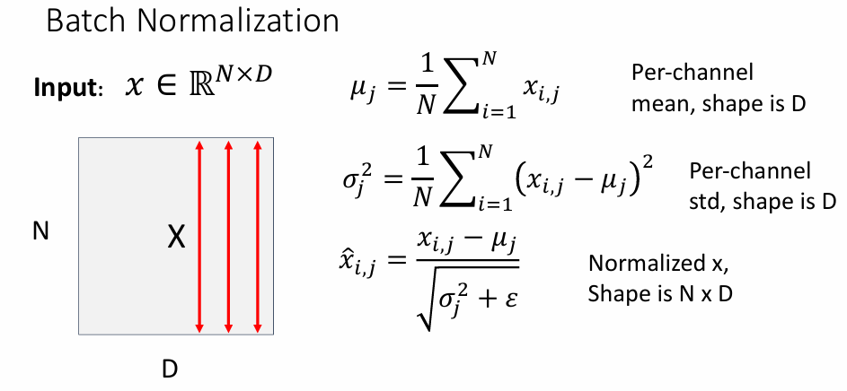{width=65%}
</figure>

具体来说，首先通过取样得到一个 batch 的训练数据，求出这 N 个图像在各个通道上的平均值、标准差，然后再对这些图像的每个数据点进行归一化处理。需要注意的是我们在进行除法时使用了一个很小的常数 $\varepsilon$ 来避免出现除零的情况。

进行归一化之后，我们还需要引入两个可学习的参数 $\gamma, \beta \in \mathbb{R}^D$，然后对归一化后的参数进行线性变换，以恢复网络层的表达能力。
$$ y_{i, j} = \gamma_j \hat{x}_{i, j} + \beta_j $$

> $y_{i, j}$ 的形状为 N × D

!!! note
    如果参数 $\gamma = \sigma, \beta = \mu$，那么变换之后会把 $x$ 恢复成归一化之前的状态。

但是 batch normalization 还有一些问题：

- 在 batch size 很小时，计算得到的平均值和标准差可能会受到噪声的影响，并且这一个 batch 的数据可能并不能很好地代表整个数据集的分布
- 并且在测试时我们只能对少数样本进行处理，可能无法计算出一个 batch 的平均值和标准差，这可能会导致测试时的结果和训练时的结果不一致。

!!! note
    在测试时我们可以使用训练时所有批次的平均值和标准差的期望值来代替当前 batch 的平均值和标准差。比如
    $$ \mu = \dfrac{1}{M} \sum_{j}^{M} \mu_j $$
    $$ \sigma^2 = \dfrac{1}{M} \sum_{j}^{M} \sigma_j^2 $$

<figure markdown="span">
    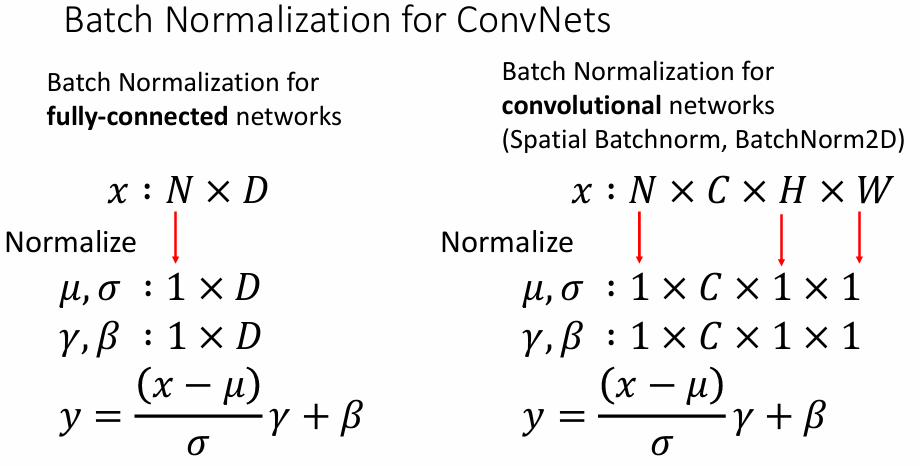{width=60%}
</figure>

- 当我们对全连接网络进行归一化处理时，得到特征数 D 之外的维度的大小变为 1.
- 当我们对卷积神经网络进行归一化处理时，会把通道数之外的维度的大小都变为 1.

> 虽然下面的表达式中各个符号代表的张量的维数不同，但在实际应用中会隐式地发生 boardcast 从而保证计算得到的 $y$ 能保持和 $x$ 一致的维度。

批量归一化的优点：

- Makes deep networks **much** easier to train!
- Allows higher learning rates, faster convergence
- Networks become more robust to initialization
- Acts as regularization during training
- Zero overhead at test-time: can be fused with conv!

    <figure markdown="span">
        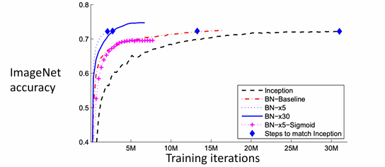{width=80%}
    </figure>

批量归一化的缺点：

- Not well-understood theoretically (yet)
- Behaves differently during training and testing: this is a very common source of bugs!

!!! info "其他的归一化方法"
    <figure markdown="span">
        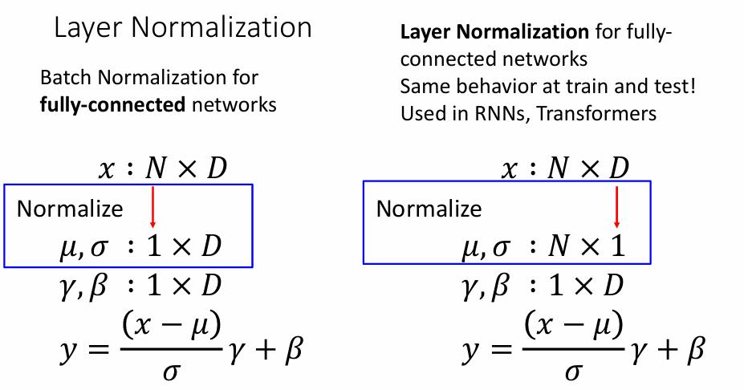{width=60%}
    </figure>

    <figure markdown="span">
        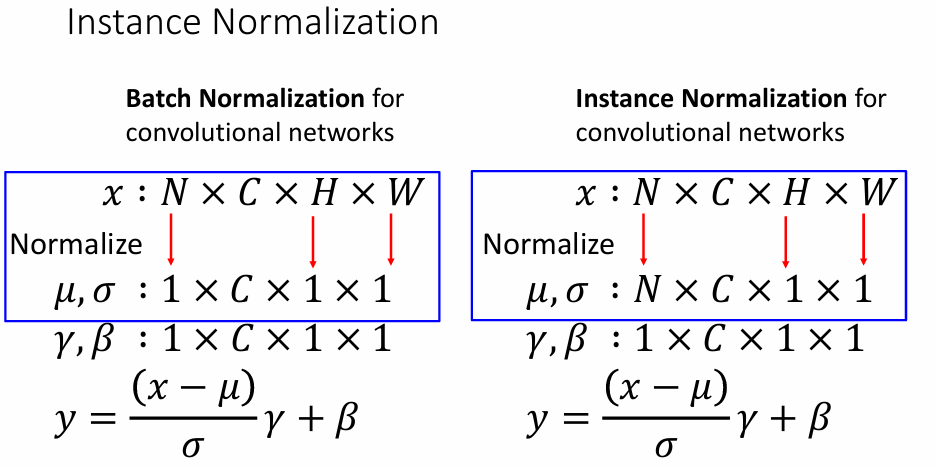{width=60%}
    </figure>

    <figure markdown="span">
        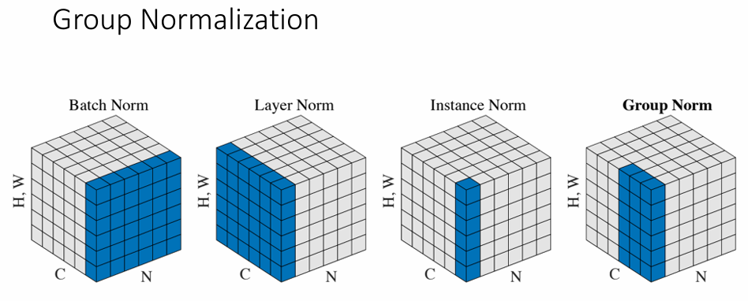{width=80%}
    </figure>

    - **Batch normalization**: 对某个 channel 的所有样本及其所有像素进行归一化
    - **Layer normalization**: 对某个样本的所有 channel 中的所有像素进行归一化
    - **Instance normalization**: 对某个样本的一个 channel 中的所有像素进行归一化，但是不同样本之间不会相互影响
    - **Group normalization**: 介于 layer normalization 和 instance normalization 之间，对某个样本的一组 channel 中的所有像素进行归一化

> 到目前为止我们知道了卷积神经网络的基本组成部分：卷积层、池化层、全连接层、批量归一化层、激活函数等等，但是我们还没有讨论如何把这些组件组合起来构建一个完整的卷积神经网络，具体的内容可以在下一节中看到。
