# CNN Architectures Ⅰ

## AlexNet

AlexNet 是一个由 Alex Krizhevsky、Ilya Sutskever 和 Geoffrey Hinton 设计的深度卷积神经网络，它在 2012 年的 ImageNet 竞赛中获得了冠军。

AlexNet 有 5 个卷积层，3 个全连接层，同时还使用了 MaxPooling 层和 ReLU 激活函数使得网络具有非线性。

<figure markdown="span">
    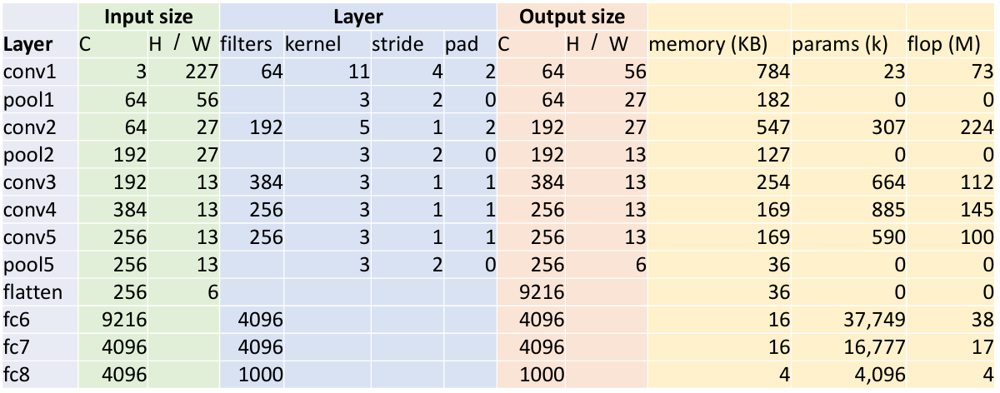{width=70%}
</figure>

让人们好奇的是 AlexNet 所使用的这些参数是如何确定的，但似乎并没有一个明确的答案，人们一般认为这些参数是通过大量的实验和调整得到的。

<figure markdown="span">
    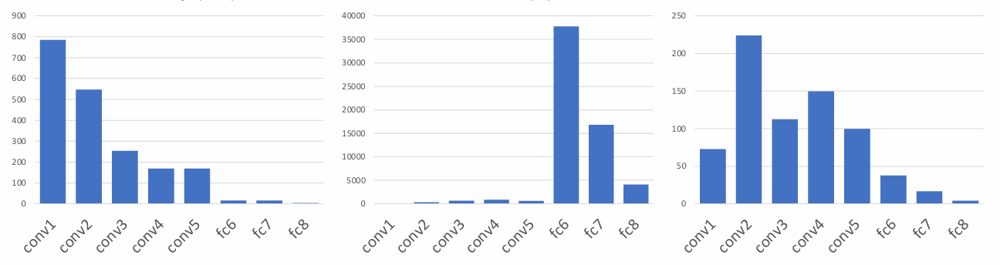{width=90%}
</figure>

- Most of the **memory usage** is in the early convolution layers

    因为在前面的卷积层中，我们需要存储大量的中间结果，而这些中间结果会占用大量的内存。

- Nearly all **parameters** are in the fully-connected layers

    卷积层中共用 filter，因此参数数量相对较少；而全连接层中每个神经元都有自己的参数，因此参数数量会很大。

- Most **floating-point operations** occur in the convolution layers

    卷积层中的计算量主要来自于卷积操作，每使用一次 filter 都需要进行大量的乘法和加法运算；而全连接层中的计算量主要来自于矩阵乘法。

## ZFNet

ZFNet 由 Matthew Zeiler 和 Rob Fergus 设计，它在 2013 年的 ImageNet 竞赛中获得了冠军。

ZFNet 实际上相当于更大的 AlexNet，它对 AlexNet 进行了一些调整，比如将第 1 个卷积层的 filter 大小从 11×11 减小到了 7×7，使其能够更好地捕捉图像的细节；将第 3、4、5 个卷积层的 filter 数量从 384、384、256 增加到了 512、1024、512，增加了模型的复杂度

ZFNet 的参数与 AlexNet 类似，都来自于大量的实验和调整，并没有一个一以贯之的思路和方法，但它的意义在于表明了增加网络的宽度和计算量可以提高网络的性能。

## VGG

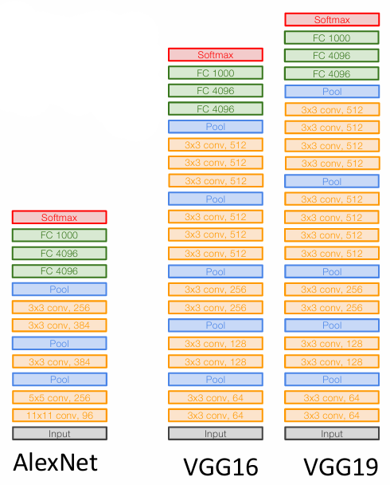{align=right width=30%}

VGG 是由牛津大学的 Visual Geometry Group 设计的深度卷积神经网络，以其简单、规整的结构而著称。

VGG 相较于前面两个网络而言，最大的特点在于它的结构非常规整，并且具有一个简单而统一的设计思路：

- 所有卷积层都使用 3×3 的 filter，stride 为 1，padding 为 1
- 所有的 MaxPooling 层都使用 2×2 的 filter，stride 为 2
- 每次卷积层的 filter 数量都是一样的，每经过一次 MaxPooling 层，filter 数量都会翻倍（深度加倍）
- 在神经网络的最后会使用若干个全连接层，最后一个全连接层的输出大小为 1000，对应于 ImageNet 数据集的 1000 个类别

VGG 有多种变体，最常见的是 VGG16 和 VGG19，分别包含 16 和 19 层的卷积层和全连接层。

### VGG Design Philosophy

<figure markdown="span">
    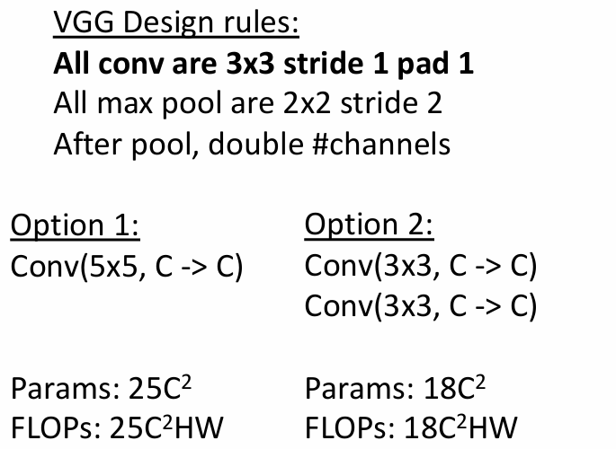{width=50%}
</figure>

VGG 全部使用 3×3 而非更大的 filter，因为计算发现

- 相较于使用 5×5 的 filter，使用两个 3×3 的 filter 可以做到具有同样大小的感受野
- 参数数量会从 $5^2 \times C^2 = 25 C^2$ 下降到 $2 \times 3^2 \times C^2 = 18 C^2$
- 所需要进行的浮点乘加运算也会从 $(5 \times 5 \times C) \times (H \times W \times C ) = 25 C^2 H W $ 下降到 $2 \times (3 \times 3 \times C) \times (H \times W \times C) = 18 C^2 H W$

这也可以递推到使用更多层的 3×3 filter 来替代单个大小更大的 filter。

<figure markdown="span">
    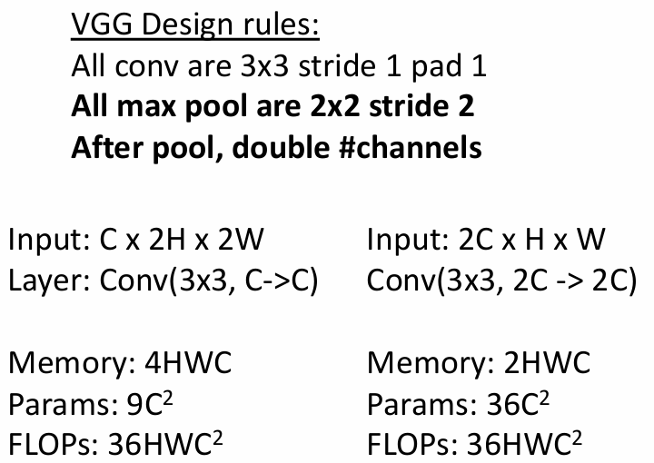{width=50%}
</figure>

池化会使得特征图的空间尺寸减半，因此在每次池化后，我们都会将特征图的深度翻倍，这样能够保证特征图的空间尺寸和深度都能够保持一定的平衡。并且可以在所需要的浮点计算量不变的情况下增加可学习参数的数量，从而增加网络的表达能力。

!!! note "AlexNet vs VGG 16"
    <figure markdown="span">
        {width=90%}
    </figure>

    从上图中我们可以很直观地看出 VGG 使用了比 AlexNet 更多的内存、参数，提升了所需要的计算量，这也说明更深、计算量更大的网络能够更好地捕捉、处理复杂的图像特征。

## GoogLeNet

GoogLeNet 的主要想法是在保证准确率的同时降低计算量，从而提高效率。

> Many innovations for efficiency: reduce parameter count, memory usage, and computation

### Stem Network

??? info
    <figure markdown="span">
        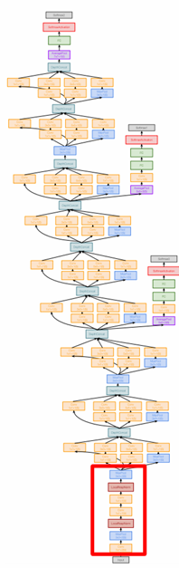{width=50%}
    </figure>

GoogLeNet 在最开始时会对输入的大数据进行激进的向下采样，将 3×224×224 的输入经过若干卷积层和最大池化层后处理为 192×28×28 的输出。

<figure markdown="span">
    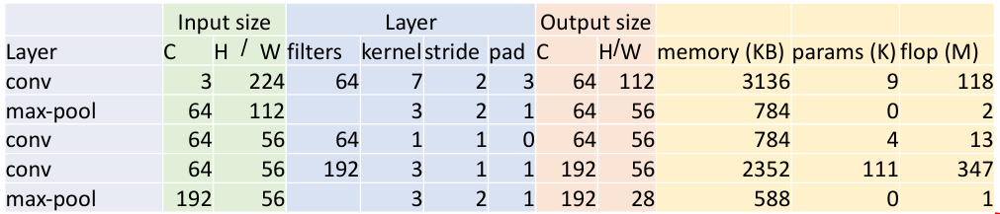{width=75%}
</figure>

### Inception Module

<figure markdown="span">
    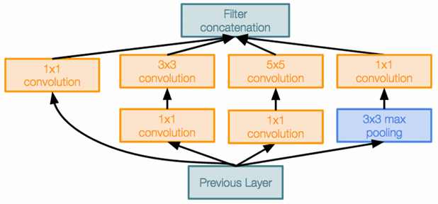{width=60%}
</figure>

GoogLeNet 还引入了名为 inception module 的模块，将其作为一个小单元在神经网络中反复使用。inception 模块允许在并行的情况下使用多种不同尺寸的 filter（例如 1x1、3x3、5x5）卷积，最后再将这些操作在 depth 维度上连接起来（需要使用 padding 来保证输出的大小一致），这有助于网络学习到更复杂的特征。

### Global Average Pooling

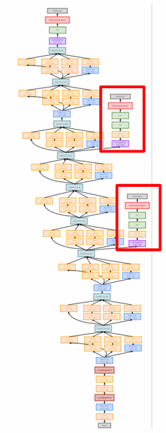{align=right width=20%}

GoogLeNet 不再像 AlexNet 和 VGG 那样在神经网络的末尾使用全连接层，它改用 global average pooling 来捕捉空间维度特征，并使用一个线性层来产生分类的分数。

<figure markdown="span">
    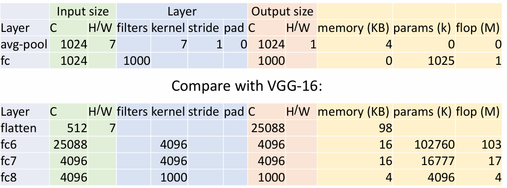{width=70%}
</figure>

### Auxiliary Classifiers

在当时还没有 batch normalization 的技术，因此在训练层数较大的神经网络时会出现梯度不能很好地反向传播等情况。为此，GoogLeNet 在网络中使用了若干个辅助分类器（auxiliary classifier），这些辅助分类器也会尝试对图像进行分类，并计算损失函数，以此来改善梯度传播的难题。

但自从有了 batch normalization 之后，这个技巧就不再被使用了。

## ResNet

ResNet 在 2015 年的 ImageNet 中取得了错误率仅 3.6% 的好成绩，并且层数达到了足足 152 层。

当时虽然有了 batch normalization，但是在训练深度超过 10 层的神经网络时，会发现更深的模型表现反而不如更浅的模型好，这是因为深层模型由于它相较于其它模型大得多，更难以训练，会出现**欠拟合**（underfitting）的情况。

<figure markdown="span">
    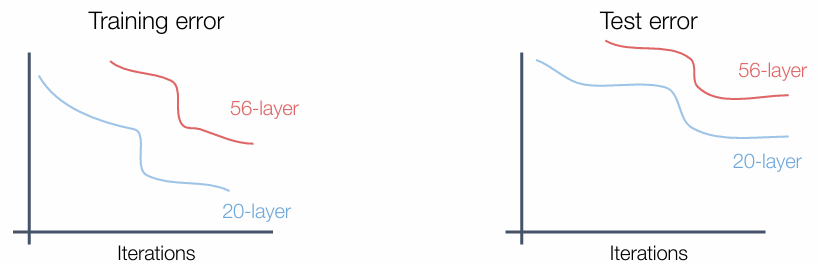{width=70%}
</figure>

理论上来说，更深的模型表现应该至少不差于比它更浅的模型——因为更深的模型可以在某些层做一些恒等变换（即输出和输入完全相同）来模拟浅模型的表现。但由于随着深度的增加，模型的参数和复杂度也将会增加，对模型的优化也会变得相当困难。

残差网络对于这个问题的解决办法是将所谓的 "plain" block 改进为 Residual Block，使其更容易学习到恒等函数，避免欠拟合的情况。

<figure markdown="span">
    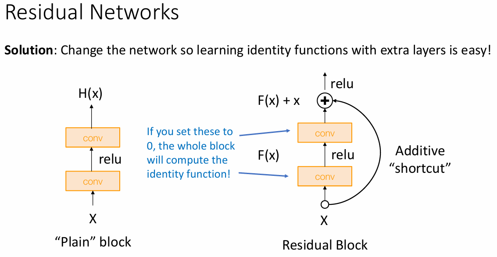{width=70%}
</figure>

残差块的核心思想是通过引入“跳跃连接”（skip connection），即某一层的输出可以跳过一部分层直接连接到后续的层中，这使其能直接学习输出与原始输入与之间的差异（即残差），这种跳跃的连接能让信息可以不受阻碍地向后传播，缓解了梯度消失的问题。

并且在反向传播时，残差连接可以直接将梯度从输出层传播到输入层，这保证即使网络深度增加，仍然能够有效地进行训练、优化。

<figure markdown="span">
    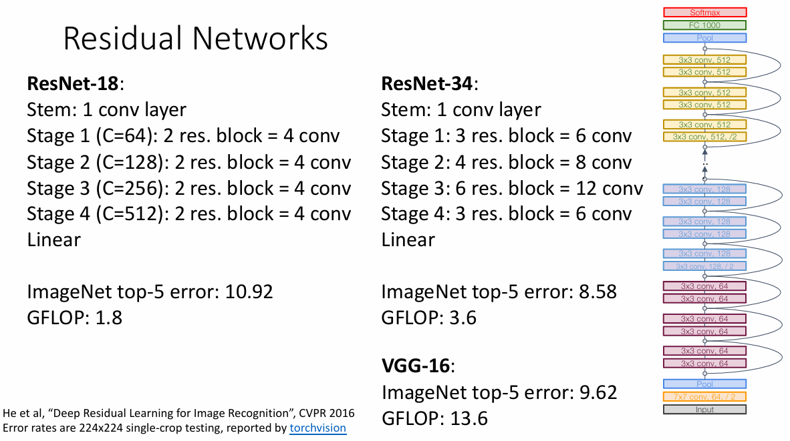{width=70%}
</figure>

> Like GoogLeNet, no big fully-connected-layers: instead use **global average pooling** and a single linear layer at the end.

<figure markdown="span">
    {width=70%}
</figure>

ResNet 除了使用上述的基本残差块之外，在训练深度大得多的网络是还使用了“瓶颈残差块”，用于在保证网络深度的情况下减少计算量和参数量。其结构如下

- 第一层（1x1卷积）：使用一个小的卷积核（1x1 卷积）将输入的通道数进行降维，以减少后续卷积的计算量。
- 第二层（3x3卷积）：对降维后的特征进行标准的卷积操作。
- 第三层（1x1卷积）：将 3x3 卷积后的输出再通过 1x1 卷积恢复为原来的维度，确保输出特征图的通道数与输入一致。
- 跳跃连接：将输入通过跳跃连接（shortcut connection）直接加到瓶颈块的输出上，形成残差学习。

!!! summary
    <figure markdown="span">
        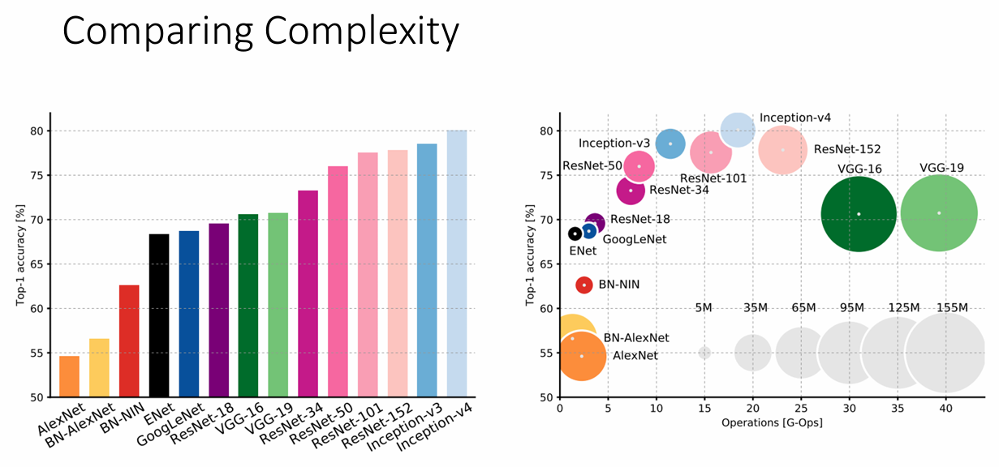{width=90%}
    </figure>    

    - 左图中纵轴表示准确率
    - 右图中横轴表示需要进行的浮点运算数，纵轴表示准确率，圆的半径表示可学习的参数数量

