# Training Neural Networks Ⅰ

??? abstract "Overview"
    1. One time setup
        - Activation functions
        - data preprocessing, 
        - weight initialization
        - regularization
    2. Training dynamics
        - Learning rate schedules
        - large-batch training 
        - hyperparameter optimization
    3. After training
        - Model ensembles
        - transfer learning

## Activation Functions

<figure markdown="span">
    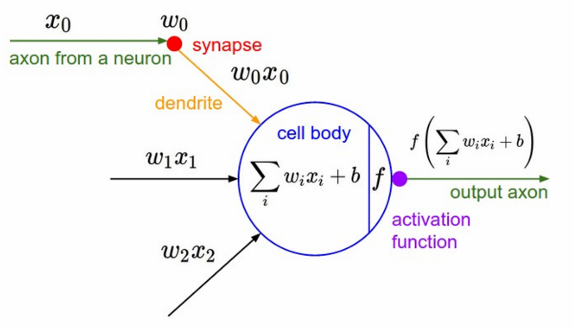{align=left width=45%}

    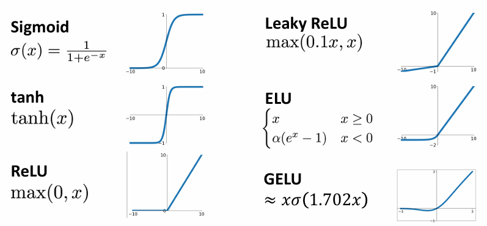{width=52%}
</figure>

### Sigmoid

$$ \sigma(x) = \dfrac{1}{1 + e^{-x}} $$

Sigmoid 函数的值域是 $(0, 1)$，它的导数是 $\sigma'(x) = \sigma(x)(1 - \sigma(x))$，曾经是神经网络中最流行的激活函数，但如今已经不再被推荐使用。

Sigmoid 函数有三个显著的问题：

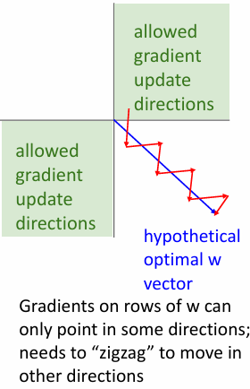{align=right width=20%}

1. **饱和性**：当输入 $x$ 很大或很小时，Sigmoid 函数的导数会变得很小，这会导致梯度消失，从而使得网络无法学习。
2. **非中心化**：Sigmoid 函数的输出是非中心化的，即输出的均值不是 0，这会导致后续层的输入分布发生偏移，从而使得网络的学习变得困难。
    - 由于 Sigmoid 函数的输出是 $(0, 1)$，因此它的导数的值域也是 $(0, 1)$，这会下游梯度的符号始终与上游梯度的符号一致，从而导致梯度的方向始终一致，这会使得网络的学习变得困难。

    但现在的神经网络通常会使用 Batch Normalization 层，这可以解决非中心化的问题，因此这已经不再是 Sigmoid 函数的主要问题。

3. **计算代价**：Sigmoid 函数需要进行指数运算，这会导致计算代价较高。

> 上述几个问题中，第一个问题是最严重的。

与 Sigmoid 函数类似的还有 Tanh 函数，它的值域是 $(-1, 1)$，可以视为 Sigmoid 经过拉伸和平移变换后的结果。它相较于 Sigmoid 函数有零中心化的优势，但仍然存在神经元饱和时梯度消失的问题。

### ReLU

<figure markdown="span">
    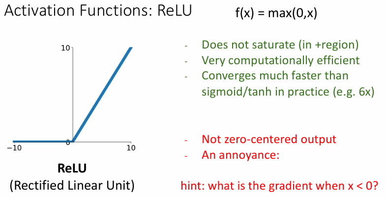{width=50%}
</figure>

ReLU 函数是目前最流行的激活函数，他的优点在于：

- 不会出现饱和性问题，因此不会导致梯度消失。
- 计算代价较低，只需要进行一次比较运算即可。
- 相较于 Sigmoid 和 Tanh 函数，ReLU 函数的收敛速度更快（大约是 6 倍）。

但 ReLU 函数也存在一些问题：

- 输出不是 zero-centered 的
- **Dead ReLU Problem**：当神经元的输出为负数时，梯度为 0，这会导致神经元永远不会被激活，从而导致神经元的输出永远为 0，即神经元死亡。

### ReLU Variants

ReLU 存在许多种变体，例如

- **Leaky ReLU**：$f(x) = \max(\alpha x, x)$，其中 $\alpha$ 是一个超参数，通常取 0.1 或 0.01。

    它改进了 ReLU 函数的 Dead ReLU Problem，使得输入小于 0 时，梯度不再为 0。

- **Parametric ReLU**：$f(x) = \max(\alpha x, x)$，相较于 Leaky ReLU，Parametric ReLU 的区别在于 $\alpha$ 是一个可在反向传播中学习的参数。

    <figure markdown="span">
        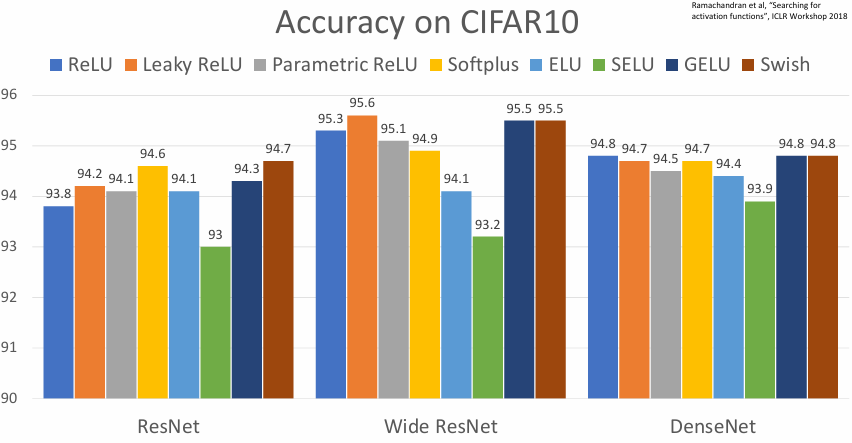{width=60%}
    </figure>

- **Exponential Linear Unit (ELU)**：比 Leaky ReLU 更加平滑，且对噪声更加稳定。

    $$ f(x) = \begin{cases}
        x & \text{if } x > 0 \\
        \alpha(e^x - 1) & \text{if } x \leq 0
    \end{cases} $$

- **Scaled Exponential Linear Unit (SELU)**：ELU 的变体，可以使得网络自我正则化。

    $$ f(x) = \lambda \begin{cases}
        x & \text{if } x > 0 \\
        \alpha(e^x - 1) & \text{if } x \leq 0
    \end{cases} $$

    其中 $\alpha = 1.6732632423$，$\lambda = 1.0507009873$（想知道这两个值是怎么来的，可以参考论文 [Self-Normalizing Neural Networks](https://arxiv.org/abs/1706.02515) 中足足 91 页的数学推导...）。

    它的特点在于能让深层的神经网络进行自我正则化，即使不使用 Batch Normalization 层也能保持网络的稳定性。

- **Gaussian Error Linear Unit (GELU)**：近似于高斯误差函数的激活函数。

    $$ X \sim N(0, 1) $$

    $$ f(x) = xP(X \leq x) = \dfrac{x}{2}(1 + erf(\dfrac{x}{\sqrt{2}})) \approx x\sigma(1.702x) $$

    - 主要思路是随机为输入乘以 0 或 1，越大的值更容易乘以 1，越小的值更容易乘以 0。（这个思路有点类似于 Dropout 层）
    - Take expectation over randomness. 即对输入进行随机采样，然后取期望。
    - 常用于 Transformer 模型中（如 BERT、GPT、ViT 等）。

!!! summary
    <figure markdown="span">
        {width=70%}
    </figure>

    从图中可以看出，实际上激活函数的选择并不会显著影响网络的性能，更换成其他激活函数可能只会带来不足 1% 的性能提升（只要你使用的不是 Sigmoid 或 Tanh）。

    - Don’t think too hard. Just use *ReLU*
    - Try out Leaky *ReLU / ELU / SELU / GELU* if you need to squeeze that last 0.1%
    - **Don’t use sigmoid or tanh**

## Data Preprocessing

<figure markdown="span">
    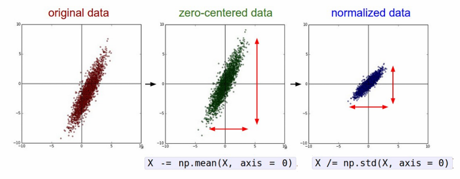{width=60%}
</figure>

我们直接从现实生活中收集到的数据通常不利于神经网络直接进行学习和训练，因此我们需要对数据进行预处理，例如零中心化（Zero-centering）、归一化（Normalization）等

<figure markdown="span">
    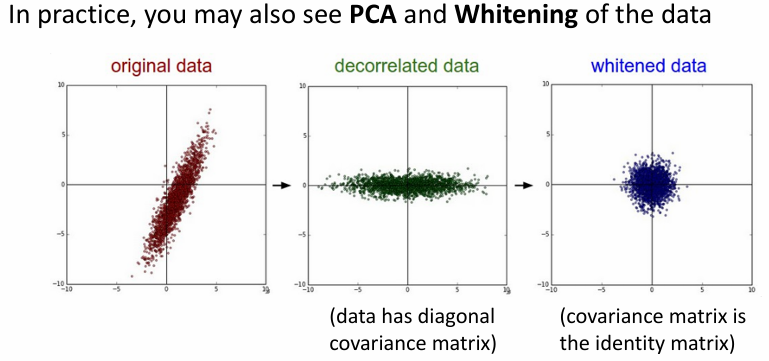{width=60%}
</figure>

有时我们还需要对数据通过 PCA 进行去相关化（Decorrelation）并进行白化（Whitening）。

总的来说，对数据进行预处理的目的是使得数据的分布更加符合神经网络的假设，避免网络对数据过于敏感，从而提高网络的泛化能力，也更容易进行学习和优化。

??? example
    <figure markdown="span">
        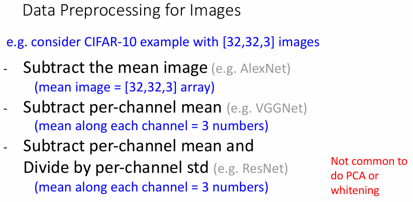{width=70%}
    </figure> 

## Weight Initialization

### Activation Statistics

权重作为一项可学习参数，对权重的初始化十分重要，不同的初始化方法会对网络的训练和性能产生显著的影响。

假设我们简单粗暴地让所有的权重和偏移都初始化为 0，即 $W = 0,\ b = 0$，那么计算得到的输出将全部都是 0，进而让所有的梯度都相同，这会导致网络无法学习。

如果我们让权重矩阵按均值为 0 的高斯分布进行随机初始化，那么它在较小的网络上可能会有良好的效果，但在较深的网络上可能会出现问题。

<figure markdown="span">
    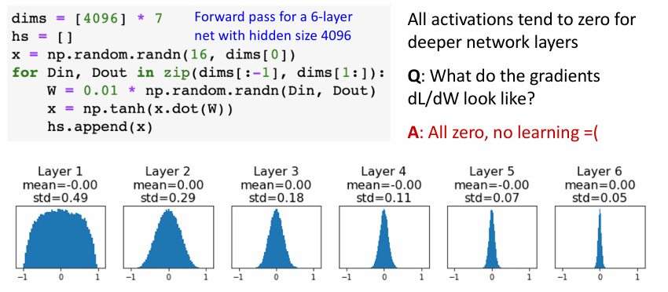{width=70%}
</figure>

例如这里我们使用 tanh 作为激活函数，以 0.01 作为标准差的高斯分布对权重进行初始化，那么我们可以看到随着数据在网络中传播，数据的标准差会逐渐减小，最终梯度矩阵的所有数据都会集中在 0 附近，这会导致梯度消失，从而使得网络无法学习。

<figure markdown="span">
    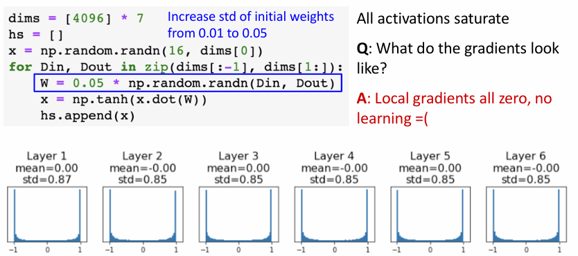{width=70%}
</figure>

如果我们把标准差调整为 0.05，那么数据的标准差会逐渐增大，最终梯度矩阵的数据会集中在 -1 和 1 附近，让局部梯度变为 0，这会导致梯度爆炸，从而使得网络无法学习。

### Xavier Initialization

对上述问题的一个解决方案是使用 Xavier 初始化，即让权重矩阵按均值为 0，方差为 $\dfrac{1}{\sqrt{D_{in}}}$ 的高斯分布进行随机初始化，其中 $D_{in}$ 是输入的维度。

如果我们使用的是 CNN，那么 $D_{in}$ 就是等于 $K^2 \times C$，其中 $K$ 是卷积核的大小，$C$ 是通道数。

<figure markdown="span">
    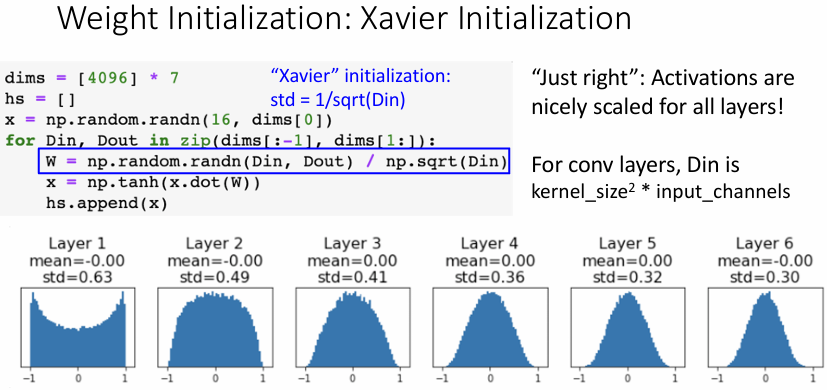{width=60%}
</figure>

对 Xavier 初始化的推导如下：

我们的目标是让输出的方差等于输入的方差，其中
$$ y = Wx \quad y_i = \sum_{j=1}^{D_{in}} x_j W_j $$

我们假设 $x$ 和 $W$ 都是独立同分布的，且均值为 0，方差为 $\sigma^2$，那么
$$ \begin{aligned}
    Var(y_i) & = D_{in} \cdot Var(x_i W_i) \\
    & = D_{in} \cdot (E(x_i^2)E(W_i^2) - E(x_i)^2E(W_i)^2) \\
    & = D_{in} \cdot Var(x_i) \cdot Var(W_i) \\
\end{aligned} $$

那么我们只需要让 $Var(W_i) = \dfrac{1}{D_{in}}$，就可以使得 $Var(y_i) = Var(x_i)$。

### Kaiming / MSRA Initialization

> MSRA 的意思是 Microsoft Research Asia，因为这个初始化方法是由微软亚洲研究院提出的。

如果我们使用的不是 tanh 或 sigmoid，而是 ReLU 或其变体，那么 Xavier 初始化就不再适用，因为此时梯度又会出现消失的问题。

<figure markdown="span">
    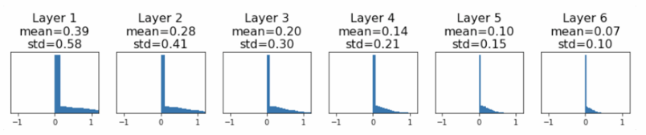{width=80%}
</figure>

这时候我们可以采用 Kaiming 初始化，即让权重矩阵按均值为 0，方差为 $\dfrac{2}{D_{in}}$ 的高斯分布进行随机初始化，这样一来神经网络就有能够较好地进行学习了。

<figure markdown="span">
    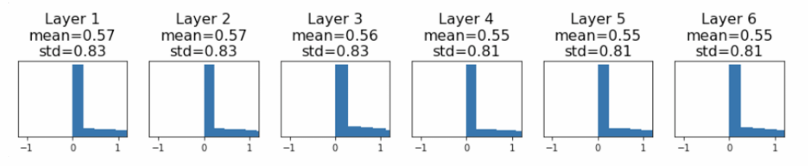{width=80%}
</figure>

!!! info "Residual Networks"
    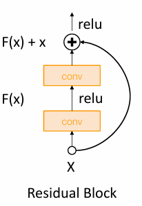{align=right width=20%}

    对于残差网络而言，如果我们直接使用 Kaiming 初始化，那么会导致网络的输出的方差会随着网络的深度增加而增加，即 $Var(F(x)) = Var(x)$，但 $Var(F(x)+x) > Var(x)$，这样一来输出的方差每经过一个残差块就会增加一次，最终会导致输出的方差过大。

    这个问题的解决方法是对第一个卷积层使用 MSRA 初始化，对第二个卷积层初始化为 0，这样就能保证 $Var(F(x)+x) = Var(x)$。

## Regularization

### Dropout

Dropout 是一种常用的正则化方法，它的思想是在训练过程中每进行一次前向传递，就随机让一部分神经元的输出为 0，这样一来就可以减少神经元之间的依赖关系，从而减少过拟合。

出现 dropping 的概率是一个超参数，通常取 0.5。

<figure markdown="span">
    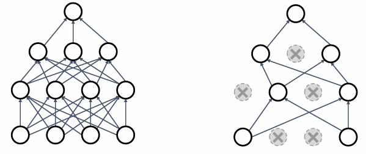{width=70%}
</figure>

使用 Dropout 的目的是让神经网络不要过于依赖某些特征，希望不同的神经元能学习到不同的特征，例如学习识别猫时，一部分神经元学习到它有尾巴，一部分神经元学习到它有耳朵，一部分神经元学习到它有爪子等，这样依赖在实际应用中即使没有观察到某些特征，也能利用其他特征进行识别。

在训练过程中我们会随机让一些神经元“掉落”，但在测试过程中我们会让所有的神经元都参与计算，因为我们显然不会希望在测试时网络的输出是随机的。那么我们就对所有可能的网络进行“平均”，这样一来就可以得到一个更加稳定的网络。

<figure markdown="span">
    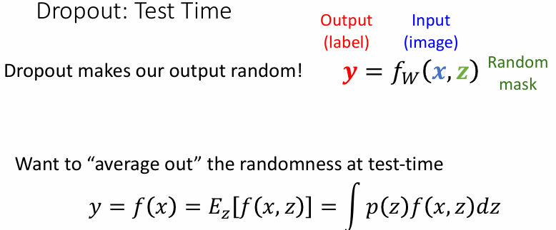{width=55%}
</figure>

上图的 $y = f_W(x, z)$ 表中 $x$ 表示输入的图像，$z$ 表示 Dropout 的掩码，即哪些神经元被“掉落”。

在实际测试时我们就需要对所有可能的 drop 的情况进行平均，即 $E_z[f(x, z)]$。

!!! example 
    <figure markdown="span">
        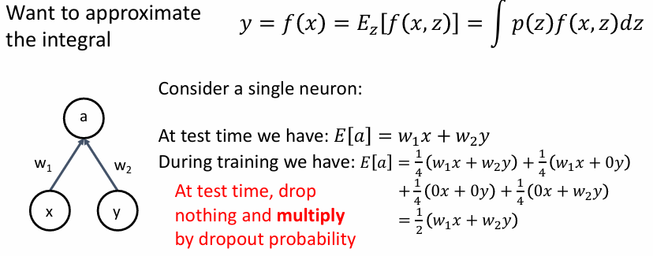{width=70%}
    </figure>

> dropout 通常使用在全连接层上，例如 AlexNet 和 VGG 就在他们的全连接层上使用了 dropout。但后来的神经网络架构（如 GoogleNet、ResNet 等）中使用全局平均池化替代了全连接层，因此就不再需要使用 dropout 了。

<figure markdown="span">
    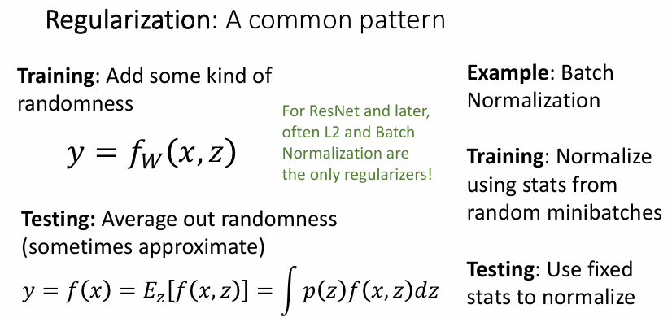{width=70%}
</figure>

### Data Augmentation

数据增强（Data Augmentation）是一种常用的正则化方法，它的思想是对原始数据进行一些随机的变换，从而增加数据的多样性，再训练网络。

常见的数据增强方法有：

- **水平翻转**：horizontally flip。

    <figure markdown="span">
        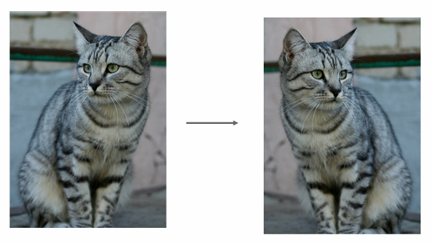{width=50%}
    </figure>

- **随机裁剪并缩放**：random crop and scale。

    <figure markdown="span">
        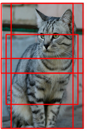{width=60%}
    </figure>

- **色彩抖动**：color jittering，将图像的 RGB 通道按照某种规则进行偏移。

    <figure markdown="span">
        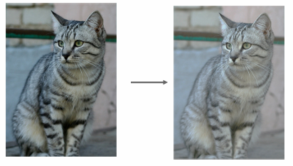{width=60%}
    </figure>

其他的数据增强方法还有旋转、平移、错切、锐化、模糊、加亮、加噪声等。

!!! note
    我们需要关注的是对图像的哪些改变不应该影响模型的输出，通过数据增强可以让模型学习到一些不变性，这需要我们对数据的特性有一定的了解，并对于不同的任务使用不同的数据增强方法。

### Other Regularization Methods

- DropConnect：随即将神经元之间的连接断开（即把权重设置为 0）。

    <figure markdown="span">
        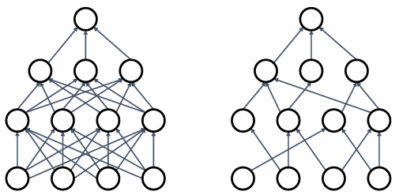{width=70%}
    </figure>

- Fractional Pooling：对池化层的大小进行随机的缩放（例如一些是 2x2，一些是 2x4），相当于让池化层的平均大小成为了一个分数。

    <figure markdown="span">
        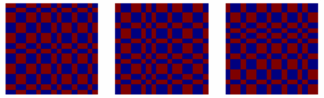{width=70%}
    </figure>

- Stochastic Depth：使用残差网络时，随机让一些残差块失效。

    <figure markdown="span">
        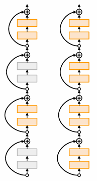{width=60%}
    </figure>

- CutOut：随机将图像中的一部分区域设置为 0 或随机的值。

    <figure markdown="span">
        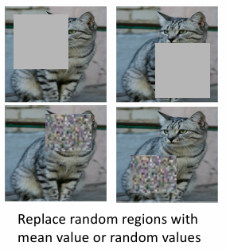{width=75%}
    </figure>

- MixUp：将两张图像按照一定的比例进行混合。

    <figure markdown="span">
        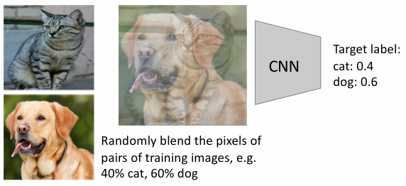{width=60%}
    </figure>

    <figure markdown="span">
        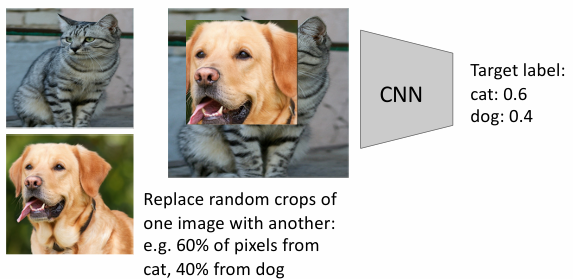{width=60%}
    </figure>

!!! summary
    - Use DropOut for large fully-connected layers
    - Data augmentation always a good idea
    - Use BatchNorm for CNNs (but not ViTs)
    - Try Cutout, MixUp, CutMix, Stochastic Depth, Label Smoothing to squeeze out a bit of extra performance 
