# Training Neural Networks Ⅱ

??? abstract "Overview"
    1. One time setup
        - Activation functions
        - data preprocessing, 
        - weight initialization
        - regularization
    2. Training dynamics
        - Learning rate schedules
        - large-batch training 
        - hyperparameter optimization
    3. After training
        - Model ensembles
        - transfer learning

## Training Dynamics

### Learning Rate Schedules

学习率在训练过程中是一个非常重要的超参数，它决定了模型在参数空间中的移动速度。通常来说，我们希望学习率在训练初期较大，以便快速收敛，而在训练后期逐渐减小，以便更精细地调整参数，这就需要我们对学习率进行调度。

<figure markdown="span">
    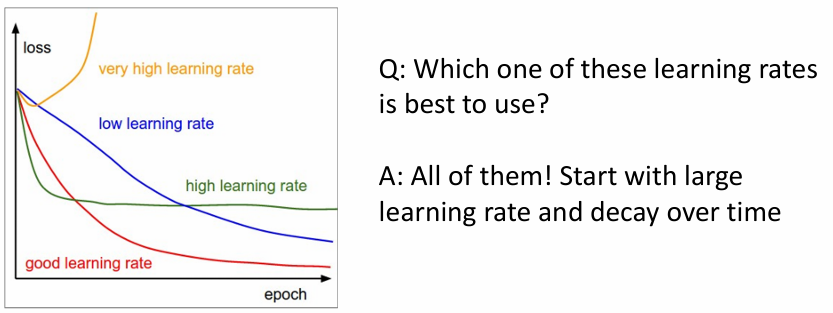{width=70%}
</figure>

学习率衰减的方式有很多种，常见的有：

- step：每隔一定的 epoch 或 iteration 就将学习率乘以一个因子，使其减小。

    <figure markdown="span">
        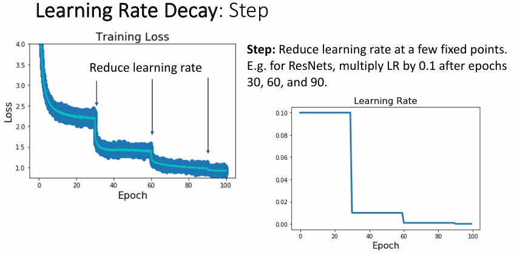{width=70%}
    </figure>

- cosine：学习率随着训练的进行而逐渐减小，最终趋近于 0，形状类似于余弦函数。

    $ \alpha_t = \dfrac{1}{2} \alpha_0 \left(1 + \cos\left(\dfrac{\pi t}{T}\right)\right) $

    <figure markdown="span">
        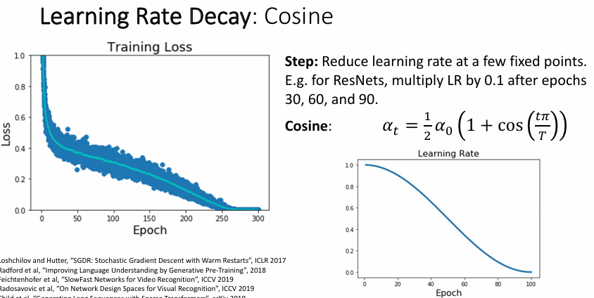{width=70%}
    </figure>

- linear：学习率随着训练的进行而线性减小。

    $ \alpha_t = \alpha_0 \left(1 - \dfrac{t}{T}\right) $

    <figure markdown="span">
        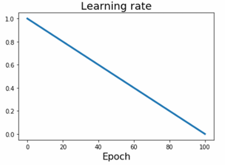{width=60%}
    </figure>

- inverse sqrt：学习率随着训练的进行而按照倒数平方根的方式减小。

    $ \alpha_t = \dfrac{\alpha_0}{\sqrt{t}} $

    <figure markdown="span">
        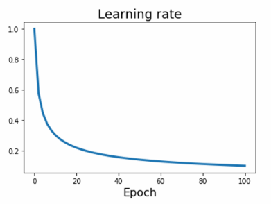{width=60%}
    </figure>

- constant：学习率保持不变。

    $ \alpha_t = \alpha_0 $

    <figure markdown="span">
        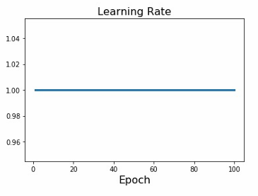{width=65%}
    </figure>

除此之外我们还需要确定的是我们应该训练多长时间。一般而言我们会对模型进行 early stopping，即记录模型在训练集和验证集上的快照，当验证集上的性能不再提升时停止训练。

<figure markdown="span">
    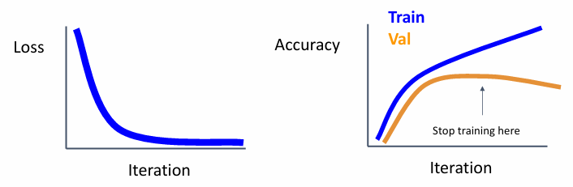{width=70%}
</figure>

### Choosing Hyperparameters

要找到最合适的超参数组合，我们通常有网格搜索（grid search）和随机搜索（random search）两种方法。

- 网格搜索：对每个超参数的可能取值进行排列组合，然后对每个组合进行训练
- 随机搜索：给定每个超参数的取值范围，在这些范围内随机选择超参数的取值，然后对每个组合进行训练

<figure markdown="span">
    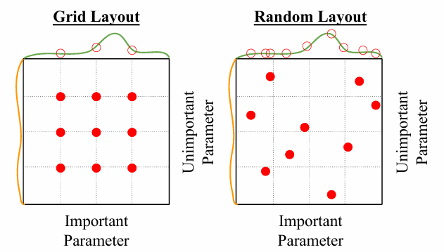{width=70%}
</figure>

这两种方法不仅能帮助我们找到较优的超参数组合，还能帮助我们观察那些超参数对于模型的性能影响较大，哪些相对而言不那么重要，从而帮助我们更好地理解模型并进行模型的调优。

更一般地，我们可以按照下面的方式来选择超参数，不断调试并训练我们的模型：

1. Check initial loss

    Turn off weight decay, sanity check loss at initialization
    e.g. log(C) for softmax with C classes

    关闭权重衰减，检查初始化时的损失是否合理，例如对于 softmax 分类器，我们应该检查初始时的损失是否为 $ \log(C) $，其中 C 是类别数。

2. Overfit a small sample

    尝试在一个小的训练数据集上过拟合模型，使其能达到 100% 的准确率，因为一个被正确设计的模型应当具有足够的容量来拟合任何一个小的数据集。这有助于我们检查我们的模型架构、学习率、权重初始化等是否正确，注意不要加入正则化项。

    - Loss not going down? LR too low, bad initialization
    - Loss explodes to Inf or NaN? LR too high, bad initialization

3. Find LR that makes loss go down

    Use the architecture from the previous step, use all training data, turn on small weight decay, find a learning rate that makes the loss drop significantly within 100 iterations

    常会尝试的学习率有：1e-1, 1e-2, 1e-3, 1e-4 等

4. Coarse grid, train for 1-5 epochs

    Choose a few values of learning rate and weight decay around what worked from Step 3, train a few models for 1-5 epochs.

    常会尝试的权重衰减比例有：1e-4, 1e-5，0 等

5.  Refine grid, train longer

    从第 4 步中选择表现最好的几个模型，然后在这些模型上进行更长时间的训练，通常会训练 10-20 个 epochs，期间不适用 learning rate decay。

6. Look at learning curves

    我们还需要记录训练过程中模型的表现数据，并绘制学习曲线，以便更好地找出存在的问题，例如：

    - 如果训练时 loss 在最开始时几乎不变，到了一定 epoch 才开始突然下降，就可能是初始化没有设置好

        <figure markdown="span">
            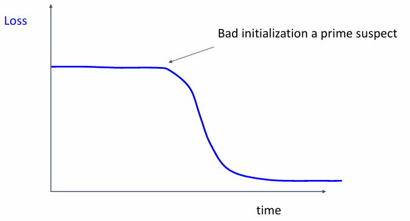{width=60%}
        </figure>    

    - 如果训练到了一定次数后 loss 就几乎不再下降，就可能需要尝试 learning rate decay

        <figure markdown="span">
            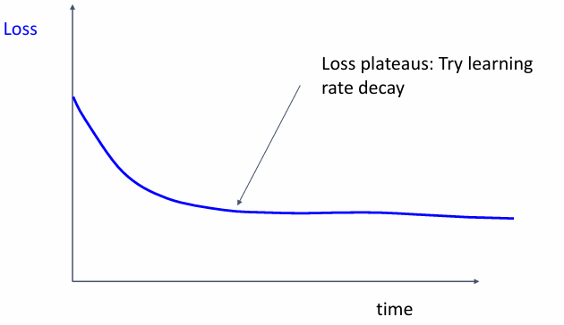{width=60%}
        </figure>

    - 如果在 loss 还在较快下降时采用 learning rate decay，就可能会导致此后 loss 下降速度变慢，这说明我们的 learning rate decay 的时机过早了，应该延后

        <figure markdown="span">
            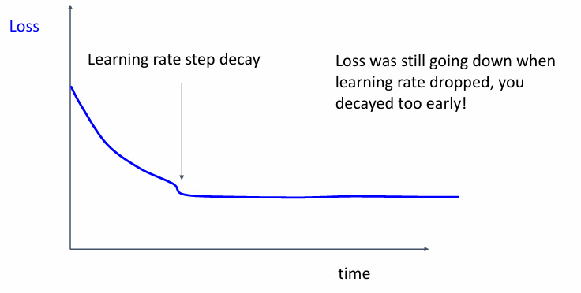{width=60%}
        </figure>

    - 如果训练时发现模型在训练集和验证集上的准确率有一定差距，但是二者都在不断上升，这说明我们的模型应该接着训练更长时间，
        <figure markdown="span">
            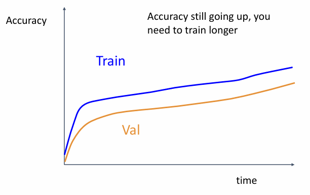{width=60%}
        </figure>

    - 如果训练时发现模型在训练集上的准确率很高，但在验证集上的准确率很低，甚至开始逐渐下降，这说明我们的模型过拟合了，应该尝试增加正则化项或者增加训练数据

        <figure markdown="span">
            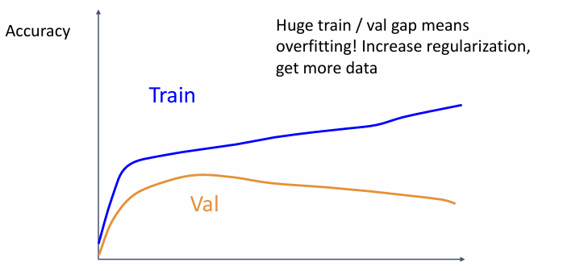{width=60%}
        </figure>

    - 如果训练时发现模型在训练集和验证集上的准确率几乎没有差距，即便它们的准确率都在不断升高，这也说明我们的模型是欠拟合的，我们可以增加训练时长、增大模型容量、采用更高的学习率等

        <figure markdown="span">
            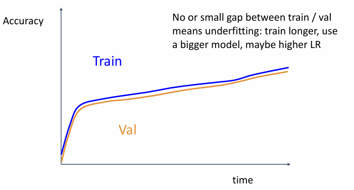{width=60%}
        </figure>

7. GOTO step 5

    回到步骤 5，不断尝试，直到找到最合适的超参数组合 ~~（或者直到你的论文截稿日期为止）~~

## After Training

### Model Ensembles

1. Train multiple independent models
2. At test time average their results

实际上就是在训练时采用不同的初始化、不同的超参数等，得到多个模型，然后在测试时将这些模型的结果进行平均。通常而言只能得到 2-3% 的性能提升，但是这种方法可以帮助我们更好地理解模型的不确定性。

Instead of training independent models, use multiple snapshots of a single model during training!

还有一种方法是，我们不需要分别训练多个独立的模型，而是在训练过程中记录模型的快照，然后在测试时将这些快照的结果进行平均。

> 我们可以使用 cyclic learning rate schedules 来训练模型，即在训练过程中周期性地调整学习率，这样可以帮助模型更好地泛化。

<figure markdown="span">
    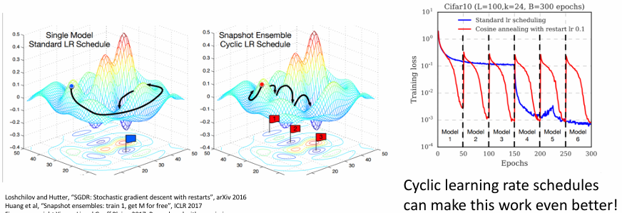{width=85%}
</figure>

### Transfer Learning

迁移学习（transfer learning）是指将一个模型在一个任务上训练好之后，将其应用到另一个任务上，从而大大减少训练时间和所需的计算资源。

<figure markdown="span">
    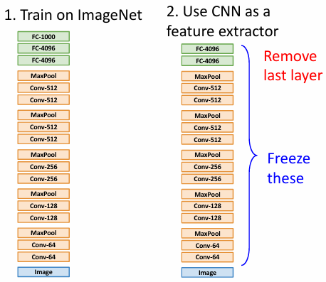{width=70%}
</figure>

比如我们可以先在 ImageNet 上训练得到一个卷积神经网络，这个网络首先将图像中的特征提取出来，然后使用最后一层全连接层进行分类。那么我们可以把最后的全连接层去掉，把剩余部分的参数“冻结”，视为一个特征提取器，然后在迁移到新的任务上时，我们只需要训练新的全连接层即可。

实践结果表明，迁移学习可以让我们在新任务上只需要很少的数据就能得到很好的性能。

<figure markdown="span">
    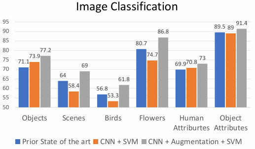{width=80%}
</figure>

<figure markdown="span">
    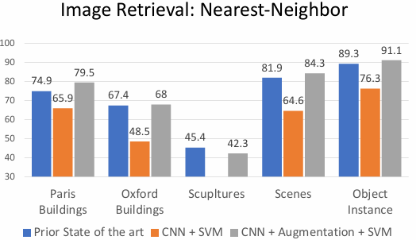{width=80%}
</figure>

> 这里的 Prior State of the art 表示先前在这个方向上表现最好的模型，通过比较我们可以看出迁移学习的作用是非常显著的。

对于一个更大的数据集，我们不仅可以训练最后一层分类器，也可以对整个网络中的特征提取部分进行微调，这样可以让模型更好地适应新的任务。

- Fine-tuning: train the entire network with a small learning rate

<figure markdown="span">
    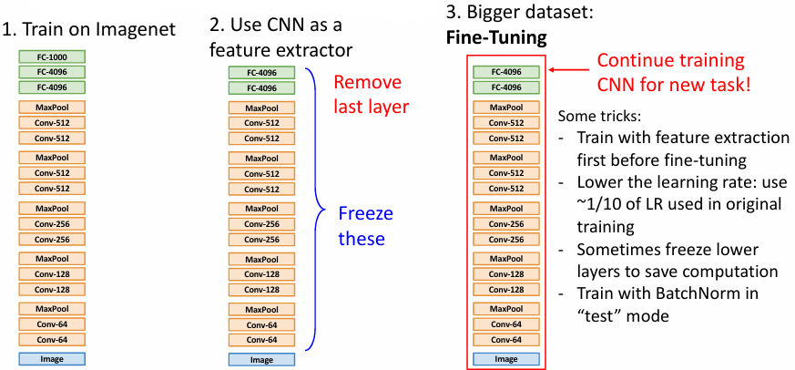{width=70%}
</figure>

!!! note
    <figure markdown="span">
        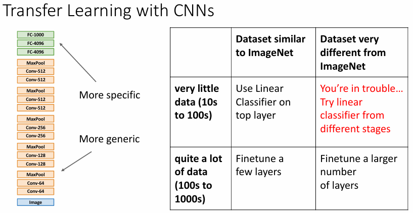{width=70%}
    </figure>   

    - 当我们的数据集和 ImageNet 数据集类似，并且数据量较小时，我们可以只训练最后一层分类器
    - 当我们的数据集和 ImageNet 数据集类似，但是数据量较大时，我们可以对网络的若干层进行微调
    - 当我们的数据集和 ImageNet 数据集不相似时，并且数据量较大时，我们可以对整个网络进行微调
    - 当我们的数据集和 ImageNet 数据集不相似时，并且数据量较小时，对预训练模型的微调或许也能提供一个不错的结果，但是这种情况下我们需要更多的实验来确定最佳的策略

> 当数据集较小时，预训练+微调通常比从头开始训练一个新模型表现更好；但如果我们拥有足够的数据，从头开始训练一个新模型也不妨一试。
