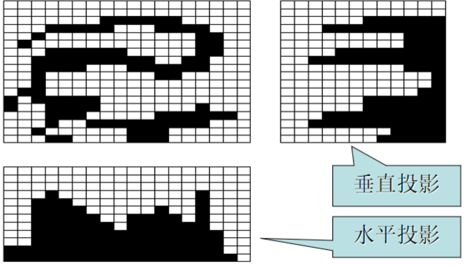
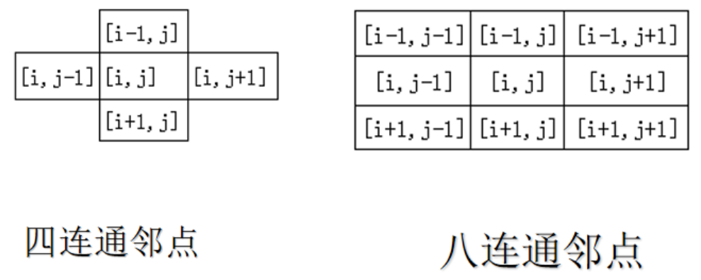
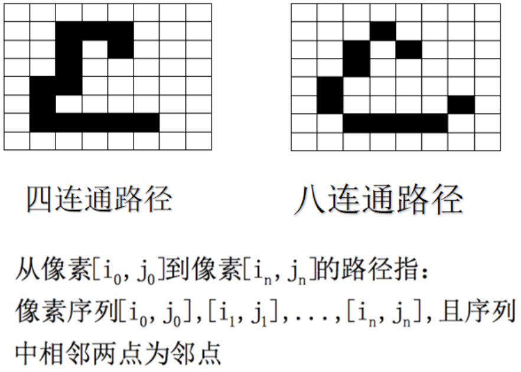
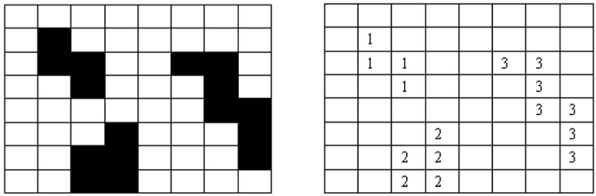
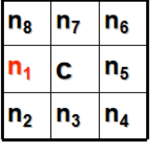

# 二值图像

!!! note "二值图像"
    二值图像是指每个像素只有 0 和 1 两种取值的图像。我们可以通过二值化把图像分为前景（1）和背景（0）两部分。

??? info "使用 OpenCV 二值化"
    我们可以使用 OpenCV 提供的现成的算法来进行二值化处理。

    ```python title="python"
    import cv2
    
    cv2.threshold(src, thresh, maxval, type)
    ```

    - `src`：输入图像，单通道灰度图像。
    - `thresh`：阈值，像素值大于该值的像素点会被设置为 `maxval`。
    - `maxval`：最大值，像素值大于 `thresh` 的像素点会被设置为该值。
    - `type`：阈值类型，常用的有以下几种：
        - `cv2.THRESH_BINARY`：二进制阈值化，像素值大于 `thresh` 的像素点会被设置为 `maxval`，否则设置为 0。
        - `cv2.THRESH_BINARY_INV`：反二进制阈值化，像素值小于 `thresh` 的像素点会被设置为 `maxval`，否则设置为 0。
        - `cv2.THRESH_TRUNC`：截断阈值化，像素值大于 `thresh` 的像素点会被设置为 `thresh`，否则不变。
        - `cv2.THRESH_TOZERO`：零阈值化，像素值小于 `thresh` 的像素点会被设置为 0，否则不变。
        - `cv2.THRESH_TOZERO_INV`：反零阈值化，像素值大于 `thresh` 的像素点会被设置为 0，否则不变。

    ```cpp title="cpp"
    void cv::threshold(
        InputArray src, 
        OutputArray dst, 
        double thresh, 
        double maxval, 
        int type)
    ```

    这里的各个参数含义与 python 中的类似。

## 几何特性

二值化不是我们的目的，它是我们研究图像的一种手段，例如我们可以使用二值图像来比较方便地计算图像的几何特性。

- 面积（零阶矩）
    $$ A = \sum_{x=0}^{W-1} \sum_{y=0}^{H-1} B[x,y] $$
- 区域中心（一阶矩）
    $$ \bar{x} = \frac{\sum\limits_{i=0}^{n-1} \sum\limits_{j=0}^{m-1} j B[i,j]}{A} $$
    $$ \bar{y} = - \frac{\sum\limits_{i=0}^{n-1} \sum\limits_{j=0}^{m-1} i B[i,j]}{A} $$
- 方向
    - 某些形状（例如圆形）是没有方向的
    - 假定物体是“长形”的，那么我们可以用长轴方向作为物体的方向
 
!!! note "求出物体的方向"
    要求出物体的方向，实际上就是找到一条直线，使得这个物体上各个像素到这条直线的距离之和最小。即最小化
    $$ \chi^2 = \sum_{i=0}^{n-1} \sum_{j=0}^{m-1} r_{ij}^2 B[i,j] $$
    其中 $r_{ij}$ 是像素 $(i,j)$ 到直线的距离。

    我们可以使用最小二乘法来求解这个问题。假设直线方程为
    $$ \rho = x\cos\theta + y\sin\theta $$
    其中 $\rho$ 是直线到原点的距离，$\theta$ 是直线的角度。

    于是我们就可以得到
    $$ r^2 = (x\cos\theta + y\sin\theta - \rho)^2 $$
    带入最上面的式子中，就得到
    $$ \chi^2 = \sum_{i=0}^{n-1} \sum_{j=0}^{m-1} (x_{ij}\cos\theta + y_{ij}\sin\theta - \rho)^2 B[i,j] $$
    其中 $x_{ij}$ 和 $y_{ij}$ 分别是像素 $(i,j)$ 的横坐标和纵坐标。
 
    现在我们可以使用最小二乘法来求解这个问题了。我们可以对 $\chi^2$ 关于 $\rho$ 求偏导数，并令其为 0，求解得到
    $$ \rho = (\bar{x}\cos\theta + \bar{y}\sin\theta)^2 $$
    这说明回归直线会经过物体的重心，把 $\rho$ 代入原式，则极小化问题就变为了
    $$ \chi^2 = a\cos^2\theta + b\cos\theta\sin\theta + c\sin^2\theta $$
    其中

    $$ \begin{aligned}
    & a = \sum_{i=0}^{n-1} \sum_{j=0}^{m-1} (x_{ij} - \bar{x})^2 B[i,j] \\
    & b = 2 \sum_{i=0}^{n-1} \sum_{j=0}^{m-1} (x_{ij} - \bar{x}) (y_{ij} - \bar{y}) B[i,j] \\
    & c = \sum_{i=0}^{n-1} \sum_{j=0}^{m-1} (y_{ij} - \bar{y})^2 B[i,j]
    \end{aligned} $$

    我们只需要微分求解 $\theta$ 就可以得到物体的方向了。
    $$ \sin 2\theta = \pm \frac{b}{\sqrt{b^2 + (a - c)^2}} $$
    $$ \cos 2\theta = \pm \frac{a - c}{\sqrt{b^2 + (a - c)^2}} $$

- 伸长率：
    $$ E = \dfrac{\chi_{max}}{\chi_{min}} $$
    其中 $\chi_{max}$ 和 $\chi_{min}$ 分别是物体的长轴和短轴长度。

    例如椭圆的伸长率就是长轴与短轴的比值

- 密集度
    $$ C = \dfrac{A}{p^2} $$
    其中 $p$ 是物体的周长，$A$ 是物体的面积。

    在给定周长的情况下，密集度越高，围成的面积就越大。不难知道 圆 > 正方形 > 长方形

- 形态比：区域的最小外接矩形的长与宽之比
- 欧拉数（亏格数，genus）：联通分量数减去图形中的洞的数量
    $$ E = C - H $$

常用的距离度量有：

- 欧几里得距离 (Euclidean Distance)：两点之间的直线距离：
    $$ d = \sqrt{\sum_{i=1}^n (x_i - y_i)^2} $$

- 曼哈顿距离 (Manhattan Distance)：两点之间的绝对坐标差之和：
    $$ d = \sum_{i=1}^n |x_i - y_i| $$

- 棋盘距离，即切比雪夫距离 (Chebyshev Distance)：两点之间的最大坐标差值：
    $$ d = \max_i |x_i - y_i| $$
    
    棋盘距离也被称为国王距离，因为在国际象棋中，国王的移动方式正是基于这种距离度量。

- 闵可夫斯基距离 (Minkowski Distance) $L_p$：是欧几里得距离和曼哈顿距离的广义形式，定义为：
    $$ d = \left( \sum_{i=1}^n |x_i - y_i|^p \right)^{\frac{1}{p}} $$
    其中 $p$ 是一个参数，当 $p=2$ 时，闵可夫斯基距离即为欧几里得距离；当 $p=1$ 时，即为曼哈顿距离；当 $p \to \infty$ 时，即为棋盘距离。

## 投影计算

给定一条直线，用垂直该直线的一簇等间距直线将一幅二值图像分割成若干条，使用直方图的形式来表示每条中值为 1 的像素数量。

<figure markdown="span">
    {width=60%}
</figure>

除了水平投影和垂直投影之外，还有**对角线投影**。

假设对角线的标号可以通过行号和列号的仿射变换得到，即 $d = ai + bj + c$，其中 $i \in [0, n-1],\ j \in [0, m-1]$。

由于对角线投影共对应 $n+m-1$ 个条，仿射变换会把右上角像素映射成对角线投影的第一个位置，左下角像素会背影设成最后一个像素，那么我们就有
$$ a \cdot 0 + b(m-1) +c = 1 $$
$$ a(n-1) + b \cdot 0 + c = n + m - 1 $$
$$ a = -b $$

解得 $d = i - j + m$

## 连通区域标记

### 定义

!!! info "临点与连通性"
    <figure markdown="span">
        {width=50%}
    </figure>    

    <figure markdown="span">
        {width=50%}
    </figure>
 
!!! definition "连通"
    己知像素 $p,q \in S$,如果存在一条从 $p$ 到 $q$ 的路径且路径上全部像素都包含在 $S$ 中,称 $p$ 与 $q$ 是连通的

    连通性是等价关系，对属于 $S$ 的任意三个像素 $p,q,r$，有下列性质:

    1. 像素 $p$ 与 $q$ 本身连通 (自反性)
    2. 如果 $p$ 与 $q$ 连通,则 $q$ 与 $p$ 连通 (互换性)
    3. 如果 $p$ 与 $q$ 连通且 $q$ 与 $r$ 连通,则 $p$ 与 $r$ 连通 (传递性)

    **连通分量**：相互连通的像素组成的集合

### 连通分量标记算法

**递归算法**：

1. 扫描图像，找到没有标记的一个前景点（即像素值为 1），分配标记 $L$
2. 递归分配标记 $L$ 给该点的邻点
3. 如果不存在没标记的点，则停止
4. 返回第 1 步

<figure markdown="span">
    {width=65%}
</figure>

**序贯算法**（以四连通为例）：

1. 从左至右、从上到下扫描图像
2. 如果像素点值为 1，则（分 4 种情况）
    - 如果上面点和左面点有且仅有一个标记，则复制这一标记
    - 如果两点有相同标记，复制这一标记
    - 如果两点有不同标记，则复制上点的标记且将两个标记输入等价表中作为等价标记
    - 否则（两点都没有标记）给这一个像素点分配一新的标记并将这一标记输入等价表
3. 如果需要考虑更多点，则返回 2 
4. 在等价表的每一等价集中找到最低的标记
5. 扫描图像，用等价表中的最低标记取代每一标记

这里我们提到的等价表用于记录哪些不同标号的连通分量实际上是连在一起的，也就是说这些不同标记的连通分量实际上同属于同一个大的连通分量

> 这是比较原始的连通分量标记方法，常用于分辨率较低的图像

### 区域边界跟踪算法

{align=right width=20%}

> c：当前点（在边界上），b：当前点的邻域点（不在边界上）

1. 从左到右、从上到下扫描图像，找到区域边界 $S$ 的一个起始点
    $$ s(k) = (x(k), y(k)),\ k=0 $$
2. 用 $c$ 表示当前边界上被跟踪的像素点，置 $c=s(k)$，即 $c$ 的左临点为 $b$，$b \in \bar{S}$
3. 从 $b$ 开始，按逆时针标记 $c$ 的 8 个临点分别为 $n_1, n_2, \cdots, n_8$，并且令 $k = k+1$
4. 从 $b$ 开始，按逆时针方向寻找第一个属于区域边界 $S$ 的 $n_i$
5. 令 $c = s(k) = n_i,\ b = n_{i-1}$
6. 重复步骤 3、4、5，直到 $s(k) = s(0)$，即回到边界起始点

> 简单来说，就是边界上的一个点开始，按逆时针方向不断标记所有的边界点
