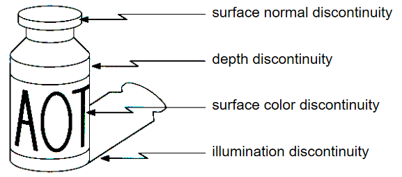
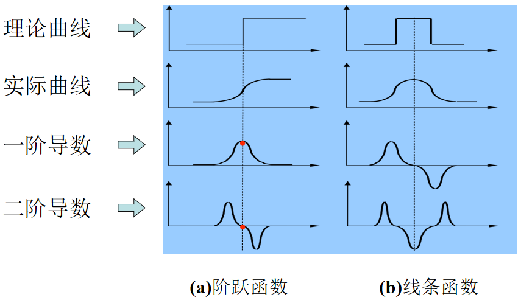
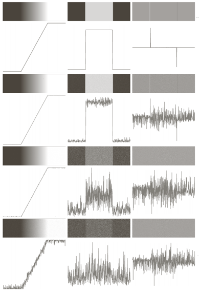
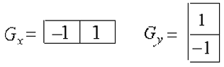
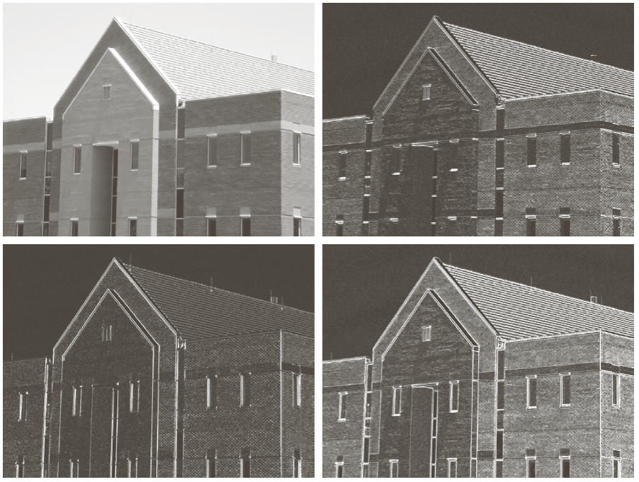
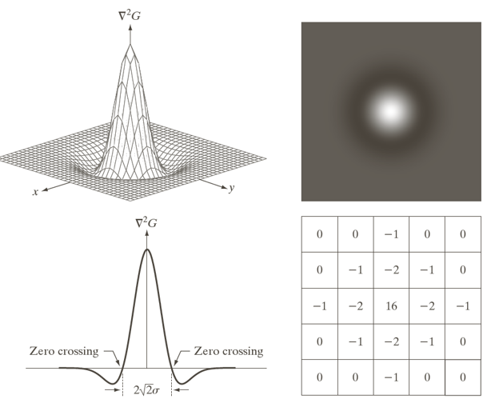
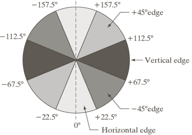

# 边缘检测

## 边缘及边缘检测概念

**边缘检测的目的**：识别图片中的显著变化（不连续性）

- 直观上来说，大部分语义和形状信息都可以通过边缘来表示
- 信息量比像素值更密集

**边缘**：指图像中灰度值变化较大的地方，通常是物体的轮廓、纹理等，包括但不限于：

- 表面法线的不连续性
- 图片深度的不连续性
- 表面颜色的不连续性
- 光照强度的不连续性

<figure markdown="span">
    {width=65%}
</figure>

!!! info "边缘"
    <figure markdown="span">
        {width=55%}
    </figure>

    从上图中我们可以看到，图像灰度值函数的导数可以反映灰度变化的显著程度，边缘可以认为是一阶导数的局部极大值点，或二阶导数的过零点。

<figure markdown="span">
    {width=55%}
</figure>

上图中我们可以左侧表示图像的灰度值变化趋势，中间表示一阶导数，右侧表示二阶导数。

我们可以观察到当图像中存在噪声时，一阶导数和二阶导数会出现较大的波动，严重影响边缘检测的效果。因此我们需要对图像进行平滑处理，去除噪声。

## 用模板实现卷积

- 模板（template/kernel/filter）：一个使用矩阵表示的算子，通常是一个奇数大小的矩阵（如3x3、5x5等），用于在图像上滑动并计算加权平均值。
- 卷积（convolution）：将模板在图像上滑动，并在每个位置计算模板与图像的加权平均值，得到新的图像。卷积操作可以用于平滑、锐化、边缘检测等任务。

> 具体怎么卷积就不啰嗦了

## 基于一阶导数的边缘检测

- 梯度：图像对应的二维函数的一阶导数
    $$ G(x,y) = \begin{bmatrix} G_x \\\\\\\\ G_y \end{bmatrix} = \begin{bmatrix} \frac{\partial I}{\partial x} \\\\\\\\ \frac{\partial I}{\partial y} \end{bmatrix} $$
- 梯度的幅值：表示图像中灰度变化的显著程度

    在数学上我们常用的是欧几里得范数来表示梯度的幅值，即
    $$ |G(x,y)| = \sqrt{G_x^2 + G_y^2} $$
    但由于平方操作和开方操作会增加计算量，因此我们通常会使用其他方法来表示梯度的幅值，例如使用曼哈顿范数来表示梯度的幅值，即
    $$ |G(x,y)| = |G_x| + |G_y| $$
    或者使用最大值来表示梯度的幅值，即
    $$ |G(x,y)| \approx \max(|G_x|, |G_y|) $$

- 梯度方向：函数最大变化率的方向
    $$ a(x,y) = \arctan(\dfrac{G_y}{G_x}) $$

在图像处理中，我们会使用差分来近似偏导数
$$ G_x = I(x+1,y) - I(x,y) $$
$$ G_y = I(x,y) - I(x,y+1) $$
这相当于使用下面两个卷积模板来计算

<figure markdown="span">
    {width=55%}
</figure>

!!! info "其他的边缘检测算子"
    - Roberts算子：
        $$ G_x = \begin{bmatrix} 1 & 0 \\\\ 0 & -1 \end{bmatrix} $$
        $$ G_y = \begin{bmatrix} 0 & -1 \\\\ 1 & 0 \end{bmatrix} $$
    - Sobel算子：
        $$ G_x = \begin{bmatrix} -1 & 0 & 1 \\\\ -2 & 0 & 2 \\\\ -1 & 0 & 1 \end{bmatrix} $$
        $$ G_y = \begin{bmatrix} 1 & 2 & 1 \\\\ 0 & 0 & 0 \\\\ -1 & -2 & -1 \end{bmatrix} $$
    - Prewitt算子：
        $$ G_x = \begin{bmatrix} -1 & 0 & 1 \\\\ -1 & 0 & 1 \\\\ -1 & 0 & 1 \end{bmatrix} $$
        $$ G_y = \begin{bmatrix} 1 & 1 & 1 \\\\ 0 & 0 & 0 \\\\ -1 & -1 & -1 \end{bmatrix} $$

??? example "Sobel算子实例"
    <figure markdown="span">
        {width=65%}
    </figure>

    上图是对左上角的原始图像分别进行水平和垂直方向的边缘检测，然后把两者结合起来得到的结果

## 基于二阶导数的边缘检测

在二维情况下，我们可以使用拉普拉斯算子来表示二阶导数
$$ \nabla^2 I(x,y) = \frac{\partial^2 I}{\partial x^2} + \frac{\partial^2 I}{\partial y^2} $$
注意到

$$ \begin{aligned}
\frac{\partial^2 I}{\partial x^2} &= \frac{\partial G_x}{\partial x} \\\\
&= \frac{\partial \left( I(x+1,y) - I(x,y) \right)}{\partial x} \\\\
&= \frac{\partial I(x+1,y)}{\partial x} - \frac{\partial I(x,y)}{\partial x} \\\\
&= (I(x+1,y) - I(x,y)) - (I(x,y) - I(x-1,y)) \\\\
&= I(x+1,y) - 2I(x,y) + I(x-1,y)
\end{aligned} $$

同理，我们可以得到
$$ \frac{\partial^2 I}{\partial y^2} = I(x,y+1) - 2I(x,y) + I(x,y-1) $$
于是我们得到了拉普拉斯算子
$$ \nabla^2 I(x,y) = I(x+1,y) + I(x-1,y) + I(x,y+1) + I(x,y-1) - 4I(x,y) $$
也可以表示为卷积模板的形式
$$ \nabla^2 = \begin{bmatrix} 0 & 1 & 0 \\\\ 1 & -4 & 1 \\\\ 0 & 1 & 0 \end{bmatrix} $$

### LoG 边缘检测算法

> LoG：Laplacian of Gaussian

LoG 算法就是把高斯平滑和拉普拉斯算子结合起来，先对图像进行高斯平滑处理，然后再进行拉普拉斯算子卷积。

- 平滑滤波器是高斯滤波
- 采用拉普拉斯算子计算二阶导数．
- 边缘检测判据是二阶导数零交叉点并对应一阶导数的较大峰值
- 使用线性内插方法在子像素分辨率水平上估计边缘的位置

!!! info "高斯平滑滤波"
    高斯平滑滤波器是一个二维高斯函数，表示为：
    $$ G(x,y) = \frac{1}{2\pi\sigma^2} e^{-\frac{x^2 + y^2}{2\sigma^2}} $$
    其中 $\sigma$ 是高斯函数的标准差，控制平滑程度。

    例如，高斯函数的卷积模板可以表示为：
    $$ G = \begin{bmatrix} 1 & 4 & 6 & 4 & 1 \\\\ 4 & 16 & 24 & 16 & 4 \\\\ 6 & 24 & 36 & 24 & 6 \\\\ 4 & 16 & 24 & 16 & 4 \\\\ 1 & 4 & 6 & 4 & 1 \end{bmatrix} $$

把高斯滤波器和拉普拉斯算子结合起来，我们可以得到 LoG 算子

$$ \begin{aligned}
h(x,y) &= \nabla^2 [g(x,y) \times I(x,y)] \\\\
&= [\nabla^2 g(x,y)] \times I(x,y)
\end{aligned} $$

其中 $g(x,y)$ 是高斯函数，$I(x,y)$ 是图像，$\nabla^2$ 是拉普拉斯算子。

!!! tip
    下面两种方法是等价的，因此我们可以使用把上面的公式进行交换

    - 图像先与高斯函数卷积，再求卷积结果的拉普拉斯微分
    - 先求高斯函数的拉普拉斯微分，再与图像卷积

并且
$$ \nabla^2 g(x,y) = \left( \frac{x^2 + y^2 - 2\sigma^2}{\sigma^4} \right) e^{-\frac{x^2 + y^2}{2\sigma^2}} $$
最终得到的 LoG 算子因为形状类似于一顶草帽，所以也叫做“墨西哥草帽”算子。

<figure markdown="span">
    {width=65%}
</figure>

??? note "OpenCV 中的相关函数" 
    - C++ 版本

        ```cpp
        void cvLaplace(
            CvArr *src, 
            CvArr *dst, 
            int aperture_size=3
        );
        ```

    - Python 版本

        ```python
        cv2.Laplacian(
            src, 
            ddepth, 
            ksize=3, 
            scale=1, 
            delta=0, 
            borderType=cv2.BORDER_DEFAULT
        )
        ```

        - `src`：输入图像
        - `ddepth`：输出图像的深度，通常设置为 `cv2.CV_16S` 或 `cv2.CV_64F`
        - `ksize`：Sobel算子的大小，通常设置为 3 或 5
        - `scale`：缩放因子，默认为 1
        - `delta`：加到结果上的值，默认为 0
        - `borderType`：边界处理方式，默认为 `cv2.BORDER_DEFAULT`

## Canny 边缘检测

Canny 边缘检测算法是一个多阶段的边缘检测算法，主要包括以下几个步骤：

1. 高斯平滑：使用高斯滤波器对图像进行平滑处理，去除噪声。
2. 计算梯度：使用一阶偏导有限差分（Sobel 算子）计算图像的梯度幅值和方向。
3. 非极大值抑制（NMS）：对梯度幅值进行非极大值抑制，保留局部最大值，去除非边缘点。
4. 双阈值处理：使用两个阈值对边缘进行分类，强边缘、弱边缘和非边缘。
    - 当边缘的强度大于阈值时才会被视为真正的边缘，阈值太低会导致出现假边缘，阈值太高又会导致部分轮廓丢失
    - 首先连接高阈值边缘图，出现断点时，在低阈值边缘图中的 8 邻点域中寻找边缘点与它连接起来

!!! note "NMS"
    非极大值抑制（NMS）是指在梯度幅值图像中，保留局部最大值，去除非边缘点。

    具体来说，
    
    - 对于每个像素点，计算其梯度方向，将其离散为圆周的 4 个扇区（0°、45°、90°、135°）之一，便于用 3×3 的窗口做抑制操作。
    - 接着在该方向上查找相邻的两个像素点，如果当前像素点的梯度幅值大于这两个像素点的梯度幅值，则保留当前像素点，否则将其设置为 0。

    <figure markdown="span">
        {width=65%}
    </figure>

    NMS 的效果如下，可以看到经过处理后图像的边缘变得更加细致、清晰了

    <center>
        
        
    </center>

??? note "OpenCV 中的相关函数"
    在 OpenCV 中也有相关的函数可以直接调用：

    - C++ 版本：

        ```cpp
        void cv::Canny(
            InputArray image, // 输入图像
            OutputArray edges, // 输出的边缘图像
            double threshold1, // 低阈值
            double threshold2, // 高阈值
            int apertureSize = 3, // Sobel 算子的核大小
            bool L2gradient = false // 是否使用 L2 范数计算梯度幅值，默认使用 L1 范数
        );
        ```

        使用示例如下：

        ```cpp
        #include <opencv2/opencv.hpp>
        using namespace cv;

        int main() {
            Mat src = imread("image.jpg", IMREAD_GRAYSCALE);
            Mat edges;
            Canny(src, edges, 100, 200, 3, false);
            imshow("Edges", edges);
            waitKey(0);
            return 0;
        }
        ```

    - Python 版本

        ```python
        cv2.Canny(
            image, # 输入图像
            threshold1, # 低阈值
            threshold2, # 高阈值
            edges=None, # 输出的边缘图像
            apertureSize=3, 
            L2gradient=False
        )
        # 返回值为处理得到的边缘图像
        ```

        使用示例如下：

        ```python
        import cv2

        src = cv2.imread("image.jpg", cv2.IMREAD_GRAYSCALE)
        edges = cv2.Canny(src, 100, 200, apertureSize=3, L2gradient=False)
        cv2.imshow("Edges", edges)
        cv2.waitKey(0)
        cv2.destroyAllWindows()
        ```